# 数据处理

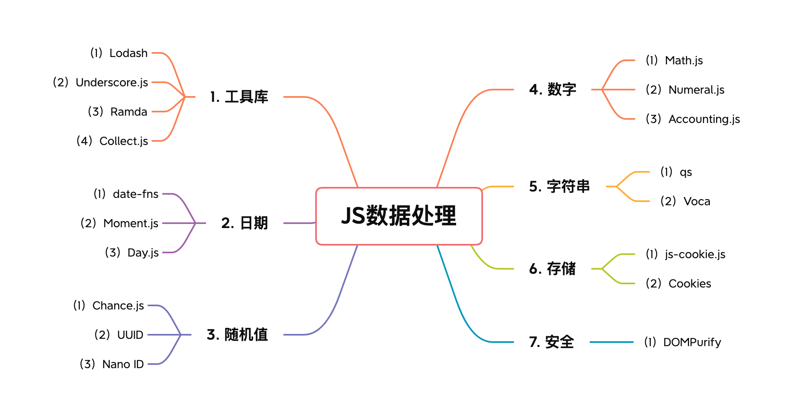

## 1. 工具库
### （1）Lodash
Lodash是一个一致性、模块化、高性能、提高开发者效率的JavaScript 实用工具库。Lodash 通过降低 array、number、objects、string 等等的使用难度从而让 JavaScript 变得更简单。 Lodash 的模块化方法，非常适用于：

+ 遍历 array、object 和 string；
+ 对值进行操作和检测；
+ 创建符合功能的函数。

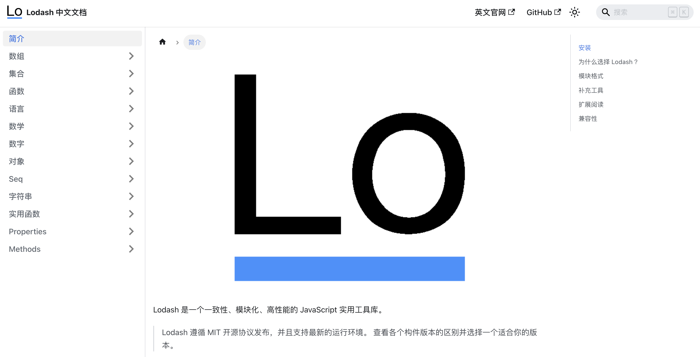

**Github：**[https://github.com/lodash/lodash](https://github.com/lodash/lodash)

### （2）Underscore.js
Underscore.js 是一个实用的 JavaScript 工具库，它提供了一整套函数式编程的实用功能，但没有扩展任何 JavaScript 内置对象，而是将数据封装在一个自定义对象中。

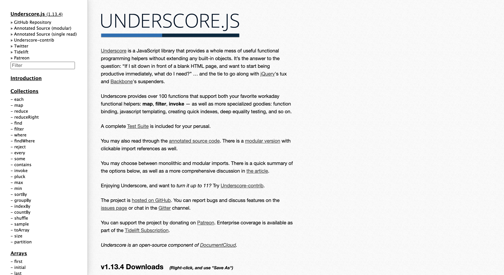

**Github：**[https://github.com/jashkenas/underscore](https://github.com/jashkenas/underscore)

### （3）Ramda
Ramda 的目标是专门为函数式编程风格而设计，更容易创建函数式 pipeline、且从不改变用户已有数据。Ramda 主要特性如下：

+ Ramda 强调更加纯粹的函数式风格。数据不变性和函数无副作用是其核心设计理念。这可以帮助你使用简洁、优雅的代码来完成工作。
+ Ramda 函数本身都是自动柯里化的。这可以让你在只提供部分参数的情况下，轻松地在已有函数的基础上创建新函数。
+ Ramda 函数参数的排列顺序更便于柯里化。要操作的数据通常在最后面。

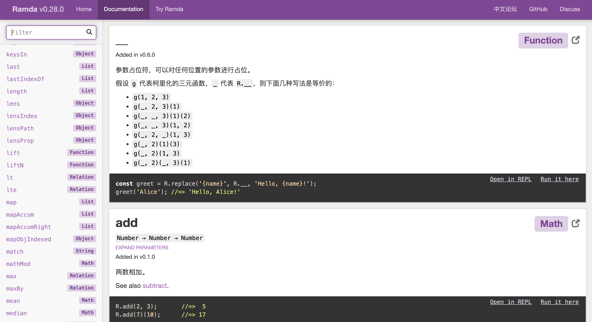

**Github：**[https://github.com/ramda/ramda](https://github.com/ramda/ramda)

### （4）Collect.js
collect.js是 JavaScript 处理数组和对象的方便且无依赖的包装类工具。其提供了常用的数组和集合的操作API，map，reduce，filter 等集合的高级方法，设计灵感来源于 Laravel Collection。

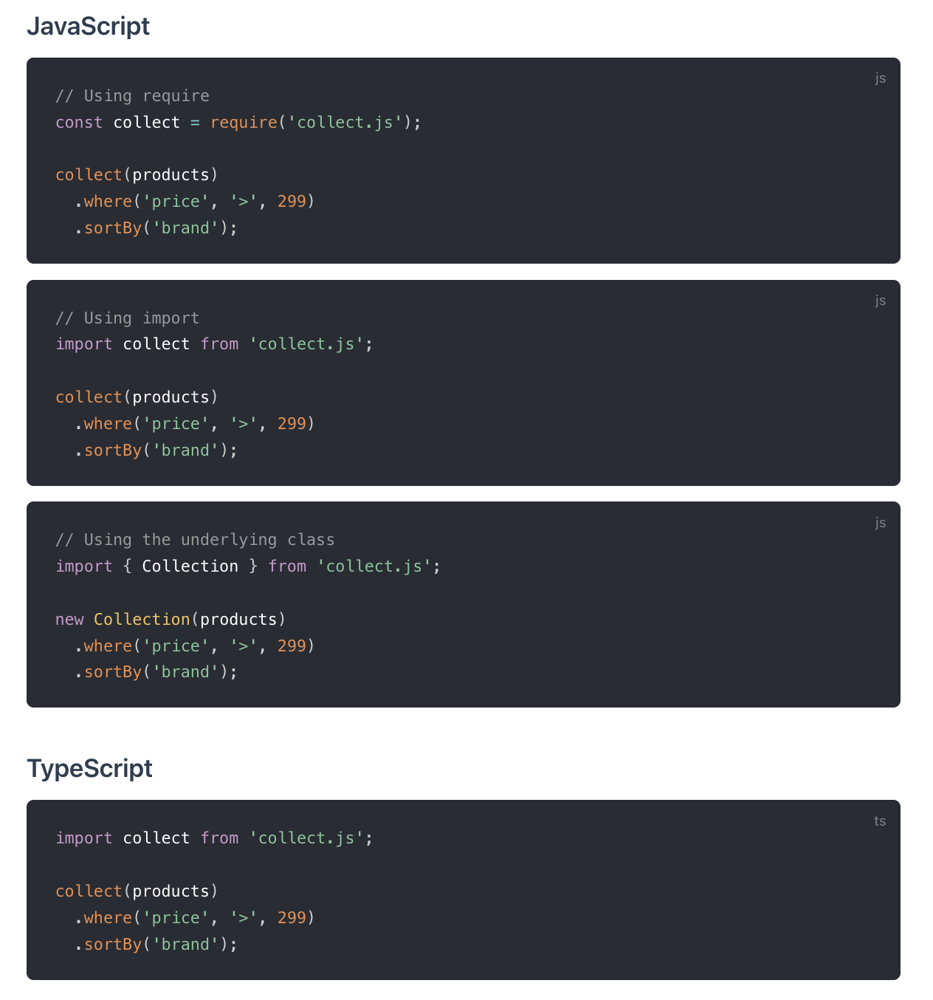

**Github：**[https://github.com/ecrmnn/collect.js/](https://github.com/ecrmnn/collect.js/)

## 2. 日期
### （1）date-fns
date-fns 是一个现代的 JavaScript 日期工具类库，提供了最全面、最简单和一致的工具集，用于在浏览器和 Node.js 中操作 JavaScript 日期。其具有以下特性：

+ **模块化**：根据需求选择需要引用的模块
+ **不可变**：date-fns 使用纯函数构建，并且始终返回一个新的日期实例，而不是更改传递的日期实例。它允许防止错误并跳过长时间的调试会话
+ **可信赖**：遵循语义版本，始终向后兼容
+ **快速**：轻量快速，为用户提供最佳的使用体验
+ **TypeScript & Flow**：date-fns 同时支持 Flow 和 TypeScript

```javascript
import { format, formatDistance, formatRelative, subDays } from 'date-fns'

format(new Date(), "'Today is a' eeee")
//=> "Today is a Saturday"

formatDistance(subDays(new Date(), 3), new Date(), { addSuffix: true })
//=> "3 days ago"

formatRelative(subDays(new Date(), 3), new Date())
//=> "last Friday at 7:26 p.m."
```

**Github：**[https://github.com/date-fns/date-fns](https://github.com/date-fns/date-fns)

### （2）Moment.js
Moment.js 是一个简单易用的轻量级 JavaScript 日期处理类库，提供了日期格式化、解析、验证等功能。它支持在浏览器和 NodeJS 两种环境中运行。此类库能够将给定的任意日期转换成多种不同的格式，具有强大的日期计算功能，同时也内置了能显示多样的日期形式的函数。

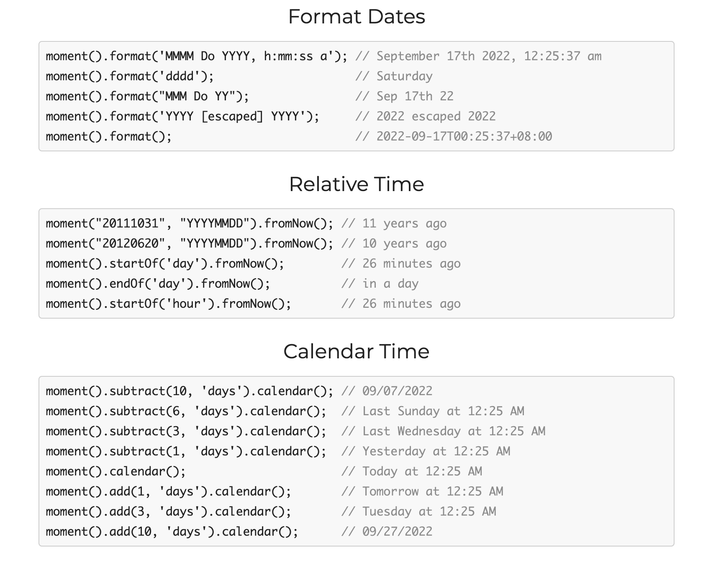

**Github：**[https://github.com/moment/moment/](https://github.com/moment/moment/)

### （3）Day.js
Day.js是一个极简的JavaScript库，可以为现代浏览器解析、验证、操作和显示日期和时间。其具有以下特点：

+ 和 Moment.js 相同的 API 和用法
+ 不可变数据 (Immutable)
+ 支持链式操作 (Chainable)
+ 国际化 I18n
+ 仅 2kb 大小的微型库
+ 全浏览器兼容

```javascript
dayjs().format();                                     // 2020-09-08T13:42:32+08:00
dayjs().format('YYYY-MM-DD');                         // 2020-09-08
dayjs().format('YYYY-MM-DD HH:mm:ss');                // 2020-09-08 13:47:12
dayjs(1318781876406).format('YYYY-MM-DD HH:mm:ss');   // 2011-10-17 00
```

**Github：**[https://github.com/iamkun/dayjs/](https://github.com/iamkun/dayjs/)

## 3. 随机值
### （1）Chance.js
Chance 是一个轻量级的 JavaScript 随机字符串生成器插件，可帮助减少编写单调的代码，特别是在编写自动化测试时经常需要各种随机内容。可以使用它来产生随机数、字符、字符串、名字、地址、骰子等。

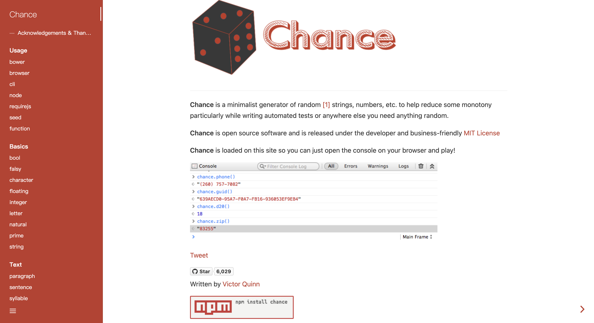

**Github：**[https://github.com/chancejs/chancejs](https://github.com/chancejs/chancejs)

### （2）UUID 
UUID 是一个用于在 JavaScript 中生成符合 RFC 的 UUID 的实用程序库。其具有以下特点：

+ **完整**：支持 RFC4122 版本 1、3、4 和 5 UUID
+ **跨平台**：支持CommonJS、ECMAScript 模块和 CDN 构建；Node 12, 14, 16, 18；Chrome、Safari、Firefox、Edge 浏览器；Webpack 和 rollup.js 模块打包工具；
+ **安全**：加密强度高的随机值
+ **体积小**：零依赖，占用空间小
+ **CLI**：包括 uuid 命令行实用程序

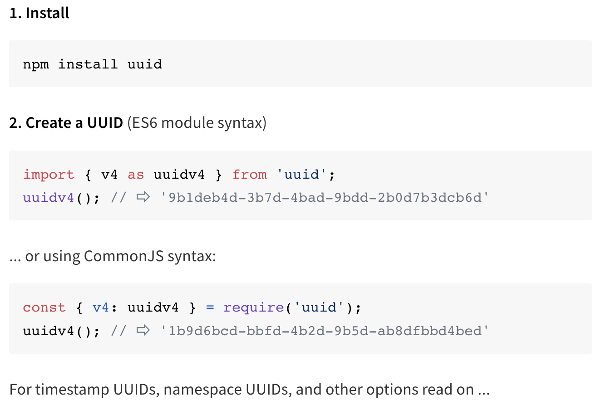

**Github：**[https://github.com/uuidjs/uuid](https://github.com/uuidjs/uuid)

### （3）Nano ID
nanoid 是一个小巧、安全、URL友好、唯一的 JavaScript 字符串ID生成器。其具有以下特性：

+ **小巧.** 130 bytes (已压缩和 gzipped)。 没有依赖。 Size Limit 控制大小。
+ **快速.** 它比 UUID 快 60%。
+ **安全.** 它使用加密的强随机 API。可在集群中使用。
+ **紧凑.** 它使用比 UUID（A-Za-z0-9_-）更大的字母表。 因此，ID 大小从36个符号减少到21个符号。
+ **易用.** Nano ID 已被移植到 20种编程语言。

```javascript
import { nanoid } from 'nanoid'
model.id = nanoid() //=> "V1StGXR8_Z5jdHi6B-myT"
```

**Github：**[https://github.com/ai/nanoid](https://github.com/ai/nanoid)

## 4. 数字
### （1）Math.js
Math.js 是一个强大的 JavaScript 和 Node.js 数学库。它具有支持符号计算的灵活表达式解析器，带有大量内置函数和常量，并提供了一个集成的解决方案来处理不同的数据类型，如数字、大数、复数、分数、单位和矩阵。功能强大且易于使用。

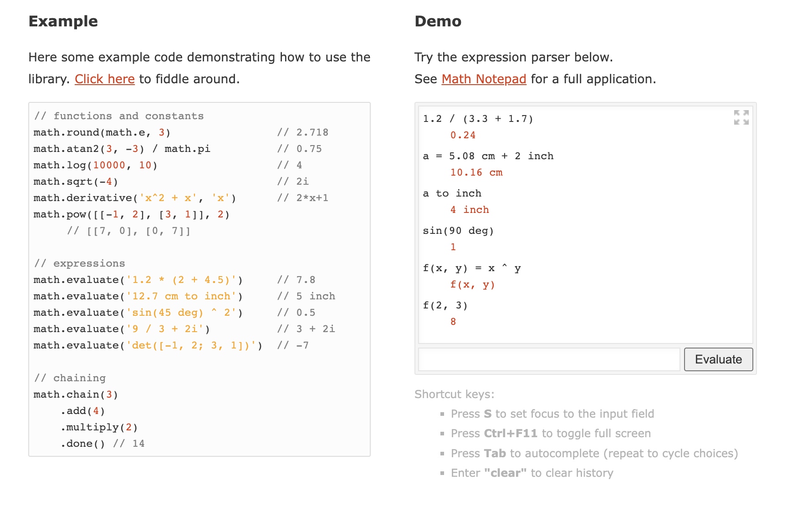

**Github：**[https://github.com/josdejong/mathjs](https://github.com/josdejong/mathjs)

### （2）Numeral.js
<font style="color:rgb(51, 51, 51);">Numeral.js 是一个用来对数值进行操作和格式化的 JS 库。</font><font style="color:rgb(18, 18, 18);">可将数字格式化为货币、百分比、时间，甚至是序数词的缩写（比如1st，100th）。</font>

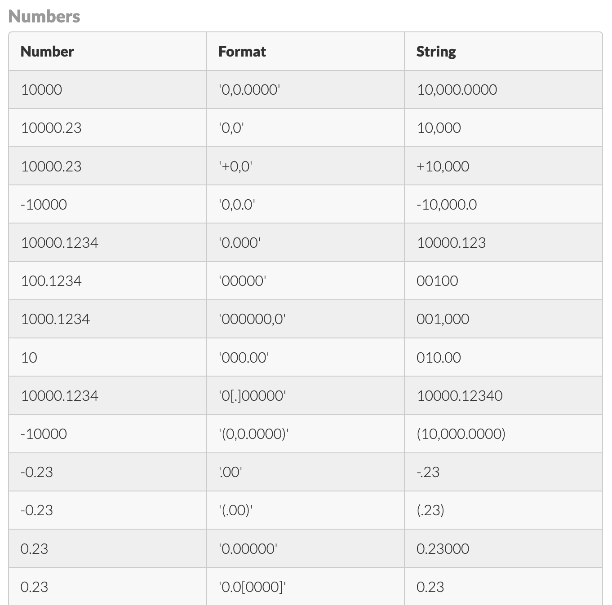

**Github：**[https://github.com/adamwdraper/Numeral-js](https://github.com/adamwdraper/Numeral-js)

### （3）Accounting.js
<font style="color:rgb(77, 77, 77);">Accounting.js </font><font style="color:rgb(36, 41, 47);">是一个用于数字、货币和货币解析/格式化的小型 JavaScript 库。它是轻量级的，完全可本地化的，没有依赖关系，并且在客户端或服务器端都可以很好地工作。使用独立或作为 nodeJS/npm 和 AMD/requireJS 模块。</font>

```javascript
// Default usage:
accounting.formatMoney(12345678); // $12,345,678.00

// European formatting (custom symbol and separators), can also use options object as second parameter:
accounting.formatMoney(4999.99, "€", 2, ".", ","); // €4.999,99

// Negative values can be formatted nicely:
accounting.formatMoney(-500000, "£ ", 0); // £ -500,000

// Simple `format` string allows control of symbol position (%v = value, %s = symbol):
accounting.formatMoney(5318008, { symbol: "GBP",  format: "%v %s" }); // 5,318,008.00 GBP
```

**Github：**[https://github.com/openexchangerates/accounting.js](https://github.com/openexchangerates/accounting.js)

## 5. 字符串
### （1）qs
qs是一个url参数转化（parse和stringify）的JavaScript库。可以把格式化的字符串转换为对象格式。

```javascript
var qs = require('qs');
var assert = require('assert');

var obj = qs.parse('a=c');
assert.deepEqual(obj, { a: 'c' });

var str = qs.stringify(obj);
assert.equal(str, 'a=c');
```

**Github：**[https://github.com/ljharb/qs](https://github.com/ljharb/qs)

### （2）Voca
<font style="color:rgb(36, 41, 47);">Voca 是一个用于操作字符串的 JavaScript 库。</font>Voca 库提供了有用的函数来使字符串操作更加舒适：更改大小写、修剪、填充、slugify、拉丁化、sprintfy、截断、转义等。模块化设计允许加载整个库或单个函数以最小化应用程序构建。该库经过全面测试、有据可查并长期受支持。

```javascript
v.camelCase('bird flight');              // => 'birdFlight'
v.sprintf('%s costs $%.2f', 'Tea', 1.5); // => 'Tea costs $1.50'
v.slugify('What a wonderful world');     // => 'what-a-wonderful-world'
```

**Github：**[https://github.com/panzerdp/voca](https://github.com/panzerdp/voca)

## 6. 存储
### （1）js-cookie.js
js-cookie.js 是一个<font style="color:rgb(36, 41, 47);background-color:rgb(246, 248, 250);">用于处理浏览器 cookie 的简单、轻量级 JavaScript API。其具有以下特点：</font>

+ 适用于所有浏览器
+ 接受任何字符
+ 经过大量测试
+ 无依赖
+ 支持ES模块
+ 支持 AMD/CommonJS
+ 符合RFC 6265
+ 有用的维基
+ 启用自定义编码/解码
+ < 800 字节压缩！

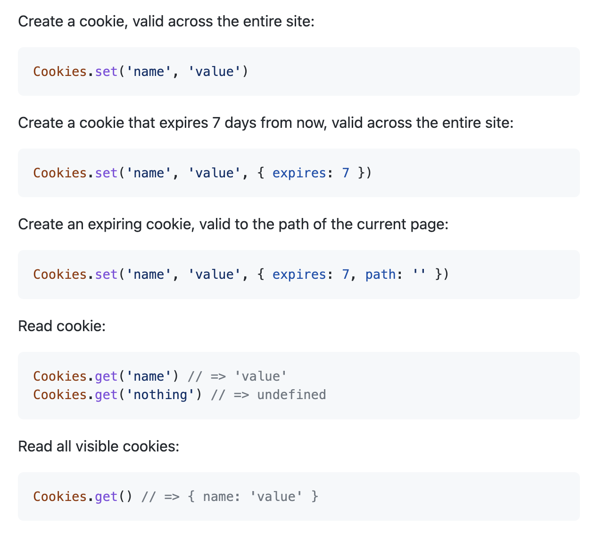

**Github：**[https://github.com/js-cookie/js-cookie](https://github.com/js-cookie/js-cookie)

### （2）Cookies
<font style="color:rgb(36, 41, 47);">Cookies 是一个用于获取和设置 HTTP(S) cookie的</font>node.js模块。它的特点如下：

+ 允许使用Keygrip来签署cookie，以防止篡改；
+ 延迟验证cookie，以降低成本；
+ 不允许通过不安全的套接字发送安全cookies；
+ 默认情况下，所有cookie都仅适用于HTTP，并且通过SSL发送的cookie是安全的；
+ 允许其他库在不知道签名机制的情况下访问 cookie。

```javascript
var http = require('http')
var Cookies = require('cookies')

// Optionally define keys to sign cookie values
// to prevent client tampering
var keys = ['keyboard cat']

var server = http.createServer(function (req, res) {
  // Create a cookies object
  var cookies = new Cookies(req, res, { keys: keys })

  // Get a cookie
  var lastVisit = cookies.get('LastVisit', { signed: true })

  // Set the cookie to a value
  cookies.set('LastVisit', new Date().toISOString(), { signed: true })

  if (!lastVisit) {
    res.setHeader('Content-Type', 'text/plain')
    res.end('Welcome, first time visitor!')
  } else {
    res.setHeader('Content-Type', 'text/plain')
    res.end('Welcome back! Nothing much changed since your last visit at ' + lastVisit + '.')
  }
})

server.listen(3000, function () {
  console.log('Visit us at http://127.0.0.1:3000/ !')
})
```

**GitHub：**[https://github.com/pillarjs/cookies](https://github.com/pillarjs/cookies)

## 7. 安全
### （1）DOMPurify
DOMPurify 是一个开源的基于DOM的快速XSS净化工具。输入HTML元素，然后通过DOM解析递归元素节点，进行净化，输出安全的HTML。 

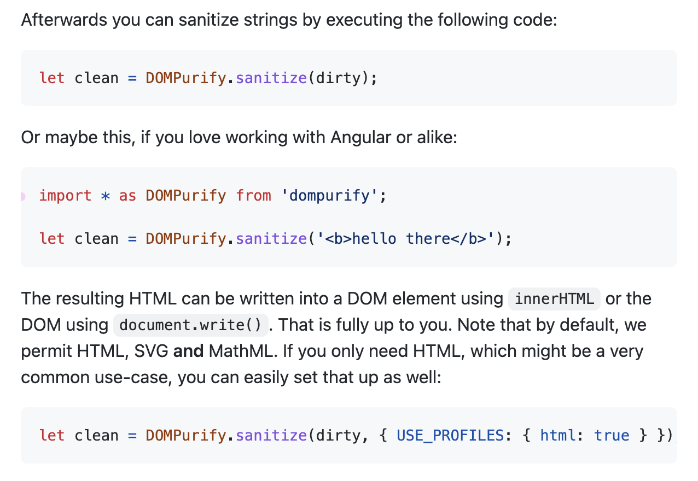

**Github：**[https://github.com/cure53/DOMPurify](https://github.com/cure53/DOMPurify)


> 更新: 2022-09-19 22:25:30  
> 原文: <https://www.yuque.com/cuggz/feplus/khiubw>