# 文件处理库

  
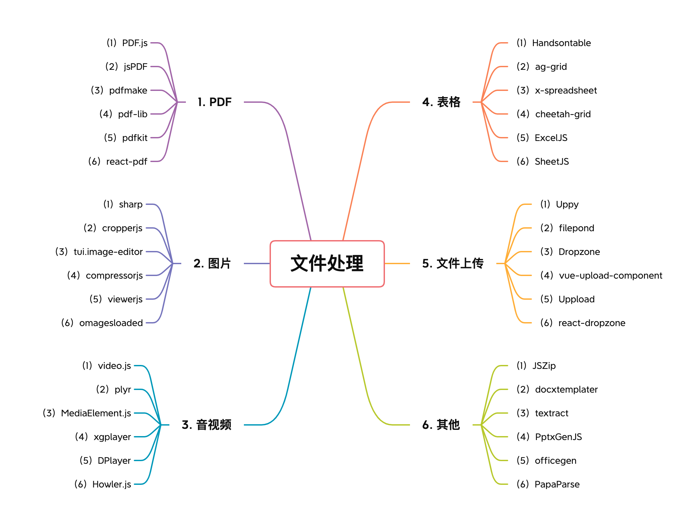

## 1. PDF
### （1）PDF.js
PDF.js是使用 HTML5 构建的可移植文档格式 (PDF) 查看器。它由社区驱动并受 Mozilla 支持，目标是创建一个通用的、基于 Web 标准的平台来解析和呈现 PDF。

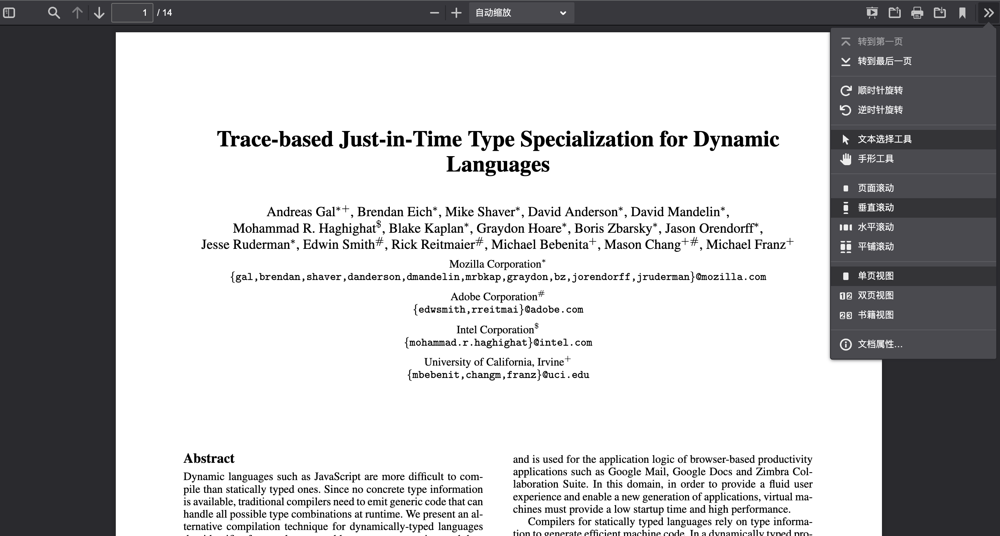

**Github（****⭐****️ 39.2k）：**[https://github.com/mozilla/pdf.js](https://github.com/mozilla/pdf.js)

### （2）jsPDF
jsPDF 是一个使用 JavaScript 语言生成 PDF 的开源库，是一个用于生成 PDF 的领先的 HTML5 客户端解决方案。

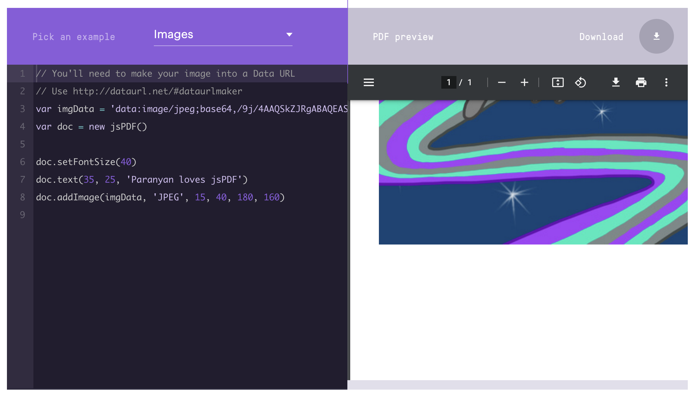

**Github（****⭐****️ 24.6k）：**[https://github.com/parallax/jsPDF](https://github.com/parallax/jsPDF)

### （3）pdfmake
在纯 JavaScript 中用于服务器端和客户端的 PDF 文档生成库。

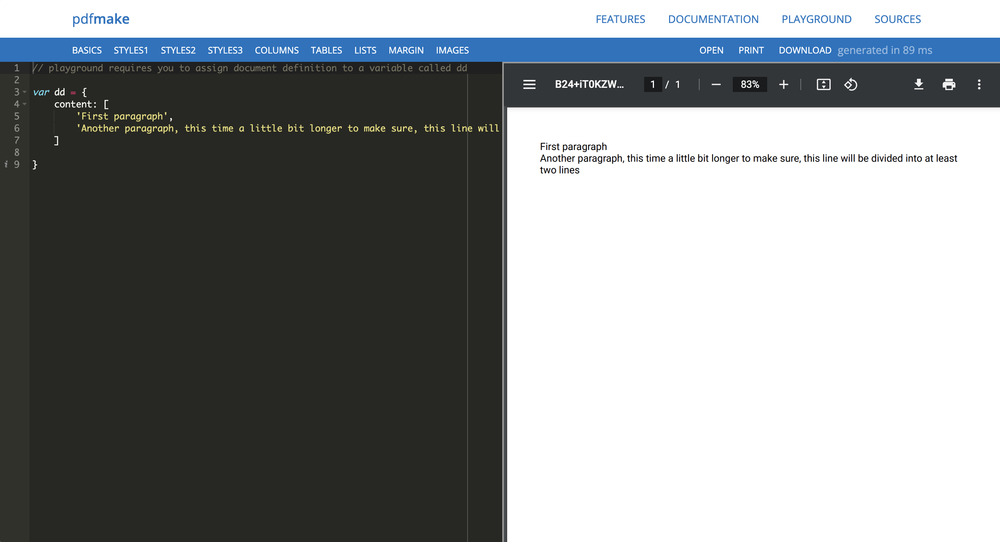

**Github（****⭐****️ 10.2k）：**[https://github.com/bpampuch/pdfmake](https://github.com/bpampuch/pdfmake)

### （4）pdf-lib
pdf-lib 可以在任何 JavaScript 环境中创建和修改 PDF 文档。它旨在解决 JavaScript 生态系统对 PDF 操作（尤其是 PDF修改）缺乏强大支持的问题。可以用于任何现代 JavaScript 运行时，如 Node、Browser、Deno 和 React Native 等。

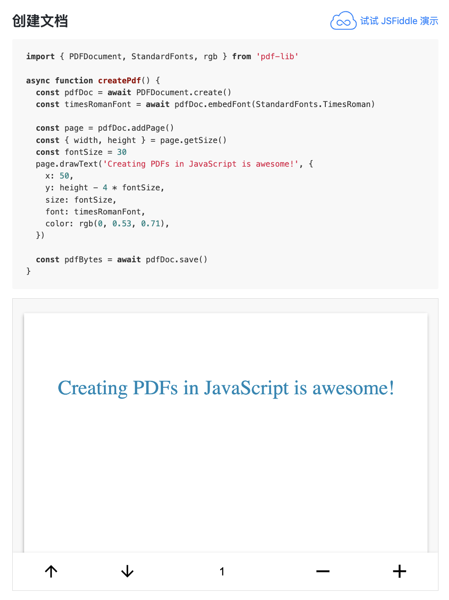

**Github（****⭐****️ 4.1k）：**[https://github.com/Hopding/pdf-lib](https://github.com/Hopding/pdf-lib)

### （5）**pdfkit**
PDFKit 是一个用于 Node 和浏览器的 PDF 文档生成库，可以轻松创建复杂的多页可打印文档。API 包含可链接性，并包括低级功能以及更高级别功能的抽象。PDFKit API 的设计很简单，因此生成复杂的文档通常只需几个函数调用即可。

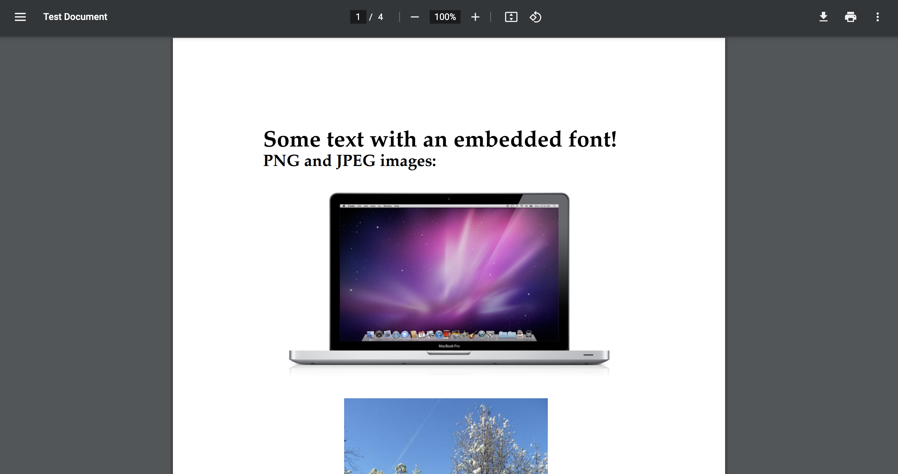

**Github（****⭐****️ 8.2k）：**[https://github.com/foliojs/pdfkit](https://github.com/foliojs/pdfkit)

### （6）**react-pdf**
react-pdf 是一个用于在浏览器和服务器上创建 PDF 文件的 React 渲染器。

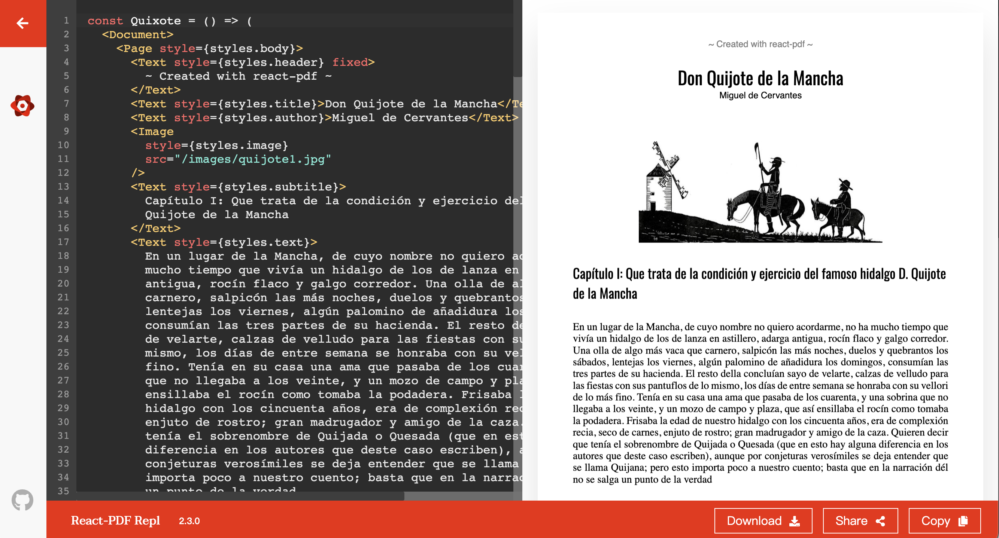

**Github（****⭐****️ 10.9k）：**[https://github.com/diegomura/react-pdf](https://github.com/diegomura/react-pdf)

## 2. 图片
### （1）sharp
sharp 是一个高性能的 Node.js 图像处理库，调整 JPEG、PNG、WebP、AVIF 和 TIFF 图像大小的最快模块。

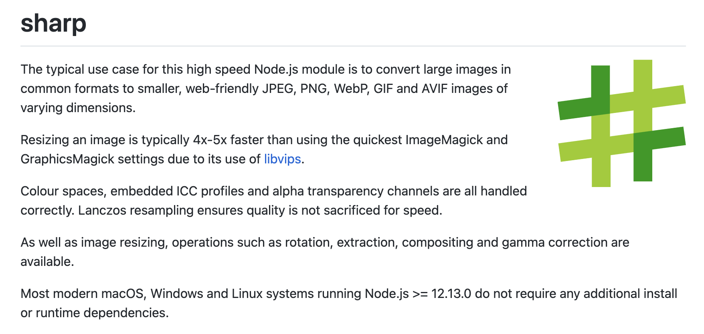

**Github（****⭐****️ 22.7k）：**[https://github.com/lovell/sharp](https://github.com/lovell/sharp)

### （2）cropperjs
cropperjs 是一个 JavaScript 图像裁剪器，支持29个裁剪选项、27种方法、6个事件、缩放、旋转等。

**Github（****⭐****️ 10.8k）：**[https://github.com/fengyuanchen/cropperjs](https://github.com/fengyuanchen/cropperjs)

### （3）tui.image-editor
tui.image-editor 是一个使用 HTML5 Canvas 的全功能图像编辑器。它易于使用并提供强大的过滤器。

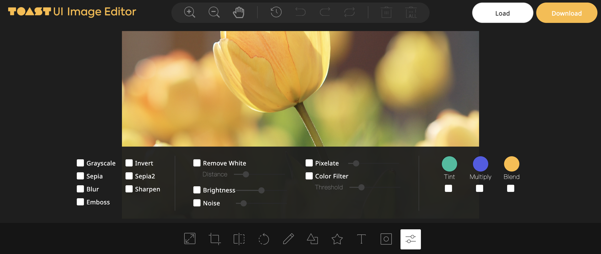

**Github（****⭐****️ 5.2k）：**[https://github.com/nhn/tui.image-editor](https://github.com/nhn/tui.image-editor)

### （4）compressorjs
JavaScript 图像压缩器。使用浏览器原生的 canvas.toBlob API 来做压缩工作，即**有损压缩**，**异步**压缩，在不同的浏览器有**不同的压缩效果**。一般在客户端上传之前使用这个来预压缩图片。

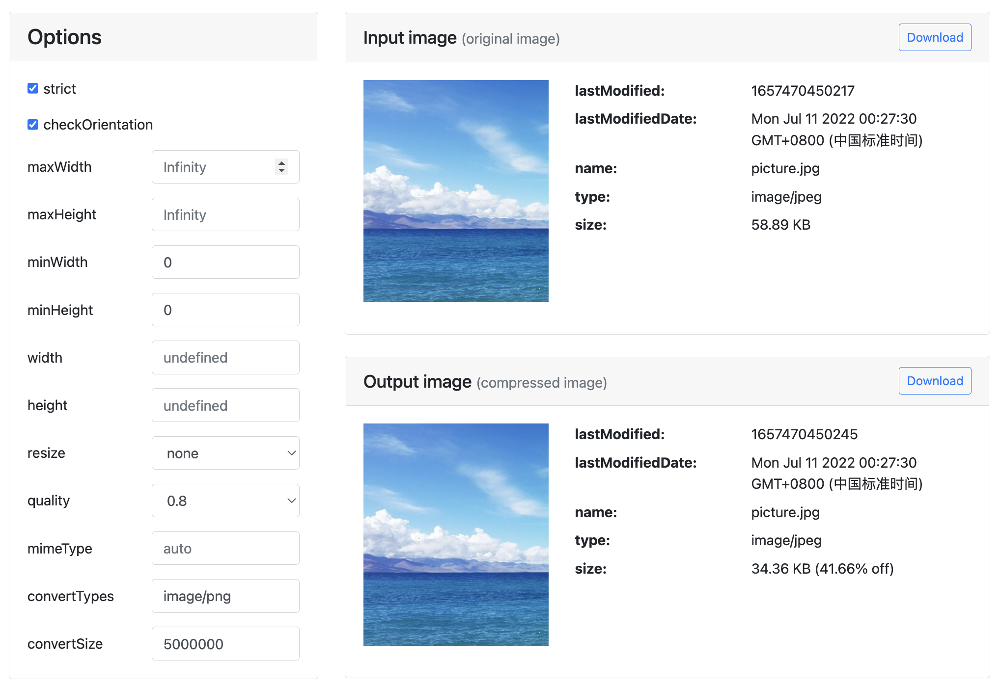  
**Github（****⭐****️ 3.9k）：**[https://github.com/fengyuanchen/compressorjs](https://github.com/fengyuanchen/compressorjs)

### （5）**viewerjs**
viewerjs 是一个 JavaScript 图像查看器，支持52个查看选项、23种操作方法、17个事件、旋转、移动、缩放等。

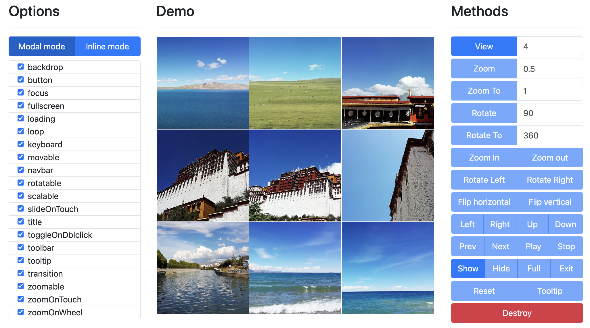

**Github（****⭐****️ 6.6k）：**[https://github.com/fengyuanchen/viewerjs](https://github.com/fengyuanchen/viewerjs)

### （6）omagesloaded
omagesloaded 是一个用来检查图像何时加载的 JavaScript 库。

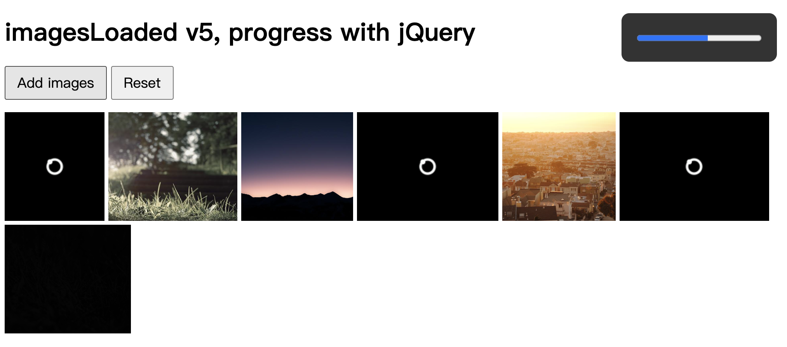

**Github（****⭐****️ 8.7k）：**[https://github.com/desandro/imagesloaded](https://github.com/desandro/imagesloaded)

## 3. 音视频
### （1）video.js
Video.js 是一个为 HTML5 世界从头开始构建的网络视频播放器。它支持 HTML5 视频和媒体源扩展，以及其他播放技术，如 YouTube 和 Vimeo（通过插件）。它支持在台式机和移动设备上播放视频。

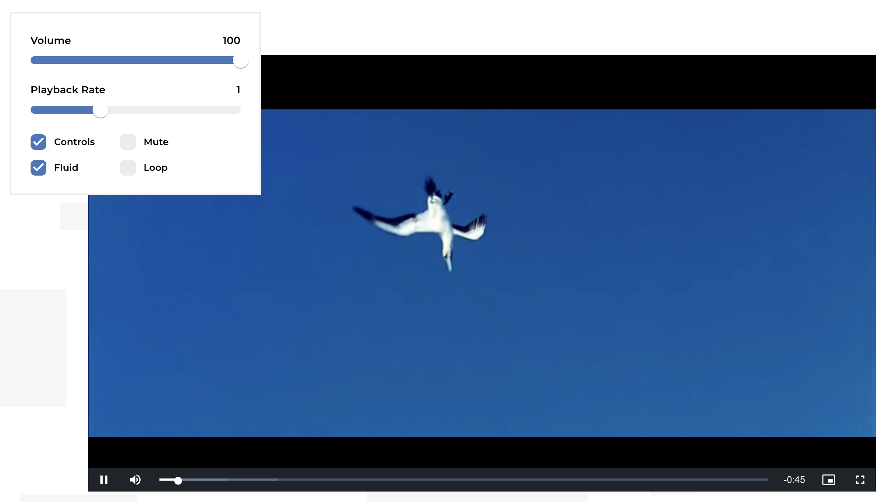

**Github（****⭐****️ 8.7k）：**[https://github.com/videojs/video.js](https://github.com/videojs/video.js)

### （2）plyr
Plyr 是一个简单、轻量级、可访问和可定制的 HTML5、YouTube 和 Vimeo 媒体播放器，支持现代浏览器。

**Github（****⭐****️ 22.3k）：**[https://github.com/sampotts/plyr](https://github.com/sampotts/plyr)

### （3）MediaElement.js
MediaElement.js 是一个HTML5 <audio> 或 <video> 播放器，支持 MP4、WebM 和 MP3 以及 HLS、Dash、YouTube、Facebook、SoundCloud 等，具有通用 HTML5 MediaElement API，可在所有浏览器中实现一致的 UI。

**Github（****⭐****️ 7.9k）：**[https://github.com/mediaelement/mediaelement](https://github.com/mediaelement/mediaelement)

### （4）xgplayer
西瓜播放器是一个Web视频播放器类库，它本着一切都是组件化的原则设计了独立可拆卸的 UI 组件。更重要的是它不只是在 UI 层有灵活的表现，在功能上也做了大胆的尝试：摆脱视频加载、缓冲、格式支持对 video 的依赖。尤其是在 mp4 点播上做了较大的努力，让本不支持流式播放的 mp4 能做到分段加载，这就意味着可以做到清晰度无缝切换、加载控制、节省视频流量。同时，它也集成了对 flv、hls、dash 的点播和直播支持。

**Github（****⭐****️ 5.4k）：**[https://github.com/bytedance/xgplayer](https://github.com/bytedance/xgplayer)

### （5）DPlayer
DPlayer 是一款可爱的 HTML5 弹幕视频播放器，可帮助人们轻松构建视频和弹幕。

**Github（****⭐****️ 12.9k）：**[https://github.com/DIYgod/DPlayer](https://github.com/DIYgod/DPlayer)

### （6）Howler.js
howler.js 是一个现代 web 音频库。它默认为Web Audio API并回退到HTML5 Audio。这使得在所有平台上使用 JavaScript 处理音频变得容易且可靠。

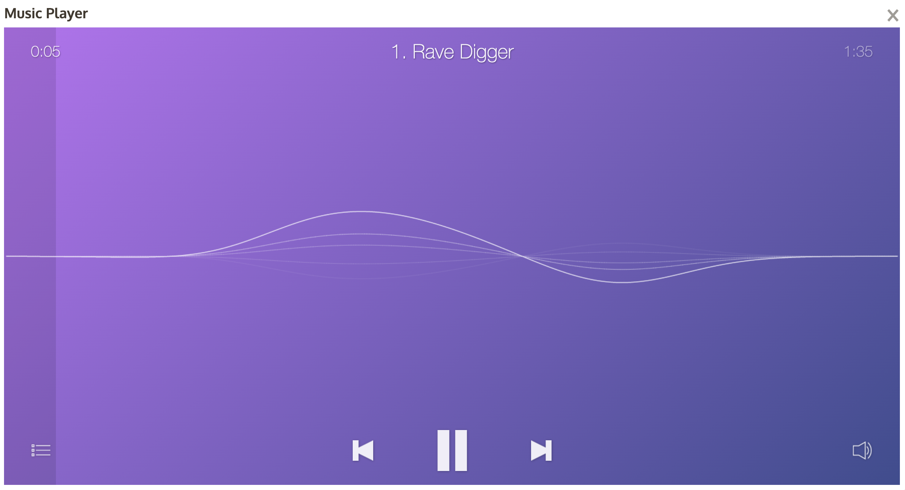

**Github（****⭐****️ 20.3k）：**[https://github.com/goldfire/howler.j](https://github.com/goldfire/howler.js)

## 4. 表格
### （1）Handsontable 
Handsontable 是一个具有电子表格外观的 JavaScript 数据网格组件。适用于 React、Angular 和 Vue。它结合了数据网格功能和类似电子表格的 UX。  
它提供数据绑定、数据验证、过滤、排序和 CRUD 操作。

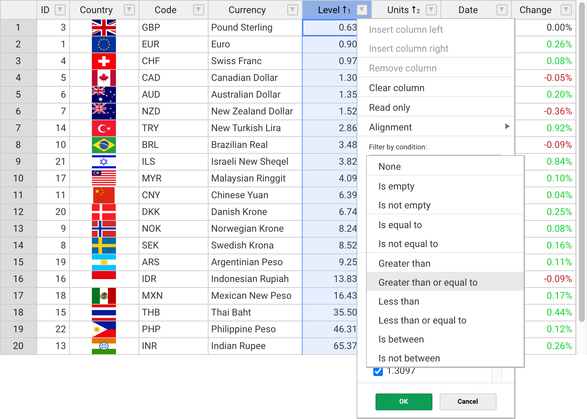

**Github（****⭐****️ 16.8k）：**[https://github.com/handsontable/handsontable](https://github.com/handsontable/handsontable)

### （2）**ag-grid**
AG Grid 是一个功能齐全且高度可定制的 JavaScript 数据网格。它提供了出色的性能，没有第三方依赖，并且可以与所有主要的 JavaScript 框架顺利集成。

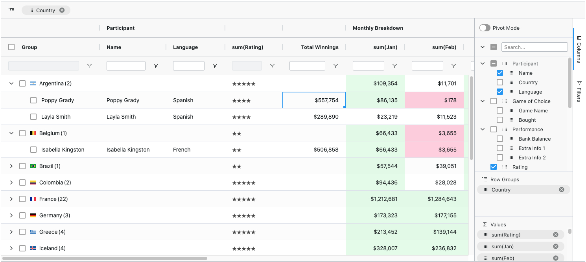

**Github（****⭐****️ 16.8k）：**[https://github.com/ag-grid/ag-grid](https://github.com/ag-grid/ag-grid)

### （3）x-spreadsheet
x-spreadsheet 是一个基于 Web 的 JavaScript（canvas）电子表格。

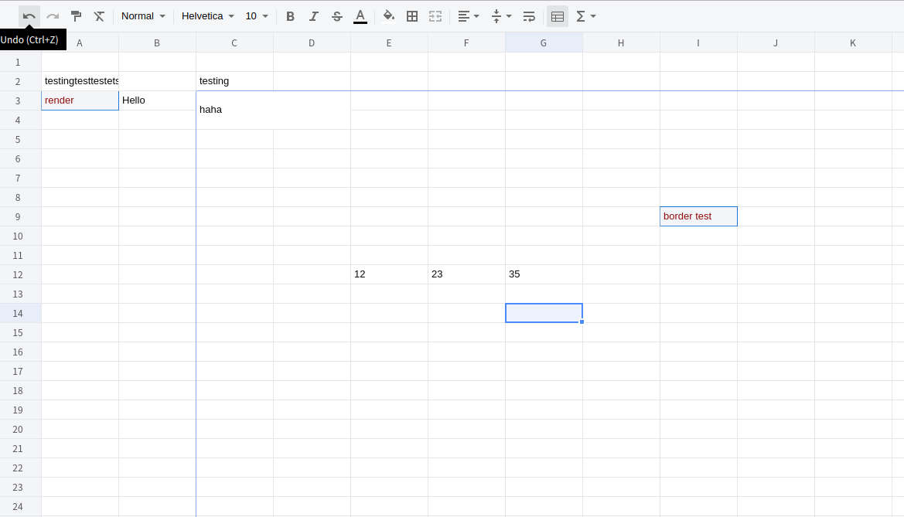

**Github（****⭐****️ 12.6k）：**[https://github.com/myliang/x-spreadsheet](https://github.com/myliang/x-spreadsheet)

### （4）cheetah-grid
cheetah-grid 是最快的 Web 开源数据表。

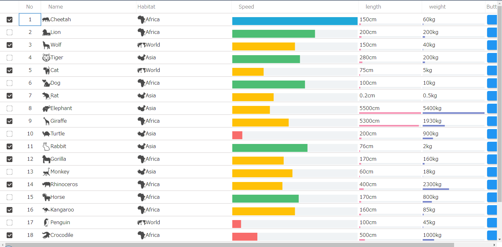

**Github（****⭐****️ 1.2k）：**[https://github.com/future-architect/cheetah-grid](https://github.com/future-architect/cheetah-grid)

### （5）ExcelJS
ExcelJS 是一个Excel电子表格文件逆向工程项目。可以读取，操作并写入电子表格数据和样式到 XLSX 和 JSON 文件。

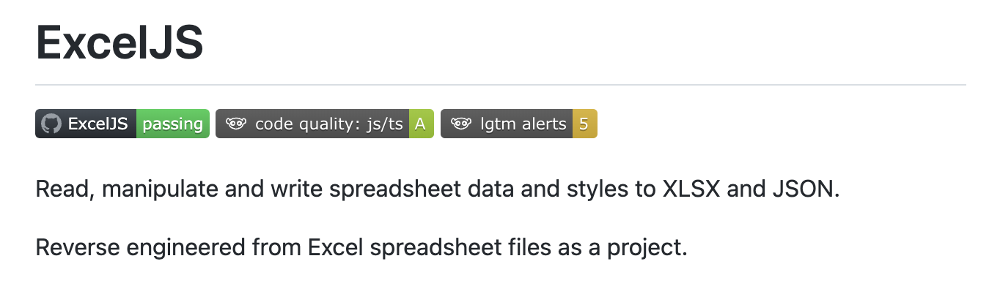

**Github（****⭐****️ 9.7k）：**[https://github.com/exceljs/exceljs](https://github.com/exceljs/exceljs)

### （6）SheetJS
SheetJS 是一个简化的电子表格，用意用来阅读、编辑和导出电子表格，其适用于 Web 浏览器和服务器，在 Office 365 中受 Microsoft 信任。

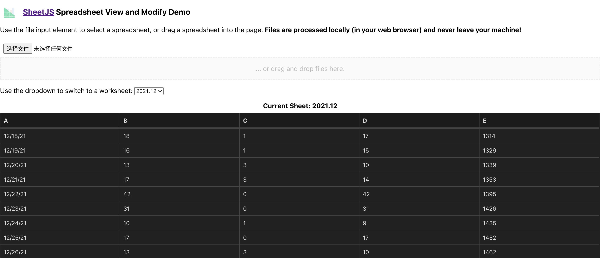

**Github（****⭐****️ 30.6k）：**[https://github.com/SheetJS/sheetjs](https://github.com/SheetJS/sheetjs)

## 5. 文件上传
### （1）Uppy
Uppy 是一款时尚的模块化 JavaScript 文件上传器，可与任何应用程序无缝集成。它速度快，具有易于理解的 API，让您不必担心比构建文件上传器更重要的问题。

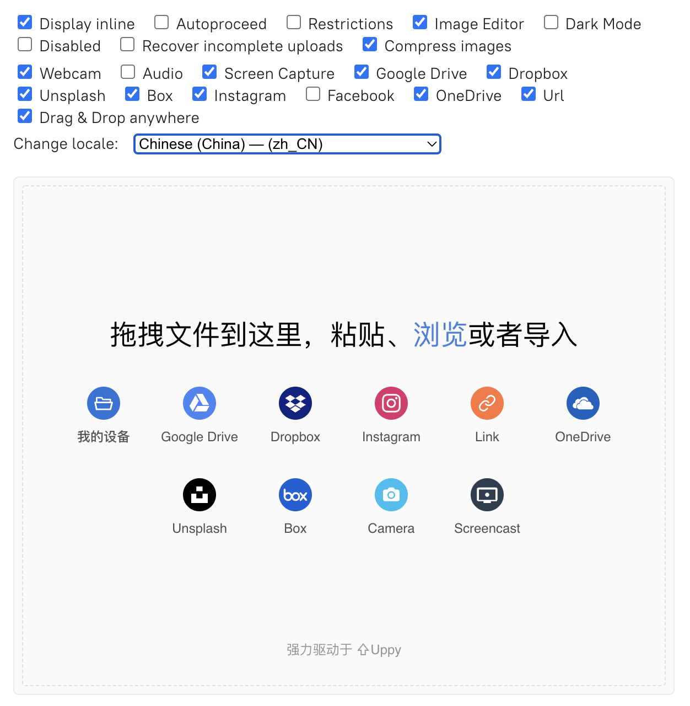

**Github（****⭐****️ 25.5k）：**[https://github.com/transloadit/uppy](https://github.com/transloadit/uppy)

### （2）filepond
filepond 是一个用于上传文件的 JavaScript 库，优化图像以加快上传速度，并提供出色、可访问、如丝般流畅的用户体验。

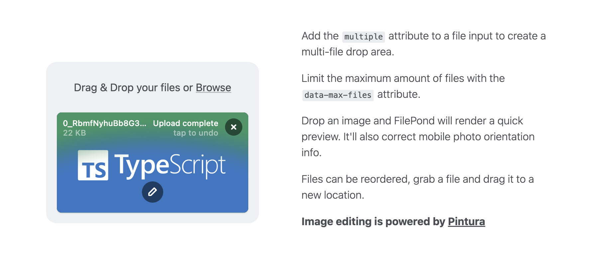

**Github（****⭐****️ 12.6k）：**[https://github.com/pqina/filepond](https://github.com/pqina/filepond)

### （3）Dropzone
Dropzone 是一个 JavaScript 库，可以将任何 HTML 元素转换为 dropzone。这意味着用户可以将文件拖放到上面，Dropzone 将显示文件预览和上传进度，并通过 XHR 为你处理上传。

**Github（****⭐****️ 16.7k）：**[https://github.com/dropzone/dropzone](https://github.com/dropzone/dropzone)

### （4）vue-upload-component
vue-upload-component 是一个用于 Vue.js 的上传组件，支持多文件上传，上传目录，拖拽上传，拖拽目录，以及支持同时上传多个文件等。

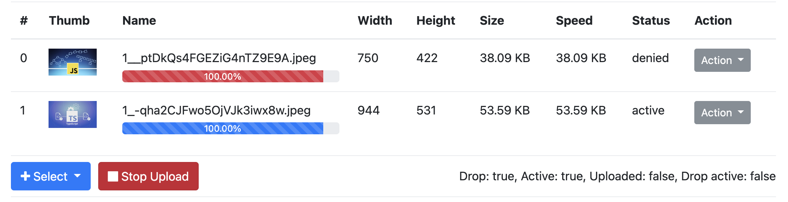

**Github（****⭐****️ 2.5k）：**[https://github.com/lian-yue/vue-upload-component](https://github.com/lian-yue/vue-upload-component)

### （5）Uppload 
Uppload 是一个更好的 JavaScript 图片上传器。它具有 30 多个插件的高度可定制性，完全免费和开源，并且可以与任何文件上传后端一起使用。

**Github（****⭐****️ 1.7k）：**[https://github.com/elninotech/uppload](https://github.com/elninotech/uppload)

### （6）react-dropzone
react-dropzone 是一个为 React 量身定制的，基于HTML5 的 drop && drag API，可以实现拖拽上传文件的 JavaScript 库。

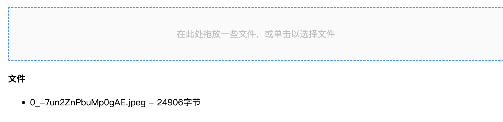

**Github（****⭐****️ 1.7k）：**[https://github.com/react-dropzone/react-dropzone](https://github.com/react-dropzone/react-dropzone)

## 6. 其他
### （1）JSZip
JSZip 是一个使用 JavaScript 创建、读取和编辑 .zip 文件的库，具有可爱而简单的 API。

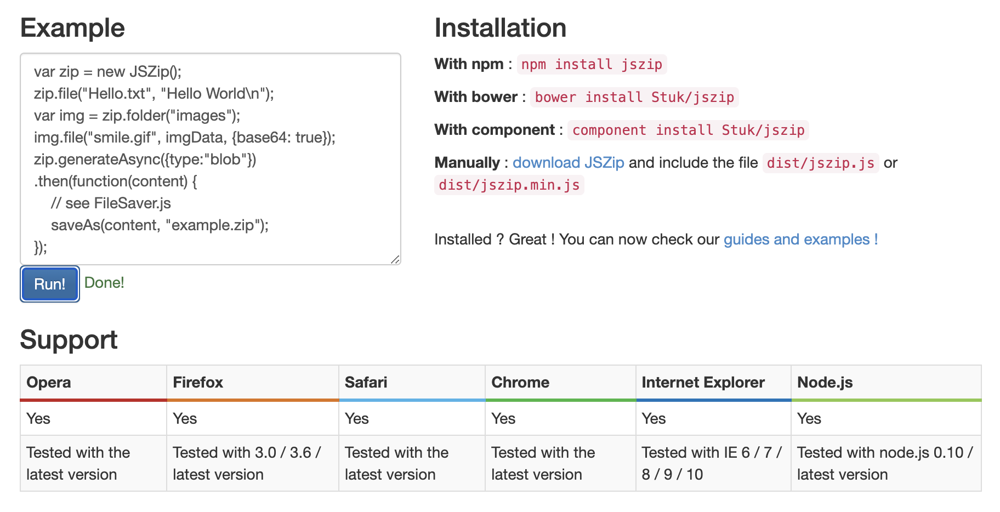

**Github（****⭐****️ 8.1k）：**[https://github.com/Stuk/jszip](https://github.com/Stuk/jszip)

### （2）**docxtemplater**
docxtemplater 是一个从 docx/pptx 模板生成 docx/pptx 文档的库。它可以用数据替换 {placeholders} 并且还支持循环和条件。

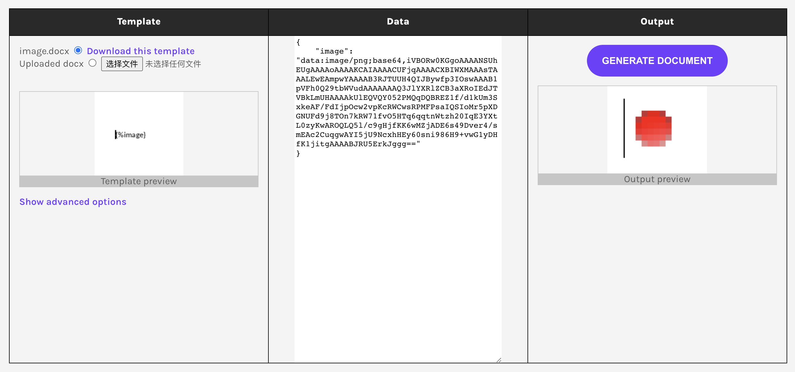

**Github（****⭐****️ 2.2k）：**[https://github.com/open-xml-templating/docxtemplater](https://github.com/open-xml-templating/docxtemplater)

### （3）textract
textract 是一个 node.js 模块，用于从 html、pdf、doc、docx、xls、xlsx、csv、pptx、png、jpg、gif、rtf 等中提取文本。

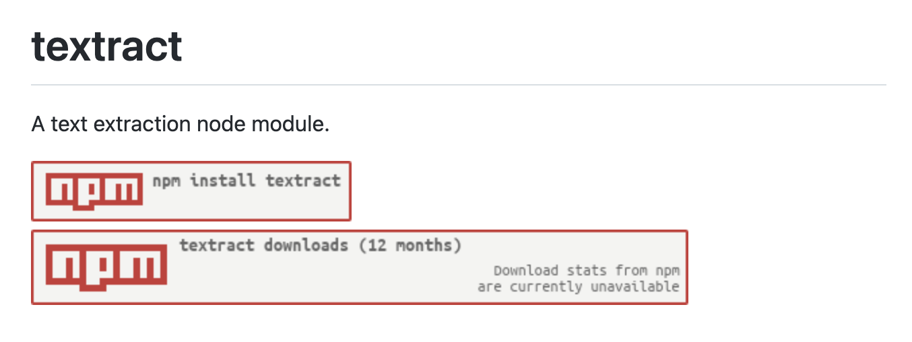

**Github（****⭐****️ 1.5k）：**[https://github.com/dbashford/textract](https://github.com/dbashford/textract)

### （4）PptxGenJS
PptxGenJS 是一个使用功能强大、简洁的 JavaScript API 创建 PowerPoint 演示文稿。

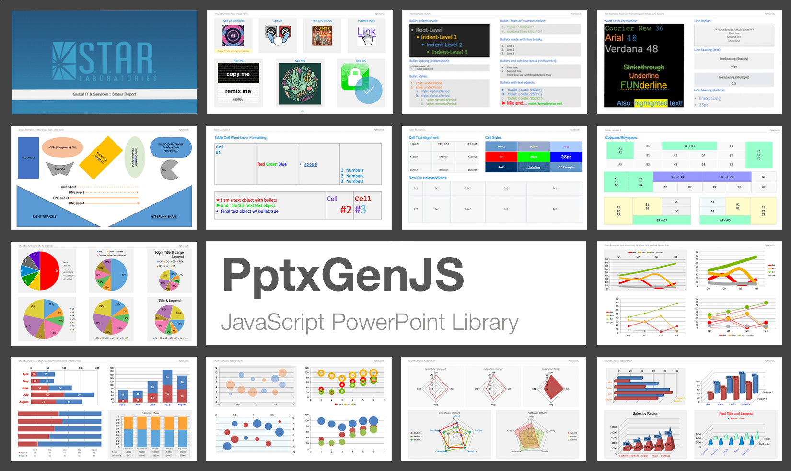

**Github（****⭐****️ 1.6k）：**[https://github.com/gitbrent/PptxGenJS](https://github.com/gitbrent/PptxGenJS)

### （5）officegen
officegen 是一个用于 JavaScript 中 Word (docx)、PowerPoint (pptx) 和 Excell (xlsx) 的独立 Office Open XML 文件（Microsoft Office 2007 及更高版本）生成器。

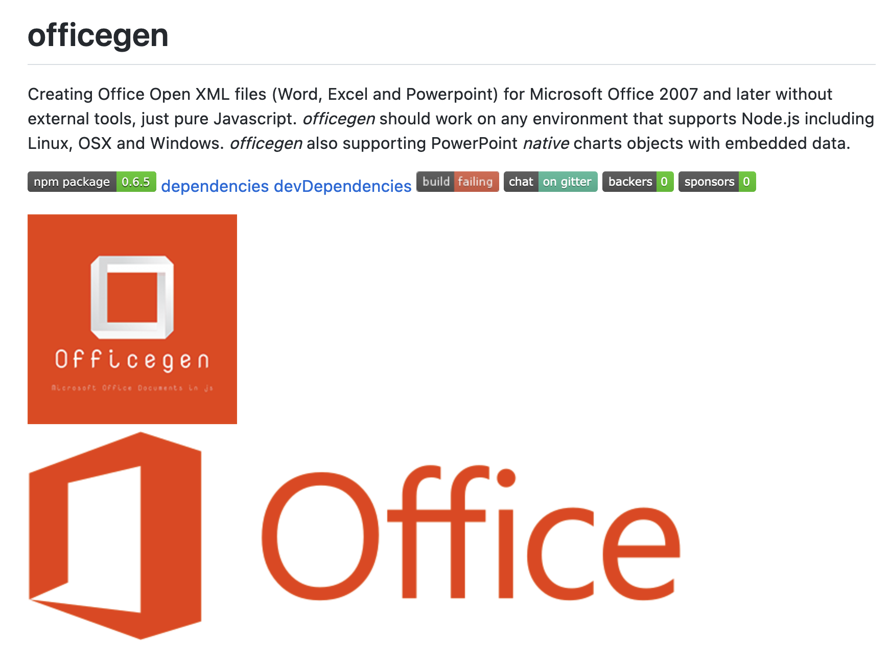

**Github（****⭐****️ 2.4k）：**[https://github.com/Ziv-Barber/officegen](https://github.com/Ziv-Barber/officegen)

### （6）PapaParse 
PapaParse 是一个快速而强大的 CSV（分隔文本）解析器，可以优雅地处理大文件和格式错误的输入。

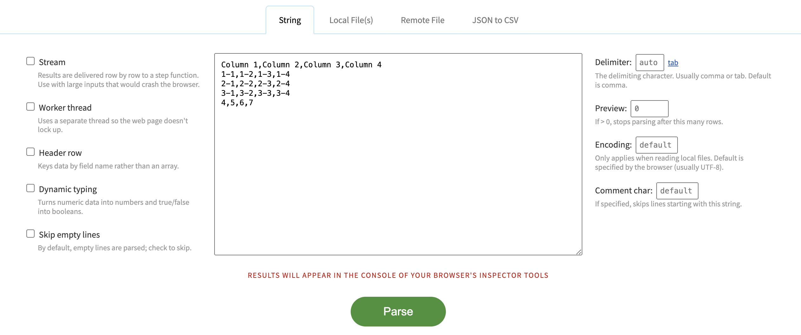

**Github（****⭐****️ 10.6k）：**[https://github.com/mholt/PapaParse](https://github.com/mholt/PapaParse)

> 更新: 2022-07-19 11:56:14  
> 原文: <https://www.yuque.com/cuggz/feplus/gdtvi5>