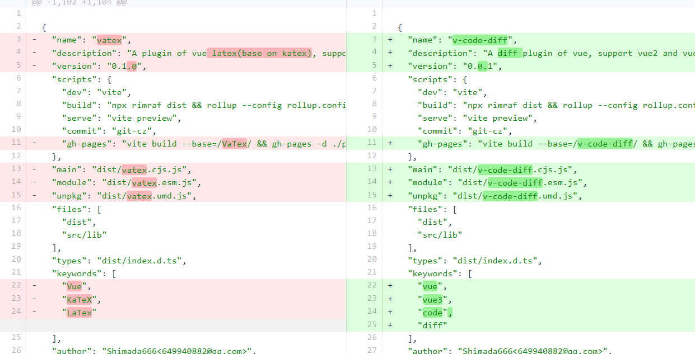
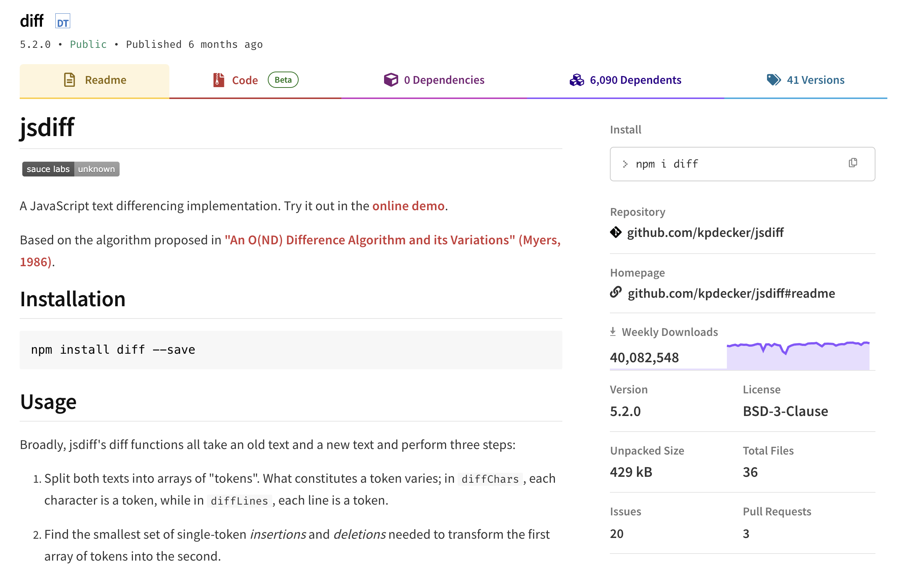
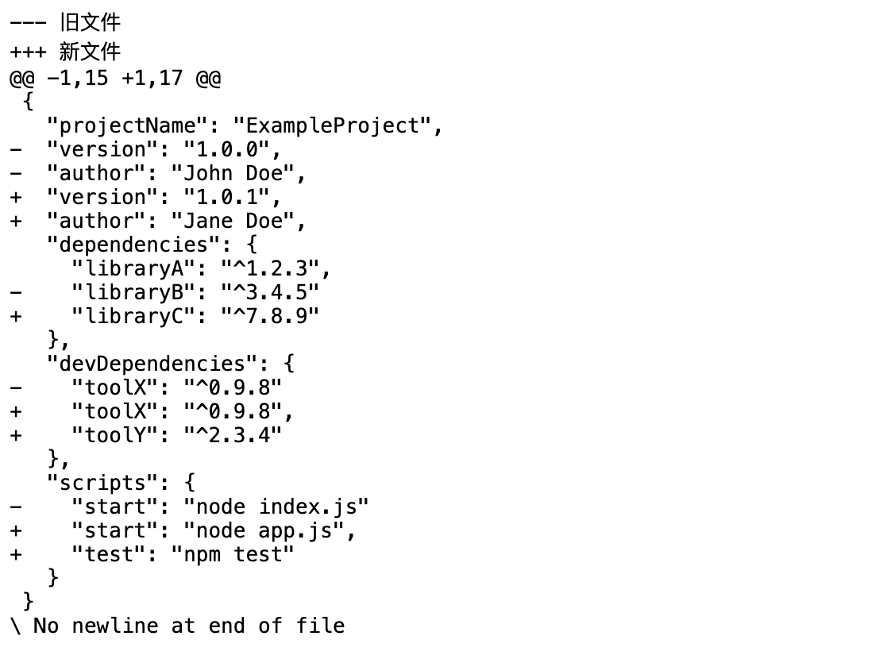
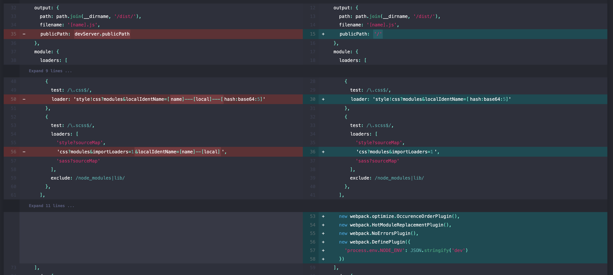
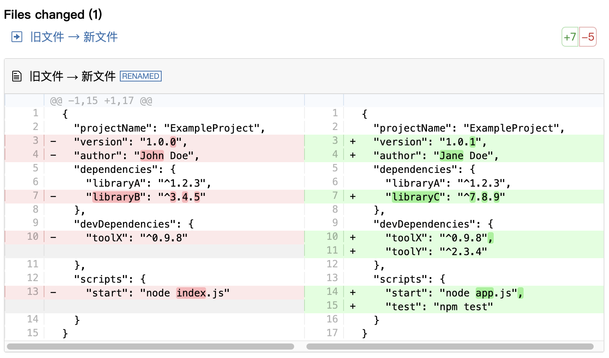

# 文本对比

你有没有想过，常见的代码差异对比是如何都实现的呢？其实这里面涉及到非常复杂的文本对比算法，本文就来看看如何通过现有工具库 jsdiff + diff2html 实现文本对比，并高亮显示差异！



## 文本对比

文本对比可以借助 [jsdiff](https://github.com/kpdecker/jsdiff) 来实现，`jsdiff` 是一个 JavaScript 库，用于实现文本差异比较。这个库提供了多种方法来计算和展示两个文本之间的差异，可以用于多种文本差异比较的场景，比如版本控制、文档比较、代码编辑器中的变更高亮等。

> jsdiff 基于 Myers 在 1986 年提出的 "An O(ND) Difference Algorithm and its Variations" 算法实现。

jsdiff 是一个非常热门的工具库，其 npm 周下载量高达 4000 万，很多知名前端工具库都依赖它：



Github：<https://github.com/kpdecker/jsdiff>

以下是 jsdiff 提供的 API：

* **diffChars** - 对两个文本进行字符级别的差异比较。
* **diffWords** - 对两个文本进行单词级别的差异比较，忽略空白字符。
* **diffWordsWithSpace** - 对两个文本进行单词级别的差异比较，考虑空白字符作为分隔符。
* **diffLines** - 对两个文本按行进行差异比较。
* **diffSentences** - 对两个文本按句子进行差异比较。
* **diffCss** - 专门用于比较 CSS 代码的差异。
* **diffJson** - 比较两个 JSON 对象的差异，首先将它们序列化为格式化的 JSON 文本，然后逐行比较。
* **diffArrays** - 比较两个数组，检查数组元素的严格等同性。
* **createTwoFilesPatch** - 创建一个包含两个文件差异的补丁。
* **createPatch** - 创建一个补丁，通常用于一个文件的前后变化。
* **applyPatch** - 应用一个给定的补丁到源文本上。
* **applyPatches** - 应用一个或多个补丁到相应的文件内容上。
* **parsePatch** - 解析一个补丁字符串为结构化的数据。
* **reversePatch** - 反转一个补丁，使得应用此补丁会撤销原始的更改。
* **convertChangesToXML** - 将差异对象转换为 XML 格式。
* **convertChangesToDMP** - 将差异对象转换为 Google 的 diff-match-patch 库的格式。

在使用 jsdiff 时，首先需要通过以下命令来安装：

```javascript
npm install diff --save
```

安装完成之后就可以选择合适的 API 直接使用了。对于文章最开始的例子，就可以借助 `createTwoFilesPatch` API 来对比两个文件的差异，它的参数如下：

```javascript
createTwoFilesPatch(oldFileName, newFileName, oldStr, newStr, oldHeader, newHeader, options)
```

* <code>**oldFileName**</code>: 旧文件的文件名。
* <code>**newFileName**</code>: 新文件的文件名。
* <code>**oldStr**</code>: 原始字符串值
* <code>**newStr**</code>: 新的字符串值
* <code>**oldHeader**</code>: 可选，允许在旧文件的头部添加额外的信息。
* <code>**newHeader**</code>: 可选，用于在新文件的头部添加额外的信息。
* <code>**options**</code>: 一个包含选项的对象，可以用来自定义补丁的生成方式：
  * <code>**context**</code>: 描述应该包含多少行上下文。设置为 `Number.MAX_SAFE_INTEGER` 或 `Infinity` 可以包含整个文件内容在一个块（hunk）中。
  * <code>**ignoreWhitespace**</code>: 与 `diffLines` 中的用法相同，用于忽略空白字符差异。默认为 `false`。
  * <code>**stripTrailingCr**</code>: 与 `diffLines` 中的用法相同，用于在执行差异比较之前去除所有尾随的回车符（`\r`）。这有助于在比较 UNIX 和 Windows 文本文件时得到有用的差异结果。默认为 `false`。

代码如下：

```javascript
import * as Diff from 'diff';

const oldFile = `{
  "projectName": "ExampleProject",
  "version": "1.0.0",
  "author": "John Doe",
  "dependencies": {
    "libraryA": "^1.2.3",
    "libraryB": "^3.4.5"
  },
  "devDependencies": {
    "toolX": "^0.9.8"
  },
  "scripts": {
    "start": "node index.js"
  }
}`; 

const newFile = `{
  "projectName": "ExampleProject",
  "version": "1.0.1",
  "author": "Jane Doe",
  "dependencies": {
    "libraryA": "^1.2.3",
    "libraryC": "^7.8.9"
  },
  "devDependencies": {
    "toolX": "^0.9.8",
    "toolY": "^2.3.4"
  },
  "scripts": {
    "start": "node app.js",
    "test": "npm test"
  }
}`;

const diff = Diff.createTwoFilesPatch("旧文件", "新文件", oldFile, newFile);
```

这里的对比结果 diff 结果如下：



对比结果有点丑，下面会进行优化。

除了 jsdiff，还有一个基于 jsdiff 开发的 React 库：`react-diff-viewer`。它提供了一种简单易用的方式来展示两个文本或对象之间的差异，不仅可以对文本进行对比，还可以输出漂亮的差异对比结果。



**Github：**<https://github.com/praneshr/react-diff-viewer>

## 高亮显示差异

如果使用 jsdiff 进行对比，对比结果可能没那么美观，可以借助 diff2html 来美化。

> `diff2html` 是一个用于将差异（diff）结果转换成 HTML 格式的工具，它通常用于在网页上展示文件或文本内容之间的差异。这个库提供了一种方便的方式来生成美观的差异比较视图，使得用户可以轻松地查看和理解两个版本之间的变化。

Github：<https://github.com/rtfpessoa/diff2html>

首先需要进行安装：

```javascript
npm install diff2html --save
```

然后导入使用即可：

```javascript
import * as Diff2Html from "diff2html";

const outputHtml = Diff2Html.html(diff, {
  inputFormat: "diff",
  showFiles: true,
  matching: "lines",
  highlight: true,
  outputFormat: "side-by-side",
});
```

这里的 diff 就是上一步中生成的 diff 结果。

美化后对比如下，更美观了：



更多配置可以在其文档中进行探索。


> 更新: 2024-07-31 18:47:11  
> 原文: <https://www.yuque.com/cuggz/feplus/pg0gu1lzgw5ulmpf>