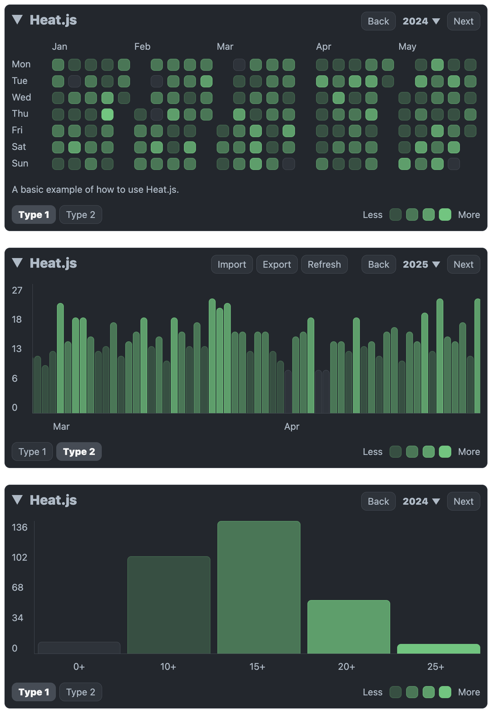
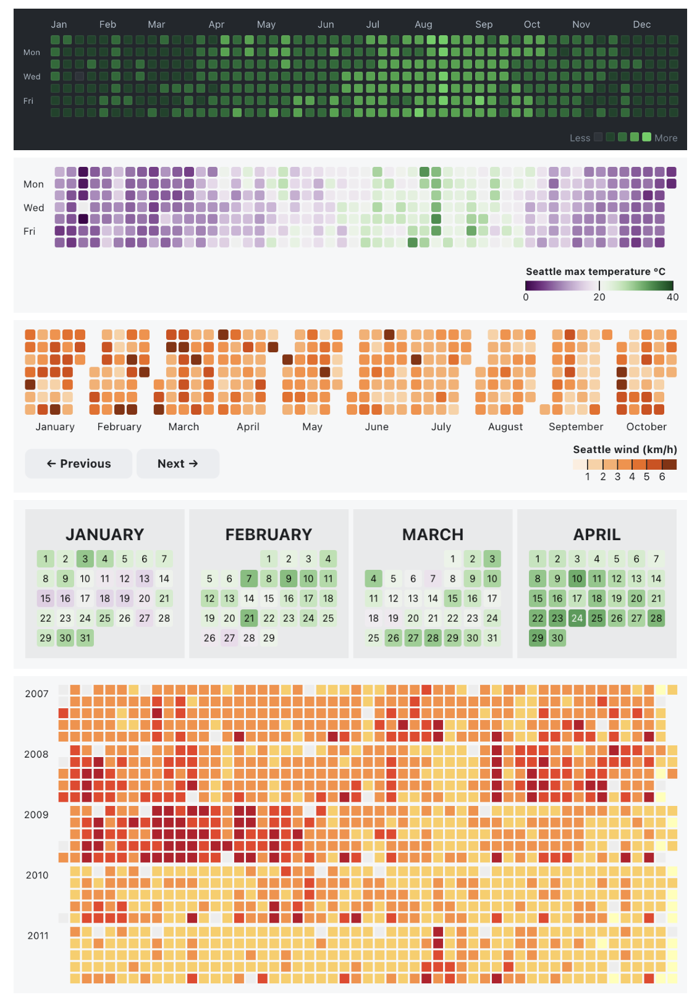
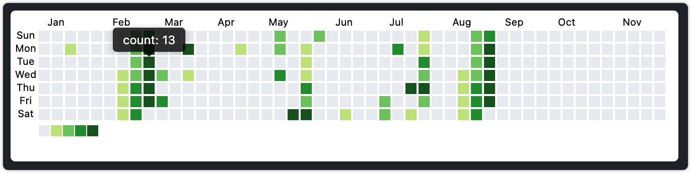

# 日历热力图

## Heat.js
Heat.js 是一个轻量级的 JavaScript 库，用于生成可定制的热力图、图表和统计数据，以可视化基于日期的活动和趋势。

**Github：**[https://github.com/williamtroup/Heat.js](https://github.com/williamtroup/Heat.js)

## Cal-HeatMap
Cal-Heatmap 是一个功能丰富的 JavaScript 图表库，它允许用户创建具有动画日期导航、时间间隔自定义、完全布局/UI控制、地区与时区支持、插件系统、广泛浏览器兼容性和从右到左支持等特性的时间序列日历热力图，类似于 GitHub 用户页面的贡献日历。

**Github：**[https://github.com/wa0x6e/cal-heatmap](https://github.com/wa0x6e/cal-heatmap)

## react-heat-map
react-heat-map 是一个基于 SVG 的轻量级React日历热力图组件，它是 GitHub贡献图的自定义版本。

**Github：**[https://github.com/uiwjs/react-heat-map](https://github.com/uiwjs/react-heat-map)

> 更新: 2024-11-30 14:59:55  
> 原文: <https://www.yuque.com/cuggz/feplus/ilgri43pxi7ngl39>