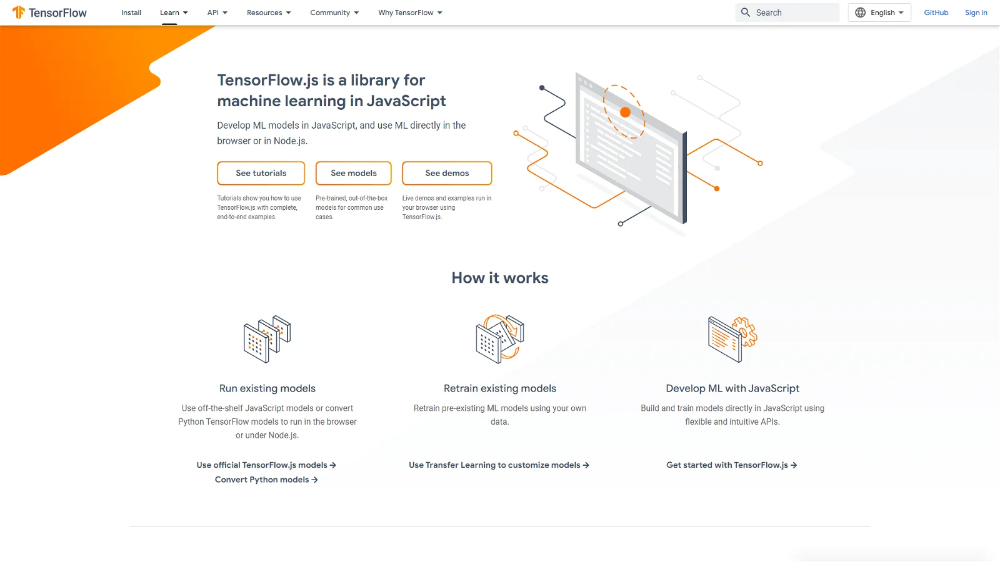
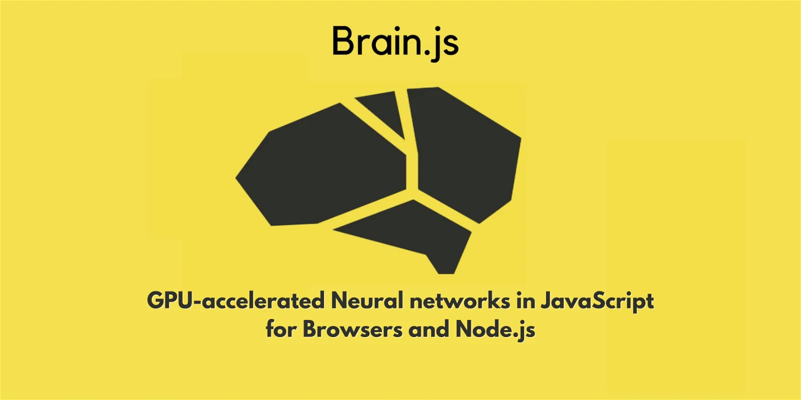
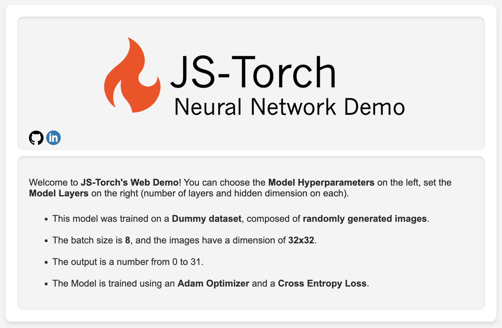
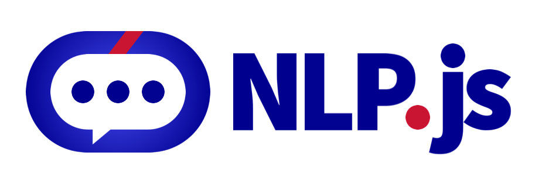
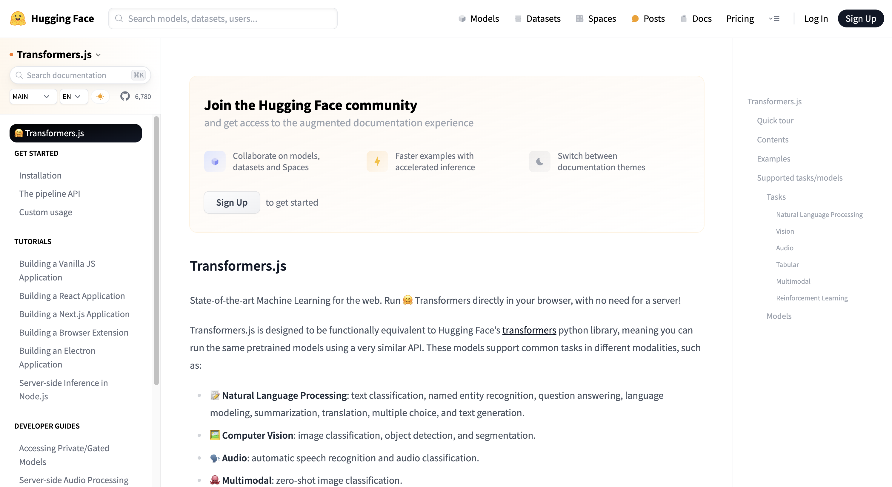
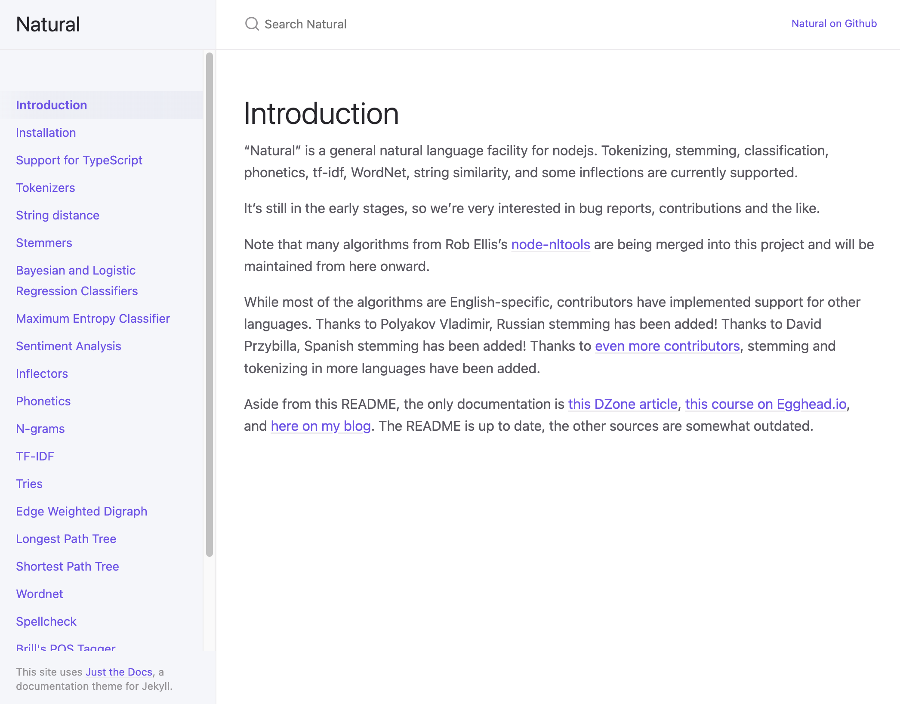
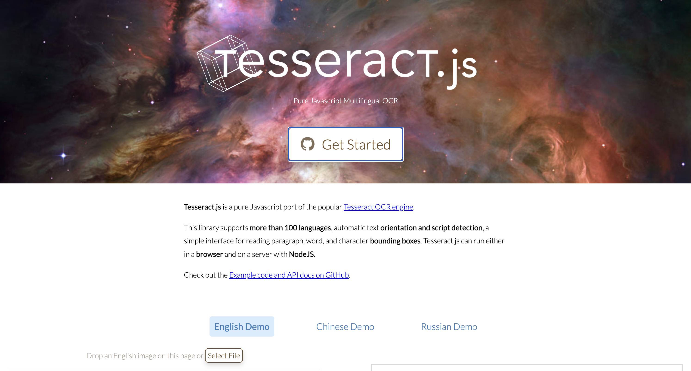

# 机器学习

近几年，技术飞速发展，AI 正以前所未有的速度改变着我们的生活。而在这一浪潮中，JavaScript（JS）作为前端开发的重要基石，也正在迎来其 AI 时代的崭新篇章。本文将分享几个引领 JS 迈向 AI 时代的机器学习库，它们不仅彰显了 JS 在 AI 领域的无限潜力，更将为我们揭示前端与 AI 融合的美好未来。让我们一同探索这些库的魅力，携手迎接 JS 的 AI 时代吧！

## TensorFlow.js
TensorFlow.js 是由 Google TensorFlow 团队开发的开源客户端 JavaScript 机器学习库。它允许开发人员将机器学习功能引入 Web 浏览器和基于 JavaScript 的应用，从而消除了对服务器端计算的需求，减少了延迟，并提高了应用的响应能力。

TensorFlow.js 是一个综合库，使开发人员能够直接在 JavaScript 中创建和训练机器学习模型，支持传统的机器学习算法和深度学习模型，适用于各种应用。此外，它利用用户设备的底层硬件加速功能（如 GPU）来高效执行计算，从而缩短推理时间，允许直接在浏览器中实时预测和处理数据。无论是在浏览器还是 Node.js 环境中，TensorFlow.js 都能发挥出色的性能，并提供多种后端选项以适应不同的使用场景。

**Github：**[https://github.com/tensorflow/tfjs](https://github.com/tensorflow/tfjs)

## brain.js
Brain.js 是一个用于神经网络的JavaScript库，它能够在Node.js中运行或直接在浏览器中运行。该库通过提供易于使用的API简化了将ML模型集成到应用程序中的过程，允许在AI领域几乎没有经验的开发人员创建智能系统。

此外，Brain.js支持自然语言处理（NLP）任务，涉及计算机和人类语言之间的交互，可以构建聊天机器人、自动翻译器、情绪分析工具等。它还可以用于图像识别任务，如面部识别、缺陷检测或诊断辅助等。

**Github：**[https://github.com/BrainJS/brain.js](https://github.com/BrainJS/brain.js)

## JS-Torch
JS-Torch 是一个专为 JavaScript 设计的全新深度学习库。它的语法习惯与广受欢迎的PyTorch框架高度相似，提供了一个功能齐全的张量对象（可跟踪梯度）、深度学习层和函数，以及一个自动微分引擎。这个库允许用户从头开始构建深度学习模型，并具有模块化结构，包含用于核心框架、层、优化器和测试的不同文件夹和文件。

**Github：**[https://github.com/eduardoleao052/js-pytorch](https://github.com/eduardoleao052/js-pytorch)

## NLP.js
NLP.js 是一个基于 Node.js 的自然语言处理（NLP）库，具有情感分析、自动语言识别等功能。它完全用JavaScript编写，支持浏览器和Node.js环境，旨在简化Web应用和服务器端应用中的NLP任务。NLP.js基于最新的人工智能算法，如词嵌入（Word Embeddings）、条件随机场（Conditional Random Fields）和LSTM神经网络模型，这使得它在执行诸如实体识别、情感分析、关键词提取等任务时表现出色。此外，NLP.js不仅支持预训练模型，还允许开发者自定义模型以适应特定业务场景。

**Github：**[https://github.com/axa-group/nlp.js](https://github.com/axa-group/nlp.js)

## Transformers.js
Transformers.js是一个JavaScript库或框架，设计用于在Web浏览器中直接运行Transformer模型，而不再需要外部服务器参与处理。它提供了预训练模型和熟悉的API，支持自然语言处理、计算机视觉、音频和多模态领域的任务。借助Transformers.js，开发人员可以直接在浏览器中运行文本分类、图像分类、语音识别等任务，这使其成为ML从业者和研究人员的强大工具。

此外，Transformers.js 将最先进的机器学习技术引入到Web中，消除了对服务器的需求，实现了最大程度上的隐私保护。在最新的版本中，Transformers.js还引入了增强功能，包括文本转语音（TTS）支持，扩展了库的应用场景。

**Github：**[https://github.com/xenova/transformers.js](https://github.com/xenova/transformers.js)

## Natural
Natural 是 Node.js 的一个通用自然语言处理工具。它为自然语言处理提供了广泛的功能，包括标记化、词干提取、分类、语音学、tf-idf、WordNet、字符串相似性和一些屈折变化等。这个库的设计使得开发人员能够解析、解释、操作和理解来自用户输入的自然语言。

**Github：**[https://github.com/NaturalNode/natural](https://github.com/NaturalNode/natural)

## Tesseract.js
Tesseract.js 是一个基于 Tesseract OCR 引擎的JavaScript版本。它可以从图像中获取几乎任何语言的文字。Tesseract OCR 引擎本身是一个广泛使用的开源 OCR 引擎，能够识别多种语言和字体。而 Tesseract.js 将原始的 Tesseract 从 C 编译为 JavaScript WebAssembly，从而使 OCR 可以在浏览器中访问。它支持100多种语言，具有自动文本方向和脚本检测功能，并提供了阅读段落、单词和字符边界框的简单界面。Tesseract.js 既可以在浏览器中运行，也可以在带有 NodeJS 的服务器上运行。  

此外，Tesseract.js 还具有跨平台兼容性，可以在多种操作系统上运行，包括Windows、Linux 和 macOS。同时，由于它基于原版 Tesseract OCR 引擎，因此也具有相似的高识别准确性。

**Github：**[https://github.com/naptha/tesseract.js](https://github.com/naptha/tesseract.js)

> 更新: 2024-06-07 17:13:12  
> 原文: <https://www.yuque.com/cuggz/feplus/vnu3wu504zypf87o>