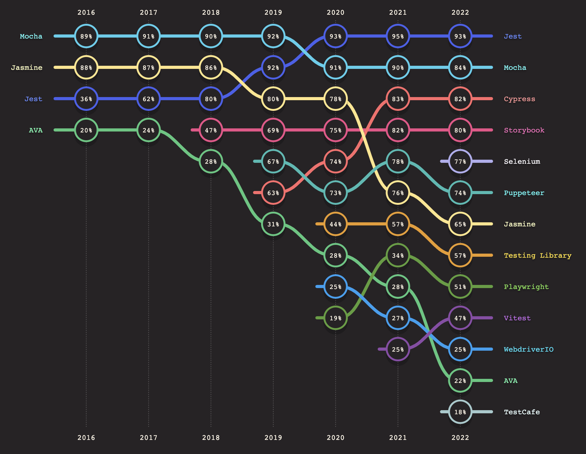
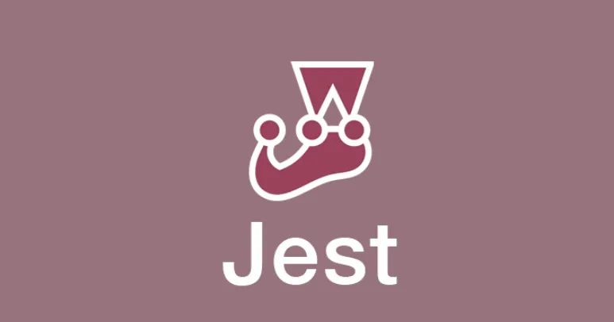
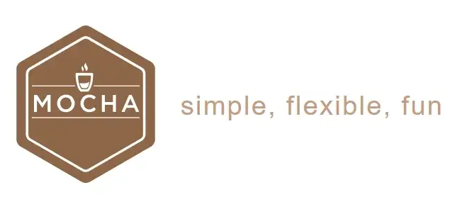
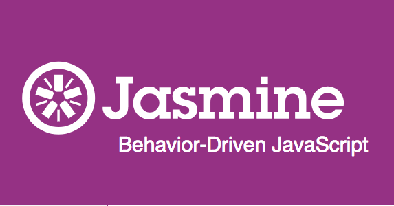
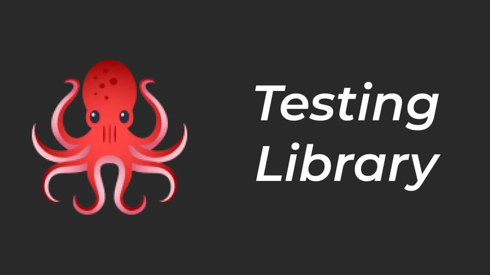
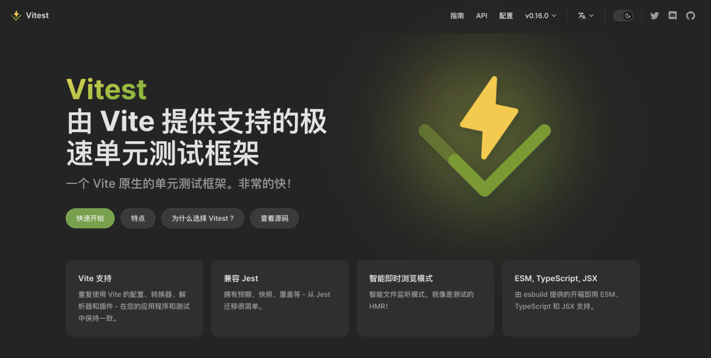

# 测试库

测试工具可以把测试代码抽离出来，作为一个整体结构化地去设计测试用例，放到专门的测试文件中，也可以实现自动运行以及显示测试结果。下面就来看看常用的测试框架有哪些，它们都有哪些优缺点！

> 前端测试通常可以分为以下 3 种：
>
> + **单元测试**：将代码的各个部分分开，对软件中的最小可测试单元进行检查和验证；
> + **集成测试**：测试多个单元能否协调工作；
> + **端到端测试（e2e）**：从头到尾测试整个软件产品，以确保应用程序流按预期运行。
>



## Jest
Jest 是由 Facebook 开发的 JavaScript 测试框架。它是测试 React 的首选，并且得到了 React 社区的支持和开发。


Jest 具有以下特点：

+ **兼容性**：除了可以测试 React 应用，还可以轻松集成到其他应用中，与 Angular、Node、Vue 和其他基于babel的项目兼容。
+ **自动模拟**：当在测试文件中导入库时，Jest 会自动模拟这些库以帮助我们轻松地使用它们。
+ **扩展 API**：Jest 提供了广泛的 API，除非确实需要，否则不需要包含额外的库。
+ **计时器模拟**：Jest 具有时间模拟系统，非常适合应用中的快进超时，并有助于在运行测试时节省时间。
+ **活跃社区**：Jest 拥有很活跃的社区，可以帮助我们在需要时快速找到解决方案。



示例代码：

```javascript
const sum = require(‘./sum’);


test('1 + 2 = 3’, () => {
  	expect(sum(1, 2)).toBe(3);
});
}
```

**Github：**[https://github.com/facebook/jest](https://github.com/facebook/jest)

## Mocha
Mocha 是一个功能丰富的 JavaScript 测试框架，可以运行在 Node.js 和浏览器中，使异步测试变得简单有趣。Mocha 测试连续运行，允许灵活和准确的报告，同时将未捕获的异常映射到正确的测试用例。


Mocha 不支持开箱即用的断言、模拟等，需要通过组件/插件来添加这些功能。与 Mocha 搭配的最流行的断言库包括 [Chai](https://www.chaijs.com/)、[Assert](https://www.npmjs.com/package/assert)、[Should.js](https://shouldjs.github.io/) 和 [Better-assert](https://www.npmjs.com/package/better-assert)。


Mocha 具有以下特点：

+ **使用简单**：对于不包含复杂断言或测试逻辑的较小项目，Mocha 是一个简单的解决方案。
+ **ES模块支持**：Mocha 支持将测试编写为 ES 模块，而不仅是使用 CommonJS。


当然，Mocha 也是有缺点的：

+ **设置难度大**：必须使用额外的断言库，这确实意味着它比其他库更难设置。
+ **与插件的潜在不一致**：Mocha 将测试结构包含为 [globals](https://developer.mozilla.org/en-US/docs/Glossary/Global_object)，不必在每个文件中都使用 includeor 来节省时间。require 缺点是插件可能会要求无论如何都包含这些，从而导致不一致。
+ **不支持任意转译器**：[在 v6.0.0 之前](https://github.com/mochajs/mocha/wiki/compilers-deprecation)，Mocha 有一个允许使用任意转译器的特性，比如 coffee-script 等，但现在已经弃用。



示例代码：

```javascript
var assert = require(‘assert’);
describe(‘Array’, function () {
  describe(‘#indexOf()’, function () {
    it(‘should return -1 when the value is not present’, function () {
      assert.equal([1, 2, 3].indexOf(4), -1);
    });
  });
});
```

**Github：**[https://github.com/mochajs/mocha](https://github.com/mochajs/mocha)

## Cypress
Cypress 是为现代 Web 构建的下一代前端测试工具。借助 Cypress，开发人员可以编写端到端测试、集成测试和单元测试。Cypress 完全可以在真正的浏览器（Chrome、Firefox 和 Edge）中运行，不需要驱动程序二进制文件。自动化代码和应用代码共享同一个平台，让开发人员可以完全控制被测应用。Cypress 以其**端到端测试**功能而闻名，这意味着可以遵循预定义的用户行为，并让该工具在每次部署新代码时报告潜在差异。


Cypress 具有以下特点：

+ **端到端测试**：由于 Cypress 在真实浏览器中运行，因此可以依赖它进行端到端用户测试。
+ **时间轴快照测试**：在执行时，Cypress 会拍下那一刻的快照，并允许开发人员或 QA 测试人员查看特定步骤发生的情况。
+ **稳定可靠**：与其他测试框架相比，Cypress 提供了稳定可靠的测试执行结果。
+ **文档和社区**：从零到运行，Cypress 包含所有必要的信息以帮助开发人员加快速度，并且它还有一个活跃的社区。
+ **速度快**：Cypress 的测试执行速度很快，响应时间不到 20 毫秒。


不过，需要注意的是，Cypress 只能在单个浏览器中运行测试。


示例代码：

```javascript
Cypress.Commands.add('login', (username, password) => {
  cy.visit('/login')

  cy.get('input[name=username]').type(username)

  // {enter} causes the form to submit
  cy.get('input[name=password]').type(`${password}{enter}`, { log: false })

  // we should be redirected to /dashboard
  cy.url().should('include', '/dashboard')

  // our auth cookie should be present
  cy.getCookie('your-session-cookie').should('exist')

  // UI should reflect this user being logged in
  cy.get('h1').should('contain', username)
})


it('does something on a secured page', function () {
  const { username, password } = this.currentUser
  cy.login(username, password)

  // ...
})
```

**Github：**[https://github.com/cypress-io/cypress](https://github.com/cypress-io/cypress)

## Storybook
与其他 JavaScript 测试框架不同，Storybook 是一个 UI 测试工具，它为测试组件提供了一个隔离的环境。Storybook 还附带工具、Test runner 以及与更大的 JavaScript 生态系统的方便集成，以扩展 UI 测试覆盖范围。


可以通过多种方式使用 Storybook 进行 UI 测试：

+ **视觉测试**：捕获每个故事的屏幕截图，然后将其与基线进行比较以检测外观和集成问题。
+ **辅助功能测试**：发现与视觉、听觉、移动、认知、语言或神经障碍相关的可用性问题。
+ **交互测试**：通过模拟用户行为、触发事件并确保状态按预期更新来验证组件功能。
+ **快照测试**：检测渲染标记中的更改以显示表面渲染错误或警告。
+ 将其他测试中的故事导入 QA 甚至更多 UI 特性。


**Github：**[https://github.com/storybookjs/storybook](https://github.com/storybookjs/storybook)

## Jasmine
Jasmine 是一个简易的 JavaScript 单元测试框架，其不依赖于任何浏览器、DOM、或者是任何 JavaScript 而存在。它适用于所有网站、Node.js 项目，或者是任何能够在 JavaScript 上面运行的程序。Jasmine 以行为驱动开发 (BDD) 工具而闻名。BDD 涉及在编写实际代码之前编写测试（与测试驱动开发 (TDD)相反）。


Jasmine 具有以下特点：

+ **API 简单**：它提供了简洁且易于理解的语法，以及用于编写单元测试的丰富而直接的 API 。
+ **开箱即用**：不需要额外的断言或模拟库，开箱即用。
+ **速度快**：由于不依赖任何外部库，因此速度相对较快。
+ **多语言**：不仅用于编写 JS 测试，也可以用于 Ruby（通过[Jasmine-gem](https://github.com/jasmine/jasmine-gem)）或 Python（通过[Jsmin-py](https://github.com/jasmine/jasmine-py)）


当然，Jasmine 也是有有缺点的：

+ **污染全局环境**：默认情况下，它会创建测试全局变量（关键字如“describe”或“test”），因此不必在测试中导入它们。在特定情况下，这可能会成为不利因素。
+ **编写异步测试具有挑战性**：使用 Jasmine 测试异步函数比较困难。



示例代码：

```javascript
describe(“helloWorld”, () => {
    it(“returns hello world”, () => {
      var actual = helloWorld();
      expect(actual).toBe(“hello world”);
    });
  }
)
```

**Github：**[https://github.com/jasmine/jasmine](https://github.com/jasmine/jasmine)

## React Testing Library
React Testing Library 基于 DOM Testing Library 的基础上添加一些 API，主要用于测试 React 组件。该库在使用过程并不关注组件的内部实现，而是更关注测试。该库基于 react-dom 和 react-dom/test-utils，是以上两者的轻量实现。


React Testing Library 不像  Jest 那样是一个 Test runner。事实上，它们可以协同工作。React Testing Library 是一组工具和功能，可帮助访问 DOM 并对其执行操作，即将组件渲染到虚拟 DOM 中，搜索并与之交互。


React Testing Library 具有以下特点：

+ **React 官方推荐**：可以在 React 的官方文档中找到使用此库的参考和建议。
+ **尺寸小**：它是专门为测试 React 应用/组件而编写的。



示例代码：

```javascript
示例代码：
import React, {useEffect} from ‘react’
import ReactDOM from ‘react-dom’
import {render, fireEvent} from ‘@testing-library/react’


const modalRoot = document.createElement(‘div’)
modalRoot.setAttribute(‘id’, ‘modal-root’)
document.body.appendChild(modalRoot)

const Modal = ({onClose, children}) => {
  const el = document.createElement(‘div’)

  useEffect(() => {
    modalRoot.appendChild(el)

    return () => modalRoot.removeChild(el)
  })

  return ReactDOM.createPortal(
    <div onClick={onClose}>
      <div onClick={e => e.stopPropagation()}>
        {children}
        <hr />

        <button onClick={onClose}>Close</button>

      </div>

    </div>,

    el,
  )
}

test(‘modal shows the children and a close button’, () => {
  // Arrange
  const handleClose = jest.fn()

  // Act
  const {getByText} = render(
    <Modal onClose={handleClose}>
      <div>test</div>

    </Modal>,

  )
  // Assert
  expect(getByText(‘test’)).toBeTruthy()

  // Act
  fireEvent.click(getByText(/close/i))

  // Assert
  expect(handleClose).toHaveBeenCalledTimes(1)
})
```

**Github：**[https://github.com/testing-library/react-testing-library](https://github.com/testing-library/react-testing-library)

## Playwright
Playwright 是一个用于端到端测试的自动化框架。该框架由 Microsoft 构建和维护，旨在跨主要浏览器引擎（Chromium、Webkit 和 Firefox）运行。它实际上是早期 Puppeteer 项目的一个分支。主要区别在于，Playwright 是专门为开发人员和测试人员进行 E2E 测试而编写的。Playwright 还可以与主要的 CI/CD 服务器一起使用，如 [TravisCI、CircleCI、Jenkins](https://www.browserstack.com/guide/circleci-vs-jenkins)、Appveyor、[GitHub Actions](https://www.browserstack.com/docs/automate/selenium/github-actions) 等。


Playwright 具有以下特点：

+ **多语言**：Playwright 支持 JavaScript、Java、Python 和 .NET C# 等多种语言；
+ **多个 Test Runner 支持**：可以被 Mocha、Jest 和 Jasmine 使用；
+ **跨浏览器**：该框架的主要目标是支持所有主流浏览器。
+ **模拟和原生事件支持**：可以模拟移动设备、地理位置和权限，还支持利用鼠标和键盘的原生输入事件。


当然，Playwright 也有一些缺点：

+ **仍处于早期阶段**：相当较新，社区支持有限；
+ **不支持真实设备**：不支持用于移动浏览器测试的真实设备，但支持模拟器。


示例代码：

```javascript
import { test, expect } from '@playwright/test';

test('my test', async ({ page }) => {
  await page.goto('https://playwright.dev/');

  // Expect a title "to contain" a substring.
  await expect(page).toHaveTitle(/Playwright/);

  // Expect an attribute "to be strictly equal" to the value.
  await expect(page.locator('text=Get Started').first()).toHaveAttribute('href', '/docs/intro');

  await page.click('text=Get Started');
  // Expect some text to be visible on the page.
  await expect(page.locator('text=Introduction').first()).toBeVisible();
});
```

**Github：**[https://github.com/microsoft/playwright](https://github.com/microsoft/playwright)

## Vitest
Vitest 是一个由 Vite 提供支持的极速单元测试框架。其和 Vite 的配置、转换器、解析器和插件保持一致、开箱即用的 TypeScript / JSX 支持、支持 Smart 和 instant watch 模式，如同用于测试的 HMR、内置 Tinyspy 用于模拟、打标和监察等。Vitest 非常关心性能，使用 Worker 线程尽可能并行运行，带来更好的开发者体验。


Vitest 具有以下特点：

+ **Vite 支持**：重复使用 Vite 的配置、转换器、解析器和插件，在应用和测试中保持一致。
+ **兼容 Jest**：拥有预期、快照、覆盖等 - 从 Jest 迁移很简单。
+ **智能即时浏览模式**：智能文件监听模式，就像是测试的 HMR。
+ **ESM, TypeScript, JSX**：由 esbuild 提供的开箱即用 ESM、TypeScript 和 JSX 支持。
+ **源内测试**：提供了一种在源代码中运行测试以及实现的方法，类似于 Rust 的模块测试。


不过，**Vitest 仍处于早期阶段**（最新版本为 0.28.1）。尽管 Vitest 背后的团队在创建此工具方面做了大量工作，但它还很年轻，社区支持可能还不是很完善。



示例代码：

```javascript
test('Math.sqrt()', () => {
  expect(Math.sqrt(4)).toBe(2)
  expect(Math.sqrt(144)).toBe(12)
  expect(Math.sqrt(2)).toBe(Math.SQRT2)
})

test('JSON', () => {
  const input = {
    foo: 'hello',
    bar: 'world',
  }

  const output = JSON.stringify(input)

  expect(output).eq('{"foo":"hello","bar":"world"}')
  assert.deepEqual(JSON.parse(output), input, 'matches original')
})
```

**Github：**[https://github.com/vitest-dev/vitest](https://github.com/vitest-dev/vitest)

## AVA
AVA 是一个极简的 Test Runner，它利用 JavaScript 的异步特性并同时运行测试，从而提高性能。AVA 不会为创建任何 Globals，因此可以更轻松地控制使用的内容。这可以使测试更加清晰，确保确切知道发生了什么。


AVA 具有以下特点：

+ **同时运行测试**：利用 JavaScript 的异步特性使得测试变得简单，最小化部署之间的等待时间；
+ **简单的 API**：通过了一个简单的 API，仅提供需要的内容；
+ **快照测试**：通过 [jest-snapshot](https://facebook.github.io/jest/blog/2016/07/27/jest-14.html) 提供，当想知道应用的 UI 何时意外更改时，这非常有用；
+ **Tap 格式报告**：Ava 默认显示可读的报告，也可以获得 TAP 格式的报告。


当然，AVA 也有一些缺点：

+ **没有测试分组**：Ava 无法将相似的测试组合在一起。
+ **没有内置的模拟**：Ava 未附带模拟，不过可以使用第三方库（如[Sinon.js](https://sinonjs.org/)）。


示例代码：

```javascript
import test from 'ava';

test('foo', t => {
	t.pass();
});

test('bar', async t => {
	const bar = Promise.resolve('bar');
	t.is(await bar, 'bar');
});
```

**Github：**[https://github.com/avajs/ava](https://github.com/avajs/ava)


> 更新: 2023-01-25 17:27:39  
> 原文: <https://www.yuque.com/cuggz/feplus/bddyfm5m2khz1buh>