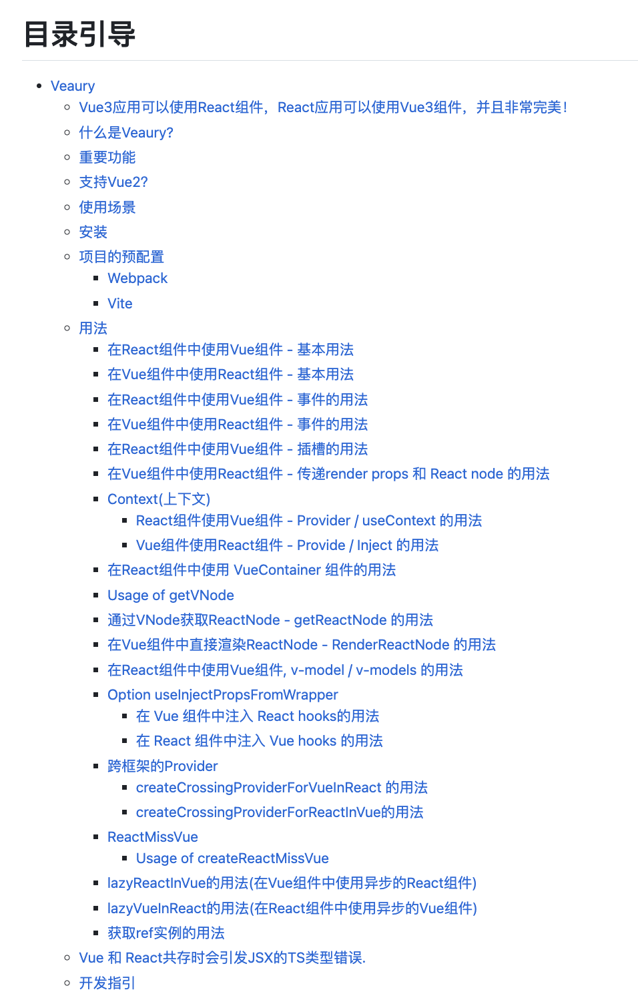
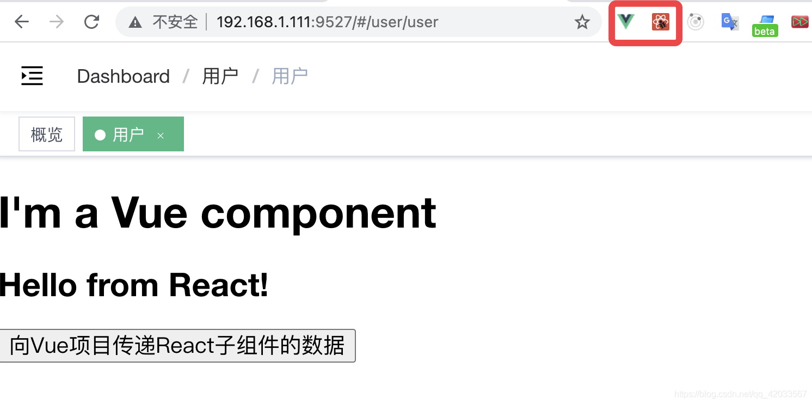
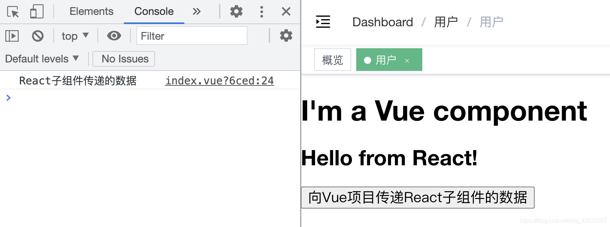
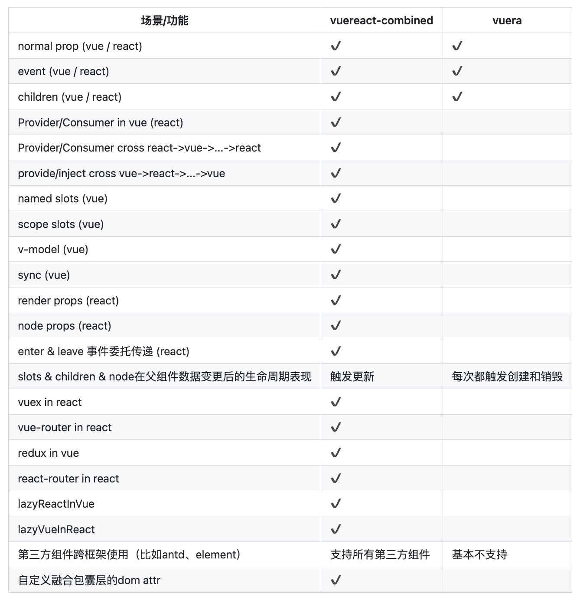
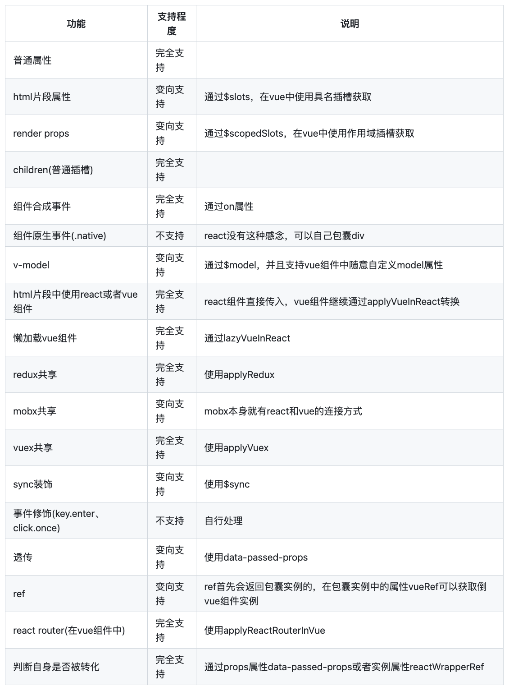
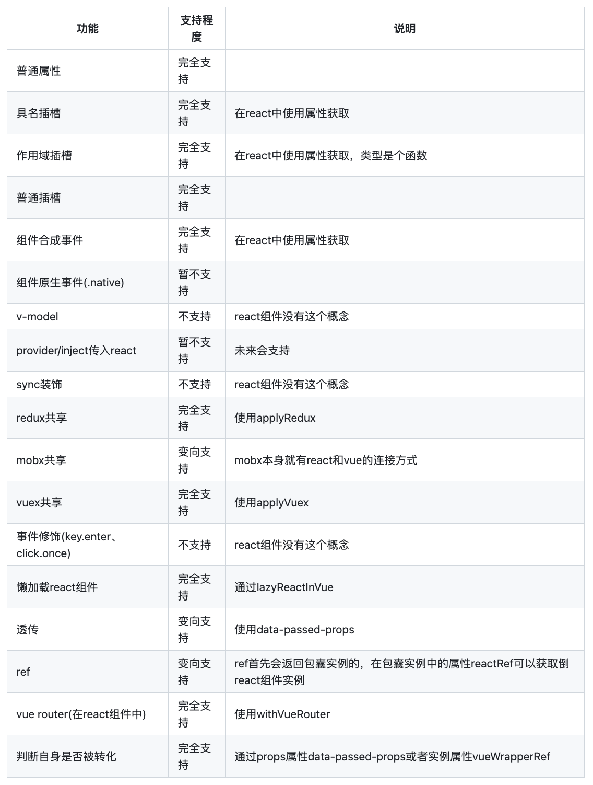

# 混用Vue&React

在前端开发领域，React和Vue是两大热门框架，各自都有着强大的功能和丰富的生态系统。然而，你有没有想过，在一个项目中同时使用React和Vue？是的，你没有听错！竟然可以在同一个项目中混用这两个框架，享受它们的强大功能和优势。本文就来分享 3 个可以在一个项目中混用React和Vue的开源工具库。

## Veaury

Veaury 是一个基于 React 和 Vue3 的工具库，主要用于React和Vue在一个项目中公共使用的场景，主要运用在项目迁移、技术栈融合的开发模式、跨技术栈使用第三方组件的场景。

Veaury的特点如下：

1. 同时支持Vue3和React，方便在一个项目中公共使用；
2. 支持同一个应用中出现的vue组件和react组件的context共享；
3. 支持跨框架的hooks调用，可以在react组件中使用vue的hooks，也可以在vue组件中使用react的hooks；
4. 可以解决React和Vue在公共使用时的代码重复、冗余的问题。
5. 在一个应用中可以随意使用React或者Vue的第三方组件, 比如 antd, element-ui, vuetify。
6. 提供了详细的官方文档，包括英文版和中文版。



Veaury 的文档写的非常详细，这里就不再详细介绍其使用方式了。需要注意的是，Veaury 并不支持 Vue 2，如果需要使用Vue 2，可以使用下面要介绍的工具库。

**Github：**<https://github.com/devilwjp/veaury>

## Vuera

Vuera 是一个用于在 Vue 应用中使用 React 组件的库，同时也支持在 React 应用中使用 Vue 组件。它提供了一种方便的方式，使开发人员能够在不同的框架之间无缝地使用对方的组件。

要在 Vue 应用中使用React组件，可以按照以下步骤使用Vuera。

### 安装插件

1. 安装Vuera：使用npm或yarn在您的Vue项目中安装Vuera库。

```javascript
// 使用 yarn 安装
yarn add vuera

// 使用 npm 安装
npm i -S vuera
```

2. 安装依赖

由于需要在Vue中使用React组件，所以首先需要在项目中安装 React，安装指令如下：

```javascript
npm install --save react react-dom
```

### 项目配置

在`babel.config.js`文件中添加以下配置即可：

```json
{
  "presets": [
    "react"
  ],
  "plugins": [
    "vuera/babel"
  ]
}
```

接下来在项目中以插件的形式来引入并使用vuera库，可以在 `main.js` 中加入如下代码：

```javascript
import { VuePlugin } from 'vuera'
Vue.use(VuePlugin)
```

### 基本使用

完成上述配置之后，就可以在Vue项目中引入并使用React组件了。

React组件代码如下：

```javascript
import React from 'react'

function myReactComponent(props) {
  const { message } = props
  function childClickHandle() {
    props.onMyEvent('React子组件传递的数据')
  }
  return (
    <div>
      <h2>{ message }</h2>
      <button onClick={ childClickHandle }>向Vue项目传递React子组件的数据</button>
    </div>
  )
}

export default myReactComponent
```

Vue组件代码如下：

```javascript
<template>
    <div>
        <h1>I'm a Vue component</h1>
        <my-react-component :message="message" @onMyEvent="parentClickHandle"/>
    </div>
</template>

<script>
    // 引入React组件
    import MyReactComponent from './myReactComponent'

    export default {
        components: {
            'my-react-component': MyReactComponent  // 引入React组件
        },
        data() {
            return {
                message: 'Hello from React!',
            }
        },
        methods: {
            parentClickHandle(data){
                console.log(data);
            }
        },
    }
</script>
```

在 Vue 项目中引入了这个 React 组件，效果如下：\


可以看到，这里实现了Vue到React组件的传值，并显示在了页面上。根据右上角的Chrome插件显示，这个项目中既使用了Vue又使用了React。

点击页面中的按钮，可以看到，数据从React子组件传递到了Vue中：\


这样就简单实现了React和Vue组件之间的数据通信。

### 其他使用方式

如果不想通过 Babel plugin 的方式引入的话，可以使用以下这两种方法。

**（1）使用wrapper组件**

```javascript
<template>
  <div>
    <react :component="component" :message="message" />
  </div>
</template>
 
<script>
  import { ReactWrapper } from 'vuera'  // 引入vuera库
  import MyReactComponent from './MyReactComponent'  // 引入react组件
 
  export default {
    data () {
      component: MyReactComponent,
      message: 'Hello from React!',
    },
    components: { react: ReactWrapper }
  }
</script>
```

**（2）使用高阶组件的API**

```javascript
<template>
  <div>
    <my-react-component :message="message" />
  </div>
</template>
 
<script>
  import { ReactWrapper } from 'vuera'  // 引入vuera库
  import MyReactComponent from './MyReactComponent'  // 引入react组件
 
  export default {
    data () {
      message: 'Hello from React!',
    },
    components: { 'my-react-component': ReactInVue(MyReactComponent) }
  }
</script>
```

在 React 项目中使用 Vue 组件也是同理，可以参考官方文档。

### 注意

Vuera 是一个比较成熟的 JavaScrip 库，但是目前已经不再维护（最近一次更新是三年前）。并且，该库不支持 Vue 3，如果想要支持 Vue 3，可以使用 Vueury。

**Github：**<https://github.com/akxcv/vuera>

## vuereact-combined

vuereact-combined 是一个用于 Vue和React快捷集成的工具包，并且适合复杂的集成场景。通过这个工具，可以在任何的Vue和React项目中使用另一个类型框架的组件，并且解决了复杂的集成问题。

vuera 开辟了Vue和React融合的想法，但是 vuera只能解决非常基础的组件融合，并且存在插槽(children)和数据变更后的渲染性能问题，因此无法用于复杂的场景以及生产环境。

vuereact-combined 将融合做到了极致，支持了大部分的Vue和React组件的功能，并且在渲染更新上使用了和vuera不同的思路，完美解决了渲染性能问题



注意，该项目只支持使用 Vue 2，如果想要使用 Vue 3，可以使用上面的介绍的 Veaury。

使用`vuereact-combined`的步骤如下。

### 安装插件

在项目中安装vuereact-combined：

```shell
npm install --save vuereact-combined
```

### 项目配置

在Vue和React的入口文件中引入 `vuereact-combined`：

```javascript
import Vue from 'vue';  
import React from 'react';  
import {Combined} from 'vuereact-combined';  
  
Vue.use(Combined);
```

配置Babel以支持JSX语法和Vue.js的特性。安装`babel-plugin-transform-vue-jsx`和`babel-preset-react`，并在`.babelrc`文件中添加相应的配置：

```json
{  
  "presets": ["react-app"],  
  "plugins": ["@vue/babel-plugin-transform-vue-jsx"]  
}
```

在webpack配置文件中添加相应的`loader`和`plugin`：

```javascript
const VueLoaderPlugin = require('vue-loader/lib/plugin');  
module.exports = function(webpackEnv) {  
  module: {  
    rules: [  
      {  
        test: /\.vue$/,  
        loader: 'vue-loader',  
      },  
      {  
        test: /\.js$/,  
        exclude: /node_modules\/(?!(vue|@vue\/.*)\/).*/,  
        use: {  
          loader: 'babel-loader',  
          options: {  
            presets: ['@babel/preset-env'],  
            plugins: ['@babel/plugin-transform-vue-jsx']  
          }  
        }  
      },  
      // 其他规则...  
    ],  
  },  
  plugins: [  
    new VueLoaderPlugin(),  
    // 其他插件...  
  ],  
};
```

配置完毕后，就可以在Vue和React之间进行快捷的集成了。

### 基本使用

假设有一个React组件，它是一个简单的函数组件：

```javascript
// 来自React项目的组件
const MyReactComponent = () => {
  return <div>Hello React!</div>;
};
```

可以在Vue项目中引入并使用这个组件。下面是一个使用`vuereact-combined`的Vue文件示例：

```vue
<template>
  <div>
    <MyReactComponent />
  </div>
</template>

<script>
import {Combined} from 'vuereact-combined';
import MyReactComponent from './MyReactComponent'; // 引入React组件

export default {
  components: {
    Combined,
    MyReactComponent // 将React组件注册为Vue组件
  },
  // 其他Vue代码...
};
</script>
```

这里，首先引入了`MyReactComponent`，然后在Vue组件中使用它。通过将React组件注册为Vue组件，我们可以在Vue模板中使用它，就像使用普通的Vue组件一样。

这里只展示了最基本的使用方法，其他使用场景可以参考官方文档。

### 注意事项

* **在Vue项目中使用第三方的React组件**：第三方的react组件已经是通过babel进行过处理，不包含 React 的 jsx。此情况下，可以直接在项目中使用applyReactInVue对第三方的 React 组件进行处理。
* **在React项目中使用第三方的Vue组件**：第三方的Vue组件已经是通过vue-loader和babel进行过处理，不包含.vue文件以及Vue的jsx。此情况下，可以直接在项目中使用applyVueInReact对第三方的Vue组件进行处理。

在 React 项目中引入Vue组件的支持程度：



在 Vue 项目中引入 React 组件：



**Github：**<https://github.com/devilwjp/vuereact-combined>


> 更新: 2023-09-22 00:34:40  
> 原文: <https://www.yuque.com/cuggz/feplus/kbgt3tkz3yo8qe13>