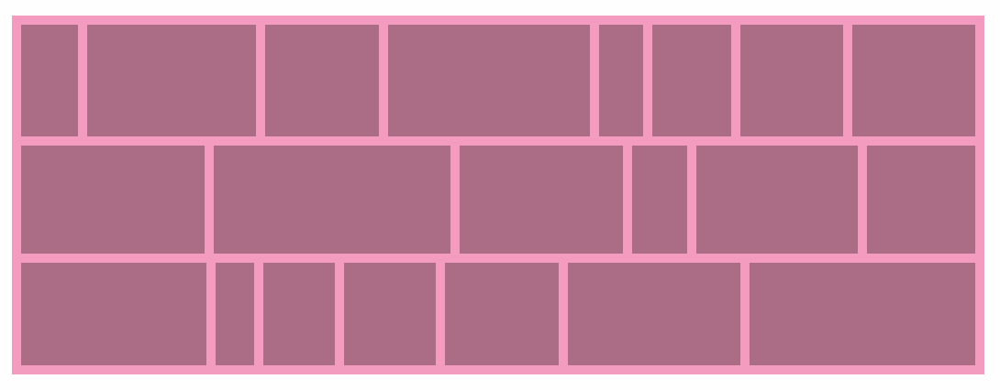
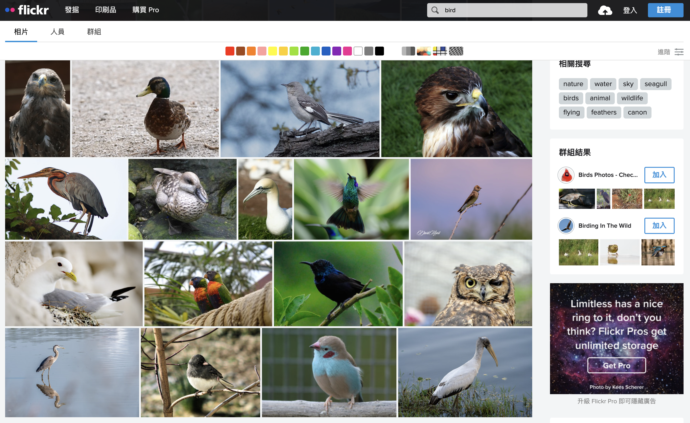
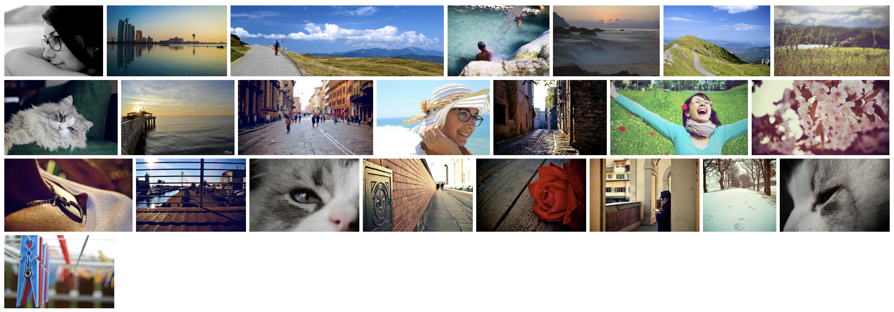
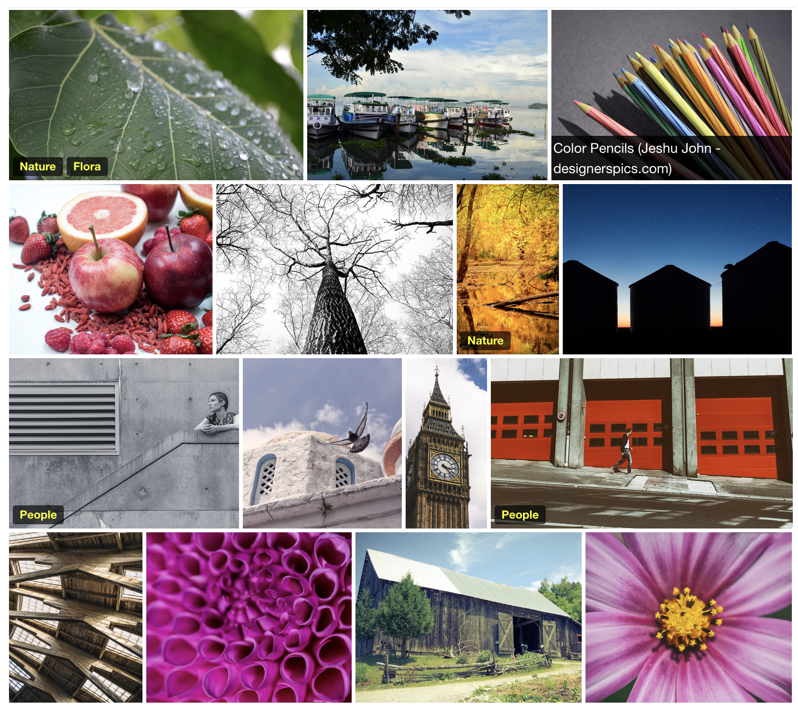
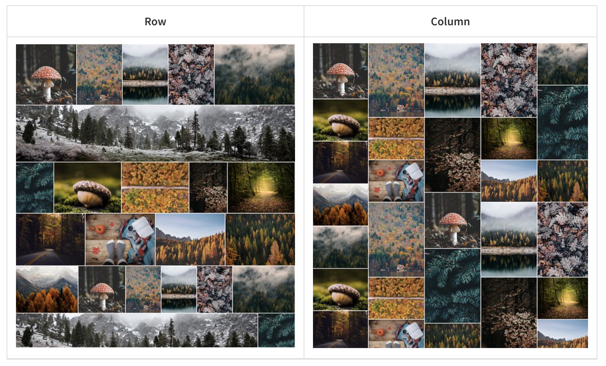
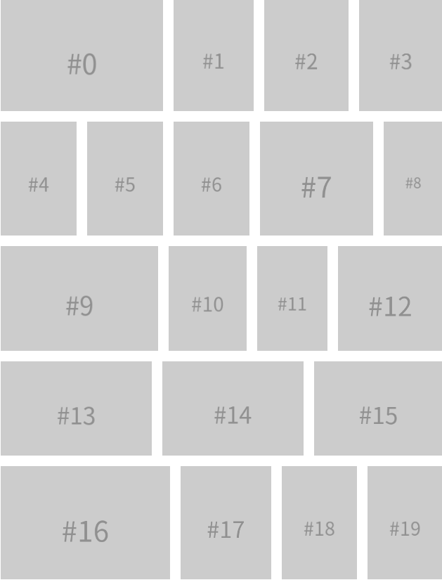

# 瀑布流

纵向瀑布流布局因其高效利用空间和直观展示内容的特性，在电商（如淘宝展示商品列表）、社交（如小红书展示帖子）等众多场景中广泛应用。在纵向瀑布流布局中，核心思想就是通过追踪每一列最后一个元素的位置来确定新元素应该被添加到哪一列。相比之下，横向瀑布流布局则显得更为复杂。在横向瀑布流中，**每行的高度和宽度被设定为统一，内部元素的宽度各异，要求算法能够精确计算并排列这些元素，确保它们能够紧密地填满每一行**。

本文就来分享几个开源的瀑布流实现工具，这些工具不仅简化了复杂的计算过程，还提供了丰富的配置选项和灵活的扩展能力，让开发者能够轻松实现横向瀑布流布局。

## Justified Layout
Justified Layout 是一个轻量级的 JavaScript 库，它专为帮助开发者构建类似 Flickr 网站上的图片展示布局而设计。这个库的核心理念在于通过算法自动调整图像的大小和间距，以达到视觉上的平衡感，同时保持图像比例不变。

**Github：**[https://github.com/flickr/justified-layout](https://github.com/flickr/justified-layout)

## Justified-Gallery
Justified Gallery 是一个开源的 JavaScript 库，用于在网页上创建高质量的图像瀑布流，让图像排列既美观又专业。知名摄影社交网站 500px 就是使用 Justified Gallery 来展示图像的。

**Github：**[https://github.com/miromannino/Justified-Gallery](https://github.com/miromannino/Justified-Gallery)

## React Grid Gallery
React Grid Gallery 是一个基于 React 的图片画廊组件，它受Google Photos的启发，专为React应用设计，旨在提供高效、美观且功能强大的图片展示解决方案。

**Github：**[https://github.com/benhowell/react-grid-gallery](https://github.com/benhowell/react-grid-gallery)

## **react-photo-gallery**
React Photo Gallery 是一个用于 React 的响应式、可访问性良好、可组合且可定制的图片画廊组件。这个组件的主要特点是它能够保持照片的原始宽高比，并且可以根据需要创建瀑布流布局。React Photo Gallery 支持纵向和横向方布局，并且提供了一个图像渲染器，允许你自定义实现诸如图片选择、收藏、标题等功能。

**Github：**[https://github.com/neptunian/react-photo-gallery](https://github.com/neptunian/react-photo-gallery)

## **react-photo-album**
React Photo Album 是一个为 React 设计的响应式照片相册组件。它支持行、列和瀑布流布局，灵感来源于 react-photo-gallery，但进行了全新的重构。

**Github：**[https://github.com/igordanchenko/react-photo-album](https://github.com/igordanchenko/react-photo-album)

## vue-photo-album
Vue Photo Album 是一个为 Vue 3 设计的响应式照片相册组件。它受到了 react-photo-album 的启发，但完全为 Vue 3 生态系统重新设计和实现。Vue Photo Album 支持行、列和瀑布流布局，并允许开发者通过自定义渲染器组件来扩展和定制其功能。

**Github：**[https://github.com/tenthree/vue-photo-album](https://github.com/tenthree/vue-photo-album)

> 更新: 2024-09-03 16:23:43  
> 原文: <https://www.yuque.com/cuggz/feplus/ege8msxxw8k9qc7p>