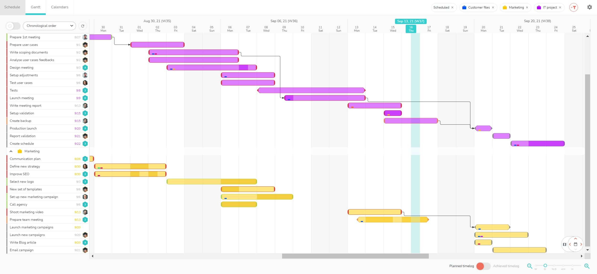
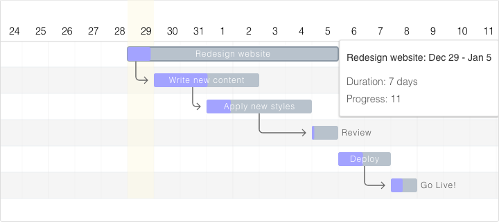
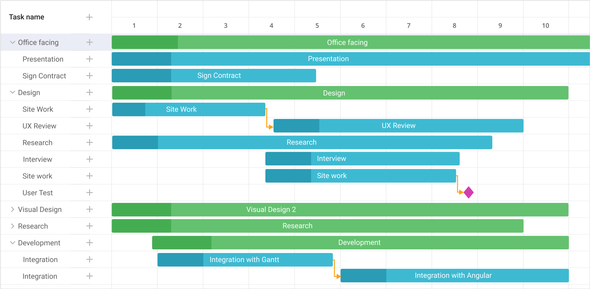
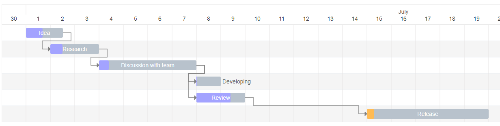
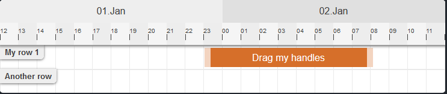
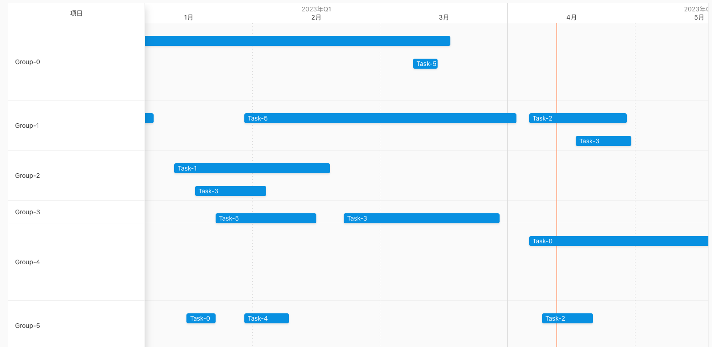

# 甘特图

甘特图是一种广泛使用的工具，它可以帮助开发人员更好地管理和展示项目进度，同时提高协作效率。本文将介绍一些流行的 JavaScript 甘特图库及其用法，以帮助更好地理解和选择适合需求的库。

下面是维基百科对甘特图的介绍：

> 甘特图（Gantt chart）是条状图的一种流行类型，显示项目、进度以及其他与时间相关的系统进展的内在关系随着时间进展的情况，是由亨利·甘特 (Henry Laurence Gantt) 于1910年开发出。在项目管理中，甘特图显示项目的终端元素的开始和结束，概要元素或终端元素的依赖关系，管理者可透过甘特图，监控项目当前各任务的进度。若想要同时显示多个不同的项目开始与结束的时间，就可以利用甘特图呈现，监控项目当前各任务的进度。



## Frappe Gantt

Frappe Gantt是一个用于生成甘特图的JavaScript库，支持交互式绘制、拖拽、缩放、任务依赖关系和时间刻度等功能。其具有以下特点：

* **交互式操作**：可通过拖动、缩放等方式对甘特图进行操作，以便更好地展现项目进度；
* **任务依赖关系**：支持设置任务之间的依赖关系，以便更好地管理项目进度；
* **时间刻度**：支持按天、周、月等不同时间跨度进行刻度展示，方便用户选择合适的时间范围；
* **美观易用**：采用现代UI设计，支持多种样式和主题，易于使用和集成到现有项目中；同时也支持多语言功能，方便国际化应用。

可以通过以下步骤来使用 Frappe Gantt：

1. 在终端中导航到项目目录并运行以下命令安装Frappe Gantt：

```javascript
npm install frappe-gantt
```

2. 在JavaScript文件中引入Frappe Gantt，并创建容器元素、配置甘特图数据、初始化Gantt对象，并将其附加到容器元素上

```html
<div id="gantt"></div>
```

```javascript
import Gantt from 'frappe-gantt';

const tasks = [
  {
    id: 'task-1',
    name: 'Task 1',
    start: '2023-04-12',
    end: '2023-05-12'
  },
  {
    id: 'task-2',
    name: 'Task 2',
    start: '2023-05-12',
    end: '2023-06-12',
    dependencies: 'task-1'
  }
];

const gantt = new Gantt('#gantt', tasks);

```

需要注意的是，在使用Frappe Gantt时，还需要在项目中引入相关样式和语言包等资源，以便正常使用。



**Github：**<https://github.com/frappe/gantt>

## Dhtmlx Gantt

DHTMLX Gantt 是一个开源的 JavaScript 甘特图库，可以在图表中说明和管理项目进度。其具有以下特点：

* **易于使用**：使用dhtmlxGantt可创建可视化的交互式甘特图，使项目进度变得更加清晰易懂。
* **可自定义**：dhtmlxGantt提供丰富的配置选项，可以自定义甘特图的外观和行为。
* **与其他库兼容性良好**：dhtmlxGantt可以与其他JavaScript库进行集成，如React、Angular、Vue等。
* **可高度定制**：这个库提供了各种扩展和插件，开发者可以根据需要进行高度定制。
* **多种导入和导出格式**：dhtmlxGantt支持多种格式来导入和导出项目计划，便于用户进行数据转换和分享。

dhtmlxGantt 提供了免费版和付费版，使用步骤如下：

1. 在终端中导航到项目目录并运行以下命令安装 dhtmlxGantt 插件

```plain
npm install dhtmlx-gantt
```

2. 在JavaScript文件中初始化dhtmlxGantt对象并配置相关参数

```html
<div id="gantt_here" style='width:1000px; height:450px;'></div>
```

```javascript
import 'dhtmlx-gantt';
import 'dhtmlx-gantt/codebase/dhtmlxgantt.css';

const tasks = {
  data: [
    {
      id: 1,
      text: 'Project #1',
      start_date: '2023-04-12',
      duration: 18,
      progress: 0.4
    },
    {
      id: 2,
      text: 'Task #1',
      start_date: '2023-04-12',
      duration: 8,
      parent: 1,
      progress: 0.6
    }
  ],
  links: [
    {
      id: 1,
      source: 1,
      target: 2,
      type: '1'
    }
  ]
};

gantt.init('gantt_here');
gantt.parse(tasks);
```

以上代码将在id为"gantt\_here"的div中创建一个简单的甘特图。



**Github：**<https://github.com/DHTMLX/gantt>

## gantt-task-react

gantt-task-react是一个基于React和TypeScript的交互式甘特图组件。它允许用户快速创建美观、可交互的甘特图，并提供了各种配置选项，使得开发者可以自定义甘特图的背景色、时间刻度、任务栏等样式。其具有以下特点：

* 基于React + TypeScript 开发，易于集成到现有项目中。
* 支持拖拽、缩放、滚动等交互操作，并提供了多种事件回调函数，便于开发者处理用户的操作行为。
* 可以自定义任务栏的背景色、文本、进度条样式等，支持多种任务类型（如里程碑、汇总任务等）。
* 提供了多种适配器（adapter）插件，可以与不同的数据源（如本地数据、RESTful API接口）进行集成。

可以通过以下步骤来使用 gantt-task-react：

1. 在终端中导航到项目目录并运行以下命令安装gantt-task-react：

```plain
npm install gantt-task-react
```

2. 在需要使用 gantt-task-react 的组件中引入Gantt组件：

```javascript
import React from 'react';
import Gantt from 'gantt-task-react';

function MyComponent() {
  const tasks = {
    data: [
      {
        id: 1,
        text: 'Task #1',
        start_date: '2023-04-12',
        duration: 4,
        progress: 0.4
      },
      {
        id: 2,
        text: 'Task #2',
        start_date: '2023-04-14',
        duration: 3,
        progress: 0.6
      }
    ]
  };

  return (
    <Gantt tasks={tasks} />
    );
}

export default MyComponent;
```

3. 在Gantt组件中添加需要的配置项

```javascript
<Gantt 
  tasks={tasks}
  dateGrid={{
    hour: "[Hh]"
  }}
  timeSteps={{
    day: 1
  }}
  scrollPositions={{
    scrollTop: 150
  }}
  taskListWidth={300}
/>
```

以上代码将在 `MyComponent` 中创建一个简单的甘特图，并设置了一些常用的配置项。



**Github：**<https://github.com/MaTeMaTuK/gantt-task-react>

## Vue Ganttastic

Vue Ganttastic 是一个基于Vue 3的简单、交互式且高度可定制的甘特图组件。它可以在Web应用中展示任务和进度，支持拖拽、缩放和事件处理等交互特性。其具有以下特点：

* 支持 Vue 3 版本，提供了可用的TypeScript类型声明。
* 支持拖拽、缩放和事件处理等交互特性。
* 提供了多种配置项使用户可以自定义样式、数据源等。
* 支持多种任务类型，包括普通任务、里程碑、汇总任务等。
* 提供了丰富的事件处理函数，例如onTaskSelected、onTaskMoved等，方便用户对任务的操作进行响应。
* 代码简洁易懂，易于定制和扩展。

可以通过以下步骤来使用 Vue Ganttastic：

1. 在终端中导航到Vue项目目录并运行以下命令安装Vue Ganttastic：

```javascript
npm install vue-ganttastic
```

2. 在需要使用Vue Ganttastic的组件中引入GanttChart组件：

```javascript
<template>
  <div id="app">
    <GanttChart :tasks="tasks" />
  </div>
</template>

<script>
import { defineComponent } from 'vue';
import GanttChart from 'vue-ganttastic';

export default defineComponent({
  name: 'App',
  components: {
    GanttChart,
  },
  data() {
    return {
      tasks: [
        {
          id: 1,
          label: 'Task 1',
          start: '2023-04-12',
          end: '2023-04-16',
        },
        {
          id: 2,
          label: 'Task 2',
          start: '2023-04-14',
          end: '2023-04-18',
        },
      ],
    };
  },
});
</script>
```

3. 在GanttChart组件中添加需要的配置项

```javascript
<GanttChart
  :tasks="tasks"
  :chart-start-date="new Date('2023-04-10')"
  :chart-end-date="new Date('2023-04-20')"
  :bar-style="{ backgroundColor: '#66ccff' }"
  :is-vertical="false"
  :day-class-factory="dayClassFactory"
/>
```

以上代码将在App组件中创建一个简单的甘特图，并设置了一些常用的配置项。



**Github：**<https://github.com/zunnzunn/vue-ganttastic>

## NgxGantt

NgxGantt 是一款基于 Angular 框架的甘特图组件，支持多种视图展示并支持多种高级的特性，能快速的帮助开发者搭建自己的甘特图应用。其具有以下特点：

* 5 种视图（日、周、月、季、年）
* 任务分组展示
* 树形结构数据展示并支持异步加载
* 任务前后置依赖关联及展示
* 任务拖拽更改时间
* 表格自定义
* 滚动加载数据
* 导出为图片
* 可定制化开发

可以通过以下步骤来使用 ngx-gantt：

1. 在终端中导航到Vue项目目录并运行以下命令安装 ngx-gantt：

```javascript
npm install ngx-gantt
```

2. 在"app.module.ts"中引入和注册GanttModule

```javascript
import { BrowserModule } from '@angular/platform-browser';
import { NgModule } from '@angular/core';
import { GanttModule } from 'ngx-gantt';

import { AppComponent } from './app.component';

@NgModule({
  declarations: [
    AppComponent
  ],
  imports: [
    BrowserModule,
    GanttModule,
  ],
  providers: [],
  bootstrap: [AppComponent]
})
export class AppModule { }
```

3. 在组件中使用`<ngx-gantt>`标签，并传入需要展示的任务数据

```javascript
<ngx-gantt [ganttOptions]="options" [tasks]="tasks"></ngx-gantt>
```

其中，tasks是一个任务列表（数组），每个任务对象包含任务名、开始时间、结束时间、进度等属性；ganttOptions是一个可选的配置对象，用于自定义甘特图的外观和行为，例如：设置语言、设置日期格式、设置样式风格等。



**Github：**<https://github.com/worktile/ngx-gantt>


> 更新: 2023-04-20 21:06:47  
> 原文: <https://www.yuque.com/cuggz/feplus/oshoo6ntguvhsoti>