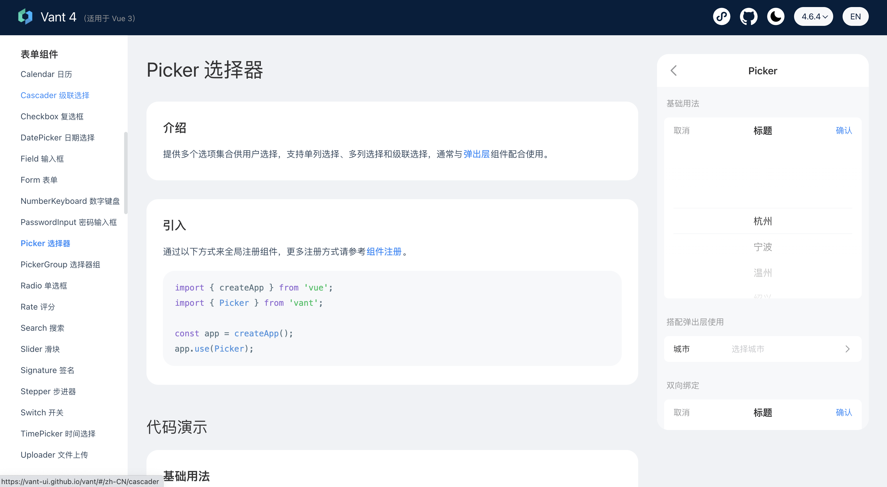
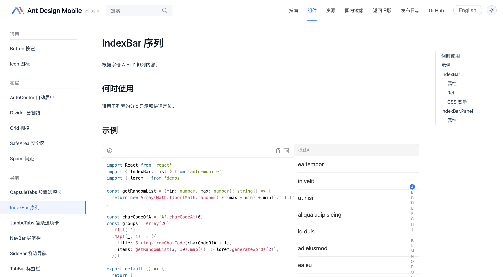
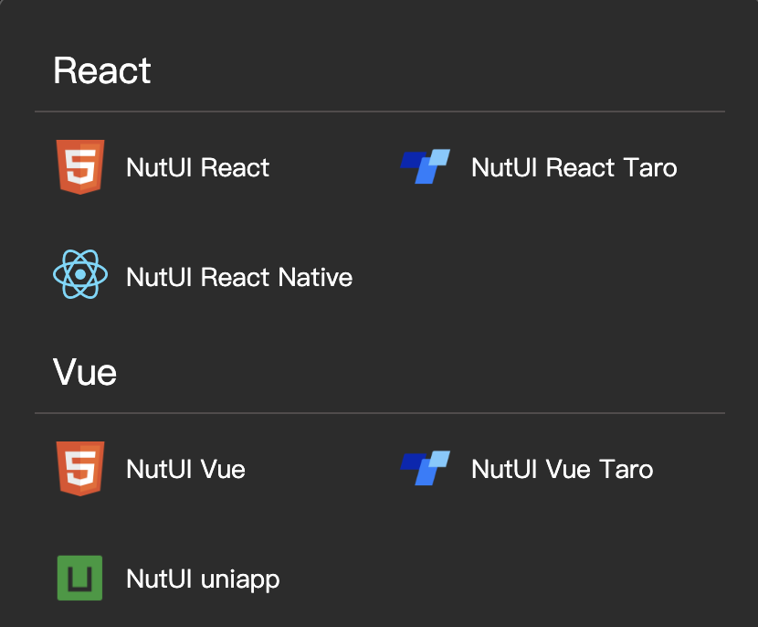
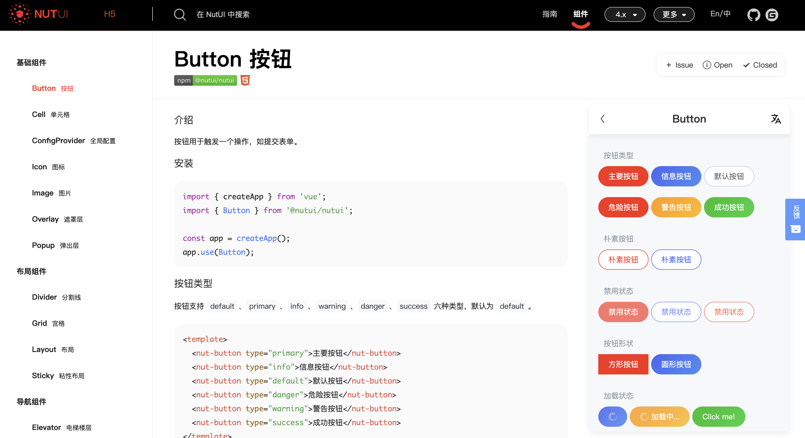
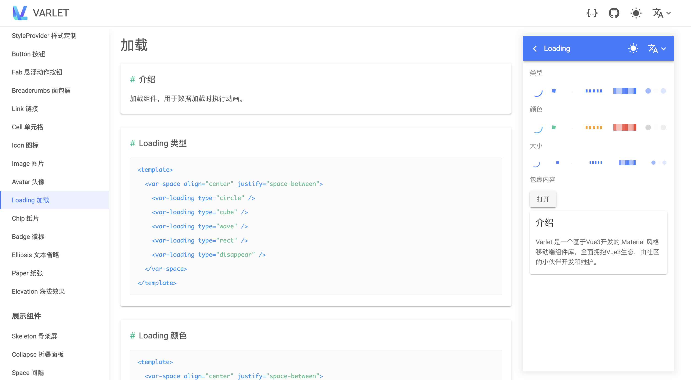
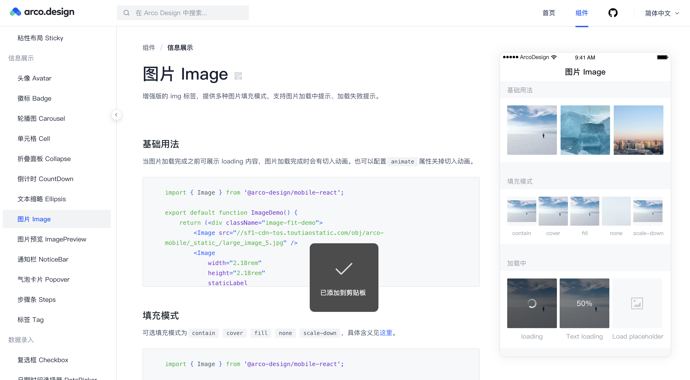
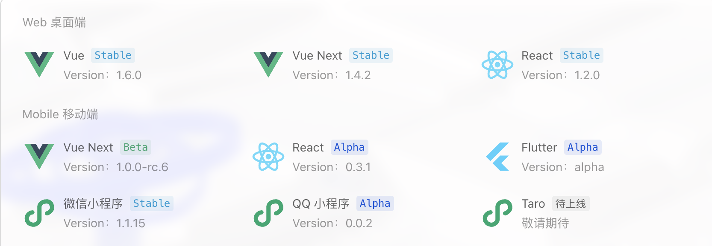
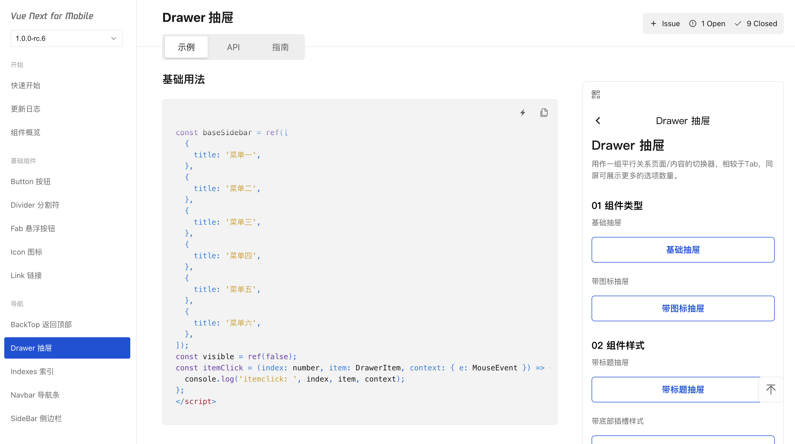

# 移动端组件库

本文来分享一些热门的、经过验证的高颜值移动端UI组件库，帮助你选择适合自己项目的组件库！

## Vant
Vant 是有赞团队开源的一个轻量、可定制的移动端组件库，于 2017 年开源。目前 Vant 官方提供了 Vue 2 版本、Vue 3 版本和微信小程序版本，并由社区团队维护 React 版本和支付宝小程序版本。

Vant 具有以下特性：

+ 🚀 性能极佳，组件平均体积小于 1KB（min+gzip）
+ 🚀 80+ 个高质量组件，覆盖移动端主流场景
+ 🚀 零外部依赖，不依赖三方 npm 包
+ 💪 使用 TypeScript 编写，提供完整的类型定义
+ 💪 单元测试覆盖率超过 90%，提供稳定性保障
+ 📖 提供丰富的中英文文档和组件示例
+ 📖 提供 Sketch 和 Axure 设计资源
+ 🍭 支持 Vue 2、Vue 3 和微信小程序
+ 🍭 支持 Nuxt 2、Nuxt 3，提供 Nuxt 的 [Vant Module](https://github.com/vant-ui/vant-nuxt)
+ 🍭 支持主题定制，内置 700+ 个主题变量
+ 🍭 支持按需引入和 Tree Shaking
+ 🍭 支持无障碍访问（持续改进中）
+ 🍭 支持深色模式
+ 🍭 支持服务器端渲染
+ 🌍 支持国际化，内置 30+ 种语言包

+ 官网：[https://vant-ui.github.io/vant/](https://vant-ui.github.io/vant/)
+ Github：[https://github.com/youzan/vant](https://github.com/youzan/vant)

## **Ant Design Mobile**
Ant Design 移动端设计规范，一个基于 Preact/React/React Native 的 UI 组件库。Ant Design 是 Ant Design 的移动规范的 React 实现。

Ant Design Mobile 具有以下特点：

+ 高性能：无需配置，即可拥有最佳的包体积大小和极致的性能
+ 可定制：可以高效地对组件外观进行调整或创造自己的主题
+ 原子化：每个组件的功能不多也不少，恰好就是你所需
+ 流畅感：拥有流畅的手势和细腻的动画，助力产品打造出极致体验

+ 官网：[https://mobile.ant.design/zh](https://mobile.ant.design/zh)
+ Github：[https://github.com/ant-design/ant-design-mobile](https://github.com/ant-design/ant-design-mobile)

## NutUI
NutUI 是一个由京东零售团队开源的京东风格的轻量级组件库，支持移动端 H5 和小程序开发。

NutUI 具有以下特性：

+ 🚀 70+ 高质量组件，覆盖移动端主流场景
+ 💪 支持一套代码同时开发 H5+多端小程序
+ 📖 基于京东APP 10.0 视觉规范
+ 🍭 支持按需引用
+ 📖 详尽的文档和示例
+ 💪 支持 TypeScript
+ 💪 支持服务端渲染（测试阶段）
+ 🍭 支持组件级别定制主题，内置 700+ 个变量
+ 🌍 国际化支持，已支持英文，印尼语和繁体中文
+ 🍭 单元测试覆盖率超过 80%，保障稳定性
+ 📖 提供 Sketch 设计资源

NutUI 提供了多个框架的版本组件：

+ 官网：[https://nutui.jd.com/](https://nutui.jd.com/)
+ Github：[https://github.com/jdf2e/nutui](https://github.com/jdf2e/nutui)

## Varlet
Varlet 是一个基于 Vue3 开发的 Material 风格移动端组件库，全面拥抱 Vue3 生态，由社区团队维护。

Varlet 具有以下特性：

+ 🚀   提供 60+ 个高质量通用组件
+ 🚀   组件十分轻量
+ 💪   由国人开发，完善的中英文文档和后勤保障
+ 🛠️   支持按需引入
+ 🛠️   支持主题定制
+ 🌍   支持国际化
+ 💡   支持 webstorm 组件属性高亮
+ 💪   支持 SSR
+ 💡   支持 Typescript
+ 💪   确保 90% 以上单元测试覆盖率，提供稳定性保证
+ 🛠️   支持暗黑模式
+ 🛠️   提供官方的 VSCode 插件

+ 官网：[https://varlet.gitee.io/varlet-ui/#/zh-CN/index](https://varlet.gitee.io/varlet-ui/#/zh-CN/index)
+ Github：[https://github.com/varletjs/varlet](https://github.com/varletjs/varlet)

## Arco Design Mobile
Arco Design Mobile 是基于 Arco Design 设计系统、由字节跳动 UED-火山引擎 & 小说前端匠心打造、经历两年多字节内部打磨的移动端组件库。

Arco Design Mobile 提供了 50+ 基础组件，覆盖各类场景。借助 Arco 丰富的组件可以更好的搭建应用，提高效率，在整个产品生产过程中创造更具凝聚力的可扩展体验。

+ 官网：[https://arco.design/mobile/react](https://arco.design/mobile/react)
+ Github：[https://github.com/arco-design/arco-design-mobile](https://github.com/arco-design/arco-design-mobile)

## TDesign Mobile
TDesign 是一款诞生于腾讯内部、拥有完整的设计价值观和视觉风格指南的企业级设计体系，同时提供了丰富的设计资源，在设计体系基础上产出基于 Vue、React、小程序等业界主流技术栈的组件库解决方案，适合用于构建设计统一 / 多端覆盖 / 跨技术栈的企业级前端应用。

TDesign 提供了多个版本的组件：

+ 官网：[https://tdesign.tencent.com/](https://tdesign.tencent.com/)
+ Github：[https://github.com/Tencent/tdesign](https://github.com/Tencent/tdesign)

## 

> 更新: 2023-09-22 00:21:55  
> 原文: <https://www.yuque.com/cuggz/feplus/lgnwtq1ng0z3kob0>