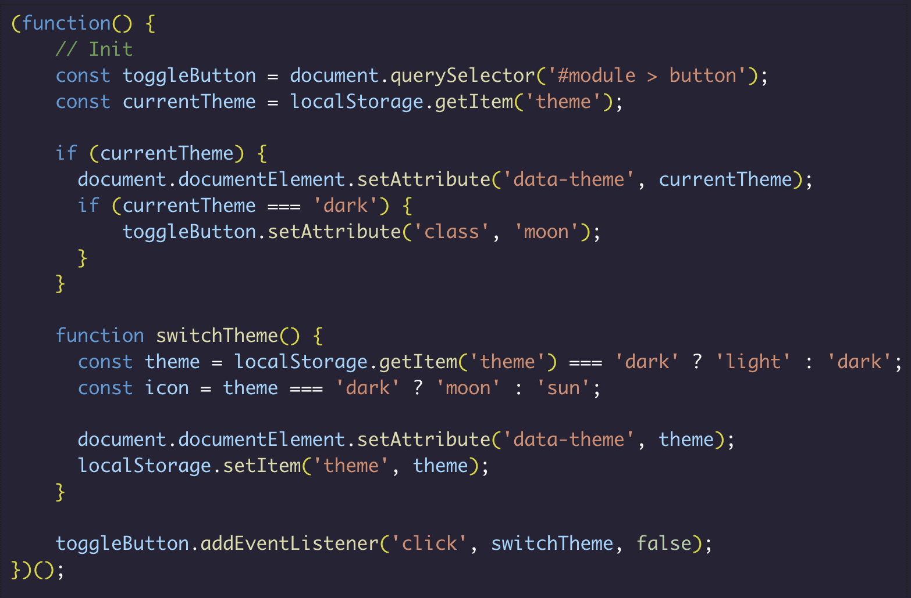
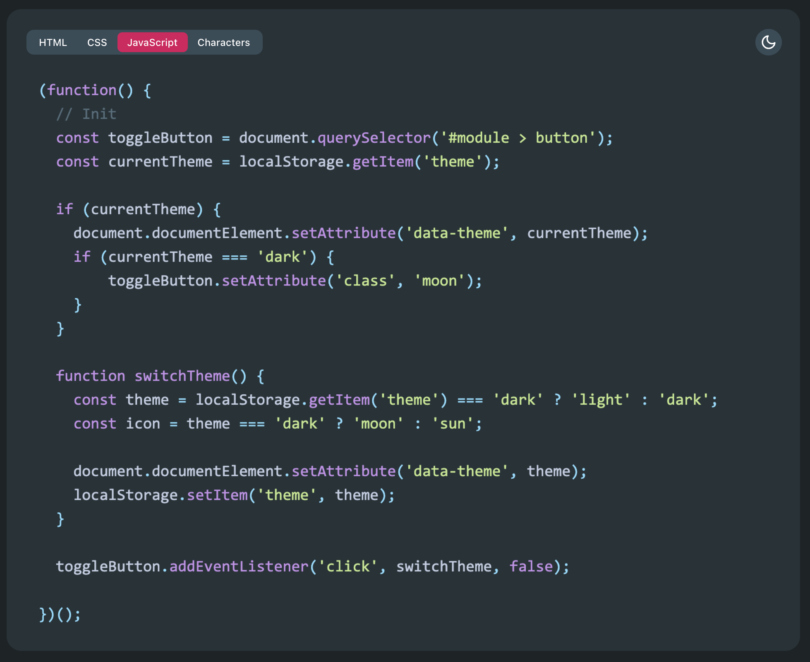
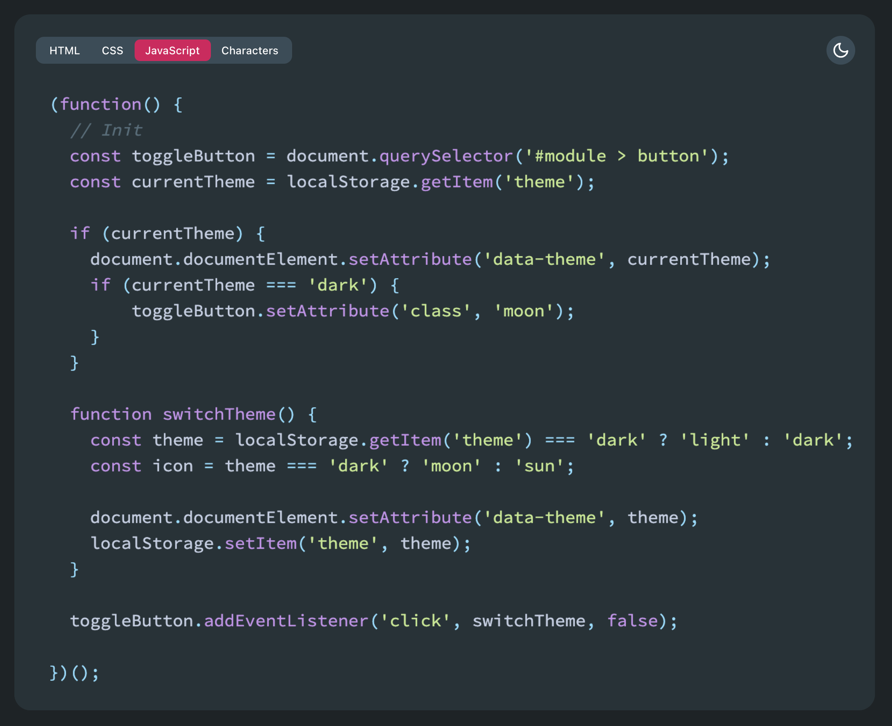
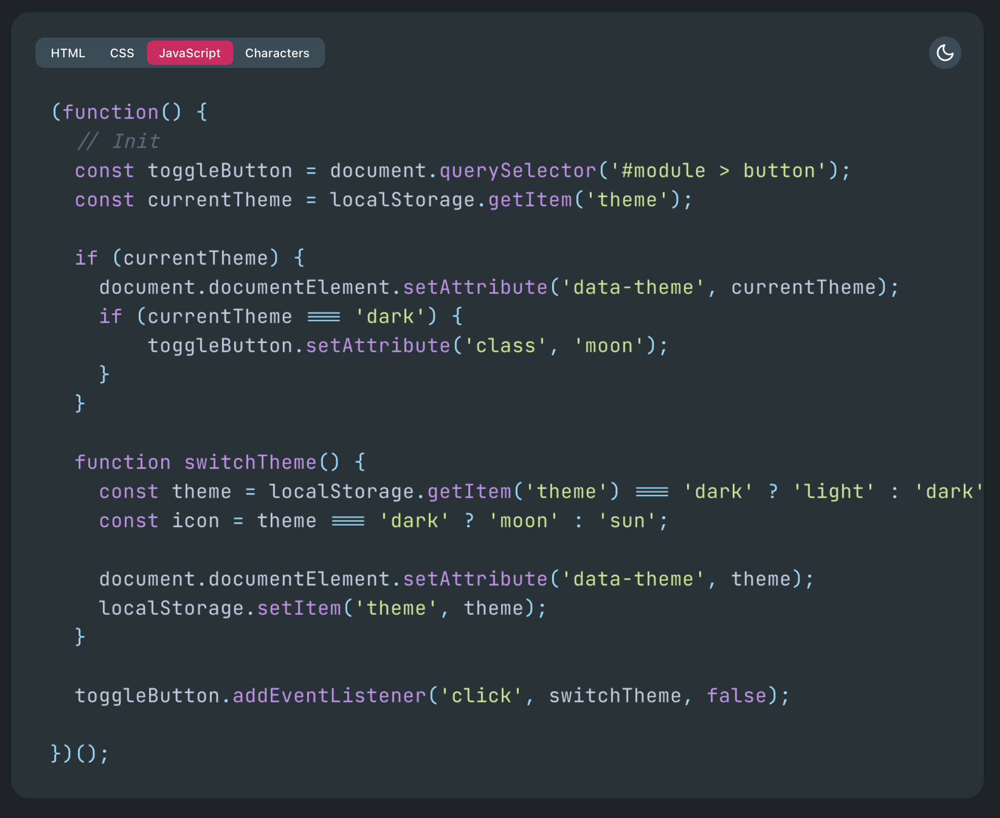
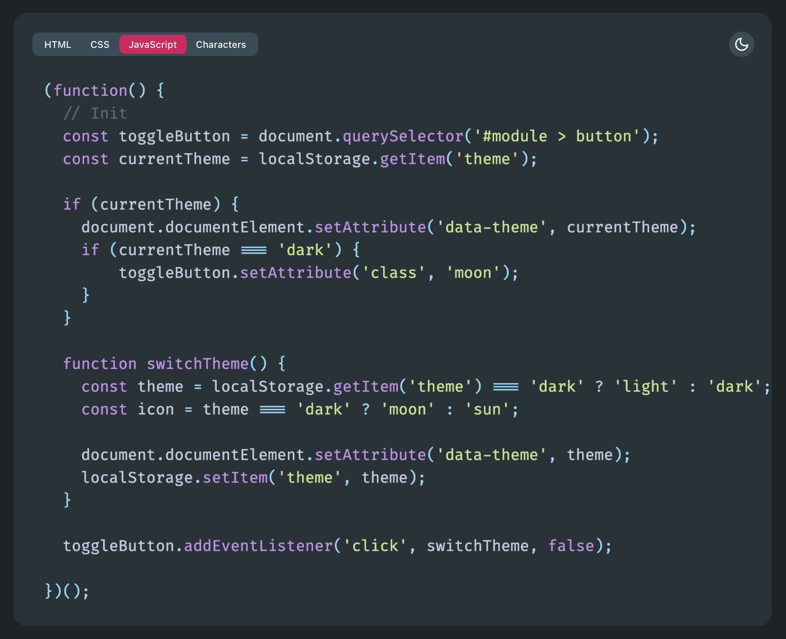
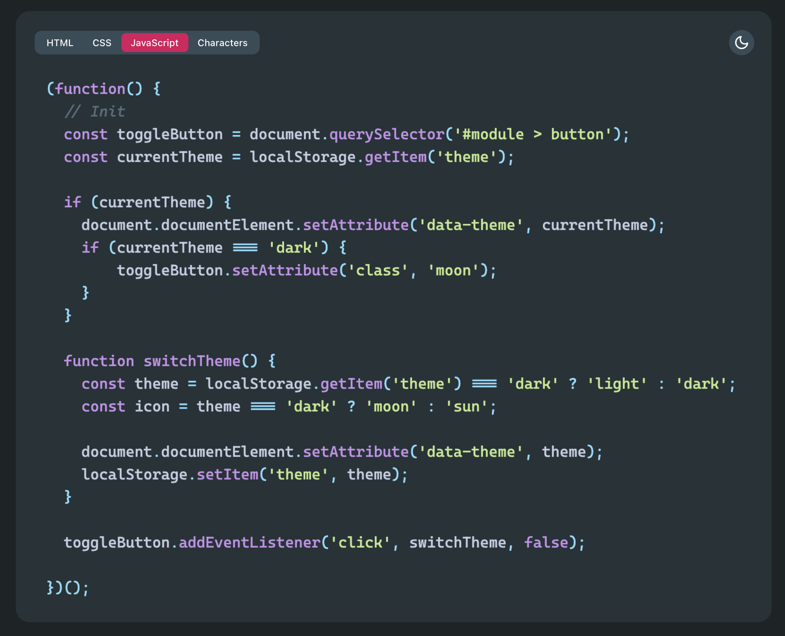
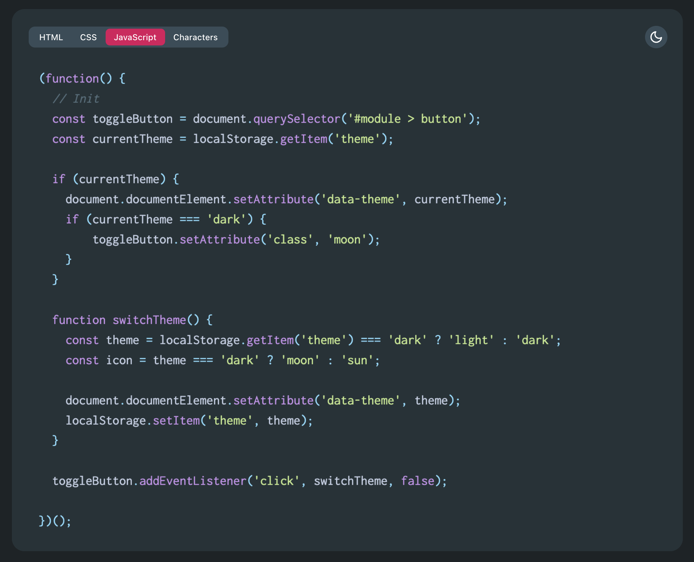
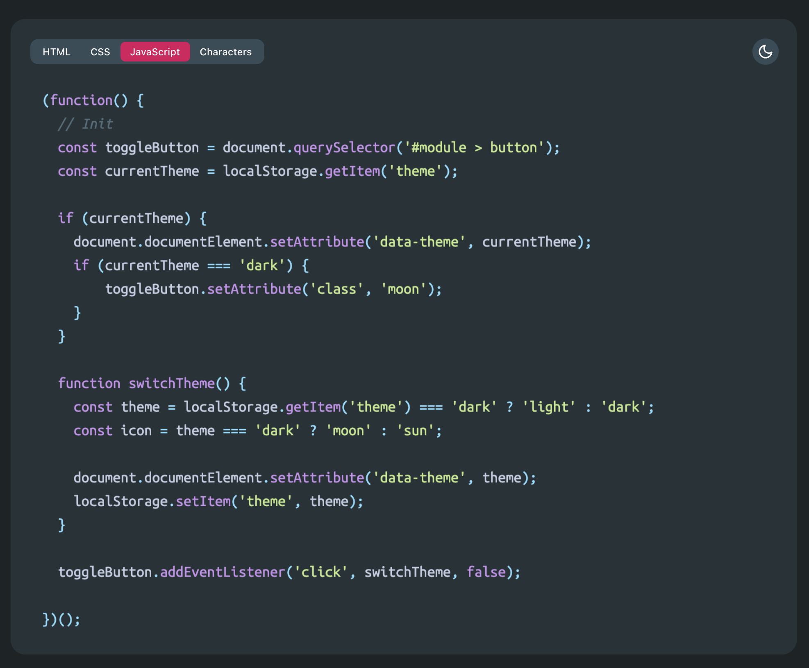
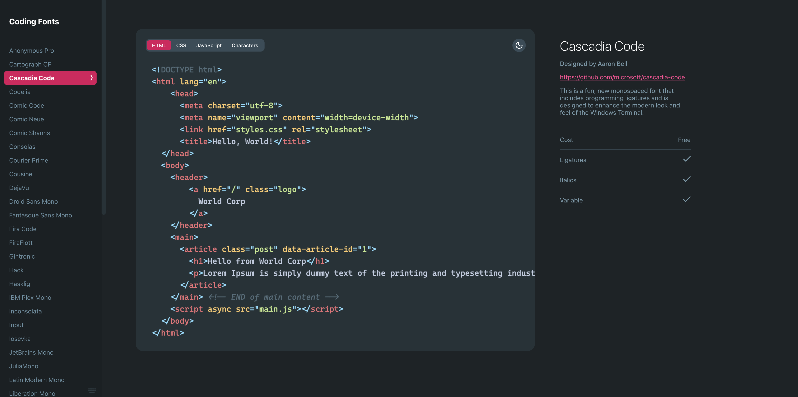

# 编程字体

对于程序员来说，每天面对最多的就是代码了，选择一款赏心悦目的编程字体就显得尤为重要。那什么是好看的字体呢？一些基本的要求就是：相似符号要有明显区别，比如：`0、O、o`；`l、I、1`；`全角和半角的（）`等，并且得看着舒服。还有些开发者认为输入和显示不要有太大的差异，比如：`!= 展示为 ≠`；`=== 展示为 ≡`等，这个就仁者见仁智者见智了。下面就来分享一些好看的编程字体！

## Monaco

Monaco 字体是一款专为编程和代码编辑设计的等宽字体，以其简洁明了的无衬线设计风格、高可读性和清晰的字符区分度，受到开发者们的青睐，Mac 自带 Monaco 字体。

## Consolas

Consolas 是一款等宽无衬线字体，专为编程和代码编辑环境而优化。这款字体使用了微软的ClearType字型平滑技术，确保在液晶显示器上呈现最佳效果，其特点包括在较少的空间内显示更多内容的能力，以及清晰易读的字体设计，使得编程员能够更快捷地分辨每一个字符。

## Source Code Pro

Source Code Pro 是一款由 Adobe 公司发布的开源免费等宽编程字体。自2012年发布以来，以其清晰易读、跨平台支持和优化的字符区分度等特点，成为编程社区广泛认可的字体选择。

下载：<https://github.com/adobe-fonts/source-code-pro>

## JetBrains Mono

JetBrains Mono 是由JetBrains公司专为开发者设计的一款等宽编程字体，字体设计特别关注字母的大小和形状、字形之间的空间量、自然等宽平衡、不必要的细节以及难以区分的符号或字母（如l和I）等因素。

下载：<https://github.com/JetBrains/JetBrainsMono>

## Fira Code

Fira Code是一款专为编程设计的开源字体，其最大的亮点在于其连字符功能，它可以将编程中常用的符号组合设计为特殊的图形，如"<->"转变为双向箭头，">="和"<="变为带箭头的不等于，"=>"显示为右向箭头等。

下载：<https://github.com/tonsky/FiraCode>

## Cascadia Code

Cascadia Code 是一款由 Microsoft 发布的开源编程字体，专为提升编程代码的可读性和视觉体验而设计。该字体采用了等宽字形，支持编程连字特性，可以将常见的编程符号组合成易于识别的图形，从而增强代码的可读性，它还是 Visual Studio 中的默认字体。

下载：<https://github.com/microsoft/cascadia-code>

## Inconsolata

Inconsolata是一款专为编程和文本排版设计的开源等宽字体，以其清晰的字形、优雅的外观和高度可定制性而广受好评。它采用等宽设计确保代码整洁易读，同时适用于多种应用场景，如编程开发、网页设计等。

下载：<https://github.com/googlefonts/Inconsolata>

## Ubuntu Mono

Ubuntu Mono是一款专为编程和文本编辑设计的等宽字体，具有跨平台兼容性，能够在各种操作系统上提供一致的阅读体验。其清晰简洁的字形设计特别适合长时间编程和文本编辑，有助于减轻眼睛疲劳。此外，Ubuntu Mono还拥有广泛的Unicode字符覆盖，确保在多种编程环境和文本编辑器中都能完美呈现。

下载：<https://fonts.google.com/specimen/Ubuntu+Mono>

## 其他

可以在 <https://coding-fonts.pages.dev/> 上查看其他字体的效果：

你平时喜欢用什么编程字体，欢迎在评论区留言讨论！

> 更新: 2024-06-07 17:32:17  
> 原文: <https://www.yuque.com/cuggz/feplus/uwgss2s7tdmzuf2f>