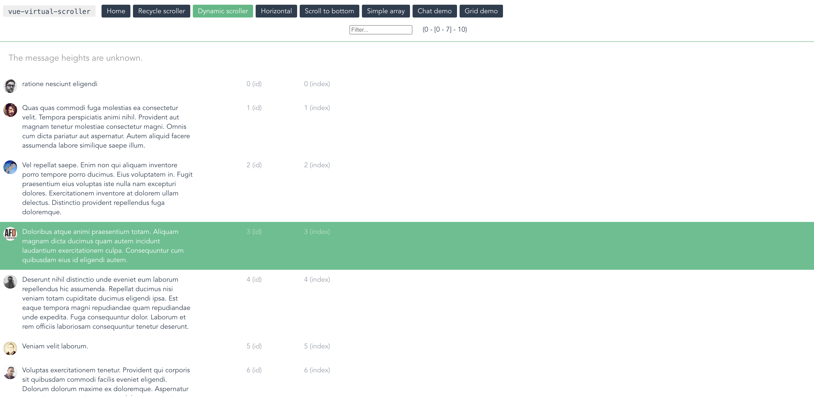
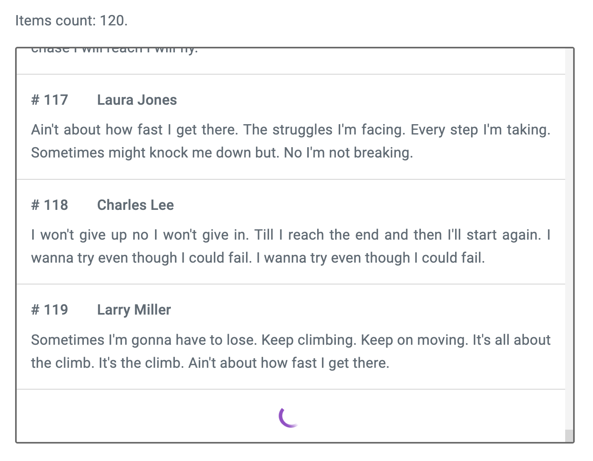
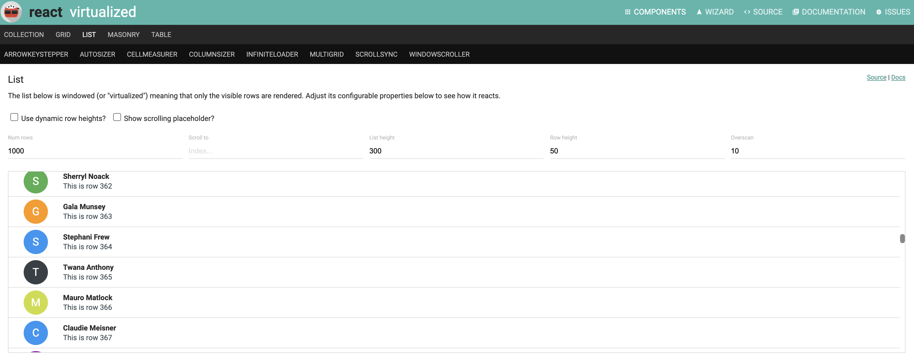
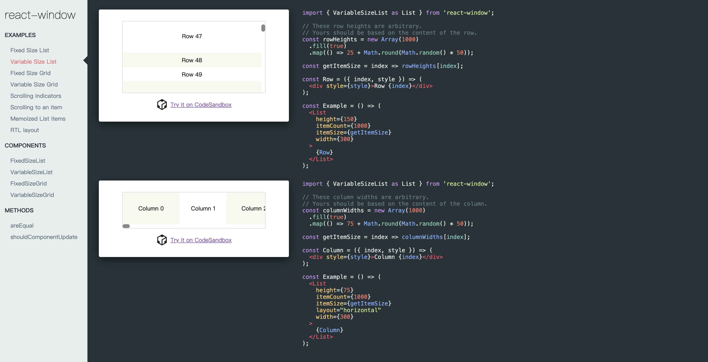
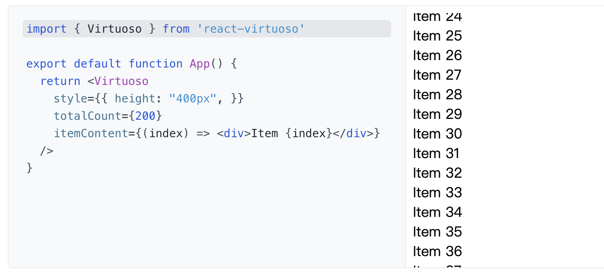

# 虚拟列表

## Vue
### vue-virtual-scroller
vue-virtual-scroller 是一个基于Vue.js的虚拟滚动列表组件，用于优化大数据量渲染时的性能。它可以在滚动时动态地加载和卸载列表项，从而减少页面的 DOM 元素数量，提高渲染效率，同时也能够提高用户体验。

vue-virtual-scroller 具有以下特点：

+ **无限滚动**：可以像普通滚动列表一样滚动，即使数据量非常大，也不会有性能问题。
+ **性能优秀**：只渲染当前可见区域内的数据，而不是整个列表，因此能够降低浏览器的负载，提高页面渲染性能。
+ **支持动态高度/宽度**：可以根据不同的数据项设置不同的高度或宽度。
+ **支持多种滚动方式**：支持垂直和水平两种滚动方式，同时也支持鼠标滚轮、触控滑动等多种滚动方式。
+ **易于使用**：支持通过简单的配置即可实现虚拟滚动列表，同时也可以自定义列表项的样式和渲染方式。

**Github（star：8.7k）：**[https://github.com/Akryum/vue-virtual-scroller](https://github.com/Akryum/vue-virtual-scroller)

### vue-virtual-scroll-list
vue-virtual-scroll-list 是一个支持高性能滚动的 Vue 组件，可以用于处理包含大量数据项的列表。它能够根据当前视窗的大小，只渲染可见部分的数据项，并在滚动时动态更新列表内容，从而实现高效的渲染和滚动性能。

vue-virtual-scroll-list 具有以下特点：

+ **高性能**：只渲染用户可见部分的数据，大大减少了渲染时间和内存占用，并提高了滚动时的渲染性能，特别是处理包含大量数据的列表时更为明显。
+ **大型数据支持**：可以处理非常大的列表数据，在无需占用过多内存和处理器资源的同时，仍可以保证流畅的滚动体验。
+ **灵活定制**：该库提供了许多可配置的选项，如列表容器的高度和宽度、渲染行数、数据项组件等，使开发者可以根据自己的需求定制出更符合项目要求的虚拟滚动列表。
+ **可扩展性**：由于该库是基于 Vue 组件封装的，因此可以很方便地与其他 Vue 组件进行集成，适用于各种前端应用场景。
+ **轻量级**：代码简洁，不依赖任何第三方库，压缩后仅有几 kb 的大小，易于集成和使用。

**Github（star：4.2k）：**[https://github.com/tangbc/vue-virtual-scroll-list](https://github.com/tangbc/vue-virtual-scroll-list)

### vue3-infinite-list
vue3-infinite-list 是一个适用于vue的短小精悍的无限滚动加载库，零依赖。其具有以下特性：

+ **体积小 & 零依赖** – gzipped 后只有 3kb
+ **百万级列表渲染**, 不费吹灰之力
+ **支持滚动到指定条目** 或 **指定初始滚动偏移量**
+ **支持固定** 或 **可变** 宽/高
+ **垂直** or **水平** 列表

**Github（star：195）：**[https://github.com/tnfe/vue3-infinite-list](https://github.com/tnfe/vue3-infinite-list)

## React
### react-virtualized
React-virtualized是一个基于React框架的用于渲染大型列表和表格的库。它通过仅渲染可见部分的内容来提高性能，从而有效地处理大量数据。该库提供了一组可重复使用的高级组件，如List、Table、Masonry、InfiniteLoader等，这些组件旨在减少内存使用，并且可以通过自定义样式和布局进行配置。

**Github（star：25.5k）：**[https://github.com/bvaughn/react-virtualized](https://github.com/bvaughn/react-virtualized)

### react-window
React-window 是一个用于渲染大型列表和表格的轻量级库。它是实现虚拟滚动技术的一种方法，旨在提高处理大量数据时的性能和内存效率。

React-window 是对 React-virtualized 的完全重写，旨在使库更小、更快。React-window的包大小较小，并且在构建项目时对文件大小的增加也相对较小。相比之下，React-virtualized 有许多非必要的功能和组件，导致包大小较大。

**Github（star：14.8k）：**[https://github.com/bvaughn/react-window](https://github.com/bvaughn/react-window)

### react-virtuoso
React Virtuoso 是最强大的 React 虚拟列表/表格组件，以下是其优势所在：

+ 可变大小的项目
+ 支持反向（从底部向上）滚动和前置项目（例如聊天、动态推送等）。
+ 分组模式与粘性标题
+ 响应式网格布局
+ 表格支持
+ 自动处理内容调整
+ 自定义头部、底部和空列表组件
+ 固定顶部项目
+ 无限滚动、按需加载更多
+ 初始化最顶部项目索引
+ 滚动到指定项目索引的方法

**Github（star：4.3k）：**[https://github.com/petyosi/react-virtuoso](https://github.com/petyosi/react-virtuoso)

## 

> 更新: 2024-01-09 16:54:33  
> 原文: <https://www.yuque.com/cuggz/feplus/ggizmspvqzlg7uu4>