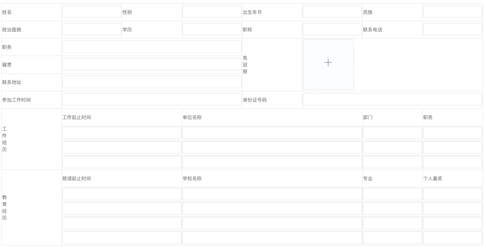
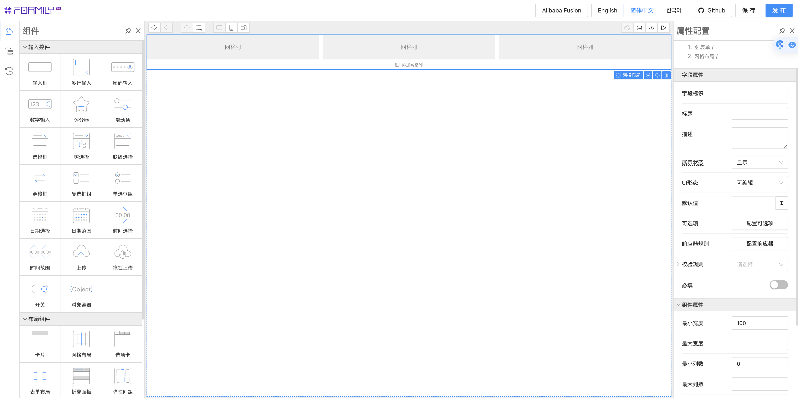
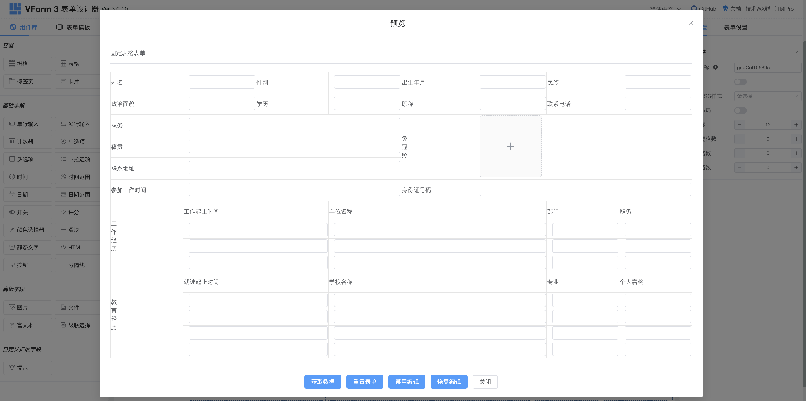
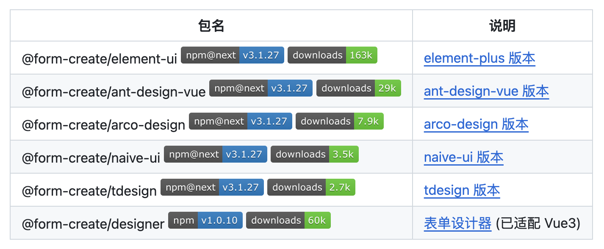
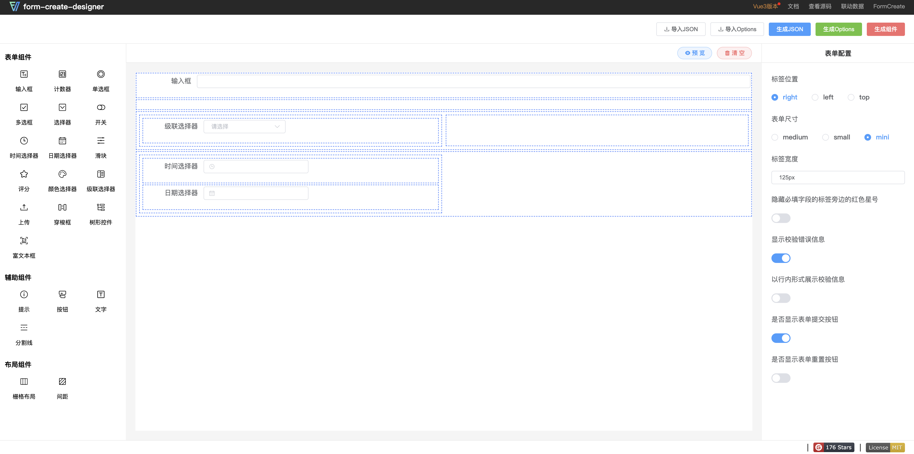
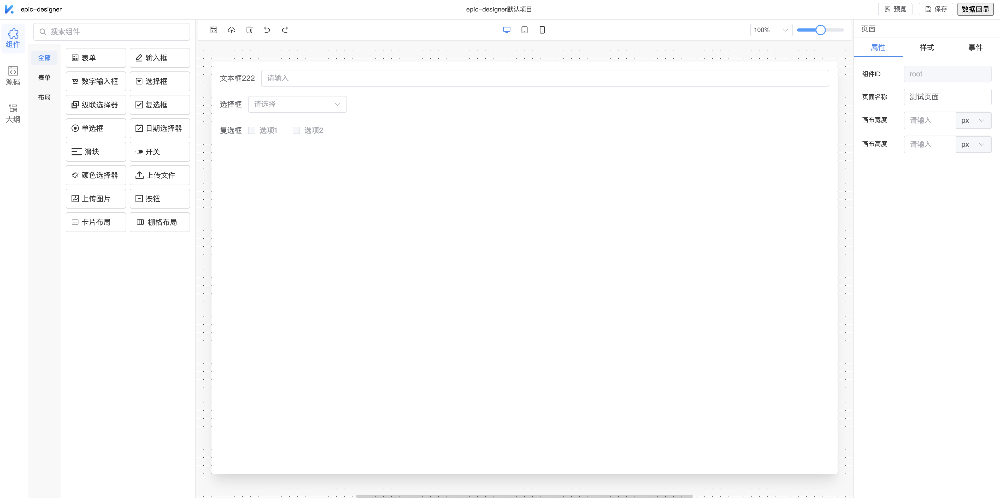

# 表单设计器

通常，可视化表单生成器包含两大核心组件：**表单设计器**和**表单渲染器**。表单设计器负责提供直观的可视化界面，让用户能够方便地搭建表单，并生成对应的JSON配置文件；而表单渲染器则负责读取这些JSON配置，并将其转换成实际可用的表单界面。

本文就来推荐 6 个相见恨晚的开源可视化表单生成器，这些工具将帮助你快速生成复杂的表单，提升工作效率，让你在面对大量表单制作任务时也能游刃有余！

## Formily
Formily 是一款面向中后台复杂场景的数据+协议驱动的表单框架，它也是阿里巴巴的统一表单解决方案。借助 Formily 可以完成复杂的表单页面需求，同时 Formily 提供的表单设计器可以快速搭建表单。

**Github：**[https://github.com/alibaba/formily](https://github.com/alibaba/formily)

## Variant Form
Variant Form 是一款高效的 Vue 低代码表单、工作流表单，包含表单设计器和表单渲染器，可视化设计，一键生成源码。它支持在 Vue 2 和 Vue 3 中使用，支持 Element UI 组件库。

预览效果：

**Github**：[https://github.com/vform666/variant-form](https://github.com/vform666/variant-form)

## form-create
form-create 是一个可以通过 JSON 生成具有动态渲染、数据收集、验证和提交功能的表单生成组件。支持 5 个UI框架，并且支持生成任何 Vue 组件。内置20种常用表单组件和自定义组件，再复杂的表单都可以轻松搞定。

**Github：**[https://github.com/xaboy/form-create](https://github.com/xaboy/form-create)

## Everright-formEditor
Everright-formEditor 是一个开源的可视化低代码编辑器，只需简单的操作即可创建出表单，拥有灵活的交互界面，PC端依赖Element Plus，Mobile 依赖 Vant，内部有一套适配器，适配 Element 和 Vant 的组件。

逻辑控制器：

**Github：**[https://github.com/Liberty-liu/Everright-formEditor](https://github.com/Liberty-liu/Everright-formEditor)

## form-generator
form-generator 是一款 Element UI 表单设计及代码生成器，可将生成的代码直接运行在基于 Element UI 的 Vue 项目中；也可导出 JSON 表单，使用配套的解析器将 JSON 解析成真实的表单。

**Github：**[https://github.com/JakHuang/form-generator](https://github.com/JakHuang/form-generator)

## EpicDesigner
EpicDesigner 是一款功能强大、开箱即用的拖拽式低代码设计器。它基于 Vue3 开发，兼容多套 UI 组件库，除了基础的页面设计功能，EpicDesigner 还提供了强大的扩展功能，可以让开发者根据自己的需求自由扩展和定制组件。此外，EpicDesigner使用 JSON 配置来生成页面，可帮助开发者快速生成页面，提高开发效率。它提供了两个重要组件：e-designer 设计器和 e-builder 生成器。

**Github：**[https://github.com/Kchengz/epic-designer](https://github.com/Kchengz/epic-designer)

> 更新: 2024-02-24 16:21:19  
> 原文: <https://www.yuque.com/cuggz/feplus/yfthv6qb43xcu4hb>