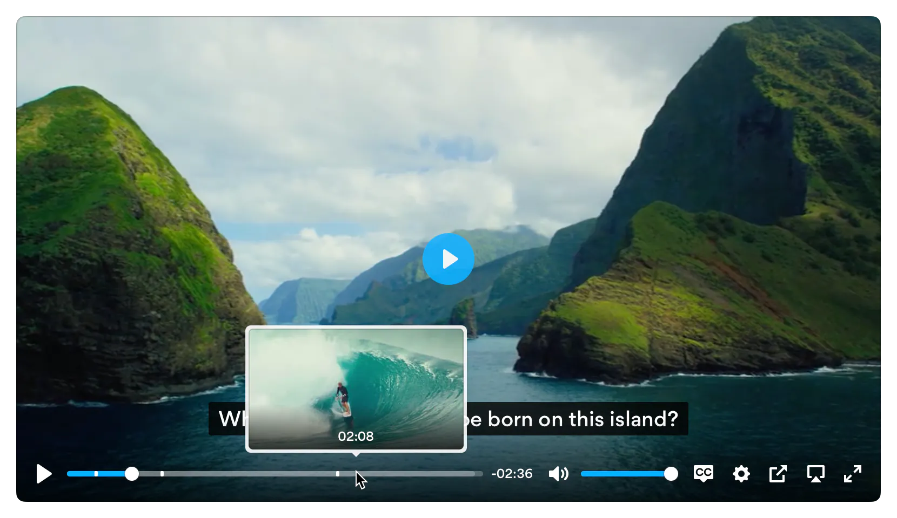
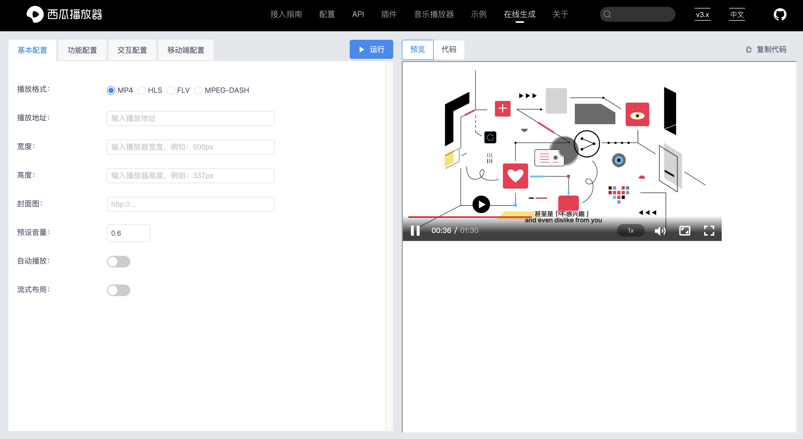
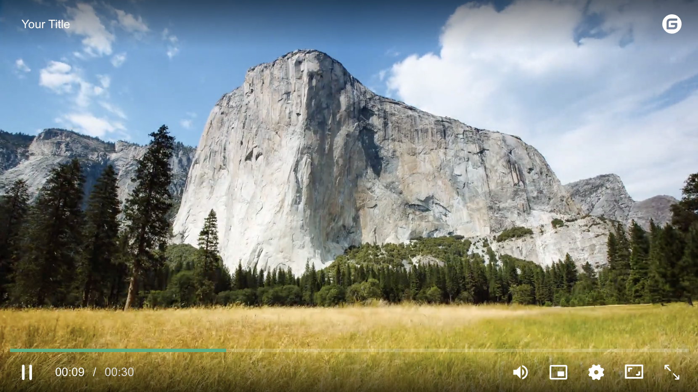
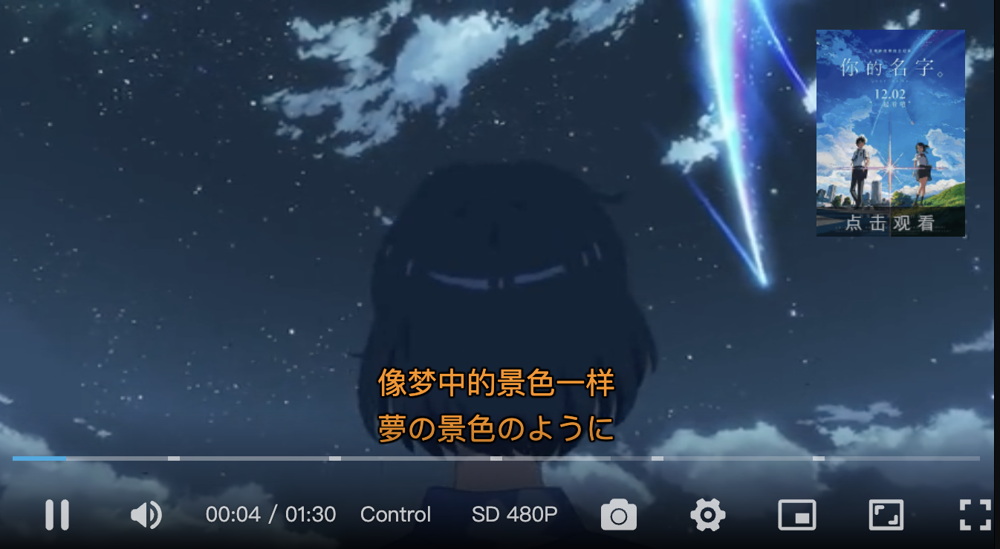
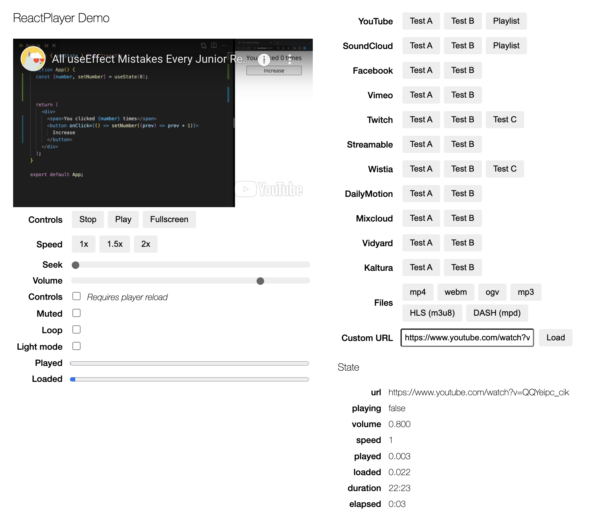

# 视频播放器

在现代的网络世界中，视频已成为信息传递和娱乐的主要形式之一。而要在网页上实现流畅、可靠的视频播放体验，则需要依赖于高效的HTML5视频播放器。本文就来分享 8 款功能强大且易于使用的HTML5视频播放器！

## Plyr

Plyr 是一款简单、轻量级、可访问且可自定义的 HTML5、YouTube 和 Vimeo 媒体播放器，支持现代浏览器。

Plyr 具有以下特点：

* 可访问性 - 完全支持VTT字幕和屏幕阅读器
* 干净的HTML - 使用正确的元素。音量使用 `<input type="range">`，进度条使用 `<progress>`，按钮使用 `<button>`。
* 响应式 - 适应任何屏幕尺寸
* 流媒体 - 支持hls.js、Shaka和dash.js的流媒体播放
* API - 通过标准化的API切换播放、音量、快进等等
* 全屏 - 支持原生全屏，并备用“全窗口”模式
* 快捷键 - 支持键盘快捷键
* 画中画 - 支持画中画模式
* 速度控制 - 实时调整播放速度
* 多个字幕 - 支持多个字幕轨道
* i18n支持 - 支持国际化控件
* 预览缩略图 - 支持显示预览缩略图
* 无框架 - 使用"原生"ES6 JavaScript编写

**Github：**<https://github.com/bytedance/xgplayer>

## Video.js

Video.js 是一款专为 HTML5 而全新构建的 Web 视频播放器。它支持 HTML5 视频和媒体源扩展，以及其他播放技术，例如 YouTube 和 Vimeo，支持在桌面和移动设备上播放视频。

**Github：**<https://github.com/videojs/video.js>

## 西瓜视频播放器

西瓜视频播放器是一款由字节跳动开源的 Web 视频播放器。它基于组件化的原则设计了独立的、可拆分的UI组件。更重要的是，它不仅在UI层面上灵活，还在功能上进行了大胆的改进：它摆脱了对视频加载、缓冲和格式支持的依赖。尤其在处理mp4格式时，它可以进行分段加载，即使不支持流式传输的mp4格式也能实现无缝切换、加载控制和节省流量。它还集成了对FLV、HLS和dash格式的点播和直播支持。

**Github：**<https://github.com/bytedance/xgplayer>

## MediaElementPlayer

MediaElementPlayer 是一个 HTML5 `<audio>` 或 `<video>` 播放器，支持 MP4、WebM 和 MP3 以及 HLS、Dash、YouTube、Facebook、SoundCloud 和其他具有通用 HTML5 MediaElement API 的播放器，从而在所有浏览器中实现一致的 UI。

**Github：**<https://github.com/mediaelement/mediaelement>

## DPlayer

DPlayer 是一款可爱的 HTML5 弹幕视频播放器，可以轻松构建视频和弹幕。

DPlayer 支持：

* 媒体流格式：
  * HLS
  * FLV
  * MPEG DASH
  * WebTorrent
  * 其他自定义的流媒体格式
* 媒体格式：
  * MP4 H.264
  * WebM
  * Ogg Theora Vorbis
* 功能：
  * 弹幕
  * 截图
  * 快捷键
  * 清晰度切换
  * 缩略图
  * 字幕

## Mui Player

MuiPlayer 是一款 HTML5 视频播放插件，其默认配置了精美可操作的的播放控件，涉及了常用的播放场景，例如全屏播放、播放快进、循环播放、音量调节、视频解码等功能。播放器的设计兼容了在 PC、Mobile 端运行，提供了 “移动端” 以及 “PC端” 两类扩展插件，因此你也可应用于在 Android、Ios 的 Webview 中使用。

MuiPlayer 具有以下特点：

* **多格式支持**：支持 mp4、m3u8、flv 等多种媒体格式播放，解决大部分兼容问题，同时适应在PC、手机端播放。
* **丰富的可配置API**：MuiPlayer 具有丰富的参数可以自定义播放器实例，通过轻松的配置即可完成自定义场景的视频播放。
* **简约的设计风格**：播放器设计风格轻松而简约，可自定义配置播放器的主题样式。在PC、手机端独立还拥有一套美观的功能控件设计。

**Github：**<https://github.com/muiplayer/hello-muiplayer>

## ArtPlayer.js

ArtPlayer.js 是一款易于使用且功能丰富的HTML5视频播放器，并且播放器的大部分功能控件都支持自定义，这使得它可以轻松地与业务逻辑连接。此外，它还直接支持`.vtt`、`.ass`和`.srt`字幕格式。与其他依赖项（如`flv.js`、`hls.js`、`dash.js`等）集成也非常简单。代码高度解耦，结构和逻辑清晰，易于跟踪错误和添加新功能。

**Github：**<https://github.com/zhw2590582/ArtPlayer/>

## ReactPlayer

ReactPlayer 是一个用于播放各种 URL 的 React 组件，包括文件路径、YouTube、Facebook、Twitch、SoundCloud、Streamable、Vimeo、Wistia、Mixcloud、DailyMotion 和 Kaltura。

**Github：**<https://github.com/cookpete/react-player>

> 更新: 2023-09-22 00:08:07  
> 原文: <https://www.yuque.com/cuggz/feplus/gtig8swwz39706gd>