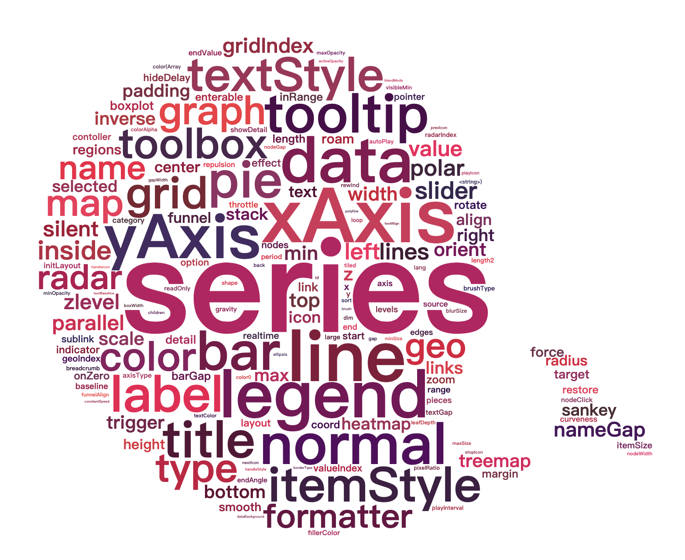
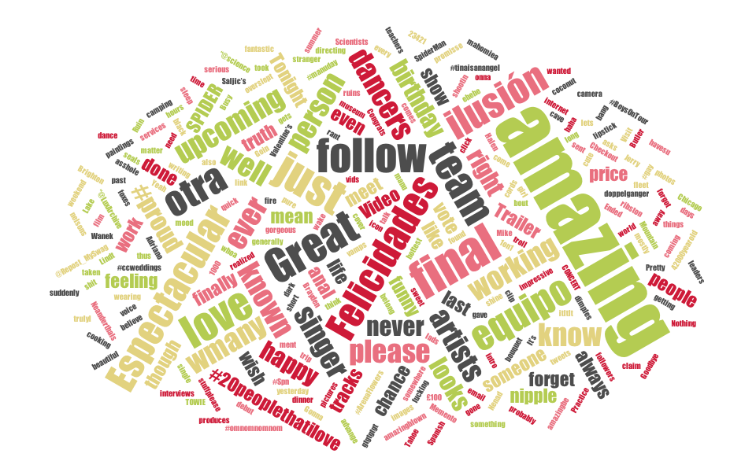
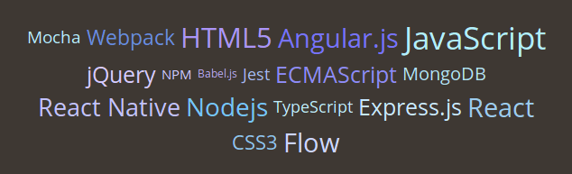
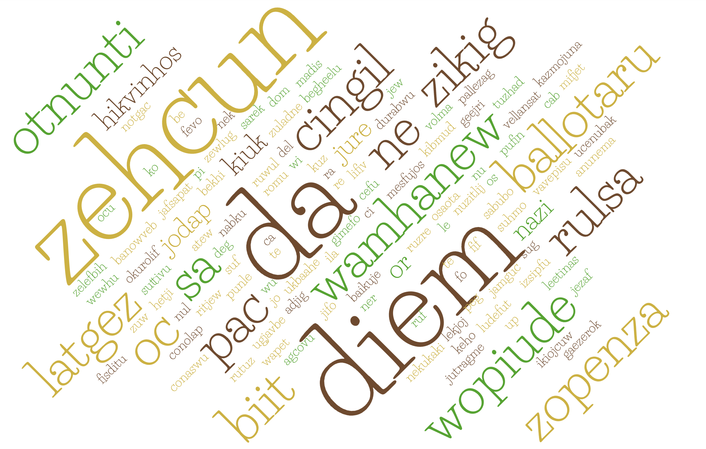
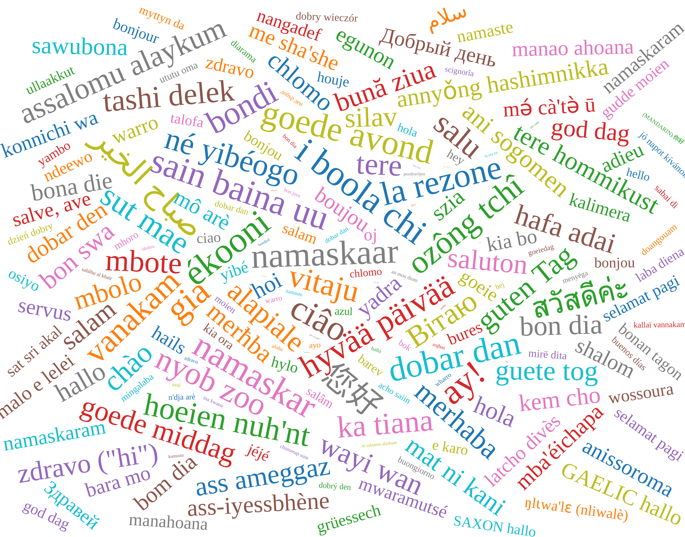

# 词云

## wordcloud2.js

wordcloud2.js 是一个基于 HTML5 Canvas 的词云库，主要用于生成词云效果。它的特点包括：

* 可以在浏览器和 Node.js 环境下运行。
* 支持文本颜色、字体大小、旋转等多种自定义选项。
* 可以生成 SVG 矢量图形，从而支持高分辨率或放大后不失真。
* 支持灵活的数据源类型：使用数组、JSON 数据、URL 或回调函数来提供词频数据。

使用方式如下：

1. 打开终端命令行工具，进入项目目录。执行以下命令来安装 wordcloud2.js：

```shell
npm install wordcloud
```

2. 代码中引入 wordcloud2.js 库文件，并创建一个 2D 画布或 HTML 容器元素，并用 id 或 class 属性给它取一个唯一标识符；

```javascript
import WordCloud from 'wordcloud';

<canvas id="myCanvas"></canvas>
```

3. 使用 **WordCloud** 对象进行词云的生成和渲染。其中，第一个参数是上一步中创建的容器元素，第二个参数是一个设置选项的对象，其中 `list` 属性是一个按照 `[ ['foo', 12], ['bar', 6]]` 格式排列的二维数组，表示每个单词及其权重。

```javascript
WordCloud(document.getElementById('myCanvas'), {
  list: [
    ['foo', 12],
    ['bar', 6],
    // ...
  ],
  // 其他自定义选项
});
```


**Github：**<https://github.com/timdream/wordcloud2.js>

## echarts-wordcloud

echarts-wordcloud 是基于 echarts.js 和 wordcloud2.js 的插件，用于在 echarts 可视化图表中创建词云。它的特点包括：

* 能够和 echarts.js 完美融合，使用起来非常方便。
* 支持自定义词云的颜色、形状、布局和样式等多种设置。
* 提供了灵活的数据源类型：支持 JSON 数据和顺序数组等格式，也可以使用回调函数来动态生成数据。
* 支持事件处理和动画效果，可以让词云更加生动有趣。

使用方式如下：

1. 在项目中安装 echarts 和 echarts-wordcloud 两个包：

```javascript
npm i echarts echarts-wordcloud --save
```

2. 在项目中引入 echarts 和 echarts-wordcloud：

```javascript
import * as echarts from 'echarts';
import 'echarts-wordcloud';
```

3. 使用 echarts-wordcloud 生成和渲染词云：

```javascript
const chartDom = document.getElementById('chart');
const myChart = echarts.init(chartDom);

const option = {
  series: [{
    type: 'wordCloud',
    shape: 'circle',
    gridSize: 10,
    // ...
  }]
};

myChart.setOption(option);
```



**Github：**<https://github.com/ecomfe/echarts-wordcloud>

## d3-cloud

d3-cloud是一个基于D3.js和HTML5 Canvas绘制输出的开源词云实现。它的特点包括：

* 采用无序布局，可以通过在一个范围内放置文本片段来生成词云。
* 可以使用不同的旋转角度和字体大小将单个文本片段放置在页面上。
* 可以使用不同的颜色和透明度更改词云文本的外观。
* 可以调整词云算法以根据不同的权重对词语进行排序，使更重要的词语显示更大，不重要的词语显示更小。
* 可以使用钩子函数自定义一些操作，例如：
  * 排除某些词语不被放置
  * 限制词语的最大和最小大小
  * 定义自己的字体样式和算法

使用方式如下：

1. 在终端中键入以下命令来安装d3-cloud：

```typescript
npm install d3-cloud
```

2. 安装完成后，在项目中导入d3-cloud：

```typescript
import * as d3 from 'd3';
import * as cloud from 'd3-cloud';
```

3. 创建一个容器老包含词云

```typescript
<div id="wordcloud"></div>
```

4. 在JavaScript文件中，使用以下方式处理数据并生成词云：

```typescript
const data = [
  {text: "apple", size: 32},
  {text: "orange", size: 24},
  {text: "banana", size: 16},
  {text: "watermelon", size: 8},
  {text: "grape", size: 4},
];

const layout = d3.layout.cloud()
  .size([800, 600])
  .words(data)
  .padding(5)
  .rotate(function() { return ~~(Math.random() * 2) * 90; })
  .font("Impact")
  .fontSize(function(d) { return d.size; })
  .on("end", draw);

layout.start();

function draw(words) {
  d3.select("#wordcloud")
    .append("svg")
      .attr("width", layout.size()[0])
      .attr("height", layout.size()[1])
    .append("g")
      .attr("transform", "translate(" + layout.size()[0] / 2 + "," + layout.size()[1] / 2 + ")")
    .selectAll("text")
      .data(words)
    .enter().append("text")
      .style("font-size", function(d) { return d.size + "px"; })
      .style("font-family", "Impact")
      .style("fill", function(d, i) { return d3.schemeCategory10[i % 10]; })
      .attr("text-anchor", "middle")
      .attr("transform", function(d) {
        return "translate(" + [d.x, d.y] + ")rotate(" + d.rotate + ")";
      })
      .text(function(d) { return d.text; });
};
```



**Github：**<https://github.com/jasondavies/d3-cloud>

## react-tagcloud

react-tagcloud 是一个基于 React 框架的标签云组件，用于在应用中呈现具有不同字体大小和颜色的标签。它的特点包括：

* 易用性：提供了简单易用的API，可以方便地在React项目中使用。
* 可定制性：提供了多种自定义选项，可以自定义标签云的颜色、大小、字体、旋转角度等。
* 响应式设计：支持响应式设计，可以自适应不同的屏幕大小。
* 支持多种数据源：支持从数组、对象、URL等多种数据源中获取标签数据。

使用方式如下：

1. 在终端或命令行工具中输入以下命令来安装 react-tagcloud：

```typescript
npm install react-tagcloud
```

2. 在 JavaScript 文件中，导入 react-tagcloud 并使用：

```typescript
import ReactTagCloud from 'react-tagcloud';

const data = [
  { value: 'React', count: 25 },
  { value: 'JavaScript', count: 18 },
  { value: 'Nodejs', count: 30 },
  ...
];

const options = {
  //其他 options 设置
};

//渲染标签云
<ReactTagCloud tags={data} minSize={12} maxSize={35} colorOptions={options} />
```



**Github：**<https://github.com/madox2/react-tagcloud>

## VueWordCloud

VueWordCloud 是一个基于 Vue.js 的词云组件库。它的特点包括：

* 支持关键词权重：支持自定义关键词的权重，从而可以根据关键词的重要性来调整词云的显示效果。
* 自定义样式：提供了多个选项，可以自定义词云的样式和颜色。
* 支持缩放：持对词云进行缩放和平移，从而可以查看更详细的数据。
* 支持筛选：支持按照关键词进行筛选，从而可以快速查找感兴趣的内容。

使用方式如下：

1. 在终端中运行以下命令来安装 VueWordCloud：

```typescript
npm install vuewordcloud
```

2. 在项目中引入 VueWordCloud 组件：

```typescript
import Vue from 'vue';
import VueWordCloud from 'vuewordcloud';

Vue.component('VueWordCloud', VueWordCloud);


<vue-word-cloud
  style="
    height: 480px;
    width: 640px;
  "
  :words="[['romance', 19], ['horror', 3], ['fantasy', 7], ['adventure', 3]]"
  :color="([, weight]) => weight > 10 ? 'DeepPink' : weight > 5 ? 'RoyalBlue' : 'Indigo'"
  font-family="Roboto"
/>
```

在上面的代码中，'options' 是传递给 VueWordCloud 组件的词云选项，可以根据需要自定义这些选项。



**Github：**<https://github.com/SeregPie/VueWordCloud>

## react-d3-cloud

react-d3-cloud 是一个使用 d3-cloud 构建的词云 React 组件。

使用方式如下：

1. 在终端中运行以下命令来安装 react-d3-cloud：

```typescript
npm install react-d3-cloud
```

2. 在 React 组件中使用 ：

```typescript
import React from 'react';
import { render } from 'react-dom';
import WordCloud from 'react-d3-cloud';
import { scaleOrdinal } from 'd3-scale';
import { schemeCategory10 } from 'd3-scale-chromatic';

const data = [
  { text: 'Hey', value: 1000 },
  { text: 'lol', value: 200 },
  { text: 'first impression', value: 800 },
  { text: 'very cool', value: 1000000 },
  { text: 'duck', value: 10 },
];

const schemeCategory10ScaleOrdinal = scaleOrdinal(schemeCategory10);

render(
  <WordCloud
    data={data}
    width={500}
    height={500}
    font="Times"
    fontStyle="italic"
    fontWeight="bold"
    fontSize={(word) => Math.log2(word.value) * 5}
    spiral="rectangular"
    rotate={(word) => word.value % 360}
    padding={5}
    random={Math.random}
    fill={(d, i) => schemeCategory10ScaleOrdinal(i)}
    onWordClick={(event, d) => {
      console.log(`onWordClick: ${d.text}`);
    }}
    onWordMouseOver={(event, d) => {
      console.log(`onWordMouseOver: ${d.text}`);
    }}
    onWordMouseOut={(event, d) => {
      console.log(`onWordMouseOut: ${d.text}`);
    }}
  />,
  document.getElementById('root')
);
```



**Github：**<https://github.com/Yoctol/react-d3-cloud>


> 更新: 2023-04-20 21:09:48  
> 原文: <https://www.yuque.com/cuggz/feplus/aoi1uy4aq3izqiob>