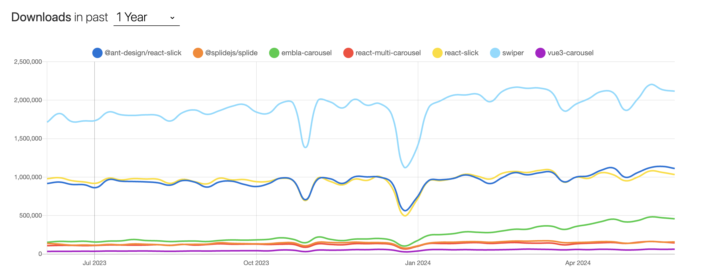
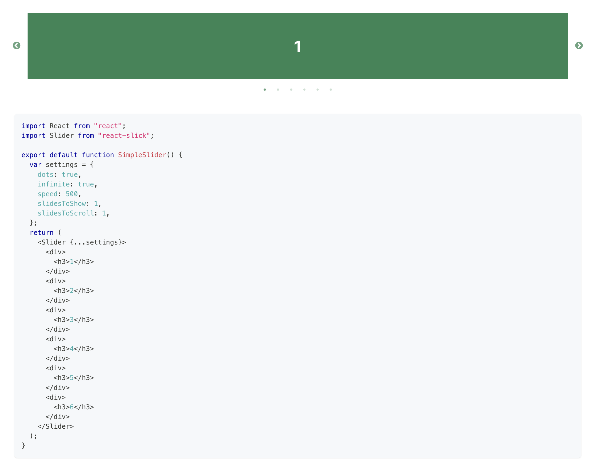
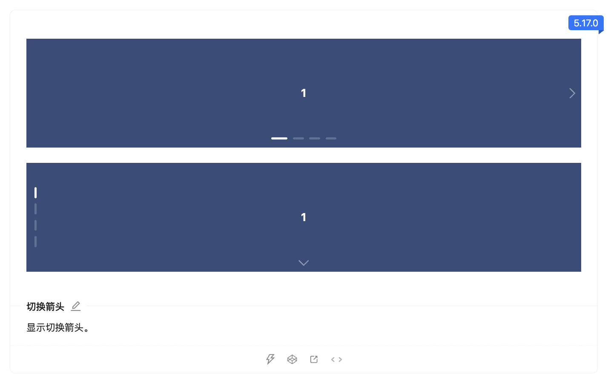
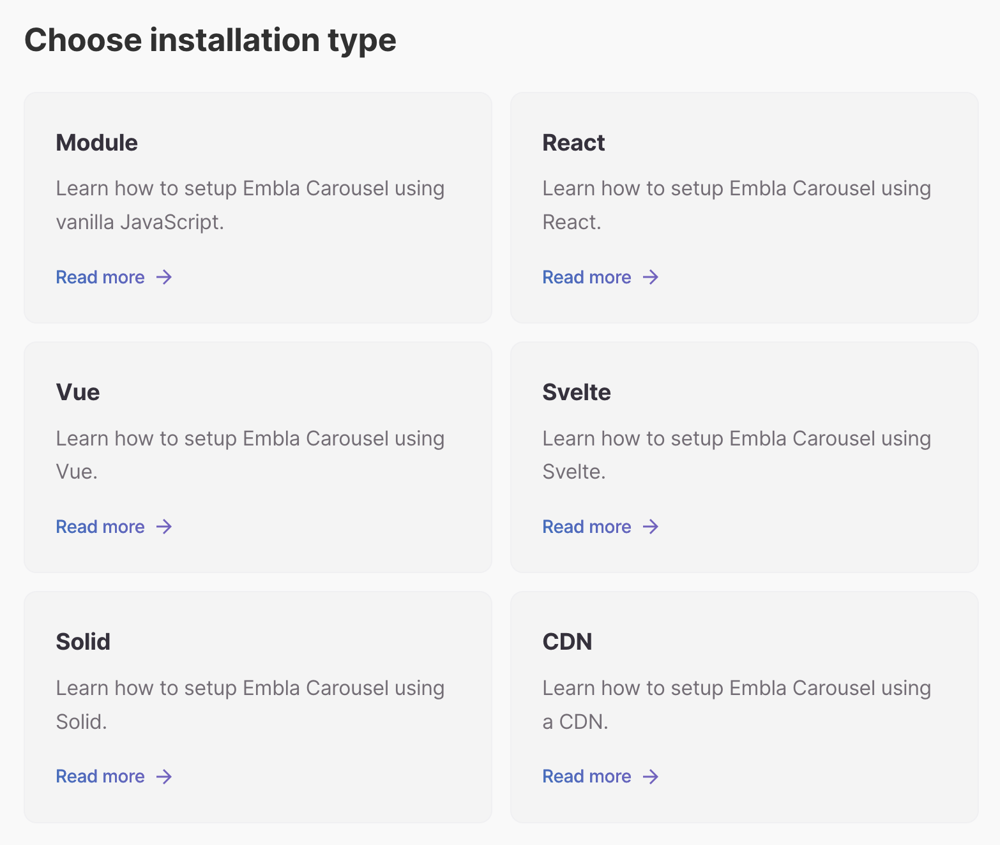
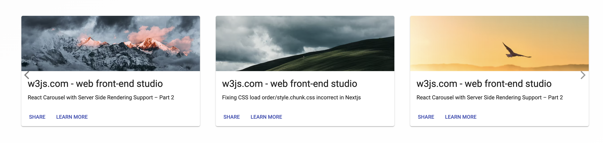
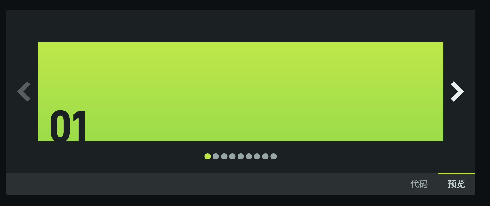

# 轮播图

## Swiper.js
Swiper.js 是最流行的、功能强大移动触摸滑动库，它以硬件加速、原生滑动体验、轻量快速、模块化结构和丰富的API等特点著称，支持多种动画效果、导航控制、自定义布局以及图像懒加载等功能。Swiper 广泛应用于网站、Web应用和移动应用中，适用于多个前端框架。  

**Github：**[https://github.com/nolimits4web/Swiper](https://github.com/nolimits4web/Swiper)

## react-slick
react-slick 是一个 React 组件库，它提供了一个可定制的、响应式的滑块组件，用于创建滑动图片或内容的轮播效果。

**Github：**[https://github.com/akiran/react-slick](https://github.com/akiran/react-slick)

## @ant-design/react-slick
Ant Design 的走马灯组件，基于 react-slick 源码实现。

**Github：**[https://github.com/ant-design/react-slick](https://github.com/ant-design/react-slick)

## embla-carousel
Embla Carousel 是一个轻量级、无依赖且高度可扩展的轮播库，专注于解决构建轮播时的技术难题。用户可通过其灵活的API和插件来定制轮播组件，以满足各种需求。该库兼容所有现代浏览器，为用户提供流畅、精准的轮播体验。

**Github：**[https://www.embla-carousel.com/get-started/](https://www.embla-carousel.com/get-started/)

## react-multi-carousel 
react-multi-carousel 是一个功能强大、轻量级且易于定制的 React 轮播图组件，它支持高度可定制性，允许用户根据自己的需求进行样式和行为的调整。该组件兼容所有现代浏览器，支持多项目使用和服务器端渲染，同时提供详细的文档和示例代码以帮助开发者快速上手。

**Github：**[https://github.com/YIZHUANG/react-multi-carousel](https://github.com/YIZHUANG/react-multi-carousel)

## Splide
Splide 是一款轻量、灵活且支持的滑块/轮播器，使用 TypeScript 编写。无依赖项，无 Lighthouse 错误。

**Github：**[https://github.com/Splidejs/splide](https://github.com/Splidejs/splide)

## vue3-carousel
vue3-carousel 是一个灵活、响应迅速且高度可定制的 Vue 轮播组件，几乎适合所有用例。

**Github：**[https://github.com/ismail9k/vue3-carousel](https://github.com/ismail9k/vue3-carousel)

> 更新: 2024-11-30 15:15:36  
> 原文: <https://www.yuque.com/cuggz/feplus/kxt5tg10wws4s5ym>