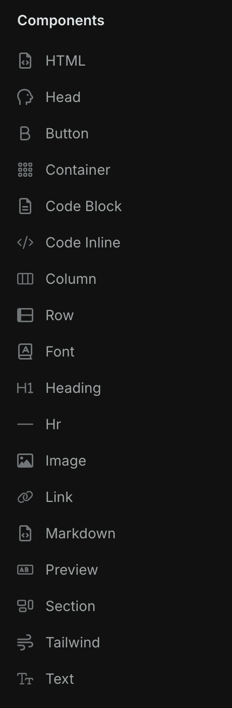
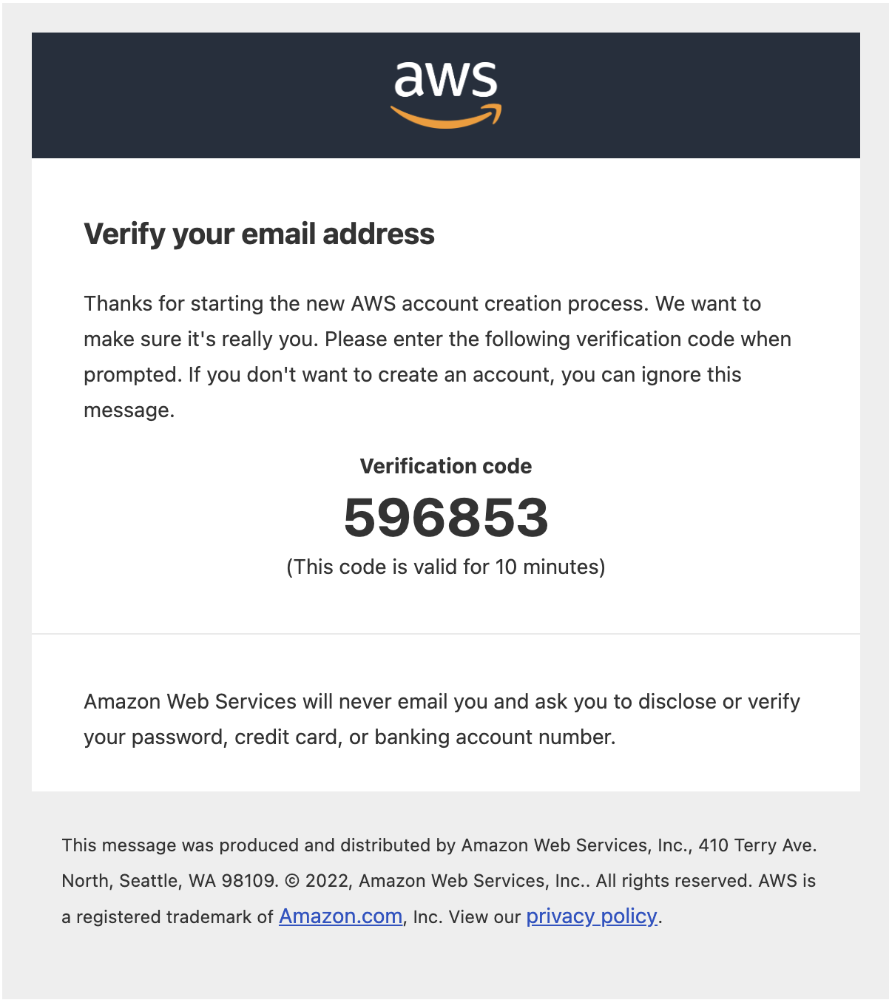
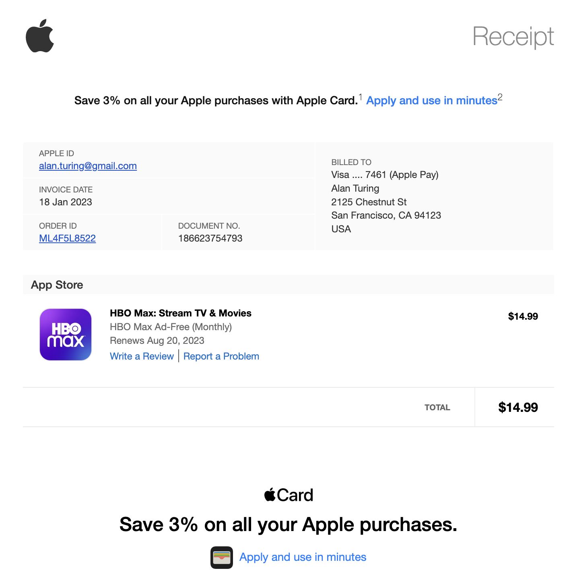
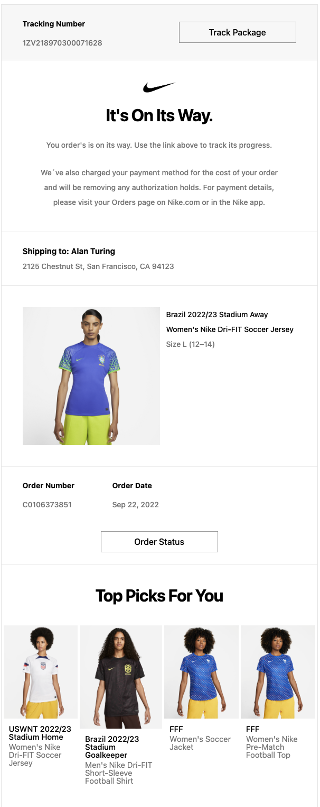
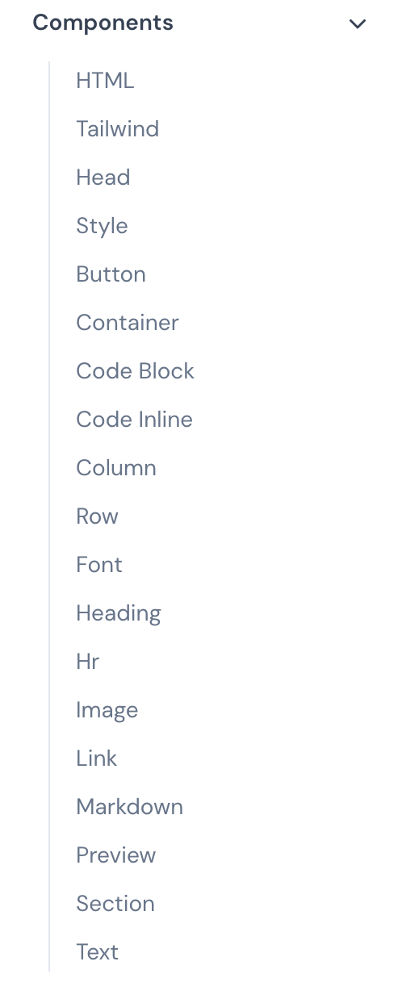

# 邮件

前端不仅能写网页、APP、小程序，竟然还能写邮件模板？本文来分享两个非常实用的邮件工具库，助力高效开发邮件模板！

## React Email
React Email 是一个基于 React 的高效**电子邮件构建框架**或**组件库**，它充分利用了React的组件化理念和现代Web开发工具的力量，为开发者提供了一种全新的电子邮件编写与呈现方式。让开发者使用 React 和 TypeScript 构建和发送电子邮件。

React Email 提供了很多组件，用于编写邮件模板：

下面是一些使用 React Email 的实际案例（这些案例在官网都有源码可供参考）：

**Github：**[https://github.com/resend/react-email](https://github.com/resend/react-email)

## Vue Email
Vue Email 用于使用 Vue 构建并发送电子邮件，其灵感来自 React Email 库，其目标是提供使用 Vue 构建和发送电子邮件相关的所有内容，包括组件、渲染实用程序。

Vue Email 提供的组件如下：

**Github：**[https://github.com/vue-email/vue-email](https://github.com/vue-email/vue-email)

> 更新: 2024-11-30 15:14:31  
> 原文: <https://www.yuque.com/cuggz/feplus/rxvoa7gcddr0rwr4>