# 项目部署

你是否曾经为配置服务器和繁琐的域名备案流程而头疼不已？是否渴望找到一种简单、高效的途径，让你的前端项目即刻上线，与世界分享你的创意与成果？本文将为你揭秘 3 种无需服务器和域名的前端项目快速部署方式 —— **Vercel**、**Github Pages** 和 **Netlify**，让你的项目在 5 分钟内迅速上线，与世界共享你的精彩！

## Vercel

Vercel 是一个云服务平台，专为前端开发和部署Web应用程序而设计，提供快速的部署服务、全球CDN加速、自动HTTPS和域名管理等功能，支持静态生成、服务器渲染和无服务器函数。

使用 Vercel 部署前端网站的基本步骤如下：

1. 首先，在 Vecel 官网（<https://vercel.com/>）注册账号并登录：

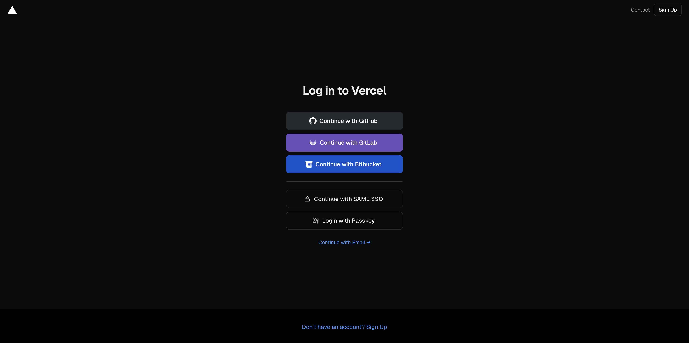

2. 登录成功后，可以选择“Import Project”来导入已有项目，或者选择“New Project”来创建一个新项目。

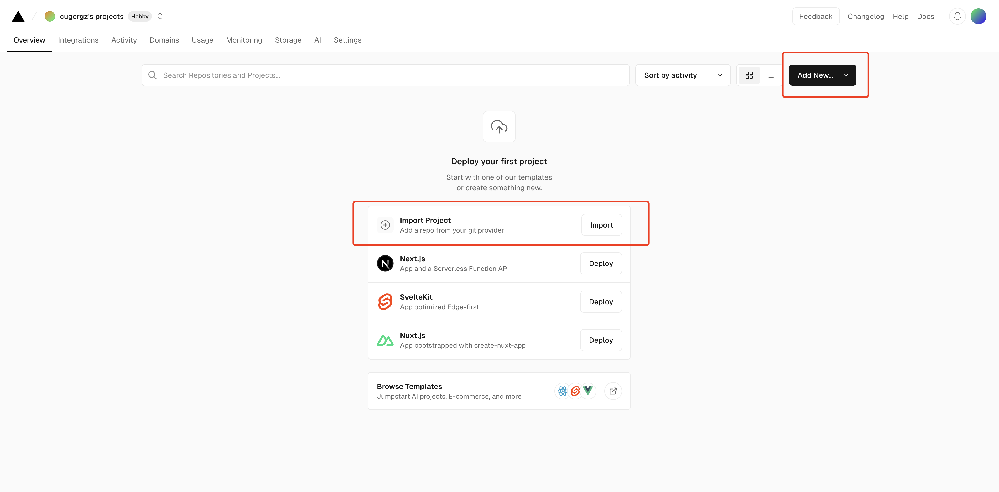

3. 如果选择导入现有项目，Vercel 会提示连接到代码仓库（如GitHub、GitLab或Bitbucket）。只需按照提示操作，授权 Vercel访问仓库，并导入仓库即可。

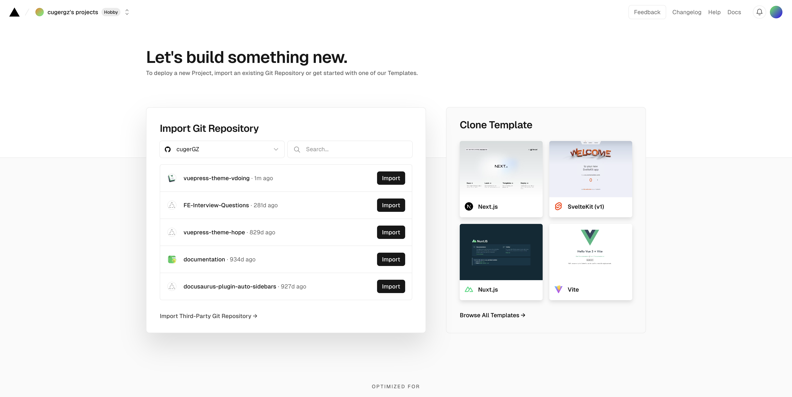

4. 这里以一个博客网站为例，导入仓库后，需要配置构建命令和指定输出目录：
   * **配置构建命令**：对于大多数前端项目，通常使用 `npm install` 来安装依赖，然后使用 `npm run build` 来执行构建过程。
   * **指定输出目录**：通常输出目录为 dist，可以根据自己项目进行配置。

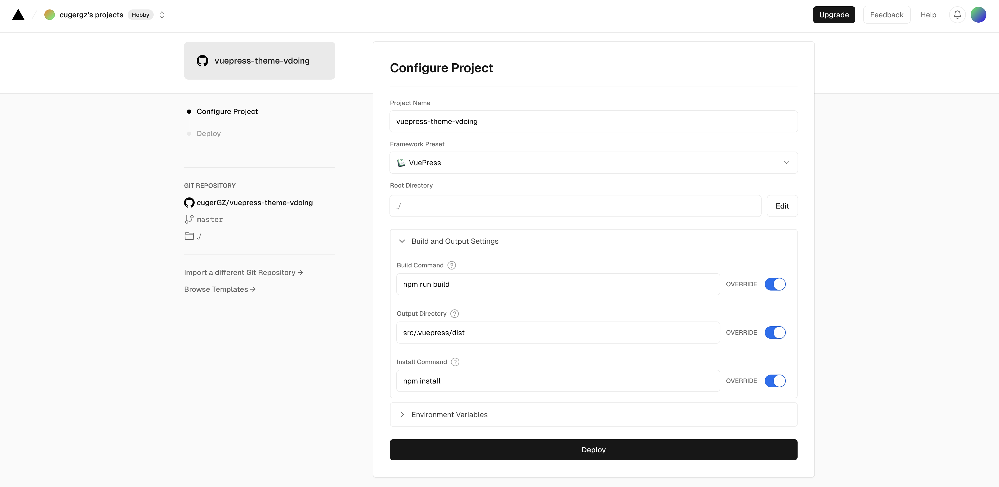

5. 完成以上设置后，Vercel 会为创建一个新项目，并开始部署过程。部署过程中，Vercel会自动安装依赖、执行构建命令，并将构建结果上传到其服务器。

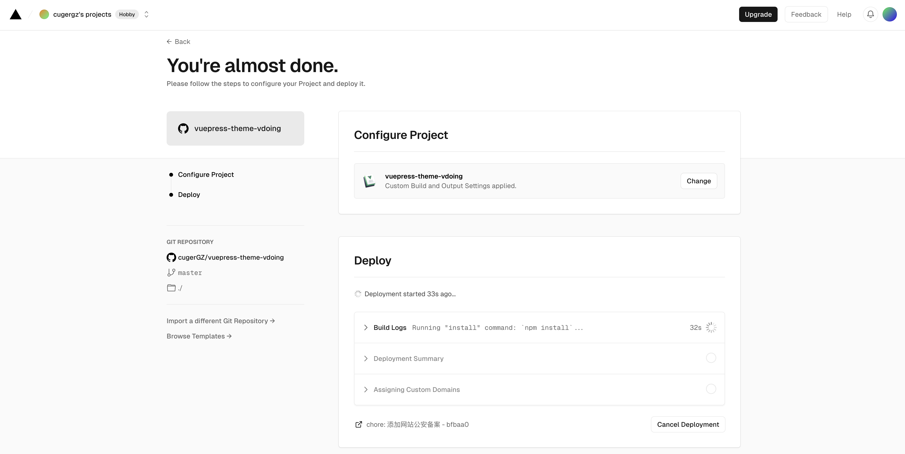

6. 部署完成后，会收到一封确认邮件，并且可以在Vercel的控制面板中查看项目的状态。可以通过 Vercel 提供的 URL 访问部署好的网站。

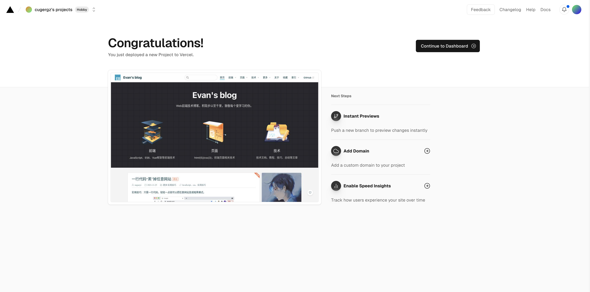

7. 在 Vercel 的控制面板中，可以管理项目，包括查看日志、配置环境变量、设置 HTTPS 等，还可以将自定义域名绑定到 Vercel 项目。

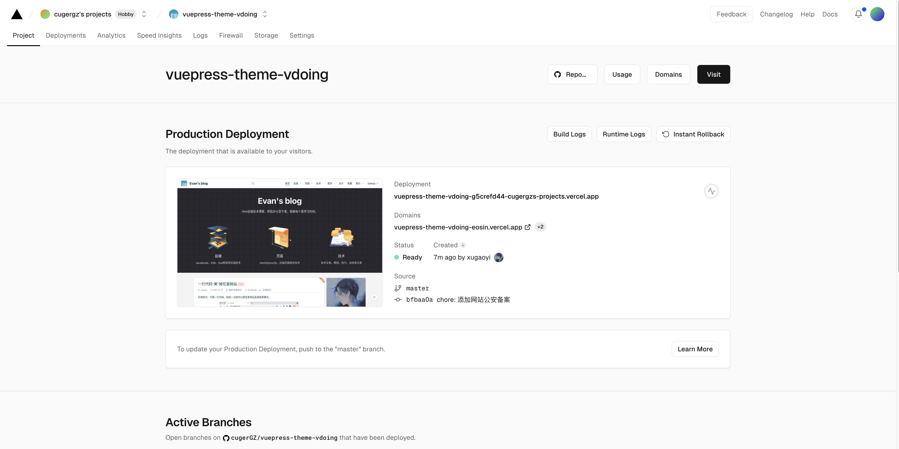

## Github Page

Github Pages是一个直接从GitHub上的仓库托管静态站点的服务，适用于个人、组织和项目站点，支持多种静态站点生成器，但配置过程相对复杂，且限制在每月100GB的软带宽和1GB的存储限制内。

使用 Github Page 部署前端网站的基本步骤如下：

1. 登录Github账号，在顶部菜单栏点击“+”，选择“New repository”新建仓库，输入项目的信息，点击 “Create repository” 创建仓库，新建完成之后，将需要部署的项目代码上传至该仓库：

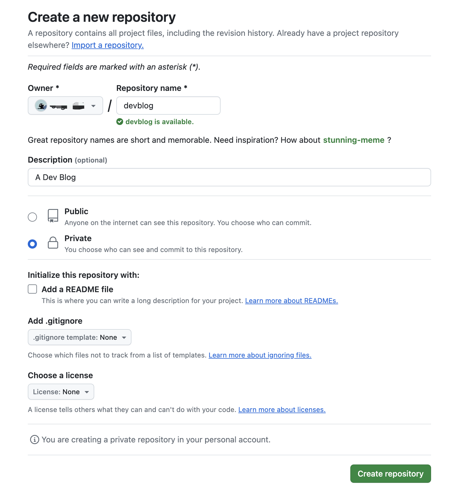

2. 在仓库的 Setting 页面，找到“Pages”部分，这里就是 Github Pages 的配置页面。Github pages 目前支持两种部署方式：
   * **部署分支**：适用于部署静态网站，当指定分支有新的提交推送时，GitHub 会自动触发构建和部署过程。
   * **Github Actions**：适用于部署复杂的前端项目，这是 GitHub 提供的一种持续集成（CI）和持续部署（CD）工具。通过编写 YAML 工作流文件，可以定义复杂的构建、测试和部署流程。

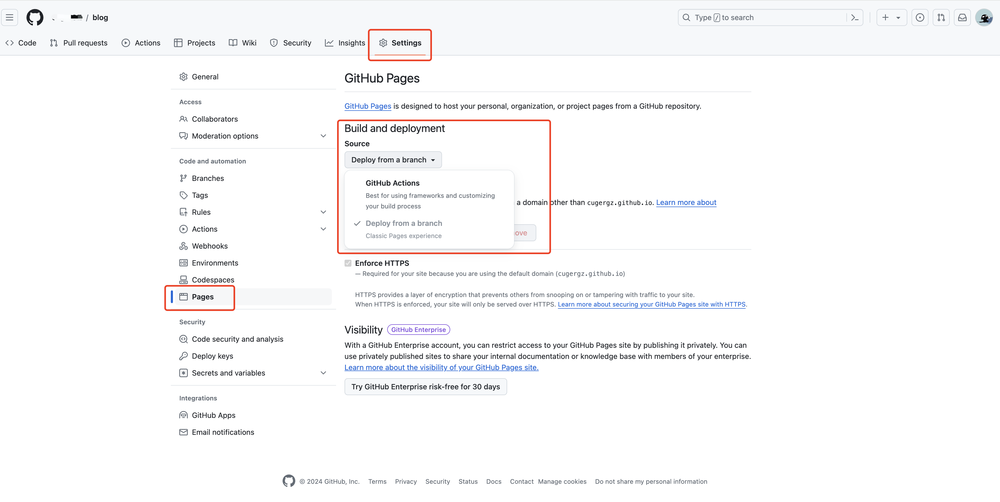

3. 这里我部署的是一个 VuePress 项目，所以选择 Github Actions。
   1. 首先，部署需要用的项目 Token，以便能获得项目的操作权限，可以通过 <https://github.com/settings/tokens> 生成：

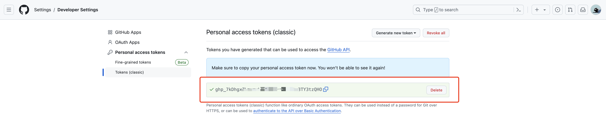

```
2. 在项目的 `Setting - Secrets and variables - Actions` 中添加上一步生成的秘钥，名称是 ACCESS_TOKEN。
```

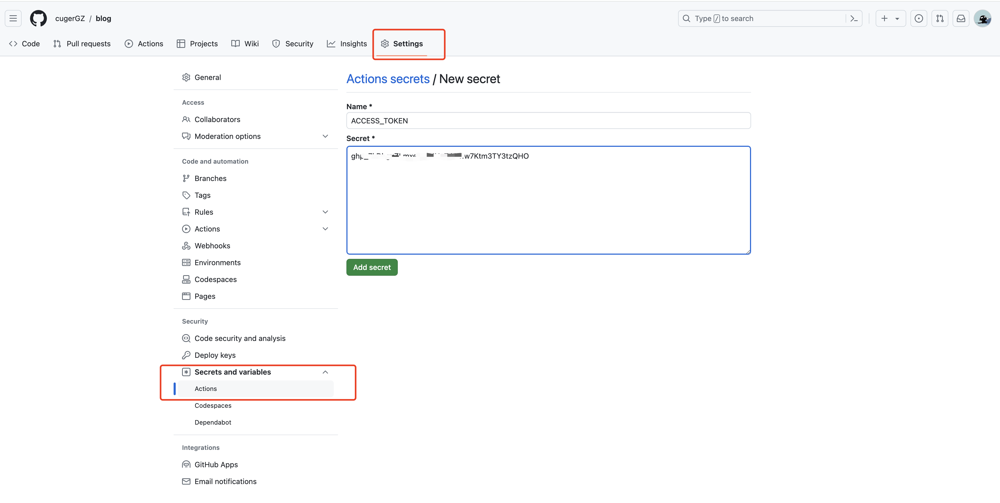

```
3. 进入项目的的 `Actions` 选项，然后新建一个 `workflow`，默认名称是 `main.yml`，在该文件中添加如下代码（参考）：
```

```javascript
# name 可以自定义
name: Deploy GitHub Pages

# 触发条件：在 push 到 master 分支后
on:
  push:
    branches:
      - main

# 任务
jobs:
  build-and-deploy:
    # 服务器环境：最新版 Ubuntu
    runs-on: ubuntu-latest
    steps:
      # 拉取代码
      - name: Checkout
        uses: actions/checkout@v2
        with:
          persist-credentials: false

      # 生成静态文件
      - name: Build
        run: npm install && npm run docs:build

      # 部署到 GitHub Pages
      - name: Deploy
        uses: JamesIves/github-pages-deploy-action@releases/v3
        with:
          ACCESS_TOKEN: ${{ secrets.ACCESS_TOKEN }} # 刚才生成的 secret
          BRANCH: gh-pages # 部署到 gh-pages 分支，因为 main 分支存放的一般是源码，而 gh-pages 分支则用来存放生成的静态文件
          FOLDER: docs/.vuepress/dist # vuepress 生成的静态文件存放的地方
```

4. 保存之后，就会自动执行。稍等就可以查看部署结果。如果是绿色，说明自动部署成功，如果是红色，说明部署失败。每次推送代码时，Actions 就会自动打包并部署到 gh-pages 分支，我们可以直接用\*\* 用户名.github.io/项目名 \*\*的方式访问。

## Netlify

Netlify是一个现代化的静态站点部署平台，提供自动构建、部署、CDN加速和表单处理等功能，适合部署静态网站、单页面应用和Jamstack应用，拥有简单易用的界面和强大的功能。

使用 Netlify 部署前端网站的基本步骤如下：

1. 访问 Netlify 官网（<https://www.netlify.com/>） ，注册账号并登录。首次登陆需要填写一些简单信息：

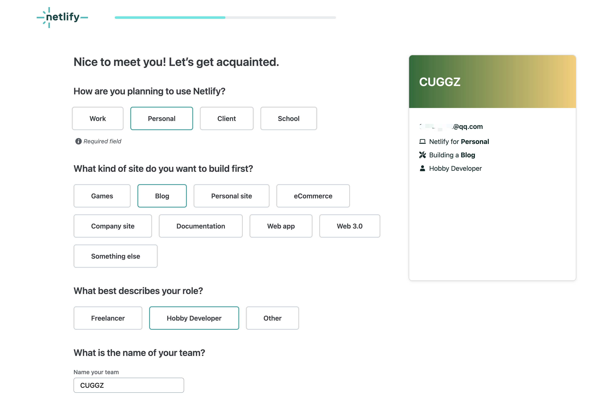

2. 填写完成之后，就可以通过 GIthub、Gitlab 等方式选择项目进行部署：

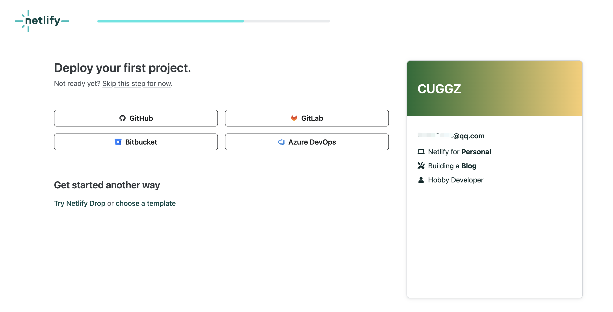

3. 这里我们来部署 Github 上的项目，需要进行 Github 授权，授权后就可以访问到 Github 的所有仓库。

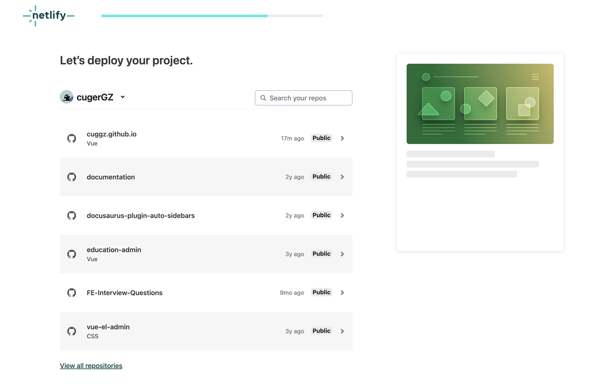

4. 选择需要部署的项目，然后进行一些部署配置，这里类似于 Vercel 的部署配置：

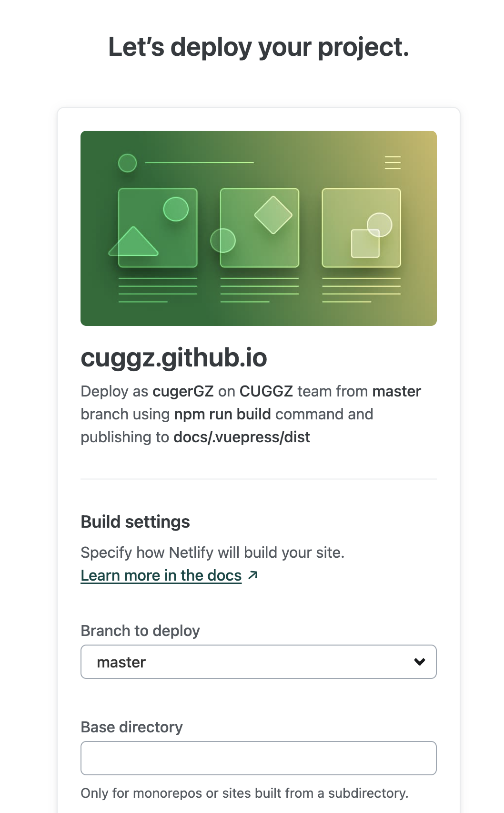

5. 填写完成之后就可以进行部署了，页面会显示实时部署日志：

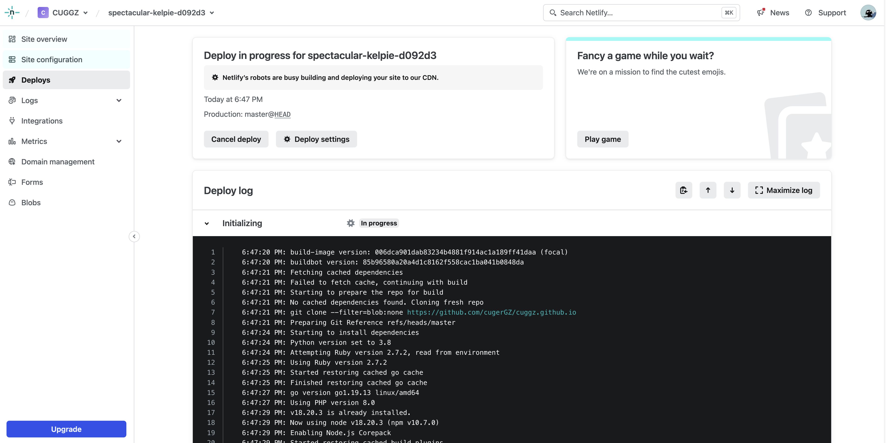

6. 部署完成之后，就可以在访问网站了，也可以在控制面板中进行日志管理，域名管理等：

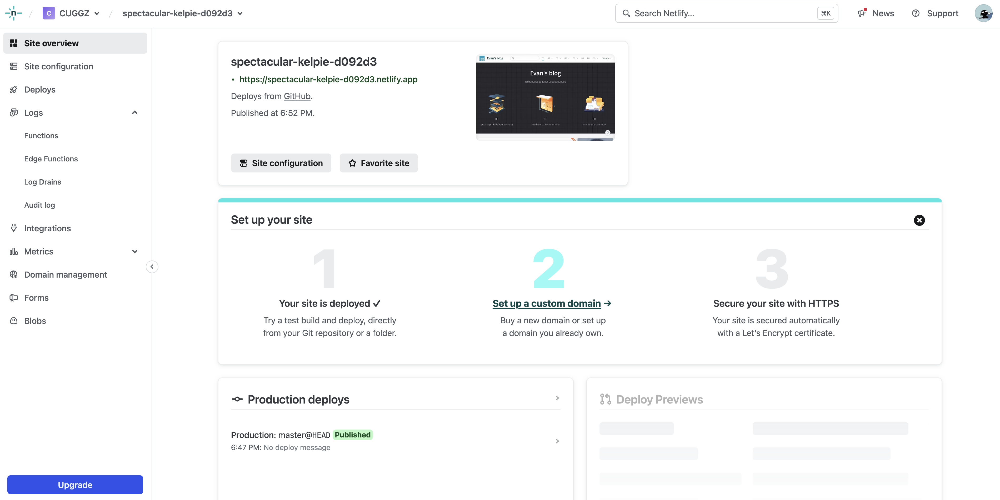

## 小结

在探索前端项目部署的过程中，我们不难发现 Vercel和 Netlify 提供了非常简单的部署流程，使项目上线变得轻而易举。尽管 Github Pages 的部署过程稍显复杂，但其强大的功能性和灵活性也为开发者提供了更多可能性。因此，在选择部署方式时，可以根据项目需求和个人偏好，选择最适合你的那一款！


> 更新: 2024-07-01 19:20:35  
> 原文: <https://www.yuque.com/cuggz/feplus/xfczgiote1rru1nu>