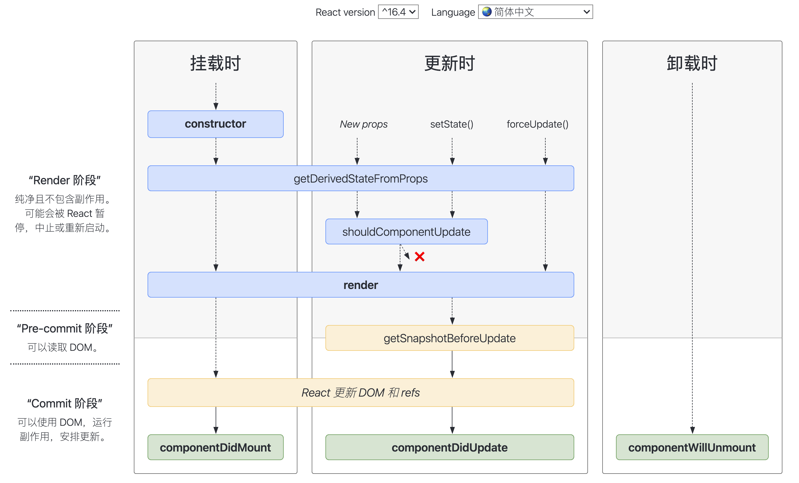
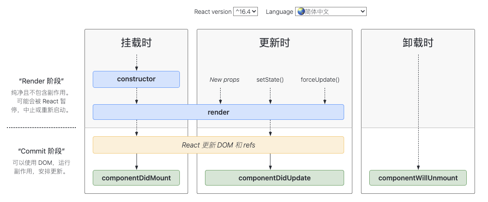

# React生命周期

### 1. React生命周期概览

React 会把状态的变更更新到 UI，状态的变更过程必然会经历组件的生命周期。所谓的生命周期就是组件从创建到销毁的过程，它是一个很抽象的概念， React 通常将组件生命周期分为三个阶段：

* 装载阶段（Mount），组件第一次在DOM树中被渲染的过程；
* 更新过程（Update），组件状态发生变化，重新更新渲染的过程；
* 卸载过程（Unmount），组件从DOM树中被移除的过程；

有生命周期，那自然就会有生命周期钩子函数，它告诉我们当前处于哪些阶段，会对组件内部实现的某些函数进行回调，<font style="color:#595959;">我们可以在这些回调函数中编写自己的逻辑代码，来完成自己的需求功能</font>：

* <font style="color:#595959;background-color:transparent;">比如实现componentDidMount函数：组件已经挂载到DOM上时，就会回调；</font>
* <font style="color:#595959;">比如实现componentDidUpdate函数：组件已经发生了更新时，就会回调；</font>
* <font style="color:#595959;">比如实现componentWillUnmount函数：组件即将被移除时，就会回调；</font>

<font style="color:#595959;"></font>

**<font style="color:#595959;">注意：</font>**<font style="color:#595959;">我们所说的生命周期针对的是类组件，函数组件是没有生命周期的。</font>

下面是React生命周期的图示（16.4版本+）：



### 2. 组件挂载阶段

挂载阶段组件被创建，然后组件实例插入到 DOM 中，完成组件的第一次渲染，该过程只会发生一次，在此阶段会依次调用以下这些方法：

* constructor
* getDerivedStateFromProps
* render
* componentDidMount

#### （1）constructor

组件的构造函数，第一个被执行，若没有显式定义它，会有一个默认的构造函数，但是若显式定义了构造函数，我们必须在构造函数中执行 `super(props)`，否则无法在构造函数中拿到this。

<font style="color:#595959;"></font>

<font style="color:#595959;">如果不初始化 state 或不进行方法绑定，则不需要为 React 组件实现构造函数</font>**Constructor**<font style="color:#595959;">。</font>

<font style="color:#595959;"></font>

<font style="color:#595959;">constructor中通常只做两件事： </font>

* 初始化组件的 state
* 给事件处理方法绑定 this

```javascript
constructor(props) {
  super(props);
  // 不要在构造函数中调用 setState，可以直接给 state 设置初始值
  this.state = { counter: 0 }
  this.handleClick = this.handleClick.bind(this)
}
```

#### （2）getDerivedStateFromProps

```javascript
static getDerivedStateFromProps(props, state)
```

这是个静态方法，所以不能在这个函数里使用 `this`，有两个参数 `props` 和 `state`，分别指接收到的新参数和当前组件的 `state` 对象，这个函数会返回一个对象用来更新当前的 `state` 对象，如果不需要更新可以返回 `null`。

该函数会在装载时，接收到新的 `props` 或者调用了 `setState` 和 `forceUpdate` 时被调用。如当我们接收到新的属性想修改我们的 `state` ，就可以使用。

```javascript
// 当 props.counter 变化时，赋值给 state 
class App extends React.Component {
  constructor(props) {
    super(props)
    this.state = {
      counter: 0
    }
  }
  static getDerivedStateFromProps(props, state) {
    if (props.counter !== state.counter) {
      return {
        counter: props.counter
      }
    }
    return null
  }
  
  handleClick = () => {
    this.setState({
      counter: this.state.counter + 1
    })
  }
  render() {
    return (
      <div>
        <h1 onClick={this.handleClick}>Hello, world!{this.state.counter}</h1>
      </div>
    )
  }
}
```

现在我们可以显式传入 `counter` ，但是这里有个问题，如果我们想要通过点击实现 `state.counter` 的增加，但这时会发现值不会发生任何变化，一直保持 `props` 传进来的值。这是由于在 React 16.4^ 的版本中 `setState` 和 `forceUpdate` 也会触发这个生命周期，所以当组件内部 `state` 变化后，就会重新走这个方法，同时会把 `state` 值赋值为 `props` 的值。因此我们需要多加一个字段来记录之前的 `props` 值，这样就会解决上述问题。具体如下：

```javascript
// 这里只列出需要变化的地方
class App extends React.Component {
  constructor(props) {
    super(props)
    this.state = {
      // 增加一个 preCounter 来记录之前的 props 传来的值
      preCounter: 0,
      counter: 0
    }
  }
  static getDerivedStateFromProps(props, state) {
    // 跟 state.preCounter 进行比较
    if (props.counter !== state.preCounter) {
      return {
        counter: props.counter,
        preCounter: props.counter
      }
    }
    return null
  }
  handleClick = () => {
    this.setState({
      counter: this.state.counter + 1
    })
  }
  render() {
    return (
      <div>
        <h1 onClick={this.handleClick}>Hello, world!{this.state.counter}</h1>
      </div>
    )
  }
}
```

#### （3）render

render是React 中最核心的方法，一个组件中必须要有这个方法，它会根据状态 `state` 和属性 `props` 渲染组件。这个函数只做一件事，就是返回需要渲染的内容，所以不要在这个函数内做其他业务逻辑，通常调用该方法会返回以下类型中一个：

* **React 元素**：这里包括原生的 DOM 以及 React 组件；
* **数组和 Fragment（片段）**：可以返回多个元素；
* **Portals（插槽）**：可以将子元素渲染到不同的 DOM 子树种；
* **字符串和数字**：被渲染成 DOM 中的 text 节点；
* **布尔值或 null**：不渲染任何内容。

#### （4）<font style="color:#595959;">componentDidMount() </font>

<font style="color:#595959;">componentDidMount()</font><font style="color:#595959;">会在组件挂载后（插入 DOM 树中）立即调。该阶段通常进行以下操作：</font>

* <font style="color:#595959;">执行依赖于DOM的操作；</font>
* <font style="color:#595959;">发送网络请求；（官方建议）</font>
* <font style="color:#595959;">添加订阅消息（会在componentWillUnmount取消订阅）；</font>

如果在 `componentDidMount` 中调用 `setState` ，就会触发一次额外的渲染，多调用了一次 `render` 函数，由于它是在浏览器刷新屏幕前执行的，所以用户对此是没有感知的，但是我应当避免这样使用，这样会带来一定的性能问题，尽量是在 `constructor` 中初始化 `state` 对象。

在组件装载之后，将计数数字变为1：

```javascript
class App extends React.Component  {
  constructor(props) {
    super(props)
    this.state = {
      counter: 0
    }
  }
  componentDidMount () {
    this.setState({
      counter: 1
    })
  }
  render ()  {
    return (
      <div className="counter">
        counter值: { this.state.counter }
      </div>
    )
  }
}
```

### 3. 组件更新阶段

当组件的 `props` 改变了，或组件内部调用了 `setState/forceUpdate`，会触发更新重新渲染，这个过程可能会发生多次。这个阶段会依次调用下面这些方法：

* getDerivedStateFromProps
* shouldComponentUpdate
* render
* getSnapshotBeforeUpdate
* componentDidUpdate

#### （1）shouldComponentUpdate

```javascript
shouldComponentUpdate(nextProps, nextState)
```

在说这个生命周期函数之前，我们看两个问题：

* **setState 函数在任何情况下都会导致组件重新渲染吗？例如下面这种情况：**

```javascript
this.setState({number: this.state.number})
```

* **如果没有调用 setState，props 值也没有变化，是不是组件就不会重新渲染？**

第一个问题答案是 **会** ，第二个问题如果是父组件重新渲染时，不管传入的 props 有没有变化，都会引起子组件的重新渲染。

那么有没有什么方法解决在这两个场景下不让组件重新渲染进而提升性能呢？这个时候 `shouldComponentUpdate` 登场了，这个生命周期函数是用来提升速度的，它是在重新渲染组件开始前触发的，默认返回 `true`，可以比较 `this.props` 和 `nextProps` ，`this.state` 和 `nextState` 值是否变化，来确认返回 true 或者 `false`。当返回 `false` 时，组件的更新过程停止，后续的 `render`、`componentDidUpdate` 也不会被调用。

***

\*\*注意：\*\*添加 `shouldComponentUpdate` 方法时，不建议使用深度相等检查（如使用 `JSON.stringify()`），因为深比较效率很低，可能会比重新渲染组件效率还低。而且该方法维护比较困难，建议使用该方法会产生明显的性能提升时使用。

#### （2）getSnapshotBeforeUpdate

```javascript
getSnapshotBeforeUpdate(prevProps, prevState)
```

这个方法在 `render` 之后，`componentDidUpdate` 之前调用，有两个参数 `prevProps` 和 `prevState`，表示更新之前的 `props` 和 `state`，这个函数必须要和 `componentDidUpdate` 一起使用，并且要有一个返回值，默认是 `null`，这个返回值作为第三个参数传给 `componentDidUpdate`。

这个生命周期的使用场景较少，下面看一个处理滚动条位置的例子：

```javascript
class ScrollingList extends React.Component {
  constructor(props) {
    super(props);
    this.listRef = React.createRef();
  }
  getSnapshotBeforeUpdate(prevProps, prevState) {
    // 增加了新的一条聊天消息
    // 获取滚动条位置，以便我们之后调整
    if (prevProps.list.length < this.props.list.length) {
      const list = this.listRef.current;
      return list.scrollHeight - list.scrollTop;
    }
    return null;
  }
  componentDidUpdate(prevProps, prevState, snapshot) {
   
    // snapshot 是上个生命周期的返回值，当有新消息加入时，调整滚动条位置，使新消息及时显示出来
 
    if (snapshot !== null) {
      const list = this.listRef.current;
      list.scrollTop = list.scrollHeight - snapshot;
    }
  }
  render() {
    return (
      <div ref={this.listRef}>{/* ...contents... */}</div>
    );
  }
}
```

#### （3）**componentDidUpdate**

<font style="color:#595959;">componentDidUpdate() 会在更新后会被立即调用，首次渲染不会执行此方法。 </font><font style="color:#595959;">该阶段通常进行以下操作：</font>

* <font style="color:#595959;">当组件更新后，对 DOM 进行操作； </font>
* <font style="color:#595959;">如果你对更新前后的 props 进行了比较，也可以选择在此处进行网络请求；（例如，当 props 未发生变化时，则不会执行网络请求）。 </font>

```javascript
componentDidUpdate(prevProps, prevState, snapshot){}
```

该方法有三个参数：

* prevProps: 更新前的props
* prevState: 更新前的state
* snapshot: getSnapshotBeforeUpdate()生命周期的返回值

### 4. 组件卸载阶段

卸载阶段只有一个生命周期函数，<font style="color:#595959;">componentWillUnmount() 会在组件卸载及销毁之前直接调用。在此方法中执行必要的清理操作：</font>

* <font style="color:#595959;">清除 timer，取消网络请求或清除</font>
* <font style="color:#595959;">取消在 componentDidMount() 中创建的订阅等；</font>

这个生命周期在一个组件被卸载和销毁之前被调用，因此你不应该再这个方法中使用 `setState`，因为组件一旦被卸载，就不会再装载，也就不会重新渲染。

### 5. 总结

除了上述生命周期函数，<font style="color:#000000;">React 16 提供了一个内置函数 componentDidCatch，如果 render() 函数抛出错误，则会触发该函数，打印错误日志，并且显示回退的用户界面。它的出现，解决了早期的 React 开发中，一个小的组件抛出错误将会破坏整个应用程序的情况。</font>

<font style="color:#000000;"></font>

React常见的生命周期如下：



**React常见生命周期的过程大致如下：**

* 挂载阶段，首先执行<font style="color:#595959;">constructor构造方法，来创建组件</font>
* 创建完成之后，就会执行render方法，该方法会返回需要渲染的内容
* 随后，React会将需要渲染的内容挂载到DOM树上
* **挂载完成之后就会执行\*\*\*\*componentDidMount生命周期函数**
* 如果我们给组件创建一个props（用于组件通信）、调用setState（更改state中的数据）、调用forceUpdate（强制更新组件）时，都会重新调用render函数
* render函数重新执行之后，就会重新进行DOM树的挂载
* **挂载完成之后就会执行\*\*\*\*componentDidUpdate生命周期函数**
* **当我们移除组件的时候，就会执行\*\*\*\*componentWillUnmount生命周期函数**

<font style="color:#595959;"></font>

<font style="color:#595959;"></font>


> 更新: 2025-01-15 00:24:30  
> 原文: <https://www.yuque.com/cuggz/feplus/uwhz1m>