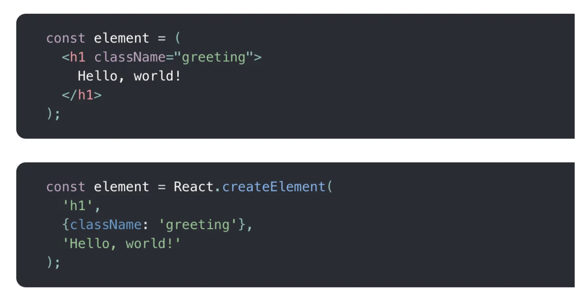

# JSX

JSX 表示 JavaScript XML，它是 JavaScript 的扩展，允许开发人员在 JavaScript 代码中使用类似 HTML 的语法。此扩展使组件的组合更易于阅读，它随着 React 一起出现，简化了在 HTML 和 JavaScript 中编写代码的方式。

那 JSX 究竟是如何工作的呢？它背后又有怎样的奇技淫巧？本文将介绍 JSX 的基本用法，然后从零开始编写一个 JSX 解析器，将 JSX “组件”转换为实际返回的有效 HTML 的JavaScript 代码。

## JSX 概述

### 基本语法

JSX 是 JavaScript XML 的缩写，它是一种在JavaScript代码中编写类似于HTML结构和语法的扩展。通过使用JSX，可以更直观地描述组件的结构，并使得代码更易于阅读和维护。尽管JSX看起来像HTML，但它实际上是通过编译器转换为纯JavaScript代码的。在编译过程中，JSX元素会被转换为`React.createElement()`函数的调用，创建相应的React元素。

JSX 允许创建自定义元素并在 React 应用中重用它们。 在下面的示例中，`Main` 组件包装在 `main` 标签中。 它还允许在 HTML 标签中嵌入 JavaScript 表达式。 在下面的示例中，“Main content”文本是一个将被计算并渲染为文本的表达式。

使用 JSX，您可以构建如下组件：

```jsx
function App() {
  return (
    <div>
      <h1>Hello</h1>
    </div>
  )
}
```

这段代码 `return` 之后的就是JSX。

使用 JSX 的主要好处之一是它使代码\*\*更具可读性和简洁性。\*\*来看下面的代码块，比较了带有和不带有 JSX 的简单项目列表。

```javascript
// 非 JSX
const fruits = ["apple", "banana", "cherry"];

// JSX
const jsxFruits = [<li>apple</li>, <li>banana</li>, <li>cherry</li>];
```

JSX 还具有许多使其比 HTML 使用起来更方便的功能。例如，可以在 JSX 标签内使用 JavaScript 表达式来动态创建和填充 HTML 元素。还可以使用内置 JavaScript 函数来操作 HTML 元素并设置其样式。

需要注意，JSX 属性使用驼峰命名约定而不是 HTML 属性名称。

```html
<button onClick = {handleClick}>Click</button>
<div className = "hello"> Div </div>
<label htmlFor="">Label</label>
```

### JSX 表达式只能有一个父元素

**JSX 表达式只能有一个父元素**，那为什么不能有多个父元素呢？

```javascript
function App() {
  return (
    <div>Why</div>
    <div>Can I not do this?</div>
    )
}
```

或者：

```javascript
function App() {
  return (
    <div>
      {isOpen && (
        <div>Why again</div>
        <div>Can I not do this</div>
      )}
    </div>
  )
}
```

下面就来看看原因！

JSX 是 `React.createElement` 的语法糖，它是一个普通的 JavaScript 方法。 JSX 被编译成浏览器可以理解的普通 JavaScript。

要像在没有 JSX 的情况下创建 React 元素，可以在 React 对象上使用 `createElement` 方法。 该方法的语法是：

```javascript
React.createElement(element, props, ...children)
```

例如，对于以下 JSX：

```javascript
function App() {
  return (
    <div>
      <h1>Hello</h1>
    </div>
  )
}
```

是以下代码的语法糖：

```javascript
function App() {
  return React.createElement(
    "div",
    null,
    React.createElement("h1", null, "Hello")
  )
}
```

那如果在根上想要两个父元素怎么办？ 就像上面的第一个例子一样：

```javascript
function App() {
  return (
    <div>Why</div>
    <div>Can I not do this?</div>
  )
}
```

这段 JSX 会编译为：

```javascript
function App() {
  return React.createElement("div", null, "Why")
  React.createElement("div", null, "Can I not do this?")
}
```

这里尝试一次返回两个内容，但这并不是一段有效的 JavaScript。因此，只能返回一个父元素，而该父元素可以有任意数量的子元素。要返回多个子元素，可以将它们作为参数传递给 `createElement`，如下所示：

```javascript
return React.createElement(
  "h1",
  null,
  "Hello",
  "Hi",
  React.createElement("span", null, "Hello")
  // 其他子元素
)
```

其 JSX 表示为：

```javascript
return (
  <h1>
    Hello Hi
    <span>Hello</span>
  </h1>
)
```

接下来，检查一下之前的代码块：

```javascript
function App() {
  return (
    <div>
      {isOpen && (
        <div>Why again</div>
        <div>Can I not do this</div>
      )}
    </div>
  )
}
```

这个有一个根父级 div，但仍然会报错： `isOpen` 表达式中有多个父级。 为什么？

如果只使用一个 `div` 标签：

```javascript
function App() {
  return <div>{isOpen && <div>Why again</div>}</div>
}
```

这会编译为：

```javascript
function App() {
  return React.createElement(
    "div",
    null,
    isOpen && React.createElement("div", null, "Why again")
  )
}

```

`isOpen` 表达式是第一个 `createElement` 中的子级，该表达式使用逻辑 `&&` 运算符将第二个 `createElement` 父级作为子级添加到第一个 `createElement` 中。

这意味着这段代码有两个父级：

```javascript
function App() {
  return (
    <div>
      {isOpen && (
        <div>Why again</div>
        <div>Can I not do this</div>
      )}
    </div>
  )
}
```

这会编译为：

```javascript
function App() {
  return React.createElement(
    "div",
    null,
    isOpen
    && React.createElement("div", null, "Why again")
    React.createElement("div", null, "Can I not do this")
  )
}
```

这段代码是错误的语法，因为在 `&&` 运算符之后，尝试返回两个内容，而 JavaScript 只允许一次返回一个表达式。 返回的表达式应该有一个父表达式和多个的子表达式。

这就是为什么 JSX 表达式只能有一个父元素。

## 实现 JSX 解析器

先来看看最终要解析的 JSX 文件：

```javascript
import * as MyLib from './MyLib.js'

export function Component() {
    let myRef = null
    let name = "Fernando"
    let myClass = "open"
    
  	return (
        <div className={myClass} ref={myRef}>
            <h1>Hello {name}!</h1>
        </div>
    )
}

console.log(Component())
```

如果在 React 中编写这段代码，会得到这样的东西：

```javascript
import * as React from 'react'

export function Component() {
    let myRef = null
    let name = "Fernando"
    let myClass = "open"
    
  	return (
        <div className={myClass} ref={myRef}>
            <h1>Hello {name}!</h1>
        </div>
    )
}

console.log(Component())
```

这里唯一改变的就是初始导入，接下来编写 JSX 时，你就会明白为什么需要导入 React。

虽然解析本身需要一些工作，但其背后的逻辑实际上非常简单。 React 官方文档就展示了解析 JSX 的输出。



这里实际上是将每个 JSX 元素转换为对`React.createElement`的调用。因此，需要导入React，即使并没有直接使用它，一旦解析完成，生成的JavaScript代码将使用到它。

`React.createElement` 方法的第一个属性是要创建的元素的标签名。第二个属性是一个包含与正在创建的元素相关的所有属性的对象，其余的属性（可以有一个或多个）将成为此元素的直接子级（它们可以是纯文本或其他元素）。

因此，实现 JSX 解析器的大致步骤总结如下：

1. 捕获 JavaScript 中的 JSX。
2. 将其解析为可以遍历和查询的树状结构。
3. 将该结构转换为将代替 JSX 编写的 JavaScript 代码（文本）。
4. 将步骤 3 的输出保存到磁盘中，并保存为扩展名为 `.js` 的文件。

### （1）从组件中提取并解析 JSX

第一步就是通过某种方式从组件中提取 JSX 并将其解析为树状结构。

我们需要做的第一件事是读取 JSX 文件，然后使用**正则表达式**来捕获 JSX 代码。最后，就可以使用 HTML 解析器来解析它。

此时，我们关心的是结构，而不是 JSX 的实际功能。 因此，可以使用 Node 中的 `fs` 模块和 `node-html-parser` 包来读取文件。

该函数如下所示：

```javascript
const JSX_STRING = /\(\s*(<.*)>\s*\)/gs

async function parseJSXFile(fname) {
    let content = await fs.promises.readFile(fname)
    let str = content.toString()

    let matches = JSX_STRING.exec(str)
    if(matches) {
        let HTML = matches[1] + ">"
        const root = parse(HTML)
        let translated = (translate(root.firstChild))
        str = str.replace(matches[1] + ">", translated)
        await fs.promises.writeFile("output.js", str)
    }
}
```

`parseJSXFile` 函数使用 `RegExp` 来查找函数中第一个组件的开始标签。在第 10 行调用了解析函数，该函数返回一个根元素，其中 `firstChild` 是 JSX 中的根元素（在开始的例子中是 `div` 元素）。

现在有了树状结构，就可以将其转换为代码了。 为此，将调用 `translate` 函数。

### （2）将 HTML 转译为 JS 代码

由于处理的树状结构的深度有限，因此可以安全地使用递归来遍历这棵树。

该函数如下所示：

```javascript
function translate(root) {
    if(Array.isArray(root) && root.length == 0) return

    let children = []
    if(root.childNodes.length > 0) {
        children = root.childNodes.map( child => translate(child) ).filter( c => c != null)
    }
    // 文本节点
    if(root.nodeType == 3) {
        if(root._rawText.trim() === "") return null
        return parseText(root._rawText)
        
    }
    let tagName = root.rawTagName

    let opts = getAttrs(root.rawAttrs)
   
    return `MyLib.createElement("${tagName}", ${replaceInterpolations(JSON.stringify(opts, replacer), true)}, ${children})`
    
}
```

首先，遍历所有子项，并对它们调用 `translate ` 函数。 如果子级为空，则该调用将返回 `null`，将在第 7 行过滤这些结果。

处理完子节点后，接下来看一下第 9 行，在其中对节点类型进行快速健全性检查。如果类型为 3，则意味着这是一个文本节点，将返回解析后的文本。

为什么要调用 `parseText` 函数呢？ 因为即使在文本节点内部，我们也需要在 `{…}` 中查找 JSX 表达式。 因此，如果需要，此函数将负责检查并正确更改返回的字符串。

接下来，获取标签名称（第 14 行），然后解析属性（第 16 行）。 解析属性意味着将获取原始字符串并将其转换为正确的 JSON。

最后，返回想要生成的代码行（即使用正确的参数调用 `createElement`）。

注意，生成的代码会从 `MyLib` 模块调用 `createElement` 方法。这就是为什么在 JSX 文件内有 `import * as MyLib from './MyLib.js'` 的原因。

接下来就需要处理字符串来替换 JSX 表达式，无论是在文本节点还是每个元素的属性对象内。

### （3）解析表达式

在此实现中支持的 JSX 表达式类型是最简单的一种。正如示例中看到的，可以在这些表达式中添加 JS 变量，它们将在最终输出中保留为变量。

以下是执行此操作的函数：

```javascript
const JSX_INTERPOLATION = /\{([a-zA-Z0-9]+)\}/gs

function parseText(txt) {
    let interpolations = txt.match(JSX_INTERPOLATION)
    if(!interpolations) {
        return txt
    } else {
        txt = replaceInterpolations(txt)
        return `"${txt}"`
    }
}

function replaceInterpolations(txt, isOnJSON = false) {
    let interpolations = null;

    while(interpolations = JSX_INTERPOLATION.exec(txt)) {
        if(isOnJSON) {
            txt = txt.replace(`"{${interpolations[1]}}"`, interpolations[1])
        } else {
            txt = txt.replace(`{${interpolations[1]}}`, `"+ ${interpolations[1]} +"`)
        }
    } 
    return txt
}
```

如果有插值（即大括号内的变量），就会调用`replaceInterpolation`函数，该函数会遍历所有匹配的插值，并将它们替换为正确格式的字符串（本质上以在写入JS文件时生成JS变量的方式保留变量名称）。

我们也将这些函数与属性对象一起使用。 由于在返回 JS 代码时使用 `JSON.stringify` 方法，因此该函数会将所有值转换为字符串。 因此，将解析 `stringify` 方法返回的字符串，并确保正确替换插值变量。

`getAttrs` 函数的实现如下：

```javascript
function getAttrs(attrsStr) {
    if(attrsStr.trim().length == 0) return {}
    let objAttrs = {}
    let parts = attrsStr.split(" ")
    parts.forEach( p => {
        const [name, value] = p.split("=")
        console.log(name)
        console.log(value)
        objAttrs[name] = (value)
    })
    return objAttrs
}
```

### （4）JavaScript 代码

接下来看一下解析 JSX 文件所输出的代码：

```javascript
import * as MyLib from './MyLib.js'

export function Component() {
    let myRef = null
    let name = "Fernando"
    let myClass = "open"
  
    return (
        MyLib.createElement("div", 
           {"className":myClass,"ref":myRef}, 
           MyLib.createElement( 
              "h1", 
              {}, 
              "Hello "+ name +"!"))
    )
}

console.log(Component())
```

这段代码真正有趣的地方是生成的对 `createElement` 的调用。 可以看到它们是如何嵌套的，以及它们引用了在 JSX 文件中插回的变量。

如果执行这段代码，输出如下：

```javascript
<div class="open" ref="null">
  <h1 >
  Hello Fernando!
  </h1>
</div>
```

那 `createElement` 方法是如何实现的呢？这里有一个简化的版本：

```javascript
function mapAttrName(name) {
    if(name == "className") return "class"
    return name
}

export function createElement(tag, opts, ...children) {
    return `<${tag} ${Object.keys(opts).map(oname => `${mapAttrName(oname)}="${opts[oname]}"`).join(" ")}>
     ${children.map( c => c)}
     </${tag}>
    `
}
```

本质上，这里使用标签值创建一个包装元素，为其添加属性（如果有的话），最后，遍历子列表（这是一个包含所有添加属性的剩余属性），在此过程中，将简单地将这些值作为字符串返回（第 9 行）。

这样，一个简易的 JSX 解析器就完成了，下面是完整的代码：

```javascript
import * as fs from 'fs'
import { parse } from 'node-html-parser';


const JSX_STRING = /\(\s*(<.*)>\s*\)/gs
const JSX_INTERPOLATION = /\{([a-zA-Z0-9]+)\}/gs
const QUOTED_STRING = /["|'](.*)["|']/gs

function getAttrs(attrsStr) {
    if(attrsStr.trim().length == 0) return {}
    let objAttrs = {}
    let parts = attrsStr.split(" ")
    parts.forEach( p => {
        const [name, value] = p.split("=")
        console.log(name)
        console.log(value)
        objAttrs[name] = (value)
    })
    return objAttrs
}

function parseText(txt) {
    let interpolations = txt.match(JSX_INTERPOLATION)
    if(!interpolations) {
        console.log("no inerpolation found: ", txt)
        return txt
    } else {
        console.log("inerpolation found!", txt)
        txt = replaceInterpolations(txt)
        // interpolations.shift()
        // interpolations.forEach( v => {
        //     txt = txt.replace(`{${v}}`, `" + (${v}) + "`)
        // })
        return `"${txt}"`
    }
}

function replacer(k, v) {
    if(k) {
        let quoted = QUOTED_STRING.exec(v)
        if(quoted) {
            return parseText(quoted[1])
        }
        return (v)
    } else {
        return v
    }
}

function replaceInterpolations(txt, isOnJSON = false) {
    let interpolations = null;

    while(interpolations = JSX_INTERPOLATION.exec(txt)) {
        console.log("fixing interpolation for ", txt)
        console.log(interpolations)
        if(isOnJSON) {
            txt = txt.replace(`"{${interpolations[1]}}"`, interpolations[1])
        } else {
            txt = txt.replace(`{${interpolations[1]}}`, `"+ ${interpolations[1]} +"`)
        }
    } 
    return txt
}

function translate(root) {
    if(Array.isArray(root) && root.length == 0) return
    console.log("Current root: ")
    console.log(root)
    let children = []
    if(root.childNodes.length > 0) {
        children = root.childNodes.map( child => translate(child) ).filter( c => c != null)
    }
    if(root.nodeType == 3) { //Textnodes
        if(root._rawText.trim() === "") return null
        return parseText(root._rawText)
        
    }
    let tagName = root.rawTagName

    let opts = getAttrs(root.rawAttrs)
    console.log("Opts: ")
    console.log(opts)
    console.log(JSON.stringify(opts))

    return `MyLib.createElement("${tagName}", ${replaceInterpolations(JSON.stringify(opts, replacer), true)}, ${children})`
    
}

async function parseJSXFile(fname) {
    let content = await fs.promises.readFile(fname)
    let str = content.toString()

    let matches = JSX_STRING.exec(str)
    if(matches) {
        let HTML = matches[1] + ">"
console.log("parsed html")
console.log(HTML)
        const root = parse(HTML)
        //console.log(root.firstChild)
        let translated = (translate(root.firstChild))
        str = str.replace(matches[1] + ">", translated)
        await fs.promises.writeFile("output.js", str)
    }

}

(async () => {
    await parseJSXFile("./file.jsx")
})()
```


> 更新: 2023-09-22 00:08:43  
> 原文: <https://www.yuque.com/cuggz/feplus/dl1c7hgxaoyl2tn5>