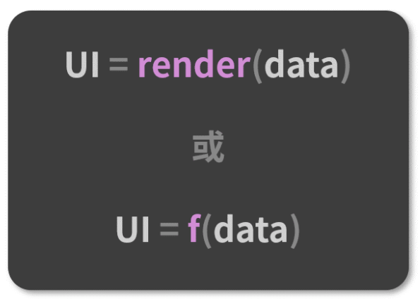
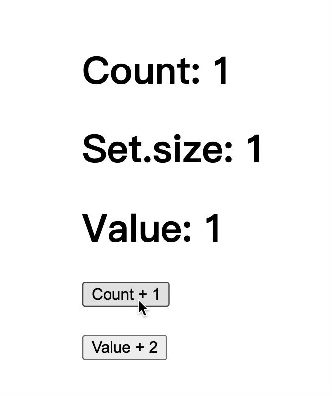
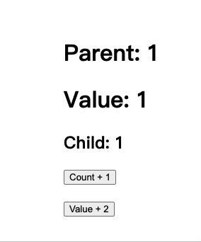
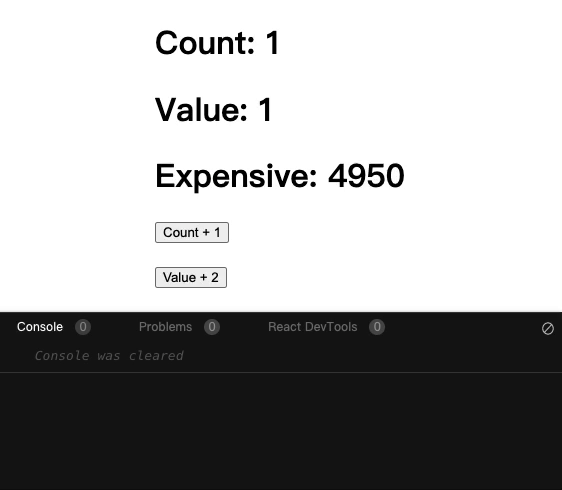
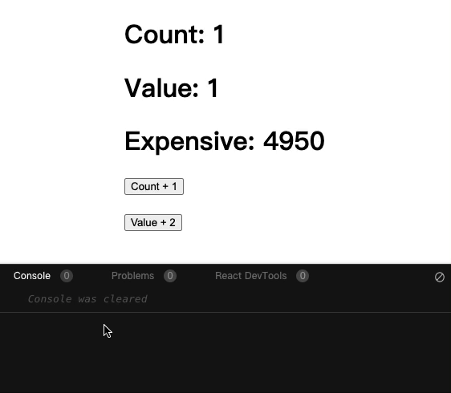
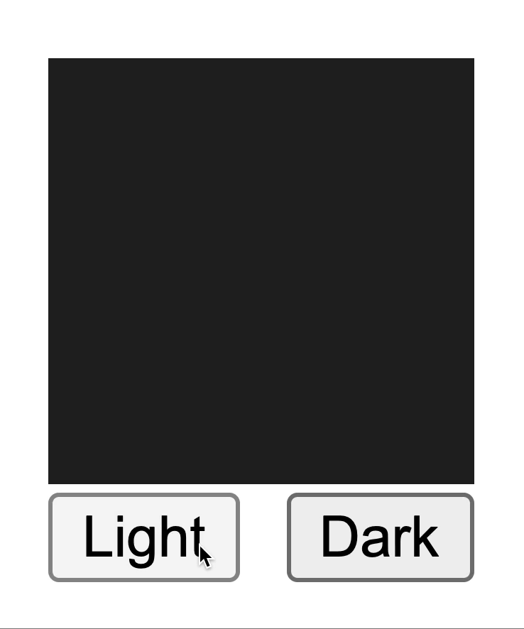
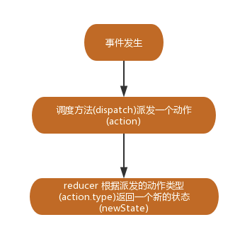

# Hooks

### 1. React Hooks诞生之前

Hook 是 React 16.8 的新增特性，它可以让我们**在不编写class的情况下使用state以及其他的React特性**（比如生命周期）。React Hooks 的出现是对**类组件**和**函数组\*\*\*\*件**这两种组件形式的思考和侧重。下面就来看看函数组件和类组件分别有哪些优缺点。

#### （1）类组件

类组件是基于 ES6中的 Class 写法，通过继承 React.Component 得来的 React 组件。下面是一个类组件：

```javascript
import React from 'react';

class ClassComponent extends React.Component {
  constructor(props) {
    super(props);

    this.state = {
      text: ""
    }
  }
  
  componentDidMount() {
    //...
  }
  changeText = (newText) => {
    this.setState({
      text: newText
    });
  };

  render() {
    return (
      <div>
        <p>{this.state.text}</p>
        <button onClick={this.changeText}>修改</button>
      </div>
    );
  }
}

export default ClassComponent
```

对于类组件，总结其**优点**如下：

* \*\*组件状态：\*\*类组件可以定义自己的state，用来保存组件内部状态；而函数组件不可以，函数每次调用都会产生新的临时变量；
* \*\*生命周期：\*\*类组件有生命周期，可以在对应的生命周期中完成业务逻辑，比如在componentDidMount中发送网络请求，并且该生命周期函数只会执行一次；而在函数组件中发送网络请求时，每次重新渲染都会重新发送一次网络请求；
* \*\*渲染优化：\*\*类组件可以在状态改变时只重新执行render函数以及希望重新调用的生命周期函数componentDidUpdate等；而函数组件在重新渲染时，整个函数都会被执行。

对于类组件，总结其**缺点**如下：

* \*\*难以拆分：\*\*随着业务的增多，类组件会变得越来越复杂，很多逻辑往往混在一起，强行拆分反而会造成过度设计，增加了代码的复杂度；
* **难以理解：**类组件中有** this **和**生命周期**这两大痛点。对于生命周期，不仅学习成本高，并且需要将业务逻辑规划在合适的生命周期中，每个生命周期中的逻辑看上去毫无关联，逻辑就像是被“打散”进生命周期里了一样；除此之外，在类组件中涉及到了 this 的指向，我们必须搞清楚this的指向到底是谁，这个过程就很容易出现问题。为了解决 this 不符合预期的问题，可以使用 bind、箭头函数来解决。但**本质上都是在用实践层面的约束来解决设计层面的问题**。
* \*\*难以复用组件状态：\*\*复用状态逻辑主要靠的是 HOC（高阶组件）和 Render Props 这些组件设计模式，React 在原生层面并没有提供相关的途径。这些设计模式并非万能，它们在实现逻辑复用的同时，也破坏着组件的结构，其中一个最常见的问题就是“嵌套地狱”现象。

#### （2）函数组件

函数组件就是以函数的形态存在的 React 组件。函数组件内部无法定义和维护 state，因此它还有一个别名叫“无状态组件”。下面是一个函数组件：

```javascript
import React from 'react';

function FunctionComponent(props) {
  const { text } = props
  return (
    <div>
      <p>{`函数组件接收的内容：${text}`}</p>
    </div>
  );
}

export default FunctionComponent
```

相比于类组件，函数组件肉眼可见的特质自然包括轻量、灵活、易于组织和维护、较低的学习成本等。实际上，类组件和函数组件之间，是**面向对象**和**函数式编程**这两个设计思想之间的差异。而函数组件更加契合 React 框架的设计理念：



React 组件本身的定位就是函数：输入数据，输出 UI 的函数。React 框架的主要工作就是及时地把声明式的代码转换为命令式的 DOM 操作，把数据层面的描述映射到用户可见的 UI 变化中。从原则上来讲，React 的数据应该总是紧紧地和渲染绑定在一起的，而类组件无法做到这一点。\*\*函数组件就真正地将数据和渲染绑定到一起。\*\***函数组件是一个更加匹配其设计理念、也更有利于逻辑拆分与重用的组件表达形式。**

***

为了让开发者更好的编写函数组件。React Hooks 应运而生。

### 2. React Hooks是什么？

#### （1）概念

为了让函数组件更有用，目标就是给函数组件加上状态。我们知道，函数和类不同，它并没有一个实例的对象能够在多次执行之间来保存状态，那就需要一个函数外的空间来保存这个状态，并且能够检测状态的变化，从而触发组件的重新渲染。所以，我们需要一个机制，将数据绑定到函数的执行。当数据变化时，函数能自动重新执行。这样，任何会影响 UI 展现的外部数据，都可以通过这个机制绑定到 React 的函数组件上。而这个机制就是React Hooks。

实际上，React Hooks 是**一套能够使函数组件更强大、更灵活的“钩子”**。在 React 中，Hooks 就是**把某个目标结果钩到某个可能会变化的数据源或者事件源上， 那么当被钩到的数据或事件发生变化时，产生这个目标结果的代码会重新执行，产生更新后的结果**。我们知道，函数组件相对于类组件更适合去表达 React 组件的执行的，因为它更符合 State => View 逻辑关系，但是因为缺少状态、生命周期等机制，让它一直功能受到限制，而 React Hooks 的出现，就是为了帮助函数组件补齐这些缺失的能力。

下面就通过一个计数器，来看看使用类组件和React Hooks分别是如何实现的。

**使用类组件实现：**

```javascript
import React from 'react'

class CounterClass extends React.Component {
  constructor(props) {
    super(props);

    this.state = {
      counter: 0
    }
  }

  render() {
    return (
      <div>
        <h2>当前计数: {this.state.counter}</h2>
        <button onClick={e => this.increment()}>+1</button>
        <button onClick={e => this.decrement()}>-1</button>
      </div>
    )
  }

  increment() {
    this.setState({counter: this.state.counter + 1})
  }

  decrement() {
    this.setState({counter: this.state.counter - 1})
  }
}

export default CounterClass
```

**使用React Hooks实现：**

```javascript
import React, { useState } from 'react';

function CounterHook() {
  const [counter, setCounter] = useState(0);

  return (
    <div>
      <h2>当前计数: {counter}</h2>
      <button onClick={e => setState(counter + 1)}>+1</button>
      <button onClick={e => setState(counter - 1)}>-1</button>
    </div>
  )
}

export default CounterHook
```

通过两段代码可以看到，使用React Hooks实现的代码更加简洁，逻辑更加清晰。

#### （2）特点

React的特点主要有以下两点：**简化逻辑复用**和**有助于关注分离。**（<font style="color:#F5222D;">以下示例来源于网络</font>）

***

**1）简化逻辑复用**

在出现Hooks 之前，组件逻辑的复用是比较难实现的，我们必须借助高阶组件（HOC）和Render Props 这些组件设计模式来实现React  Hooks出现之后，这些问题就迎刃而解了。

下面来举一个例子：我们有多个组件，当用户调整浏览器的窗口大小是，需要重新调整页面的布局。在React中，我们会根据Size大小来渲染不同的组件。代码如下：

```javascript
function render() {
  return size === small ? <SmallComponent /> : <LargeComponent />;
}
```

这段代码看起来很简单。但是如果我们使用类组件去实现时，就需要使用到高阶组件来解决，下面就用高阶组件来实现一下。

首先要定义一个高阶组件，负责监听窗口的大小的变化，并将变化后的值作为props传给下一个组件：

```javascript
const withWindowSize = Component => {
 	class WrappedComponent extends React.PureComponent {
 		constructor(props) {
 			super(props);
 			this.state = {
 					size: this.getSize()
 			};
 		}
 		componentDidMount() {
      // 监听浏览器窗口大小
   		window.addEventListener("resize", this.handleResize);
   	}
 		componentWillUnmount() {
      // 移除监听
 			window.removeEventListener("resize", this.handleResize);
 		}
    getSize() {
 			return window.innerWidth > 1000 ? "large" ："small";
    }
 		handleResize = ()=> {
 			const currentSize = this.getSize();
 			this.setState({
 				size: this.getSize()
 			});
 		}
		render() {
      return <Component size={this.state.size} />;
 		}
 	}
  return WrappedComponent;
};
```

这样，我们就可以调用withWindowSize方法来产生一个新组件，新组件自带size属性，例如：

```javascript
class MyComponent extends React.Component{
 	render() {
 	const { size } = this.props;
 		return size === small ? <SmallComponent /> : <LargeComponent />;
  }
}

export default withWindowSize(MyComponent); 
```

可以看到，为了传递外部状态（size），我们不得不给组件外面再套一层，这一层只是为了封装一段可重用的逻辑。这样写缺点是显而易见的：

* 代码不直观，难以理解，给维护带来巨大挑战；
* 增加很多额外的组件节点，每一个高阶组件都会多一层包装，给调试带来困难。

而React Hooks的出现，就让这种实现变得很简单：

```javascript
const getSize = () => {
  return window.innerWidth > 1000 ? "large" : "small";
}
const useWindowSize = () => {
  const [size, setSize] = useState(getSize());
  useEffect(() => {
    const handler = () => {
      setSize(getSize())
    };
    window.addEventListener('resize', handler);
    return () => {
      window.removeEventListener('resize', handler);
    };
   }, []);
   return size;
};

// 使用
const Demo = () => {
  const size = useWindowSize();
  return size === small ? <SmallComponent /> : <LargeComponent />;
};
```

可以看到，窗口大小是外部的一个数据状态，通过 Hooks 的方式对其进行封装， 从而将其变成一个可绑定的数据源。这样，当窗口大小变化时，使用这个 Hook 的组件就会重新渲染。而且代码也更加简洁和直观，不会产生额外的组件节点。

***

**2）有助于关注分离**

Hooks的另外一大好处就是有助于关注分离，在类组件中，我们需要同一个业务逻辑分散在不同的生命周期，比如上面是例子，我们在在 componentDidMount 中监听窗口代销，在 componentWillUnmount 中去解绑监听事件。而在函数组件中，我们可以将所有逻辑写在一起。通过Hooks的方式，把业务逻辑清晰地隔离开，能够让代码更加容易理解和维护。

**当然 React Hooks 也不是完美的，它的\*\*\*\*缺点如下：**

* Hooks 不能完全地为函数组件补齐类组件的能力，比如 getSnapshotBeforeUpdate、componentDidCatch 这些生命周期，目前都还是强依赖类组件的。
* 在类组件中有时一些方法有很多实例，如果用函数组件来解决相同的问题，业务逻辑的拆分和组织是一个很大的挑战。耦合和内聚的边界有时很难把握，函数组件给了我们一定程度的自由，但也对开发者的水平提出了更高的要求。
* Hooks 在使用层面有着严格的规则约束，对于 React 开发者来说，如果不能牢记并践行 Hooks 的使用原则，如果对 Hooks 的关键原理没有扎实的把握，很容易出现预料不到的问题。

#### （3）使用场景

React Hooks的使用场景如下：

* Hook的出现基本可以代替之前所有使用类组件的地方；
* 如果是一个旧的项目，不需要将所有的代码重构为Hooks，因为它完全向下兼容，可以渐进式的使用它；
* Hook只能在函数组件中使用，不能在类组件或函数组件之外的地方使用。

\*\*注意：\*\*Hook指的是类似于useState、 useEffect这样的函数，Hooks是对这类函数的统称。

#### （4）使用规范

Hooks规范如下：

* 始终在 React 函数的顶层使用 Hooks，遵循此规则，可以确保每次渲染组件时都以相同的顺序调用 Hook， 这就是让 React 在多个`useState` 和 `useEffect` 调用之间正确保留 Hook 的状态的原因;
* Hooks 仅在 React 函数中使用。

Eslint Plugin 提供了 `eslint-plugin-react-hooks` 让我们遵循上述两种规范。其使用方法如下：

1. **安装插件 ****eslint-plugin-react-hooks****：**

```javascript
npm install eslint-plugin-react-hooks --save-dev
```

2. **在 eslint 的 config 中配置 Hooks 规则：**

```javascript
{
  "plugins": [
    // ...
    "react-hooks"
  ],
  "rules": {
    // ...
    "react-hooks/rules-of-hooks": "error", // 检查 hooks 规则
    "react-hooks/exhaustive-deps": "warn"  // 检查 effect 的依赖
  }
}
```

### 3. useState：维护状态

#### （1）基本使用

useState 是允许我们在 React 函数组件中添加 state 的一个 Hook，使用形式如下：

```javascript
import React, { useState } from 'react';

function Example() {
  const [state, setState] = useState(0);
  const [age, setAge] = useState(18);
}

export default Example
```

这里调用 useState 方法时，就定义一个 state 变量，它的初始值为0，它与 class 里面的 `this.state` 提供的功能是完全相同的。

对于 useState 方法：

（1）参数：初始化值，它可以是任意类型，比 如数字、对象、数组等。如果不设置为undefined；

（2）返回值：数组，包含两个元素（通常通过数组解构赋值来获取这两个元素）；

* 元素一：当前状态的值（第一次调用为初始化值），该值是只读的，只能通过第二个元素的方法来修改它；
* 元素二：设置状态值的函数；

实际上，Hook 就是 JavaScript 函数，这个函数可以帮助我们钩入 React State 以及生命周期等特性。useState 和类组件中的 setState类似。两者的区别在于，类组件中的 state 只能有一个。一般是把一个对象作为一个 state，然后再通过对象不同的属性来表示不同的状态。而函数组件中用 useState 则可以很容易地创建多个 state，更加语义化。

#### （2）复杂变量

上面定义的状态变量（<font style="color:#4D4D4D;">值类型数据</font>）都比较简单，那如果是一个复杂的状态变量（<font style="color:#4D4D4D;">引用类型数据</font>），该如何实现更新呢？下面来看一个例子：

```javascript
import React, { useState } from 'react'

export default function ComplexHookState() {

  const [friends, setFrineds] = useState(["zhangsan", "lisi"]);
  
  function addFriend() {
    friends.push("wangwu");
    setFrineds(friends);
  }

  return (
    <div>
      <h2>好友列表:</h2>
      <ul>
        {
          friends.map((item, index) => {
            return <li key={index}>{item}</li>
          })
        }
      </ul>
      // 正确的做法
      <button onClick={e => setFrineds([...friends, "wangwu"])}>添加朋友</button>
      // 错误的做法
      <button onClick={addFriend}>添加朋友</button>
    </div>
  )
}
```

这里定义的状态是一个数组，如果想修改这个数组，需要重新定义一个数组来进行修改，在原数组上的修改不会引起组件的重新渲染。因为，<font style="color:#4D4D4D;">React组件的更新机制</font>**<font style="color:#4D4D4D;">对</font>\*\*\*\*<font style="color:#4D4D4D;">state只进行浅对比</font>**<font style="color:#4D4D4D;">，也就是更新某个复杂类型数据时只要它的引用地址没变，就不会重新渲染组件。因此，当直接向原数组增加数据时，就不会引起组件的重新渲染。</font>

<font style="color:#4D4D4D;"></font>

<font style="color:#4D4D4D;">对于这种情况，常见的做法就是使用扩展运算符（...）来将数组元素重新赋值给一个新数组，或者对原数据进行深拷贝得到一个新的数据。</font>

#### （3）独立性

当一个组件需要多个状态时，我们可以在组件中多次使用 `useState`：

```javascript
const [age, setAge] = useState(17)
const [fruit, setFruit] = useState('apple')
const [todos, setTodos] = useState({text: 'learn Hooks'})
```

在这里，每个 Hook 都是相互独立的。那么当出现多个状态时，react是如何保证它的独立性呢？上面调用了三次 `useState`，每次都是传入一个值，react 是怎么知道这个值对应的是哪个状态呢？

其实在初始化时会创建两个数组 `state` 和 `setters`，并且会设置一个光标 `cursor = 0` ， 在每次运行 `useState` 函数时，会将参数放到 `state` 中，并根据运行顺序来依次增加光标 `cursor` 的值，接着在 `setters` 中放入对应的 `set` 函数，通过光标 `cursor` 把 `set` 函数和 `state` 关联起来，最后，便是将保存的 `state` 和 `set` 函数以数组的形式返回出去。比如在运行 `setCount(15)` 时，就会直接运行 `set` 函数，`set` 函数有相应的 `cursor` 值，然后改变 `state` 。

#### （4）缺点

state虽然便于维护状态，但也有缺点。一旦组件有自己状态，当组件重新创建时，就有恢复状态的过程，这会让组件变得更复杂。

比如一个组件想在服务器获取用户列表并显示，如果把读取到的数据放到本地的 state 里，那么每个用到这个组件的地方，就都需要重新获取一遍。 而如果通过一些状态管理框架（例如redux），去管理所有组件的 state ，那么组件本身就可以是无状态的。无状态组件可以成为更纯粹的表现层，没有太多的业务逻辑，从而更易于使用、测试和维护。

### 4. useEffect：执行副作用

#### （1）基本使用

<font style="color:#4A4A4A;">函数式组件通过 useState 具备了操控 state 的能力，修改 state 需要在适当的场景进行：类组件在组件生命周期中进行 state 更新，函数式组件中需要用 useEffect 来模拟生命周期。目前 useEffect 相当于类组件中的 componentDidMount、componentDidUpdate、componentWillUnmount 三个生命周期的综合。</font><font style="color:#4A4A4A;">也就是说，useEffect 声明的回调函数会在组件挂载、更新、卸载的时候执行。</font>实际上，useEffect的作用就是\*\*执行副作用，**而副作用就是上面所说的这些**和当前执行结果无关的代码。\*\*手动操作 DOM、订阅事件、网络请求等都属于React更新DOM的副作用。

useEffect 的使用形式如下：

```javascript
useEffect(callBack, [])
```

useEffect 接收两个参数，分别是**回调函\*\*\*\*数**与**依赖数组**。<font style="color:#4A4A4A;">为了避免每次渲染都执行所有的 useEffect 回调，useEffect 提供了第二个参数，该参数一个数组。只有在渲染时数组中的值发生了变化，才会执行该 useEffect 的回调。</font>

#### （2）使用示例

下面来看一个例子：

```javascript
import React, { useEffect, useState } from 'react'

function App() {
  const [count, setCount] = useState(0)
  
  useEffect(() => {
    console.log(count + '值发生了改变')
  }, [count])
  
  function changeTheCount () {
    setCount(count + 1)
  }
  
  return (
    <div>
      <div onClick={() => changeTheCount()}>
        <p>{count}</p>
      </div>
    </div>
  ) 
}
export default App
```

上面的代码执行后，点击 3 次数字，`count` 的值变为了 3，并且在控制台打印了 4 次输出。第一次是初次 DOM 渲染完毕，后面 3 次是每次点击后改变了 `count` 值，触发了 DOM 重新渲染。由此可见，每次依赖数组中的元素发生改变之后都会执行 `effect` 函数。

useEffect 还有两个特殊的用法：**没有依赖项**和**依赖项为空数组。**

**1）没有依赖项**

对于下面的代码，如果没有依赖项，那它会在每次render之后执行：

```javascript
useEffect(() => {
    console.log(count + '值发生了改变')
})
```

**2）依赖项为空数组**

对于下面的代码， 如果依赖项为空数组，那它会在首次执行时触发，对应到类组件的生命周期就是 componentDidMount。

```javascript
useEffect(() => {
    console.log(count + '值发生了改变')
}, [])
```

除此之外，\*\*useEffect 还允许返回一个方法，用于在组件销毁时做一些清理操作，\*\***以防⽌内存泄漏**。比如移除事件的监听。这个机制就相当于类组件生命周期中的 componentWillUnmount。比如清除定时器：

```javascript
const [data, setData] = useState(new Date());
useEffect(() => {
 	const timer = setInterval(() => {
  	 setDate(new Date());
  }, 1000);
  return () => clearInterval(timer);
}, []);
```

通过这样的机制，就能够更好地管理副作用，从而确保组件和副作用的一致性。

#### （3）总结

从上面的示例中可以看到，useEffect主要有以下四种执行时机：

* 每次 render 后执行：不提供第二个依赖项参数。比如：`useEffect(() => {})`；
* 组件 Mount 后执行：提供一个空数组作为依赖项。比如：`useEffect(() => {}, [])`；
* 第一次以及依赖项发生变化后执行：提供依赖项数组。比如：`useEffect(() => {}, [deps])`；
* 组件 unmount 后执行：返回一个回调函数。比如：`useEffect() => { return () => {} }, [])`。

在使用useEffect时，需要注意以下几点：

* 依赖数组中的依赖项一定是要在回调函数中使用的，不然就没有任何意义；
* 依赖项一般是一个常量数组，因为在创建回调函数时，就应该确定依赖项了；
* React在每次执行时使用的是浅比较，所以一定要注意对象和数组类型的依赖项。

### 5. useCallback：缓存回调函数

在类组件的 `shouldComponentUpdate` 中可以通过判断前后的 `props` 和 `state` 的变化，来判断是否需要阻止更新渲染。但使用函数组件形式失去了这一特性，无法通过判断前后状态来决定是否更新，这就意味着函数组件的每一次调用都会执行其内部的所有逻辑，会带来较大的性能损耗。`useMemo` 和 `useCallback` 的出现就是为了解决这一性能问题。

#### （1）使用场景

在React函数组件中，每次UI发生变化，都是通过重新执行这个函数来完成的，这和类组件有很大的差别：**函数组件无\*\*\*\*法在每次渲染之间维持一个状态。**

***

比如下面这个计数器的例子：

```javascript
function Counter() {
 const [count, setCount] = useState(0);
 const increment = () => setCount(count + 1);
 return <button onClick={increment}>+</button>
}
```

由于增加计数的方法increment在组件内部，这就导致在每次修改count时，都会重新渲染这个组件，increment也就无法进行重用，每次都需要创建一个新的increment方法。

不仅如此，即使count没有发生改变，当组件内部的其他state发生变化时，组件也会进行重新渲染，那这里的increment方法也会因此重新创建。虽然这些都不影响页面的正常使用，但是这增加了系统的开销，并且每次创建新函数的方式会让接收事件处理函数的组件重新渲染。

对于这种情况，那上面的例子来说，我们想要的就是：只有count发生变化时，对应的increment方法才会重新创建。这里就用到useCallback\*\*。\*\*

#### （2）基本使用

useCallback会返回一个函数的记忆的值，在依赖不变的情况下，多次定义时，返回的值是相同的。它的使用形式如下：

```javascript
useCallback(callBack, [])
```

它的使用形式和useEffect类似，第一个参数是定义的回调函数，第二个参数是依赖的变量数组。只有当某个依赖变量发生变化时，才会重新声明定义的回调函数。

<font style="color:#4D4D4D;">由于</font>useCallback在依赖项发生变化时<font style="color:#4D4D4D;">返回的是函数，所以无法很好的判断返回的函数是否发生变更，这里借助ES6中的数据类型Set来判断：</font>

```javascript
import React, { useState, useCallback } from "react";

const set = new Set();

export default function Callback() {
  const [count, setCount] = useState(1);
  const [value, setValue] = useState(1);

  const callback = useCallback(() => {
    console.log(count);
  }, [count]);
  set.add(callback);

  return (
    <div>
      <h1>Count: {count}</h1>
      <h1>Set.size: {set.size}</h1>
      <h1>Value: {value}</h1>
      <div>
        <button onClick={() => setCount(count + 1)}>Count + 1</button>
        <button onClick={() => setValue(value + 2)}>Value + 2</button>
      </div>
    </div>
  );
}

```

运行效果如下图所示：



可以看到，当我们点击Count + 1按钮时，Count和Set.size都增加1，说明产生了新的回调函数。当点击Value + 2时，只有Value发生了变化，而Set.size没有发生变化，说明没有产生的新的回调函数，<font style="color:#4D4D4D;">返回的是缓存的旧版本函数</font>。

既然我们知道了useCallback有这样的特点，那在什么情况下能发挥出它的作用呢？

\*\*使用场景：\*\*父组件中一个子组件，通过情况下，当父组件发生更新时，它的子组件也会随之更新，在多数情况下，子组件随着父组件更新而更新是没有必要的。这时就<font style="color:#4D4D4D;">可以借助useCallback来返回函数，然后把这个函数作为props传递给子组件，这样，子组件就可以避免不必要的更新。</font>

```javascript
import React, { useState, useCallback, useEffect } from "react";
export default function Parent() {
  const [count, setCount] = useState(1);
  const [value, setValue] = useState(1);

  const callback = useCallback(() => {
    return count;
  }, [count]);

  return (
    <div>
      <h1>Parent: {count}</h1>
      <h1>Value: {value}</h1>
      <Child callback={callback} />
      <div>
        <button onClick={() => setCount(count + 1)}>Count + 1</button>
        <button onClick={() => setValue(value + 2)}>Value + 2</button>
      </div>
    </div>
  );
}

function Child({ callback }) {
  const [count, setCount] = useState(() => callback());
  useEffect(() => {
    setCount(callback());
  }, [callback]);

  return <h2>Child: {count}</h2>;
}
```

对于这段代码，运行结果如下：



可以看到，当我们点击Counte + 1按钮时，Parent和Child都会加一；当点击Value + 1按钮时，只有Value增大了，Child组件中的数据并没有变化，所以就不会重新渲染。这样就避免了一些无关的操作而造成子组件随父组件而重新渲染。

除了上面的例子，<font style="color:#4D4D4D;">所有依赖本地状态或props来创建函数，需要使用到缓存函数的地方，都是useCallback的应用场景。</font>通常使用useCallback的目的是**不希望子组件进行多次渲染**，而不是为了对函数进行缓存。

### 6. useMemo：缓存计算结果

**useMemo实际的目的也是为了进行性能的优化。**

#### （1）使用场景

下面先来看一段代码：

```javascript
import React, { useState } from "react";

export default function WithoutMemo() {
  const [count, setCount] = useState(1);
  const [value, setValue] = useState(1);

  function expensive() {
    console.log("compute");
    let sum = 0;
    for (let i = 0; i < count * 100; i++) {
      sum += i;
    }
    return sum;
  }

  return (
    <div>
      <h1>Count: {count}</h1>
      <h1>Value: {value}</h1>
      <h1>Expensive: {expensive()}</h1>
      <div>
        <button onClick={() => setCount(count + 1)}>Count + 1</button>
        <button onClick={() => setValue(value + 2)}>Value + 2</button>
      </div>
    </div>
  );
}
```

这段代码很简单，expensive方法用来计算0到100倍count的和，这个计算是很昂贵的。当我们点击页面的两个按钮时，expensive方法都是执行（可以在控制台看到），运行结果如下图所示：



我们知道，这个expensive方法只依赖于count，只有当count发生变化时才需要重新计算。在这种情况下，我们就可以 <font style="color:#4D4D4D;">useMemo，只在count的值修改时，才去执行expensive的计算。</font>

#### （2）使用示例

useMemo返回的也是一个记忆的值，在依赖不变的情况下，多次定义时，返回的值是相同的。它的使用形式如下：

```javascript
useCallback(callBack, [])
```

它的使用形式和上面的useCallback类似，第一个参数是产生所需数据的计算函数，一般它会使用第二个参数中依赖数组的依赖项来生成一个结果，用来渲染最终的UI。

下面就使用useMemo来优化上面的代码：

```javascript
import React, { useState, useMemo } from "react";

export default function WithoutMemo() {
  const [count, setCount] = useState(1);
  const [value, setValue] = useState(1);

  const expensive = useMemo(() => {
    console.log("expensive执行");
    let sum = 0;
    for (let i = 0; i < count * 100; i++) {
      sum += i;
    }
    return sum;
  }, [count]);

  return (
    <div>
      <h1>Count: {count}</h1>
      <h1>Value: {value}</h1>
      <h1>Expensive: {expensive}</h1>
      <div>
        <button onClick={() => setCount(count + 1)}>Count + 1</button>
        <button onClick={() => setValue(value + 2)}>Value + 2</button>
      </div>
    </div>
  );
}

```

代码的运行结果如下图：



<font style="color:#4D4D4D;">可以看到，当点解Count + 1按钮时，expensive方法才会执行；而当点击Value + 1按钮时，expensive方法是不执行的。这里我们使用useMemo来执行昂贵的计算，然后将计算值返回，并且将count作为依赖值传递进去。这样只会在count改变时触发expensive的执行，在修改value时，返回的是上一次缓存的值。</font>

<font style="color:#4D4D4D;"></font>

<font style="color:#4D4D4D;">所以，当</font>某个数据是通过其它数据计算得到的，那么只有当用到的数据，也就是依赖的数据发生变化的时候，才应该需要重新计算。useMemo可以避免在用到的数据没发生变化时进行重复的计算。

除此之外，useMemo 还有一个很重要的用处：\*\*避免子组件的重复渲染，\*\*这和上面的useCallback是很类似的，这里就不举例说明了。

可以看到，useMemo和useCallback是很类似的，它们之间是可以相互转化的：useCallback(fn, deps) 相当于 useMemo(() => fn, deps) 。

### 7. useRef：共享数据

函数组件虽然看起来很直观，但是到目前为止，它相对于类组件还缺少一个很重要的能力，那就是**组件多次渲染之间共享数据**。在类函数中，我们可以通过对象属性来保存数据状态。但是在函数组件中，没有这样一个空间去保存数据。因此，useRef 就提供了这样的功能。

useRef的使用形式如下:

```javascript
const myRefContainer = useRef(initialValue);
```

`useRef` 返回一个可变的 ref 对象，其 `.current` 属性被初始化为传入的参数。返回的 ref 对象在组件的整个生命周期内保持不变，也就是说每次重新渲染函数组件时，返回的 ref 对象都是同一个。

那在实际应用中，useRef有什么用呢？主要有两个应用场景：

#### （1）绑定DOM

有这样一个简单的场景：在初始化页面时，使得页面中的某个input输入框自动聚焦，使用类组件可以这样实现：

```javascript
class InputFocus extends React.Component {
  refInput = React.createRef();
  componentDidMount() {
    this.refInput.current && this.refInput.current.focus();
  }
  render() {
    return <input ref={this.refInput} />;
  }
}
```

那在函数组件中想要实现，可以借助useRef来实现：

```javascript
function InputFocus() {
  const refInput = React.useRef(null);
  React.useEffect(() => {
    refInput.current && refInput.current.focus();
  }, []);

  return <input ref={refInput} />;
}
```

这里，我们将refInput和input输入框绑定在了一起，当我们刷新页面后，鼠标仍然是聚焦在这个输入框的。

#### （2）保存数据

这样一个场景，就是我们有一个定时器组件，这个组件可以开始和暂停，我们可以使用setInterval来进行计时，为了能暂停，我们就需要获取到定时器的的引用，在暂停时清除定时器。那么这个计时器引用就可以保存在useRef中，因为它可以存储跨渲染的数据，代码如下：

```javascript
import React, { useState, useCallback, useRef } from "react";

export default function Timer() {
  const [time, setTime] = useState(0);
  const timer = useRef(null);

  const handleStart = useCallback(() => {
    timer.current = window.setInterval(() => {
      setTime((time) => time + 1);
    }, 100);
  }, []);

  const handlePause = useCallback(() => {
    window.clearInterval(timer.current);
    timer.current = null;
  }, []);

  return (
    <div>
      <p>{time / 10} seconds</p>
      <button onClick={handleStart}>开始</button>
      <button onClick={handlePause}>暂停</button>
    </div>
  );
}
```

可以看到，这里使用 useRef 创建了一个保存 setInterval 的引用，从而能够在点击暂停时清除定时器，达到暂停的目的。同时，使用 useRef 保存的数据一般是和 UI 的渲染无关的，当 ref 的值发生变化时，不会触发组件的重新渲染，这也是 useRef 区别于 useState 的地方。

### 8. useContext：全局状态管理

我们知道，React提供了Context来管理全局的状态，当我们在组件上创建一个 Context 时，这个组件树上的所有组件就都都能访问和修改这个 Context了。这个属性适用于类组件。在React  Hooks中也提供了类似的属性，那就是useContext。

简单来说就是 useContext 会创建一个上下文对象，并且对外暴露提供者和消费者，在上下文之内的所有子组件，都可以访问这个上下文环境之内的数据。

context 做的事情就是创建一个上下文对象，并且对外暴露提供者和消费者，在上下文之内的所有子组件，都可以访问这个上下文环境之内的数据，并且不用通过 props。 简单来说， context 的作用就是对它所包含的组件树提供全局共享数据的一种技术。

首先，创建一个上下文，来提供两种不同的页面主题样式：

```javascript
const themes = {
  light: {
    foreground: "#000000",
    background: "#eeeeee"
  },
  dark: {
    foreground: "#ffffff",
    background: "#222222"
  }
};
const ThemeContext = React.createContext(themes.light)
```

接着，创建一个 Toolbar 组件，这个组件中包含了一个 ThemedButton 组件，这里先不关心 ThemedButton 组件的逻辑：

```javascript
function Toolbar(props) {
  return (
    <div>
      <ThemedButton />
    </div>
  );
}
```

这时，需要提供者提供数据，提供者一般位于比较高的层级，直接放在 App 中。`ThemeContext.Provider` 就是这里的提供者，接收的 `value` 就是它要提供的上下文对象：

```javascript
function App() {
  return (
    <ThemeContext.Provider value={themes.light}>
      <Toolbar />
    </ThemeContext.Provider>
  );
}
```

然后，消费者获取数据，这是在 ThemedButton 组件中使用：

```javascript
function ThemedButton(props) {
  const theme = useContext(ThemeContext);
  const [themes, setthemes] = useState(theme.dark);

  return (
    <div>
      <div
        style={{
          width: "100px",
          height: "100px",
          background: themes.background,
          color: themes.foreground
        }}
      ></div>
      <button onClick={() => setthemes(theme.light)}>Light</button>
      <button onClick={() => setthemes(theme.dark)}>Dark</button>
    </div>
  );
}
```

到这里，整个例子就结束了，下面是整体的代码：

```javascript
import React, { useContext, useState } from "react";

const themes = {
  light: {
    foreground: "#000000",
    background: "#eeeeee"
  },
  dark: {
    foreground: "#ffffff",
    background: "#222222"
  }
};

const ThemeContext = React.createContext(themes.light);

function ThemedButton(props) {
  const theme = useContext(ThemeContext);
  const [themes, setthemes] = useState(theme.dark);

  return (
    <div>
      <div
        style={{
          width: "100px",
          height: "100px",
          background: themes.background,
          color: themes.foreground
        }}
      ></div>
      <button onClick={() => setthemes(theme.light)}>Light</button>&nbsp;&nbsp;
      <button onClick={() => setthemes(theme.dark)}>Dark</button>
    </div>
  );
}

function Toolbar(props) {
  return (
    <div>
      <ThemedButton />
    </div>
  );
}

export default function App() {
  return (
    <ThemeContext.Provider value={themes}>
      <Toolbar />
    </ThemeContext.Provider>
  );
}
```

这里通过使用useContext获取到了顶层上下文中的themes数据，运行效果如下：



这里我们的 useContext 看上去就是一个全局数据，那为什么要设计这样一个复杂的机制，而不是直接用一个全局的变量去保存数据呢？其实就是为了能够进行数据的绑定。当 useContext 的数据发生变化时，使用这个数据的组件就能够自动刷新。但如果没有 useContext，而是使用一个简单的全局变量，就很难去实现数据切换了。

实际上，Context就相当于提供了一个变量的机制，而全局变量就意味着：

* 会让调试变困难，因为很难跟踪某个 Context 的变化究竟是如何产生的。
* 让组件的复用变得困难，因为一个组件如果使用了某个 Context，它就必须确保被用到的地方必须有这个 Context 的 Provider 在其父组件的路径上。

所以，useContext是一把双刃剑，还是要根据实际的业务场景去酌情使用。

### 9. useReducer：useState替代方案

在 Hooks 中提供了一个 API `useReducer`，它是 `useState` 的一种替代方案。

首先来看 `useReducer` 的语法：

```javascript
const [state, dispatch] = useReducer((state, action) => {
    // 根据派发的 action 类型，返回一个 newState
}, initialArg, init)
```

`useReducer` 接收 `reducer` 函数作为参数，`reducer` 接收两个参数，一个是 `state`，另一个是 `action`，然后返回一个状态 `state` 和 `dispatch`，`state` 是返回状态中的值，而 `dispatch` 是一个可以发布事件来更新 `state` 的函数。

既然它是 `useState` 的替代方案，那下面就来看看和 useState 有什么不同：

**1）使用useState实现：**

```javascript
import React, { useState } from 'react'
function App() {
  const [count, setCount] = useState(0) 
    
  return (
    <div>
      <h1>you click {count} times</h1>
      <input type="button" onClick={()=> setCount(count + 1)} value="click me" />
    </div>
  ) 
}
export default App
```

**2）使用useReducer实现：**

```javascript
import React, { useReducer } from "react";

const initialState = { count: 0 };

function reducer(state, action) {
  switch (action.type) {
    case "increment":
      return { count: state.count + 1 };
    default:
      throw new Error();
  }
}

function App() {
  const [state, dispatch] = useReducer(reducer, initialState);

  return (
    <div>
      <h1>you click {state.count} times</h1>
      <input
        type="button"
        onClick={() => dispatch({ type: "increment" })}
        value="click me"
      />
    </div>
  );
}
export default App;

```

与 `useState` 对比发现改写后的代码变长了，其执行过程如下：

* 点击 `click me` 按钮时，会触发 `click` 事件;
* `click` 事件里是个 `dispatch` 函数，`dispatch` 发布事件告诉 `reducer` 我执行了 `increment` 动作；
* `reducer` 会去查找 `increment`，返回一个新的 `state` 值。

下面是 `useReducer` 的整个执行过程：



其实 `useReducer` 执行过程就三步：

* 第一步：事件发生；
* 第二步：dispatch(action)；
* 第三步：reducer 根据 action.type 返回一个新的 state。

虽然使用useReducer时代码变长，但是理解起来好像更简单明了了，这是 `useReducer` 的优点之一。`useReducer` 主要有以下优点：

* 更好的可读性；
* `reducer` 可以让我们把做什么和怎么做分开，上面的 demo 中在点击了 `click me` 按钮时，我们要做的就是发起加 1 操作，至于加 1 的操作要怎么去实现就都放在 reducer 中维护。组件中只需要考虑怎么做，使得我们的代码可以像用户行为一样更加清晰；
* `state` 处理都集中到 `reducer`，对 `state` 的变化更有掌控力，同时也更容易复用 `state` 逻辑变化代码，特别是对于 `state` 变化很复杂的场景。

当遇到以下场景时，可以优先使用 `useReducer` ：

* `state` 变化很复杂，经常一个操作需要修改很多 `state`；
* 深层子组件里去修改一些状态；
* 应用程序比较大，UI 和业务需要分开维护。


> 更新: 2025-01-15 00:23:34  
> 原文: <https://www.yuque.com/cuggz/feplus/gcgaa8>