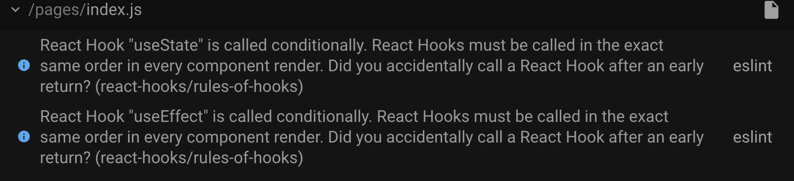
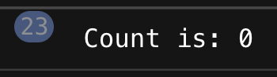
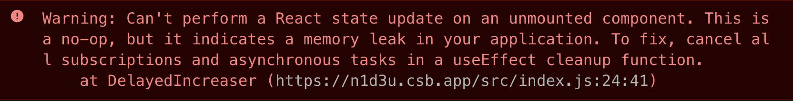
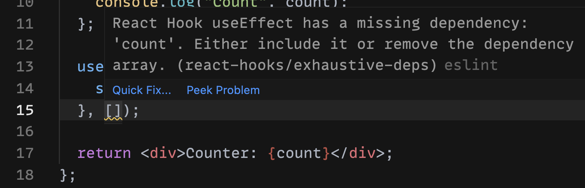

# Hooks注意事项

今天来看看在使用React hooks时的一些坑，以及如何避开这些坑。


**问题概览：**

1. 不要改变 hooks 的调用顺序；
2. 不要使用旧的状态；
3. 不要创建旧的闭包；
4. 不要忘记清理副作用；
5. 不要在不需要重新渲染时使用useState；
6. 不要缺少useEffect依赖。

### 1. 不要改变 hooks 的调用顺序 
下面先来看一个例子：

```javascript
const FetchGame = ({ id }) => {
  if (!id) {
    return '请选择一个游戏';
  }
  
  const [game, setGame] = useState({ 
    name: '',
    description: '' 
  });
  
  useEffect(() => {
    const fetchGame = async () => {
      const response = await fetch(`/api/game/${id}`);
      const fetchedGame = await response.json();
      setGame(fetchedGame);
    };
    fetchGame();
  }, [id]);
  
  return (
    <div>
      <div>Name: {game.name}</div>
      <div>Description: {game.description}</div>
    </div>
  );
}
```

这个组件接收一个参数id，在useEffect中会使用这个id作为参数去请求游戏的信息。并将获取的数据保存在状态变量game中。


当组件执行时，会获取导数据并更新状态。但是这个组件有一个警告：



这里是告诉我们，钩子的执行是不正确的。因为当id为空时，组件会提示，并直接退出。如果id存在，就会调用useState和useEffect这两个hook。这样有条件的执行钩子时就可能会导致意外并且难以调试的错误。实际上，React hooks内部的工作方式要求组件在渲染时，总是以相同的顺序来调用hook。


这也就是React官方文档中所说的：**不要在循环，条件或嵌套函数中调用 Hook， 确保总是在你的 React 函数的最顶层以及任何 return 之前调用他们。**

****

解决这个问题最直接的办法就是按照官方文档所说的，**确保总是在你的 React 函数的最顶层以及任何 return 之前调用他们：**

```javascript
const FetchGame = ({ id }) => {
  const [game, setGame] = useState({ 
    name: '',
    description: '' 
  });
  
  useEffect(() => {
    const fetchGame = async () => {
      const response = await fetch(`/api/game/${id}`);
      const fetchedGame = await response.json();
      setGame(fetchedGame);
    };
    id && fetchGame();
  }, [id]);
  
  if (!id) {
    return '请选择一个游戏';
  }

  return (
    <div>
      <div>Name: {game.name}</div>
      <div>Description: {game.description}</div>
    </div>
  );
}
```

这样，无论传入的id是否为空，useState和useEffect总会以相同的顺序来调用，这样就不会出错啦~


React官方文档中的Hook规则：[《Hook 规则》](https://zh-hans.reactjs.org/docs/hooks-rules.html)，可以使用插件[eslint-plugin-react-hooks](https://www.npmjs.com/package/eslint-plugin-react-hooks)来帮助我们检查这些规则。

### 3. 不要使用旧的状态
先来看一个计数器的例子：

```javascript
const Increaser = () => {
  const [count, setCount] = useState(0);
  
  const increase = useCallback(() => {
    setCount(count + 1);
  }, [count]);
  
  const handleClick = () => {
    increase();
    increase();
    increase();
  };
  
  return (
    <>
      <button onClick={handleClick}>+</button>
      <div>Counter: {count}</div>
    </>
  );
}
```

这里的handleClick方法会在点击按钮后执行三次增加状态变量count的操作。那么点击一次是否会增加3呢？事实并非如此。点击按钮之后，count只会增加1。问题就在于，当我们点击按钮时，相当于下面的操作：

```javascript
const handleClick = () => {
  setCount(count + 1);
  setCount(count + 1);
  setCount(count + 1);
};
```

当第一次调用setCount(count + 1)时是没有问题的，它会将count更新为1。接下来第2、3次调用setCount时，count还是使用了旧的状态（count为0），所以也会计算出count为1。发生这种情况的原因就是状态变量会在下一次渲染才更新。


解决这个问题的办法就是，**使用函数的方式来更新状态：**

```javascript
const Increaser = () => {
  const [count, setCount] = useState(0);
  
  const increase = useCallback(() => {
    setCount(count => count + 1);
  }, [count]);
  
  const handleClick = () => {
    increase();
    increase();
    increase();
  };
  
  return (
    <>
      <button onClick={handleClick}>+</button>
      <div>Counter: {count}</div>
    </>
  );
}
```

这样改完之后，React就能拿到最新的值，当点击按钮时，就会每次增加3。所以需要记住：**如果要使用当前状态来计算下一个状态，就要使用函数的式方式来更新状态：**

```javascript
setValue(prevValue => prevValue + someResult)
```

### 2. 不要创建旧的闭包
众所周知，React Hooks是依赖闭包实现的。当使用接收一个回调作为参数的钩子时，比如：

```css
useEffect(callback, deps)
useCallback(callback, deps)
```

此时，我们就可能会创建一个旧的闭包，该闭包会捕获过时的状态或者prop变量。这么说可能有些抽象，下面来看一个例子，这个例子中，useEffect每2秒会打印一次count的值：

```javascript
const WatchCount = () => {
  const [count, setCount] = useState(0);
  
  useEffect(() => {
    setInterval(function log() {
      console.log(`Count: ${count}`);
    }, 2000);
  }, []);
  
  const handleClick = () => setCount(count => count + 1);
  
  return (
    <>
      <button onClick={handleClick}>+</button>
      <div>Count: {count}</div>
    </>
  );
}

```

最终的输出的结果如下：



可以看到，每次打印的count值都是0，和实际的count值并不一样。为什么会这样呢？


在第一次渲染时应该没啥问题，闭包log会将count打印出0。从第二次开始，每次当点击按钮时，count会增加1，但是setInterval仍然调用的是从初次渲染中捕获的count为0的旧的log闭包。log方法就是一个旧的闭包，因为它捕获的是一个过时的状态变量count。


这里的解决方案就是，当count发生变化时，就重置定时器：

```javascript
const WatchCount = () => {
  const [count, setCount] = useState(0);
  
  useEffect(function() {
    const id = setInterval(function log() {
      console.log(`Count: ${count}`);
    }, 2000);
    return () => clearInterval(id);
  }, [count]);
  
  const handleClick = () => setCount(count => count + 1);
  
  return (
    <>
      <button onClick={handleClick}>+</button>
      <div>Count: {count}</div>
    </>
  );
}
```

这样，当状态变量count发生变化时，就会更新闭包。为了防止闭包捕获到旧值，就要确保在提供给hook的回调中使用的prop或者state都被指定为依赖性。

### 4. 不要忘记清理副作用
有很多副作用，比如fetch请求、setTimeout等都是异步的，如果不需要这些副作用或者组件在卸载时，不要忘记清理这些副作用。下面来看一个计数器的例子：

```javascript
const DelayedIncreaser = () => {
  const [count, setCount] = useState(0);
  const [increase, setShouldIncrease] = useState(false);
  
  useEffect(() => {
    if (increase) {
      setInterval(() => {
        setCount(count => count + 1)
      }, 1000);
    }
  }, [increase]);
  
  return (
    <>
      <button onClick={() => setShouldIncrease(true)}>
        +
      </button>
      <div>Count: {count}</div>
    </>
  );
}

const MyApp = () => {
  const [show, setShow] = useState(true);
  
  return (
    <>
      {show ? <DelayedIncreaser /> : null}
      <button onClick={() => setShow(false)}>卸载</button>
    </>
  );
}
```

这个组件很简单，就是在点击按钮时，状态变量count每秒会增加1。当我们点击+按钮时，它会和我们预期的一样。但是当我们点击“卸载”按钮时，控制台就会出现警告：



修复这个问题只需要使用useEffect来清理定时器即可：

```javascript
useEffect(() => {
    if (increase) {
      const id = setInterval(() => {
        setCount(count => count + 1)
      }, 1000);
      return () => clearInterval(id);
    }
  }, [increase]);
```

当我们编写一些副作用时，我们需要知道这个副作用是否需要清除。

### 5. 不要在不需要重新渲染时使用useState
在React hooks 中，我们可以使用useState hook来进行状态的管理。虽然使用起来比较简单，但是如果使用不恰当，就可能会出现意想不到的问题。来看下面的例子：

```javascript
const Counter = () => {
  const [counter, setCounter] = useState(0);

  const onClickCounter = () => {
    setCounter(counter => counter + 1);
  };

  const onClickCounterRequest = () => {
    apiCall(counter);
  };

  return (
    <div>
      <button onClick={onClickCounter}>Counter</button>
      <button onClick={onClickCounterRequest}>Counter Request</button>
    </div>
  );
}
```

在上面的组件中，有两个按钮，第一个按钮会触发计数器加一，第二个按钮会根据当前的计数器状态发送一个请求。可以看到，状态变量counter并没有在渲染阶段使用。所以，每次点击第一个按钮时，都会有不需要的重新渲染。


因此，当遇到这种需要在组件中使用一个变量在渲染中保持其状态，并且不会触发重新渲染时，那么useRef会是一个更好的选择，下面来对上面的例子使用useRef进行改编：

```javascript
const Counter = () => {
  const counter = useRef(0);

  const onClickCounter = () => {
    counter.current++;
  };

  const onClickCounterRequest = () => {
    apiCall(counter.current);
  };

  return (
    <div>
      <button onClick={onClickCounter}>Counter</button>
      <button onClick={onClickCounterRequest}>Counter Request</button>
    </div>
  );
}
```

### 6. 不要缺少useEffect依赖
useEffect是React Hooks中最常用的Hook之一。默认情况下，它总是在每次重新渲染时运行。但这样就可能会导致不必要的渲染。我们可以通过给useEffect设置依赖数组来避免这些不必要的渲染。


来看下面的例子：

```javascript
const Counter = () => {
  const [count, setCount] = useState(0);

  const showCount = (count) => {
    console.log("Count", count);
  };

  useEffect(() => {
    showCount(count);
  }, []);

  return (
      <div>Counter: {count}</div>
  );
}
```

这个组件可能没有什么实际的意义，只是打印了count的值。这时就会有一个警告：



这里是说，useEffect缺少一个count依赖，这样是不安全的。我们需要包含一个依赖项或者移除依赖数组。否则useEffect中的代码可能会使用旧的值。

```javascript
const Counter = () => {
  const [count, setCount] = useState(0);

  const showCount = (count) => {
    console.log("Count", count);
  };

  useEffect(() => {
    showCount(count);
  }, [count]);

  return (
      <div>Counter: {count}</div>
  );
}
```

如果useEffect中没有用到状态变量count，那么依赖项为空也会是安全的：

```javascript
useEffect(() => {
  showCount(996);
}, []);
```

今天的分享就到这里，如果觉得有用就来个三连吧~


> 更新: 2025-01-15 00:23:00  
> 原文: <https://www.yuque.com/cuggz/feplus/rxeeqm>