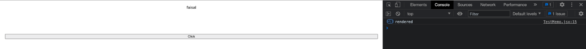

# 开发技巧（2）

## 1. 简化布尔 prop
如果组件的 prop 是一个布尔值，可以直接简写。


**Bad：**

```javascript
return (
  <Navbar showTitle={true} />
);
```

**Good：**

```javascript
return(
  <Navbar showTitle />  
)
```

## 2. 使用三元运算符
如果想要根据角色显示特定用户的详细信息，可以使用三元运算符来简化代码。

****

**Bad：**

```javascript
const { role } = user;

if (role === ADMIN) {
  return <AdminUser />
} else {
  return <NormalUser />
} 
```

**Good：**

```javascript

const { role } = user;

return role === ADMIN ? <AdminUser /> : <NormalUser />
```

## 3. 使用对象字符串
如果想根据角色来显示三种类型的用户，可以使用对象字符串，其有助于提高代码的可读性。


**Bad：**

```javascript
const {role} = user

switch(role){
  case ADMIN:
    return <AdminUser />
  case EMPLOYEE:
    return <EmployeeUser />
  case USER:
    return <NormalUser />
}
```

**Good：**

```javascript
const {role} = user

const components = {
  ADMIN: AdminUser,
  EMPLOYEE: EmployeeUser,
  USER: NormalUser
};

const Component = components[role];

return <Componenent />;
```

## 4. 使用 Fragments
由于 React 只能有一个根节点，所以尽可能使用 Fragment 而不是 div。它可以保持代码的整洁，并且有利于提高性能，因为在虚拟DOM中少创建一个节点。


**Bad：**

```javascript
return (
  <div>
     <Component1 />
     <Component2 />
     <Component3 />
  </div>  
)
```

**Good：**

```javascript
return (
  <>
     <Component1 />
     <Component2 />
     <Component3 />
  </>  
)
```

## 5. 不要在 Render 中定义函数
尽量将 render 中的逻辑减少，不要在 render 中定义函数。


**Bad：**

```javascript
return (
    <button onClick={() => dispatch(ACTION_TO_SEND_DATA)}>
      bad
    </button>  
)
```

**Good：**

```javascript
const submitData = () => dispatch(ACTION_TO_SEND_DATA)

return (
  <button onClick={submitData}>  
    good
  </button>  
)
```

## 6. 使用 Memo
使用 Memo 可以避免不必要的渲染，显著提高应用程序的性能。


**Bad：**

```javascript
import React, { useState } from "react";

export const TestMemo = () => {
  const [userName, setUserName] = useState("faisal");
  const [count, setCount] = useState(0);
  
  const increment = () => setCount((count) => count + 1);
  
  return (
    <>
      <ChildrenComponent userName={userName} />
      <button onClick={increment}> Increment </button>
    </>
  );
};

const ChildrenComponent =({ userName }) => {
  console.log("rendered", userName);
  return <div> {userName} </div>;
};
```

理论上，子组件应该只渲染一次，因为count的值没有在ChildComponent组件使用。但是，它会在每次单击按钮时重新渲染。



****

**Good：**

```javascript
import React ,{useState} from "react";

const ChildrenComponent = React.memo(({userName}) => {
    console.log('rendered')
    return <div> {userName}</div>
})
```

现在，无论点击多少次按钮，它都只会在必要时渲染。

## 7. 使用对象解构
如果想显示用户的详细信息。可以使用对象的解构。


**Bad：**

```javascript
return (
  <>
    <div> {user.name} </div>
    <div> {user.age} </div>
    <div> {user.profession} </div>
  </>  
)
```

**Good：**

```javascript
const { name, age, profession } = user;

return (
  <>
    <div> {name} </div>
    <div> {age} </div>
    <div> {profession} </div>
  </>  
)
```

## 8. 字符串类型的 props 不需要花括号
在将字符串类型的 props 传递给子组件时，不需要使用花括号包裹：


**Bad：**

```javascript
return(
  <Navbar title={"App"} />
)
```

**Good：**

```javascript
return(
  <Navbar title="App" />  
)
```

## 9. 从JSX中删除JS代码
如果JSX不能提供任何渲染或者UI功能，可以将JS代码移出JSX。

****

**Bad：**

```javascript
return (
  <ul>
    {posts.map((post) => (
      <li onClick={event => {
        console.log(event.target, 'clicked!'); // <- THIS IS BAD
        }} key={post.id}>{post.title}
      </li>
    ))}
  </ul>
);
```

**Good：**

```javascript
const onClickHandler = (event) => {
   console.log(event.target, 'clicked!'); 
}

return (
  <ul>
    {posts.map((post) => (
      <li onClick={onClickHandler} key={post.id}> {post.title} </li>
    ))}
  </ul>
);
```

## 10. 使用模板字符串
避免使用字符串拼接，而使用模板字符串来构建长字符串。


**Bad：**

```javascript
const userDetails = user.name + "'s profession is" + user.proffession

return (
  <div> {userDetails} </div>  
)
```

**Good：**

```javascript

const userDetails = `${user.name}'s profession is ${user.proffession}`

return (
  <div> {userDetails} </div>  
)
```

## 11. 按顺序导入
按一定的顺序导入内容，这样可以提高代码的可读性。


**Bad：**

```javascript
import React from 'react';
import ErrorImg from '../../assets/images/error.png';
import styled from 'styled-components/native';
import colors from '../../styles/colors';
import { PropTypes } from 'prop-types';
```

**Good：**

```javascript
import React from 'react';

import { PropTypes } from 'prop-types';
import styled from 'styled-components/native';

import ErrorImg from '../../assets/images/error.png';
import colors from '../../styles/colors';
```

## 12. 箭头函数
假设函数做了一个简单的计算并返回结果，可以简化箭头函数。


**Bad：**

```javascript
const add = (a, b) => {
  return a + b;
}
```

**Good：**

```javascript
const add = (a, b) => a + b;
```

## 13. 组件命名
使用 PascalCase 这种形式来给组件命名。


**Bad：**

```javascript
import reservationCard from './ReservationCard';

const ReservationItem = <ReservationCard />;
```

**Good：**

```javascript
import ReservationCard from './ReservationCard';

const reservationItem = <ReservationCard />;
```

## 14. 保留 Prop 命名
不要使用 DOM 组件的 prop 名称在组件之间传递参数


**Bad：**

```javascript
<MyComponent style="dark" />

<MyComponent className="dark" />
```

**Good：**

```javascript
<MyComponent variant="fancy" />
```

## 15. 引号
对 JSX 属性使用双引号，对其他 JavaScript 代码使用单引号。

****

**Bad：**

```javascript
<Foo bar='bar' />

<Foo style={{ left: "20px" }} />
```

**Good：**

```javascript
<Foo bar="bar" />

<Foo style={{ left: '20px' }} />
```

## 16. Prop 命名
如果 prop 的值是一个 React 组件，则 prop 名称使用 camelCase 或 PascalCase 的形式。


**Bad：**

```javascript
<Component
  UserName="hello"
  phone_number={12345678}
/>
```

**Good：**

```javascript
<MyComponent
  userName="hello"
  phoneNumber={12345678}
  Component={SomeComponent}
/>
```

## 17. 将 JSX 放在括号中
如果组件超过一行，就将其用括号括起来。

****

**Bad：**

```javascript
return <MyComponent variant="long">
         <MyChild />
       </MyComponent>;
```

**Good：**

```javascript
return (
    <MyComponent variant="long">
      <MyChild />
    </MyComponent>
);
```

## 18. 自闭合标签
如果组件没有任何子级，则使用自闭合标签，这样可以提高代码可读性。


**Bad：**

```javascript
<SomeComponent variant="stuff"></SomeComponent>
```

**Good：**

```javascript
<SomeComponent variant="stuff" />
```

## 19. 方法中的下划线
不要在 React 内部的方法中使用下划线。


**Bad：**

```javascript
const _onClickHandler = () => {
  // ...
}
```

**Good：**

```javascript
const onClickHandler = () => {
  // ...
}
```

## 20. Alt 属性
在 img 标签中始终使用 alt 属性。

****

**Bad：**

```javascript

```

**Good：**

```javascript

```


> 更新: 2025-01-15 00:21:38  
> 原文: <https://www.yuque.com/cuggz/feplus/rx71hw>