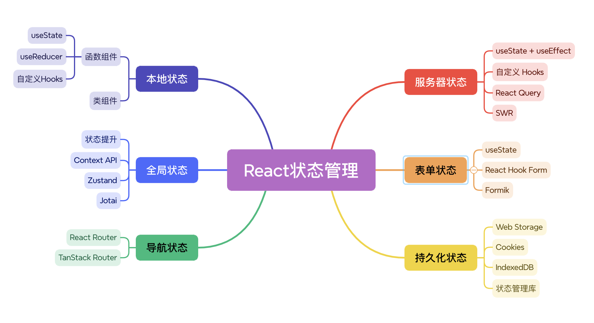
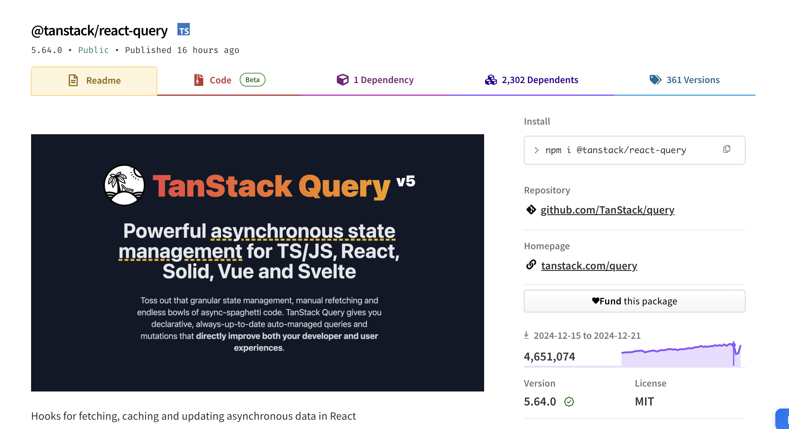
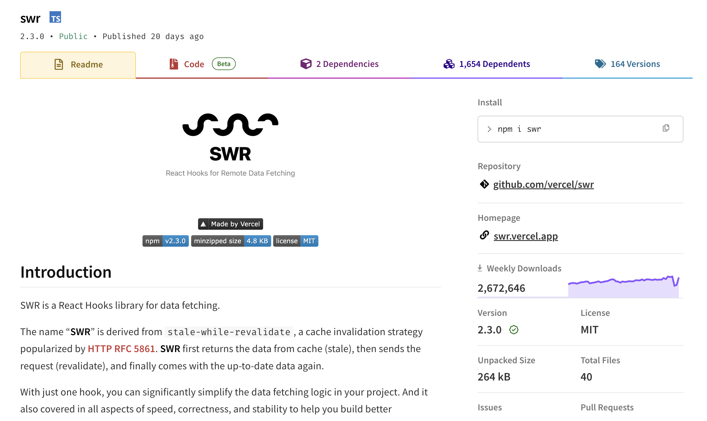

# 状态管理

<font style="color:rgba(0, 0, 0, 0.85);">React 作为当下最受欢迎的前端框架，在构建复杂且交互丰富的应用时，状态管理无疑是至关重要的一环。从简单的本地状态，到能让多个组件协同工作的全局状态，再到涉及服务器通信、导航切换、表单操作以及持久化存储等不同场景下的状态管理，每一个方面都影响着应用的性能、用户体验以及可维护性。本文将作为 React 状态管理的全面指南，带你深入了解这些不同类型状态的管理方式与要点。</font>



## 本地状态

* **<font style="color:rgb(44, 44, 54);">定义：</font>**<font style="color:rgb(44, 44, 54);">在 React 中，本地状态是指组件内部管理的数据，这些数据可以影响组件的渲染输出和行为。本地状态是相对于全局状态而言的，它只存在于单个组件中，用于存储那些不需要在整个应用范围内共享的信息。</font>
* **<font style="color:rgb(44, 44, 54);">特点：</font>**
  * **<font style="color:rgb(44, 44, 54);">私有性</font>**<font style="color:rgb(44, 44, 54);">：本地状态是特定于某个组件的，其他组件无法直接访问或修改它。</font>
  * **<font style="color:rgb(44, 44, 54);">局部性</font>**<font style="color:rgb(44, 44, 54);">：状态的变化只会影响该组件及其子组件，而不会影响到父组件或其他兄弟组件。</font>
  * **<font style="color:rgb(44, 44, 54);">生命周期性</font>**<font style="color:rgb(44, 44, 54);">：随着组件的挂载、更新和卸载，本地状态也会经历相应的生命周期阶段。</font>

### 函数组件

#### useState

<font style="color:rgb(44, 44, 54);">从 React 16.8 开始引入了 Hooks API，使得函数组件也可以拥有状态。</font><code><font style="color:rgb(44, 44, 54);">useState</font></code><font style="color:rgb(44, 44, 54);"> 是最常用的 Hook 之一，用来声明和管理组件的状态。</font>

* **返回值**：调用 `useState` 时，返回一个包含两个元素的数组。第一个元素是当前的状态值，可以在组件中直接使用来渲染 UI 等；第二个元素是一个函数，用于更新该状态值，调用这个函数并传入新的值后，React 会重新渲染组件，使 UI 根据新的状态进行更新。

```javascript
import React, { useState } from 'react';

function Counter() {
  const [count, setCount] = useState(0);

  return (
    <div>
      <p>当前计数: {count}</p>
      <button onClick={() => setCount(count + 1)}>
        Click me
      </button>
    </div>
  );
}
```

#### useReducer

<font style="color:rgb(44, 44, 54);">对于那些涉及复杂状态逻辑或状态更新依赖于前一状态的情况，</font><code><font style="color:rgb(44, 44, 54);">useReducer</font></code><font style="color:rgb(44, 44, 54);"> 可能是一个更好的选择。它类似于 Redux 的 reducer 函数，但只作用于单个组件内部。</font>

* **reducer 函数**：它是整个状态管理的核心逻辑部分，根据传入的不同 `action` 类型，按照预先定义好的规则来计算并返回新的状态，就像一个状态处理的 “加工厂”，规范了状态更新的流程。
* **dispatch 函数**：通过调用 `dispatch` 并传入相应的 `action` 对象，可以触发 `reducer` 函数执行，从而实现状态的更新。这使得状态更新的操作更加可预测、可维护，尤其是在复杂的状态变化场景中优势明显。

```javascript
import React, { useReducer } from 'react';

const initialState = { count: 0 };

function reducer(state, action) {
  switch (action.type) {
    case 'increment':
      return { count: state.count + 1 };
    case 'decrement':
      return { count: state.count - 1 };
    default:
      throw new Error();
  }
}

function Counter() {
  const [state, dispatch] = useReducer(reducer, initialState);

  return (
    <div>
      <p>Count: {state.count}</p>
      <button onClick={() => dispatch({ type: 'increment' })}>+</button>
      <button onClick={() => dispatch({ type: 'decrement' })}>-</button>
    </div>
  );
}
```

#### 自定义Hooks

<font style="color:rgb(44, 44, 54);">可以创建自定义 Hook 来封装特定的状态逻辑，并且可以在多个组件之间共享这些逻辑。这不仅提高了代码的复用性，还使得状态管理更加模块化。</font>

```javascript
import { useState, useEffect } from 'react';
import axios from 'axios';

const useFetchData = (url, params) => {
  const [data, setData] = useState(null);
  const [isLoading, setIsLoading] = useState(true);
  const [error, setError] = useState(null);

  useEffect(() => {
    const fetchData = async () => {
      try {
        const response = await axios.get(url, { params });
        setData(response.data);
      } catch (err) {
        setError(err.message);
      } finally {
        setIsLoading(false);
      }
    };

    fetchData();
  }, [url, params]); // 依赖项包括 URL 和参数，以便在它们变化时重新获取数据

  return { data, isLoading, error };
};

export default useFetchData;
```

### 类组件

<font style="color:rgb(44, 44, 54);">在 Hooks 出现之前，React 类组件通过定义 </font><code><font style="color:rgb(44, 44, 54);">state</font></code><font style="color:rgb(44, 44, 54);"> 对象并在构造函数中初始化它来管理状态。</font>

```javascript
class Counter extends React.Component {
  constructor(props) {
    super(props);
    this.state = { count: 0 };
  }

  increment = () => {
    this.setState((prevState) => ({ count: prevState.count + 1 }));
  };

  render() {
    return (
      <div>
        <p>当前计数: {this.state.count}</p>
        <button onClick={this.increment}>
          Click me
        </button>
      </div>
    );
  }
}
```

**注意事项：**

* **初始化**：通常在类组件的构造函数 `constructor` 中通过给 `this.state` 赋值来初始化本地状态，设定初始的状态值。
* **更新状态**：使用 `this.setState` 方法来更新状态，它有两种常见的使用形式。一种是直接传入一个包含新状态值的对象，如 `this.setState({ count: 10 })`；另一种是传入一个函数，函数接收前一个状态 `prevState` 作为参数，返回新的状态对象，这种方式在基于前一状态进行计算来更新状态时非常有用，能避免一些由于异步操作等带来的状态更新问题。

## 全局状态

* \*\*定义：\*\*在 React 中，全局状态是指那些在整个应用中多个组件之间需要共享和访问的状态。与本地状态不同，全局状态不局限于单个组件，而是可以在应用的不同部分之间传递、更新和同步。
* **<font style="color:rgb(44, 44, 54);">重要性：</font>**<font style="color:rgb(44, 44, 54);">当应用变得越来越大，组件之间的嵌套层次越来越深时，使用 props 逐层传递状态（即“props drilling”）会变得非常麻烦且难以维护。全局状态管理工具可以帮助解决这个问题，它们提供了一种集中管理和共享状态的方式，减少了冗余代码，并提高了开发效率。</font>
* **<font style="color:rgb(44, 44, 54);">使用选择：</font>**
  * **<font style="color:rgb(44, 44, 54);">状态提升：</font>**<font style="color:rgb(44, 44, 54);">当需要在兄弟组件中共享状态时，可以将状态提升到父组件。</font>
  * **<font style="color:rgb(44, 44, 54);">Context API</font>**<font style="color:rgb(44, 44, 54);">：适合简单的全局状态管理，尤其是当需要避免 props drilling 时。</font>
  * **<font style="color:rgb(44, 44, 54);">Zustand</font>**<font style="color:rgb(44, 44, 54);">：一个轻量级的选择，适合小型到中型应用，特别是那些注重性能和易用性的项目。</font>
  * **<font style="color:rgb(44, 44, 54);">Jotai</font>**<font style="color:rgb(44, 44, 54);">：为更细粒度的状态管理提供了可能性，非常适合那些寻求模块化和高效状态管理的开发者。</font>

### 状态提升

* **<font style="color:rgb(44, 44, 54);">定义：</font>**<font style="color:rgb(44, 44, 54);">状态提升是 React 中一种常见的模式，用于将需要在多个组件之间共享的状态移动到它们的最近公共父组件中进行管理。这种方法虽不是全局状态管理的一部分，但它提供了一种方式来集中管理跨多个兄弟组件的状态。</font>
* **<font style="color:rgb(44, 44, 54);">原理：</font>**<font style="color:rgb(44, 44, 54);">当两个或更多的子组件需要访问相同的数据时，可以将该数据及其相关的更新逻辑“提升”到这些子组件的共同祖先组件中。然后，通过 props 将数据和处理函数传递给需要它的子组件。</font>
* **<font style="color:rgb(44, 44, 54);">注意事项：</font>**
  * **状态更新的流向**：状态更新总是从父组件开始，父组件更新状态后，将新的状态作为 `props` 传递给子组件，触发子组件的重新渲染。
  * **避免过度提升**：不要将所有状态都盲目提升，只提升多个组件需要共享的状态，以保持组件的简洁和清晰。

### Context API

* \*\*定义：\*\*React 的 Context API 允许创建一个可以在组件树中传递数据的上下文，使得不同层次的组件可以访问这些数据，而无需通过 props 一层层传递。<font style="color:rgb(44, 44, 54);">虽然 Context API 本身并不直接提供状态管理功能，但它可以与 Hooks（如 </font><code><font style="color:rgb(44, 44, 54);">useState</font></code><font style="color:rgb(44, 44, 54);">）结合使用来实现简单的全局状态管理。</font>
* **<font style="color:rgb(44, 44, 54);">基本使用：</font>**
  * \*\*提供者：\*\*在 React 19 之前，可以使用 <code><font style="color:rgb(0, 0, 0);">MyContext.Provider</font></code><font style="color:rgb(0, 0, 0);">的形式来提供共享状态。React 19 中，可以直接使用 </font><code><font style="color:rgb(0, 0, 0);">MyContext</font></code><font style="color:rgb(0, 0, 0);">的形式，省略掉了</font><code><font style="color:rgb(0, 0, 0);">.Provider</font></code><font style="color:rgb(0, 0, 0);">。</font>

```javascript
import React, { useState, createContext } from 'react';
const MyContext = createContext();

function App() {
    const [globalState, setGlobalState] = useState({ count: 0 });

    return (
        <MyContext.Provider value={{ globalState, setGlobalState }}>
            <ComponentA />
            <ComponentB />
        </MyContext.Provider>
    );
}
```

```
- **消费者：**<font style="color:rgba(0, 0, 0, 0.85);">在子组件中可以使用 </font>`useContext`<font style="color:rgba(0, 0, 0, 0.85);"> 来获取 </font>`MyContext`<font style="color:rgba(0, 0, 0, 0.85);"> 提供的数据，实现对全局状态的访问和修改。</font>
```

```javascript
import React, { useContext } from 'react';
import MyContext from './MyContext';

function ComponentA() {
    const { globalState, setGlobalState } = useContext(MyContext);

    const increment = () => {
        setGlobalState(prevState => ({...prevState, count: prevState.count + 1 }));
    };

    return (
        <div>
            <p>Count: {globalState.count}</p>
            <button onClick={increment}>Increment</button>
        </div>
    );
}
```

### Zustand

* **<font style="color:rgb(44, 44, 54);">定义：</font>**<font style="color:rgb(44, 44, 54);">Zustand 是一个轻量级且易于使用的状态管理库，专门为 React 应用设计。它的名字来源于德语单词 "zustand"，意为“状态”。Zustand 的设计理念是提供一种简单、直观的方式来管理全局状态，同时保持高性能和小体积。</font>
* **特点：**
  * **简洁性**<font style="color:rgb(44, 44, 54);">：Zustand 的设计理念是保持极简主义，通过简单的 API 和最小化的配置来实现高效的状态管理。</font>
  * **基于 Hooks**<font style="color:rgb(44, 44, 54);">：它完全依赖于 React 的 Hooks 机制，允许开发者以声明式的方式订阅状态变化并触发更新。</font>
  * **无特定立场**<font style="color:rgb(44, 44, 54);">：Zustand 不强制任何特定的设计模式或结构，给予开发者最大的灵活性。</font>
  * **单一数据源**<font style="color:rgb(44, 44, 54);">：尽管 Zustand 支持多个独立的 store，但每个 store 内部仍然遵循单一数据源的原则，即所有状态都集中存储在一个地方。</font>
  * **模块化状态切片**<font style="color:rgb(44, 44, 54);">：状态可以被分割成不同的切片（slices），每个切片负责一部分应用逻辑，便于管理和维护。</font>
  * **异步支持**<font style="color:rgb(44, 44, 54);">：Zustand 可以轻松处理异步操作，允许在 store 中定义异步函数来执行如 API 请求等任务。</font>
* **<font style="color:rgb(44, 44, 54);">基本使用：</font>**
  1. **创建 Store**<font style="color:rgb(44, 44, 54);">：</font><font style="color:rgb(44, 44, 54);">在 Zustand 中，Store是通过</font><code><font style="color:rgb(44, 44, 54);">create</font></code><font style="color:rgb(44, 44, 54);">函数创建的。每个Store都包含状态和处理状态的函数。</font>

```typescript
import { create } from 'zustand';

const useStore = create((set) => ({
  count: 0, // 初始状态
  increment: () => set((state) => ({ count: state.count + 1 })), // 增加count的函数
  decrement: () => set((state) => ({ count: state.count - 1 })), // 减少count的函数
}));
```

<font style="color:rgb(44, 44, 54);">其中， </font><code><font style="color:rgb(44, 44, 54);">create</font></code><font style="color:rgb(44, 44, 54);">函数接受一个回调函数，该回调函数接受一个</font><code><font style="color:rgb(44, 44, 54);">set</font></code><font style="color:rgb(44, 44, 54);">函数作为参数，用于更新状态。在这个回调函数中，定义了一个</font><code><font style="color:rgb(44, 44, 54);">count</font></code><font style="color:rgb(44, 44, 54);">状态和两个更新函数</font><code><font style="color:rgb(44, 44, 54);">increment</font></code><font style="color:rgb(44, 44, 54);">和</font><code><font style="color:rgb(44, 44, 54);">decrement</font></code><font style="color:rgb(44, 44, 54);">。</font>

```
2. **使用 Store**<font style="color:rgb(44, 44, 54);">：</font><font style="color:rgb(44, 44, 54);">在组件中，可以使用自定义的 Hooks（上面的</font>`<font style="color:rgb(44, 44, 54);">useStore</font>`<font style="color:rgb(44, 44, 54);">）来获取状态和更新函数，并在组件中使用它们。</font>
```

```typescript
import React from 'react';
import { useStore } from './store';

function Counter() {
  const { count, increment, decrement } = useStore();
  
  return (
    <div>
      <p>Count: {count}</p>
      <button onClick={increment}>Increment</button>
      <button onClick={decrement}>Decrement</button>
    </div>
  );
}
```

```
3. <font style="color:rgb(44, 44, 54);">订阅特定状态片段</font><font style="color:rgb(44, 44, 54);">如果有一个包含多个状态的store，但在组件中只需要订阅其中一个状态，可以通过解构赋值从</font>`<font style="color:rgb(44, 44, 54);">useStore</font>`<font style="color:rgb(44, 44, 54);">返回的完整状态对象中提取需要的状态。Zustand的智能选择器功能允许这样做，而不会导致不必要的重新渲染。</font>
```

```typescript
// store.js
import { create } from 'zustand';
 
const useStore = create((set) => ({
  count: 0,
  name: 'Zustand Store',
  increment: () => set((state) => ({ count: state.count + 1 })),
  setName: (newName) => set({ name: newName }),
}));
 
export default useStore;
```

<font style="color:rgb(44, 44, 54);">在组件中，如果只想订阅</font><code><font style="color:rgb(44, 44, 54);">count</font></code><font style="color:rgb(44, 44, 54);">状态，可以这样做：</font>

```typescript
// MyComponent.js
import React from 'react';
import useStore from './store';

function MyComponent() {
  const { count } = useStore((state) => ({ count: state.count }));

  return (
    <div>
      <p>Count: {count}</p>
    </div>
  );
}

export default MyComponent;
```

### Jotai

* \*\*定义：\*\*Jotai 是一个轻量级且灵活的 React 状态管理库，采用原子化状态管理模型。它受到了 Recoil 的启发，旨在提供一种简单而直观的方式来管理 React 中的状态。
* **核心思想：**
  * **原子化状态管理**：Jotai 使用原子作为状态的基本单位。每个原子代表一个独立的状态片段，可以被多个组件共享和访问。
  * **组合性**：通过组合 atoms 和选择器，可以构建复杂的、依赖于其他状态的状态逻辑。这种组合性使得状态管理更加模块化和灵活。
  * **细粒度依赖跟踪**：Jotai 内置了高效的依赖跟踪机制，只有当组件实际依赖的状态发生变化时才会触发重新渲染。
* **基本使用：**
  1. **<font style="color:rgb(44, 44, 54);">创建 Atom</font>**<font style="color:rgb(44, 44, 54);">：</font>
     * **<font style="color:rgb(44, 44, 54);">简单原子创建</font>**<font style="color:rgb(44, 44, 54);">：定义一个 atom 来表示应用中的某个状态片段。</font>

```javascript
import { atom } from 'jotai';

export const countAtom = atom(0);
```

```
    * **派生原子创建（****基于已有原子进行计算等）**
```

```javascript
import { atom } from 'jotai';
import { countAtom } from './atoms';

export const doubleCountAtom = atom((get) => get(countAtom) * 2);
```

```
2. **<font style="color:rgb(44, 44, 54);">使用 Atom</font>**<font style="color:rgb(44, 44, 54);">：</font>
    * 使用 `useAtom` Hook 获取和更新原子状态（适用于读写原子状态场景）：
```

```javascript
import React from 'react';
import { useAtom } from 'jotai';
import { countAtom } from './atoms';

const Counter = () => {
  const [count, setCount] = useAtom(countAtom);

  return (
    <div>
      <p>Count: {count}</p>
      <button onClick={() => setCount((prev) => prev + 1)}>Increment</button>
      <button onClick={() => setCount((prev) => prev - 1)}>Decrement</button>
    </div>
  );
};

export default Counter;
```

```
    * 使用 `useAtomValue` Hook 仅获取原子状态（适用于只读场景）：
```

```javascript
import React from 'react';
import { useAtomValue } from 'jotai';
import { doubleCountAtom } from './derivedAtoms';

const DoubleCounter = () => {
  const doubleCount = useAtomValue(doubleCountAtom);

  return <p>Double Count: {doubleCount}</p>;
};

export default DoubleCounter;
```

```
    * 使用 `useSetAtom` Hook 仅获取更新原子状态的函数（适用于只写场景）：
```

```javascript
import React from 'react';
import { useAtomValue } from 'jotai';
import { countAtom } from './derivedAtoms';

const IncrementButtonComponent = () => {
    const setCount = useSetAtom(countAtom);
    return (
        <button onClick={() => setCount((prevCount) => prevCount + 1)}>Increment</button>
    );
};
```

## 服务器状态

* \*\*定义：\*\*服务器状态指的是应用与服务端交互相关的状态，包括从服务器获取的数据（如 API 响应）以及请求的状态（如加载中、完成、失败等）。
* **<font style="color:rgb(44, 44, 54);">重要性：</font>**
  * **<font style="color:rgb(44, 44, 54);">数据一致性</font>**<font style="color:rgb(44, 44, 54);">：确保前端展示的数据是最新的，并且与服务器上的数据一致。</font>
  * **<font style="color:rgb(44, 44, 54);">用户体验</font>**<font style="color:rgb(44, 44, 54);">：提供即时反馈，比如加载指示器、错误消息等，以改善用户的交互体验。</font>
  * **<font style="color:rgb(44, 44, 54);">缓存策略</font>**<font style="color:rgb(44, 44, 54);">：合理地使用缓存可以减少不必要的网络请求，提高性能并节省带宽。</font>
  * **<font style="color:rgb(44, 44, 54);">错误处理</font>**<font style="color:rgb(44, 44, 54);">：优雅地处理网络故障或其他异常情况，保证应用的稳定性和可靠性。</font>
* **使用选择：**
  * **<font style="color:rgb(44, 44, 54);">useState + useEffect</font>**<font style="color:rgb(44, 44, 54);">：当只需要从服务器加载一次数据，并且不需要复杂的缓存或重试机制时使用。</font>
  * **<font style="color:rgb(44, 44, 54);">自定义 Hooks：</font>**<font style="color:rgb(44, 44, 54);">当多个组件中有相似的数据获取模式，可以将这部分逻辑提取成一个自定义 Hook 来减少重复代码。</font>
  * **<font style="color:rgb(44, 44, 54);">React Query</font>**<font style="color:rgb(44, 44, 54);">：一个强大的工具，特别适用于需要全面数据获取功能的大型应用。</font>
  * **<font style="color:rgb(44, 44, 54);">SWR</font>**<font style="color:rgb(44, 44, 54);">：以其简洁性和对实时性的支持而闻名，是那些追求快速集成和良好用户体验的应用的理想选择。</font>

### useState + useEffect

在 React 中，管理服务器状态的最常见模式是结合使用`useState`和`useEffect` Hook。

* `useState`：用于定义组件内的状态变量。这些状态可以保存从服务器获取的数据、加载标志（例如`isLoading`），以及可能发生的错误信息。
* `useEffect`：用来处理副作用，比如发起网络请求。它可以在组件挂载或状态变化时执行特定的操作。在网络请求开始前，将`isLoading`设为`true`，表明正在加载数据。当接收到服务器响应后，依据响应内容更新相关状态变量，并将`isLoading`设为`false`。如果请求过程中发生错误，还可以设置一个错误状态变量来存储错误信息。

```javascript
import React, { useState, useEffect } from 'react';

function APP() {
  // data保存服务器返回的数据，loading表示是否正在加载，error保存可能发生的错误信息。
  const [data, setData] = useState(null);
  const [loading, setLoading] = useState(true);
  const [error, setError] = useState(null);

  const fetchData = async () => {
    try {
      const response = await fetch('https://api.example.com/data');
      if (!response.ok) {
        throw new Error('Network response was not ok');
      }
      const result = await response.json();
      setData(result); // 更新数据状态
    } catch (err) {
      setError(err.message); // 设置错误信息
    } finally {
      setLoading(false); // 请求完成后关闭加载状态
    }
  }

  useEffect(() => {
    fetchData();
  }, []);

  if (loading) return <p>Loading...</p>;
  if (error) return <p>Error: {error}</p>;

  return (
      <ul>
        {data.map(item => (
          <li key={item.id}>{item.name}</li>
        ))}
      </ul>
    </div>
  );
}

export default DataFetcher;
```

这种方式存在问题：

* \*\*代码冗余：\*\*在多个组件中重复编写用于获取不同服务器数据的 `useState` 和 `useEffect` 代码，不仅增加了开发成本，还使得代码结构变得复杂，难以维护和扩展。这种冗余可以通过创建自定义 Hook 或采用更高级的状态管理解决方案来有效缓解。
* \*\*状态一致性：\*\*当多个组件依赖于相同的服务器数据时，很难保证它们之间的状态一致性。例如，如果一个组件更新了数据，另一个组件可能不会立即感知到，需要手动实现状态同步的逻辑，可能会导致不同组件显示的数据不一致。
* \*\*缺乏高级特性：\*\*基础的状态管理方式缺乏一些高级特性，如自动缓存、自动数据重新获取以及乐观更新等。对于复杂的数据更新场景，如部分更新或失效数据的重新获取，开发者需要手动编写大量的额外代码来实现这些功能。
* \*\*性能问题：\*\*由于缺乏内置的缓存机制，对于频繁请求的数据，每次组件重新渲染时都可能触发新的请求，从而增加性能开销。此外，依赖相同数据的多个组件无法共享数据缓存，导致网络资源的浪费和不必要的请求开销。
* **复杂的错误处理**：在处理不同类型的错误（如网络错误、服务器端错误、权限错误等）时，开发者需要进行手动区分和处理，这增加了错误处理的复杂性。同时，实现自动重试机制或提供用户友好的错误提示也需要额外的复杂逻辑和代码编写。

### 自定义 Hooks

为了优化 `useState` 和 `useEffect` 组合使用时所遇到的问题，可以使用自定义 Hook 来封装常见的服务器请求操作。这里将以 ahooks 提供的的 `useRequest` 为例。

> aHooks 是一个由蚂蚁金服开发的 React Hooks 库，它提供了一系列实用的自定义Hooks来简化常见的开发任务。

`useRequest` 的特性如下：

* 自动请求/手动请求
* SWR(stale-while-revalidate)
* 缓存/预加载
* 屏幕聚焦重新请求
* 轮询
* 防抖
* 节流
* 并行请求
* 依赖请求
* loading delay
* 分页
* 加载更多，数据恢复 + 滚动位置恢复

```javascript
import { useRequest } from 'ahooks';
import React from 'react';
import Mock from 'mockjs';

function getUsername(): Promise<string> {
  return new Promise((resolve) => {
    setTimeout(() => {
      resolve(Mock.mock('@name'));
    }, 1000);
  });
}

export default () => {
  const { data, loading, run, cancel } = useRequest(getUsername, {
    pollingInterval: 1000,
    pollingWhenHidden: false,
  });

  return (
    <>
      <p>Username: {loading ? 'loading' : data}</p>
      <button type="button" onClick={run}>
        start
      </button>
      <button type="button" onClick={cancel} style={{ marginLeft: 8 }}>
        stop
      </button>
    </>
  );
};
```

当然，我们也可以根据需求来完全自定义 Hooks。

### React Query

React Query（现称为 TanStack Query）是一个专为React应用设计的数据获取、缓存和状态管理库。它通过简化常见的数据操作任务，如发起HTTP请求、处理加载状态、错误处理等，极大地提升了开发效率和用户体验。



React Query 的功能如下：

* **简化数据获取**：可以使用 `useQuery` Hook 可以轻松发起网络请求，自动处理加载状态、错误处理，并返回响应数据。支持多种类型的请求，包括RESTful API 和 GraphQL。
* **内置缓存机制**：自动管理和优化缓存，减少不必要的网络请求。提供 `cacheTime` 和 `staleTime` 配置项来控制缓存的有效期和数据的新鲜度。
* **自动重新获取数据**：支持在特定情况下自动刷新数据，如窗口重新聚焦 (`refetchOnWindowFocus`) 或者网络连接恢复 (`refetchOnReconnect`)。有助于确保用户始终看到最新的数据，特别是在长时间离开页面后再返回时。
* **并发模式支持**：确保在网络请求未完成时安全地卸载组件，避免内存泄漏和其他潜在问题。
* **乐观更新与突变管理**：通过 `useMutation` Hook 支持创建、更新或删除资源的操作。实现乐观更新，即先显示预期的结果，如果请求失败则回滚到原始状态。
* **无限滚动与分页**：使用 `useInfiniteQuery` Hook 来实现无限滚动功能，简化分页逻辑的管理。
* **开发工具**：提供 `ReactQueryDevtools` 开发工具，帮助开发者清晰地观察每个请求的状态及其相关缓存信息。
* **手动触发请求**：允许通过 `manual` 选项将请求设置为手动触发，配合 `run` 方法按需发起请求。
* **全局配置**：可以通过 `QueryClient` 进行全局配置，如设置默认的缓存时间、重试策略等。

```javascript
import {
  useQuery,
  useMutation,
  useQueryClient,
  QueryClient,
  QueryClientProvider,
} from '@tanstack/react-query'
import { getTodos, postTodo } from '../my-api'

const queryClient = new QueryClient()

function App() {
  return (
    <QueryClientProvider client={queryClient}>
      <Todos />
    </QueryClientProvider>
  )
}

function Todos() {
  const queryClient = useQueryClient()

  const query = useQuery({ queryKey: ['todos'], queryFn: getTodos })

  const mutation = useMutation({
    mutationFn: postTodo,
    onSuccess: () => {
      queryClient.invalidateQueries({ queryKey: ['todos'] })
    },
  })

  return (
    <div>
      <ul>{query.data?.map((todo) => <li key={todo.id}>{todo.title}</li>)}</ul>

      <button
        onClick={() => {
          mutation.mutate({
            id: Date.now(),
            title: 'Do Laundry',
          })
        }}
      >
        Add Todo
      </button>
    </div>
  )
}

render(<App />, document.getElementById('root'))
```

### SWR

<font style="color:rgb(44, 44, 54);">SWR 是 "stale-while-revalidate" 的缩写，它是一个用于数据获取和缓存的React Hooks库，由 Vercel 开发。SWR 专为构建快速响应的用户界面而设计，它的工作原理是先返回缓存的数据，然后在后台发起请求获取最新的数据，并在收到新数据后更新UI。这种模式可以提供即时的用户体验，同时确保数据保持最新。</font>



<font style="color:rgb(44, 44, 54);">SWR 的特性如下：</font>

* **<font style="color:rgb(44, 44, 54);">即时响应</font>**<font style="color:rgb(44, 44, 54);">：当组件首次渲染时，SWR 会立即返回缓存中的旧数据（如果有）。这使得用户界面能够瞬间加载，无需等待网络请求完成。</font>
* **<font style="color:rgb(44, 44, 54);">自动重验证</font>**<font style="color:rgb(44, 44, 54);">：一旦从缓存中读取了数据，SWR 就会在后台发起请求以获取最新数据。这个过程对用户来说是透明的，只有当新数据到达时才会更新UI。</font>
* **<font style="color:rgb(44, 44, 54);">简单的API</font>**<font style="color:rgb(44, 44, 54);">：SWR 提供了一个非常直观的 </font><code><font style="color:rgb(44, 44, 54);">useSWR</font></code><font style="color:rgb(44, 44, 54);"> Hook 来简化数据获取逻辑，包括处理加载状态、错误和成功情况。</font>
* **<font style="color:rgb(44, 44, 54);">支持多种数据源</font>**<font style="color:rgb(44, 44, 54);">：虽然 SWR 最常用于HTTP请求，但它也可以与其他类型的数据源一起工作，比如 WebSocket 或者本地存储。</font>
* **<font style="color:rgb(44, 44, 54);">优化性能</font>**<font style="color:rgb(44, 44, 54);">：SWR 内置了一些性能优化特性，如并发模式支持、自动垃圾回收和去抖动/节流功能，帮助减少不必要的请求。</font>
* **<font style="color:rgb(44, 44, 54);">开发工具集成</font>**<font style="color:rgb(44, 44, 54);">：与 React Query 类似，SWR 也提供了开发者工具来监控和调试数据获取行为。</font>
* **<font style="color:rgb(44, 44, 54);">灵活配置</font>**<font style="color:rgb(44, 44, 54);">：可以通过配置选项自定义刷新策略、重试机制等，以适应不同的应用场景需求。</font>
* **<font style="color:rgb(44, 44, 54);">服务端渲染（SSR）兼容</font>**<font style="color:rgb(44, 44, 54);">：SWR 支持服务器端渲染，可以在页面初次加载时预先填充缓存，从而加快客户端的首次渲染速度。</font>

```javascript
import React, { useState } from 'react';
import useSWR from 'swr';
import axios from 'axios';

// 自定义的 fetcher 函数，使用 axios
const fetcher = (url) => axios.get(url).then((res) => res.data);

// 自定义的 SWR 配置选项
const swrConfig = {
    // 重试次数
    retry: 3,
    // 缓存时间（毫秒）
    revalidateOnFocus: false,
    shouldRetryOnError: false,
};

function BlogPosts() {
    const [page, setPage] = useState(1);
    const perPage = 10;

    // 构建 API URL，包含分页参数
    const apiUrl = `https://api.example.com/posts?page=${page}&perPage=${perPage}`;

    // 使用 SWR 获取文章数据
    const { data: posts, error, isValidating } = useSWR(apiUrl, fetcher, swrConfig);

    // 数据转换：按日期排序
    const sortedPosts = posts?.sort((a, b) => new Date(b.date) - new Date(a.date)) || [];

    if (error) return <div>加载出错: {error.message}</div>;
    if (!posts) return <div>正在加载... {isValidating && '重新验证...'}</div>;

    return (
        <div>
            <h1>博客文章</h1>
            <ul>
                {sortedPosts.map((post) => (
                    <li key={post.id}>
                        <h2>{post.title}</h2>
                        <p>{post.content}</p>
                        <small>发布于: {new Date(post.date).toLocaleDateString()}</small>
                    </li>
                ))}
            </ul>
            <button onClick={() => setPage(page - 1)} disabled={page === 1}>
                上一页
            </button>
            <button onClick={() => setPage(page + 1)}>
                下一页
            </button>
        </div>
    );
}

export default BlogPosts;
```

## 导航状态

* **<font style="color:rgb(44, 44, 54);">定义：</font>**<font style="color:rgb(44, 44, 54);">React 导航状态是指与应用内部页面或视图之间的导航相关的状态。它包括但不限于当前路由信息、历史记录栈、参数传递以及可能的其他元数据。当进行路由导航时，有时需要将前一个页面的状态带到新页面，以确保用户体验的一致性和连续性。通常，在 React 项目中会借助 React Router、TanStack Router 等路由库来实现状态管理。</font>

### React Router

* \*\*定义：\*\*React Router 是 React 应用中最常用的路由库，提供了丰富的路由功能，支持路由匹配、嵌套路由、路由参数提取、动态路由、重定向等。可以方便地与 React 应用集成，实现页面之间的导航和导航状态的管理。
* **使用：**在 React Router 中，可以通过**路径参数、查询参数、状态对象**来实现状态管理。
  * **路径参数：**<font style="color:rgb(5, 7, 59);">路径参数通常用于在 URL 路径中传递信息。</font>
    * `Link`：创建一个导航链接，`to="/product/123"` 表示点击该链接会跳转到 `/product/123` 路径。
    * `Route`：定义路由规则，`path="/product/:productId"` 是一个包含路径参数的路由，`productId` 是参数名称。
    * `useParams`：在 `ProductDetail` 组件中，通过 `useParams` 钩子函数可以获取到当前匹配路由的路径参数。在这个例子中，它将从 URL 中提取 `productId` 并显示在页面上。

```javascript
// 定义路由
import { BrowserRouter as Router, Route, Routes } from 'react-router-dom';
import UserDetail from './UserDetail';

function App() {
  return (
    <Router>
      <Routes>
        <Route path="/users/:userId" element={<UserDetail />} />
      </Routes>
    </Router>
  );
}

export default App;
```

```javascript
// 路由跳转
<Link to="/users/123">用户中心</Link>
```

```javascript
// 使用参数
import { useParams } from 'react-router-dom';

function UserDetail() {
  const { userId } = useParams();

  return (
    <div>
      <h1>User Detail</h1>
      <p>User ID: {userId}</p>
    </div>
  );
}

export default UserDetail;
```

```
- **查询****<font style="color:rgb(44, 44, 54);">字符串</font>****：**<font style="color:rgb(5, 7, 59);">查询</font><font style="color:rgb(44, 44, 54);">字符串</font><font style="color:rgb(5, 7, 59);">通常用于在 URL 查询字符串中传递信息。</font>
    * `useLocation`：通过 `useLocation` 获取当前页面的位置信息，包括查询参数。
    * `new URLSearchParams(location.search)`：将 `location.search` 部分（以 `?` 开始的查询字符串）解析为一个 `URLSearchParams` 对象。
    * `queryParams.get('keyword')` 和 `queryParams.get('category')`：通过 `get` 方法从 `URLSearchParams` 对象中获取相应的查询参数。
```

```javascript
// 定义路由
import { BrowserRouter as Router, Route, Routes } from 'react-router-dom';
import SearchResults from './SearchResults';

function App() {
  return (
    <Router>
      <Routes>
        <Route path="/search" element={<SearchResults />} />
      </Routes>
    </Router>
  );
}

export default App;
```

```javascript
// 路由跳转
<Link to="/search?keyword=phone">搜索</Link>
```

```javascript
// 使用参数
import { useLocation } from 'react-router-dom';

function SearchResults() {
  const location = useLocation();
   const queryParams = new URLSearchParams(location.search);

  return (
    <div>
      <h1>搜索结果</h1>
      <p>关键词: {queryParams.get('keyword') || 'None'}</p>
    </div>
  );
}

export default SearchResults;
```

```
- **状态传递：**<font style="color:rgb(5, 7, 59);">状态对象通常用于在导航时传递复杂的状态信息。</font>
    * `<font style="color:rgb(44, 44, 54);">useNavigate</font>`<font style="color:rgb(44, 44, 54);"> 支持传递额外的状态对象给目标页面。这些状态不会出现在 URL 中，但在目标页面可以通过 </font>`<font style="color:rgb(44, 44, 54);">useLocation</font>`<font style="color:rgb(44, 44, 54);"> Hook 获取。</font>
```

```javascript
// 源页面传递状态
import { useNavigate } from 'react-router-dom';

function ProductList() {
  const navigate = useNavigate();

  const handleAddToCart = (productId) => {
    navigate('/cart', {
      state: { productId }
    });
  };

  return (
    <div>
      <h1>商品列表</h1>
      <button onClick={() => handleAddToCart('123')}>添加到购物车</button>
    </div>
  );
}

export default ProductList;
```

```javascript
// 新页面使用状态
import { useLocation } from 'react-router-dom';

function Cart() {
  const location = useLocation();
  const { state } = location;

  return (
    <div>
      <h1>购物车</h1>
      {state ? (
        <p>商品ID: {state.productId}</p>
      ) : (
        <p>购物车为空</p>
      )}
    </div>
  );
}

export default Cart;
```

### TanStack Router

* **<font style="color:rgb(44, 44, 54);">定义：</font>**<font style="color:rgb(44, 44, 54);">Tanstack Router 是由 TanStack 团队开发的一个用于 React 和其他框架的高性能路由库。Tanstack Router 强调性能、可扩展性和易用性，支持多种渲染环境，包括客户端、服务端和静态站点生成。</font>
* **<font style="color:rgb(44, 44, 54);">特点：</font>**
  * **<font style="color:rgb(44, 44, 54);">跨框架兼容</font>**<font style="color:rgb(44, 44, 54);">：不仅限于 React，还支持 Vue、Solid 等其他前端框架。</font>
  * **<font style="color:rgb(44, 44, 54);">性能优化</font>**<font style="color:rgb(44, 44, 54);">：通过懒加载（Lazy Loading）、代码分割（Code Splitting）等技术来提高应用性能。</font>
  * **<font style="color:rgb(44, 44, 54);">全面的功能集</font>**<font style="color:rgb(44, 44, 54);">：</font>
    * **<font style="color:rgb(44, 44, 54);">动态路由匹配</font>**<font style="color:rgb(44, 44, 54);">：支持复杂的路径模式，例如参数化路径、通配符等。</font>
    * **<font style="color:rgb(44, 44, 54);">嵌套路由</font>**<font style="color:rgb(44, 44, 54);">：可以定义父子关系的路由结构，适用于构建复杂的应用布局。</font>
    * **<font style="color:rgb(44, 44, 54);">编程式导航</font>**<font style="color:rgb(44, 44, 54);">：提供了类似</font><font style="color:rgb(44, 44, 54);"> </font><code><font style="color:rgb(44, 44, 54);">useNavigate</font></code><font style="color:rgb(44, 44, 54);"> </font><font style="color:rgb(44, 44, 54);">的 Hook 来执行编程式导航。</font>
    * **<font style="color:rgb(44, 44, 54);">状态管理</font>**<font style="color:rgb(44, 44, 54);">：内置对 URL 状态的支持，方便地将查询参数和路径参数传递给组件。</font>
  * **<font style="color:rgb(44, 44, 54);">插件系统</font>**<font style="color:rgb(44, 44, 54);">：拥有丰富的插件生态，可以轻松添加额外的功能，如身份验证、缓存控制等。</font>
  * **<font style="color:rgb(44, 44, 54);">服务端渲染（SSR）和静态站点生成（SSG）支持</font>**<font style="color:rgb(44, 44, 54);">：确保应用在不同渲染环境中都能良好运行。</font>
  * **<font style="color:rgb(44, 44, 54);">类型安全</font>**<font style="color:rgb(44, 44, 54);">：对于 TypeScript 用户来说，Tanstack Router 提供了良好的类型定义和支持。</font>
* **使用：**
  * **路径参数：**<font style="color:rgb(44, 44, 54);">路径参数是 URL 中固定位置的部分，用来标识特定资源或视图。例如，</font><code><font style="color:rgb(44, 44, 54);">/products/:id</font></code><font style="color:rgb(44, 44, 54);">。在 TanStack Router 中，可以使用 </font><code><font style="color:rgb(44, 44, 54);">useParams</font></code><font style="color:rgb(44, 44, 54);"> Hook 来获取路径参数。</font>

```javascript
// 定义路由
import { createRouter } from '@tanstack/react-router';

const router = createRouter({
  routes: [
    {
      path: '/products/:id',
      element: () => import('./pages/ProductDetail'),
    },
  ],
});

export default router;
```

```javascript
// 获取路径参数
import React from 'react';
import { useParams } from '@tanstack/react-router';

function ProductDetail() {
  const params = useParams();

  return <div>{params.id}</div>;
}

export default ProductDetail;
```

```
- **查询****<font style="color:rgb(44, 44, 54);">字符串</font>****：**<font style="color:rgb(44, 44, 54);">查询字符串是以问号 (</font>`<font style="color:rgb(44, 44, 54);">?</font>`<font style="color:rgb(44, 44, 54);">) 开始并由与号 (</font>`<font style="color:rgb(44, 44, 54);">&</font>`<font style="color:rgb(44, 44, 54);">) 分隔的一系列键值对，通常用于携带非层次结构的数据，如搜索关键词、排序选项、过滤条件等。在 TanStack Router 中，可以使用 </font>`<font style="color:rgb(44, 44, 54);">useSearchParams</font>`<font style="color:rgb(44, 44, 54);"> Hook 来访问和修改查询字符串。</font>
```

```javascript
// 路由跳转
import { Link } from '@tanstack/react-router';

function SearchLink() {
  return (
    <Link to="/search?q=laptop&sort=price_asc">搜索</Link>
  );
}
```

```javascript
// 获取查询参数
import React from 'react';
import { useSearchParams } from '@tanstack/react-router';

function SearchResults() {
  const [searchParams] = useSearchParams();
  const query = searchParams.get('q') || '';
  const sort = searchParams.get('sort') || 'desc';

  return (
    <div>
      <p>搜索: {query}, 分类: {sort}</p>
    </div>
  );
}

export default SearchResults;
```

* **编程式导航时传递状态：**<font style="color:rgb(44, 44, 54);">除了路径参数和查询字符串外，有时候还需要在页面之间传递更复杂的状态信息，比如表单数据或其他临时状态。虽然这些状态不会直接反映在 URL 中，但它们可以通过编程式导航来传递，并在目标页面中通过 </font><code><font style="color:rgb(44, 44, 54);">useLocation</font></code><font style="color:rgb(44, 44, 54);"> Hook 获取。</font>

```javascript
// 传递状态
import { useRouter } from '@tanstack/react-router';

function SubmitFormButton() {
  const router = useRouter();

  function handleSubmit() {
    const formData = {
      name: 'John Doe',
      email: 'john.doe@example.com',
    };

    // Navigate to the next page and pass state
    router.navigate('/confirmation', { state: formData });
  }

  return <button onClick={handleSubmit}>Submit Form</button>;
}
```

```javascript
// 获取状态
import React from 'react';
import { useLocation } from '@tanstack/react-router';

function ConfirmationPage() {
  const location = useLocation();
  const { state } = location;
  const { name, email } = state || {};

  return (
    <div>
      <p>Name: {name}</p>
      <p>Email: {email}</p>
    </div>
  );
}

export default ConfirmationPage;
```

## 表单状态

* **<font style="color:rgb(44, 44, 54);">定义：</font>**<font style="color:rgb(44, 44, 54);">在 React 中，表单状态指的是用于保存和管理表单中各个输入元素（如文本框、选择框、复选框、单选按钮等）的数据。这些数据反映了用户与表单的交互情况，并且通常需要被收集起来以便后续处理，例如提交给服务器或用于本地逻辑计算。</font>
* **<font style="color:rgb(44, 44, 54);">重要性：</font>**
  * **<font style="color:rgb(44, 44, 54);">数据收集</font>**<font style="color:rgb(44, 44, 54);">：从用户那里获取必要的信息，比如用户的联系信息、偏好设置或者订单详情。</font>
  * **<font style="color:rgb(44, 44, 54);">验证逻辑</font>**<font style="color:rgb(44, 44, 54);">：确保用户输入的数据符合预期格式和规则，防止无效或恶意数据进入系统。</font>
  * **<font style="color:rgb(44, 44, 54);">用户体验</font>**<font style="color:rgb(44, 44, 54);">：提供即时反馈，比如显示错误消息、动态更新选项或其他增强功能。</font>
  * **<font style="color:rgb(44, 44, 54);">持久化</font>**<font style="color:rgb(44, 44, 54);">：即使页面刷新，也能够保持未完成的表单内容，避免用户重新填写。</font>
* **使用选择：**
  * **<font style="color:rgb(44, 44, 54);">简单表单</font>**<font style="color:rgb(44, 44, 54);">：使用</font><font style="color:rgb(44, 44, 54);"> </font><code><font style="color:rgb(44, 44, 54);">useState</font></code><font style="color:rgb(44, 44, 54);">，它足够简单且无需额外依赖。</font>
  * **<font style="color:rgb(44, 44, 54);">中等复杂度表单</font>**<font style="color:rgb(44, 44, 54);">：考虑使用 </font><code><font style="color:rgb(44, 44, 54);">React Hook Form</font></code><font style="color:rgb(44, 44, 54);">，特别是重视性能和希望保持依赖树轻量化的时候。</font>
  * **<font style="color:rgb(44, 44, 54);">复杂表单</font>**<font style="color:rgb(44, 44, 54);">：选择 </font><code><font style="color:rgb(44, 44, 54);">Formik</font></code><font style="color:rgb(44, 44, 54);">，它提供了最全面的功能集，非常适合构建大型、复杂的表单应用。</font>

### <font style="color:rgb(44, 44, 54);">useState</font>

<font style="color:rgb(44, 44, 54);">这是最常用的方式，其中表单元素的值由 React 的状态（</font><code><font style="color:rgb(44, 44, 54);">useState</font></code><font style="color:rgb(44, 44, 54);">）来控制。每当用户更改输入时，都会触发一个事件处理器来更新状态，从而保持同步。</font>

```javascript
import React, { useState } from 'react';

function LoginForm() {
  const [formData, setFormData] = useState({
    username: '',
    password: ''
  });

  const handleChange = (event) => {
    const { name, value } = event.target;
    setFormData(prevState => ({
      ...prevState,
      [name]: value
    }));
  };

  const handleSubmit = (event) => {
    event.preventDefault();
    console.log('表单数据', formData);
  };

  return (
    <form onSubmit={handleSubmit}>
      <div>
        <label>用户名:</label>
        <input
          type="text"
          name="username"
          value={formData.username}
          onChange={handleChange}
        />
      </div>
      <div>
        <label>密码:</label>
        <input
          type="password"
          name="password"
          value={formData.password}
          onChange={handleChange}
        />
      </div>
      <button type="submit">登录</button>
    </form>
  );
}

export default LoginForm;
```

### React Hook Form

* **定义：**<font style="color:rgb(44, 44, 54);">React Hook Form 是一个轻量级且高效的库，它通过最小化不必要的渲染和优化性能来构建表单。它的核心理念是让开发者直接与 HTML 表单元素互动，而不是使用受控组件的方式。</font>
* **<font style="color:rgb(44, 44, 54);">使用：</font>**
  * <code><font style="color:rgb(44, 44, 54);">useForm</font></code><font style="color:rgb(44, 44, 54);"> </font><font style="color:rgb(44, 44, 54);">Hook 创建了一个表单实例，并返回了一些有用的属性和方法。</font>
  * <code><font style="color:rgb(44, 44, 54);">register</font></code><font style="color:rgb(44, 44, 54);"> </font><font style="color:rgb(44, 44, 54);">方法用于注册表单字段并添加验证规则。</font>
  * <code><font style="color:rgb(44, 44, 54);">handleSubmit</font></code><font style="color:rgb(44, 44, 54);"> </font><font style="color:rgb(44, 44, 54);">方法包装了表单提交函数，确保只有在所有验证都通过的情况下才会调用实际的提交逻辑。</font>
  * <code><font style="color:rgb(44, 44, 54);">errors</font></code><font style="color:rgb(44, 44, 54);"> 对象包含了各个字段的验证错误信息，可以在 UI 中展示给用户。</font>

```javascript
import React from 'react';
import { useForm } from 'react-hook-form';

function LoginForm() {
  const { register, handleSubmit, formState: { errors } } = useForm();

  const onSubmit = (data) => {
    console.log(data);
  };

  return (
    <form onSubmit={handleSubmit(onSubmit)}>
      <div>
        <label>用户名:</label>
        <input
          {...register('username', { required: '用户名是必填项' })}
        />
        {errors.username && <p>{errors.username.message}</p>}
      </div>
      <div>
        <label>密码:</label>
        <input
          type="password"
          {...register('password', { required: '密码是必填项' })}
        />
        {errors.password && <p>{errors.password.message}</p>}
      </div>
      <button type="submit">登录</button>
    </form>
  );
}

export default LoginForm;
```

### Formik

* **定义：**<font style="color:rgb(44, 44, 54);">Formik</font><font style="color:rgb(44, 44, 54);"> 是另一个流行的表单管理库，它提供了一套更全面的 API 来处理表单的状态、验证、提交等操作。</font><code><font style="color:rgb(44, 44, 54);">Formik</font></code><font style="color:rgb(44, 44, 54);"> 的设计目标是让开发者能够快速地创建复杂的表单，而不需要编写大量的样板代码。</font>
* **<font style="color:rgb(44, 44, 54);">使用：</font>**
  * <code><font style="color:rgb(44, 44, 54);">Formik</font></code><font style="color:rgb(44, 44, 54);"> 组件包裹了整个表单，并接收三个主要属性：</font>
    * <code><font style="color:rgb(44, 44, 54);">initialValues</font></code><font style="color:rgb(44, 44, 54);">：设置初始表单值。</font>
    * <code><font style="color:rgb(44, 44, 54);">validationSchema</font></code><font style="color:rgb(44, 44, 54);">：定义验证规则（这里使用了</font><font style="color:rgb(44, 44, 54);"> </font><code><font style="color:rgb(44, 44, 54);">Yup</font></code><font style="color:rgb(44, 44, 54);">）。</font>
    * <code><font style="color:rgb(44, 44, 54);">onSubmit</font></code><font style="color:rgb(44, 44, 54);">：当表单成功提交时触发的回调函数。</font>
  * <code><font style="color:rgb(44, 44, 54);">Field</font></code><font style="color:rgb(44, 44, 54);"> </font><font style="color:rgb(44, 44, 54);">组件用于创建表单字段，它可以自动与</font><font style="color:rgb(44, 44, 54);"> </font><code><font style="color:rgb(44, 44, 54);">Formik</font></code><font style="color:rgb(44, 44, 54);"> </font><font style="color:rgb(44, 44, 54);">的内部状态同步。</font>
  * <code><font style="color:rgb(44, 44, 54);">ErrorMessage</font></code><font style="color:rgb(44, 44, 54);"> </font><font style="color:rgb(44, 44, 54);">组件用于显示特定字段的验证错误消息。</font>
  * <code><font style="color:rgb(44, 44, 54);">isSubmitting</font></code><font style="color:rgb(44, 44, 54);"> 状态可以用来禁用提交按钮，防止重复提交。</font>

```javascript
import React from 'react';
import { Formik, Form, Field, ErrorMessage } from 'formik';
import * as Yup from 'yup';

// 使用 Yup 定义验证模式
const validationSchema = Yup.object().shape({
  username: Yup.string()
    .required('用户名是必填项'),
  password: Yup.string()
    .required('密码是必填项')
});

function LoginForm() {
  return (
    <Formik
      initialValues={{ username: '', password: '' }} // 设置初始表单值
      validationSchema={validationSchema} // 定义验证规则
      onSubmit={(values, actions) => {
        console.log(values);
        // 可选地，在这里执行异步操作，并在完成后调用 actions.setSubmitting(false)
        actions.setSubmitting(false);
      }}
    >
      {({ isSubmitting }) => ( // 获取提交状态
        <Form>
          <div>
            <label>用户名:</label>
            <Field name="username" type="text" /> {/* 创建用户名输入框 */}
            <ErrorMessage name="username" component="div" /> {/* 显示用户名的错误信息 */}
          </div>
          <div>
            <label>密码:</label>
            <Field name="password" type="password" /> {/* 创建密码输入框 */}
            <ErrorMessage name="password" component="div" /> {/* 显示密码的错误信息 */}
          </div>
          <button type="submit" disabled={isSubmitting}> {/* 提交按钮，当提交中时禁用 */}
            登录
          </button>
        </Form>
      )}
    </Formik>
  );
}

export default LoginForm;
```

## 持久化状态

* **定义：**<font style="color:rgb(44, 44, 54);">在 React 应用中，持久化状态是指将应用的状态保存到一个持久的存储介质中，以便在用户关闭浏览器、刷新页面或重新启动应用后仍然能够恢复这些状态。持久化状态对于提升用户体验非常重要，因为它可以避免用户丢失数据，并且能够让应用在不同会话之间保持一致的行为。</font>
* **重要性：**
  * **<font style="color:rgb(44, 44, 54);">数据保留</font>**<font style="color:rgb(44, 44, 54);">：确保用户输入或选择的数据不会因为页面刷新或应用重启而丢失。</font>
  * **<font style="color:rgb(44, 44, 54);">用户体验</font>**<font style="color:rgb(44, 44, 54);">：提供更流畅和连续的用户体验，减少重复操作。</font>
  * **<font style="color:rgb(44, 44, 54);">离线支持</font>**<font style="color:rgb(44, 44, 54);">：允许应用在没有网络连接的情况下继续工作，并在网络恢复时同步更改。</font>
* **使用选择：**
  * **<font style="color:rgb(44, 44, 54);">Web Storage</font>**<font style="color:rgb(44, 44, 54);">：适合简单的、短期或长期的客户端状态保存，尤其是用户偏好设置。</font>
  * **<font style="color:rgb(44, 44, 54);">Cookies</font>**<font style="color:rgb(44, 44, 54);">：主要用于处理认证和跨页面通信，但要注意安全性和数据量限制。</font>
  * **<font style="color:rgb(44, 44, 54);">IndexedDB</font>**<font style="color:rgb(44, 44, 54);">：一个强大的客户端数据库解决方案，适用于需要存储大量数据或结构化数据的应用。</font>
  * **<font style="color:rgb(44, 44, 54);">Zustand</font>**<font style="color:rgb(44, 44, 54);"> 或 </font>**<font style="color:rgb(44, 44, 54);">Redux 中间件</font>**<font style="color:rgb(44, 44, 54);">：结合持久化插件是全局状态管理和持久化的优秀选择，特别适合大型应用和复杂的状态逻辑。</font>

### Web Storage

* <code><font style="color:rgb(44, 44, 54);">localStorage</font></code><font style="color:rgb(44, 44, 54);">：用于长期存储数据，即使浏览器关闭或设备重启后仍然存在。适合保存用户偏好设置、主题选项等不需要立即过期的信息。</font>
* <code><font style="color:rgb(44, 44, 54);">sessionStorage</font></code><font style="color:rgb(44, 44, 54);">：仅在当前会话期间有效，当页面关闭或浏览器标签页被关闭时数据会被清除。适合临时性的状态，如表单输入。</font>

```javascript
import React, { useState, useEffect } from 'react';

function PersistentForm() {
  const [formData, setFormData] = useState(() => {
    // 初始化状态时从 sessionStorage 中读取数据
    return JSON.parse(sessionStorage.getItem('formData')) || {};
  });

  useEffect(() => {
    // 每次状态变化时更新 sessionStorage
    sessionStorage.setItem('formData', JSON.stringify(formData));
  }, [formData]);

  const handleChange = (event) => {
    const { name, value } = event.target;
    setFormData((prevData) => ({
      ...prevData,
      [name]: value,
    }));
  };

  const handleSubmit = (event) => {
    event.preventDefault();
    console.log('提交表单:', formData);
  };

  return (
    <form onSubmit={handleSubmit}>
      <div>
        <label>用户名:</label>
        <input
          type="text"
          name="username"
          value={formData.username || ''}
          onChange={handleChange}
        />
      </div>
      <div>
        <label>密码:</label>
        <input
          type="password"
          name="password"
          value={formData.password || ''}
          onChange={handleChange}
        />
      </div>
      <button type="submit">登录</button>
    </form>
  );
}

export default PersistentForm;
```

### Cookies

<font style="color:rgb(44, 44, 54);">虽然不常用作状态管理工具，但 Cookies 可以用来存储少量数据（通常不超过4KB），并且可以通过设置过期时间来控制数据的有效期限。需要注意的是，Cookies 会在每次 HTTP 请求中发送给服务器，因此不适合存储大量数据或敏感信息。</font>

### IndexedDB

<font style="color:rgb(44, 44, 54);">IndexedDB 是一种更强大的客户端数据库解决方案，适合存储结构化的键值对数据，适用于需要存储大量数据的应用场景。它提供了事务处理能力，支持异步操作，并且比 </font><code><font style="color:rgb(44, 44, 54);">localStorage</font></code><font style="color:rgb(44, 44, 54);"> 更加灵活。</font>

### <font style="color:rgb(44, 44, 54);">状态管理库</font>

<font style="color:rgb(44, 44, 54);">如果已经在项目中使用了 Redux 或 Zustand 这样的全局状态管理库，那么可以通过集成相应的持久化插件来实现状态的持久化。这些插件可以自动同步全局状态与本地存储之间的数据。</font>

* **Zustand**：可以借助<code><font style="color:rgb(44, 44, 54);">zustand/persist</font></code><font style="color:rgb(44, 44, 54);"> 中间件来实现状态持久化。</font>

```javascript
import create from 'zustand'
import { persist } from '@zustand/middleware'
import { localStoragePersist } from 'zustand/persist'

const persistConfig = {
  key: 'myStore', // 存储在 localStorage 中的键名
  storage: localStoragePersist, // 使用 localStorage 作为存储介质
}

const createStore = () =>
  create(
    persist(
      (set, get) => ({
        count: 0,
        increment: () => set(state => ({ count: state.count + 1 })),
        decrement: () => set(state => ({ count: state.count - 1 })),
      })),
      persistConfig
    )

export const useStore = createStore
```

```javascript
import React from 'react'
import { useStore } from './store'

const App = () => {
  const { count, increment, decrement } = useStore()

  return (
    <div>
      <h1>Count: {count}</h1>
      <button onClick={increment}>Increment</button>
      <button onClick={decrement}>Decrement</button>
    </div>
  )
}

export default App
```

* \*\*Redux：\*\*可以借助<code><font style="color:rgb(44, 44, 54);">redux-persist</font></code><font style="color:rgb(44, 44, 54);"> 库来实现状态持久化，</font><font style="color:rgb(5, 7, 59);background-color:rgb(253, 253, 254);">redux-persist 是一个 Redux中间件，用于将Redux的状态持久化到本地存储中，并在应用重新加载时恢复状态。</font>

```javascript
import { createStore } from 'redux';
import { persistStore, persistReducer } from 'redux-persist';
import storage from 'redux-persist/lib/storage'; // 使用默认的localStorage
import rootReducer from './reducers'; // 引入根reducer
 
// 配置redux-persist
const persistConfig = {
  key: 'root', // 保存数据时使用的键名
  storage, // 存储机制
};
 
// 创建持久化后的reducer
const persistedReducer = persistReducer(persistConfig, rootReducer);
 
// 创建Redux Store
const store = createStore(persistedReducer);
 
// 创建persistor对象，用于在应用中集成PersistGate
const persistor = persistStore(store);
 
export { store, persistor };
```

```javascript
import React from 'react';
import ReactDOM from 'react-dom';
import { Provider } from 'react-redux';
import { PersistGate } from 'redux-persist/integration/react';
import { store, persistor } from './store'; // 引入刚才设置的store和persistor
import App from './App';

ReactDOM.render(
  <Provider store={store}>
    <PersistGate loading={null} persistor={persistor}>
      <App />
    </PersistGate>
  </Provider>,
  document.getElementById('root')
);
```


> 更新: 2025-01-13 17:44:49  
> 原文: <https://www.yuque.com/cuggz/feplus/ceggg6>