# Monorepo

为了解决代码共享、重复和一致性等问题，越来越多的开发团队转向了Monorepo。本文就来了解一下什么是 Monorepo，它们可以带来哪些好处，以及常用的 Monorepo 开发工具。帮助我们更好地理解和应用这一代码管理策略。让我们一起进入Monorepo的世界，打破传统的代码管理方式，迎接更高效的软件开发体验！

## 什么是 Monorepo ？

Monorepo 是一个包含多个独立项目，并且具有明确定义的关系的单个代码库。

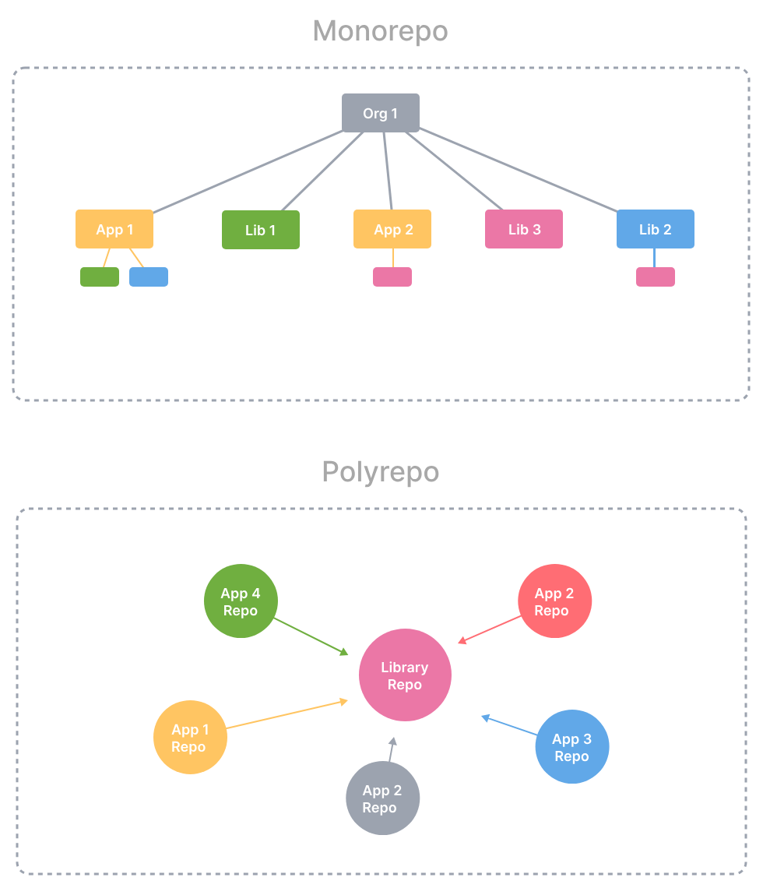

一个真正的Monorepo不仅仅是将多个项目的代码放在同一个代码库中。它还需要这些项目之间有明确定义的关系。如果这些项目之间没有良好定义的关系，那么就不能称之为Monorepo。

类似地，如果一个代码库中包含了一个庞大的应用，而没有对其进行分割和封装，那么这只是一个大型的代码库，而不是真正的Monorepo。即使你给它取一个花里胡哨的名字，也不能改变它的本质。

事实上，一个优秀的Monorepo正好与庞大的代码库相反，它应该具有良好的结构和模块化。

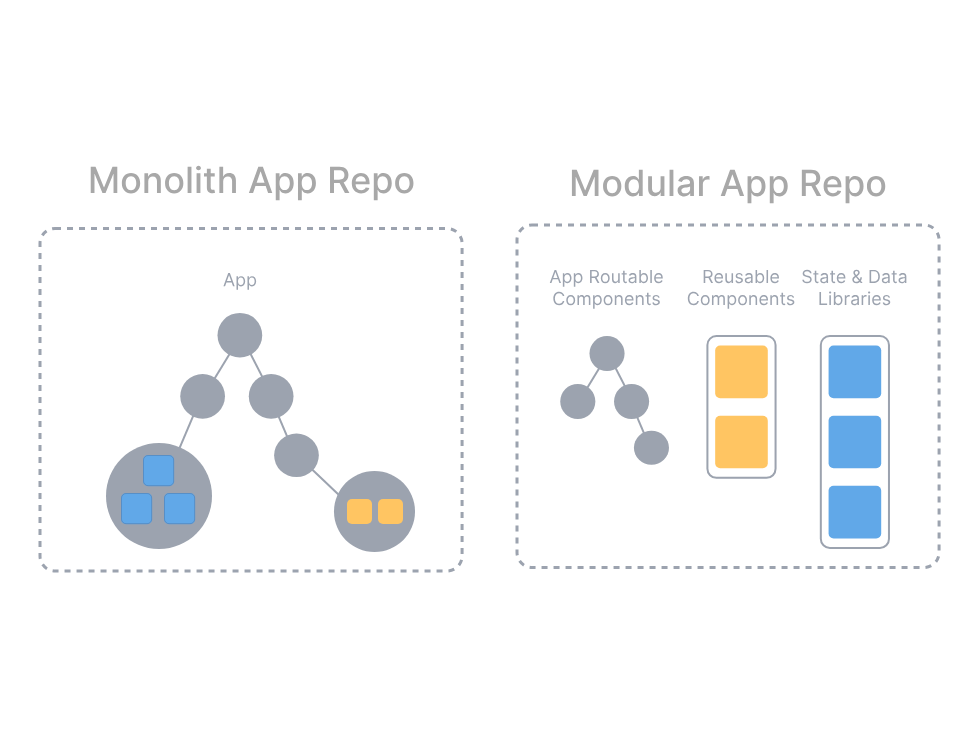

## Monorepo 解决了什么问题？

### Polyrepo

为了讨论的方便，假设多个代码库（"polyrepo"）是与单一代码库（"monorepo"）相对应的概念。polyrepo 表示多代码库，是当前开发应用的标准方式：**每个团队、应用或项目都有一个代码库**。通常情况下，每个代码库只有一个构建产物，并且拥有简单的构建流程。

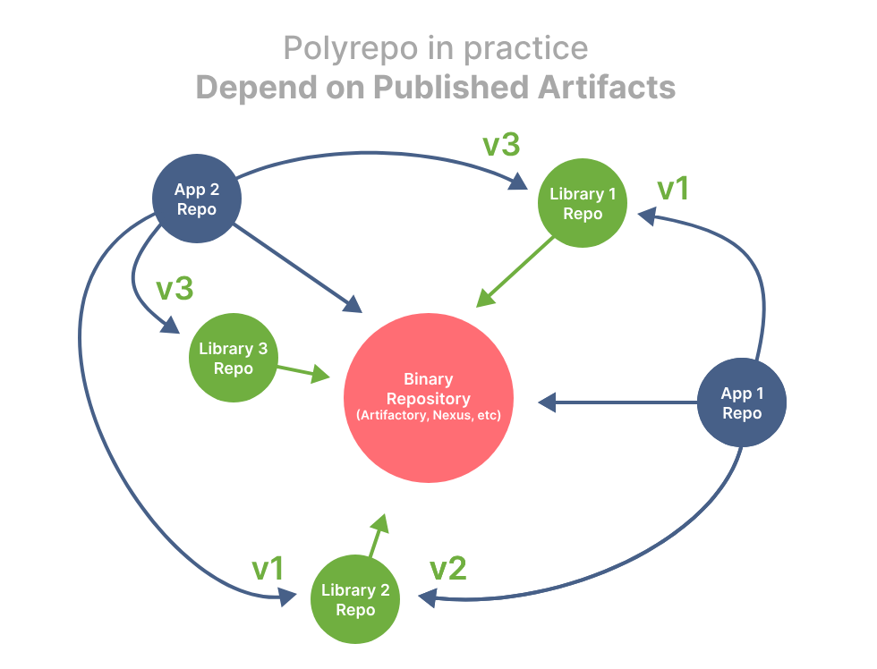

行业之所以采用多代码库的方式进行开发，有一个重要原因：**团队自治**。团队希望能够自主决定使用哪些库，何时部署应用或库，以及谁可以贡献或使用他们的代码。

团队自治是一种组织架构和开发模式的趋势，它赋予了团队更大的自主权和灵活性。每个团队拥有自己的代码库，可以根据自己的需求和优先级进行独立的决策和开发。这种方式能够提高团队的效率和创造力，同时也减少了团队之间的依赖和冲突。

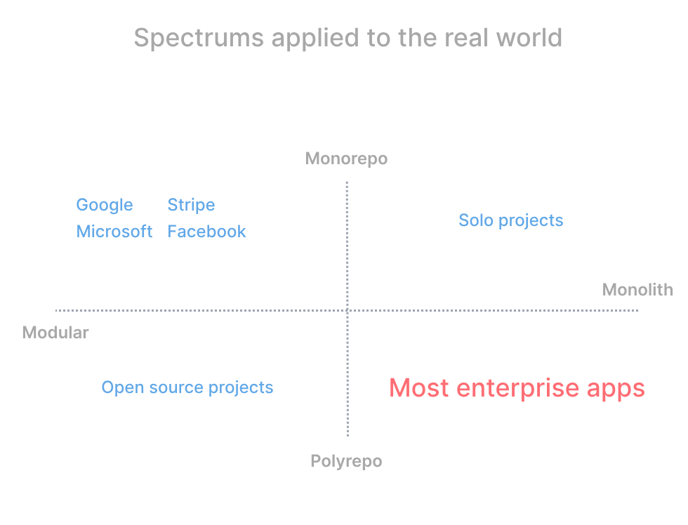

这些都是好的方面，那么为什么需要采取不同的方式呢？因为这种自治是通过隔离来实现的，而隔离却会损害协作。具体来说，在多代码库环境中存在以下常见问题：

* **繁琐的代码共享**：要在多个代码库之间共享代码，可能需要为共享代码创建一个专门的代码库。这样就需要设置工具和持续集成（CI）环境，将贡献者添加到代码库中，并设置包发布，以便其他代码库可以依赖它。更不用说在多个代码库之间解决不兼容的第三方库版本的问题了…
* **大量代码重复**：由于不愿意费事设置共享的代码库，团队通常会在每个代码库中编写自己的常见服务和组件的实现，这导致了很多代码重复。这种做法不仅浪费了时间，而且在组件和服务发生变化时增加了维护、安全性和质量控制的负担。
* **对共享库和消费者进行成本高昂的跨存储库更改**：在多个代码库中进行共享库的跨库更改是具有挑战性且成本较高的。当一个共享库需要进行关键 bug 修复或重大变更时，开发人员需要在各个代码库中逐一应用这些修改，而这些代码库之间可能存在孤立的修订历史。这也意味着必须在每个代码库中进行相应的测试和验证，确保更改不会引入新的问题。
* **工具不一致**：工具链的不一致性会给开发人员带来额外的负担。不同的项目使用不同的命令和工具，可能需要花费时间和精力来适应和记忆这些差异。而且，当需要在多个项目之间进行切换时，频繁地切换命令和工具可能会导致混淆和错误。

### Monorepo

在多代码库环境（"polyrepo"）中工作时，可能会遇到一些问题。 那单一代码库（"monorepo"）是如何解决这些问题的呢？

* **创建新项目无需额外开销**：创建新项目无需额外的开销。如果所有消费者都在同一个代码库中，可以直接在现有的开发环境中创建和设置新项目，避免了额外的资源和配置成本。
* **原子提交跨项目**：每次提交都能确保所有项目能够协同工作。当在同一次提交中修复所有问题时，不存在破坏性变更的问题，因为所有修改都是一起完成的。
* **同一版本的所有内容**：可以避免因项目依赖冲突而导致的不兼容性问题。所有项目都共享同一份代码库，使用相同的第三方库版本，减少了版本管理和冲突解决的复杂性。
* **开发灵活性**：可以建立一种统一的构建和测试应用程序的方式，即使这些应用程序使用不同的工具和技术。开发人员可以自信地为其他团队的应用程序做出贡献，并验证其更改是安全的。

## Monorepo 工具有哪些？

Monorepo 拥有许多优势，但为了使其发挥作用，需要使用正确的工具。随着工作空间的扩大，这些工具必须帮助开发者保持高效、可理解和可管理。

那 Monorepo 工具应该提供些什么呢？

* 本地计算缓存
* 本地任务编排
* 分布式计算缓存
* 分布式任务执行
* 透明远程执行
* 检测受影响的项目/包
* 工作区分析
* 依赖图可视化
* 代码共享
* 一致的工具
* 代码生成
* 项目约束和可见性

> **注意**：除了功能以外，还有其他因素会影响使用体验。尽管一个工具可能在某些方面功能不如其他工具强大，但由于用户体验、成熟度、文档、编辑器支持等因素的差异，用户可能会更喜欢使用它。有些功能可以很容易地通过自定义实现来添加，而有些功能则无法通过简单的修改来实现。因此，除了关注功能外，还需要综合考虑其他因素来选择适合自己需求的工具。

比较流行的 Monorepo 工具如下：

| **工具** | **开发团队** | **简介** |
| :---: | :---: | --- |
| Bazel | 谷歌 | 快速、可扩展、多语言且可扩展的构建系统。 |
| Gradle Build Tool | Gradle | 专为多项目构建而设计的快速、灵活的多语言构建系统。 |
| Lage | 微软 | JS monorepos 中的任务运行器。 |
| Lerna | Nrwl | 一个用于管理具有多个包的 JavaScript 项目的工具。 |
| Nx | Nrwl | 下一代构建系统具有一流的 monorepo 支持和强大的集成。 |
| Pants | Pants Build | 一个快速、可扩展、用户友好的构建系统，适用于各种规模的代码库。 |
| Rush | 微软 | 适合拥有大量团队和项目的大型单一仓库。属于 Rush Stack 项目系列的一部分。 |
| Turborepo | Vercel  |  JavaScript 和 TypeScript 代码库的高性能构建系统 |

接下来将逐个功能来比较各个 Monorepo 工具在这些功能上的表现。

### 本地计算缓存

本地计算缓存是指在进行任务执行时，将任务的输入、输出和中间结果存储在本地机器上，以便在后续的构建或测试过程中可以直接使用这些已经计算过的结果，而不需要重新执行相同的任务。

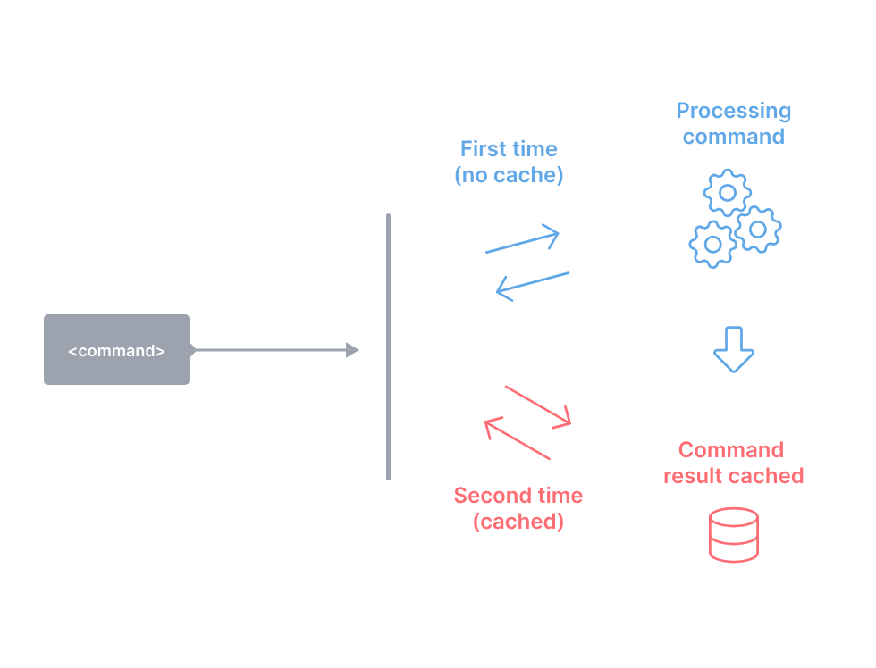

| **工具** | **是否支持** |
| :---: | --- |
| Bazel | ✅  |
| Gradle Build Tool | ✅ Gradle Build Tool 本身提供本地构建缓存。Gradle Enterprise 添加了对复制和管理的支持。 |
| Lage | ✅  |
| Lerna | ✅  Lerna v6 具有由 Nx 提供支持的内置本地计算缓存。 |
| Nx | ✅  |
| Pants | ✅ 像React一样，Nx在从其缓存中恢复结果时进行了树差异比较，这使得它在平均情况下比其他工具更快 |
| Rush | ✅ 利用系统 tar 命令更快地恢复文件。 |
| Turborepo | ✅ |

### 本地任务编排

本地任务编排是指在执行任务时，按照规定的顺序和并行方式来管理和执行这些任务。任务之间可能存在依赖关系，需要按照正确的顺序进行执行，同时还可以利用并行计算的优势，提高任务的执行效率。

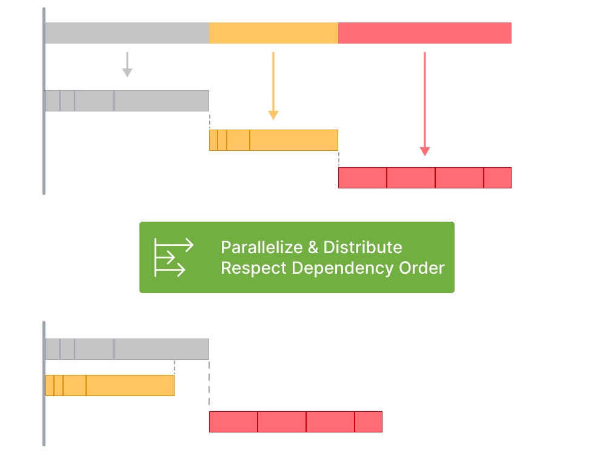

| **工具** | **是否支持** |
| :---: | --- |
| Bazel | ✅  |
| Gradle Build Tool | ✅ Gradle Build Tool 通过配置提供对并行任务的支持，并通过其灵活的 Groovy 或 Kotlin DSL 提供任务编排支持。 |
| Lage | ✅  |
| Lerna | ✅ Lerna v6 充分利用了 Nx 来高效地协调和并行执行任务。 |
| Nx | ✅  |
| Pants | ✅  |
| Rush | ✅ 支持此功能。命令可以被建模为简单的脚本，也可以作为独立的“阶段”（例如构建、测试等）。 |
| Turborepo | ✅ |

### 分布式计算缓存

分布式计算缓存允许在不同的环境中共享缓存结果。通过共享缓存，整个组织中的不同部门或团队可以共享已经计算过的结果，避免重复构建或测试相同的内容。\
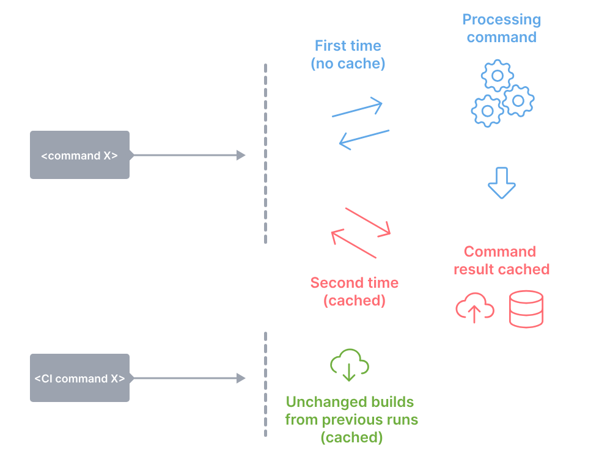

| **工具** | **是否支持** |
| :---: | --- |
| Bazel | ✅  |
| Gradle Build Tool | ✅ Gradle Build Tool 提供远程分布式缓存。 Gradle Enterprise 添加了对复制和管理的支持。 |
| Lage | ✅  |
| Lerna | ✅ Lerna v6 可以连接到 Nx Cloud 以启用分布式缓存。 |
| Nx | ✅  |
| Pants | ✅  |
| Rush | ✅ Rush 内置了对 Azure 和 AWS 存储的支持，并具有允许自定义缓存提供程序的插件 API。 |
| Turborepo | ✅ |

### 分布式任务执行

分布式任务执行是指将一个命令分布到多台机器上执行的能力，同时在很大程度上保持在单台机器上运行时的开发人员体验。

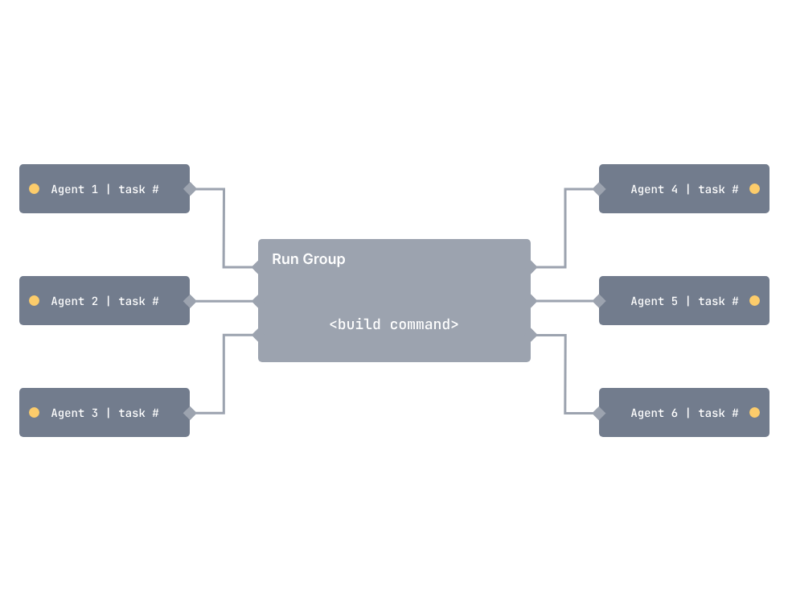

| **工具** | **是否支持** |
| :---: | --- |
| Bazel | ✅ Bazel 的实现是最复杂的一种，可以扩展到包含数十亿行代码的存储库，设置起来也很困难。 |
| Gradle Build Tool | ⚠️  Gradle Enterprise可以分布式执行测试任务。 |
| Lage | ❌ |
| Lerna | ✅ Lerna v6 可以连接到 Nx Cloud 以实现分布式任务执行。 |
| Nx | ✅ Nx 的实现并不像 Bazel 那样复杂，但可以通过小的配置更改来打开它。 |
| Pants | ✅ Pant 的实现与 Bazel 类似，并使用相同的远程执行 API。 |
| Rush | ⚠️ Rush 通过选择性地与 Microsoft 的 BuildXL 加速器集成来提供此功能。 |
| Turborepo | ❌ |

### 透明远程执行

透明的远程执行功能允许开发人员在本地开发环境中执行命令，并将这些命令自动透明地分发到多台远程机器上进行执行。开发人员可以像在单台机器上运行命令一样，在本地环境中编写和执行命令，而无需手动切换到远程机器或修改代码。

| **工具** | **是否支持** |
| :---: | --- |
| Bazel | ✅ 这是 Bazel 和其他工具最大的区别 |
| Gradle Build Tool | ❌ |
| Lage | ❌ |
| Lerna | ❌ |
| Nx | ❌ |
| Pants | ✅ Pant 的实现与 Bazel 类似，并使用相同的远程执行 API。 |
| Rush | ❌ |
| Turborepo | ❌ |

### 检测受影响的项目/包

在进行构建或测试操作时，通过检测变更的内容，确定可能受到变更影响的项目或包，从而只针对受影响的项目进行构建或测试。

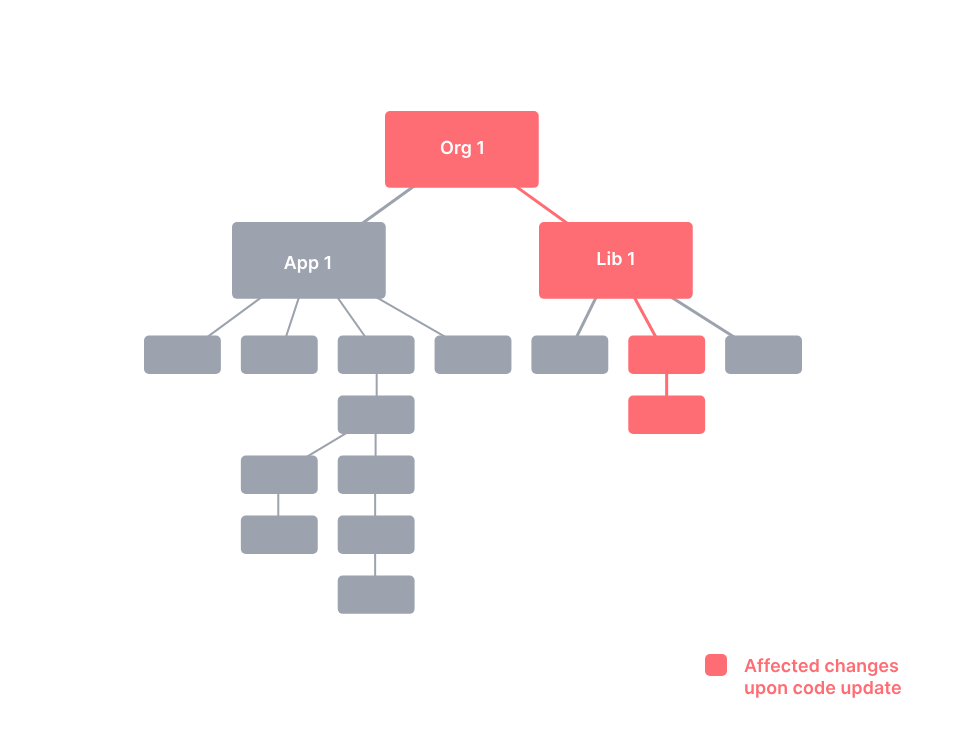

| **工具** | **是否支持** |
| :---: | --- |
| Bazel | ⚠️ Bazel没有内置支持，但是第三方工具（如target-determinator）使用Bazel的查询语言提供了这个功能。 |
| Gradle Build Tool | ✅ Gradle Build Tool 本身提供增量构建和最新检测。 |
| Lage | ✅ |
| Lerna | ✅ |
| Nx | ✅ 支持，它的实现不仅查看更改了哪些文件，还查看更改的性质。 |
| Pants | ✅  |
| Rush | ✅ 用于项目选择的命令行参数可以检测哪些项目受到 Git diff 的影响。 Rush 还为自动化场景提供了 PackageChangeAnalyzer API。 |
| Turborepo | ✅ |

### 工作区分析

工作区是指包含多个项目或代码库的根目录。工作区分析通过解析工作区中的项目、文件和依赖关系，生成一个项目图，展示了项目之间的相互关系和依赖。这个项目图可以帮助开发人员更好地理解整个工作区的结构和组织，并能够快速定位和处理相关的项目。

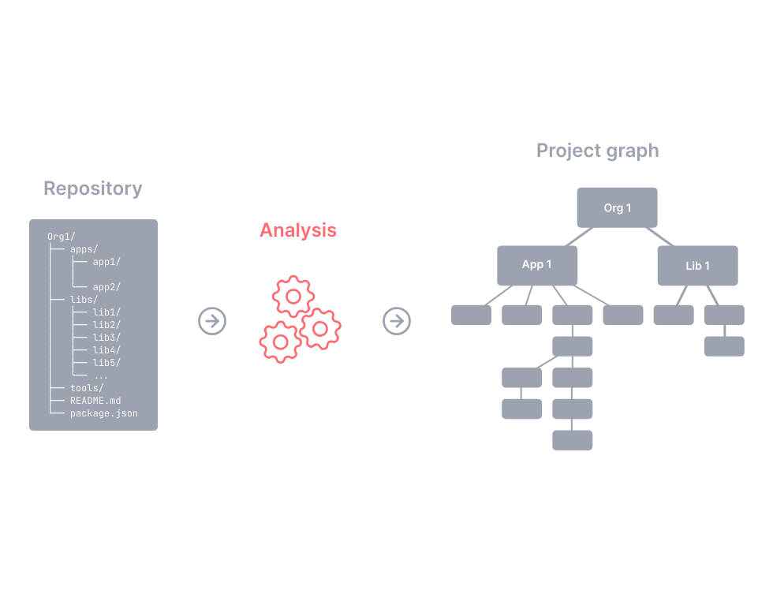

| **工具** | **是否支持** |
| :---: | --- |
| Bazel | ⚠️ Bazel 允许开发人员编写 BUILD 文件。 一些公司构建了分析工作区源并生成 BUILD 文件的工具。 |
| Gradle Build Tool | ✅ 可以使用build.gradle（Groovy脚本）或build.gradle.kts（Kotlin脚本）来编写构建任务。 |
| Lage | ✅ |
| Lerna | ✅ |
| Nx | ✅ 默认情况下，Nx 分析 package.json、JavaScript 和 TypeScript 文件。 它是可插拔的，可以扩展以支持其他平台（例如 Go、Java、Rust）。 |
| Pants | ✅ 这是Pants的最大差异化点。它使用静态分析来自动推断出支持的所有语言和框架的文件级依赖关系。 |
| Rush | ✅ Rush项目和单仓库项目具有相同的`package.json`文件和构建脚本。通过创建"rig packages"，可以在整个单体存储库（monorepo）之间共享工具和配置。 |
| Turborepo | ✅ Turborepo 分析 package.json 文件。 |

### 依赖图可视化

依赖关系图可视化工具可以将项目和/或任务之间的依赖关系以图形化的方式呈现出来。这个可视化过程是交互式的，也就是说可以对图中的节点进行搜索、过滤、隐藏、聚焦或突出显示，以及进行查询操作。

| **工具** | **是否支持** |
| :---: | --- |
| Bazel | ✅ Bazel 的实现支持自定义查询语言来过滤掉不感兴趣的节点。 |
| Gradle Build Tool | ⚠️ Gradle Build Scan 提供丰富的依赖关系信息，并且第三方工具可用于项目/任务图。 |
| Lage | ⚠️ Lage 没有附带可视化工具，可以编写自己的可视化工具。 |
| Lerna | ⚠️ Lerna 没有附带可视化工具，可以编写自己的可视化工具。 |
| Nx | ✅ Nx 配备了交互式可视化工具，可用于过滤和探索大型工作区。 |
| Pants | ⚠️ Pants并没有自带可视化工具，但它可以生成一个包含代码库详细图结构的JSON文件，该文件可以被处理成可用于可视化工具的输入数据。 |
| Rush | ⚠️ Rush 没有附带可视化工具，可以编写自己的可视化工具。 |
| Turborepo | ✅ Turborepo 使用 Graphviz 生成执行计划的静态图像和 HTML 文件。 该实现不是交互式的。 |

### 代码共享

代码共享是指通过一些方式来方便地分享代码库中独立的代码片段。

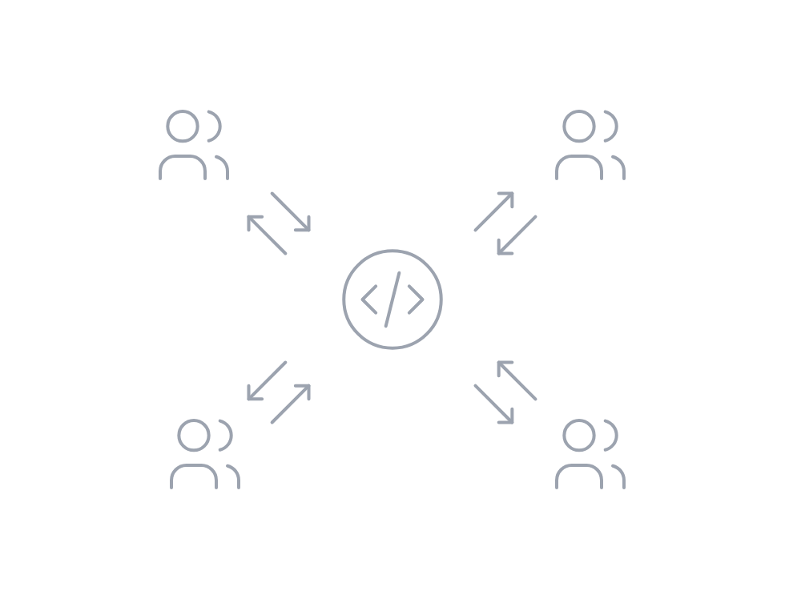

| **工具** | **是否支持** |
| :---: | --- |
| Bazel | ✅ 可以将任何文件夹标记为一个项目，并通过Bazel的构建规则来实现该项目的共享。 |
| Gradle Build Tool | ✅ 可以发布可共享的构件并从多个仓库中引用依赖项。 |
| Lage | ✅ 支持，只有npm包可以共享。 |
| Lerna | ✅ 支持，只有npm包可以共享。 |
| Nx | ✅ 支持，任何文件夹都可以标记为一个项目，并且可以进行共享。Nx插件帮助配置WebPack、Rollup、TypeScript和其他工具，以实现共享而不影响开发人员的工作环境。 |
| Pants | ✅ 支持打包、发布和使用代码构件，使用底层语言和框架的标准惯用法。 |
| Rush | ✅ 支持，不鼓励从未声明为npm依赖的文件夹导入代码。这确保了项目可以在单体仓库之间轻松移动。对于创建包是过于繁琐的情况，"packlets"提供了一个轻量级的替代方案。 |
| Turborepo | ✅ 支持，只有npm包可以共享。 |

### 一致的工具

这样的工具可以帮助开发人员在不同的技术栈之间切换时更加轻松和无缝。不管是使用JavaScript框架，还是使用Go、Rust、Java等其他技术，开发人员都可以获得相同的工具支持和开发体验。这种一致性的工具能够简化开发流程，减少学习成本，并提高团队的协作效率。

例如，该工具可以分析`package.json`和JS/TS文件，以确定JavaScript项目的依赖关系以及构建和测试方法。但是，对于Rust，它会分析`Cargo.toml`文件，对于Java，它会分析`Gradle`文件。因此，该工具需要具备插件化的能力。

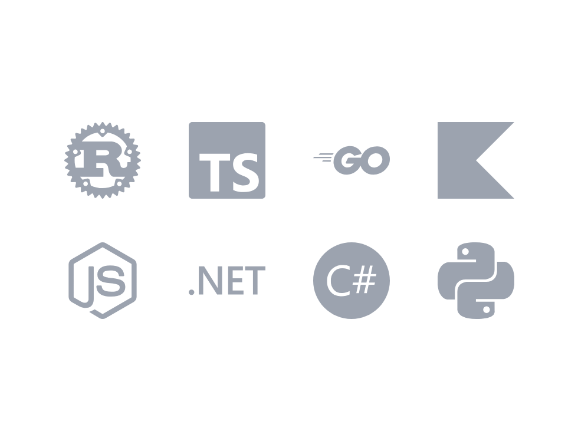

| **工具** | **是否支持** |
| :---: | --- |
| Bazel | ✅ Bazel的构建规则就像是不同技术和框架的插件。 |
| Gradle Build Tool | ✅ 通过插件生态系统可以扩展其功能，例如使用CMake进行本地构建或使用Webpack进行打包。 |
| Lage | ❌ 只能运行 npm 脚本。 |
| Lerna | ❌ 只能运行 npm 脚本。 |
| Nx | ✅ Nx是可插拔的。它默认能够调用npm脚本，但也可以扩展以调用其他工具（例如Gradle）。 |
| Pants | ✅ Pants具有强大的插件API，可以提供统一的用户体验（UX），适用于不同的语言和框架。它内置了多个插件，包括Python、Java、Scala、Go、Shell和Docker等，同时还有更多的插件正在开发中。还可以使用相同的API编写自定义的构建规则。 |
| Rush | ❌ Rush只针对TypeScript/JavaScript项目进行构建，并推荐一种解耦的方法，即使用本地工具链或BuildXL单独构建原生组件。理想情况下，Node.js是单体库开发者所需的唯一先决条件。 |
| Turborepo | ❌ Turborepo只能运行npm脚本，但不必安装Node.js。 |

### 代码生成

原生支持生成代码。

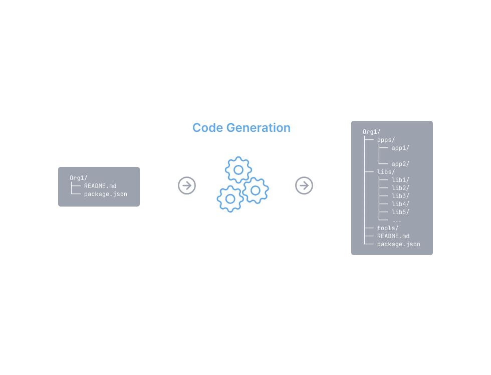

| **工具** | **是否支持** |
| :---: | --- |
| Bazel | ⚠️ 可以使用外部代码生成器。 |
| Gradle Build Tool | ⚠️ 可以使用外部代码生成器。 |
| Lage | ⚠️ 可以使用外部代码生成器。 |
| Lerna | ⚠️ 可以使用外部代码生成器。 |
| Nx | ✅ Nx具有强大的代码生成能力。它使用虚拟文件系统，并提供编辑器集成。Nx插件提供了流行框架的生成器，还可以使用其他生成器。 |
| Pants | ✅ Pants内置了适用于流行的代码生成框架的插件，包括Protobuf/gRPC、Thrift、Scrooge、Avro和SOAP。它还提供了插件API支持，以便轻松地添加新的代码生成器。Pants支持从单个codegen源生成多种语言的代码。它能够通过对codegen源的静态分析来推断依赖关系，并在这些源发生变化时正确地使生成的代码失效。 |
| Rush | ⚠️ Rush的维护者建议将项目模板作为单体库中的普通项目进行维护，以确保它们能够在编译时没有错误。通过一个社区插件，可以使用项目脚手架命令来生成项目模板。 |
| Turborepo | ⚠️ 可以使用外部代码生成器。 |

### 项目约束和可见性

Rush支持定义规则来约束仓库内的依赖关系。例如，开发人员可以将某些项目标记为私有项目，只有他们团队内的人才能依赖这些项目。开发人员还可以根据使用的技术（例如React或Nest.js）标记项目，并确保后端项目不导入前端项目。

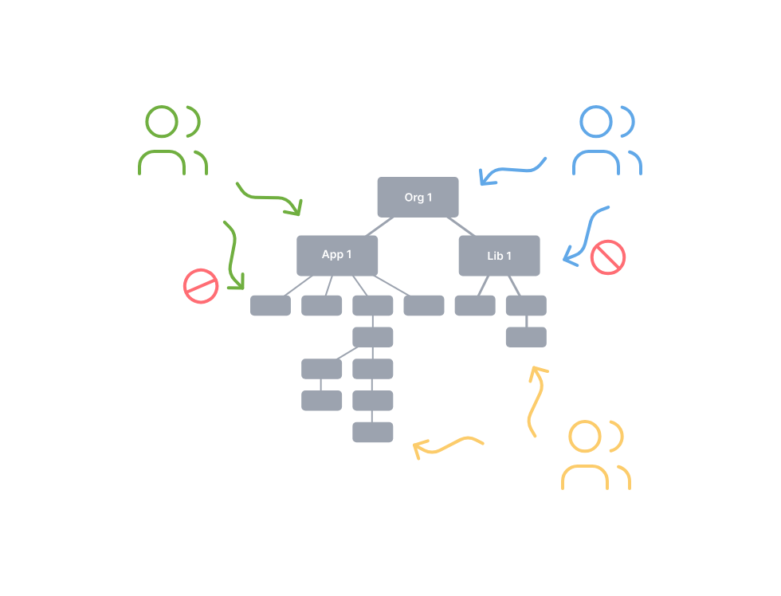

| **工具** | **是否支持** |
| :---: | --- |
| Bazel | ✅ Bazel支持可见性规则，这有助于将私有内容与公共内容、可共享的内容等进行分隔。 |
| Gradle Build Tool | ⚠️ 本身不原生支持这样的规则，但其丰富的插件功能允许开发人员开发类似的规则。 |
| Lage | ⚠️ 可以使用一组自定义规则和额外配置的代码检查工具（linter）来确保满足某些约束条件。 |
| Lerna | ⚠️ 可以使用一组自定义规则和额外配置的代码检查工具（linter）来确保满足某些约束条件。 |
| Nx | ✅ 开发人员可以根据自己的需求对项目进行任意方式的注释，并建立不变量，而Nx将确保这些注释的有效性。它允许开发人员注释哪些是私有的、哪些是公开的、哪些是实验性的、哪些是稳定的等等。Nx还允许为每个包定义公共API，这样其他开发人员就无法深层导入到这些包中。 |
| Pants | ⚠️ 虽然原生支持尚未实现，但可以编写自定义插件来强制执行此类规则。 |
| Rush | ✅ Rush可以根据项目类型选择性地要求在引入新的NPM依赖（内部或外部）时进行审批。它还支持针对NPM发布的版本策略。 |
| Turborepo | ⚠️ 可以使用一组自定义规则和额外配置的代码检查工具（linter）来确保满足某些约束条件。 |

## 小结

综上，Monorepo 是一种代码管理策略，它将一个项目的所有代码存储在一个单独的版本控制库中。Monorepo解决了多个问题：解决了代码共享与重复的困扰，提供更好的可追踪性和一致性。通过使用Monorepo，开发团队可以更好地组织、共享和管理代码，提高开发效率和协作质量。选择合适的Monorepo工具并灵活运用，能够帮助开发者更好地应对复杂的软件开发需求，推动项目的成功完成。

> 更新: 2023-09-22 00:35:17  
> 原文: <https://www.yuque.com/cuggz/feplus/mxinx6i57vutw6gd>