# VS Code技巧

你知道吗，全球**73%**的开发人员依赖同一个代码编辑器！是的，2023 年 Stack Overflow 开发者调查结果显示，Visual Studio Code 再次成为迄今为止**最常用的开发环境**。本文就来分享 10 个极大提高开发效率的 VS Code 技巧！

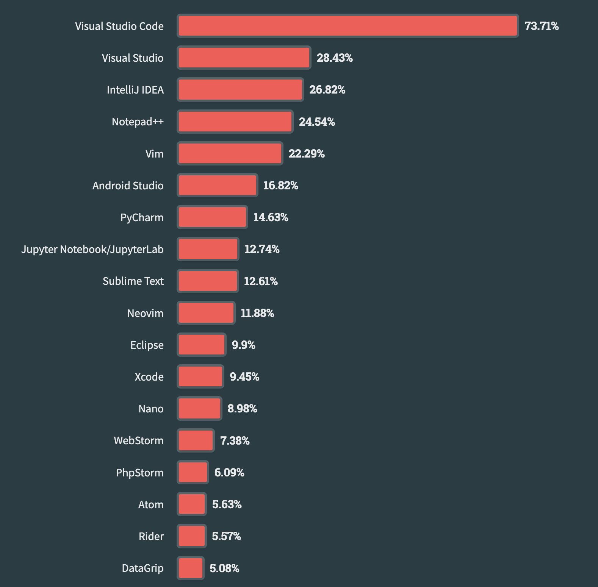

## 环绕标签
在VS Code中，可以在设置中搜索"** Editor: Wrap Tabs**"来实现选项卡换行的功能。

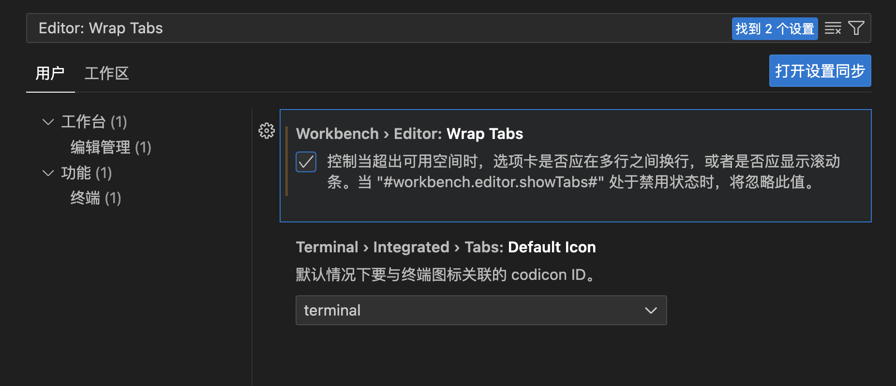

这样，在大型项目中工作时，就不需要像在浏览器中一样滚动来查找选项卡，而是可以让选项卡自动换行，更方便地跟踪模板和组件。

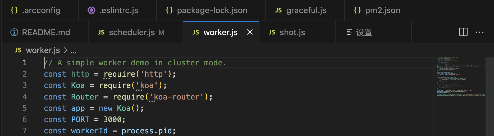

## Timeline 视图：本地源代码控制
Git等代码控制工具能够轻松跟踪文件的变更，并且在需要时还原到之前的状态。为了提供更好的版本控制和代码历史的可视化，VS Code提供了Timeline视图。

Timeline视图是一个自动更新的面板，它显示与文件相关的重要事件，如Git提交、文件保存和测试运行等。通过Timeline视图，你可以更直观地浏览代码的演变过程，追踪各种操作对文件的影响。

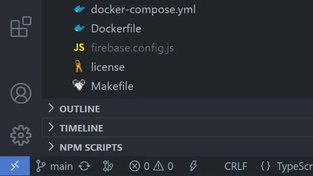

展开此视图可查看与当前文件相关的事件快照列表。这里是文件保存，也是 Git 提交文件暂存的地方。

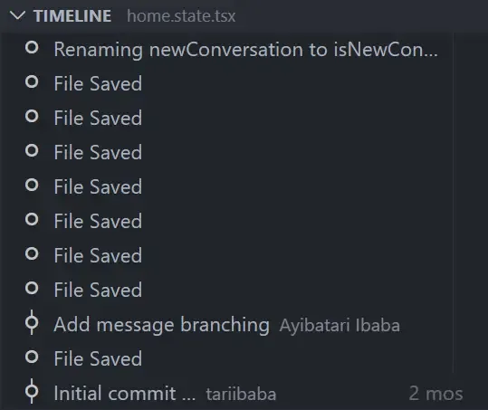

将鼠标悬停在快照项上可查看 VS Code 制作快照的日期和时间。

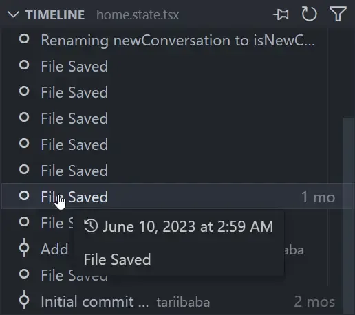

选择快照项可查看差异视图，显示快照时的文件与当前文件之间的更改。

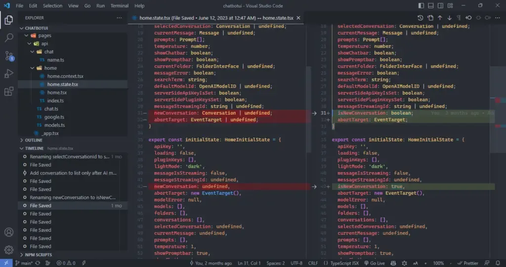

## 自定义布局
VS Code 界面的左侧选项卡通常包括资源管理器、搜索、源代码控制、项目管理等功能。而终端中会显示诸如 “problems”, “output”, “terminal”和“debug console”等工具栏。

VS Code 支持自由地拖放这些选项卡，按照喜好来重新排列界面，让它更适合你的使用习惯。

通过简单的拖拽操作，可以改变它们的位置。比如，可以将资源管理器移到右侧，将搜索放在顶部，或者将终端移动到左侧。只需点击选项卡的标题栏，并将其拖动到你想要的位置。释放鼠标按钮后，选项卡将会被放置在你选择的位置上，可以更方便地访问和管理这些功能。

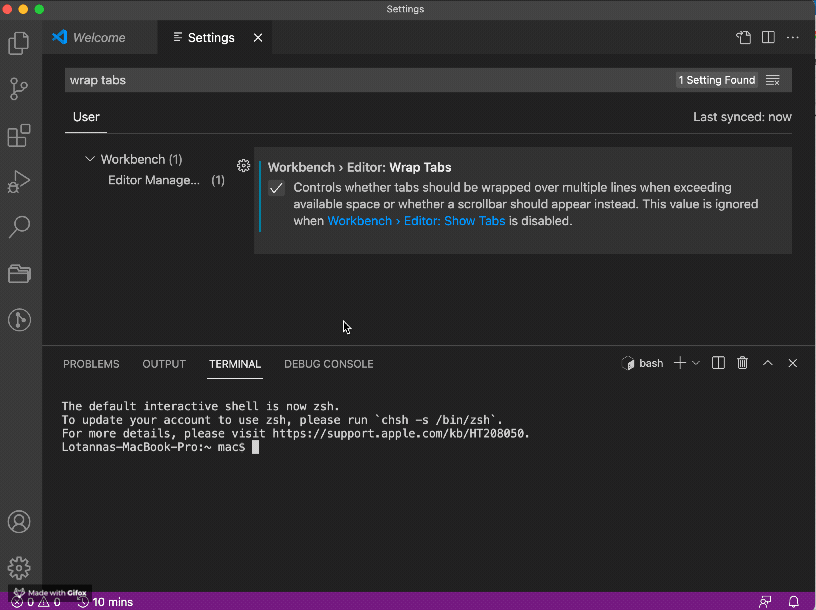

## 自动保存
在编辑文件时，默认情况下需要手动保存文件，比如按下Ctrl + S快捷键。这个过程可能很麻烦，特别是当频繁修改文件时。为了减轻这种繁琐的操作，VS Code 引入了自动保存功能。

自动保存功能会在我们进行文件编辑时自动保存文件的更改，而无需手动按下保存快捷键。这意味着我们可以专注于写代码而不用担心保存文件，节省了不少时间和精力。此外，自动保存还确保我们始终使用的是最新的文件版本，避免了由于未及时保存而丢失修改的情况。

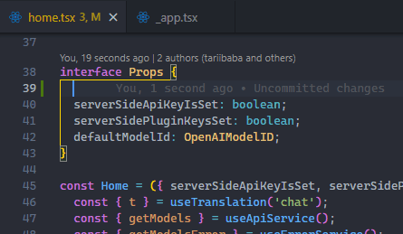

使用**“文件”>“自动保存”**可以轻松启用该功能。

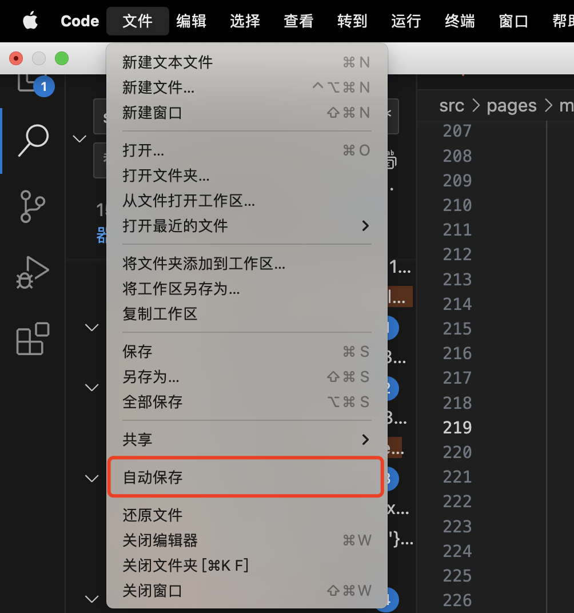

然而，自动保存功能并非完美无缺。有些人可能喜欢手动控制保存的时机，以便在修改完成之前进行检查和确认。自动保存也可能导致一些意外情况，比如误操作或者意外修改了文件内容，因为一旦保存，修改就会立即生效。

是否启用自动保存功能取决于个人偏好和实际需求。权衡利弊，根据自己的习惯和工作流程来决定是否使用自动保存功能。

## 使用命令面板执行操作
在 VS Code 中，除了输入文本之外，几乎任何操作都可以通过命令面板完成。命令面板允许我们在编辑器中执行各种任务，包括与文件相关的命令、导航命令、编辑命令和终端命令，每个命令都被优化设计以提升编辑体验。通过命令面板，可以简单地搜索所需的命令，并选择执行相应的操作。

打开命令面板的方式如下：

+ Windows/Linux: 使用快捷键 Ctrl + Shift + P
+ Mac: 使用快捷键 Shift + Command + P

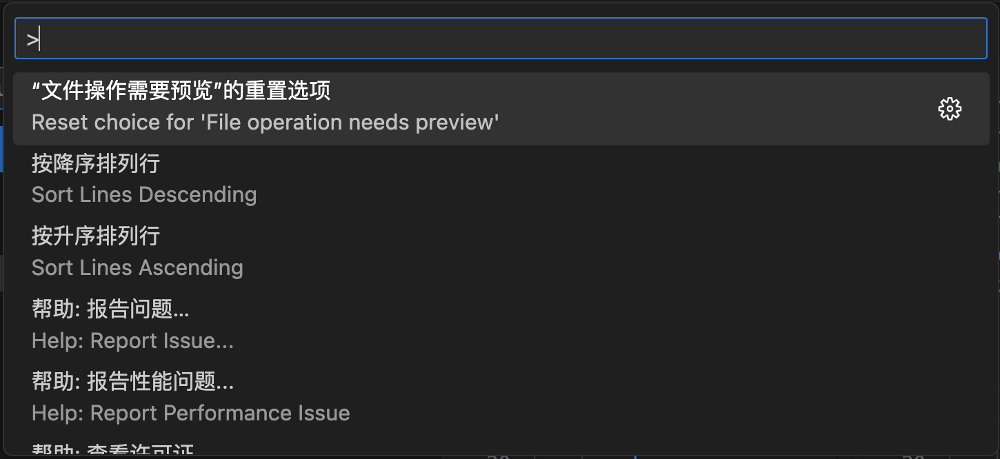

快捷键是一种使用键盘更快地运行命令的方式。与使用快捷键相比，命令面板的主要优势在于当某个命令没有快捷键时，或者当你不确定某个命令是否存在时，可以通过命令面板进行查找和执行。

在 VS Code中，有大量的命令可供使用，比如打开文件、查找替换、调试应用程序等。虽然很多命令都有对应的快捷键，但并不是所有命令都有快捷键。此时，命令面板就发挥了作用。命令面板提供了一个搜索功能，可以输入关键字来查找你想要执行的命令。即使你不知道具体的命令名称，只需输入相关的描述性关键字，命令面板也能帮助你找到合适的命令。这种灵活性让你无需记忆全部命令及其快捷键，只需用简单的搜索即可找到所需的命令并执行操作。

因此，命令面板是一个非常实用的工具，特别适合当需要执行没有快捷键的命令，或者想查找你不确定是否存在的命令时使用。

## 新设备同步
当在一台电脑上设置好了自己喜欢的 VS Code 环境后，如果换了一台新电脑，不想再重新配置一遍。这时，VS Code的设置同步功能就派上用场了。

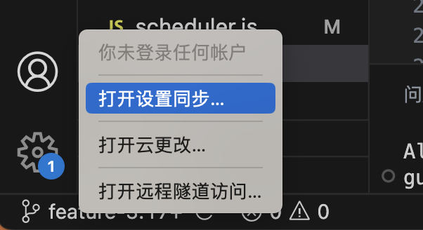

通过设置同步功能，可以将一台电脑上的所有配置都保存下来。然后，在新的电脑上登录账号，开启设置同步功能，就可以让新电脑应用上与之前完全相同的设置。这样，不需要再花时间重新调整和配置所有的设置了。

## 禁用预览
在 VS Code 中，当打开一个文件后，立即打开另一个文件而没有编辑第一个文件时，第一个文件就会被替换掉。VS Code只是在选择文件时预览它们，所以一旦点击另一个文件，之前的文件就会消失。

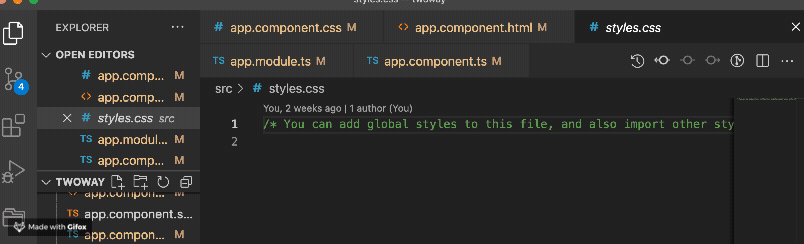

可以在设置中搜索“**Editor: Enable Preview**”，取消勾选即可。这样，当打开一个文件后，即使打开了另一个文件，之前的文件也会保留在编辑器中，而不会自动关闭。这样，可以方便地在多个文件之间进行切换和比较。

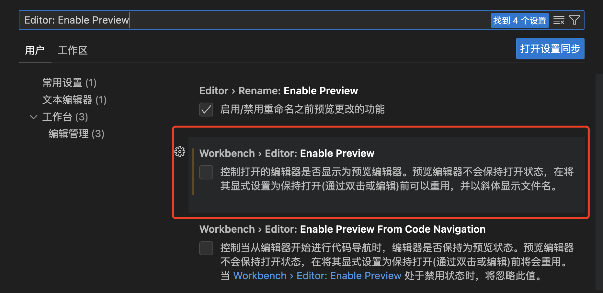

除此之外，如果想在某些情况下时预览文件，而有些情况是固定文件。可以在 Tab 栏**双击**需要固定的文件，这样这个文件就被固定了，不会被替换掉。

## 快速跳到代码行
可以使用**Ctrl + G** 快捷键实现代码行的快速跳转。使用这个快捷键，会弹出一个输入框，可以在其中输入要跳转的行号。输入行号后，按回车键，编辑器将会直接跳转到指定的行数处。这样就能快速地导航到代码的特定行，而不需要手动滚动查找。

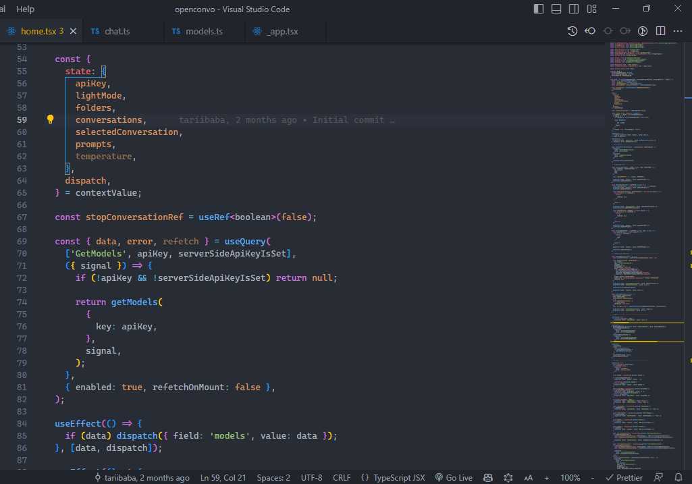

## 平滑光标打字
VS Code有一个称为"平滑光标"的功能，它可以在光标移动时产生平滑的动画效果。这让打字感觉更加流畅和精致，并且在我们浏览代码行并将光标放置在不同位置时，给予我们更平滑、更自然的感觉。

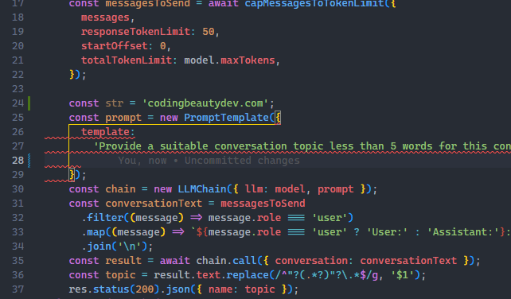

要打开平滑光标功能，可以在命令面板中打开设置界面，并搜索 "Editor: Cursor Smooth Caret Animation" ，打开该设置即可。

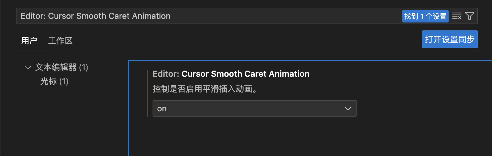

## 多光标编辑
多光标编辑功能允许我们在不同的位置同时编辑多个光标所在的文本，从而快速地进行批量操作。例如，我们可以一次性在多行代码中插入同样的内容，或者同时删除多处重复的文本，以加快编辑的效率。

在编辑时，至少会有一个光标，可以使用"Alt + 单击"的方式添加更多的光标。

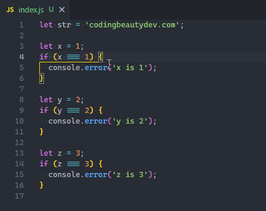  
还可以使用 Ctrl + Alt + Down 或 Ctrl + Alt + Up 快捷键轻松地在当前行上方或下方添加光标。

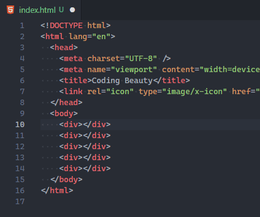

> 更新: 2023-09-22 00:33:04  
> 原文: <https://www.yuque.com/cuggz/feplus/chvcer4f31kiqutb>