# 前端调试技巧

本文来分享一些不太常用，但是非常实用的前端调试技巧，希望对你有所帮助！

* 悬停时检查弹出窗口
* 使用日志断点
* 模拟可折叠设备
* 自动完成样式
* 切换颜色格式
* 捕获高分辨率截图
* 检查事件流
* 查看和复制样式更改
* 实时表达式
* 调试水平滚动条

## 悬停时检查弹出窗口

如果你曾经尝试检查像 **tooltip、下拉菜单**等只在悬停时才出现的弹出窗口元素，那么你就会知道检查弹出窗口元素有多难。检查弹出窗口元素的主要问题在于，当你在 DevTools 中的任何地方点击时，页面会失去焦点，导致弹出窗口消失。为了解决这个问题，Chromium 浏览器提供了一个“Emulate a focused page”的选项，以便在使用 DevTools 时保持页面聚焦。

你是否曾经为检查只在悬停时出现的弹出元素（如 tooltip、下拉菜单等）而苦恼？这些元素一旦页面失去焦点就会消失，导致检查变得异常困难。Chromium 浏览器提供的“Emulate a focused page”功能正是为了解决这个问题，确保在使用 DevTools 时页面保持聚焦状态。

要在 DevTools 中启用此功能，有两种方法：

1. 在“Elements”面板中选中触发弹出元素的项。接着打开“Styles”面板，并点击“:hover”按钮以激活悬停状态。然后，启用“Emulate a focused page”选项，这样即使你与 DevTools 交互，页面也会保持聚焦状态。
2. 打开命令菜单，运行“Show Rendering”命令，在DevTools底部打开“Rendering”抽屉。在抽屉中向下滚动，找到“Emulate a focused page”选项并勾选它。

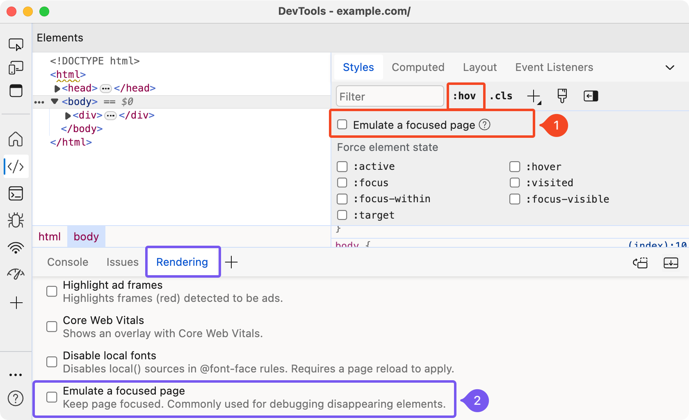

## 使用日志断点

如果你习惯使用`console.log()`来调试代码，那么现在有一个更优雅的方法可以在控制台中查看日志输出，可以避免在代码中添加大量的`console.log()`语句。特别是在调试生产代码时，这一方法格外有用。

对于 Chromium 浏览器，可以在“**Sources**”面板中打开脚本，然后右键点击想要记录日志的行号，并选择“Add logpoint…”。在弹出的窗口中，输入想要在控制台中显示的消息，并插入想要记录的变量。这样，当代码执行到这一行时，相应的日志信息就会出现在控制台中，而无需修改原始代码。

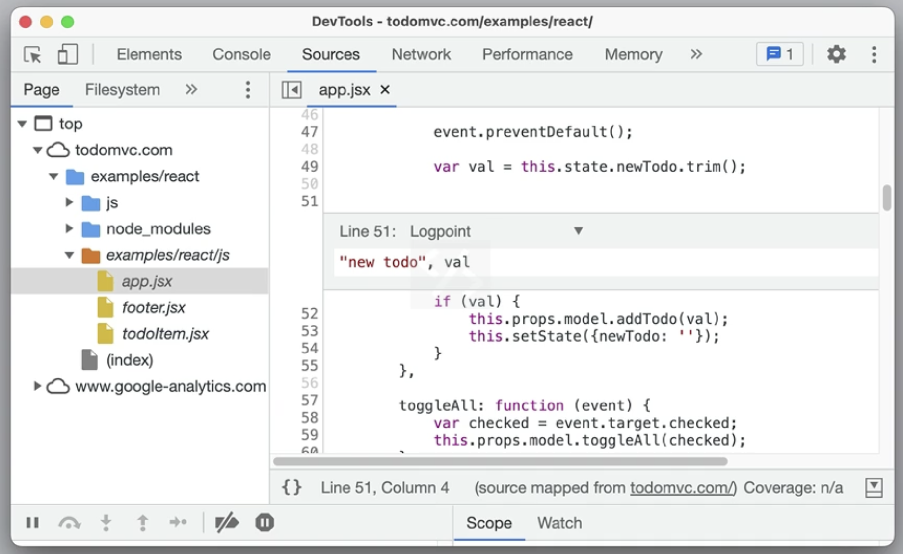

在 Firfox 中，可以在 “**Debugger**” 面板中使用类似的功能，只需找到想要记录日志的行号，右键点击，然后选择“**Add log**”即可。

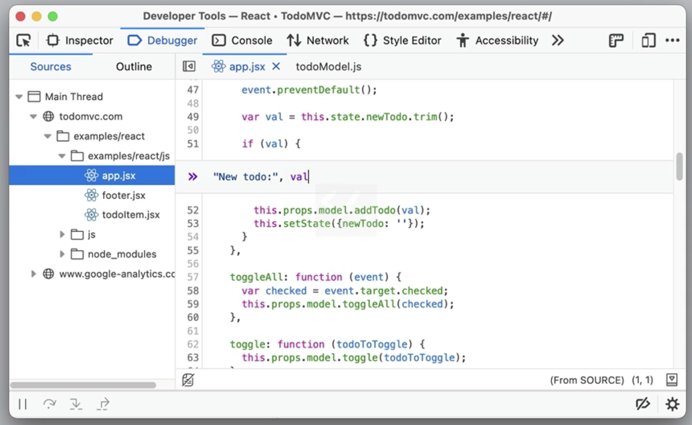

## 模拟可折叠设备

近年来，可折叠设备成为市场上的新宠。但由于它们具有两个由缝隙分隔的屏幕，因此在可折叠屏幕上，应用可能与在单屏设备上看起来有所不同。为了提供更出色的用户体验，我们需要充分利用可折叠屏幕周围的空间，并围绕双屏的约束条件来设计网站。幸运的是，一些浏览器提供了模拟可折叠设备或双屏设备的功能，让我们能够更直观地了解网站在不同模式下的显示效果。

在Chromium浏览器中，可以进入设备仿真模式并选择可折叠设备。一旦选中，工具栏上将会出现额外的按钮。通过这些按钮，可以轻松切换竖屏和横屏模式，或者切换到单屏和双屏模式，从而查看网站在不同布局下的外观。

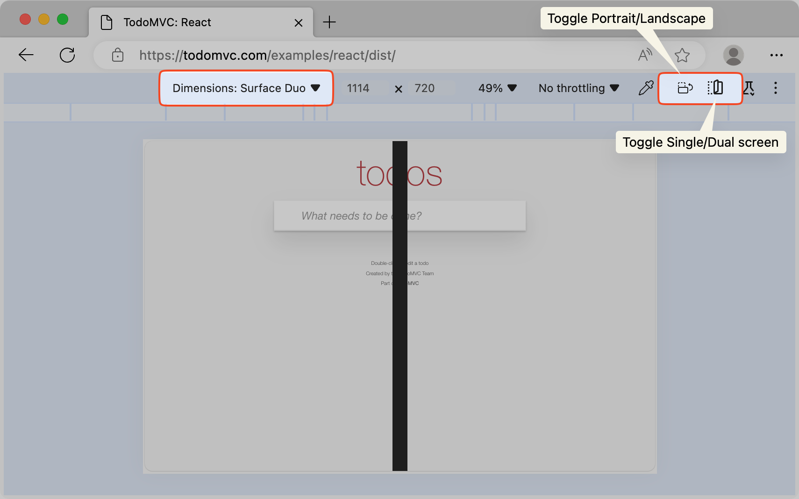

## 自动完成样式

Chromium浏览器具有一项强大的功能：当只输入值时，DevTools 会自动推荐最匹配的**属性-值**对。比如，只需输入“bold”，DevTools 就会推荐“font-weight: bold”作为首选样式，

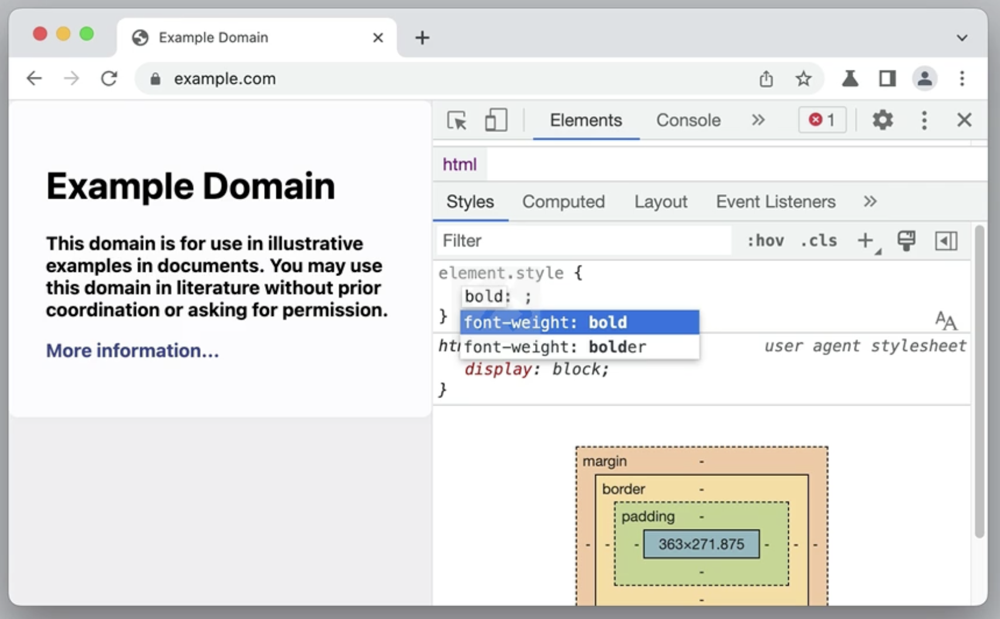

在Safari中，即使在声明中有拼写错误，网页检查器也会尝试模糊匹配，并建议最接近的属性-值对。

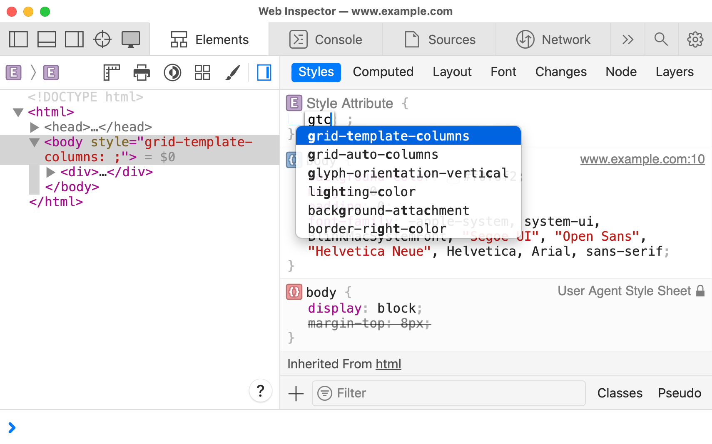

## 切换颜色格式

所有主流浏览器的 DevTools 都支持通过按住Shift键并点击颜色预览框来切换编写的颜色格式，从而在各种颜色格式（如十六进制、rgb、hsl、hwb）之间循环选择。此外，还可以在颜色选择器中使用上下箭头键来更改颜色格式。

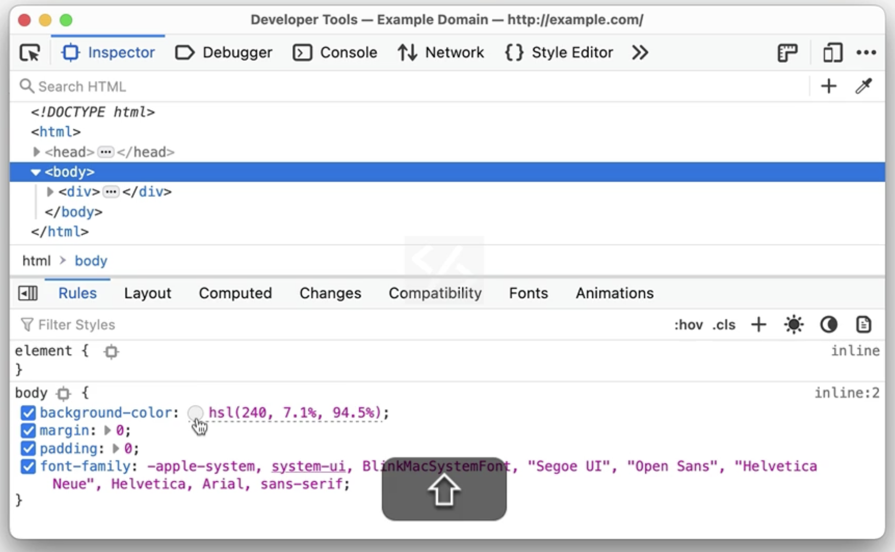

在Chromium和Safari浏览器中，可以通过颜色选择器从浏览器窗口外部轻松选取颜色。特别是在Safari中，还可以将颜色格式调整为display-p3。在颜色选择界面中，你会看到一条白线，它标示了sRGB的边缘。白线右上方的所有颜色都属于Display-P3色域，但在sRGB中并不可用。为了确保兼容性，可以右键点击颜色框，选择“Clamp to sRGB”功能，这将自动将其转换为 sRGB 空间中最接近的可用颜色。

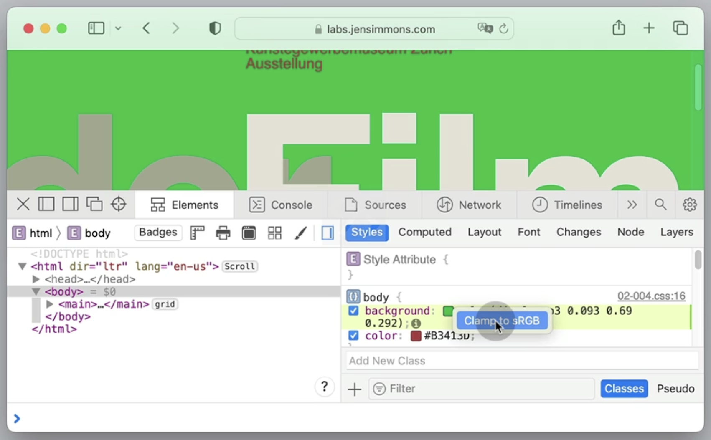

## 捕获高分辨率截图

如果你无法访问高分辨率设备，通常需要借助浏览器扩展、第三方服务或Node.js库来捕获网站的高清截图。但借助 DevTools，可以直接在浏览器内为整个页面或视口捕获高分辨率截图，无需额外工具。

在Chromium浏览器中，操作步骤如下：

1. 在DevTools中，点击“Toggle device toolbar”图标（Cmd+Shift+M或Ctrl+Shift+M）进入响应式设计模式。

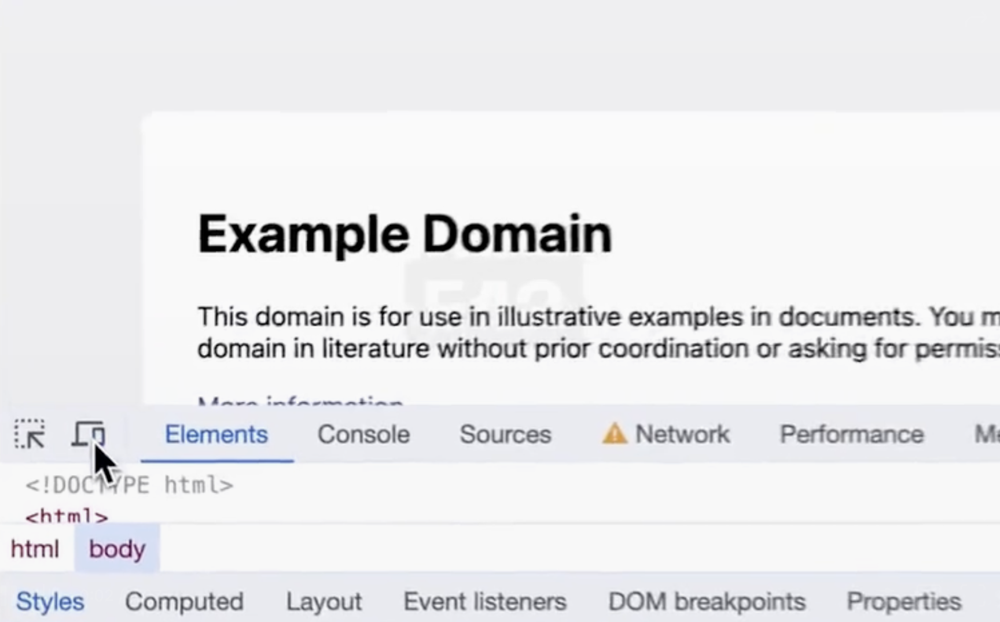

2. 在设备工具栏中，点击 `⋮` 中的 Add device pixel ratio 选项。

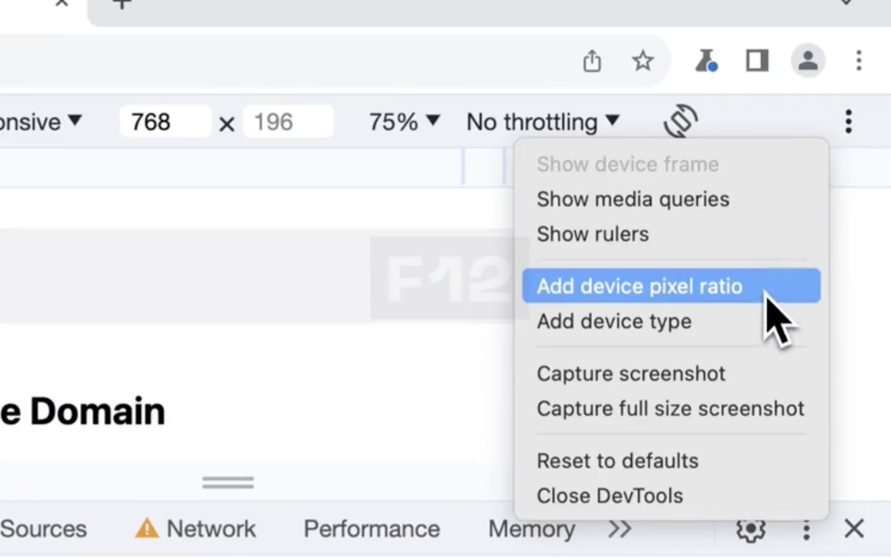

3. 在视口顶部的操作栏中，从新增的DPR下拉菜单中选择合适的DPR值。默认值为2，可以根据需要选择更高的值，例如 3。

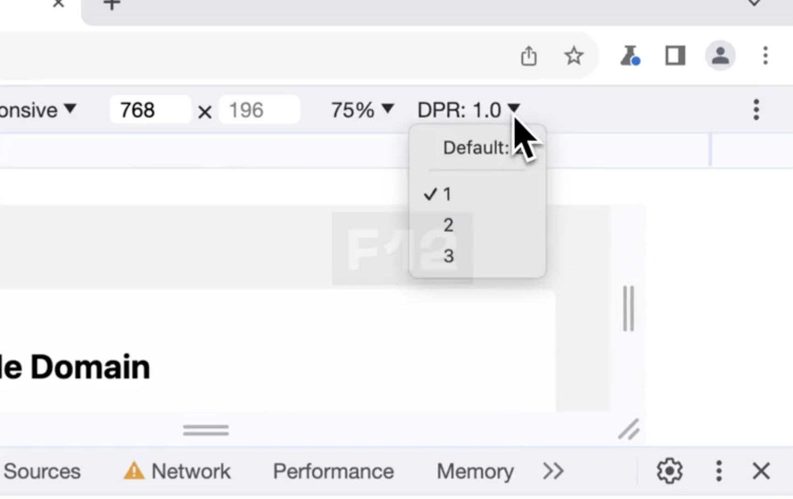

4. 点击 `⋮` 中的“Capture screenshot”选项以获取当前视口的高清截图，或选择“Capture full size screenshot”以捕获整个页面的高清截图。

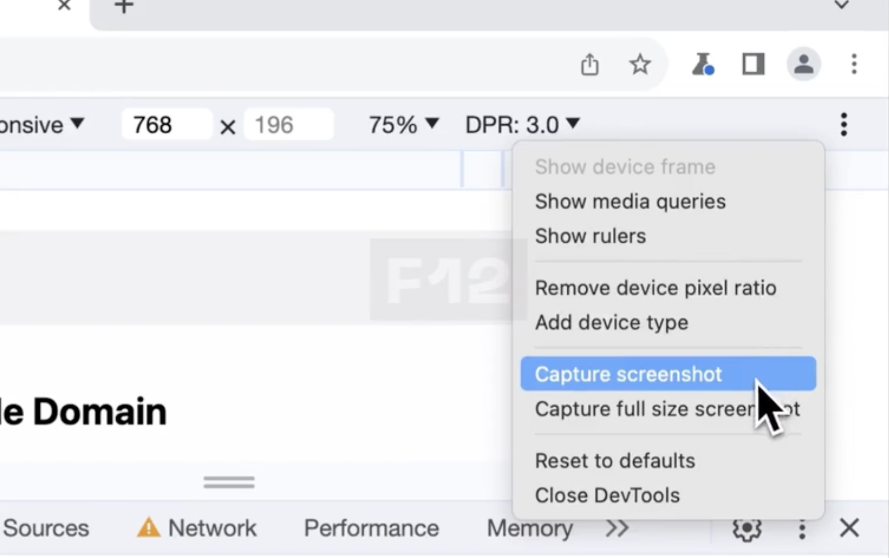

在Firefox中：

* 想要捕获页面的高分辨率截图，可以打开Console面板，并运行命令`:screenshot --dpr 3`，这样就能够以设备像素比设为3的方式获取截图。
* 如果希望捕获整个页面的截图，只需在命令后添加`--fullpage`即可。此外，如果想要捕获某个可以通过选择器标识的节点的截图，可以添加`--screenshot .header`到命令中即可。

## 检查事件流

如果你的 Web 应用通过服务器发送事件（Server-Sent Events, SSE）从服务器接收一系列的事件流，你或许需要能够在 DevTools 中检查这些传入的事件流。SSE 的行为与传统请求-响应模式有所不同，因此，在 Network 面板中你只会看到一个请求。

不过，在Chromium浏览器中，你依然能够轻松地检查传入的事件流。只需打开对应的请求，然后导航至“EventStream”标签页即可。此外，这个标签页还会捕获服务器通过XHR和Fetch发送的事件，让你能够全面了解事件流的动态。与网络面板类似，还可以使用正则表达式来过滤流，或清除表格中的项。

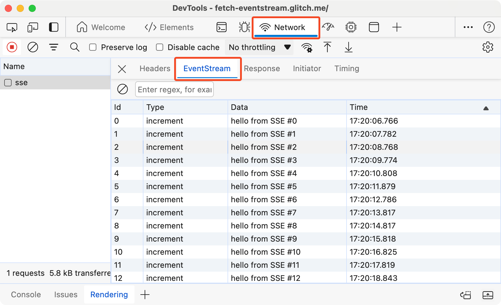

## 查看和复制样式更改

DevTools 允许你调整页面样式并实时预览效果。但逐一识别并手动复制修改过的样式到编辑器中是相当的麻烦。如果你常需要在编辑器和 DevTools 间来回切换以复制样式变更，那么这里有一个更便捷的方法。

**在Firefox中**：只需在“Rules”面板中对CSS声明进行所需调整，然后开启“Changes”选项卡，即可快速查看所有已变更样式的差异。点击“Copy All Changes”按钮，即可一键复制这些修改过的样式，之前的声明会自动以注释形式保留，方便对比和整合。

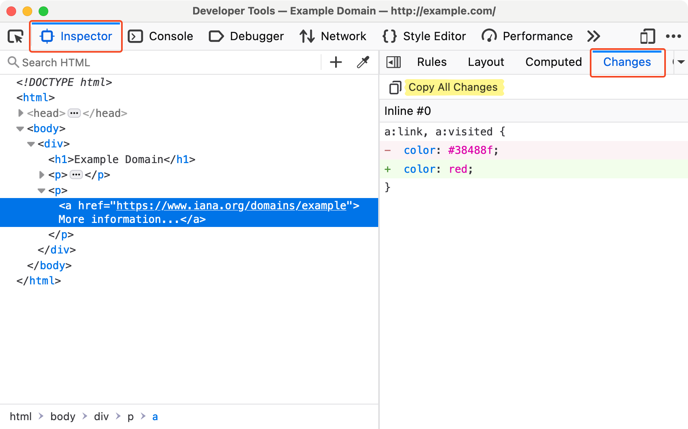

**在Safari中**：可以在“Styles”面板中对 CSS 声明应用更改，然后点击“Changes”面板以查看差异。

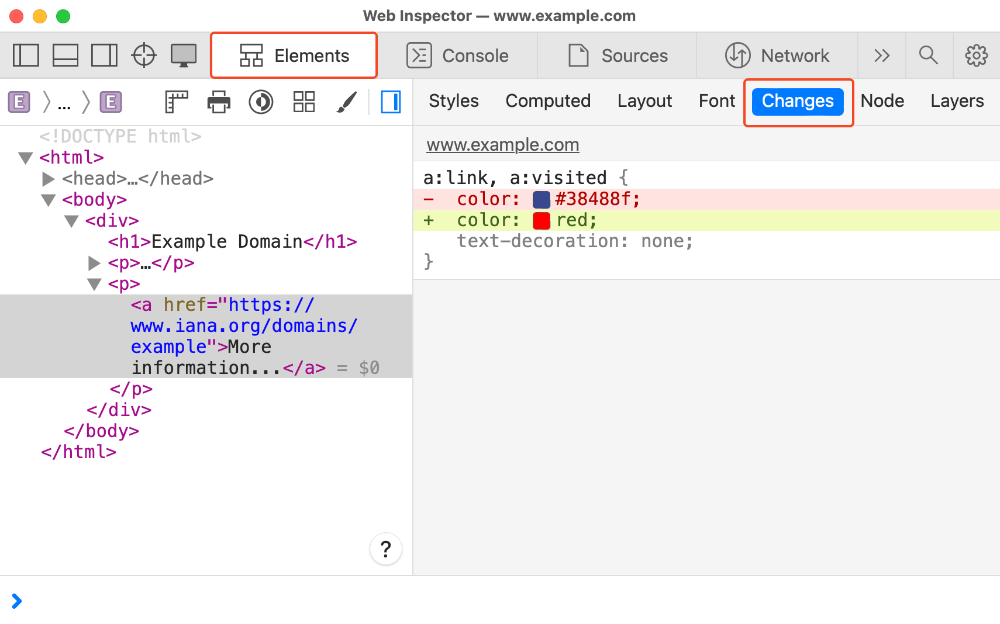

## 实时表达式

如果你经常需要在控制台中重复输入相同的JavaScript表达式，那么实时表达式功能将大大简化你的工作流程。这一功能类似于调试器中的监视功能，能够实时计算你在与网页交互时所使用的表达式值。

在 Chromium 浏览器中，只需点击控制台中的眼睛图标，即可轻松创建一个实时表达式。随后将出现一个文本框供你输入表达式。只需在文本框中输入表达式，然后按下 Enter 键，即可实时查看计算结果。

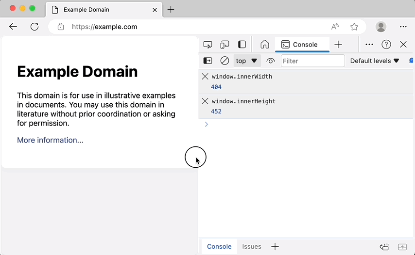

实时表达式会始终显示在控制台的顶部，便于随时查看。可以根据需要添加多个实时表达式，以便同时监控多个表达式的值。此外，如果想输入多行表达式，只需按下 Shift+Enter 即可。

## 调试水平滚动条

在前端开发过程中，不期望出现的水平滚动条常常成为调试的难点，尤其是当需要定位导致溢出的具体元素时。幸运的是， Firefox 提供了独特的方法来轻松识别这些元素。

在 Firefox 的“Inspector”面板中，系统会自动为具有滚动条的元素添加<code>scroll</code>标识。只需点击这个标识，Firefox 就会立即高亮显示那些导致容器产生滚动条的元素，并为其加上<code>overflow</code>的标识。

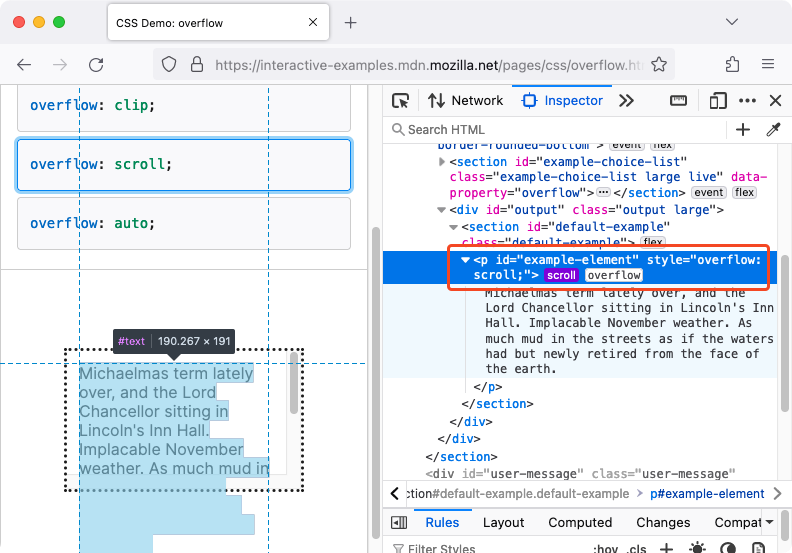

> 更新: 2024-06-07 17:36:50  
> 原文: <https://www.yuque.com/cuggz/feplus/gmx14c6moabp3ib1>