# 在VS Code中使用 Git

本文来一起学习如何在 VS Code 中进行常见的 Git 可视化操作！

## 前置工作

在介绍如何在 VS Code 中使用 Git 之前，先来介绍一个强悍的 VS Code 插件：Git Extension Pack，它旨在提供一组常用的 Git 工具和功能，以便更方便地进行版本控制和协作开发。该插件包含了多个与 Git 相关的扩展：

* **Git History (git log**)：可以查看 Git 提交记录、文件或行的历史。通过该扩展，可以快速浏览项目的版本历史，查看每个提交包含的修改内容和作者信息，以及文件和行的详细变更情况。
* **Project Manager**：可以方便地在不同项目之间进行切换。这个扩展提供了一个项目管理器，可以轻松地保存和加载不同的项目配置，快速切换工作环境。
* **GitLens**：增强了 Visual Studio Code 内置的 Git 功能。它通过行内的 Git 责任注解和代码镜头，更好地了解代码的历史和作者信息。您可以方便地查看每行代码的最后修改者、最近的提交信息，甚至可以直接查看远程仓库上的相关代码片段。
* **gitignore**：提供了对 `.gitignore` 文件的语言支持，让您能够更简单地管理和生成这个文件。同时，还可以从 GitHub 的存储库中获取常见的 `.gitignore` 文件模板，以便快速忽略项目中不需要跟踪的文件和文件夹。
* \*\*Open in GitHub / Bitbucket / \*\***VisualStudio.com**：提供了在 GitHub、Bitbucket 或 VisualStudio.com 中直接跳转到代码的功能。通过单击相应的链接，可以快速打开相关代码仓库，并跳转到指定的行号或文件位置。

一个插件囊括了五个热门插件的全部功能！

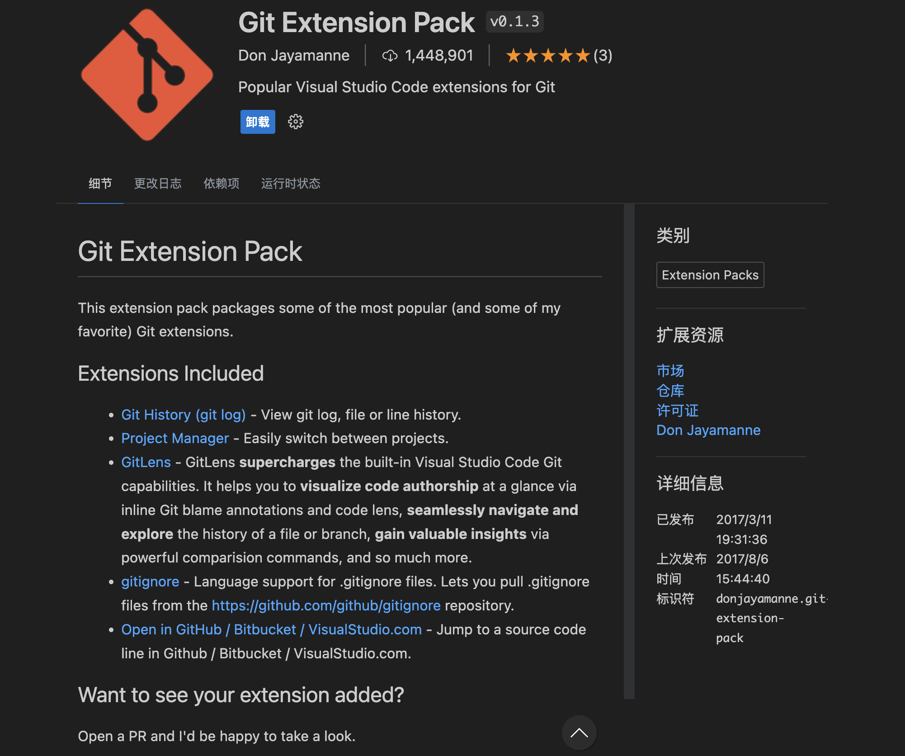

安装完成之后，就来看看如何在 VS Code 中可视化使用 Git。

当新打开一个 VS  Code 窗口时，需要打开一个项目，可以在本地文件打开项目，也可以直接从远程仓库克隆项目：

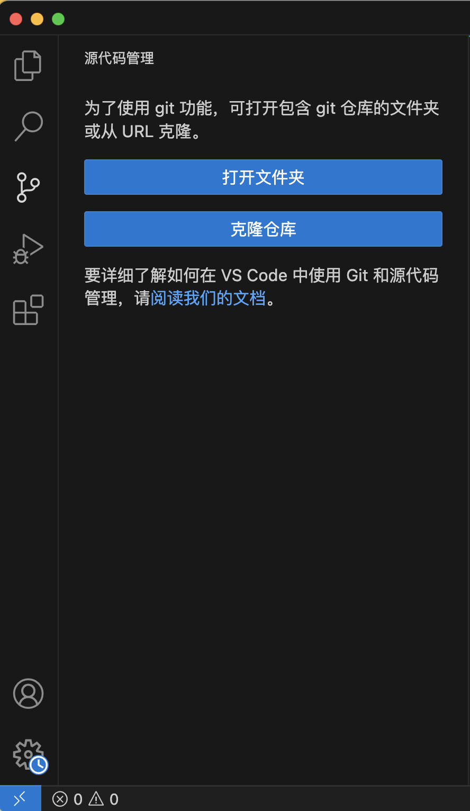

当选择从远程克隆仓库时，输入远程仓库地址，按下回车即可：

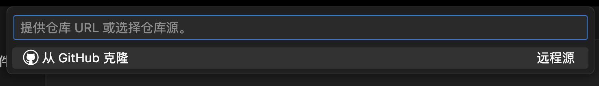

这里可以输入 Git 链接来克隆，可以是 Github、Gitlab、GItee，或者私有部署的 Git 仓库链接。也可以选择从 Github 远程仓库克隆，只需登录 Github，输入查找自己的仓库，然后进行克隆即可。

克隆完成之后，会将文件存储在本地，直接打开即可。

## git clone

在 Git 中，分支允许同时处理代码库的多个版本。可以在源代码管理边栏的最下面看到当前所在的分支：

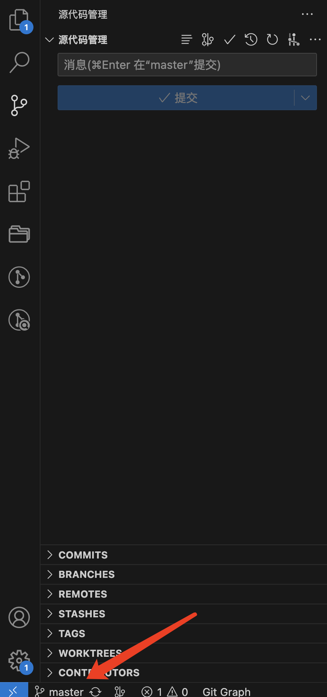

## git branch

如果这个分支没有变动，只会显示一个分支名，如果有修改，分支名的右上角会有一个 `*`，就像这样：

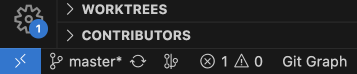

要想切换分支，需要点击这个分支名称，就会出现所有分支的列表：

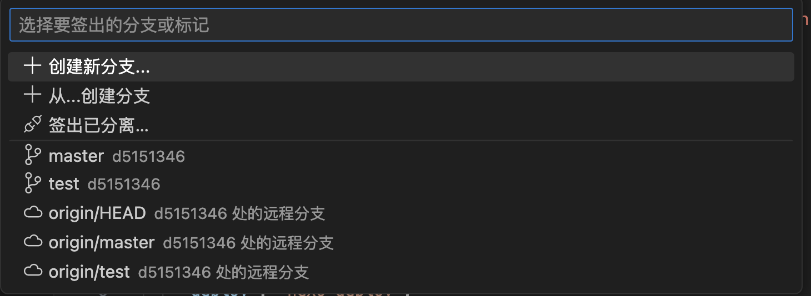

可以看到，这里面有两类分支，一类是带分支图标的，另一类是带云图标的。前者表示本地分支，后者表示远程分支。点击本地分支，就会切换到对应的分支，点击远程分支，就会远程分支同步到本地，并在本地创建一个同名的分支。

如果想重命名分支，可以执行以下操作：

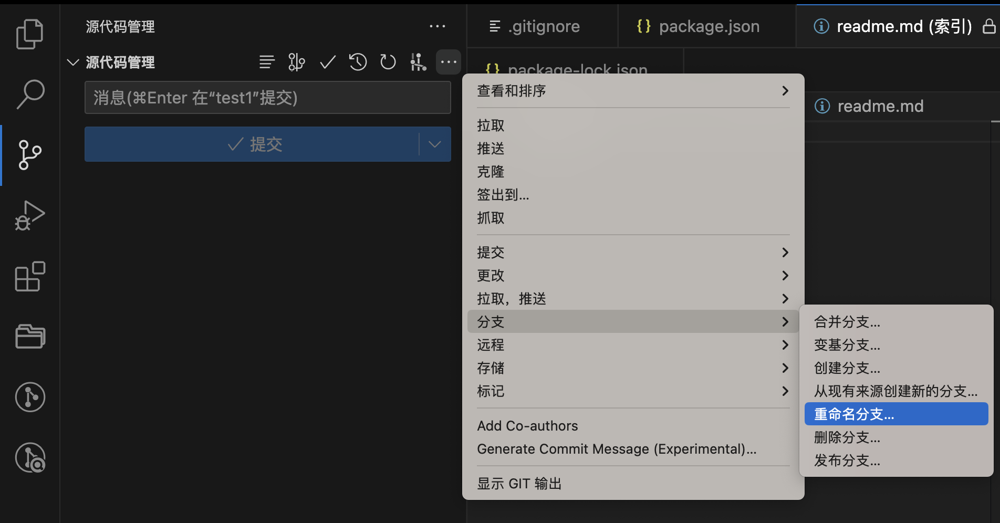

点击之后，输入新的分支名即可。

如果分支不需要了，也可以删除分支，不过需要注意，如果想删除某个分支，需要先切换到别的分支。

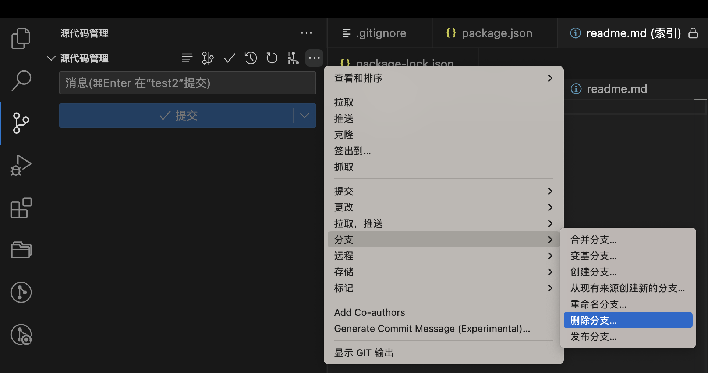

点击删除分支，然后选择要删除的分支即可。

## git rebase

可以按照以下步骤来执行变基操作：

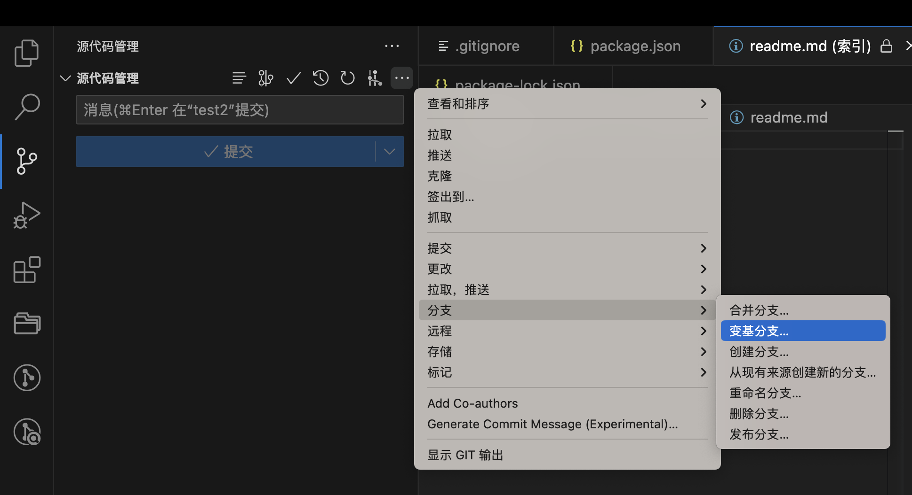

## git checkout

最上面有两个分支创建操作，第一个是从当前分支创建一个新分支，输入新分支名即可创建。第二个是从指定分支创建一个新分支，需要先选取从哪个分支创建，然后输入新分支名即可：\
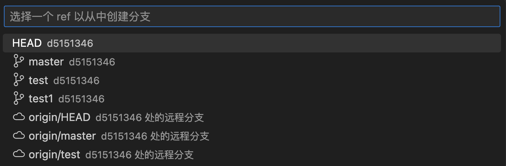

如果是使用第一种方式来创建新分支，那当前分支的更改也会带到新分支上。

## git merge

如果想要合并分支，可以执行以下操作：

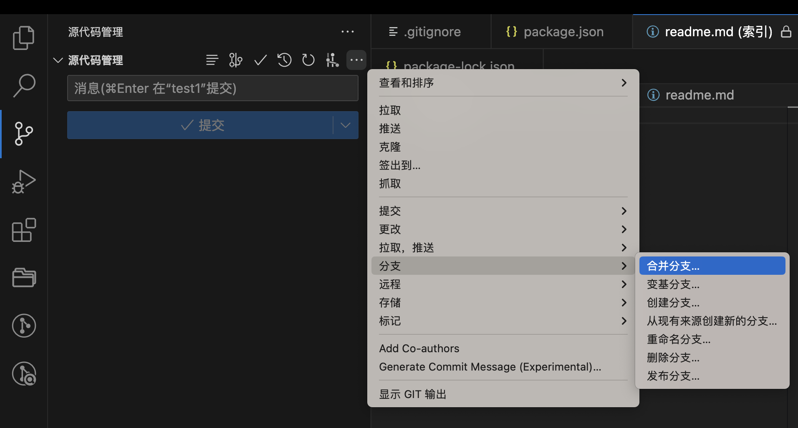

点击之后，需要选择从哪个分支向当前分支进行合并，选择被合并的分分支即可。

## git push

新创建的分支可以点击“**发布 Branch**”按钮来发布到远程仓库：

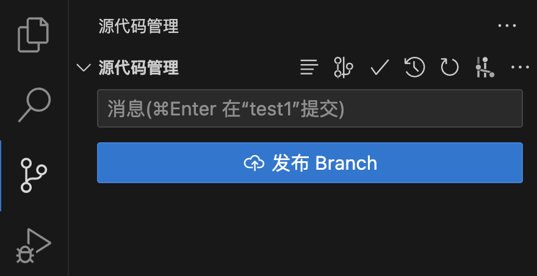

当我们进行代码的修改之后，在源代码管理边栏中可以看到更改的文件：

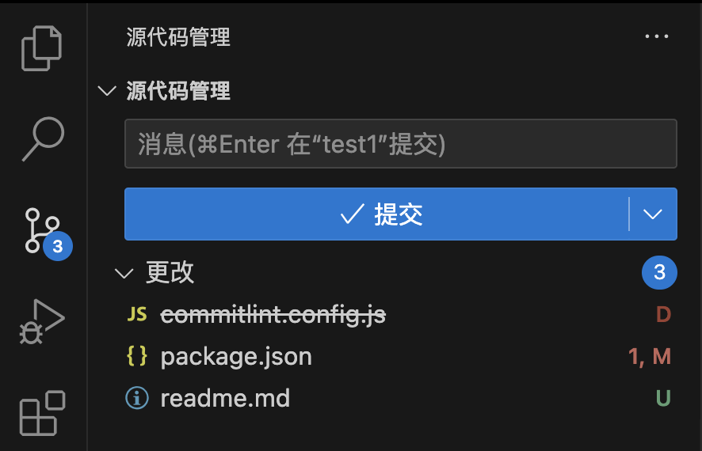

* 如果是删除某个文件，那在更改中显示的文件名上会有一个删除线，并且最后会有一个 `D` 标志，表示已删除；
* 如果是修改某个文件，那在更改中显示的文件名最后有个 `M` 标志，表示已修改，如果这个文件存在代码检查的错误，会在 `M` 前显示错误的数量，比如上面的 package.json 中就有 1 个错误。
* 如果是新增一个文件，那在更改中显示的文件名最后有个 `U` 标志，表示未跟踪的，因为是新增的文件，所以是未跟踪。

## git add

如果想暂存所有文件，可以鼠标悬浮在“更改”那一行，并点击后面的 ➕ 即可：

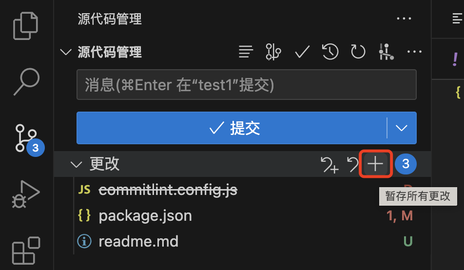

如果只是想暂存某些文件，可以鼠标悬浮在需要更改的文件名上，并点击后面的 ➕ 即可：

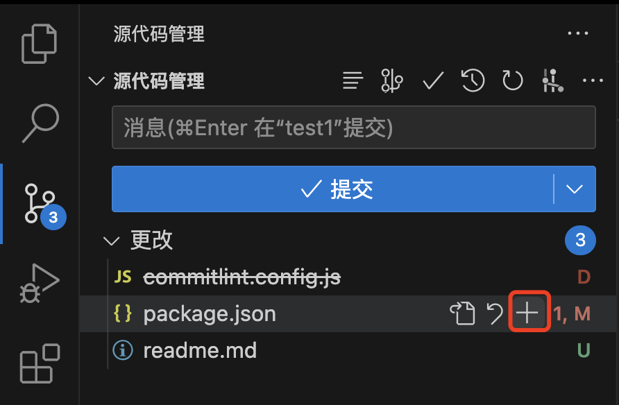

这个暂存操作就相当于执行 `git add` 命令。这里暂存其中两个，暂存完之后是这样的：

## git reset

如果想取消更改，只需点击更改后面的撤销按钮（全部撤销）或者文件后面的撤销按钮（撤销单个）即可：

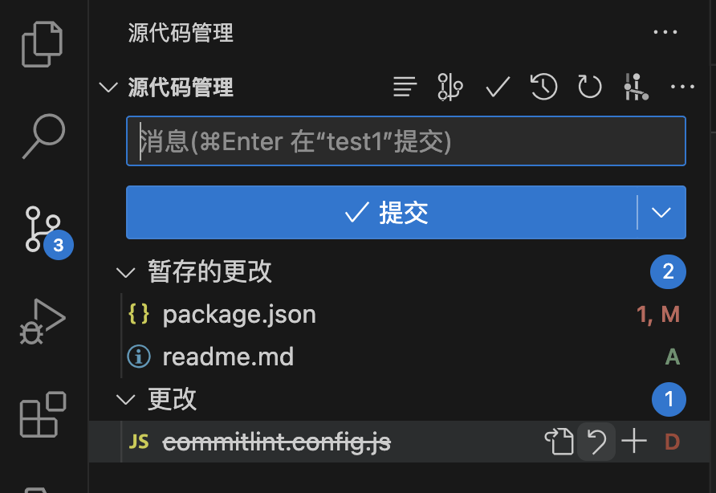

## git commit

对于暂存的文件，可以进行commit 操作。只需在上面的输入框输入commit 信息，然后点击“提交”按钮即可：

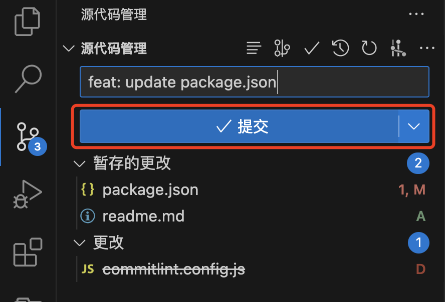

对于未 commit 的文件，也是可以撤销的，只需点击暂存的更改那一行的➖或者需要撤销的文件后面的➖，点完之后，这些文件就会回到更改中，可以继续进行修改：

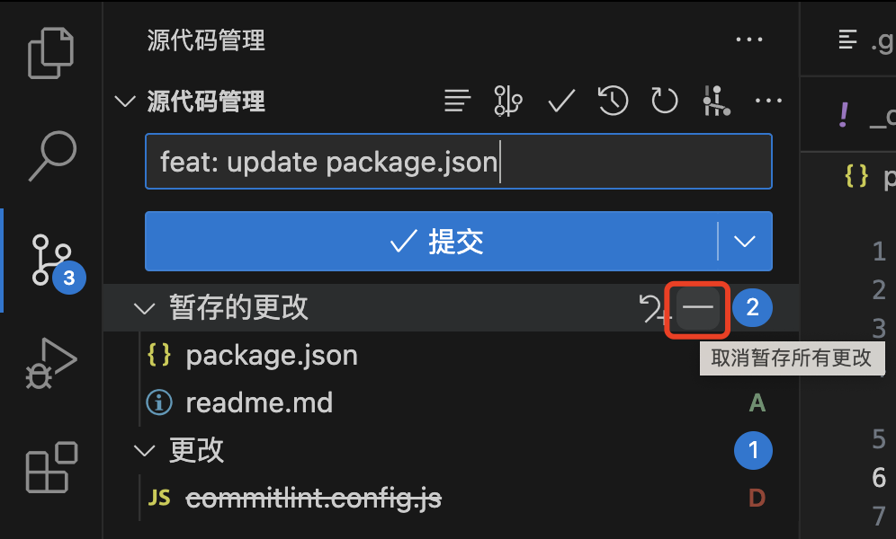

## git stash

可以看到，无论是更改中，还是在暂存的更改中，都会有一个类似于撤回的按钮，比撤回按钮多了一个➕，这个按钮就是 stash 的意思，也就是把当前的修改暂存起来，然后在需要的时候取出来暂存的内容，以继续进行修改。当我们在开发一个需求过程中，需要紧急去别的分支进行操作，就可以先把已经更改的内容暂存起来，等再回来开发的时候，取出来这些内容，继续开发即可。

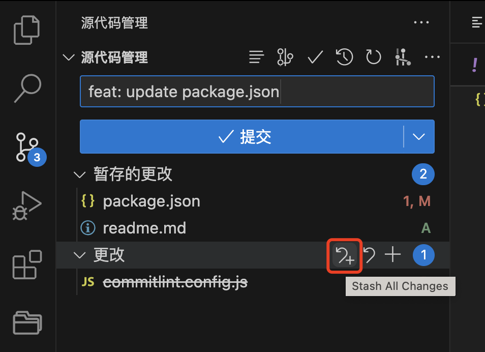

这里我们将暂存的更改和更改都先暂存起来。可以选择弹出最新的（最后一次暂存）暂存，也可以选择性弹出暂存：

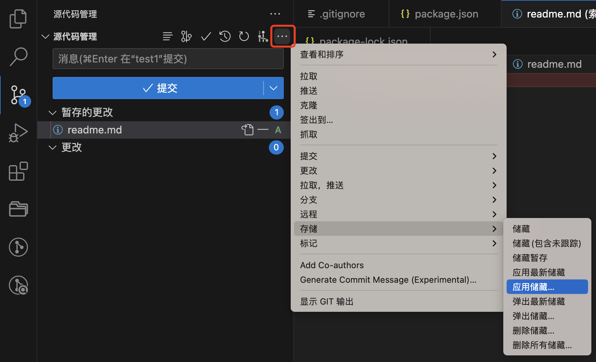

可以看到，VS Code 支持储藏暂存、应用暂存、弹出暂存、删除暂存。这里不再一一介绍。

值的注意是，在源代码管理边栏中，也可以点击最下面的 STASHES 来查看已暂存的文件：

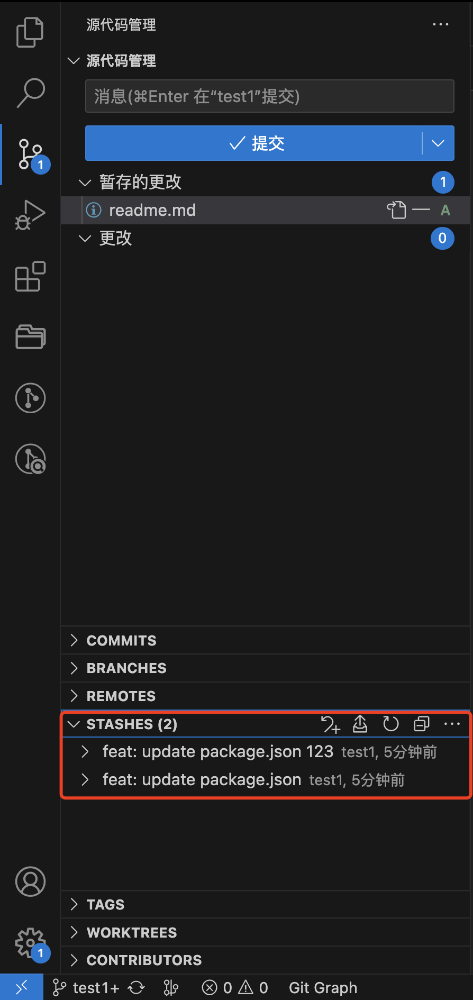

这里，可以进行应用暂存、删除暂存、修改暂存名称等操作：

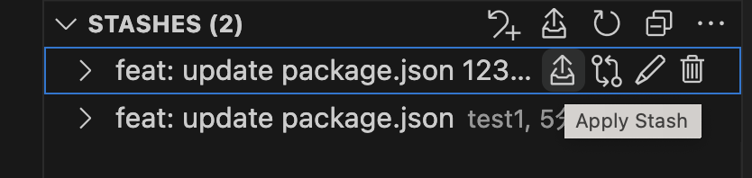

## git push

当我们修改完代码之后，就需要推送代码到远程了，可以点击蓝色的同步更改按钮，也可以点击下面分支的更改按钮，来同步更改。

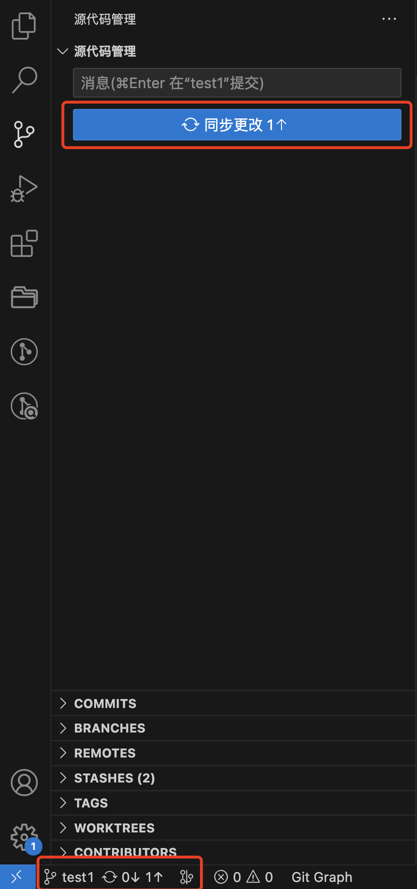

可以看到蓝色按钮的↑箭头旁边有一个数字，它表示 commit 的数量。如果远程分支比本地分支领先，还有又一个↓箭头，旁边也会有一个数字，表示远程分支比本地分支领先的 commit 数量。

## git pull

如果需要从远程分支向本地分支同步代码，可以点击拉取：

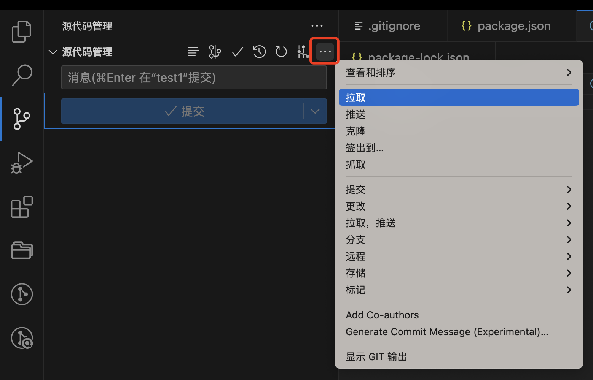

## git tag

可以点击创建标记来创建标签：

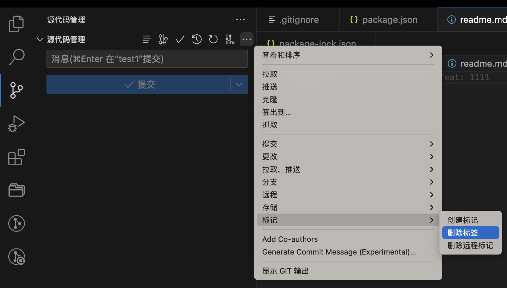

当然，也可以在下面的 TAGS 中管理所有标签：

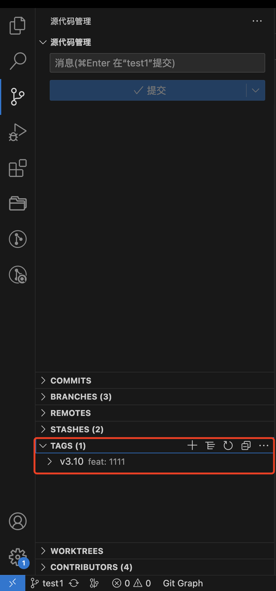

## 合并冲突

当合并代码出现冲突时，VS Code 中会显示当前的更改的和传入的更改，可以选择保留其中一个，也可以全部保留：

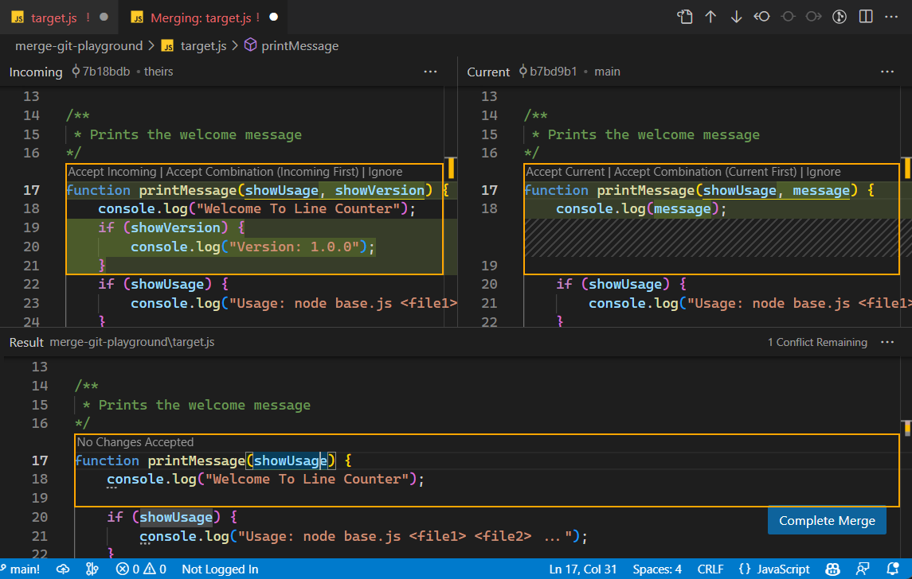

###

> 更新: 2024-01-09 17:00:56  
> 原文: <https://www.yuque.com/cuggz/feplus/ofh2t3h4sueydhso>