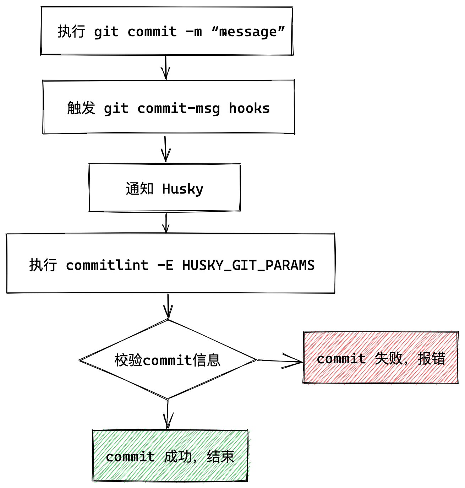
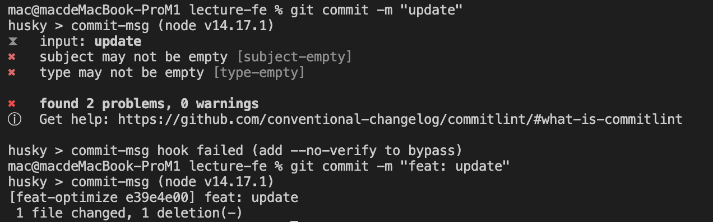

# 如何配置 Git 提交代码检查？

## 1. 基本概述

在多人协同的团队中，规范化的提交信息更易读，便于查找。每个人的 git commit 的信息不一样，没有一个机制就很难保证规范化。而 commitlint 就可以帮助我们解决这个问题。Commitlint 是一个自动化工具，它可以用来检查提交约定，如果提交不符合规范，则会拒绝该提交。当然，这些规则是可以配置的。

使用 commitlint 的优点：

* **自动变更日志**：由于遵循标准约定的提交，可以使用`standard-version` 等工具自动生成变更日志；
* **更好地理解提交**：具有特定类型和范围的提交将帮助我们了解提交更改了哪些代码；
* **遵守特定约定**：多人协作的的大项目中，commitlint 可以阻止不规范的提交，以便提交遵守定义的约定。

Git 允许开发人员在触发特定事件时执行一些操作，它被成为git hook。我们可以在git工作流程的很多阶段执行操作，例如：

* `pre-commit`
* `pre-push`
* `pre-rebase`
* `post-update`

然而，这需要在本地的 `.git` 文件中配置的，因此在默认情况下，每个开发人员都需要安装需要的 hook，这样才能执行特定的检查。幸运的是，Husky 可以帮助我们解决这个问题，husky 可以让我们在项目中方便添加 git hooks。Husky 不仅可以用于强制执行提交约定，还可以在提交时运行静态代码分析、测试、自动代码格式化等。

因此我们可以使用`Husky`和`commitlint`来检查提交信息是否符合提交规范。

## 2. 安装配置

由于 Commitlint 使用了 Husky，我们需要先安装它。Husky 是作为开发依赖项提供的，因此它仅在本地使用，不会与生产代码捆绑在一起。在终端中执行以下命令来安装Husky：

```shell
// 使用npm安装
npm install --save-dev husky

// 使用yarn安装
yarn add husky --dev
```

现在我们需要定义一个 Hook 来检查提交信息，这个 hook 叫做 commit-msg，需要在 `package.json` 中定义：

```json
"husky": {
  "hooks": {
      "commit-msg": "commitlint -E HUSKY_GIT_PARAMS"
  }
}
```

或者，我们也可以项目的根目录定义一个`.huskyrc`配置文件，在这个配置文件中单独定义 Husky 配置：

```json
{
  "hooks": {
      "commit-msg": "commitlint -E HUSKY_GIT_PARAMS"
  }
}
```

这段代码就告诉git hooks，当我们执行 `git commit -m 'message'` 时将触发`commit-msg` 事件钩子并通知 husky，从而执行 `commitlint -e $GIT_PARAMS`命令。该命令会读取`commitlint.config.js` 配置的规则并对提交的信息进行校验，若校验不通过，就会在终端中输出错误，`commit` 被终止。

有了 Husky，接下来就需要安装 Commitlint CLI，它将由 Husky hook 执行以验证提交消息：

```shell
// 使用npm安装
npm install --save-dev @commitlint/cli

// 使用yarn安装
yarn add @commitlint/cli --dev
```

Commitlint 只是用于检查提交消息是否符合规范的工具。所以，我们还需要一个提交规范。这个配置是完全可以自定义的，当然，Commitlint 提供了当前支持的配置之外的一些配置：

* [@commitlint/config-conventional](https://github.com/conventional-changelog/commitlint/tree/master/%40commitlint/config-conventional)
* [@commitlint/config-lerna-scopes](https://github.com/conventional-changelog/commitlint/tree/master/%40commitlint/config-lerna-scopes)
* [@commitlint/config-patternplate](https://github.com/conventional-changelog/commitlint/tree/master/%40commitlint/config-patternplate)
* [@commitlint/config-angular](https://github.com/conventional-changelog/commitlint/tree/master/%40commitlint/config-angular)
* [@commitlint/config-angular-type-enum](https://github.com/conventional-changelog/commitlint/tree/master/%40commitlint/config-angular-type-enum)

Commitlint 推荐使用 `config-conventional` 配置去规范 `commit`，安装命令如下：

```shell
// 使用npm安装
npm install --save-dev @commitlint/config-conventional

// 使用yarn安装
yarn add @commitlint/config-conventional --dev
```

最后一步，我们需要创建一个 Commitlint 配置文件，在文件中可以定义需要使用的配置，也就是上面刚安装的配置规范。只需要在项目的根目录创建一个名为`commitlint.config.js`的规范：

```json
module.exports = {
    extends: ['@commitlint/config-conventional'],
};
```

到这里就完成了 Husky 和 Commitlint 的安装和配置。其执行流程如下：



## 3. 提交规范

Commitlint 推荐使用 `config-conventional` 配置，它的提交格式如下：

```shell
git commit -m <type>[optional scope]: <description>
```

这里面有三个参数：

* `type`：必须，表示提交的改动类型；
* `optional scope`：可选，表示提交的修改范围，需要使用括号包裹；
* `description`：必须，表示提交的内容描述。

常见的 type 类型如下：

* **build:** 影响构建组件的更改，如构建工具、依赖项、项目版本等；
* **chore:**  比如构建流程、辅助工具等的更改。
* **ci:** 持续集成的更改；
* **docs:** 影响文档的更改。
* **feat:** 引入新功能的更改。
* **fix:** 修补错误的更改。
* **perf:** 优化相关，比如提升性能、体验。
* **refactor:** 代码重构的更改。
* **revert:** 还原先前提交的更改。
* \*\*style: \*\*代码格式的更改（空格、格式、缺少分号等）。
* **test:** 添加缺失测试或纠正现有测试的更改。

例如：

```shell
git commit -m 'feat: 增加 xxx 功能'
git commit -m 'feat(xx模块): 增加 yyy 功能'
git commit -m 'fix: 修复 xxx 问题'
```

下面是一个git提交信息的例子：



下面来看看`config-conventional` 配置是如何定义的：

```shell
module.exports = {
	parserPreset: 'conventional-changelog-conventionalcommits',
	rules: {
		'body-leading-blank': [1, 'always'],
		'body-max-line-length': [2, 'always', 100],
		'footer-leading-blank': [1, 'always'],
		'footer-max-line-length': [2, 'always', 100],
		'header-max-length': [2, 'always', 100],
		'scope-case': [2, 'always', 'lower-case'],
		'subject-case': [
			2,
			'never',
			['sentence-case', 'start-case', 'pascal-case', 'upper-case'],
		],
		'subject-empty': [2, 'never'],
		'subject-full-stop': [2, 'never', '.'],
		'type-case': [2, 'always', 'lower-case'],
		'type-empty': [2, 'never'],
		'type-enum': [
			2,
			'always',
			[
				'build',
				'chore',
				'ci',
				'docs',
				'feat',
				'fix',
				'perf',
				'refactor',
				'revert',
				'style',
				'test',
			],
		],
	},
};
```

这里面包含了很多配置项，这些配置项由配置名和配置数组组成，数组的第一个元素是`level`，可选值0、1、2，0为`disable`，1为`warning`，2为`error`，第二个元素为是否应用与否，可选值`always`、`never`，第三个元素是配置规则。

上面是`config-conventional`的默认规则，我们可以在 `commitlint.config.js` 配置文件中覆盖这些规则：

```shell
module.exports = {
    extends: ['@commitlint/config-conventional'],
    rules: {
      'scope-case': [0, 'never'],
      'header-max-length': [0, 'always', 120]
    }
};
```

##


> 更新: 2022-07-01 19:23:37  
> 原文: <https://www.yuque.com/cuggz/feplus/bkdb91>