# 学习 Git，看这一篇就够了！

<font style="color:rgb(5, 7, 59);background-color:rgb(253, 253, 254);">当你接触Git时，可能会被其庞大的命令集和各种概念所吓到。但实际上，Git并不要求死记硬背每一个命令，更重要的是理解其背后的基本原理和工作流程。这篇文章的目的就是帮助你简化Git的学习过程，让你发现Git其实并不需要刻意去背，只需要真正理解它，就能轻松掌握。现在，就让我们一起踏上探索Git世界的旅程吧！</font>

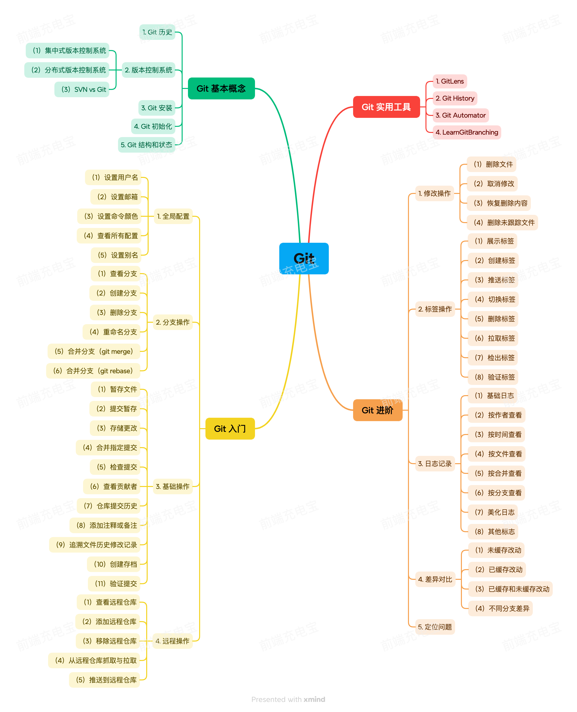

## Git 基本概念

### 1. Git 历史

Git 是最流行的分布式版本控制系统（Distributed Version Control System，简称 DVCS）。它由 Linus Torvalds 创建，当时非常需要一个快速、高效和大规模分布式的源代码管理系统，用于管理 Linux 源代码。

由于 Linus 对几乎所有现有的源代码管理系统抱有强烈的反感，因此他决定编写自己的源代码管理系列。2005 年 4 月，Git 就诞生了。到了 2005 年 7 月，维护工作就交给了 Junio Hamano，自此他就一直在维护这个项目。

虽然最初只用于 Linux 内核，但 Git 项目迅速传播，并很快被用于管理许多其他 Linux 项目。现在，几乎所有的软件开发，尤其是在开源世界中，都是通过 Git 进行的。

### 2. 版本控制系统

版本控制是指对软件开发过程中各种程序代码、配置文件及说明文档等文件变更的管理，是软件配置管理的核心思想之一。版本控制技术是团队协作开发的桥梁，助力于多人协作同步进行大型项目开发。软件版本控制系统的核心任务就是查阅项目历史操作记录、实现协同开发。

常见版本控制主要有两种：**集中式版本控制**和**分布式版本控制**。

#### （1）集中式版本控制系统

集中式版本控制系统，版本库是集中存放在中央服务器的。工作时，每个人都要先从中央服务器获取最新的版本。完成之后，再把自己添加/修改的内容提交到中央服务器。所有文件和历史数据都存储在中央服务器上。SVN 是最流行的集中式版本控制系统之一。

集中式版本控制系统的缺点就是必须联网才能使用，如果使用局域网还好，速度会比较快。而如果是使用互联网，网速慢的话，就可能需要等待很长时间。除此之外，如果中央服务器出现故障，那么版本控制将不可用。如果中心数据库损坏，若数据未备份，数据就会丢失。

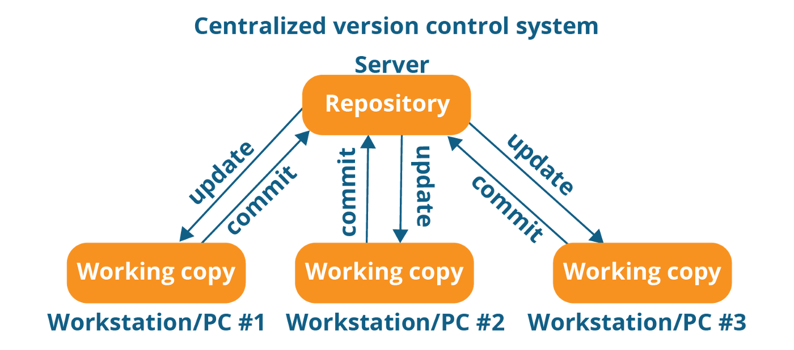

#### （2）分布式版本控制系统

分布式版本控制系统，每台终端都可以保存版本库，版本库可以不同，可以对每个版本库进行修改，修改完成后可以集中进行更新。虽然它没有中心服务器，但可以有一个备份服务器，它的功能有点类似于 SVN 的中央服务器，但它的作用仅是方便交换修改，而不像 SVN 那样还要负责源代码的管理。Git 是最流行的分布式版本控制系统之一。

和集中式版本控制系统相比，分布式版本控制系统的安全性要高很多，因为每个人电脑里都有完整的版本库，某一个人的电脑损坏不会影响到协作的其他人。

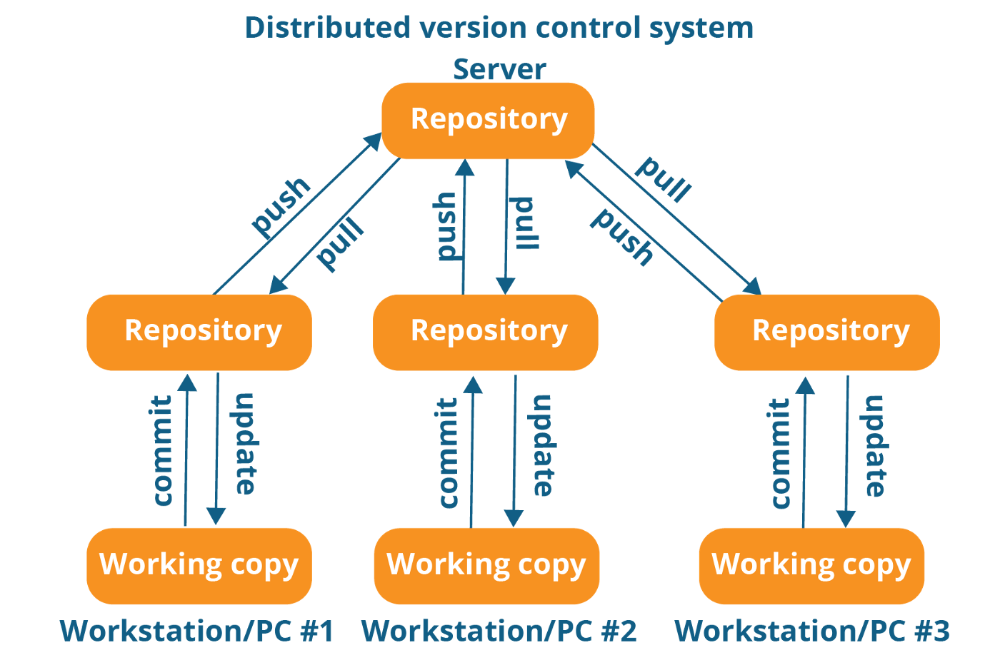

#### （3）SVN vs Git

Git 相较于 SVN：

* \*\*提交速度更快：\*\*因为在 SVN 中需要更频繁地提交到中央存储库，所以网络流量会减慢每个人的速度。而使用 Git，主要在本地存储库上工作，只需每隔一段时间才提交到中央存储库。
* \*\*没有单点故障：\*\*使用 SVN，如果中央存储库出现故障，则在修复存储库之前，其他开发人员无法提交他们的代码。使用 Git，每个开发人员都有自己的存储库，因此中央存储库是否损坏并不重要。开发人员可以继续在本地提交代码，直到中央存储库被修复，然后就可以推送他们的更改；
* \*\*可以离线使用：\*\*与 SVN 不同，Git 可以离线工作，即使网络失去连接，也可以继续工作而不会丢失功能。

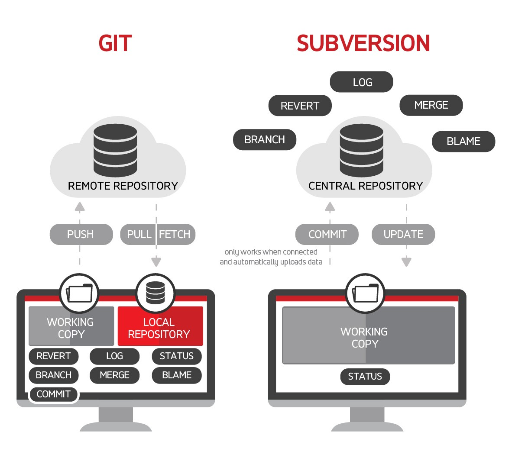

### 3. Git 安装

在Git官网下载、安装即可：<https://git-scm.com/download>

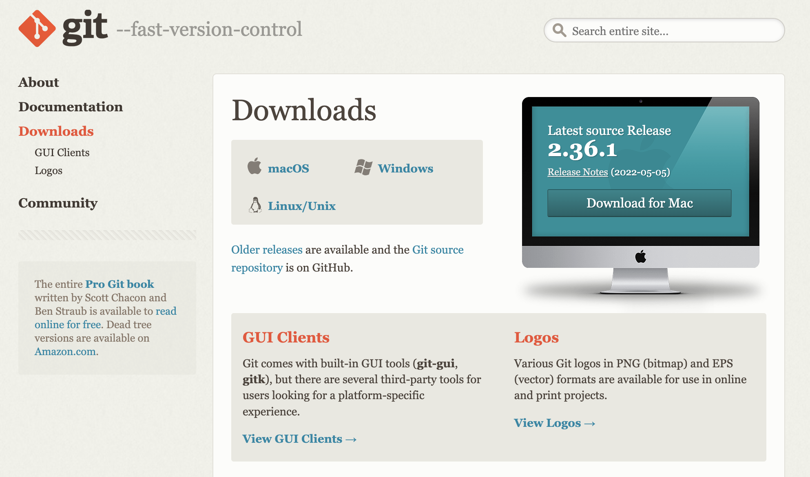

安装完成之后，可以使用以下命令来查看 Git 是否安装成功：

```bash
git --version
```

如果安装成功，终端会打印安装的 Git 的版本：

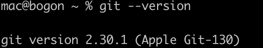

### 4. Git 初始化

要给项目初始化一个Git仓库，可以在终端中打开项目目录，执行以下命令即可：

```bash
git init
```

初始化之后，就会创建一个名为`.git`的新子文件夹，其中包含 Git 将用于跟踪项目更改的多个文件和更多子目录：

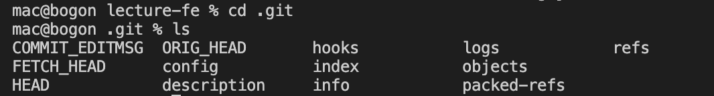

在使用 Git 进行代码管理时，不希望一些文件出现在跟踪列表中，比如`node_modules`文件。这种情况下，可以在项目的根目录中创建一个名为.gitignore的文件，在该文件中列出要忽略的文件和文件夹，来看一个示例：

```bash
# 所有以.md结尾的文件
*.md  

# lib.a不能被忽略
!lib.a

# node_modules和.vscode文件被忽略
node_modules
.vscode

# build目录下的文件被忽略
build/

# doc目录下的.txt文件被忽略
doc/*.txt

# doc目录下多层目录的所有以.pdf结尾的文件被忽略
doc/**/*.pdf
```

注意：以 # 符号开头的行是注释。

我们可以在本地克隆Git存储库上的代码，首先要找到Git存储库上的HTTPS或SSH的地址，如下：

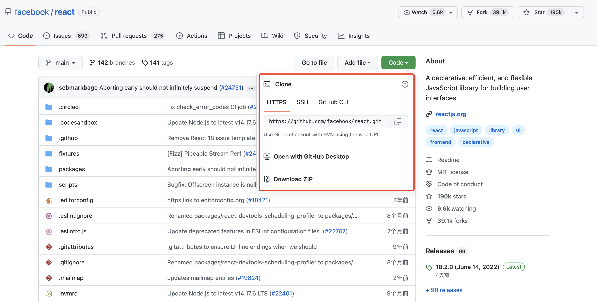

然后使用以下命令将远程仓库克隆到本地：

```bash
git clone https://github.com/facebook/react.git
```

### 5. Git 结构和状态

从Git的角度来看，可以在三个区域进行文件更改：工作区，暂存区和存储库。

* \*\*工作区：\*\*本地看到的工作目录；
* \*\*暂存区：\*\*一般存放在 `.git` 目录下的 index 文件（.git/index）中，所以暂存区有时也叫作索引（index）。暂存区是一个临时保存修改文件的地方；
* \*\*版本库：\*\*工作区有一个隐藏目录 `.git`，这个不算工作区，而是 Git 的版本库，版本库中存储了很多配置信息、日志信息和文件版本信息等。

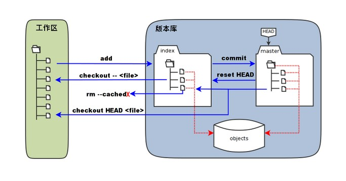

Git 工作目录下的文件存在两种状态：

* untracked：未跟踪，未被纳入版本控制，即该文件没有被Git版本管理；
* tracked：已跟踪，被纳入版本控制，即该文件已被Git版本管理。

其中**已跟踪状态**可以细分为以下三种状态：

* Unmodified：未修改状态
* Modified：已修改状态
* Staged：已暂存状态

可以通过运行以下命令来检查当前分支的状态：

```bash
git status
```

显示结果如下：

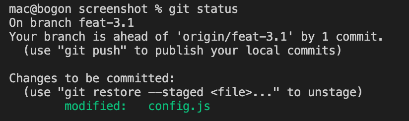

此命令不会更改或更新任何内容。它会打印出哪些文件被修改、暂存或未跟踪。未跟踪的文件是尚未添加到 git 索引的文件，而自上次提交以来已更改的文件将被视为已被 git 修改。

## Git 入门

### 1. 全局配置

当安装Git后首先要做的就是配置所有本地存储库中使用的用户信息。每次Git提交都会使用该用户信息。

config 命令适用于不同的级别：

* \*\*本地级别：\*\*所有配置都仅限于项目目录。默认情况下， 如果未通过任何配置, 则git config将在本地级别写入；
* \*\*全局级别：\*\*此配置特定于操作系统上的用户，配置值位于用户的主目录中；
* \*\*系统级别：\*\*这些配置放在系统的根路径下，它跟踪操作系统上的所有用户和所有存储库。

下面的配置均为写入系统级别：

#### （1）设置用户名

可以使用以下命令设置使用 Git 时的用户名：

```bash
git config --global user.name "name"
```

可以使用以下命令查看设置的`user.name`：

```bash
git config user.name
```

#### （2）设置邮箱

可以使用以下命令设置使用 Git 时的邮箱：

```bash
git config --global user.email "email"
```

可以使用以下命令查看设置的 email：

```bash
git config user.email
```

#### （3）设置命令颜色

除了上述两个基本的设置之外，还可以设置命令的颜色，以使输出具有更高的可读性：

```bash
 git config --global color.ui auto
```

#### （4）查看所有配置

通过上面的命令设置的信息会保存在本地的`.gitconfig`文件中。可以使用以下命令查看所有配置信息：

```bash
git config --list
```

如果在全局输入这个命令，就会显示全局的配置：

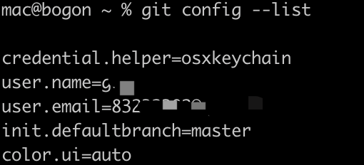

如果在使用 Git 的项目中输入该命令，除了会显示全局的配置之外，还会显式本地仓库的一些配置信息，如下：

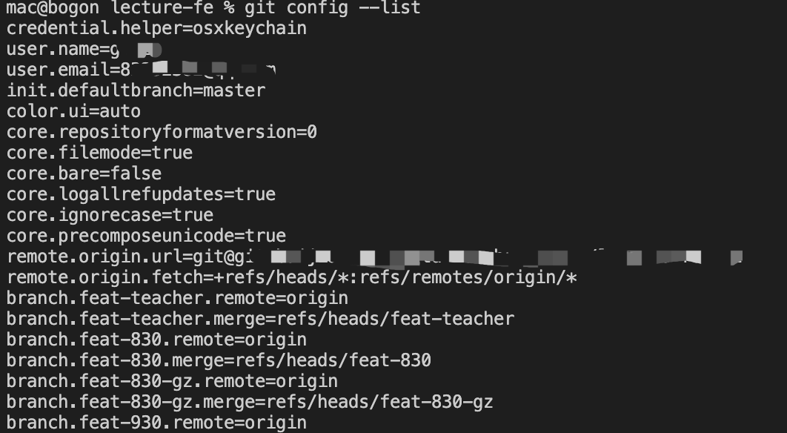

#### （5）设置别名

git config 命令为我们提供了一种创建别名的方法，这种别名通常用于缩短现有的命令或者创建自定义命令。来看一个例子：

```bash
git config --global alias.cm "commit -m"
```

这里为`commit -m`创建一个别名 `cm`，这样在提交暂存区文件时，只需要输入以下命令即可：

```bash
git cm <message>
```

### 2. 分支操作

分支是源代码控制的核心概念，它允许将工作分离到不同的分支中，这样就可以自由地处理源代码，而不会影响其他任何人的工作或主分支中的代码。下面来看一些常见的分支操作。

#### （1）查看分支

可以使用以下命令来查看当然所在的分支以及该项目所有的分支情况：

```bash
git branch 
```

该命令可以列出项目所有的**本地分支**，显示绿色的分支就是当前分支：

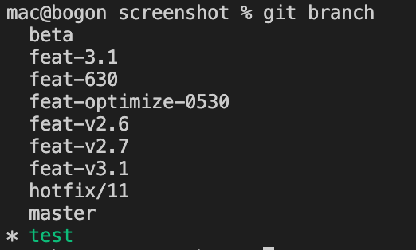

可以使用以下命令来列出所有的远程分支：

```bash
git branch -r
```

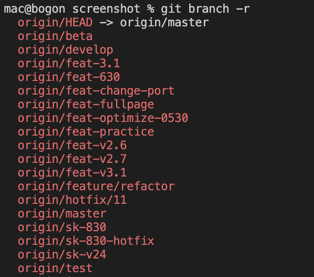

可以使用以下命令来查看所有的本地分支和远程分支：

```bash
git branch -a
```

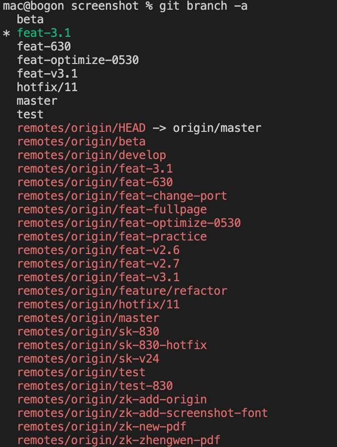

#### （2）创建分支

我们在计算机上只能访问本地分支，在将分支推送到远程仓库之前，需要先创建一个本地分支。

可以使用以下命令来创建分支：

```bash
git checkout <branch>
```

加上`-b`就可以在创建新的分支之后，直接切换到新创建的分支上：

```bash
git checkout -b <branch>
```

如果想将新建的本地分支推送到远程仓库，以在远程仓库添加这个分支。可以执行以下命令：

```bash
git push -u origin <branch>
```

#### （3）删除分支

可以使用以下命令来**删除本地分支**：

```bash
git branch -d <branch>
```

需要注意，在删除分支之前，要先切换到其他分支，否则就会报错：

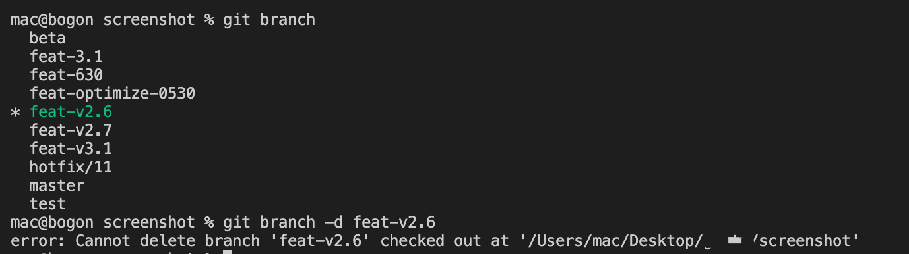

切换到其他分支再删除即可：

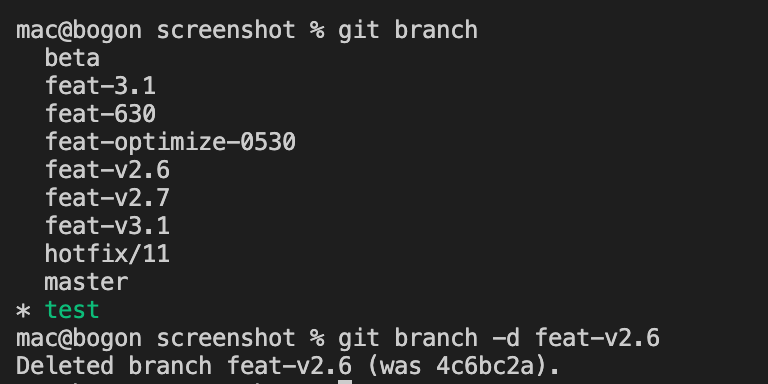

有时 Git 会拒绝删除本地分支，因为要删的分支可能有未提交的代码。这是为了保护代码以避免意外丢失数据。可以使用以下命令来**强制删除本地分支**：

```bash
git branch -D <branch>
```

这样就删除成功了：

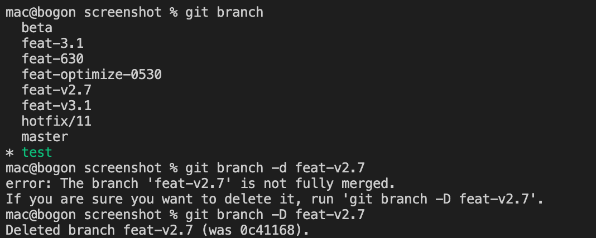

当然，我们也可以**删除远程仓库分支**，执行以下命令即可：

```bash
git push origin --delete <name>
```

#### （4）重命名分支

可以使用以下命令来将分支重命名：

```bash
git branch -m <oldname> <newname>
```

如果`newname`名字分支已经存在，则需要使用`-M`来强制重命名：

```bash
git branch -M <oldname> <newname>
```

#### （5）合并分支（git merge）

可以使用以下命令将其他分支的代码合并到当前分支：

```bash
git merge <branch>
```

如果想将A分支合并到B分支，就要先切换到B分支，然后执行命令：`git merge A`。

#### （6）合并分支（git rebase）

`git rebase` 用于将一个分支的提交记录合并到另一个分支上。

\*\*原理：\*\*通过找到两个分支的最近共同祖先，然后提取当前分支相对于该祖先的历次提交，保存为临时文件。接着，将当前分支指向目标分支的最新提交，最后依序应用之前保存的修改。这样，就可以将一个分支上的修改“移动”到另一个分支上，实现代码的整合。

使用`git rebase`的步骤如下：

1. 确保在正确的分支上，并且该分支已经与远程分支同步。可以使用`git checkout`命令切换到目标分支，并使用`git pull`命令拉取最新的代码。
2. 执行`git rebase`命令，并指定要合并的分支。例如，如果你想要将当前分支的提交记录合并到名为`feature`的分支上，可以执行`git rebase feature`命令。
3. Git会开始分析两个分支的提交记录，并尝试自动合并它们。如果出现冲突，你需要手动解决冲突，并使用`git add`命令标记已解决的文件。然后，使用`git rebase --continue`命令继续合并过程。
4. 如果在合并过程中遇到无法自动解决的冲突，可以使用`git rebase --abort`命令中止合并，并返回到原来的状态。
5. 一旦所有提交记录都成功合并，可以使用`git push`命令将更改推送到远程仓库。

假设有一个名为`feature`的分支，它包含了一些新功能的开发代码。同时，还有一个名为`master`的主分支，用于发布稳定版本的代码。现在，想要将`feature`分支上的代码合并到`master`分支上。

首先，切换到master分支，并拉取最新的代码：

```bash
git checkout master  
git pull origin master
```

然后，执行`rebase`命令，将`feature`分支的提交记录合并到master分支上：

```bash
git rebase feature
```

Git会开始分析两个分支的提交记录，并尝试自动合并它们。如果出现冲突，需要手动解决冲突，并使用`git add`命令标记已解决的文件。例如，假设在合并过程中出现了一个名为`conflict.txt`的文件冲突，你可以使用文本编辑器打开该文件，解决冲突，然后执行以下命令：

```bash
git add conflict.txt  
git rebase --continue
```

一旦所有冲突都解决并且所有提交记录都成功合并，可以使用`git push`命令将更改推送到远程仓库：

```bash
git push origin master
```

这样就成功地将`feature`分支上的代码合并到了`master`分支上，并保持了提交历史的清晰和整洁。

`git rebase`和`git merge`都是用于将不同分支的代码整合到一起的Git命令，但它们在实现方式、结果和适用场景上有一些区别。

* **实现方式**：`git merge`是通过找到两个分支的最佳同源合并点，将两个分支中的所有提交都合并到一起，并创建一个新的合并提交。而`git rebase`则是通过找到两个分支的最近共同祖先，提取当前分支相对于该祖先的历次提交，然后将当前分支指向目标分支的最新提交，最后依序应用之前保存的修改。
* **结果**：从最终效果来看，`git merge`和`git rebase`都是将不同分支的代码融合在一起。但是，它们生成的代码树稍有不同。`git merge`会生成一个新的合并点，保留了历史记录中的多个分支合并点，使得历史记录更加复杂。而`git rebase`则会将提交历史“拉直”，使得提交历史看起来像是一条直线，没有分叉，历史记录更加简洁。
* **适用场景**：`git merge`适用于保留完整的提交历史，因为它保留了每个分支的合并点，有助于追踪历史记录。它是更为保守的合并方法，相对简单。而`git rebase`适用于追求整洁的提交历史，因为它通过重写历史记录来避免不必要的合并提交和分叉。然而，使用`rebase`时需要更多的注意力和精细的操作，因为它可能导致原有的提交变得不可用。

### 3. 基础操作

Git 数据工作流程如下：

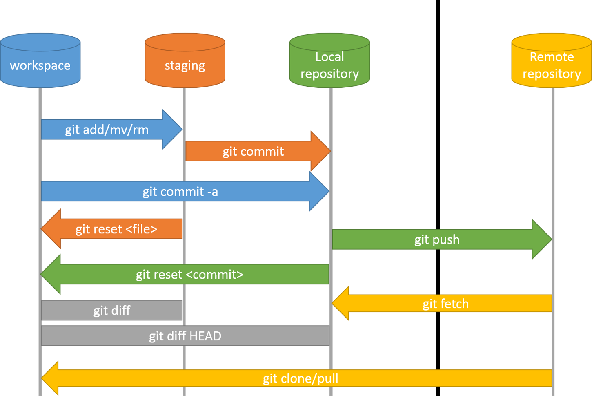

#### （1）暂存文件

可以使用以下命令来暂存已修改的文件，命令最后需要指定要暂存的文件名称：

```bash
git add <filename>
```

如果想要将所有未跟踪和修改的文件添加到暂存区，可以执行以下命令：

```bash
git add .
```

此时分支的状态如下：

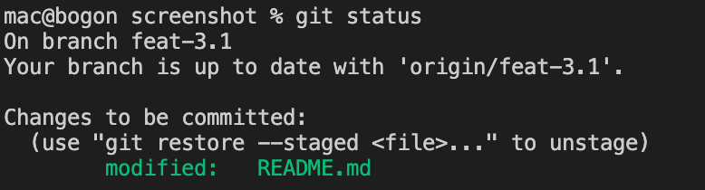

#### （2）提交暂存

可以使用以下命令将暂存区的文件修改提交到本地仓库，

```bash
git commit -m "meaasge"
```

其中`-m`参数表示`message`日志信息，参数后面要加一个日志信息，用双引号括起来。

此时分支的状态如下：

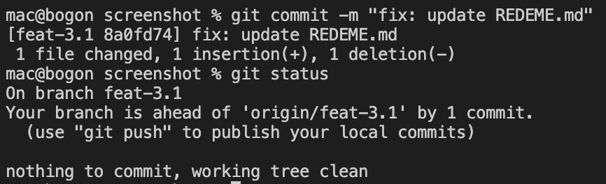

如果上次提交暂存的`messge`写错了怎么办呢？可以使用使用以下命令来更新提交，而不需要撤销并重新提交：

```bash
git commit --amend -m <message>
```

如果有一个新的文件修改，也想提交到上一个commit中，可以使用以下命令来保持相同的提交信息：

```bash
git add .
git commit --amend --no-edit
```

#### （3）存储更改

假如我们正在开发迭代功能，但是还没开发完。这时有一个紧急的bug需要修复上线。可能就需要切换到一个hotfix分支去修复bug。这时对于开发了一部分的功能创建提交是没有逻辑意义的。可以使用以下任一命令来存储修改的内容：

```bash
git stash
git stash push
git stash push -m "<stash message>"
```

该命令回保存所有未提交的更改并恢复到上次提交时存储库的状态。

当想再次继续开发此功能时，就可以使用以下命令检查所有存储：

```bash
git stash list
```

这时终端中就会显示带有时间戳的所有已经暂存的列表。可以使用以下任一命令来取回所有的更改：

```bash
git stash apply
git stash pop
```

apply 和 pop 之间的区别在于，pop 应用了 stash 中的更改并将其也从 stash 中删除，但 apply 即使在应用后仍将更改保留在 stash 中。

可以使用以下任一命令应用存储列表中的第 N 个存储：

```bash
git stash apply stash@{N}
git stash apply <n>
```

整个过程的输出如下：

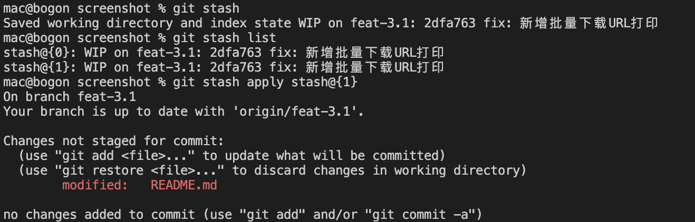

#### （4）合并指定提交

在不同分支之间进行代码合并时，通常会有两种情况：一种情况是需要另一个分支的所有代码变动，那么就可以直接合并（git merge），另一种情况是只需要部分代码的变动（某几次提交），这时就可以使用以下命令来合并指定的提交：

```bash
git cherry-pick <commit hash>
```

建议添加 `-x` 标志，因为它会生成标准化的提交消息，通知用户它是从哪里pick出来的：

```bash
git cherry-pick -x <commit hash>
```

那么这个`commit hash`是从哪里来的呢？可以在需要被合并的分支上执行以下命令：

```bash
git log
```

这时终端就会显示出所有的提交信息：

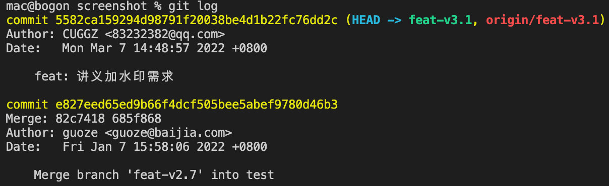

这里黄色文字中`commit`后面的部分就是`commit hash`，复制即可。

#### （5）检查提交

Git允许我们在本地检查特定的提交。输入以下命令就可以查看有关当前提交的详细信息：

```bash
git show
```

输出的结构如下，可以看到，它显示出了上次提交的commit id、作者信息（邮箱和姓名）、提交日期、commit message、代码diff等：

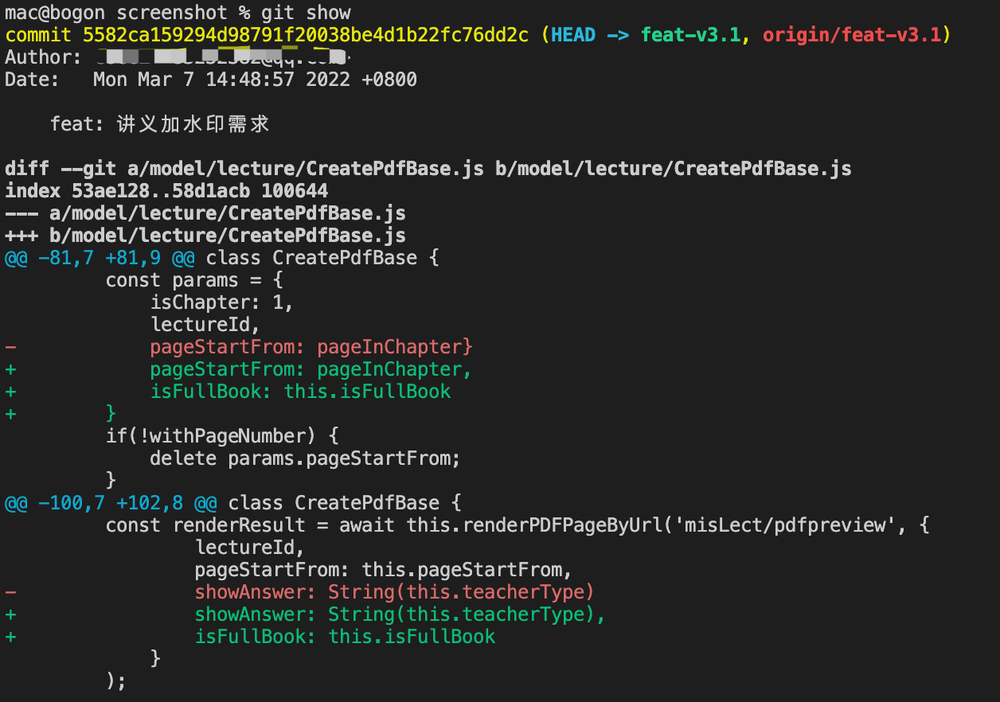

还可以使用`HEAD~n`语法或提交哈希来检查过去的提交。使用以下命令就可以获取往前数的第三次提交的详细信息：

```bash
git show HEAD~3
```

除此之外，还可以添加一个`--oneline`标志，以简化输出信息：

```bash
git show --oneline
```

这样提交信息就简洁了很多：

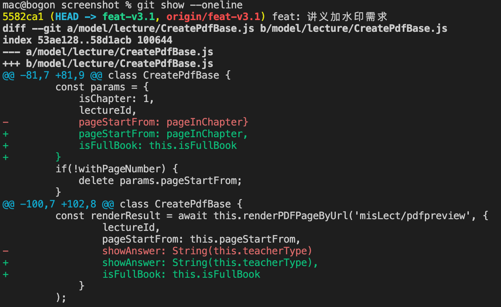

#### （6）查看贡献者

可以使用以下命令来返回每个贡献者的commit次数以及每次commit的commit message：

```bash
$ git shortlog
```

其可以添加两个参数：

* s：省略每次 commit 的注释，仅仅返回一个简单的统计。
* n：按照 commit 数量从多到少的顺利对用户进行排序。

加上这两个参数之后就可以看到每个用户中的提交次数以及排名情况：

```bash
git shortlog -sn
```

这样就会显示出该项目所有贡献者的commit次数，从上到下依次减小：

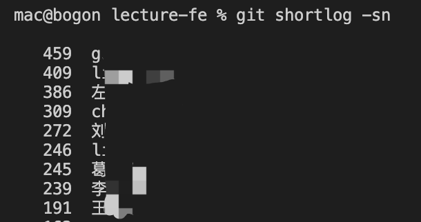

除此之外，还可以添加一个`--no-merges`标志，以忽略合并提交的次数：

```bash
 git shortlog -sn --no-merges
```

#### （7）仓库提交历史

`git rev-list` 用于列出仓库中的提交（commit）记录。它按照时间倒序显示提交记录，并可以根据不同的选项和参数进行筛选和排序。

下面是`git rev-list`的一些基本用法：

1. 列出所有提交记录：

```bash
git rev-list
```

这将显示仓库中所有的提交记录，按照时间倒序排列。每个提交记录都有一个唯一的SHA-1哈希值作为标识。

2. 列出某个分支的提交记录：

```bash
git rev-list <branch-name>
```

将`<branch-name>`替换为你要查看的分支的名称。这将显示该分支上的所有提交记录。

3. 列出某个提交之后的提交记录：

```bash
git rev-list <commit-id>..
```

将`<commit-id>`替换为你要查看的提交的`SHA-1`哈希值。这将显示该提交之后的所有提交记录。

4. 列出两个提交之间的提交记录：

```bash
git rev-list <commit-id1>..<commit-id2>
```

将`<commit-id1>`和`<commit-id2>`替换为你要查看的两个提交的SHA-1哈希值。这将显示从`<commit-id1>`到`<commit-id2>`之间的所有提交记录。

5. 列出某个文件的所有提交记录：

```bash
bash复制代码


git rev-list -- <file-path>
```

将`<file-path>`替换为你要查看的文件的路径。这将显示涉及该文件的所有提交记录。

#### （8）添加注释或备注

`git notes`允许用户为Git对象（如提交、树、标签等）添加注释或备注信息。这些注释信息是以键值对的形式存储的，其中键是一个唯一的引用，而值则是与该引用关联的注释内容。

要使用`git notes`，可以按照以下步骤进行操作：

* **添加注释**：使用`git notes add -m "Your note message" <object>`命令向一个对象添加注释。例如，要向提交`abc123`添加注释，可以执行`git notes add -m "This is a note for commit abc123" abc123`。
* **显示注释**：使用`git notes show <object>`命令显示一个对象的注释内容。例如，要显示提交`abc123`的注释，可以执行`git notes show abc123`。
* **编辑注释**：如果要编辑已存在的注释，可以使用`git notes edit <object>`命令。这将打开文本编辑器，允许编辑已存在的注释内容。编辑完成后，保存并关闭编辑器即可。
* **显示所有注释**：使用`git notes list`命令可以显示所有对象的注释信息。这将列出所有带有注释的Git对象及其对应的注释内容。

#### （9）追溯文件历史修改记录

git blame 用于追溯文件历史修改记录,它可以显示指定文件中每一行代码的最后修改者以及修改时间，帮助开发者了解代码的演变过程。

以按照以下步骤使用`git blame`命令：

1. 打开终端或命令行界面，并导航到Git仓库的根目录。
2. 运行`git blame <file>`命令，其中`<file>`是要查看历史修改记录的文件的路径。

`git blame`命令将列出文件的每一行，并显示最后一次修改该行的提交信息，包括提交的哈希值、作者、修改时间和提交注释等。这样，你可以轻松地找到代码中引入bug的提交，或者识别特定代码段的贡献者。

除了基本的用法，`git blame`命令还接受一些参数来调整输出。例如，使用`-L <start>,<end>`参数可以指定查看的行范围，只显示指定行范围内的代码修改信息。使用-p参数可以显示每一行的详细信息，包括提交的哈希值、作者、时间戳和行号。此外，还可以使用`-C`和`-M`选项来查找代码重命名和移动的情况，以便更好地追踪代码的变化。

#### （10）创建存档

`git archive` 用于创建存档（archive）文件，通常是一个压缩文件，包含了Git仓库中的特定文件或目录。这个命令允许你将Git仓库中的文件打包成一个独立的文件，方便备份、传输或发布。

要使用`git archive`命令，需要指定存档文件的格式（如.zip、.tar等），以及要包含的文件或目录。以下是一些常用的`git archive`命令的用法：

* 创建`tar`格式的存档文件，包含当前分支的最新代码：

```bash
git archive --format=tar --prefix=my-project/ HEAD | gzip > my-project.tar.gz
```

这个命令将创建一个名为`my-project.tar.gz`的压缩文件，其中包含了当前分支（HEAD）的最新代码。`--prefix`选项用于在存档文件中添加一个前缀目录`my-project/`。

* 创建zip格式的存档文件，只包含指定的文件或目录：

```bash
git archive --format=zip --output=my-files.zip path/to/file1 path/to/file2
```

这个命令将创建一个名为`my-files.zip`的压缩文件，其中只包含了指定的文件或目录。你可以通过路径来指定要包含的文件或目录。

注意，`git archive`命令只会包含文件的当前版本，而不会包含Git的元数据（如提交历史、分支信息等）。因此，存档文件主要用于备份或发布代码，而不是作为完整的Git仓库来使用。

#### （11）验证提交

`git verify-commit`用于验证提交（commit）的GPG签名。GPG（GNU Privacy Guard）是一种加密软件，可以用于为Git提交添加数字签名，以确保提交的完整性和真实性。

要使用`git verify-commit`命令，需要先确保已经为Git配置了GPG签名，并且至少有一个提交是带有GPG签名的。然后按照以下步骤进行操作：

1. 打开终端或命令行界面，并导航到Git仓库的根目录。
2. 运行`git verify-commit <commit>`命令，其中`<commit>`是要验证的提交的哈希值或引用（如分支名、标签名等）。

`git verify-commit`命令将检查指定提交的GPG签名，并输出验证结果。如果签名有效且未被篡改，命令将显示“Good signature”或类似的消息。如果签名无效或存在问题，命令将显示相应的错误消息。

除了基本的用法，`git verify-commit`命令还接受一些参数来调整输出和行为。例如，使用`--raw`参数可以打印原始的GPG状态输出，而不是人类可读的输出。使用`--verbose`参数可以打印提交对象的详细内容，以便更详细地了解验证过程。

注意，要使用`git verify-commit`命令，必须已经为Git配置了GPG签名，并且至少有一个提交是带有GPG签名的。如果提交没有签名或签名无效，该命令将无法验证提交的真实性。

### 4. 远程操作

#### （1）查看远程仓库

可以使用以下命令来查看远程仓库：

```bash
git remote
```

该命令会列出指定的每一个远程服务器的简写。 如果已经克隆了远程仓库，那么至少应该能看到 origin ，这是 Git 克隆的仓库服务器的默认名字：

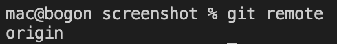

可以执行以下命令来获取远程仓库的地址：

```bash
git remote -v
```

其中`fetch`是获取，`push`是推送：

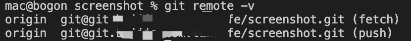

可以使用以下命令来查看更加详细的信息：

```bash
git remote show origin
```

输出结果如下：

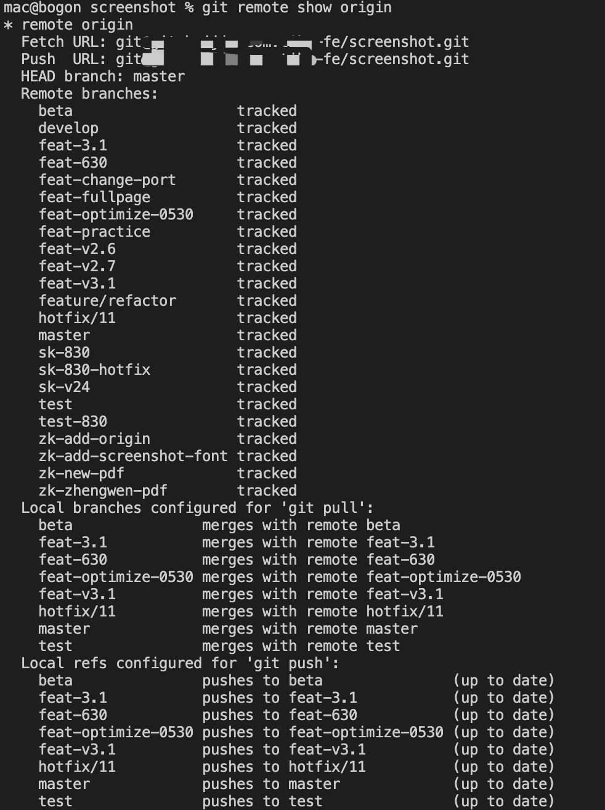

#### （2）**添加远程仓库**

可以使用以下命令来将本地项目链接到远程仓库：

```bash
git remote add <remote_name> <remote_url>
```

其中：

* `remote_name`：仓库名称（默认是origin）
* `remote_url`：远程仓库地址

该命令允许 Git 跟踪远程存储库并将本地存储库连接到远程仓库。

#### （3）**移除远程仓库**

可以使用命令来移除远程仓库：

```bash
git remote rm origin
```

需要注意，该命令只是从本地移除远程仓库的记录（也就是解除本地仓库和远程仓库的关系），并不会真正影响到远程仓库。

#### （4）**从远程仓库抓取与拉取**

可以使用以下命令来从远程仓库获取最新版本到本地仓库，不会自动merge（合并数据）：

```bash
git fetch 
```

由于该命令不会自定合并数据，所以该命令执行完后需要手动执行 git merge 远程分支到所在的分支。

可以使用以下命令来将**远程指定分支**拉取到**本地指定分支上**：

```bash
git pull origin <远程分支名>:<本地分支名>
```

使用以下命令来将**远程指定分支**拉取到**本地当前分支上**：

```bash
git pull origin <远程分支名>
```

使用以下命令开将**与本地当前分支同名的远程分支**拉取到**本地当前分支上：**

```bash
git pull
```

注意：如果当前本地仓库不是从远程仓库克隆，而是本地创建的仓库，并且仓库中存在文件，此时再从远程仓库拉取文件的时候会报错（`fatal: refusing to merge unrelated histories` ），解决此问题可以在`git pull`命令后加入参数`--allow-unrelated-histories`，即：

```bash
git pull --allow-unrelated-histories
```

#### （5）推送到远程仓库

可以使用以下命令将**本地指定分支**推送到**远程指定分支上**：

```bash
git push origin <本地分支名>:<远程分支名>
```

可以使用以下命令将**本地指定分支**推送到**与本地当前分支同名的远程分支上：**

```bash
git push origin <本地分支名>
```

使用以下命令将**本地当前分支**推送到**与本地当前分支同名的远程分支上**：

```bash
git push
```

可以使用以下命令来将本地分支与远程同名分支相关联：

```bash
git push -u origin <本地分支名>
```

由于远程库是空的，第一次推送master分支时，加上了-u参数，Git不但会把本地的master分支内容推送的远程新的master分支，还会把本地的master分支和远程的master分支关联起来，在以后的推送或者拉取时就可以简化命令为git push。

## Git 进阶

### 1. 修改操作

如果只是简单地从工作目录中手工删除文件，运行 `git status` 时就会在 Changes not staged for commit 的提示

#### （1）删除文件

可以使用以下命令将文件从暂存区和工作区中删除：

```bash
git rm <filename>
```

如果删除之前修改过并且已经放到暂存区域的话，则必须要用强制删除选项 `-f`：

```bash
git rm -f <filename>
```

如果想把文件从暂存区域移除，但仍然希望保留在当前工作目录中，换句话说，仅是从跟踪清单中删除，使用 `--cached` 选项即可：

```bash
git rm --cached <filename>
```

可以使用以下命令进行递归删除，即如果后面跟的是一个目录做为参数，则会递归删除整个目录中的所有子目录和文件：

```bash
git rm –r * 
```

进入某个目录中，执行此语句，就会删除该目录下的所有文件和子目录。

#### （2）取消修改

取消修改有三种情况：

\*\*1）未使用 \*\***git add 将修改文件添加到暂存区**

这种情况下，可以使用以下命令来撤销所有还没有加入到缓存区的修改：

```bash
git checkout -- <filename>
```

需要注意，此文件不会删除新建的文件，因为新建的文件还没加入到Git管理系统重，所以对Git来说事未知的，需要手动删除。

\*\*2）\*\***已使用 git add 将修改文件添加到暂存区，未使用 git commit 提交缓存**

这种情况下，相当于撤销了 git add 命令对于文件修改的缓存：

```bash
git reset HEAD <filename>
```

上面的命令可以撤销指定文件的缓存，要想放弃所有文件的缓存，可以执行以下命令：

```bash
git reset HEAD
```

需要注意，在使用此命令后，本地的修改并不会消失，而会回到第一种情况。要想撤销本地的修改，执行第一种情况中的命令即可。

除此之外，还可以指定返回到N次提交之前的阶段，执行以下命令即可：

```bash
git reset HEAD~N
```

这样就能退回到n个版本之前，同样不会修改本地文件的内容，这些新的内容会变成未更新到缓存区的状态。

\*\*3）\*\***已使用 git commit 提交缓存**

这种情况下，可以使用以下命令来回退到上一次 commit 的状态：

```bash
git reset --hard HEAD^
```

也可以使用以下命令来回退到任意版本：

```bash
git reset --hard <commit_id>
```

注意，使用 git log 命令来查看 git 提交历史和 commit id。

#### （3）恢复删除内容

这是一个很重要的命令，假如回退到某个旧版本，现在想恢复到新版本，又找不到新版本的`commit id`怎么办？Git 提供了下面的命令用来记录每一次命令：

```bash
git reflog show HEAD
git reflog
```

执行之后输出如下：

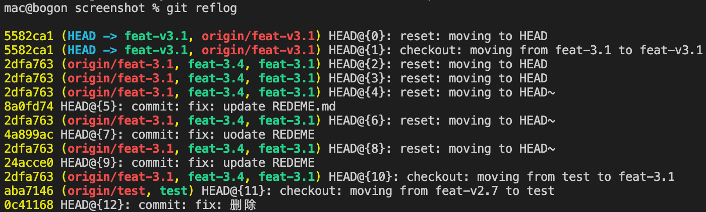

可以看到，最左侧黄色字体就是修改的 commit id，根据这个id就可以将代码恢复到对应节点位置。HEAD@{n}表示HEAD更改历史记录，最近的操作在上面。

假如需要把代码回退到`HEAD@{5}`处，可以执行以下命令：

```bash
git reset --hard HEAD@{5}
```

或者执行下面的命令：

```bash
git reset --hard 8a0fd74
```

需要注意，如果有任何本地修改，该命令也会将其销毁，因此在`reset`之前建议使用`stash`将本地修改储存。

#### （4）删除未跟踪文件

`git clean` 用于从工作目录中删除未跟踪的文件。这些文件通常是那些由编辑器、构建过程或其他工具生成的临时文件或副产品，而不是Git仓库中的一部分。使用git clean命令可以帮助保持工作目录的整洁，避免这些未跟踪的文件干扰正常的Git操作或导致意外的提交。

`git clean`命令的基本语法如下：

```bash
git clean [-dfnxq] [-e <pattern>] [-i] [-n] [-f] [-r | -R] [<path>...]
```

下面是一些常用的选项和参数：

* `-d`：删除未跟踪的目录和文件。默认情况下，`git clean`只删除未跟踪的文件。
* `-f`：强制执行删除操作，不会提示用户确认。
* `-n`：仅显示将要删除的文件和目录列表，而不实际删除它们。这可以用于检查将要删除的内容。
* `-x`：删除所有未跟踪的文件和目录，包括被`.gitignore`文件忽略的文件和目录。
* `-q`：静默模式，不输出任何信息。
* `-e <pattern>`：指定要排除的文件模式。可以使用通配符来匹配要排除的文件或目录。
* `-i`：交互式模式，会提示用户确认每个要删除的文件或目录。
* `<path>...`：指定要清理的路径。如果不指定路径，将默认清理整个工作目录。

以下是一些使用`git clean`命令的示例：

1. 删除所有未跟踪的文件和目录：

```bash
git clean -df
```

2. 仅显示将要删除的文件和目录列表：

```bash
git clean -n
```

3. 强制执行删除操作，不提示用户确认：

```bash
git clean -f
```

4. 删除所有未跟踪的文件和目录，包括被`.gitignore`文件忽略的内容：

```bash
git clean -dfx
```

注意，使用git clean命令时要小心，确保不会误删除重要的文件。在执行删除操作之前，最好先使用`-n`选项来预览要删除的内容。

`git rm` 和 `git clean` 都是删除文件，那他们之间有什么区别呢？

* `git rm`主要用于从暂存区及版本库中删除已跟踪的文件。换句话说，这个命令针对的是已经被Git管理的文件。如果你尝试使用`git rm`删除一个未被Git跟踪的文件，它将不会有任何效果。
* `git clean`命令则主要用于删除工作区中的未跟踪文件，即那些未被Git管理的文件。这些文件可能是由编辑器、构建过程或其他工具生成的临时文件或副产品。`git clean`操作其实更像纯粹的`rm`命令，但能够方便地删除未跟踪文件。

### 2. 标签操作

标签指的是**某个分支某个特定时间点的状态**，通过标签可以很方便的了解到标记时的状态。

标签有两种类型 ：

* **轻量标签 ：** 只是某个commit 的引用，可以理解为是一个commit的别名；
* \*\*附注标签 ：\*\*存储在Git仓库中的一个完整对象，包含打标签者的名字、电子邮件地址、日期时间 以及其他的标签信息。它是可以被校验的，可以使用 GNU Privacy Guard (GPG) 签名并验证。

#### （1）展示标签

可以使用以下命令来获取所有标签：

```bash
git tag
```

它会列出所有标签的名称：

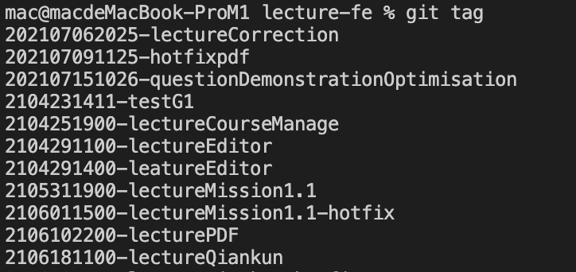

可以使用以下命令来查看某一个标签的详细信息：

```bash
git show <tag_name>
```

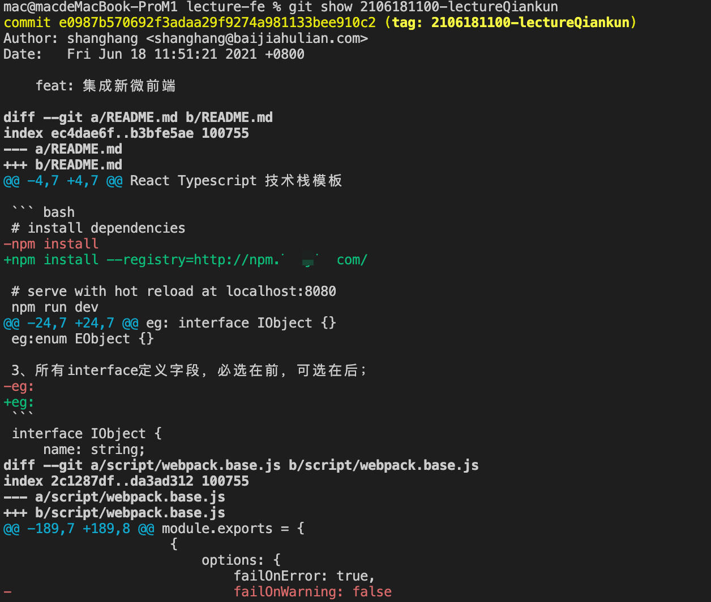

还可以根据条件来显示标签，比如列出以`v1.`开头的所有tag：

```bash
git tag -l "v1."
```

#### （2）创建标签

可以使用以下命令在本地创建新标签：

```bash
git tag <tag_name>
```

例如：

```bash
git tag v1.0.0
```

通常遵循的命名模式如下：

```bash
v<major>.<minor>.<patch>
```

* major（主版本号）：重大变化
* minor（次要版本号）：版本与先前版本兼容
* patch（补丁号）：bug修复

除此之外，我们还可以为特定的commit创建标签，其命令格式如下：

```bash
git tag <tagname> <commit_sha>
```

以上面的的形式创建的标签都属于轻量标签，下面来看看如何创建一个附注标签。

在创建标签时，可以添加一个`-a`标志以创建一个带备注的标签，备注信息使用`-m message`来指定：

```bash
git tag -a <tagname> -m "<message>"
```

#### （3）推送标签

标签创建完成之后就可以使用以下命令将其推送到远程仓库：

```bash
git push origin --tags
```

以上命令会将本地所有tag都推送到远程仓库。如果想推送指定标签，可以执行以下命令：

```bash
git push origin <tagname>
```

#### （4）切换标签

可以使用以下命令来切换标签：

```bash
git checkout <tagname>
```

#### （5）删除标签

可以使用以下命令来删除本地仓库指定标签：

```bash
git tag -d <tagname>
```

可以使用以下命令来删除远程仓库指定标签：

```bash
git push origin :refs/tags/<tagname>
```

也可以使用以下命令来删除远程仓库的指定标签：

```bash
git push origin --delete <tagname>
```

#### （6）拉取标签

可以使用以下命令来将远程仓库的标签拉取（同步）到当前分支：

```bash
git fetch --tags
```

#### （7）检出标签

检出标签实际上就是在标签的基础上进行其他开发或操作。需要以标签指定的版本为基础版本，新建一个分支，继续其他的操作。执行以下命令即可：

```bash
git checkout -b <branch> <tagname>
```

#### （8）验证标签

git verify-tag  用于验证标签（tag）的 GPG 签名。GPG（GNU Privacy Guard）是一种用于文件签名的工具，它可以确保标签的完整性和真实性，防止标签被篡改或伪造。

要使用 `git verify-tag` 命令，需要先确保已经为 Git 配置了 GPG 签名。然后，可以按照以下步骤进行操作：

1. 打开终端或命令行界面，并导航到 Git 仓库的根目录。
2. 运行 `git verify-tag <tag>` 命令，其中 `<tag>` 是要验证的标签名称。

`git verify-tag` 命令将检查指定标签的 GPG 签名，并输出验证结果。如果签名有效且未被篡改，命令将显示 "Good signature" 或类似的消息。如果签名无效或存在问题，命令将显示相应的错误消息。

除了基本的用法，`git verify-tag` 命令还接受一些参数来调整输出和行为。例如，使用 `--raw` 参数可以打印原始的 GPG 状态输出，而不是人类可读的输出。使用 `--verbose` 参数可以打印标签对象的详细内容，以便更详细地了解验证过程。

### 3. 日志记录

#### （1）基础日志

可以使用以下命令来查看分支的历史提交信息：

```bash
git log
```

这是其最基础的用法，输出如下：

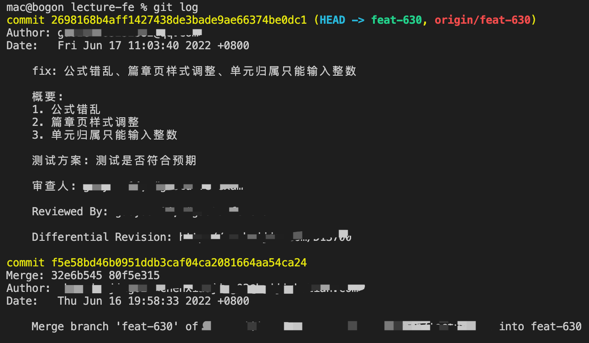

可以看到，终端上输出了该分支近期的提交记录，它包含了所有贡献者的提交。

#### （2）按作者查看

如果想只看某个人的提交，可以添加过滤条件：

```bash
git log --author="username"
```

当然也可以搜索多个作者的提交信息，只需要在用|分隔用户名即可，注意需要使用\来对|进行转义：

```bash
git log --author="username1\|usernmae2"
```

这里列出的是每次提交的详细信息，如果指向看到每个提交的概要，可以在命令中添加`--oneline`标志：

```bash
git log --author="username" --oneline
```

#### （3）按时间查看

除了可以按照作者来查看日志之外，还可以按照时间查看日志。可以查看某个时间之前的日志，也可以查看某个日期之后的日志：

```bash
//某个日期之后
git log --since=<date>
git log --after=<date>

//某个日期之前
git log --until=<date>
git log --before=<date>
```

如果想查看某个具体时间区间之间的日志，可以组合以上参数：

```bash
git log --since="2022.05.15" --until="2022.05.20"
```

#### （4）按文件查看

如果我们想查看某个文件都在哪些提交中修改了内容，也是可以的。使用以下命令即可：

```bash
git log -- <path>
```

比如查看`README.md`文件的修改记录：

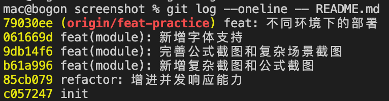

#### （5）按合并查看

在历史提交中可能会有很多次合并的提交记录，想要只查看代码合并的记录，可以执行以下命令：

```bash
git log --merges
```

如果想查看非合并操作的操作记录，可以执行以下命令：

```bash
git log --no-merges
```

#### （6）按分支查看

可以按照分支查看日志，如果想查看`test`分支比`master`分支多提交了哪些内容，就可以执行以下命令：

```bash
git log master..test
```

相反，如果想看`master`分支比`test`分支多提交了哪些内容，就可以执行以下命令：

```bash
git log test..master
```

#### （7）美化日志

git log命令可以用来查看提交历史，此命令的问题在于，随着项目复杂性的增加，输出变得越来越难阅读。可以使用以下命令来美化日志的输出：

```bash
git log --graph --oneline --decorate

```

输出结果如下，这样就能看到更简洁的细分以及不同分支如何连接在一起：

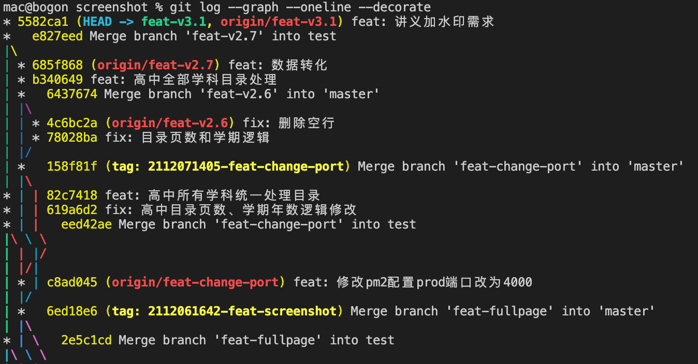

#### （8）其他标志

上面我们提到了，可以使用`--oneline`标志来简化日志的输出：

```bash
git log --oneline
```

可以使用`--stat`标志来简要显示文件增改行数统计，每个提交都列出了修改过的文件，以及其中添加和移除的行数，并在最后列出所有增减行数小计：

```bash
git log --stat
```

可以添加`-N`标志来仅显示最近N次的提交，其中`N`是一个正整数，例如查看最近三次提交：

```bash
git log -3
```

可以使用`-p`标志来展开显示每次提交的内容差异对比：

```bash
git log -p
```

注意，以上这些命令标识符都可以组合使用。

### 4. 差异对比

git diff 命令可以用来比较文件的不同，即比较文件在**暂存区**和**工作区**的差异。

#### （1）未缓存改动

当工作区有改动，暂存区为空时， diff对比的是工作区与最后一次commit提交的共同文件；

当工作区有改动，暂存区不为空时，diff对比的是工作区与暂存区的共同文件。

#### （2）已缓存改动

当已缓存改动时，可以使用以下任一命令来显示暂存区（已add但未commit文件）和最后一次commit(HEAD)之间的所有不相同文件的差异对比：

```bash
git diff --cached
git diff --staged
```

#### （3）已缓存和未缓存改动

可以使用以下命令来显示工作目录(已修改但未add文件)和暂存区(已add但未commit文件)与最后一次commit之间的的所有不相同文件的差异对比：

```bash
git diff HEAD
```

#### （4）不同分支差异

可以使用以下命令来比较两个分支上最后 commit 的内容的差别：

```bash
git diff <分支名1> <分支名2>
```

这样就可以显示出两个分支的详细差异，如果只是想看有哪些文件存在差异，可以在命令中添加`--stat`标志，这样就不会显示每个文件的内容的详细对比：

```bash
git diff <分支名1> <分支名2> --stat
```

### 5. 定位问题

`git bisect` 采用二分查找算法来帮助开发者快速定位引入问题的提交。当在代码库中遇到错误，但不确定何时引入时，git bisect可以显著提高查找错误的效率。

***

**原理：**`git bisect`使用二分查找算法来缩小引入问题的提交范围。它首先将提交历史分为两半，然后询问开发者哪一半包含引入错误的提交。基于开发者的反馈，git bisect会继续将范围缩小到更小的一半，直到找到引入问题的确切提交。

使用`git bisect`的基本步骤如下：

1. 确定一个包含错误的提交（bad commit）和一个不包含错误的提交（good commit）。这通常通过手动检查提交历史或使用其他工具来完成。
2. 从顶层工作目录开始，执行`git bisect start`来启动二分查找过程。
3. 使用`git bisect bad <bad-commit>`将包含错误的提交标记为bad。
4. 使用`git bisect good <good-commit>`将不包含错误的提交标记为good。
5. Git现在会计算出中间提交，并签出该提交。你需要通过测试来确定该提交是否包含错误。
6. 如果中间提交包含错误，执行`git bisect bad`。如果不包含错误，执行`git bisect good`。
7. Git将基于你的反馈继续缩小范围，并签出下一个中间提交。重复步骤5和6，直到找到引入问题的确切提交。
8. 一旦找到引入问题的提交，`git bisect`将打印出相应的提交哈希。你可以使用`git bisect reset`来重置工作树，完成整个查找过程。

假设正在维护一个项目，并且发现了一个错误。不确定这个错误是在何时引入的，但是知道在某个特定版本的代码中该错误是不存在的。

1. 首先，确定一个包含错误的提交（bad commit）和一个不包含错误的提交（good commit）。假设你知道在提交`abc123`时代码是工作的，而在提交`def456`时代码已经出现了错误。
2. 从项目的顶层工作目录开始，执行`git bisect start`。
3. 使用`git bisect bad def456`将提交`def456`标记为bad。
4. 使用`git bisect good abc123`将提交`abc123`标记为good。
5. Git将计算出这两个提交之间的中间提交，并签出该提交。你需要测试这个提交来确定是否包含错误。
6. 假设测试结果显示中间提交包含错误，执行`git bisect bad`。Git将继续在bad和中间提交之间查找。
7. 重复步骤5和6，直到Git找到引入问题的确切提交。
8. 一旦找到引入问题的提交，可以使用`git bisect reset`来重置工作树，并继续你的开发工作。

## Git 实用工具

### 1. **GitLens**

GitLens  是一个VS Code插件，可以用来查看项目的提交记录、文件修改记录、显示每行代码的提交记录等。通过丰富的可视化和强大的比较命令**获得有价值的见解**。

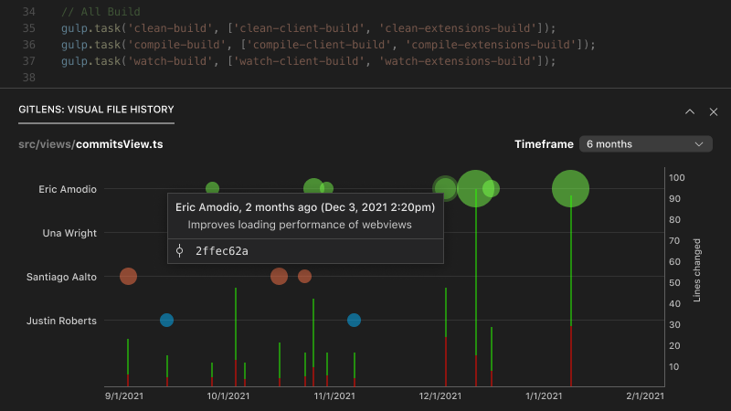

### 2. Git History

Git History 是一个VS Code插件，增强了Git 的功能，它可以用来查看日志信息，查看和搜索历史，进行分支对比、提交对比，跨提交对比文件等。

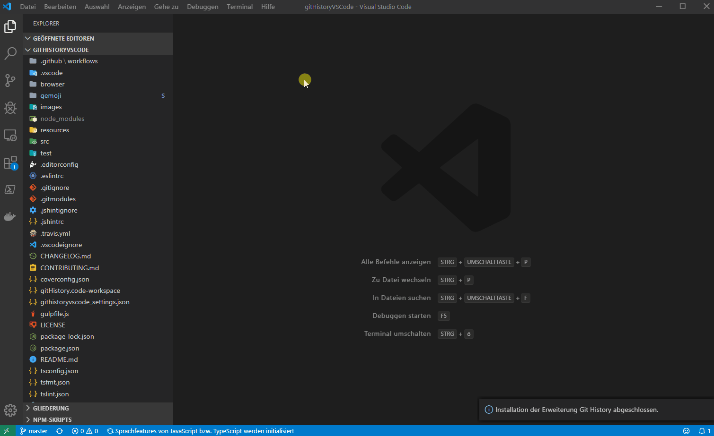

### 3. Git Automator

Git Automator 是一个VS Code插件，主要用来自动化Git提交消息和 Git 工作流程。它允许用一个快捷方式添加和提交文件。它还为提交信息提供了自动填充功能。当动作很明显时，例如你删除了一个文件，Git Automator 会猜测该动作并将其添加到预填充的提交消息中。

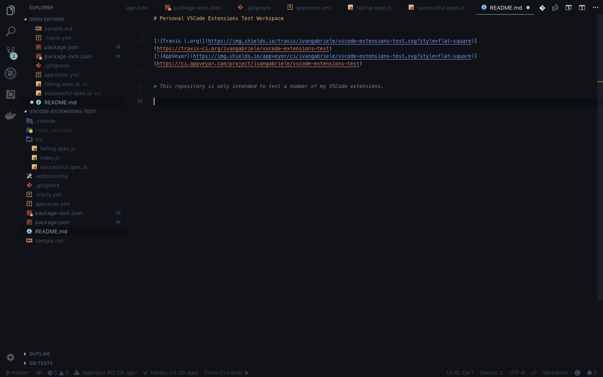

### 4. LearnGitBranching

LearnGitBranching 是一个 git 存储库可视化工具、沙箱和一系列教程和挑战。它的主要目的是帮助开发人员通过可视化的力量来理解 git。这是通过不同级别的游戏来熟悉不同的git命令来实现的。

\
**Github：**<https://github.com/pcottle/learnGitBranching>


> 更新: 2024-03-13 21:51:13  
> 原文: <https://www.yuque.com/cuggz/feplus/tl0o5m>