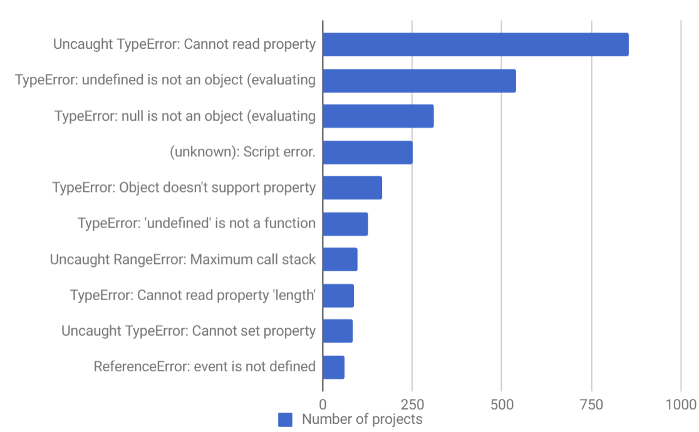
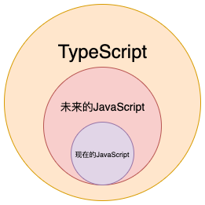

# 快速入门

## 一、为什么要使用TypeScript？

<font style="color:#333333;">T</font>ypeScript是一门由微软推出的开源的、跨平台的编程语言。它是JavaScript的超集，扩展了 JavaScript 的语法，最终会被编译为JavaScript代码。

***

**TypeScript的主要特性：**

* **超集** ：TypeScript 是 JavaScript 的超集；
* \*\*类型系统 \*\*：TypeScript在JavaScript的基础上，包装了类型机制，使其变身为静态类型语言；
* **编辑器功能** ：增强了编辑器和IDE功能，包括代码补全、接口提示、跳转到定义、重构等；
* **错误提示** ：可以在编译阶段就发现大部分错误，帮助调试程序。

TypeScript 主要是为了实现以下两个目标：

* 为JavaScript提供可选的类型系统；
* 兼容当前以及未来的JavaScript 的特性。

下面就来看看这两个目标是如何实现的。

### 1. TypeScript 的类型系统

**为什么要给JavaScript加上类型呢？**

我们知道，JavaScript是一种轻量级的解释性脚本语言。也是弱类型、动态类型语言，允许隐式转换，只有运行时才能确定变量的类型。正是因为在运行时才能确定变量的类型，JavaScript代码很多错误在运行时才能发现。TypeScript在JavaScript的基础上，包装了类型机制，使其变身成为**静态类型**语言。在 TypeScript 中，不仅可以轻易复用 JavaScript 的代码、最新特性，还能使用可选的静态类型进行检查报错，使得编写的代码更健壮、更易于维护。

下面是 JavaScript 项目中最常见的十大错误，如果使用 TypeScript，那么在**编写阶段**就可以发现并解决至少 10% 的 JavaScript 错误了：



类型系统能够提高代码的质量和可维护性，经过不断的实践，以下两点尤其需要注意：

* 类型有利于代码的重构，它有利于编译器在编译时而不是运行时捕获错误；
* 类型是出色的文档形式之一，函数签名是一个定理，而函数体是具体的实现。

可以认为，在所有操作符之前，TypeScript 都能检测到接收的类型（在代码运行时，操作符接收的是实际数据；在静态检测时，操作符接收的则是类型）是否被当前操作符所支持。当 TypeScript 类型检测能力覆盖到所有代码后，任意破坏约定的改动都能被自动检测出来，并提出类型错误。因此，可以放心地修改、重构业务逻辑，而不用担忧因为考虑不周而犯下低级错误。

在一些语言中，类型总是有一些不必要的复杂的存在方式，而 TypeScript 尽可能地降低了使用门槛，它是通过如下方式来实现的。

#### （1）JavaScript 即 TypeScript

TypeScript 与 JavaScript 本质并无区别，我们可以将 TypeScipt 理解为是一个添加了类型注解的 JavaScript，为JavaScript代码提供了编译时的类型安全。

实际上，TypeScript 是一门“**中间语言**”，因为它最终会转化为JavaScript，再交给浏览器解释、执行。不过 TypeScript 并不会破坏 JavaScript 原有的体系，只是在 JavaScript 的基础上进行了扩展。



准确的说，TypeScript 只是将JavaScript中的方法进行了标准化处理：

* TypeScript只提供一种新的语法，并不会帮我们解决BUG；
* TypeScript是一种新的语言，它使我们远离运行时。

#### （2）类型可以是隐式的

TypeScript 会尽可能的去推断类型信息，以便在开发过程中以更小的成本为我们提供类型安全。通俗来讲就是，即使我们不去显式的声明变量的类型，TypeScript也会自动判断数据类型。比如下面的代码：

```typescript
let a = 1
a = "996"
```

这段代码在TypeScript中就会报错，因为TS会知道a是一个数字类型，不能将其他类型的值赋值给a，这种类型的推断是很有必要的。

#### （3）类型可以是显式的

上面说了，TypeScript会尽可能安全的推断类型。我们也可以使用类型注释，以实现以下两件事：

* 帮助编译器快速判断变量类型；
* 强制编译器编译我们认为该去编译的内容，这可以让编译器对代码所做的算法分析与我们对代码的理解所匹配。

#### （4）类型是结构化的

在一些语言中，类型总是有一些不必要的复杂的存在方式，而 TypeScript 的类型是结构化的。比如下面的例子中，函数会接受它所期望的参数：

```typescript
interface Point2D {
	x: number;
  y: number;
}

interface Point3D {
	x: number;
  y: number;
  z: number;
}

const point2D: Point2D = {x: 10, y: 10}
const point3D: Point3D = {x: 20, y: 20, z: 20}

function takePoint2D(point: Point2D){}

takePoint2D(point2D)  // 正确，完全匹配
takePoint2D(point3D)  // 正确，可以有额外的信息
takePoint2D({x: 30})  // 错误，缺少y
```

#### （5）类型错误不会影响JS运行

为了便于把 JavaScript 代码迁移至 TypeScript，即使存在编译错误，在默认的情况下，TypeScript 也会尽可能的被编译为 JavaScript 代码。因此，我们可以将JavaScript代码逐步迁移至 TypeScript。

#### （6）类型可以由环境来定义

TypeScript 的一大目标就是让我们能够**安全、轻松**的使用现有的 JavaScript 库，它通过**声明**做到了这一点。TypeScript 提供了个动态的标准来衡量我们在声明中的投入，投入的越多，获得的类型安全和代码只能提示越多。需要注意的是，大多数的流行JavaScript库都有自己的声明文件。这里不再细说声明文件，后面会有一篇来专门介绍声明文件。

### 2. 支持未来JavaScript所有功能

虽然 TypeScript 是 JavaScript 的超集，但它始终紧跟ECMAScript标准，所以是支持ES6/7/8/9 等新语法标准的。并且，在语法层面上对一些语法进行了扩展。TypeScript 团队也正在积极的添加新功能的支持，这些功能会随着时间的推移而越来越多，越来越全面。

虽然 TypeScript 比较严谨，但是它并没有让 JavaScript 失去其灵活性。TypeScript 由于兼容 JavaScript 所以灵活度可以媲美 JavaScript，比如可以在任何地方将类型定义为 any（当然，并不推荐这样使用），毕竟 TypeScript 对类型的检查严格程度是可以通过 `tsconfig.json` 来配置的。

## 二、快速搭建TypeScript开发环境

### 1. 开发工具

在搭建TypeScript环境之前，先来看看适合TypeScript的IDE，这里主要介绍Visual Studio Code，笔者就一直使用这款编辑器。

VS Code可以说是微软的亲儿子了，其具有以下优势：

* 在传统语法高亮、自动补全功能的基础上拓展了基于变量类型、函数定义，以及引入模块的智能补全；
* 支持在编辑器上直接运行和调试应用；
* 内置了 Git Comands，能大幅提升使用 Git 协同开发效率；
* 有丰富的插件市场，可以根据需要选择适合的插件。

因为 VS Code 中内置了特定版本的 TypeScript 语言服务，所以它天然支持 TypeScript 语法解析和类型检测，且这个内置的服务与手动安装的 TypeScript 完全隔离。因此，**VS Code 支持\*\*\*\*在内置和手动安装版本之间动态切换语言服务，从而实现对不同版本的 TypeScript 的支持。**

如果当前应用目录中安装了与内置服务不同版本的 TypeScript，我们就可以点击 VS Code 底部工具栏的版本号信息，从而实现 “use VS Code's Version” 和 “use Workspace's Version” 两者之间的随意切换。

除此之外，VS Code 也基于 TypeScript 语言服务提供了准确的代码自动补全功能，并显示详细的类型定义信息，大大的提升了我们的开发效率。

### 2. 搭建开发环境

#### （1）代码初始化\*\*\*\*

\*\*1）\*\***全局安装TypeScript：**

```typescript
// npm
npm install -g typescript
// yarm
yarn global add typescript
// 查看版本
tsc -v
```

\*\*2）\*\***初始化配置文件：**

```typescript
tsc --init
```

<font style="color:#1C1F21;">执行之后，项目根目录会出现一个 </font><code><font style="color:#1C1F21;">tsconfig.json</font></code><font style="color:#1C1F21;"> 文件，里面包含ts的配置项（可能因为版本不同而配置略有不同）。</font>

```typescript
{
  "compilerOptions": {
    "target": "es5",                        // 指定 ECMAScript 目标版本: 'ES5'
    "module": "commonjs",                   // 指定使用模块: 'commonjs', 'amd', 'system', 'umd' or 'es2015'
    "moduleResolution": "node",             // 选择模块解析策略
    "experimentalDecorators": true,         // 启用实验性的ES装饰器
    "allowSyntheticDefaultImports": true,   // 允许从没有设置默认导出的模块中默认导入。
    "sourceMap": true,                      // 把 ts 文件编译成 js 文件的时候，同时生成对应的 map 文件
    "strict": true,                         // 启用所有严格类型检查选项
    "noImplicitAny": true,                  // 在表达式和声明上有隐含的 any类型时报错
    "alwaysStrict": true,                   // 以严格模式检查模块，并在每个文件里加入 'use strict'
    "declaration": true,                    // 生成相应的.d.ts文件
    "removeComments": true,                 // 删除编译后的所有的注释
    "noImplicitReturns": true,              // 不是函数的所有返回路径都有返回值时报错
    "importHelpers": true,                  // 从 tslib 导入辅助工具函数
    "lib": ["es6", "dom"],                  // 指定要包含在编译中的库文件
    "typeRoots": ["node_modules/@types"],
    "outDir": "./dist",
    "rootDir": "./src"
  },
  "include": [                              // 需要编译的ts文件 *表示文件匹配 **表示忽略文件的深度问题
    "./src/**/*.ts"
  ],		
  "exclude": [														  // 不需要编译的ts文件
    "node_modules",
    "dist",
    "**/*.test.ts",
  ]
}
```

可以在**package.json**中加入script命令：

```typescript
{
  "name": "ts-demo",
  "version": "1.0.0",
  "description": "",
  "main": "src/index.ts",
  "scripts": {
    "build": "tsc",     // 执行编译
    "build:w": "tsc -w" // 监听变化
  },
  "author": "",
  "license": "ISC",
  "devDependencies": {
    "TypeScript ": "^4.1.2"
  }
}
```

**3）编译ts代码**\*\*：\*\*

```typescript
tsc index.ts
```

#### <font style="color:#1C1F21;">（2）配置TSLint</font>

TSLint <font style="color:#1C1F21;">是一个通过</font><code><font style="color:#1C1F21;">tslint.json</font></code>进行<font style="color:#1C1F21;">配置的插件，在编写TypeScript代码时，可以对代码风格进行检查和提示。</font>如果对代码风格有要求，就需要用到TSLint了。<font style="color:#1C1F21;">其使用步骤如下</font>**<font style="color:#1C1F21;">：</font>**

***

**（1）在全局安装TSLint，以管理员身份运行：**

```typescript
npm install tslint -g
```

**（2）使用TSLint初始化配置文件：**

```typescript
tslint -i
```

执行之后，项目根目录下多了一个`tslint.json`文件，这就是TSLint的配置文件了，它会根据这个文件对代码进行检查，生成的`tslint.json`文件有下面几个字段：

```typescript
{
  "defaultSeverity": "error",
  "extends": [
    "tslint:recommended"
  ],
  "jsRules": {},
  "rules": {},
  "rulesDirectory": []
}
```

这些字段的含义如下；

* **defaultSeverity**：提醒级别，如果为error则会报错，如果为warning则会警告，如果设为off则关闭，那TSLint就关闭了；
* Ty
* \*\*extends：\*\*可指定继承指定的预设配置规则；
* \*\*jsRules：\*\*用来配置对`.js`和`.jsx`文件的校验，配置规则的方法和下面的rules一样；
* \*\*rules：\*\*TSLint检查代码的规则都是在这个里面进行配置，比如当我们不允许代码中使用`eval`方法时，就要在这里配置`"no-eval": true`；
* \*\*rulesDirectory：\*\*可以指定规则配置文件，这里指定相对路径。

**最后，**这篇文章简单介绍了**为什么要使用TypeScript**以及**如何快速搭建TypeScript开发环境**。下一篇会介绍TypeScript常见的类型。


> 更新: 2021-08-28 18:06:10  
> 原文: <https://www.yuque.com/cuggz/feplus/mactt6>