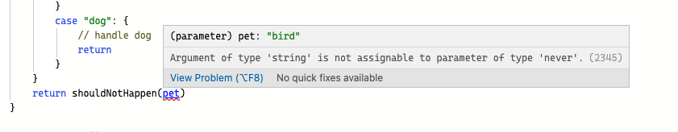

# 数据类型

## 一、简单基础类型

在说TypeScript数据类型之前，先来看看在TypeScript中定义数据类型的基本语法。

在语法层面，缺省类型注解的 TypeScript 与 JavaScript 完全一致。因此，可以把 TypeScript 代码的编写看作是为 JavaScript 代码添加类型注解。

在 TypeScript 语法中，类型的标注主要通过类型后置语法来实现：“**变量: 类型**”

```typescript
let num = 996
let num: number = 996
```

上面代码中，第一行的语法是同时符合 JavaScript 和 TypeScript 语法的，这里隐式的定义了num是数字类型，我们就不能再给num赋值为其他类型。而第二行代码显式的声明了变量num是数字类型，同样，不能再给num赋值为其他类型，否则就会报错。

在 JavaScript 中，原始类型指的是**非对象且没有方法**的数据类型，包括：number、boolean、string、null、undefined、symbol、bigInt。

它们对应的 TypeScript 类型如下：

| **JavaScript原始基础类型** | **TypeScript类型** |
| :---: | :---: |
| number | number |
| boolean | boolean |
| string | string |
| null | null |
| undefined | undefined |
| symbol | symbol |
| bigInt | bigInt |

需要注意**number**和**Number**的区别：TypeScript中指定类型的时候要用 number ，这是TypeScript的类型关键字。而 Number 是 JavaScript 的原生构造函数，用它来创建数值类型的值，这两个是不一样的。包括**string**、**boolean**等都是TypeScript的类型关键字，而不是JavaScript语法。

### 1. number

TypeScript 和 JavaScript 一样，所有数字都是**浮点数**，所以只有一个 number 类型。

TypeScript 还支持 ES6 中新增的二进制和八进制字面量，所以 TypeScript 中共支持**2、8、10和16**这四种进制的数值：

```typescript
let num: number;
num = 123;
num = "123";     // error 不能将类型"123"分配给类型"number"
num = 0b1111011; // 二进制的123
num = 0o173;     // 八进制的123
num = 0x7b;      // 十六进制的123
```

### 2. string

字符串类型可以使用单引号和双引号来包裹内容，但是如果使用 Tslint 规则，会对引号进行检测，使用单引号还是双引号可以在 Tslint 规则中进行配置。除此之外，还可以使用 ES6  中的模板字符串来拼接变量和字符串会更为方便。

```typescript
let str: string = "Hello World";
str = "Hello TypeScript";
const first = "Hello";
const last = "TypeScript";
str = `${first} ${last}`;
console.log(str) // 结果: Hello TypeScript
```

### 3. boolean

类型为布尔值类型的变量的值只能是true或者false。除此之外，赋值给布尔值的值也可以是一个计算之后结果为布尔值的表达式：

```typescript
let bool: boolean = false;
bool = true;

let bool: boolean = !!0
console.log(bool) // false
```

### 4. null和undefined

在 JavaScript 中，undefined和 null 是两个基本数据类型。在 TypeScript 中，这两者都有各自的类型，即 undefined 和 null，也就是说它们既是实际的值，也是类型。这两种类型的实际用处不是很大。

```typescript
let u: undefined = undefined;
let n: null = null;
```

注意，第一行代码可能会报一个tslint的错误：`Unnecessary initialization to 'undefined'`，就是不能给一个变量赋值为undefined。但实际上给变量赋值为undefined是完全可以的，所以如果想让代码合理化，可以配置tslint，将"`no-unnecessary-initializer`"设置为`false`即可。

默认情况下，undefined 和 null 是所有类型的子类型，可以赋值给任意类型的值，也就是说可以把 undefined 赋值给 void 类型，也可以赋值给 number 类型。当在 `tsconfig.json` 的"compilerOptions"里设置为 "strictNullChecks": true 时，就必须严格对待了。这时 undefined 和 null 将只能赋值给它们自身或者 void 类型。这样也可以规避一些错误。

### 5. **bigInt**

BigInt是ES6中新引入的数据类型，它是一种内置对象，它提供了一种方法来表示大于 2<sup>53 </sup>- 1 的整数，BigInt可以表示任意大的整数。

使用 `BigInt` 可以安全地存储和操作大整数，即使这个数已经超出了JavaScript构造函数 Number 能够表示的安全整数范围。

我们知道，在 JavaScript 中采用双精度浮点数，这导致精度有限，比如 `Number.MAX_SAFE_INTEGER` 给出了可以安全递增的最大可能整数，即<code>2<sup>53 </sup>- 1</code>，来看一个例子:

```typescript
const max = Number.MAX_SAFE_INTEGER;
const max1 = max + 1
const max2 = max + 2
max1 === max2     // true
```

可以看到，最终返回了true，这就是超过精读范围造成的问题，而`BigInt`正是解决这类问题而生的:

```typescript
const max = BigInt(Number.MAX_SAFE_INTEGER);
const max1 = max + 1n
const max2 = max + 2n
max1 === max2    // false
```

这里需要用 `BigInt(number)` 把 Number 转化为 `BigInt`，同时如果类型是 `BigInt` ，那么数字后面需要加 `n`。

在TypeScript中，`number` 类型虽然和 `BigInt` 都表示数字，但是实际上两者类型是完全不同的:

```typescript
declare let foo: number;
declare let bar: bigint;
foo = bar; // error: Type 'bigint' is not assignable to type 'number'.
bar = foo; // error: Type 'number' is not assignable to type 'bigint'.
```

### 6. symbol

symbol我们平时用的比较少，所以可能了解也不是很多，这里就详细来说说symbol。

#### （1）symbol 基本使用

symbol 是 ES6 新增的一种基本数据类型，它用来表示独一无二的值，可以通过 Symbol 构造函数生成。

```typescript
const s = Symbol(); 
typeof s; // symbol
```

注意：Symbol 前面不能加 new关键字，直接调用即可创建一个独一无二的 symbol 类型的值。

可以在使用 Symbol 方法创建 symbol 类型值的时候传入一个参数，这个参数需要是一个字符串。如果传入的参数不是字符串，会先自动调用传入参数的 toString 方法转为字符串：

```typescript
const s1 = Symbol("TypeScript"); 
const s2 = Symbol("Typescript"); 
console.log(s1 === s2); // false
```

上面代码的第三行可能会报一个错误：This condition will always return 'false' since the types 'unique symbol' and 'unique symbol' have no overlap. 这是因为编译器检测到这里的 s1 === s2 始终是false，所以编译器提醒这代码写的多余，建议进行优化。

上面使用Symbol创建了两个symbol对象，方法中都传入了相同的字符串，但是两个symbol值仍然是false，这就说明了 Symbol 方法会返回一个独一无二的值。Symbol 方法传入的这个字符串，就是方便我们区分 symbol 值的。可以调用 symbol 值的 toString 方法将它转为字符串：

```typescript
const s1 = Symbol("Typescript"); 
console.log(s1.toString());  // 'Symbol(Typescript)'
console.log(Boolean(s));     // true 
console.log(!s);             // false
```

在TypeScript中使用symbol就是指定一个值的类型为symbol类型：

```typescript
let a: symbol = Symbol()
```

TypeScript 中还有一个 \*\*unique symbol \*\*类型，它是symbol的子类型，这种类型的值只能由`Symbol()`或`Symbol.for()`创建，或者通过指定类型来指定变量是这种类型。这种类型的值只能用于常量的定义和用于属性名。需要注意，定义unique symbol类型的值，必须用 const 而不能用let来声明。下面来看在TypeScript中使用Symbol值作为属性名的例子：

```typescript
const key1: unique symbol = Symbol()
let key2: symbol = Symbol()
const obj = {
    [key1]: 'value1',
    [key2]: 'value2'
}
console.log(obj[key1]) // value1
console.log(obj[key2]) // error 类型“symbol”不能作为索引类型使用。
```

#### （2）symbol 作为属性名

在ES6中，对象的属性是支持表达式的，可以使用于一个变量来作为属性名，这对于代码的简化有很多用处，表达式必须放在大括号内：

```typescript
let prop = "name"; 
const obj = { 
  [prop]: "TypeScript" 
};
console.log(obj.name); // 'TypeScript'
```

symbol 也可以作为属性名，因为symbol的值是独一无二的，所以当它作为属性名时，不会与其他任何属性名重复。当需要访问这个属性时，只能使用这个symbol值来访问（必须使用方括号形式来访问）：

```typescript
let name = Symbol(); 
let obj = { 
  [name]: "TypeScript" 
};
console.log(obj); // { Symbol(): 'TypeScript' }

console.log(obj[name]); // 'TypeScript' 
console.log(obj.name);  // undefined
```

在使用obj.name访问时，实际上是字符串name，这和访问普通字符串类型的属性名是一样的，要想访问属性名为symbol类型的属性时，必须使用方括号。方括号中的name才是我们定义的symbol类型的变量name。

#### （3）symbol 属性名遍历

使用 Symbol 类型值作为属性名，这个属性是不会被 for…in遍历到的，也不会被 Object.keys() 、 Object.getOwnPropertyNames() 、 JSON.stringify() 等方法获取到：

```typescript
const name = Symbol("name"); 
const obj = { 
  [name]: "TypeScript", 
  age: 18 
};
for (const key in obj) { 
  console.log(key); 
}  
// => 'age' 
console.log(Object.keys(obj));  // ['age'] 
console.log(Object.getOwnPropertyNames(obj));  // ['age'] 
console.log(JSON.stringify(obj)); // '{ "age": 18 }
```

虽然这些方法都不能访问到Symbol类型的属性名，但是Symbol类型的属性并不是私有属性，可以使用 `Object.getOwnPropertySymbols` 方法获取对象的所有symbol类型的属性名：

```typescript
const name = Symbol("name"); 
const obj = { 
  [name]: "TypeScript", 
  age: 18 
};
const SymbolPropNames = Object.getOwnPropertySymbols(obj); 
console.log(SymbolPropNames); // [ Symbol(name) ] 
console.log(obj[SymbolPropNames[0]]); // 'TypeScript' 
```

除了这个方法，还可以使用ES6提供的 Reflect 对象的静态方法 Reflect.ownKeys ，它可以返回所有类型的属性名，Symbol 类型的也会返回：

```typescript
const name = Symbol("name"); 
const obj = { 
  [name]: "TypeScript", 
  age: 18 
};
console.log(Reflect.ownKeys(obj)); // [ 'age', Symbol(name) ]
```

#### （4）symbol 静态方法

Symbol 包含两个静态方法， for 和 keyFor 。

**1）Symbol.for()**

用Symbol创建的symbol类型的值都是独一无二的。使用 Symbol.for 方法传入字符串，会先检查有没有使用该字符串调用 Symbol.for 方法创建的 symbol 值。如果有，返回该值；如果没有，则使用该字符串新创建一个。使用该方法创建 symbol 值后会在全局范围进行注册。

```typescript
const iframe = document.createElement("iframe"); 
iframe.src = String(window.location); 
document.body.appendChild(iframe); 

iframe.contentWindow.Symbol.for("TypeScript") === Symbol.for("TypeScript"); // true // 注意：如果你在JavaScript环境中这段代码是没有问题的，但是如果在TypeScript开发环境中，可能会报错：类型“Window”上不存在属性“Symbol”。 // 因为这里编译器推断出iframe.contentWindow是Window类型，但是TypeScript的声明文件中，对Window的定义缺少Symbol这个字段，所以会报错，
```

上面代码中，创建了一个iframe节点并把它放在body中，通过这个 iframe 对象的 contentWindow 拿到这个 iframe 的 window 对象，在 iframe.contentWindow上添加一个值就相当于在当前页面定义一个全局变量一样。可以看到，在 iframe 中定义的键为 TypeScript 的 symbol 值在和在当前页面定义的键为'TypeScript'的symbol 值相等，说明它们是同一个值。

***

\*\*2）\*\*\*\*Symbol.keyFor() \*\*

该方法传入一个 symbol 值，返回该值在全局注册的键名：

```typescript
const sym = Symbol.for("TypeScript"); 
console.log(Symbol.keyFor(sym)); // 'TypeScript'
```

## 二、复杂基础类型

看完简单的数据类型，下面就来看看比较复杂的数据类型，包括JavaScript中的数组和对象，以及TypeScript中新增的元组、枚举、Any、void、never、unknown。\*\*\*\*

### 1. array

在 TypeScript 中有两种定义数组的方式：

* \*\*直接定义：\*\*通过 number\[] 的形式来指定这个类型元素均为number类型的数组类型，推荐使用这种写法。
* **数组泛型**\*\*：\*\*通过 Array<number> 的形式来定义，使用这种形式定义时，tslint 可能会警告让我们使用第一种形式定义，可以通过在`tslint.json` 的 rules 中加入 `"array-type": [false]` 就可以关闭 tslint 对这条的检测。

```typescript
let list1: number[] = [1, 2, 3];
let list2: Array<number> = [1, 2, 3];
```

以上两种定义数组类型的方式虽然本质上没有任何区别，但是更推荐使用第一种形式来定义。一方面可以避免与 JSX 语法冲突，另一方面可以减少代码量。

注意，这两种写法中的 number 指定的是数组元素的类型，也可以在这里将数组的元素指定为其他任意类型。如果要指定一个数组里的元素既可以是数值也可以是字符串，那么可以使用这种方式： `number|string[]`。

### 2. object

在JavaScript中，object是引用类型，它存储的是值的引用。在TypeScript中，当想让一个变量或者函数的参数的类型是一个对象的形式时，可以使用这个类型：

```typescript
let obj: object
obj = { name: 'TypeScript' }
obj = 123             // error 不能将类型“123”分配给类型“object”
console.log(obj.name) // error 类型“object”上不存在属性“name”
```

可以看到，当给一个对象类型的变量赋值一个对象时，就会报错。对象类型更适合以下场景:

```typescript
function getKeys (obj: object) {
  return Object.keys(obj) // 会以列表的形式返回obj中的值
}
getKeys({ a: 'a' }) // ['a']
getKeys(123)        // error 类型“123”的参数不能赋给类型“object”的参数
```

### 3. 元组

在 JavaScript 中并没有元组的概念，作为一门动态类型语言，它的优势是支持多类型元素数组。但是出于较好的扩展性、可读性和稳定性考虑，我们通常会把不同类型的值通过键值对的形式塞到一个对象中，再返回这个对象，而不是使用没有任何限制的数组。TypeScript 的元组类型正好弥补了这个不足，使得定义包含固定个数元素、每个元素类型未必相同的数组成为可能。

元组可以看做是数组的扩展，它表示已知元素数量和类型的数组，它特别适合用来实现多值返回。确切的说，就是已知数组中每一个位置上的元素的类型，可以通过元组的索引为元素赋值：：

```typescript
let arr: [string, number, boolean];
arr = ["a", 2, false]; // success
arr = [2, "a", false]; // error 不能将类型“number”分配给类型“string”。 不能将类型“string”分配给类型“number”。
arr = ["a", 2];        // error Property '2' is missing in type '[string, number]' but required in type '[string, number, boolean]'
arr[1] = 996					
```

可以看到，定义的arr元组中，元素个数和元素类型都是确定的，当为arr赋值时，各个位置上的元素类型都要对应，元素个数也要一致。

当访问元组元素时，TypeScript也会对元素做类型检查，如果元素是一个字符串，那么它只能使用字符串方法，如果使用别的类型的方法，就会报错。

在TypeScript 新的版本中，TypeScript会对元组做越界判断。超出规定个数的元素称作越界元素，元素赋值必须类型和个数都对应，不能超出定义的元素个数。

在新的版本中，\[string, number]元组类型的声明效果上可以看做等同于下面的声明：

```typescript
interface Tuple extends Array<number | string> { 
   0: string; 
   1: number;
   length: 2; 
}
```

这里定义了接口 Tuple ，它继承数组类型，并且数组元素的类型是 number 和 string 构成的联合类型，这样接口 Tuple 就拥有了数组类型所有的特性。并且指定索引为0的值为 string 类型，索引为1的值为 number 类型，同时指定 length 属性的类型字面量为 2，这样在指定一个类型为这个接口 Tuple 时，这个值必须是数组，而且如果元素个数超过2个时，它的length就不是2是大于2的数了，就不满足这个接口定义了，所以就会报错；当然，如果元素个数不够2个也会报错，因为索引为0或1的值缺失。

### 4. 枚举

TypeScript 在 ES 原有类型基础上加入枚举类型，使得在 TypeScript 中也可以给一组数值赋予名字，这样对开发者比较友好。枚举类型使用enum来定义：

```typescript
enum Roles {
  SUPER_ADMIN,
  ADMIN,
  USER
}
```

上面定义的枚举类型的Roles，它有三个值，TypeScript会为它们每个值分配编号，默认从0开始，在使用时，就可以使用名字而不需要记数字和名称的对应关系了：

```typescript
enum Roles {
  SUPER_ADMIN = 0,
  ADMIN = 1,
  USER = 2 
}

const superAdmin = Roles.SUPER_ADMIN;
console.log(superAdmin); // 0
console.log(Roles[1])    // ADMIN
```

除此之外，还可以修改这个数值，让SUPER\_ADMIN = 1，这样后面的值就分别是2和3。当然还可以给每个值赋予不同的、不按顺序排列的值：

```typescript
enum Roles {
   SUPER_ADMIN = 1,
   ADMIN = 3,
   USER = 7 
}
```

### 5. any

在编写代码时，有时并不清楚一个值是什么类型，这时就需要用到any类型，它是一个任意类型，定义为any类型的变量就会绕过TypeScript的静态类型检测。对于声明为any类型的值，可以对其进行任何操作，包括获取事实上并不存在的属性、方法，并且 TypeScript 无法检测其属性是否存在、类型是否正确。

我们可以将一个值定义为any类型，也可以在定义数组类型时使用any来指定数组中的元素类型为任意类型：

```typescript
let value: any;
value = 123;
value = "abc";
value = false;

const array: any[] = [1, "a", true];
```

any 类型会在对象的调用链中进行传导，即any 类型对象的任意属性的类型都是 any，如下代码所示：

```typescript
let obj: any = {};
let z = obj.x.y.z; // z的类型是any，不会报错
z();               // success
```

需要注意：不要滥用any类型，如果代码中充满了any，那TypeScript和JavaScript就毫无区别了，所以除非有充足的理由，否则应该尽量避免使用 any ，并且开启禁用隐式 any 的设置。

### 6. void

void 和 any 相反，any 是表示任意类型，而 void 是表示没有类型，就是什么类型都不是。这在**定义函数，并且函数没有返回值时会用到**：

```typescript
const consoleText = (text: string): void => {
  console.log(text); 
};
```

需要注意：\*\*void **类型的变量只能赋值为 undefined 和 null ，其他类型不能赋值给** void \*\*类型的变量。

### 7. never

never 类型指永远不存在值的类型，它是那些**总会抛出异常**或**根本不会有返回值的函数表达式的返回值**类型，当变量被永不为真的类型保护所约束时，该变量也是 never 类型。

#### （1）never 的特点

TypeScript使用never关键字来表示逻辑上不应该发生的情况和控制流。实际上，我们在工作中不会常遇到使用 never 的情况，但是还是很有必要了解它是如何有助于 TypeScript 的类型安全的。

官方文档对 never 的描述：

> never 类型是任何类型的子类型，也可以赋值给任何类型；但是，没有类型是never的子类型或可以赋值给never类型（never 本身除外）。

也就是说，可以将never类型的变量分配给任何其他变量，但不能将其他变量分配给never。下面来看一个例子：

```typescript
const throwErrorFunc = () => { throw new Error("error") };
let neverVar: never = throwErrorFunc()
const myString = ""
const myInt:number = neverVar;
neverVar = myString // Type 'string' is not assignable to type 'never'
```

我们可以暂时忽略 throwErrorFunc 的功能，只需知道，这样可以初始化类型为 never 的变量。

从上面的代码中可以看到，可以将 never 类型的变量 neverVar 分配给 number 类型的变量myInt。但是，不能将 string 类型的 myString 变量分配给 neverVar，这样分配会报错。这也就是上面所说的，不能将任何其他类型的变量分配给 never，即使是 any 类型的变量。

#### （2）函数中的 never

TypeScript 使用 never 作为那些无法达到的终点的函数的返回值类型。主要有两种情况：

* 函数抛出一个错误异常。
* 函数包含一个无限循环。

来看上面提到的 throwErrorFunc 函数，TypeScript 就会推断此函数的返回类型为 never：

```typescript
const throwErrorFunc = () => {
  throw new Error("error")
}; 
```

另一种情况就是如果有一个一直为真的表达式产生了无限循环，它没有中断或者返回语句。TypeScript 就会推断此函数的返回类型为 never：

```typescript
const output = () => {
  while (true) {
    console.log("循环");
  }
};
```

#### （3）never 和 void 的区别

那什么是 void 类型呢？我们有 void 为什么还要 never 类型呢？

never 和 void 的主要区别在于，void 类型的值可以是 undefined 或 null。

TypeScript 对不返回任何内容的函数使用 void。如果没有为函数指定返回类型，并且在代码中没有返回任何内容，TypeScript 将推断其返回类型为void。在TypeScript中，不返回任何内容的 void 函数实际上返回的是 undefined。

来看一个例子：

```typescript
const functionWithVoidReturnType = () => {}; 
console.log(functionWithVoidReturnType()); // undefined
```

这里，TypeScript 会推断此函数的返回类型为 void。我们通常会忽略 void 函数的返回值。

这里需要注意：根据 never 类型的特征，我们不能将 void 指定给 never：

```typescript
const myVoidFunction = () => {}
neverVar = myVoidFunction() // ERROR: Type 'never' is not assignable to type 'void'
```

#### （4）never 作为可变类型守卫

如果变量被一个永远不可能为 true 的类型保护缩小范围，那么变量就可能成为 never类型。通常，这表明条件逻辑存在缺陷。

来看下面的例子：

```typescript
const unExpectedResult = (myParam: "this" | "that") => {
  if (myParam === "this") {
    
  } else if (myParam === "that") {
    
  } else {
    console.log({ myParam })
  }
}

```

在这个例子中，当函数执行到 `console.log({ myParam })` 时，myParam 的类型将为 never。

这是因为我们将 myParam 的类型设置为了 this 或 that。由于 TypeScript 认为 myParam 类型属于两个类型之一，所以从逻辑上讲，第三个 else 语句永远不会出现。所以TypeScript 就会将参数类型设置为 never。

#### （5）详尽检查

在实践中可能会用到 never 的一个地方就是进行详细的检查。这有助于确保我们处理了代码中的每个边缘情况。

下面来看看如何使用详尽检查为 switch 语句添加更好的类型安全性：

```typescript
type Animal = "cat" | "dog" | "bird"

const shouldNotHappen = (animal: never) => {
  throw new Error("error")
}

const myPicker = (pet: Animal) => {
  switch(pet) {
    case "cat": {
      // ...
      return
    }
    case "dog": {
      // ...
      return
    }
  }
  return shouldNotHappen(pet)
}
```

当添加 **return shouldNotHappen(pet)** 时，会看到一个错误提示：



这里的错误提示告诉我们，忘记包含在 switch 语句中的情况。这是一种获得编译时安全性并确保处理 switch 语句中的所有情况的巧妙模式。

<font style="color:rgb(0, 0, 0);">如你所见，TypeScript中的 </font><font style="color:rgb(0, 0, 0);">never </font><font style="color:rgb(0, 0, 0);">类型在特定情况很有用。大多数情况下，never 表明代码存在缺陷。但在某些情况下，例如详尽检查，它可以成为帮助编写更安全的 TypeScript 代码的好工具。</font>

### 8. unknown

unknown 是TypeScript在3.0版本新增的类型，主要用来描述类型并不确定的变量。它看起来和any很像，但是还是有区别的，unknown相对于any更安全。

***

对于any，来看一个例子：

```typescript
let value: any
console.log(value.name)
console.log(value.toFixed())
console.log(value.length)
```

上面这些语句都不会报错，因为value是any类型，所以后面三个操作都有合法的情况，当value是一个对象时，访问name属性是没问题的；当value是数值类型的时候，调用它的toFixed方法没问题；当value是字符串或数组时获取它的length属性是没问题的。

当指定值为unknown类型的时候，如果没有**缩小类型范围**的话，是不能对它进行任何操作的。总之，unknown类型的值不能随便操作。那什么是类型范围缩小呢？下面来看一个例子：

```typescript
function getValue(value: unknown): string {
  if (value instanceof Date) { 
    return value.toISOString();
  }
  return String(value);
}
```

这里由于把value的类型缩小为Date实例的范围内，所以进行了value.toISOString()，也就是<font style="color:#333333;">使用ISO标准将 Date 对象转换为字符串。</font>

<font style="color:#333333;"></font>

<font style="color:#333333;">使用以下方式也可以缩小类型范围：</font>

```typescript
let result: unknown;
if (typeof result === 'number') {
  result.toFixed();
}
```

关于 unknown 类型，在使用时需要注意以下几点：

* 任何类型的值都可以赋值给 unknown 类型：

```typescript
let value1: unknown;
value1 = "a";
value1 = 123;
```

* unknown 不可以赋值给其它类型，只能赋值给 unknown 和 any 类型：

```typescript
let value2: unknown;
let value3: string = value2; // error 不能将类型“unknown”分配给类型“string”
value1 = value2;
```

* unknown 类型的值不能进行任何操作：

```typescript
let value4: unknown;
value4 += 1; // error 对象的类型为 "unknown"
```

* 只能对 unknown 进行等或不等操作，不能进行其它操作：

```typescript
value1 === value2;
value1 !== value2;
value1 += value2;  // error
```

* unknown 类型的值不能访问其属性、作为函数调用和作为类创建实例：

```typescript
let value5: unknown;
value5.age;   // error
value5();     // error
new value5(); // error
```

在实际使用中，如果有类型无法确定的情况，要尽量避免使用 any，因为 any 会丢失类型信息，一旦一个类型被指定为 any，那么在它上面进行任何操作都是合法的，所以会有意想不到的情况发生。因此如果遇到无法确定类型的情况，要先考虑使用 unknown。


> 更新: 2023-07-25 14:22:00  
> 原文: <https://www.yuque.com/cuggz/feplus/hro6ng>