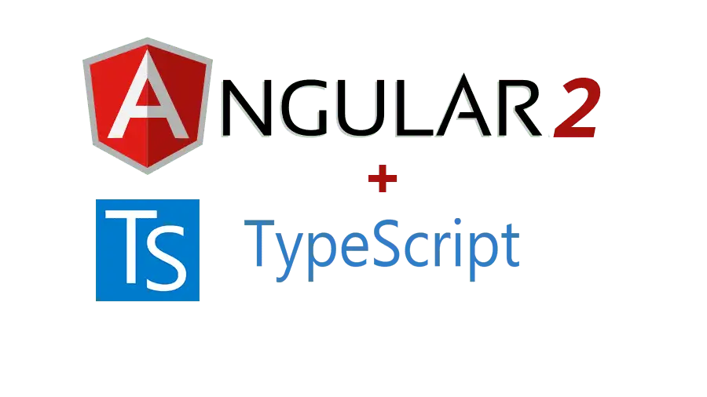
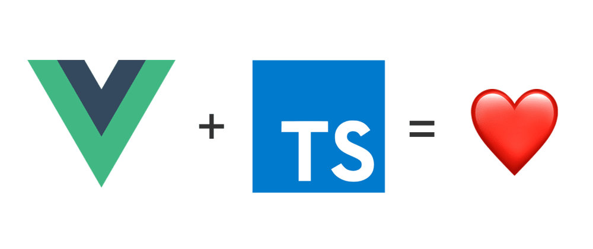

# 简史

TypeScript 是由微软进行开发和维护的一种开源的编程语言，它是 JavaScript 的严格语法超集，提供了可选的静态类型检查。本文将探索 TypeScript 的发展历程、它对 JavaScript 生态系统的影响，以及它如何成为开发人员的必备工具。

## 发展历程
### 2010：设计背景
TypeScript 的发展可以追溯到 2010 年， C# 和 Turbo Pascal 的创建者 Anders Hejlsberg 开始思考如何改进 JavaScript 的开发体验。在那个时候，JavaScript 还没有成为主流的开发语言，而且缺乏一些关键的特性，比如模块化和类型系统。因此，Anders Hejlsberg 决定创建一种新的语言，它可以在保留 JavaScript 精髓的同时，增加一些用来构建大型应用的特性。


在接下来的几年里，微软团队投入了大量的时间和精力来开发 TypeScript，并于 2012 年将其首次公开发布。

### 2012：正式发布
TypeScript 于 2012 年 10 月正式发布。TypeScript 发布的最初动机就是解决 JavaScript 的缺点，处理复杂JavaScript代码带来的挑战使他们需要自定义工具来简化组件开发流程。


JavaScript 作为一种动态类型的语言，由于缺乏类型检查而容易出现运行时错误。TypeScript 旨在提供可选的静态类型和面向对象的编程功能，使开发人员更轻松地构建和维护复杂的应用。

```typescript
function greet (name: string): string { 
  return  "Hello, " + name; 
}
```

由于 TypeScript 是 JavaScript 的严格超集，因此它保留了与现有 JavaScript 代码的兼容性。TypeScript 编译器 ( tsc) 将 TypeScript 代码转换为 JavaScript，使其可以在任何支持 JavaScript 的环境中运行。这确保了开发人员可以在项目中逐渐采用 TypeScript，而无需重写全部代码。


在发布后不久，知名的开源倡导者和开发者 Miguel de Icaza 对这门语言表示认可，但批评了其糟糕的 IDE 支持性，当时仅有微软的 Visual Studio IDE 支持其代码，但此 IDE 当时未在 Linux 和 OS X 操作系统上发布。

### 2012-2015：受到关注
TypeScript 早年在开发者社区中的采用率稳步增长。2014 年 Angular 2 的发布标志着 TypeScript 的一个重要里程碑，因为流行的前端框架选择 TypeScript 作为其默认语言。这一决定帮助 TypeScript 获得了可信度，并引起了其他项目和组织的兴趣增加。



在此期间，TypeScript 经历了数次重要的版本更新，引入了新功能和改进语言特性。开发者对 TypeScript 的反响大多是积极的，他们认识到 TypeScript 在类型安全、更好的工具支持和代码可维护性方面带来的价值。

```typescript
interface Person {
  firstName: string;
  lastName: string;
}

function fullName(person: Person): string {
  return person.firstName + " " + person.lastName;
}

let user = { firstName: "Jane", lastName: "Doe" };

console.log(fullName(user));
```

在这几年中，有以下重要里程碑：

+ 2013年发布的 TypeScript 0.9 增加了对泛型的支持。
+ 2014年在微软开发者大会上发布 TypeScript 1.0。
+ 2014年7月，开发团队发布了全新的 TypeScript 编辑器，声称其性能提高了5倍。同时，代码托管由 CodePlex 迁移至 GitHub。

### 2015–2018：成为主流
随着 TypeScript 越来越受欢迎，主要的库和框架开始为该语言提供一流的支持。React、Vue 和其他流行项目在其包中添加了 TypeScript 声明，使开发人员能够从 TypeScript 的类型检查和自动完成功能中受益。这反过来又鼓励更多的开发人员在他们的项目中采用 TypeScript，创建了一个积极的反馈循环，进一步推动 TypeScript 的增长。



在此期间，TypeScript 的类型系统也发生了重大改进，引入了联合类型、交集类型和映射类型等功能。这些增强功能使开发人员能够表达复杂的类型关系，从而使 TypeScript 更加强大和灵活。

```typescript
type Admin = {
  role: "admin";
  permissions: string[];
};

type User = {
  role: "user";
  username: string;
};

type SuperUser = Admin & User;

const superUser: SuperUser = {
  role: "admin",
  permissions: ["create", "read", "update", "delete"],
  username: "superadmin", };

function getRole(user: Admin | User): string { return user.role; }

console.log(getRole(superUser));
```

### 2018-至今：逐渐成熟
近年来，TypeScript 已经成熟成为现代 Web 开发的主要工具。由于它结合了类型安全性、改进的工具以及与 JavaScript 生态系统的兼容性，该语言已在开发人员和组织中广泛采用。


微软的 TypeScript 团队继续迭代该语言，定期发布引入新功能和增强功能的版本。与此同时，更广泛的 JavaScript 社区已经接受了 TypeScript，Next.js、NestJS 和 GraphQL 等流行项目提供了开箱即用的一流 TypeScript 支持。

```typescript
import React from "react";
import { GetServerSideProps } from "next";
import { useRouter } from "next/router";

interface PostProps {
  title: string;
  content: string;
}

export default function Post({ title, content }: PostProps) {
  const router = useRouter();

  // Anyone else hate this pattern?
  if (router.isFallback) {
    return <div>Loading...</div>;
  }
  // I can't wait for Suspense...

  return (
    <div>
      <h1>{title}</h1>
      <p>{content}</p>
    </div>
  );
}

export const getServerSideProps: GetServerSideProps<PostProps> = async (context) => {
  const { id } = context.params;
  const response = await fetch(`https://api.example.com/posts/${id}`);
  const post = await response.json();

  return {
    props: {
      title: post.title,
      content: post.content,
    },
  };
};
```

## 重要里程碑
最后来看看 TypeScript 演变的时间线，重点介绍关键里程碑和在其发展中发挥重要作用的个人。

### 2010：初步发展
+ Anders Hejlsberg 是 C# 和 Turbo Pascal 的创建者，领导 Microsoft 的 TypeScript 项目，致力于语言和编译器的研究。

### 2012：TypeScript 正式发布
+ Microsoft 于 2012 年 10 月正式发布 TypeScript。

### 2013：TypeScript 0.9 发布
+ 第一个公开版本 TypeScript 0.9 引入了可选的静态类型、泛型等功能。

### 2014：Angular 2 选择 TypeScript
+ Brad Green 和 Google 的 Angular 团队选择 TypeScript 作为 Angular 2 的默认语言。
+ TypeScript 在开发者社区中赢得了赞誉和关注。
+ 2014年的微软开发者大会发布了 TypeScript 1.0。
+ Visual Studio 2013 Update 2为TypeScript提供了原生支持。
+ 2014年7月，开发团队发布了新的TypeScript编辑器，声称其性能提高了5倍。同时，代码托管由CodePlex迁移至GitHub。

### 2015：TypeScript 1.5 发布
+ TypeScript 1.5 发布，该版本引入了模块别名、装饰器和 ES6 风格的生成器等新特性，并改进了类型推断和类型注解功能。

### 2016：TypeScript 2.0 发布
+ TypeScript 2.0 发布，引入了不可空类型、控制流分析以及类型系统的其他增强功能。
+ Daniel Rosenwasser 加入 Microsoft 的 TypeScript 团队，为该语言做出贡献并与社区互动。
+ Google 宣布将 TypeScript 作为 Angular 框架的官方语言。这一决定使得越来越多的开发者开始采用 TypeScript 来构建他们的应用程序。同时，TypeScript 也开始广泛地应用于其它的框架和库中。

### 2017：React 和 Vue 的一流支持
+ React 和 Vue 将 TypeScript 声明添加到其包中，为 TypeScript 开发人员提供一流的支持。
+ Vue 的创建者尤雨溪成为 TypeScript 及其优点的倡导者。
+ TypeScript 2.5 发布，该版本引入了可选链式操作符和 null 判断符这两个新特性，并对 JSX 语法进行了改进和优化。

### 2018：TypeScript 3.0 发布
+ TypeScript 3.0 发布，该版本引入了许多新特性，例如提取元组类型、类型参数默认推断、未声明属性检查等。此外，TypeScript 3.0 还提高了类型检查的性能和准确性。
+ TypeScript 得到了开发人员和组织的广泛采用，成为现代 Web 开发的主要内容。

### 2019：TypeScript 3.7 发布
+ TypeScript 3.7 发布，引入了可选链和空值合并，进一步增强了语言的表达能力和安全性。

### 2020：TypeScript 4.0 发布
+ Next.js、NestJS 和其他流行项目提供一流的开箱即用的 TypeScript 支持。
+ Next.js 的创建者 Guillermo Rauch 和 NestJS 的创建者 Kamil Mysliwiec 在项目中推广 TypeScript 的使用。
+ TypeScript 4.0 发布，该版本引入了诸多新特性，包括可变元组类型、协变数组展开、类属性访问修饰符等。

### 2021–2023：持续增长和成熟
+ Microsoft 的 TypeScript 团队和更广泛的 JavaScript 社区继续改进和迭代该语言。
+ 对于处理复杂 Web 应用的开发人员来说，TypeScript 仍然是一种流行且必不可少的工具。
+ TypeScript 5.0 发布，引入了装饰器、速度内存和包大小优化等。

## 小结
从 2012 年问世到目前成为开发人员的必备工具，TypeScript 已经走过了漫长的道路。它与流行的库和框架的集成、持续改进和广泛采用证明了它在生态系统中的价值。


如今，TypeScript 结合了类型安全、改进的工具以及与 JavaScript 生态系统的兼容性，使其成为开发复杂 Web 应用的开发人员的宝贵工具。


> 更新: 2023-07-17 16:04:16  
> 原文: <https://www.yuque.com/cuggz/feplus/sdecxkt0pzqt2hgg>