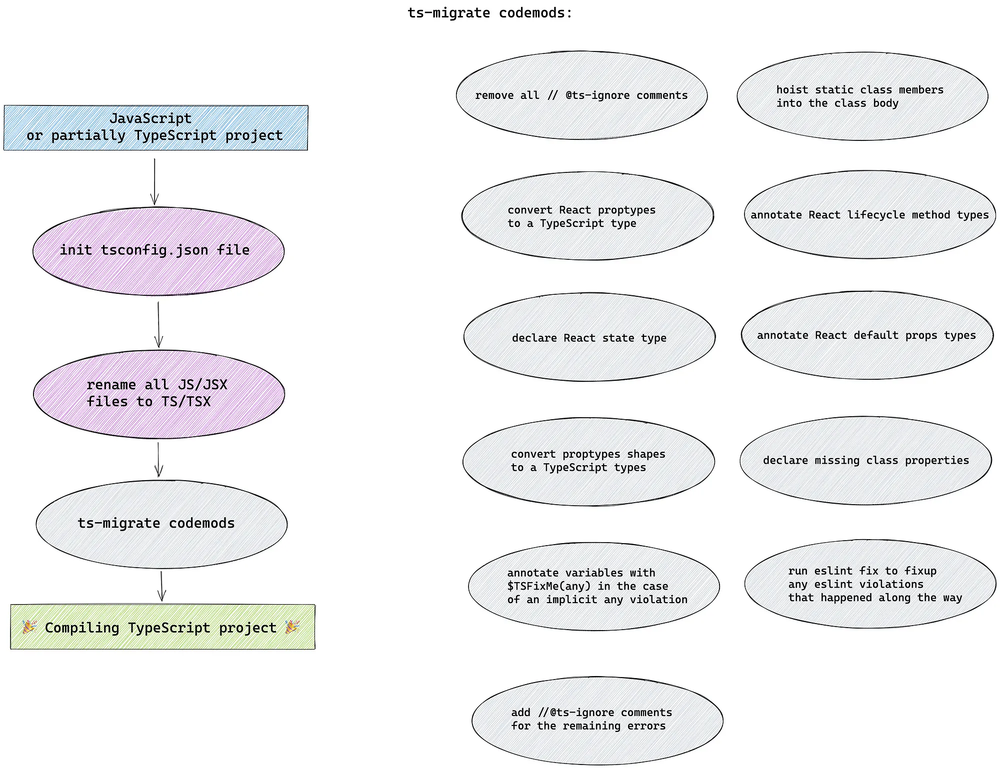
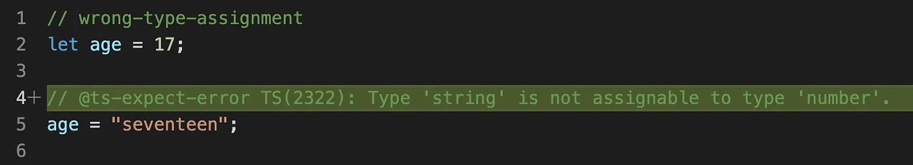
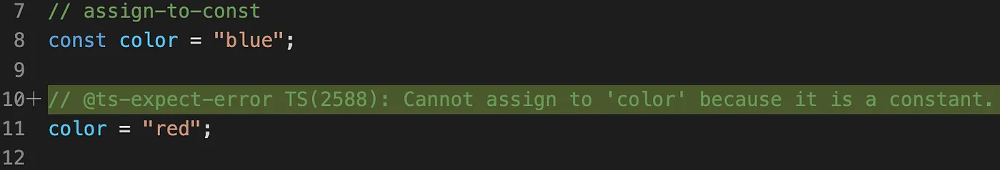
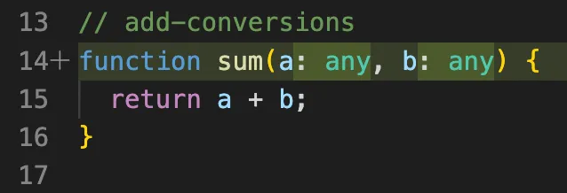
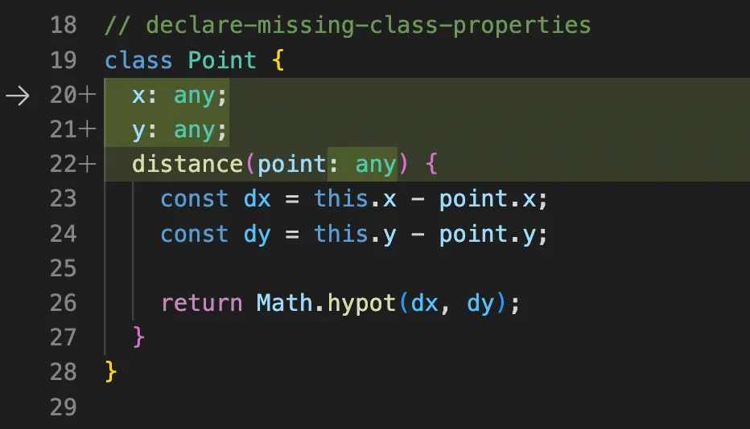

# JS迁移TS

如今，越来越多的项目将 JavaScript 代码迁移到 TypeScript，因为它是一种静态类型语言，能够提高项目的可读性、可维护性和健壮性。然而，大规模迁移是一项复杂的任务，从 JavaScript 迁移到 TypeScript 有两种选择：

\*\*（1）混合迁移：\*\*逐个文件迁移，修复类型错误，然后重复，直到迁移完整项目。allowJS 配置选项允许 TypeScript 和 JavaScript文件同时存于项目中，这使得这种方法成为可能！在混合迁移策略中，不必暂停开发，可以逐个文件逐步迁移。虽然，在大规模项目上，这个过程可能需要很长时间。

\*\*（2) 整体迁移：\*\*将 JavaScript 或部分 TypeScript 项目并将其完全转换。需要添加一些 `any`类型和`@ts-ignore`注释，以便项目编译无误，但随着时间的推移，可以用更具描述性的类型替换它们。这种策略的优势如下：

* \*\*跨项目的一致性：\*\*整体迁移将保证每个文件的状态相同，无需记住可以在何处使用 TypeScript 功能以及编译器将在何处防止基本错误。
* \*\*只修复一种类型比修复文件容易得多：\*\*修复整个文件可能非常复杂，因为文件可能有多个依赖项。使用混合迁移，很难跟踪迁移的实际进度和文件的状态。

看起来整体迁移在这里更胜一筹。但是，对大型成熟代码库执行全面迁移的过程是一个复杂的问题。为此，Airbnb 开源了一个工具帮助将代码迁移到 TypeScript 的工具：`ts-migrate`：



`ts-migrate` 接受一个 JavaScript 或部分 TypeScript 项目，并给出一个编译 TypeScript 项目，下面就来看看这个工具是如何使用的！

## 概述

ts-migrate 分为 3 个包：

* [ts-migrate](https://github.com/airbnb/ts-migrate/tree/master/packages/ts-migrate)
* [ts-migrate-server](https://github.com/airbnb/ts-migrate/tree/master/packages/ts-migrate-server)
* [ts-migrate-plugins](https://github.com/airbnb/ts-migrate/tree/master/packages/ts-migrate-plugins)

这样就能够将转换逻辑与核心运行器分开，并为不同的目的创建多个配置。目前有两个主要配置：[migration](https://github.com/airbnb/ts-migrate/blob/e163ea39a8bd62105773625236f9b4098883c4f3/packages/ts-migrate/cli.ts#L99) 和 [reignore](https://github.com/airbnb/ts-migrate/blob/e163ea39a8bd62105773625236f9b4098883c4f3/packages/ts-migrate/cli.ts#L174)。虽然迁移配置的目标是从 JavaScript 迁移到 TypeScript，但 reignore 的目的是通过**简单地忽略所有错误使项目可编译**。当代码库很大并且正在执行以下任务时，Reignore 很有用：

* 升级 TypeScript 版本
* 对代码库进行重大更改或重构
* 改进一些常用库的类型

这样，即使有一些不想立即处理的错误，也可以迁移项目。它使 TypeScript 或库的更新变得更加容易。

这两个配置都在 ts-migrate-server 上运行，它由两部分组成：

* [TSServer](https://github.com/airbnb/ts-migrate/blob/e163ea39a8bd62105773625236f9b4098883c4f3/packages/ts-migrate-server/src/forkTSServer.ts)：与 VSCode 编辑器为编辑器和语言服务器之间的通信所做的非常相似。TypeScript 语言服务器的新实例作为单独的进程运行，开发工具使用[语言协议](https://microsoft.github.io/language-server-protocol/)与服务器通信。
* [Migration runner](https://github.com/airbnb/ts-migrate/blob/e163ea39a8bd62105773625236f9b4098883c4f3/packages/ts-migrate-server/src/migrate/index.ts#L16)：运行并协调迁移过程。 它需要以下参数：

```typescript
interface MigrateParams {
  rootDir: string;          // 根目录的路径  
  config: MigrateConfig;    // 迁移配置，包括插件列表
  server: TSServer;         // TSServer 分支的一个实例
}
```

它会执行以下操作：

1. 解析 `tsconfig.json`。
2. 创建 `.ts` 文件。
3. 将每个文件发送到 TypeScript 语言服务器进行诊断。编译器提供了三种类型的诊断：`semanticDiagnostics`、`syntacticDiagnostics` 和 `suggestionDiagnostics`。使用这些诊断来查找源代码中有问题的地方。基于唯一的诊断代码和行号，可以识别问题的潜在类型并应用必要的代码修改。
4. 在每个文件上运行所有插件。如果文本因插件执行而改变，更新原始文件的内容并通知 TypeScript 语言服务器文件已更改。

## 通用插件

plugin 都会放在ts-migrate-plugins目录下。先看两个基于 `jscodeshift` 的插件：`explicitAnyPlugin` 和 `declareMissingClassPropertiesPlugin`。

`explicitAnyPlugin` 会对所有文件中的语义诊断错误进行处理。对于无法推导类型的变量添加any，可以帮助解决编译问题。

```javascript
// 转化前：
const fn2 = function(p3, p4) {}
const var1 = [];

// 转化后：
const fn2 = function(p3: any, p4: any) {}
const var1: any = [];
```

`declareMissingClassPropertiesPlugin` 会找到类申明中缺失的类型，并且添加`any`修饰。

## 基本使用

### 安装和配置TS

在开始迁移之前，需要安装和配置 TS：

* 安装 TS 包：

```javascript
在开始迁移过程之前，我们必须安装和配置 TS：
```

* 初始化 TS 配置：

```plain
npx tsc --init
```

* 安装 React 类型（如果使用的是 React）：

```plain
npm install --save-dev @types/react
```

注意： init 命令将创建一个 `tsconfig.json` 文件。可以根据要求对其进行修改。

### 将 JS 文件转换为 TS

这里就实用上面说的 ts-migrate 工具将 JS 文件迁移到 TS：

* 安装 ts-migrate：

```plain
npm install --save-dev ts-migrate
```

* 将 JS 文件重命名为 TS 文件，即将文件后缀从`.js/.jsx`转换成`.ts/.tsx`：

```plain
npm run ts-migrate -- rename <project-dir> --sources <specific-dir>
```

* 将JS文件转换为TS格式：

```plain
npm run ts-migrate -- migrate <project-dir> --sources <specific-dir>/file.tsx
```

注意：最好先提交重命名更改，然后再提交转换为 TS 更改。 这样 Git 将更改识别为 1 个文件而不是 2 个文件（删除的文件 + 新文件）。

### 示例

下面来看一个例子，将项目的 `src/examples/example.js` 转换为 TS，该文件内容如下：

```javascript
// wrong-type-assignment
let age = 17;

age = "seventeen";

// assign-to-const
const color = "blue";

color = "red";

// add-conversions
function sum(a, b) {
  return a + b;
}

// declare-missing-class-properties
class Point {
  distance(point) {
    const dx = this.x - point.x;
    const dy = this.y - point.y;

    return Math.hypot(dx, dy);
  }
}
```

可以通过以下命令来重命名 JavaScript 文件：

```plain
npm run ts-migrate -- rename ./ --sources ./src/examples
```

这里 `--sources ./src/examples` 指定了 tsconfig.json 中 `sources` 的路径为 `./src/examples`。该命令在项目根目录下运行，通过相对路径指定需要处理的文件或文件夹。执行完该命令后，`src/examples/example.js` 就变成了 `src/examples/example.ts`。

接下来就需要将迁移脚本应用于 `example.ts` 文件：

```plain
npm run ts-migrate -- migrate ./ --sources ./src/examples/example.ts
```

执行完该命令之后，就可以看到一些 ts-migrate 功能：









注意：

* ts-migrate 无法自动修复 TS 问题，它会留下带有错误详细信息的 `@ts-expect-error` 注释。
* 虽然 ts-migrate 在需要的地方将类型放入变量，但仍然需要记住将 any 类型更改为特定类型。

在运行 ts-migrate 命令时可以添加以下命令：

* `init <folder>:` 在 `<folder>` 文件夹中初始化一个 `tsconfig.json` 文件。
* `rename <folder>`: 将 `<folder>` 文件夹中的 JavaScript/JSX 文件重命名为 TypeScript/TSX 文件。
* `migrate <folder>`: 使用 codemods 修复 `<folder>` 文件夹中的 TypeScript 错误。
* `reignore <folder>`: 在项目上重新运行 ts-ignore。

这些命令可以传递 `--sources`（或 -s）标志。该标志接受一个字符串路径（支持 glob 模式），表示项目的子集。当使用此标志时，ts-migrate 忽略默认源文件而使用您列出的文件代替。这实际上相当于将 tsconfig.json 的 include 属性替换为提供的 sources。此标志可以多次传递。

可用的选项包括：

* `-h, --help`: 显示帮助信息。
* `-i, --init`: 在 `<folder>` 文件夹中创建 `tsconfig.json` 文件。
* `-m, --migrate`: 使用 codemods 修复 TypeScript 错误。
* `-rn, --rename`: 将 `<folder>` 文件夹中的 JavaScript/JSX 文件重命名为 TypeScript/TSX 文件。
* `-ri, --reignore`: 在项目上重新运行 ts-ignore。

下面是一些示例：

* `npm run ts-migrate -- --help`: 显示帮助信息。
* `npm run ts-migrate -- init frontend/foo`: 在 `frontend/foo` 文件夹中创建 `tsconfig.json` 文件。
* `npm run ts-migrate -- rename frontend/foo`: 将 `frontend/foo` 文件夹中的 JavaScript/JSX 文件重命名为 TypeScript/TSX 文件。

> **ts-migrate：**<https://github.com/airbnb/ts-migrate>


> 更新: 2023-05-30 15:05:18  
> 原文: <https://www.yuque.com/cuggz/feplus/ghbvgpyl55lesioq>