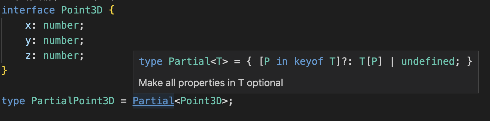

# 映射类型

DRY 原则（Don't repeat yourself）是软件开发中最重要的原则之一，即不要重复自己。应该避免在代码中的两个或多个地方存在重复的业务逻辑。

在 TypeScript 中，映射类型可以帮助我们避免编写重复的代码，它可以根据现有类型和定义的一些规则来创建新类型。下面就来看一下什么是映射类型以及何时应该使用映射类型。

## 1. 基本概念

在介绍映射类型之前，先来看一些前置知识。

### （1）索引访问类型

在 TypeScript 中，我们可以通过按名称查找属性来访问它的类型：

```typescript
type AppConfig = {
  username: string;
  layout: string;
};

type Username = AppConfig["username"];
```

在这个例子中，通过 `AppConfig` 类型的索引 `username` 获取到其类型 `string`，类似于在 JavaScript 中通过索引来获取对象的属性值。

### （2）索引签名

当类型属性的实际名称是未知的，但它们将引用的数据类型已知时，索引签名就很方便。

```typescript
type User = {
  name: string;
  preferences: {
    [key: string]: string;
  }
};

const currentUser: User = {
  name: 'Foo Bar',
  preferences: {
    lang: 'en',
  },
};
const currentLang = currentUser.preferences.lang;
```

在上面的例子中，currentLang 的类型是 string 而不是 any。此功能与 keyof 运算符一起搭配使用是使映射类型成为可能的核心之一。

### （3）联合类型

联合类型是两种或多种类型的组合。 它表明值的类型可以是联合中包含的任何一种类型。

```typescript
type StringOrNumberUnion = string | number;

let value: StringOrNumberUnion = 'hello, world!';
value = 100;
```

下面是一个更复杂的例子，编译器可以为联合类型提供一些高级保护：

```typescript
type Animal = {
  name: string;
  species: string;
};

type Person = {
  name: string;
  age: number;
};

type AnimalOrPerson = Animal | Person;

const value: AnimalOrPerson = loadFromSomewhereElse();

console.log(value.name);   // ✅
console.log(value.age);    // ❌

if ('age' in value) {
  console.log(value.age); // ✅
}
```

在这个例子中，因为 Animal 和 Person 都有 name 属性，所以第 15 行的 `value.name` 可以正常输出，没有错误。而第 16 行的 `value.age` 会编译错误，因为如果 value 是 Animal 类型，则 value 是没有 age 属性的。在第 19 行的 if 块中，因为只有 value 存在 age 属性才能进入这个代码块。所以，在这个 if 块中，value 一定是 Person，TS 可以知道 value 一定是具有 age 属性的，所以编译正确。

### （4）keyof 类型运算符

`keyof` 类型运算符返回传递给它的类型的 key 的联合。

```typescript
type AppConfig = {
  username: string;
  layout: string;
};

type AppConfigKey = keyof AppConfig;
```

在这个例子中，`AppConfigKey` 类型会被解析为`"username" | "layout"`。它可以与索引签名一起使用：

```typescript
type User = {
  name: string;
  preferences: {
    [key: string]: string;
  }
};

type UserPreferenceKey = keyof User["preferences"];
```

这里，`UserPreferenceKey` 类型被解析为 `string | number`。

### （5）元组类型

元组是一种特殊的数组类型，其中数组的元素可能是特定索引处的特定类型。 它们允许 TypeScript 编译器围绕值数组提供更高的安全性，尤其是当这些值属于不同类型时。

例如，TypeScript 编译器能够为元组的各种元素提供类型安全：

```typescript
type Currency = [number, string];

const amount: Currency = [100, 'USD'];

function add(values: number[]) {
   return values.reduce((a, b) => a + b);
}

add(amount);
// Error: Argument of type 'Currency' is not assignable to parameter of type 'number[]'.
// Type 'string' is not assignable to type 'number'.
```

上面的代码中会报错，`Currency` 类型的参数不能分配给“`number[]`”类型的参数，`string` 类型不能分配给 `number` 类型。

当访问超出元组定义类型的索引处的元素时，TypeScript 能够进行提示：

```typescript
type LatLong = [number, number]; 

const loc: LatLong = [48.858370, 2.294481];

console.log(loc[2]);
// Error: Tuple type 'LatLong' of length '2' has no element at index '2'.
```

这里，元组类型 LatLong 只有两个元素，当试图访问第三个元素时，就会报错。

### （6）条件类型

条件类型是一个表达式，类似于 JavaScript 中的三元表达式，其语法如下：

```typescript
T extends U ? X : Y
```

来看一个实际的例子：

```typescript
type ConditionalType = string extends boolean ? string : boolean;
```

在上面的示例中，ConditionalType 的类型将是 boolean，因为条件string extends boolean 是始终为 false。

## 2. 映射类型

### （1）初体验

在 TypeScript 中，当需要从另一种类型派生（并保持同步）另一种类型时，使用映射类型会特别有用。

```typescript
// 用户的配置值
type AppConfig = {
  username: string;
  layout: string;
};

// 用户是否有权更改配置值
type AppPermissions = {
  changeUsername: boolean;
  changeLayout: boolean;
};
```

在上面的代码中，AppConfig 和 AppPermissions 之间是存在隐式关系的，每当向 AppConfig 添加新的配置值时，AppPermissions 中也必须有相应的布尔值。

这里可以使用映射类型来管理两者之间的关系：

```typescript
type AppConfig = {
  username: string;
  layout: string;
};

type AppPermissions = {
  [Property in keyof AppConfig as `change${Capitalize<Property>}`]: boolean
};
```

在上面的代码中，只要 AppConfig 中的类型发生变化，AppPermissions 就会随之变化。实现了两者之间的映射关系。

### （2）概念

在 TypeScript 和 JavaScript 中，最常见的映射就是 Array.prototype.map()：

```typescript
[1, 2, 3].map(value => value.toString()); // ["1", "2", "3"]
```

这里，我们将数组中的数字映射到其字符串的表示形式。因此，TypeScript 中的映射类型意味着将一种类型转换为另一种类型，方法就是对其每个属性进行转换。

### （3）实例

下面来通过一个例子来深入理解以下映射类型。对设备定义以下类型，其包含制造商和价格属性：

```typescript
type Device = {
  manufacturer: string;
  price: number;
};
```

为了让用户更容易理解设备信息，因此为对象添加一个新类型，该对象可以使用适当的格式来格式化设备的每个属性：

```typescript
type DeviceFormatter = {
  [Key in keyof Device as `format${Capitalize<Key>}`]: (value: Device[Key]) => string;
};
```

我们来拆解一下上面的代码。`Key in keyof Device` 使用 keyof 类型运算符生成 Device 中所有键的并集。将它放在索引签名中实际上是遍历 Device 的所有属性并将它们映射到 DeviceFormatter 的属性。

`format${Capitalize<Key>}` 是映射的转换部分，它使用 key 重映射和模板文字类型将属性名称从 x 更改为 formatX。

`(value: Device[Key]) => string;` 利用索引访问类型 `Device[Key]` 来指示格式化函数的 value 参数是格式化的属性的类型。因此，formatManufacturer 接受一个 string（制造商），而 formatPrice 接受一个number（价格）。

下面是 DeviceFormatter 类型的样子：

```typescript
type DeviceFormatter = {
  formatManufacturer: (value: string) => string;
  formatPrice: (value: number) => string;
};
```

现在，假设将第三个属性 releaseYear 添加到 Device 类型中：

```typescript
type Device = {
  manufacturer: string;
  price: number;
  releaseYear: number;
}
```

由于映射类型的强大功能，DeviceFormatter 类型会自动扩展为如下类型，无需进行任何额外的工作：

```typescript
type DeviceFormatter = {
  formatManufacturer: (value: string) => string;
  formatPrice: (value: number) => string;
  formatReleaseYear: (value: number) => string;
};
```

## 3. 实用程序中的映射

TypeScript 附带了许多用作实用程序的映射类型，最常见的包括 Omit、Partial、Readonly、Readonly、Exclude、Extract、NonNullable、ReturnType 等。下面来看看其中的两个是如何构建的。

### （1）**<font style="color:rgb(41, 41, 41);">Partial</font>**

<font style="color:rgb(41, 41, 41);">Partial 是一种</font>映射类型，可以将已有的类型属性转换为可选类型，并通过使用与 undefined 的联合使类型可以为空。

```typescript
interface Point3D {
    x: number;
    y: number;
    z: number;
}

type PartialPoint3D = Partial<Point3D>;
```

这里的 `PartialPoint3D` 类型实际是这样的：

```typescript
type PartialPoint3D = {
    x?: number;
    y?: number;
    z?: number;
}
```

当我们鼠标悬浮在 Partial 上时，就会看到它的定义：



把它拿出来：

```typescript
type Partial<T> = { [P in keyof T]?: T[P] | undefined; }
```

下面来拆解一下这行代码：

* 使用泛型来传递目标接口 T；
* 使用 `keyof T` 来获取 T 的所有 key。
* 通过使用 `[P in keyof T]` 来访问并循环所有的 key；
* 它通过添加 ? 使 key 成为可选的。
* 使用联合类型 `T[P] | undefined` 使 key 的类型可以为空；

### （2）**<font style="color:rgb(41, 41, 41);">Exclude</font>**

<font style="color:rgb(41, 41, 41);">Exclude 是一种</font>映射类型，可让有选择地从类型中删除属性。 其定义如下：

```typescript
type Exclude<T, U> = T extends U ? never : T
```

它通过使用条件类型从 T 中排除那些可分配给 U 的类型，并且在排除的属性上返回 nerver。

```typescript
type animals = 'bird' | 'cat' | 'crocodile';

type mamals = Exclude<animals, 'crocodile'>;  // 'bird' | 'cat'
```

## 4. <font style="color:rgb(41, 41, 41);">构建映射类型</font>

通过上面的对 TypeScript 内置实用程序类型的原理解释，对映射类型有了更深的理解。最后，我们来构建一个自己的映射类型：<code><font style="color:rgb(36, 41, 46);">Optional</font></code><font style="color:rgb(36, 41, 46);">，它可以将原类型中指定 key 的类型置为</font><font style="color:rgb(41, 41, 41);">可选的并且可以为空。</font>

<font style="color:rgb(41, 41, 41);"></font>

<font style="color:rgb(41, 41, 41);">我们可以这样做：</font>

* 将整个类型转换为 <font style="color:rgb(36, 41, 46);">Optional</font>
* 从该新类型中仅选择想要的属性使其成为可选的。
* 将原始类型与排除的属性连接起来。

实现代码及测试用例如下：

```typescript
type Optional<T, K extends keyof T> = Pick<Partial<T>, K> & Omit<T, K>;

type Person = {
  name: string;
  surname: string;
  email: string;
}
  
type User = Optional<Person, 'email'>;
// 现在 email 属性是可选的

type AnonymousUser = Optional<Person, 'name' | 'surname'>;
// 现在 email 和 surname 属性是可选的
```

注意，这里使用 `K extends keyof T` 来确保只能传递属于类型/接口的属性。 否则，TypeScript 将在编译时抛出错误。

映射类型的一大优点就是它们的**可组合性**：可以组合它们来创建新的映射类型。

上面使用了已有的实用程序类型实现了我们想要的 Optional。当然，我们也可以在不使用任何其他映射类型的情况下重新创建 Optional 映射类型实用程序：

```typescript
type Optional<T, K extends keyof T> =
    { [P in K]?: T[P] }
    &
    { [P in Exclude<keyof T, K>]: T[P] };
```

上面的代码结合了两种类型：

* 第一种类型通过使用 `?` 修饰符使 T 的所有 K 的 key 都是可选的。
* 第二种类型通过使用 `Excluse<keyof T,K>`来获取剩余的key。


> 更新: 2022-08-09 12:39:27  
> 原文: <https://www.yuque.com/cuggz/feplus/kiafzo>