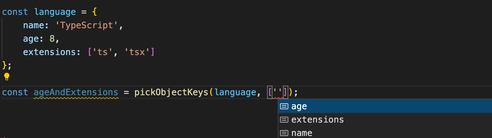
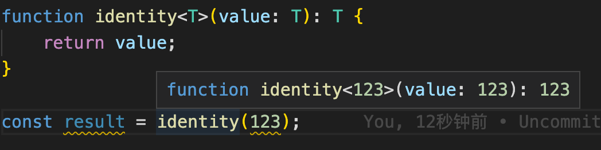
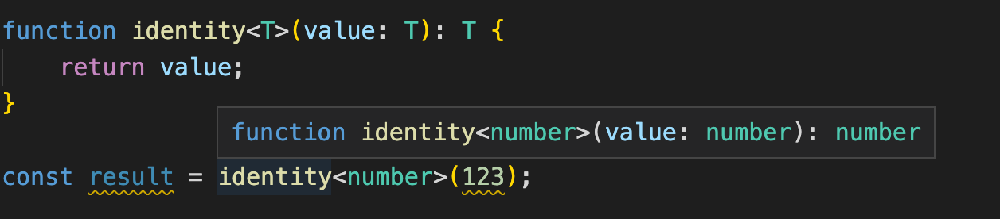
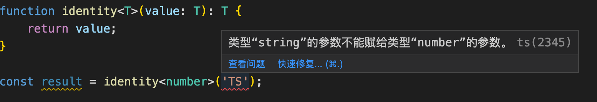

# 泛型

泛型是静态类型语言的基本特征，允许将类型作为参数传递给另一个类型、函数、或者其他结构。TypeScript 支持泛型作为将类型安全引入组件的一种方式。这些组件接受参数和返回值，其类型将是不确定的，直到它在代码中被使用。下面将通过一些示例，探索如何在函数、类型、类和接口中使用泛型，以及使用泛型创建映射类型和条件类型。

## 1. 泛型语法

首先来看看TypeScript 泛型的语法。泛型的语法为 `<T>`，其中 `T` 表示传入的类型。在这种情况下，`T` 和函数参数的工作方式相同，其作为将在创建结构实例时声明的类型的占位符。因此，尖括号内指定的泛型类型也称为**泛型类型参数**。泛型的定义可以有多个泛型类型采参数，例如：`<T, K, Z>`。

> 注意：通常使用单个字母来命名泛型类型。这不是语法规则，我们也可以像 TypeScript 中的任何其他类型一样命名泛型，但这种约定有助于向阅读代码的人传达泛型类型不需要特定类型。

下面通过一个函数的例子来看看泛型的基本语法。假设有一个 JavaScript 函数，它接受两个参数：一个对象和一个包含`key`的数组。 该函数将基于原始对象返回一个新对象，其仅包含想要的`key`：

```javascript
function pickObjectKeys(obj, keys) {
  let result = {}
  for (const key of keys) {
    if (key in obj) {
      result[key] = obj[key]
    }
  }
  return result
}
```

在 `pickObjectKeys()` 函数中，遍历了`keys`数组并使用数组中指定的`key`创建一个新对象。下面来测试一下这个函数：

```javascript
const language = {
  name: "TypeScript",
  age: 8,
  extensions: ['ts', 'tsx']
}

const ageAndExtensions = pickObjectKeys(language, ['age', 'extensions'])
```

这里声明了一个`language`对象，然后使用 `pickObjectKeys()` 函数将` language` 对象中的 `age` 和 `extensions` 属性组成了一个新的对象 `ageAndExtensions`，其值如下：

```javascript
{
  age: 8,
  extensions: ['ts', 'tsx']
}
```

如果想将这个函数迁移到 TypeScript 以使其类型安全，则可以使用泛型。重构的代码如下：

```javascript
function pickObjectKeys<T, K extends keyof T>(obj: T, keys: K[]) {
  let result = {} as Pick<T, K>
  for (const key of keys) {
    if (key in obj) {
      result[key] = obj[key]
    }
  }
  return result
}

const language = {
  name: "TypeScript",
  age: 8,
  extensions: ['ts', 'tsx']
}

const ageAndExtensions = pickObjectKeys(language, ['age', 'extensions'])
```

`<T, K extends keyof T>` 为函数声明了两个参数类型，其中 `K` 被分配给了一个类型，该类型是 `T` 中的 `key` 的集合。然后将 `obj` 参数设置为 `T`，表示任何类型，并将 `keys` 设置为数组，无论 `K` 是什么类型。

当传入的 `obj` 参数为`language` 对象时，`T`将 `age` 设置为`number`类型，将 `extensions` 设置为`string[]`类型，所以变量 `ageAndExtensions`  的类型为：

```typescript
{
  age: number;
  extensions: string[];
}
```

这样就会根据提供给 `pickObjectKeys` 的参数来判断返回值的类型，从而允许函数在知道需要强制执行的特定类型之前灵活地强制执行类型结构。 当在 Visual Studio Code 等 IDE 中使用该函数时，这使得开发体验更好，它将根据提供的对象为 `keys` 参数提供建议：



## 2. 在函数中使用泛型

将泛型与函数一起使用的最常见场景之一就是，当有一些不容易为所有的用例定义类型时，为了使该函数适用于更多情况，就可以使用泛型来定义。下面来看看在函数中使用泛型的常见场景。

### （1）分配泛型参数

先来看下面的函数，它返回函数参数传入的内容：

```typescript
function identity(value) {
  return value;
}
```

可以为其添加泛型类型以使函数的类型更安全：

```typescript
function identity<T>(value: T): T {
  return value;
}
```

这里将函数转化为接受泛型类型参数 `T` 的泛型函数，它第一个参数的类型，然后将返回类型也设置为 `T` 。下面来测试一下这个函数：

```typescript
function identity<T>(value: T): T {
  return value;
}

const result = identity(123);
```

`result` 的类型为 `123`，这是我们传入的数字：



此时，TypeScript 使用调用代码本身来推断泛型类型。这样调用代码不需要传递任何类型参数。当然，我们也可以显式地将泛型类型参数设置为想要的类型：

```typescript
function identity<T>(value: T): T {
  return value;
}

const result = identity<number>(123);
```

在这段代码中，`result`的类型就是 `number`：\
这里使用 `<number>` 定义了传入类型，让 TypeScript 标识函数的泛型类型参数 `T` 为 `number` 类型。 这将强制`number`类型作为参数和返回值的类型。当再传入其他类型时，就会报错：



### （2）直接传递类型参数

在使用自定义类型时，直接传递类型参数也很有用。 来看下面的代码：

```typescript
type ProgrammingLanguage = {
  name: string;
};

function identity<T>(value: T): T {
  return value;
}

const result = identity<ProgrammingLanguage>({ name: "TypeScript" });
```

在这段代码中，`result` 为自定义类型 `ProgrammingLanguage`，它直接传递给了 `identity` 函数。 如果没有显式地定义类型参数，则`result`的类型就是 `{ name: string } `。

另一个常见的例子就是使用函数从 API 获取数据：

```typescript
async function fetchApi(path: string) {
  const response = await fetch(`https://example.com/api${path}`)
  return response.json();
}
```

这个异步函数将 URL 路径`path`作为参数，使用 fetch API 向 URL 发出请求，然后返回 JSON 响应值。在这种情况下，`fetchApi` 函数的返回类型是 `Promise<any>`，这是 `fetch` 的响应对象的 `json()` 调用的返回类型。

将 `any` 作为返回类型并不会有任何作用，它表示任意类型，使用它将失去静态类型检查。如果我们知道 API 将返回指定结构的对象，则可以使用泛型以使此函数类型更安全：

```typescript
async function fetchApi<ResultType>(path: string): Promise<ResultType> {
  const response = await fetch(`https://example.com/api${path}`);
  return response.json();
}
```

这里就将函数转换为接受 `ResultType` 泛型类型参数的泛型函数。 此泛型类型用于函数的返回类型：`Promise<ResultType>`。

> 注意：由于这个函数是异步的，因此会返回一个 Promise 对象。 TypeScript 中的 Promise 类型本身是一个泛型类型，它接受 Promise 解析为的值的类型。

可以看到，泛型并没有在参数列表中使用，也没有在TypeScript能够推断其值的其他地方使用。这意味着在调用函数时，必须显式地传递此泛型的类型：

```typescript
type User = {
  name: string;
}

async function fetchApi<ResultType>(path: string): Promise<ResultType> {
  const response = await fetch(`https://example.com/api${path}`);
  return response.json();
}

const data = await fetchApi<User[]>('/users')
```

在这段代码中，创建了一个名为 `User` 的新类型，并使用该类型的数组 (`User[]`) 作为 `ResultType` 泛型参数的类型。`data` 变量现在的类型是 `User[]` 而不是 `any`。

> 注意：当使用 await 异步处理函数的结果时，返回类型将是 `Promise<T>` 中的 T 类型，在这个示例中就是泛型类型 `ResultType`。

### （3）默认类型参数

在上面 `fetchApi` 函数的例子中，调用代码时必须提供类型参数。 如果调用代码不包含泛型类型参数，则 `ResultType` 将推断为 `unknow`。来看下面的例子：

```typescript
async function fetchApi<ResultType>(path: string): Promise<ResultType> {
  const response = await fetch(`https://example.com/api${path}`);
  return 
response.json();
}

const data = await fetchApi('/users')

console.log(data.a)
```

这段代码尝试访问`data`的`a`属性，但是由于`data`是`unknow`类型，将无法访问对象的属性。

如果不打算为泛型函数的每次调用添加特定的类型，则可以为泛型类型参数添加默认类型。通过在泛型类型参数后面添加 `= DefaultType` 来完成：

```typescript
async function fetchApi<ResultType = Record<string, any>>(path: string): Promise<ResultType> {
  const response = await fetch(`https://example.com/api${path}`);
  return response.json();
}

const data = await fetchApi('/users')

console.log(data.a)
```

这里不需要在调用 `fetchApi` 函数时将类型传递给 `ResultType` 泛型参数，因为它具有默认类型 `Record<string, any>`。 这意味着 TypeScript 会将`data`识别为具有`string`类型的键和`any`类型值的对象，从而允许访问其属性。

### （4）类型参数约束

在某些情况下，泛型类型参数只允许将某些类型传递到泛型中，这时就可以对参数添加约束。

假如有一个存储限制，只能存储所有属性值都为字符串类型的对象。 因此，可以创建一个函数，该函数接受任何对象并返回另一个对象，其 `key` 值与原始对象相同，但所有值都转换为字符串。代码如下：

```typescript
function stringifyObjectKeyValues<T extends Record<string, any>>(obj: T) {
  return Object.keys(obj).reduce((acc, key) =>  ({
    ...acc,
    [key]: JSON.stringify(obj[key])
  }), {} as { [K in keyof T]: string })
}
```

在这段代码中，`stringifyObjectKeyValues` 函数使用 `reduce` 数组方法遍历包含原始对象的`key`的数组，将属性值字符串化并将它们添加到新数组中。

为确保调用代码始终传入一个对象作为参数，可以在泛型类型 `T` 上使用类型约束：

```typescript
function stringifyObjectKeyValues<T extends Record<string, any>>(obj: T) {
  // ...
}
```

`extends Record<string, any>` 被称为**泛型类型约束**，它允许指定泛型类型必须可分配给 `extends` 关键字之后的类型。 在这种情况下，`Record<string, any>` 表示具有`string`类型的键和`any`类型的值的对象。 我们可以使类型参数扩展任何有效的 TypeScript 类型。

在调用`reduce`时，`reducer`函数的返回类型是基于累加器的初始值。 `{} as { [K in keyof T]: string }` 通过对空对象 `{}` 使用类型断言将累加器的初始值的类型设置为`{ [K in keyof T]: string }`。 `type { [K in keyof T]: string }` 创建了一个新类型，其键与 T 相同，但所有值都设置为字符串类型，这称为**映射类型**。

下面来测试一下这个函数：

```typescript
function stringifyObjectKeyValues<T extends Record<string, any>>(obj: T) {
  return Object.keys(obj).reduce((acc, key) =>  ({
    ...acc,
    [key]: JSON.stringify(obj[key])
  }), {} as { [K in keyof T]: string })
}

const stringifiedValues = stringifyObjectKeyValues({ a: "1", b: 2, c: true, d: [1, 2, 3]})
```

变量 `stringifiedValues` 的类型如下：

```typescript
{
  a: string;
  b: string;
  c: string;
  d: string;
}
```

## 3. 在接口、类和类型中使用泛型

在 TypeScript 中创建接口和类时，使用泛型类型参数来设置结果对象的类型会很有用。 例如，一个类可能具有不同类型的属性，具体取决于传入构造函数的内容。 下面就来看看在类和接口中声明泛型类型参数的语法。

### （1）接口和类中的泛型

要创建泛型接口，可以在接口名称后添加类型参数列表：

```typescript
interface MyInterface<T> {
  field: T
}
```

这里声明了一个具有`field`字段的接口，`field`字段的类型由传入 `T` 的类型确定。

对于类，它的语法和接口定义几乎是相同的：

```typescript
class MyClass<T> {
  field: T
  constructor(field: T) {
    this.field = field
  }
}
```

通用接口/类的一个常见例子就是当有一个类型取决于如何使用接口/类的字段。 假设有一个 `HttpApplication` 类，用于处理对 API 的 HTTP 请求，并且某些 `context` 值将被传递给每个请求处理程序。 代码如下：

```typescript
class HttpApplication<Context> {
  context: Context
	constructor(context: Context) {
    this.context = context;
  }

  // ... 

  get(url: string, handler: (context: Context) => Promise<void>): this {
    // ... 
    return this;
  }
}
```

这个类储存了一个 `context`，它的类型作为 `get` 方法中`handler`函数的参数类型传入。 在使用时，传递给 `get` 方法的`handler`的参数类型将从传递给类构造函数的内容中推断出来：

```typescript
const context = { someValue: true };
const app = new HttpApplication(context);

app.get('/api', async () => {
  console.log(context.someValue)
});
```

在这段代码中，TypeScript 会将 `context.someValue` 的类型推断为 `boolean`。

### （2）自定义类型中的泛型

将泛型应用于类型的语法类似于它们应用于接口和类的方式。 来看下面的代码：

```typescript
type MyIdentityType<T> = T
```

这个泛型类型返回类型参数传递的类型。使用以下代码来实现这种类型：

```typescript
type B = MyIdentityType<number>
```

在这种情况下，`B` 的类型就是`number`。

泛型类型通常用于创建工具类型，尤其是在使用映射类型时。 TypeScript 内置了许多工具类型。 例如 `Partial`实用工具类型，它传入类型 `T` 并返回另一种具有与 `T` 相同的类型，但它们的所有字段都设置为可选。 `Partial`的实现如下：

```typescript
type Partial<T> = {
  [P in keyof T]?: T[P];
};
```

这里，`Partial` 接受一个类型，遍历它的属性类型，然后将它们作为可选的新类型返回。

> 注意：由于 Partial 已经内置到了 TypeScript 中，因此将此代码编译到 TypeScript 环境中会重新声明 Partial 并引发错误。 上面的 Partial 实现仅用于说明目的。

## 4. 使用泛型创建映射类型

使用 TypeScript 时，有时需要创建一个与另一种类型具有相同结构的类型。这意味着它们应该具有相同的属性，但属性的类型不同。对于这种情况，使用映射类型可以重用初始类型并减少重复代码。这种结构称为映射类型并依赖于泛型。下面就来看看如何创建映射类型。

先来看一个例子，给定一种类型，返回一个新类型，其中所有属性值都设置为 `boolean` 类型。可以使用以下代码创建此类型：

```typescript
type BooleanFields<T> = {
  [K in keyof T]: boolean;
}
```

在这种类型中，使用 `[K in keyof T]` 指定新类型将具有的属性。`keyof T` 用于返回 `T` 中所有可用属性的名称。然后使用 `K in` 来指定新类型的属性是`keyof T`返回的类型中可用的所有属性。

这将创建一个名为 `K` 的新类型，该类型就是当前属性的名称。 可以用于使用 `T[K]` 语法来访问原始类型中此属性的类型。 在这种情况下，将属性值的类型设置为 `boolean`。

这种 `BooleanFields` 类型的一个使用场景是创建一个选项对象。 假设有一个数据库模型，例如 User。 从数据库中获取此模型的记录时，还可以传递一个指定要返回哪些字段的对象。 该对象将具有与模型相同的属性，但类型设置为布尔值。 在字段中传递 `true` 意味着希望它被返回，而 false 则意味着希望它被省略。

可以在现有模型类型上使用 `BooleanFields` 泛型来返回与模型具有相同结构的新类型，但所有字段都设置为布尔类型，代码如下所示：

```typescript
type BooleanFields<T> = {
  [K in keyof T]: boolean;
};

type User = {
  email: string;
  name: string;
}

type UserFetchOptions = BooleanFields<User>;
```

`UserFetchOptions` 的类型如下：

```typescript
type UserFetchOptions = {
  email: boolean;
  name: boolean;
}
```

在创建映射类型时，还可以为字段提供修饰符，例如 `Readonly<T>`。 `Readonly<T>` 类型返回一个新类型，其中传递类型的所有属性都设置为只读属性。这种类型的实现如下：

```typescript
type Readonly<T> = {
  readonly [K in keyof T]: T[K]
}
```

> 注意：由于 Readonly 已经内置到 TypeScript 中，因此将此代码编译到您的 TypeScript 环境中会重新声明 Readonly 并引发错误。 此处引用的 Readonly 实现仅用于说明目的。

目前，可以在映射类型中使用的两个可用修饰符是 `readonly` 修饰符，它必须作为前缀添加到属性中，用于将属性设置为只读；以及`?`修饰符，可以作为后缀添加到属性中，用于将属性设置为可选。

## 5. 使用泛型创建条件类型

下面来看看如何使用泛型创建条件类型。

### （1）基础条件类型

条件类型是泛型类型，根据某些条件具有不同的结果类型。 先来看看下面的泛型类型 `IsStringType<T>`：

```typescript
type IsStringType<T> = T extends string ? true : false;
```

在这段代码中，创建了一个名为 `IsStringType` 的新泛型类型，它接收一个类型参数 `T`。在类型定义中，使用的语法类似于 JavaScript 中的三元表达式。此条件表达式检查类型 `T` 是否是 `string` 类型。 如果是，结果的类型将是 `true`； 否则，结果的类型将是 `false` 。

要尝试这种条件类型，需要将类型作为其类型参数传递：

```typescript
type IsStringType<T> = T extends string ? true : false;

type A = "abc";
type B = {
  name: string;
};

type ResultA = IsStringType<A>;
type ResultB = IsStringType<B>;
```

在此代码中，创建了两种类型：`A` 和 `B`。`A` 是字符串字面量类型 `abc`，`B` 是具有`string`类型的`name`属性的对象的类型。将这两种类型与 `IsStringType` 条件类型一起使用，并将结果类型存储到两个新类型 `ResultA` 和 `ResultB` 中。

这里 `ResultA` 类型设置为 `true`，而 ResultB 类型设置为 `false`。 因为 `A` 确实扩展了字符串类型，而 B 没有扩展字符串类型，因为它被设置为具有字符串类型的单个`name`属性的对象的类型。

条件类型的一个有用特性是它允许使用特殊关键字 `infer` 在 `extends` 中推断类型信息。 可以在条件为真的分支中使用这种新类型。 此功能的一种用途是检索任何函数类型的返回类型。

例如，`GetReturnType` 类型定义如下：

```typescript
type GetReturnType<T> = T extends (...args: any[]) => infer U ? U : never;
```

在这段代码中，创建了一个新的泛型类型，它是一个名为 `GetReturnType` 的条件类型。 此泛型类型接受一个类型参数 `T`。在类型声明本身内部，检查类型 `T` 是否扩展了与接受可变数量参数（包括0）的函数签名匹配的类型，然后推断该返回函数的类型，创建一个新类型 `U`，它可用于条件的真实分支。 `U` 的类型将绑定到传递函数的返回值的类型。 如果传递的类型 `T` 不是函数，则代码将返回类型`nerver`。

将此类型与以下代码一起使用：

```typescript
type GetReturnType<T> = T extends (...args: any[]) => infer U ? U : never;

function someFunction() {
  return true;
}

type ReturnTypeOfSomeFunction = GetReturnType<typeof someFunction>;
```

在这段代码中，创建了一个名为 `someFunction` 的函数，该函数返回 `true`。 然后，使用 `typeof` 运算符将此函数的类型传递给 `GetReturnType` 泛型，并将结果类型保存在 `ReturnTypeOfSomeFunction` 中。

由于 `someFunction` 变量的类型是函数，因此条件类型将计算条件为真的分支。这将返回类型 `U` 作为结果。 `U`类型是根据函数的返回类型推断出来的，在本例中是`boolean`。 如果检查 `ReturnTypeOfSomeFunction` 的类型，会发现它被设置为了`boolean`类型。

### （2）高级条件类型

条件类型是 TypeScript 中最灵活的功能之一，允许创建一些高级实用程序类型。接下来就创建一个名为 `NestedOmit<T, KeysToOmit>` 的类型，它可以省略对象中的字段，就像现有的` Omit<T, KeysToOmit>` 实用程序类型一样，但也允许使用点表示法省略嵌套字段。

使用新的 `NestedOmit<T, KeysToOmit>` 泛型，将能够使用下面例子中的类型：

```typescript
type SomeType = {
  a: {
    b: string,
    c: {
      d: number;
      e: string[]
    },
    f: number
  }
  g: number | string,
  h: {
    i: string,
    j: number,
  },
  k: {
    l: number,<F3>
  }
}

type Result = NestedOmit<SomeType, "a.b" | "a.c.e" | "h.i" | "k">;
```

这段代码声明了一个名为 `SomeType` 的类型，该类型具有嵌套属性的多级结构。 使用 `NestedOmit` 泛型传入类型，然后列出想要省略的属性的`key`。 第二个类型参数中使用点符号来标识要省略的键。 然后将结果类型存储在 `Result` 中。

构造此条件类型将使用 TypeScript 中的许很多功能，例如模板文本类型、泛型、条件类型和映射类型。

首先创建一个名为 `NestedOmit` 的泛型类型，它接受两个类型参数：

```typescript
type NestedOmit<T extends Record<string, any>, KeysToOmit extends string>
```

第一个类型参数为 `T`，它必须是可分配给 `Record<string, any>` 类型的类型，它是要从中省略属性的对象的类型。 第二个类型参数为 `KeysToOmit`，它必须是`string`类型。 使用它来指定要从类型 `T` 中省略的`key`。

接下来需要判断 `KeysToOmit` 是否可分配给类型 `${infer KeyPart1}.${infer KeyPart2}：`

```typescript
type NestedOmit<T extends Record<string, any>, KeysToOmit extends string> =
  KeysToOmit extends `${infer KeyPart1}.${infer KeyPart2}`
```

这里就用到了模板文本类型，同时利用条件类型在模板文字中推断出其他两种类型。 通过这两部分，将一个字符串拆分为了两个字符串。 第一部分将分配给类型 `KeyPart1` 并将包含第一个点之前的所有内容。 第二部分将分配给类型 `KeyPart2` 并将包含第一个点之后的所有内容。 如果将“`a.b.c`”作为 `KeysToOmit` 传递，则最初 `KeyPart1` 将设置为字符串类型“`a`”，而 `KeyPart2` 将设置为“`b.c`”。

接下来，使用三元表达式来定义条件为`true`的分支：

```typescript
type NestedOmit<T extends Record<string, any>, KeysToOmit extends string> =
  KeysToOmit extends `${infer KeyPart1}.${infer KeyPart2}`
    ?
      KeyPart1 extends keyof T
```

这里使用 `KeyPart1 extends keyof T` 来检查 `KeyPart1` 是否是给定类型 `T` 的有效属性。如果是一个有效的 `key`，使用以下代码以使条件计算为两种类型之间的交集：

```typescript
type NestedOmit<T extends Record<string, any>, KeysToOmit extends string> =
  KeysToOmit extends `${infer KeyPart1}.${infer KeyPart2}`
    ?
      KeyPart1 extends keyof T
      ?
        Omit<T, KeyPart1>
        & {
          [NewKeys in KeyPart1]: NestedOmit<T[NewKeys], KeyPart2>
        }
```

`Omit<T, KeyPart1>` 是使用 TypeScript 自带的 `Omit` 构建的类型。 此时，`KeyPart1` 不是点表示法：它将包含一个字段的确切名称，该字段包含要从原始类型中省略的嵌套字段。因此，可以安全地使用现有的实用程序类型。

使用 `Omit` 删除 `T[KeyPart1]` 内的一些嵌套字段，为此，必须重新生成 `T[KeyPart1]` 的类型。 为避免重新生成整个 `T` 类型，使用 `Omit` 从 `T` 中仅删除 `KeyPart1`，保留其他字段。 然后，将在下一部分的类型中重建 `T[KeyPart1]`。

`[NewKeys in KeyPart1]：NestedOmit<T[NewKeys], KeyPart2>` 是一个映射类型，其中属性是可分配给 `KeyPart1` 的属性，也就是上面从 `KeysToOmit` 中提取的部分。 这是需要删除的字段的父级。 如果传入了 `a.b.c`，那么在第一次它将是`a`中的 `NewKeys`。 然后，将此属性的类型设置为递归调用 `NestedOmit` 实用程序类型的结果，但现在使用 `T[NewKeys]` 作为第一个类型参数传递 T 内的此属性的类型，并作为第二个类型参数传递点符号的其余`key`，在 `KeyPart2` 中可用。

在内部条件为 `false` 分支中，返回绑定到 T 的当前类型，就好像 `KeyPart1` 不是 `T`的有效`key`：

```typescript
type NestedOmit<T extends Record<string, any>, KeysToOmit extends string> =
  KeysToOmit extends `${infer KeyPart1}.${infer KeyPart2}`
    ?
      KeyPart1 extends keyof T
      ?
        Omit<T, KeyPart1>
        & {
          [NewKeys in KeyPart1]: NestedOmit<T[NewKeys], KeyPart2>
        }
      : T
```

条件的这个分支意味着省略 `T` 中不存在的字段。在这种情况下，无需再进一步。最后，在外部条件为 `false`的分支中，使用内置的 `Omit` 实用程序类型从 `T` 中省略 `KeysToOmit`：

```typescript
type NestedOmit<T extends Record<string, any>, KeysToOmit extends string> =
  KeysToOmit extends `${infer KeyPart1}.${infer KeyPart2}`
    ?
      KeyPart1 extends keyof T
      ?
        Omit<T, KeyPart1>
        & {
          [NewKeys in KeyPart1]: NestedOmit<T[NewKeys], KeyPart2>
        }
      : T
    : Omit<T, KeysToOmit>;
```

如果条件 `KeysToOmit extends `${infer KeyPart1}.${infer KeyPart2}\`\` 为 `false`，则表示 `KeysToOmit` 未使用点表示法，因此可以使用 `Omit` 实用程序类型。

现在，要使用新的 `NestedOmit` 条件类型，创建一个名为 `NestedObject` 的类型：

```typescript
type NestedObject = {
  a: {
    b: {
      c: number;
      d: number;
    };
    e: number;
  };
  f: number;
};
```

调用 `NestedOmit` 以省略 `a.b.c` 中可用的嵌套字段：

```typescript
type Result = NestedOmit<NestedObject, "a.b.c">;
```

在条件类型的第一次计算中，外部条件为真，因为字符串字面量类型`a.b.c`可分配给模板文本类型`${infer KeyPart1}.${infer KeyPart2}`。 在这种情况下，`KeyPart1` 将被推断为字符串字面量类型`a`，而 `KeyPart2` 将被推断为字符串的剩余部分，在本例中为`b.c`。

下面将计算内部条件，结果为真，因为此时 `KeyPart1` 是 `T` 的键。 `KeyPart1` 现在是`a`，并且 `T` 确实具有属性`a`：

```typescript
type NestedObject = {
  a: {
    b: {
      c: number;
      d: number;
    };
    e: number;
  };
  f: number;
};
```

继续计算条件，现在位于内部 `true`分支中。这构建了一个新类型，它是其他两种类型的交集。第一种类型是在 `T` 上使用 `Omit` 实用程序类型来省略可分配给 `KeyPart1` 的字段（在本例中为 `a` 字段）的结果。第二种类型是通过递归调用 `NestedOmit` 构建的新类型。

如果对 `NestedOmit` 进行下一步求值，对于第一次递归调用，交集类型会构建一个类型以用作 `a` 字段的类型。这将重新创建`a`字段，而不需要忽略嵌套字段。

在 `NestedOmit` 的最终计算中，第一个条件将返回 `false`，因为传递的字符串类型是`c`。这种情况下，可以使用内置类型从对象中省略该字段。这将返回 `b` 字段的类型，即省略 `c` 的原始类型。计算到此结束，TypeScript 返回了需要使用的新类型，省略了嵌套字段。

## 6. 小结

本文详细解释了适用于函数、接口、类和自定义类型的泛型，还使用泛型创建映射类型和条件类型。 这些中的每一个都使泛型成为使用 TypeScript 时的强大工具。 正确使用它们将避免一遍又一遍地重复代码，并使编写的类型更加灵活。


> 更新: 2023-07-25 14:34:43  
> 原文: <https://www.yuque.com/cuggz/feplus/gffvsh>