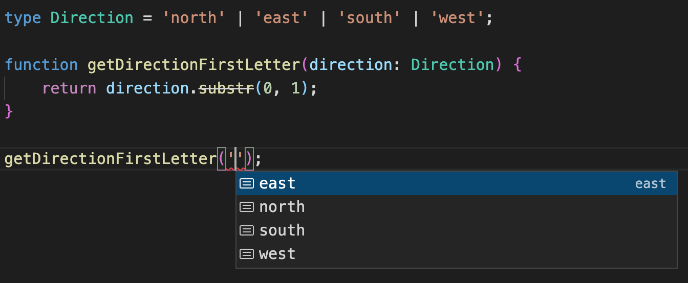
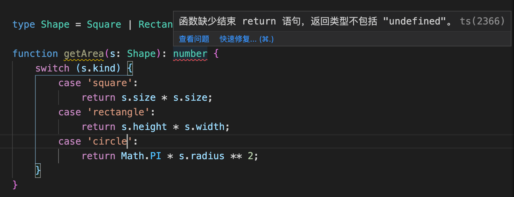

# 高级类型

在开发过程中，为了应对多变的复杂场景，我们需要了解一下 TypeScript 的高级类型。所谓高级类型，是 TypeScript 为了保证语言的灵活性，所使用的一些语言特性。这些特性有助于我们应对复杂多变的开发场景。

本文大纲如下：

1. 字面量类型
2. 联合类型
3. 交叉类型
4. 索引类型
5. 条件类型
6. 类型推断
7. 类型保护
8. 类型断言

## 1. **字面量类型**

在 TypeScript 中，字面量不仅可以表示值，还可以表示类型，即字面量类型。TypeScript 支持以下字面量类型：

* 字符串字面量类型；
* 数字字面量类型；
* 布尔字面量类型；
* 模板字面量类型。

### （1）字符串字面量类型

字符串字面量类型其实就是字符串常量，与字符串类型不同的是它是具体的值：

```typescript
type Name = "TS";
const name1: Name = "test"; // ❌ 不能将类型“"test"”分配给类型“"TS"”。ts(2322)
const name2: Name = "TS";
```

实际上，定义单个字面量类型在实际应用中并没有太大的用处。它的应用场景就是将多个字面量类型组合成一个联合类型，用来描述拥有明确成员的实用的集合：

```typescript
type Direction = "north" | "east" | "south" | "west";

function getDirectionFirstLetter(direction: Direction) {
  return direction.substr(0, 1);
}

getDirectionFirstLetter("test"); // ❌ 类型“"test"”的参数不能赋给类型“Direction”的参数。
getDirectionFirstLetter("east");
```

这个例子中使用四个字符串字面量类型组成了一个联合类型。这样在调用函数时，编译器就会检查传入的参数是否是指定的字面量类型集合中的成员。通过这种方式，可以将函数的参数限定为更具体的类型。这不仅提升了代码的可读性，还保证了函数的参数类型。

除此之外，使用字面量类型还可以为我们提供智能的代码提示：



### （2）数字字面量类型

数字字面量类型就是指定类型为具体的数值：

```typescript
type Age = 18;

interface Info {
  name: string;
  age: Age;
}

const info: Info = {
  name: "TS",
  age: 28 // ❌ 不能将类型“28”分配给类型“18”
};
```

可以将数字字面量类型分配给一个数字，但反之是不行的：

```typescript
let val1: 10|11|12|13|14|15 = 10;
let val2 = 10;

val2 = val1;
val1 = val2; // ❌ 不能将类型“number”分配给类型“10 | 11 | 12 | 13 | 14 | 15”。
```

### （3）布尔字面量类型

布尔字面量类型就是指定类型为具体的布尔值（`true`或`false`）：

```typescript
let success: true;
let fail: false;
let value: true | false;

success = true;
success = false;  // ❌ 不能将类型“false”分配给类型“true”
```

由于布尔字面量类型只有`true`或`false`两种，所以下面 `value` 变量的类型是一样的：

```typescript
let value: true | false;
let value: boolean;
```

### （4）模板字面量类型

在 TypeScript 4.1 版本中新增了模板字面量类型。什么是模板字面量类型呢？它一字符串字面量类型为基础，可以通过联合类型扩展成多个字符串。它与 JavaScript 的模板字符串语法相同，但是只能用在类型定义中使用。

#### ① 基本语法

当使用模板字面量类型时，它会替换模板中的变量，返回一个新的字符串字面量。

```typescript
type attrs = "Phone" | "Name";
type target = `get${attrs}`;

// type target = "getPhone" | "getName";
```

可以看到，模板字面量类型的语法简单，并且易读且功能强大。

假如有一个CSS内边距规则的类型，定义如下：

```typescript
type CssPadding = 'padding-left' | 'padding-right' | 'padding-top' | 'padding-bottom';
```

上面的类型是没有问题的，但是有点冗长。`margin` 和 `padding` 的规则相同，但是这样写我们无法重用任何内容，最终就会得到很多重复的代码。

下面来使用模版字面量类型来解决上面的问题：

```typescript
type Direction = 'left' | 'right' | 'top' | 'bottom';

type CssPadding = `padding-${Direction}`

// type CssPadding = 'padding-left' | 'padding-right' | 'padding-top' | 'padding-bottom'
```

这样代码就变得更加简洁。如果想创建`margin`类型，就可以重用`Direction`类型：

```typescript
type CssMargin = `margin-${Direction}`
```

如果在 JavaScript 中定义了变量，就可以使用 `typeof` 运算符来提取它：

```typescript
const direction = 'left';

type CssPadding = `padding-${typeof direction}`;

// type CssPadding = "padding-left"
```

#### ② 变量限制

模版字面量中的变量可以是任意的类型吗？可以使用对象或自定义类型吗？来看下面的例子：

```typescript
type CustomObject = {
  foo: string
}

type target = `get${CustomObject}`
// ❌ 不能将类型“CustomObject”分配给类型“string | number | bigint | boolean | null | undefined”。

type complexUnion = string | number | bigint | boolean | null | undefined;

type target2 = `get${complexUnion}`  // ✅
```

可以看到，当在模板字面量类型中使用对象类型时，就报错了，因为编译器不知道如何将它序列化为字符串。实际上，模板字面量类型中的变量只允许是`string`、`number`、`bigint`、`boolean`、`null`、`undefined`或这些类型的联合类型。

#### ③ 实用程序

Typescript 提供了一组实用程序来帮助处理字符串。它们不是模板字面量类型独有的，但与它们结合使用时很方便。完整列表如下：

* `Uppercase<StringType>`：将类型转换为大写；
* `Lowercase<StringType>`：将类型转换为小写；
* `Capitalize<StringType>`：将类型第一个字母大写；
* `Uncapitalize<StringType>`：将类型第一个字母小写。

这些实用程序只接受一个字符串字面量类型作为参数，否则就会在编译时抛出错误：

```typescript
type nameProperty = Uncapitalize<'Name'>;
// type nameProperty = 'name';

type upercaseDigit = Uppercase<10>;
// ❌ 类型“number”不满足约束“string”。

type property = 'phone';
type UppercaseProperty = Uppercase<property>;
// type UppercaseProperty = 'Property';
```

下面来看一个更复杂的场景，将字符串字面量类型与这些实用程序结合使用。将两种类型进行组合，并将第二种类型的首字母大小，这样组合之后的类型符合驼峰命名法：

```typescript
type actions = 'add' | 'remove';

type property = 'name' | 'phone';

type result = `${actions}${Capitalize<property>}`;
// type result = addName | addPhone | removeName | removePhone
```

#### ④ 类型推断

在上面的例子中，我们使用使用模版字面量类型将现有的类型组合成新类型。下面来看看如何使用模板字面量类型从组合的类型中提取类型。这里就需要用到`infer`关键字，它允许我们从条件类型中的另一个类型推断出一个类型。

下面来尝试提取字符串字面量 `marginRight` 的根节点：

```typescript
type Direction = 'left' | 'right' | 'top' | 'bottom';

type InferRoot<T> = T extends `${infer K}${Capitalize<Direction>}` ? K : T;

type Result1 = InferRoot<'marginRight'>;
// type Result1 = 'margin';

type Result2 = InferRoot<'paddingLeft'>;
// type Result2 = 'padding';
```

可以看到， 模版字面量还是很强大的，不仅可以创建类型，还可以解构它们。

#### ⑤ 作为判别式

在TypeScript 4.5 版本中，支持了将\*\*模板字面量串类型作为判别式，\*\*用于类型推导。来看下面的例子：

```typescript
interface Message {
    type: string;
    url: string;
}

interface SuccessMessage extends Message {
    type: `${string}Success`;
    body: string;
}

interface ErrorMessage extends Message {
    type: `${string}Error`;
    message: string;
}

function handler(r: SuccessMessage | ErrorMessage) {
    if (r.type === "HttpSuccess") { 
        let token = r.body;
    }
}
```

在这个例子中，`handler` 函数中的 `r` 的类型就被推断为 `SuccessMessage`。因为根据 `SuccessMessage` 和 `ErrorMessage` 类型中的type字段的模板字面量类型推断出 `HttpSucces` 是根据`SuccessMessage`中的`type`创建的。

## **2. 联合类型**

### （1）基本使用

联合类型是一种互斥的类型，该类型同时表示所有可能的类型。\*\*联合类型可以理解为多个类型的并集。\*\*联合类型用来表示变量、参数的类型不是某个单一的类型，而可能是多种不同的类型的组合，它通过 `|` 来分隔不同的类型：

```typescript
type Union = "A" | "B" | "C";
```

在编写一个函数时，该函数的期望参数是数字或者字符串，并根据传递的参数类型来执行不同的逻辑。这时就用到了联合类型：

```typescript
function direction(param: string | number) {
  if (typeof param === "string") {
    ...
  }
  if (typeof param === "number") {
    ...
  }
  ...
}
```

这样在调用 `direction` 函数时，就可以传入`string`或`number`类型的参数。当联合类型比较长或者想要复用这个联合类型的时候，就可以使用类型别名来定义联合类型：

```typescript
type Params = string | number | boolean;
```

再来看一个字符串字面量联合类型的例子，setStatus 函数只能接受某些特定的字符串值，就可以将这些字符串字面量组合成一个联合类型：

```typescript
type Status = 'not_started' | 'progress' | 'completed' | 'failed';

const setStatus = (status: Status) => {
  db.object.setStatus(status);
};

setStatus('progress');
setStatus('offline'); // ❌ 类型“"offline"”的参数不能赋给类型“Status”的参数。
```

在调用函数时，如果传入的参数不是联合类型中的值，就会报错。

### （2）限制

联合类型仅在编译时是可用的，这意味着我们不能遍历这些值。进行如下尝试：

```typescript
type Status = 'not_started' | 'progress' | 'completed' | 'failed';

console.log(Object.values(Status)); // ❌ “Status”仅表示类型，但在此处却作为值使用。
```

这时就会抛出一个错误，告诉我们不能将 Status 类型当做值来使用。

如果想要遍历这些值，可以使用枚举来实现：

```typescript
enum Status {
  'not_started',
  'progress',
  'completed',
  'failed'
}

console.log(Object.values(Status));
```

### （3）可辨识联合类型

在使用联合类型时，如何来区分联合类型中的类型呢？类型保护是一种条件检查，可以帮助我们区分类型。在这种情况下，类型保护可以让我们准确地确定联合中的类型（下文会详细介绍类型保护）。

有很多方式可以做到这一点，这很大程度上取决于联合类型中包含哪些类型。有一条捷径可以使联合类型中的类型之间的区分变得容易，那就是**可辨识联合类型**。可辨识联合类型是联合类型的一种特殊情况，它允许我们轻松的区分其中的类型。

这是通过向具有唯一值的每个类型中添加一个字段来实现的，该字段用于使用相等类型保护来区分类型。例如，有一个表示所有可能的形状的联合类型，根据传入的不同类型的形状来计算该形状的面积，代码如下：

```typescript
type Square = {
  kind: "square";
  size: number;
}

type Rectangle = {
  kind: "rectangle";
  height: number;
  width: number;
}

type Circle = {
  kind: "circle";
  radius: number;
}

type Shape = Square | Rectangle | Circle; 

function getArea(s: Shape) {
  switch (s.kind) {
    case "square":
      return s.size * s.size;
    case "rectangle":
      return s.height * s.width;
    case "circle":
      return Math.PI * s.radius ** 2;
  }
}
```

在这个例子中，`Shape` 就是一个可辨识联合类型，它是三个类型的联合，而这三个类型都有一个 `kind` 属性，且每个类型的 `kind` 属性值都不相同，能够起到标识作用。 函数内应该包含联合类型中每一个接口的 `case`，**以\*\*\*\*保证每个**<code>**case**</code>**都能被处理。**

如果函数内没有包含联合类型中每一个类型的 case，在编写代码时希望编译器应该给出代码提示，可以使用以下两种完整性检查的方法。

#### ① strictNullChecks

对于上面的例子，先来新增一个类型，整体代码如下：

```typescript
type Square = {
  kind: "square";
  size: number;
}

type Rectangle = {
  kind: "rectangle";
  height: number;
  width: number;
}

type Circle = {
  kind: "circle";
  radius: number;
}

type Triangle = {
  kind: "triangle";
  bottom: number;
  height: number;
}

type Shape = Square | Rectangle | Circle | Triangle; 

function getArea(s: Shape) {
  switch (s.kind) {
    case "square":
      return s.size * s.size;
    case "rectangle":
      return s.height * s.width;
    case "circle":
      return Math.PI * s.radius ** 2;
  }
}
```

这时，Shape 联合类型中有四种类型，但函数的 `switch` 里只包含三个 `case`，这个时候编译器并没有提示任何错误，因为当传入函数的是类型是 `Triangle` 时，没有任何一个 `case` 符合，则不会执行任何 `return` 语句，那么函数是默认返回 `undefined`。所以可以利用这个特点，结合 `strictNullChecks` 编译选项，可以在`tsconfig.json`配置文件中开启 `strictNullChecks`：

```json
{
  "compilerOptions": {
    "strictNullChecks": true,
  }
}
```

让函数的返回值类型为 `number`，那么当返回 `undefined` 时就会报错：

```typescript
function getArea(s: Shape): number {
    case "square":
      return s.size * s.size;
    case "rectangle":
      return s.height * s.width;
    case "circle":
      return Math.PI * s.radius ** 2;
  }
}
```

上面的`number`处就会报错：



#### ② never

当函数返回一个错误或者不可能有返回值的时候，返回值类型为 `never`。所以可以给 `switch` 添加一个 `default` 流程，当前面的 `case` 都不符合的时候，会执行 `default` 中的逻辑：

```typescript
function assertNever(value: never): never {
  throw new Error("Unexpected object: " + value);
}

function getArea(s: Shape) {
  switch (s.kind) {
    case "square":
      return s.size * s.size;
    case "rectangle":
      return s.height * s.width;
    case "circle":
      return Math.PI * s.radius ** 2;
    default:
      return assertNever(s); // error 类型“Triangle”的参数不能赋给类型“never”的参数
  }
}
```

采用这种方式，需要定义一个额外的 `asserNever` 函数，但是这种方式不仅能够在编译阶段提示遗漏了判断条件，而且在运行时也会报错。

## 3. **交叉类型**

### （1）基本实用

交叉类型是将多个类型合并为一个类型。 这让我们可以把现有的多种类型叠加到成为一种类型，合并后的类型将拥有所有成员类型的特性。\*\*交叉类型可以理解为多个类型的交集。\*\*可以使用以下语法来创建交叉类型，每种类型之间使用 `&` 来分隔：

```typescript
type Types = type1 & type2 & .. & .. & typeN;
```

如果我们仅仅把原始类型、字面量类型、函数类型等原子类型合并成交叉类型，是没有任何意义的，因为不会有变量同时满足这些类型，那这个类型实际上就等于`never`类型。

### （2）使用场景

上面说了，一般情况下使用交叉类型是没有意义的，那什么时候该使用交叉类型呢？下面就来看看交叉类型的使用场景。

#### ① 合并接口类型

交叉类型的一个常见的使用场景就是将多个接口合并成为一个：

```typescript
type Person = {
	name: string;
  age: number;
} & {
	height: number;
  weight: number;
} & {
	id: number;
}

const person: Person = {
	name: "zhangsan",
  age: 18,
  height: 180,
  weight: 60,
  id: 123456
}
```

这里就通过交叉类型使 `Person` 同时拥有了三个接口中的五个属性。那如果两个接口中的同一个属性定义了不同的类型会发生了什么情况呢？

```typescript
type Person = {
	name: string;
  age: number;
} & {
  age: string;
	height: number;
  weight: number;
}
```

两个接口中都拥有`age`属性，并且类型分别是`number`和`string`，那么在合并后，`age`的类型就是`string & number`，也就是 `never` 类型：

```typescript
const person: Person = {
	name: "zhangsan",
  age: 18,   // ❌ 不能将类型“number”分配给类型“never”。
  height: 180,
  weight: 60,
}
```

如果同名属性的类型兼容，比如一个是 `number`，另一个是 `number` 的子类型——数字字面量类型，合并后 `age` 属性的类型就是两者中的子类型：

```typescript
type Person = {
	name: string;
  age: number;
} & {
  age: 18;
	height: number;
  weight: number;
}

const person: Person = {
	name: "zhangsan",
  age: 20,  // ❌ 不能将类型“20”分配给类型“18”。
  height: 180,
  weight: 60,
}
```

第二个接口中的`age`是一个数字字面量类型，它是`number`类型的子类型，所以合并之后的类型为字面量类型`18`。

#### ② 合并联合类型

交叉类型另外一个常见的使用场景就是合并联合类型。可以将多个联合类型合并为一个交叉类型，这个交叉类型需要同时满足不同的联合类型限制，也就是提取了所有联合类型的相同类型成员：

```typescript
type A = "blue" | "red" | 999;
type B = 999 | 666;
type C = A & B; // type C = 999;

const c: C = 999;
```

如果多个联合类型中没有相同的类型成员，那么交叉出来的类型就是`never`类型：

```typescript
type A = "blue" | "red";
type B = 999 | 666;
type C = A & B;

const c: C = 999; // ❌ 不能将类型“number”分配给类型“never”。
```

## 4. 索引类型

在介绍索引类型之前，先来了解两个类型操作符：**索引类型查询操作符**和**索引访问操作符**。

### （1）**索引类型查询操作符**

使用 `keyof` 操作符可以返回一个由这个类型的所有属性名组成的联合类型：

```typescript
type UserRole = 'admin' | 'moderator' | 'author';

type User = {
  id: number;
  name: string;
  email: string;
  role: UserRole;
}

type UserKeysType = keyof User; // 'id' | 'name' | 'email' | 'role';
```

### （2）索引访问操作符

索引访问操作符就是`[]`，其实和访问对象的某个属性值是一样的语法，但是在 TS 中它可以用来访问某个属性的类型：

```typescript
type User = {
  id: number;
  name: string;
  address: {
    street: string;
    city: string;
    country: string;
  };
}

type Params = {
  id: User['id'],
  address: User['address']
}
```

这里我们没有使用`number`来描述`id`属性，而是使用 `User['id']` 引用`User`中的`id`属性的类型，这种类型成为索引类型，它们看起来与访问对象的属性相同，但访问的是类型。

当然，也可以访问嵌套属性的类型：

```typescript
type City = User['address']['city']; // string
```

可以通过联合类型来一次获取多个属性的类型：

```typescript
type IdOrName = User['id' | 'name']; // string | number
```

### （3）应用

我们可以使用以下方式来获取给定对象中的任何属性：

```typescript
function getProperty<T, K extends keyof T>(obj: T, key: K) {
  return obj[key];
}
```

TypeScript 会推断此函数的返回类型为 T\[K]，当调用  `getProperty` 函数时，TypeScript 将推断我们将要读取的属性的实际类型：

```typescript
const user: User = {
  id: 15,
  name: 'John',
  email: 'john@smith.com',
  role: 'admin'
};

getProperty(user, 'name'); // string
getProperty(user, 'id');   // number
```

`name`属性被推断为`string`类型，`age`属性被推断为`number`类型。当访问User中不存在的属性时，就会报错：

```typescript
getProperty(user, 'property'); // ❌ 类型“"property"”的参数不能赋给类型“keyof User”的参数。
```

## 5. 条件类型

### （1）基本概念

条件类型根据条件来选择两种可能的类型之一，就像 JavaScript 中的三元运算符一样。其语法如下所示：

```typescript
T extends U ? X : Y
```

上述类型就意味着当 `T` 可分配给（或继承自）`U` 时，类型为 `X`，否则类型为 `Y`。

看一个简单的例子，一个值可以是用户的出生日期或年龄。如果是出生日期，那么这个值的类型就是 number；如果是年龄，那这个值的类型就是 string。下面定义了三个类型：

```typescript
type Dob = string;
type Age = number;
type UserAgeInformation<T> = T extends number ? number : string;
```

其中 `T` 是 `UserAgeInformation` 的泛型参数，可以在这里传递任何类型。 如果 `T` 扩展了 `number`，那么类型就是 `number`，否则就是 `string`。 如果希望 `UserAgeInformation` 是 `number`，就可以将 `Age` 传递给 `T`，如果希望是一个 `string`，就可以将 `Dob` 传递给 `T`：

```typescript
type Dob = string;
type Age = number;
type UserAgeInformation<T> = T extends number ? number : string;

let userAge:UserAgeInformation<Age> = 100;
let userDob:UserAgeInformation<Dob> = '25/04/1998';
```

### （2）创建自定义条件类型

单独使用条件类型可能用处不是很大，但是结合泛型使用时就非常有用。一个常见的用例就是使用带有 `never` 类型的条件类型来修剪类型中的值。

```typescript
type NullableString = string | null;

let itemName: NullableString;
itemName = null;
itemName = "Milk";

console.log(itemName);
```

其中 `NullableString` 可以是 `string` 或 `null` 类型，它用于 `itemName` 变量。定义一个名为 `NoNull` 的类型别名：

```typescript
type NoNull<T>
```

我们想从类型中剔除 `null`，需要通过条件来检查类型是否包含 `null`：

```typescript
type NoNull<T> = T extends null;
```

当这个条件为 `true` 时，不想使用该类型，返回 `never` 类型：

```typescript
type NoNull<T> = T extends null ? never
```

当这个条件为 `false` 时，说明类型中不包含 `null`，可以直接返回 `T`：

```typescript
type NoNull<T> = T extends null ? never : T;
```

将 `itemName` 变量的类型更改为 `NoNull`：

```typescript
let itemName: NoNull<NullableString>;
```

TypeScript 有一个类似的实用程序类型，称为 `NonNullable`，其实现如下：

```typescript
type NonNullable<T> = T extends null | undefined ? never : T;
```

`NonNullable` 和 `NoNull` 之间的区别在于 `NonNullable` 将从类型中删除 `undefined` 以及 `null`。

### （3）条件类型的类型推断

条件类型提供了一个`infer`关键字用来推断类型。下面来定义一个条件类型，如果传入的类型是一个数组，则返回数组元素的类型；如果是一个普通类型，则直接返回这个类型。如果不使用  `infer` 可以这样写：

```typescript
type Type<T> = T extends any[] ? T[number] : T;

type test = Type<string[]>; // string
type test2 = Type<string>;  // string
```

如果传入 `Type` 的是一个数组类型，那么返回的类型为`T[number]`，即该数组的元素类型，如果不是数组，则直接返回这个类型。这里通过索引访问类型`T[number]`来获取类型，如果使用 `infer` 关键字则无需手动获取：

```typescript
type Type<T> = T extends Array<infer U> ? U : T;

type test = Type<string[]>; // string
type test2 = Type<string>;  // string
```

这里 `infer` 能够推断出 `U` 的类型，并且供后面使用，可以理解为这里定义了一个变量 `U` 来接收数组元素的类型。

## 6. 类型推断

### （1）基础类型

在变量的定义中如果没有明确指定类型，编译器会自动推断出其类型：

```typescript
let name = "zhangsan";
name = 123; // error 不能将类型“123”分配给类型“string”
```

在定义变量 `name` 时没有指定其类型，而是直接给它赋一个字符串。当再次给 `name` 赋一个数值时，就会报错。这里，TypeScript 根据赋给 `name` 的值的类型，推断出 `name` 是 string 类型，当给 `string` 类型的 `name` 变量赋其他类型值的时候就会报错。这是最基本的类型推论，根据右侧的值推断左侧变量的类型。

### （2）多类型联合

当定义一个数组或元组这种包含多个元素的值时，多个元素可以有不同的类型，这时 TypeScript 会将多个类型合并起来，组成一个联合类型：

```typescript
let arr = [1, "a"];
arr = ["b", 2, false]; // error 不能将类型“false”分配给类型“string | number”
```

可以看到，此时的 `arr` 中的元素被推断为`string | number`，也就是元素可以是 `string` 类型也可以是 `number` 类型，除此之外的类型是不可以的。

再来看一个例子：

```typescript
let value = Math.random() * 10 > 5 ? 'abc' : 123
value = false // error 不能将类型“false”分配给类型“string | number”
```

这里给`value`赋值为一个三元表达式的结果，`Math.random() * 10`的值为0-10的随机数。如果这个随机值大于5，则赋给 `value`的值为字符串`abc`，否则为数值`123`。所以最后编译器推断出的类型为联合类型`string | number`，当给它再赋值`false`时就会报错。

### （3）上下文类型

上面的例子都是根据`=`右侧值的类型，推断左侧值的类型。而上下文类型则相反，它是根据左侧的类型推断右侧的类型：

```typescript
window.onmousedown = function(mouseEvent) {
  console.log(mouseEvent.a); // error 类型“MouseEvent”上不存在属性“a”
};
```

可以看到，表达式左侧是 `window.onmousedown`(鼠标按下时触发)，因此 TypeScript 会推断赋值表达式右侧函数的参数是事件对象，因为左侧是 `mousedown` 事件，所以 TypeScript 推断 `mouseEvent` 的类型是 `MouseEvent`。在回调函数中使用 `mouseEvent` 时，可以访问鼠标事件对象的所有属性和方法，当访问不存在属性时，就会报错。

## 7. 类型保护

类型保护实际上是一种错误提示机制，类型保护是可执行运行时检查的一种表达式，用于确保该类型在一定的范围内。类型保护的主要思想是尝试检测属性、方法或原型，以确定如何处理值。

### （1）instanceof 类型保护

`instanceof`是一个内置的类型保护，可用于检查一个值是否是给定构造函数或类的实例。通过这种类型保护，可以测试一个对象或值是否是从一个类派生的，这对于确定实例的类型很有用。

`instanceof` 类型保护的基本语法如下：

```typescript
objectVariable instanceof ClassName ; 
```

来看一个例子：

```typescript
class CreateByClass1 {
  public age = 18;
  constructor() {}
}

class CreateByClass2 {
  public name = "TypeScript";
  constructor() {}
}

function getRandomItem() {
  return Math.random() < 0.5 
    ? new CreateByClass1() 
    : new CreateByClass2(); // 如果随机数小于0.5就返回CreateByClass1的实例，否则返回CreateByClass2的实例
}

const item = getRandomItem();

// 判断item是否是CreateByClass1的实例
if (item instanceof CreateByClass1) { 
  console.log(item.age);
} else {
  console.log(item.name);
}
```

这里 `if` 的判断逻辑中使用 `instanceof` 操作符判断 `item` 。如果是 `CreateByClass1` 创建的，那它就有 `age` 属性；如果不是，那它就有 `name` 属性。

### （2）typeof 类型保护

`typeof` 类型保护用于确定变量的类型，它只能识别以下类型：

* boolean
* string
* bigint
* symbol
* undefined
* function
* number

对于这个列表之外的任何内容，`typeof` 类型保护只会返回 `object`。`typeof` 类型保护可以写成以下两种方式：

```typescript
typeof v !== "typename"

typeof v === "typename"
```

`typename` 只能是`number`、`string`、`boolean`和`symbol`四种类型，在 TS 中，只会把这四种类型的 `typeof` 比较识别为类型保护。

在下面的例子中，`StudentId` 函数有一个 `string | number` 联合类型的参数 `x`。如果变量 `x` 是字符串，则会打印 `Student`；如果是数字，则会打印 `Id`。 `typeof` 类型保护可以从 `x` 中提取类型：

```typescript
function StudentId(x: string | number) {
    if (typeof x == 'string') {
        console.log('Student');
    }
    if (typeof x === 'number') {
        console.log('Id');
    }
}

StudentId(`446`); // Student
StudentId(446);   // Id
```

### （3）in 类型保护

`in` 类型保护可以检查对象是否具有特定属性。它通常返回一个布尔值，指示该属性是否存在于对象中。

`in` 类型保护的基本语法如下：

```typescript
propertyName in objectName
```

来看一个例子：

```typescript
interface Person {
  firstName: string;
  surname: string;
}

interface Organisation {
  name: string;
}

type Contact = Person | Organisation;

function sayHello(contact: Contact) {
  if ("firstName" in contact) {
    console.log(contact.firstName);
  }
}
```

`in` 类型保护检查参数 `contact` 对象中是否存在 `firstName`属性。 如果存在，就进入`if` 判断，打印`contact.firstName`的值。

### （4）自定义类型保护

来看一个例子：

```typescript
const valueList = [123, "abc"];

const getRandomValue = () => {
  const number = Math.random() * 10; // 这里取一个[0, 10)范围内的随机值
  if (number < 5) {
    return valueList[0]; // 如果随机数小于5则返回valueList里的第一个值，也就是123
  }else {
    return valueList[1]; // 否则返回"abc"
  }
};

const item = getRandomValue();

if (item.length) {
  console.log(item.length); // error 类型“number”上不存在属性“length”
} else {
  console.log(item.toFixed()); // error 类型“string”上不存在属性“toFixed”
}
```

这里，`getRandomValue` 函数返回的元素是不固定的，有时返回 `number` 类型，有时返回 `string` 类型。使用这个函数生成一个值 `item`，然后通过是否有 `length` 属性来判断是 `string` 类型，如果没有 `length` 属性则为 `number` 类型。在 JavaScript 中，这段逻辑是没问题的。但是在 TypeScript 中，因为 TS 在编译阶段是无法识别 `item` 的类型的，所以当在 `if` 判断逻辑中访问 `item` 的 `length` 属性时就会报错，因为如果 `item` 为 `number` 类型的话是没有 `length` 属性的。

这个问题可以通过类型断言来解决，修改判断逻辑即可：

```typescript
if ((<string>item).length) {
  console.log((<string>item).length);
} else {
  console.log((<number>item).toFixed());
}
```

这里通过使用类型断言告诉 TS 编译器，`if` 中的 `item` 是 `string` 类型，而 `else` 中的是 `number` 类型。这样做虽然可以，但是需要在使用 `item` 的地方都使用类型断言来说明，显然有些繁琐。

可以使用**自定义类型保护**来解决上述问题：

```typescript
const valueList = [123, "abc"];

const getRandomValue = () => {
  const number = Math.random() * 10; // 这里取一个[0, 10)范围内的随机值
  if (number < 5) return valueList[0]; // 如果随机数小于5则返回valueList里的第一个值，也就是123
  else return valueList[1]; // 否则返回"abc"
};

function isString(value: number | string): boolean {
  const number = Math.random() * 10
  return number < 5;
}

const item = getRandomValue();

if (isString(item)) {
  console.log(item.length); // 此时item是string类型
} else {
  console.log(item.toFixed()); // 此时item是number类型
}
```

首先定义一个函数，函数的参数 `value` 就是要判断的值。这里 `value` 的类型可以为 `number` 或 `string`，函数的返回值类型是一个结构为 `value is type` 的类型谓语，`value` 的命名无所谓，但是谓语中的 `value` 名必须和参数名一致。而函数里的逻辑则用来返回一个布尔值，如果返回为 `true`，则表示传入的值类型为`is`后面的 `type`。

使用类型保护后，`if` 的判断逻辑和代码块都无需再对类型做指定工作，不仅如此，既然 `item` 是 `string`类型，则 `else` 的逻辑中，`item` 一定是联合类型中的另外一个，也就是 `number` 类型。

## 8. 类型断言

### （1）基本使用

TypeScrip的类型系统很强大，但有时它是不如我们更了解一个值的类型。这时，我们更希望 TypeScript 不要进行类型检查，而是让我们自己来判断，这时就用到了类型断言。

使用类型断言可以手动指定一个值的类型。类型断言像是一种类型转换，它把某个值强行指定为特定类型，下面来看一个例子：

```typescript
const getLength = target => {
  if (target.length) {
    return target.length;
  } else {
    return target.toString().length;
  }
};
```

这个函数接收一个参数，并返回它的长度。这里传入的参数可以是字符串、数组或是数值等类型的值，如果有 length 属性，说明参数是数组或字符串类型，如果是数值类型是没有 length 属性的，所以需要把数值类型转为字符串然后再获取 length 值。现在限定传入的值只能是字符串或数值类型的值：

```typescript
const getLength = (target: string | number): number => {
  if (target.length) { // error 类型"string | number"上不存在属性"length"
    return target.length; // error  类型"number"上不存在属性"length"
  } else {
    return target.toString().length;
  }
};
```

当 TypeScript 不确定一个联合类型的变量到底是哪个类型时，就只能访问此联合类型的所有类型里共有的属性或方法，所以现在加了对参数`target`和返回值的类型定义之后就会报错。

这时就可以使用类型断言，将`target`的类型断言成`string`类型。它有两种写法：`<type>value` 和 `value as type`：

```typescript
// 这种形式是没有任何问题的，建议使用这种形式
const getStrLength = (target: string | number): number => {
  if ((target as string).length) {      
    return (target as string).length; 
  } else {
    return target.toString().length;
  }
};

// 这种形式在JSX代码中不可以使用，而且也是TSLint不建议的写法
const getStrLength = (target: string | number): number => {
  if ((<string>target).length) {      
    return (<string>target).length; 
  } else {
    return target.toString().length;
  }
};
```

类型断言不是类型转换，断言成一个联合类型中不存在的类型是不允许的。

**注意：****类****&#x578B;断言不要滥用，在万不得已的情况下使用要谨慎，因为强制把某类型断言会造成 TypeScript 丧失代码提示的能力。**\*\*\*\*

### （2）双重断言

虽然类型断言是强制性的，但并不是万能的，在一些情况下会失效:

```typescript
interface Person {
	name: string;
	age: number;
}
const person = 'ts' as Person; // Error
```

这时就会报错，很显然不能把 `string` 强制断言为一个接口 `Person` ，但是并非没有办法，此时可以使用双重断言:

```typescript
interface Person {
	name: string;
	age: number;
}
const person = 'ts' as any as Person;
```

先把类型断言为 `any` ，再接着断言为想断言的类型就能实现双重断言，当然上面的例子肯定说不通的，双重断言我们也更不建议滥用，但是在一些少见的场景下也有用武之地。

### （3）显式赋值断言

先来看两个关于`null`和`undefined`的知识点。

**① 严格模式下 null 和 undefined 赋值给其它类型值**

当在 `tsconfig.json` 中将 `strictNullChecks` 设为 `true` 后，就不能再将 `undefined` 和 `null` 赋值给除它们自身和`void` 之外的任意类型值了，但有时确实需要给一个其它类型的值设置初始值为空，然后再进行赋值，这时可以自己使用联合类型来实现 `null` 或 `undefined` 赋值给其它类型：

```typescript
let str = "ts";
str = null; // error 不能将类型“null”分配给类型“string”
let strNull: string | null = "ts"; // 这里你可以简单理解为，string | null即表示既可以是string类型也可以是null类型
strNull = null; // right
strNull = undefined; // error 不能将类型“undefined”分配给类型“string | null”
```

注意，TS 会将 `undefined` 和 `null` 区别对待，这和 JavaScript 的本意也是一致的，所以在 TS 中，`string|undefined`、`string|null`和`string|undefined|null`是三种不同的类型。

**② 可选参数和可选属性**

如果开启了 `strictNullChecks`，可选参数会被自动加上 `|undefined`：

```typescript
const sum = (x: number, y?: number) => {
  return x + (y || 0);
};
sum(1, 2); // 3
sum(1); // 1
sum(1, undefined); // 1
sum(1, null); // error Argument of type 'null' is not assignable to parameter of type 'number | undefined'
```

根据错误信息看出，这里的参数 `y` 作为可选参数，它的类型就不仅是 `number` 类型了，它可以是 `undefined`，所以它的类型是联合类型 `number | undefined`。

TypeScript 对可选属性和对可选参数的处理一样，可选属性的类型也会被自动加上 `|undefined`。

```typescript
interface PositionInterface {
  x: number;
  b?: number;
}
const position: PositionInterface = {
  x: 12
};
position.b = "abc"; // error
position.b = undefined; // right
position.b = null; // error
```

看完这两个知识点，再来看看显式赋值断言。当开启 `strictNullChecks` 时，有些情况下编译器是无法在声明一些变量前知道一个值是否是 `null` 的，所以需要使用类型断言手动指明该值不为 `null`。下面来看一个编译器无法推断出一个值是否是`null`的例子：

```typescript
function getSplicedStr(num: number | null): string {
  function getRes(prefix: string) { // 这里在函数getSplicedStr里定义一个函数getRes，我们最后调用getSplicedStr返回的值实际是getRes运行后的返回值
    return prefix + num.toFixed().toString(); // 这里使用参数num，num的类型为number或null，在运行前编译器是无法知道在运行时num参数的实际类型的，所以这里会报错，因为num参数可能为null
  }
  num = num || 0.1; // 这里进行了赋值，如果num为null则会将0.1赋给num，所以实际调用getRes的时候，getRes里的num拿到的始终不为null
  return getRes("lison");
}
```

因为有嵌套函数，而编译器无法去除嵌套函数的 `null`（除非是立即调用的函数表达式），所以需要使用显式赋值断言，写法就是在不为 null 的值后面加个`!`。上面的例子可以这样改：

```typescript
function getSplicedStr(num: number | null): string {
  function getLength(prefix: string) {
    return prefix + num!.toFixed().toString();
  }
  num = num || 0.1;
  return getLength("lison");
}
```

这样编译器就知道 `num` 不为 `null`，即便 `getSplicedStr` 函数在调用的时候传进来的参数是 `null`，在 `getLength` 函数中的 `num` 也不会是 `null`。

### （4）const 断言

`const` 断言是 TypeScript 3.4 中引入的一个实用功能。在 TypeScript 中使用 `as const` 时，可以将对象的属性或数组的元素设置为只读，向语言表明表达式中的类型不会被扩大（例如从 42 到 number）。

```typescript
function sum(a: number, b: number) {
  return a + b;
}

// 相当于 const arr: readonly [3, 4]
const arr = [3, 4] as const;

console.log(sum(...arr)); // 7
```

这里创建了一个 sum 函数，它以 2 个数字作为参数并返回其总和。const 断言使我们能够告诉 TypeScript 数组的类型不会被扩展，例如从 `[3, 4]` 到 `number[]`。通过 `as const`，使得数组成为只读元组，因此其内容是无法更改的，可以在调用 sum 函数时安全地使用这两个数字。

如果试图改变数组的内容，会得到一个错误：

```typescript
function sum(a: number, b: number) {
  return a + b;
}

// 相当于 const arr: readonly [3, 4]
const arr = [3, 4] as const;

// 类型“readonly [3, 4]”上不存在属性“push”。
arr.push(5);
```

因为使用了 `const` 断言，因此数组现在是一个只读元组，其内容无法更改，并且尝试这样做会在开发过程中导致错误。

如果尝试在不使用 `const` 断言的情况下调用 `sum` 函数，就会得到一个错误：

```typescript
function sum(a: number, b: number) {
  return a + b;
}

// 相当于 const arr: readonly [3, 4]
const arr = [3, 4];

// 扩张参数必须具有元组类型或传递给 rest 参数。
console.log(sum(...arr)); // 👉️ 7
```

TypeScript 警告我们，没有办法知道 `arr` 变量的内容在其声明和调用 `sum()` 函数之间没有变化。

如果不喜欢使用 TypeScript 中的枚举，也可以使用 const 断言作为枚举的替代品：

```typescript
// 相当于 const Pages: {readonly home: '/'; readonly about: '/about'...}
export const Pages = {
  home: '/',
  about: '/about',
  contacts: '/contacts',
} as const;
```

如果尝试更改对象的任何属性或添加新属性，就会收到错误消息：

```typescript
// 相当于 const Pages: {readonly home: '/'; readonly about: '/about'...}
export const Pages = {
  home: '/',
  about: '/about',
  contacts: '/contacts',
} as const;

// 无法分配到 "about" ，因为它是只读属性。
Pages.about = 'hello';

// 类型“{ readonly home: "/"; readonly about: "/about"; readonly contacts: "/contacts"; }”上不存在属性“test”。
Pages.test = 'hello';
```

需要注意，`const` 上下文不会将表达式转换为完全不可变的。来看例子：

```typescript
const arr = ['/about', '/contacts'];

// 相当于 const Pages: {readonly home: '/', menu: string[]}
export const Pages = {
  home: '/',
  menu: arr,
} as const;

Pages.menu.push('/test'); // ✅ 
```

这里，`menu` 属性引用了一个外部数组，我们可以更改其内容。如果在对象上就地定义了数组，我们将无法更改其内容。

```typescript
// 相当于 const Pages: {readonly home: '/', readonly menu: string[]}
export const Pages = {
  home: '/',
  menu: ['/about'],
} as const;

// 类型“readonly ["/about"]”上不存在属性“push”。
Pages.menu.push('/test');
```

### （5）非空断言

在 TypeScript 中感叹号 ( **!** ) 运算符可以使编译器忽略一些错误，下面就来看看它有哪些实际的用途的以及何时使用。

#### ① 非空断言运算符

感叹号运算符称为**非空断言运算符**，添加此运算符会使编译器忽略`undefined`和`null`类型。来看例子：

```typescript
const parseValue = (value: string) => {
    // ...
};

const prepareValue = (value?: string) => {
    // ...
    parseValue(value);
};
```

对于 `prepareValue` 方法的 `value` 参数，TypeScript就会报出以下错误：

```typescript
类型“string | undefined”的参数不能赋给类型“string”的参数。
不能将类型“undefined”分配给类型“string”。
```

因为我们希望 `prepareValue` 函数中的 `value` 是 `undefined` 或 `string`，但是我们将它传递给了 `parseValue` 函数，它的参数只能是 `string`。所以就报了这个错误。

但是，在某些情况下，我们可以确定 `value` 不会是 `undefined`，而这就是需要非空断言运算符的情况：

```typescript
const parseValue = (value: string) => {
  // ...
};

const prepareValue = (value?: string) => {
  // ...
  parseValue(value!);
};
```

这样就不会报错了。但是，在使用它时应该非常小心，因为如果 `value` 的值是`undefined` ，它可能会导致意外的错误。

#### ② 使用示例

既然知道了非空断言运算符，下面就来看几个真实的例子。

在列表中搜索是否存在某个项目：

```typescript
interface Config {
  id: number;
  path: string;
}

const configs: Config[] = [
  {
    id: 1,
    path: "path/to/config/1",
  },
  {
    id: 2,
    path: "path/to/config/2",
  },
];

const getConfig = (id: number) => {
  return configs.find((config) => config.id === id);
};

const config = getConfig(1);
```

由于搜索的内容不一定存在于列表中，所以 config 变量的类型是 `Config | undefined`，我们就可以使用可以使用费控断言运算符告诉 TypeScript，`config` 应该是存在的，因此不必假设它是 `undefined`。

```typescript
const getConfig = (id: number) => {
  return configs.find((config) => config.id === id)!;
};

const config = getConfig(1);
```

这时，`config` 变量的类型就是 Config。这时再从 `config` 中获取任何属性时，就不需要再检查它是否存在了。

再来看一个例子，React 中的 Refs 提供了一种访问 DOM 节点或 React 元素的方法：

```typescript
const App = () => {
  const ref = useRef<HTMLDivElement>(null);

  const handleClick = () => {
    if(ref.current) {
      console.log(ref.current.getBoundingClientRect());
    }
  };

  return (
    <div className="App" ref={ref}>
      <button onClick={handleClick}>Click</button>
    </div>
  );
};
```

这里创建了一个简单的组件，它可以访问 class 为 App 的 DOM 节点。组件中有一个按钮，当点击该按钮时，会显示元素的大小以及其在视口中的位置。我们可以确定被访问的元素是在点击按钮后挂载的，所以可以在 TypeScript 中添加非空断言运算符表示这个元素是一定存在的：

```typescript
const App = () => {
  const handleClick = () => {
    console.log(ref.current!.getBoundingClientRect());
  };
};
```

当使用非空断言运算符时，就表示告诉TypeScript，我比你更了解这个代码逻辑，会为此负责，所以我们需要充分了解自己的代码之后再确定是否要使用这个运算符。否则，如果<font style="color:rgb(64, 64, 64);">由于某种原因断言不正确，则会发生运行时错误。</font>


> 更新: 2023-04-03 19:07:22  
> 原文: <https://www.yuque.com/cuggz/feplus/bbd60z>