# 浏览器事件机制

### 1. 事件模型

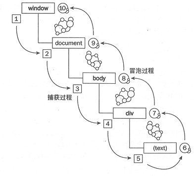

事件流总共有三个阶段（IE8及以下版本没有阶段）：

* 捕获阶段：图中1-5
* 目标阶段：图中5-6
* 冒泡阶段：图中6-10

（1）捕获事件流：就是事件由页面元素接收，逐级向下，传播到最具体的位置

（2）冒泡事件流：就是事件由最具体的元素接收，逐级向上，传播到页面

***

**注意：** 默认情况下，事件使用冒泡事件流，不使用捕获事件流。

***

**那如何才能让事件的冒泡先发生，再触发捕获阶段呢？**

可以将捕获阶段的处理函数放在`setTimeout(function(){...捕获阶段的事件需执行的内容...},0)`中，这样就会把捕获阶段获取的事件推到下一个宏事件中执行。冒泡阶段的事件在第一个宏事件中执行，捕获阶段事件在第二个宏事件中执行

### 2. 事件循环

#### （1）单线程的JavaScript

JavaScript是一种单线程语言，它主要用来与用户互动，以及操作DOM。

虽然JavaScript是单线程的，但是它有同步和异步的概念，这就解决了代码阻塞的问题：

* **同步**：如果在一个函数返回的时候，调用者就能够得到预期结果，那么这个函数就是同步的。
* **异步**：如果在函数返回的时候，调用者还不能够得到预期结果，而是需要在将来通过一定的手段得到，那么这个函数就是异步的。

\*\*那单线程有什么好处呢？\*\*在 JS 运行的时候可能会阻止 UI 渲染，这说明了两个线程是互斥的。这其中的原因是因为 JS 可以修改 DOM，如果在 JS 执行的时候 UI 线程还在工作，就可能导致不能安全的渲染 UI。这其实也是一个单线程的好处，得益于 JS 是单线程运行的，可以达到节省内存，节约上下文切换时间，没有锁的问题的好处。当然前面两点在服务端中更容易体现，对于锁的问题，形象的来说就是当我读取一个数字 15 的时候，同时有两个操作对数字进行了加减，这时候结果就出现了错误。解决这个问题也不难，只需要在读取的时候加锁，直到读取完毕之前都不能进行写入操作。

对于大多数语言而言，实现异步会通过启动额外的进程、线程或协程来实现，而JavaScript 是单线程的。

为什么单线程还能实现异步呢？

其实只是把一些操作交给了其他线程处理，然后采用了一种称之为“事件循环”（Event Loop，也称“事件轮询”）的机制来处理返回结果。下面就来看看浏览器和Node的事件循环。

#### （2）浏览器的Event Loop

<font style="color:#24292E;"> JavaScript的任务分为两种</font>`同步`<font style="color:#24292E;">和</font>`异步`：

* 同步任务是指，在主线程上排队执行的任务，只有一个任务执行完毕，才能执行下一个任务，
* 异步任务是指，不进入主线程，而是<font style="color:#24292E;">放在任务队列中，若有多个异步任务则需要在任务队列中排队等待，任务队列类似于缓冲区，任务下一步会被移到</font>**调用栈**<font style="color:#24292E;">然后主线程执行调用栈的任务。</font>

> **调用栈**<font style="color:#6A737D;">：调用栈是一个栈结构，函数调用会形成一个栈帧，帧中包含了当前执行函数的参数和局部变量等上下文信息，函数执行完后，它的执行上下文会从栈中弹出。</font>

JavaScript 为了解决单线程产生的问题，于是产生了使用异步这种方式来模拟多线程，而支撑异步的就是 Event Loop。关于 Event Loop 整个流程如下图：

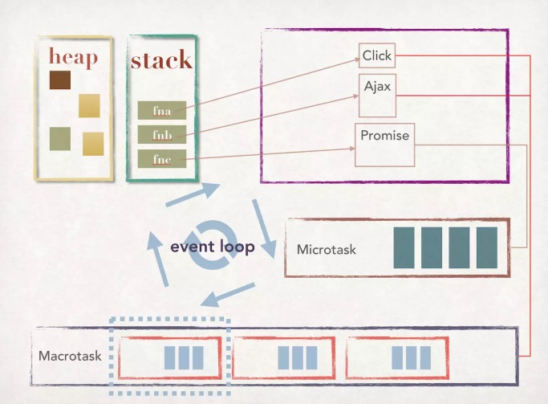

这就是 Event Loop 整个流程图，可以看到 Event Loop 当中包含 heap、stack、Microtask、Macrotask：

* heap：heap 是堆这种数据结构，堆其实就是平时所说的二叉树，这里存放的主要是 JavaScript 当中的对象，也是 Event Loop 当中一个重要的环节。
* stack：stack 是栈这种数据结构，它的特点就是后进先出，所以代码执行时，会将代码压入栈中进行执行，当任务完成之后，根据栈后进先出的特点，再将各个任务进行出栈。

上面是假定没有异步任务的情况下 JavaScript 的执行顺序，当遇到异步任务，比如：setTimeout、addEventListener 这类异步任务的时候，这个时候异步任务不会直接被压入到栈中，而是会交给浏览器的Web API 进行维护，当这些异步任务执行完成之后，会在任务队列当中放置对应事件。当执行栈当中任务为空的时候，然后浏览器读取任务队列，再把对应的异步任务压入到执行栈执行，这就是事件循环。整个流程如下图：

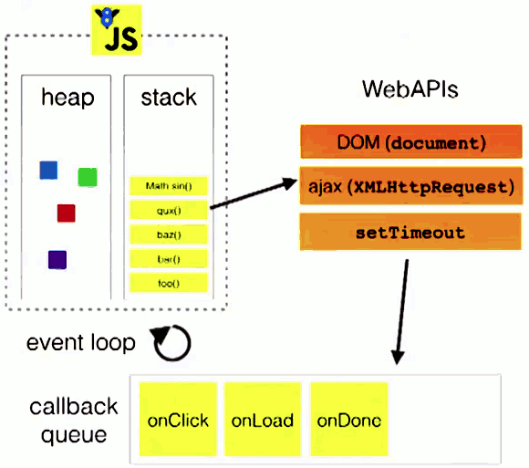

任务队列的详细执行顺序如下：

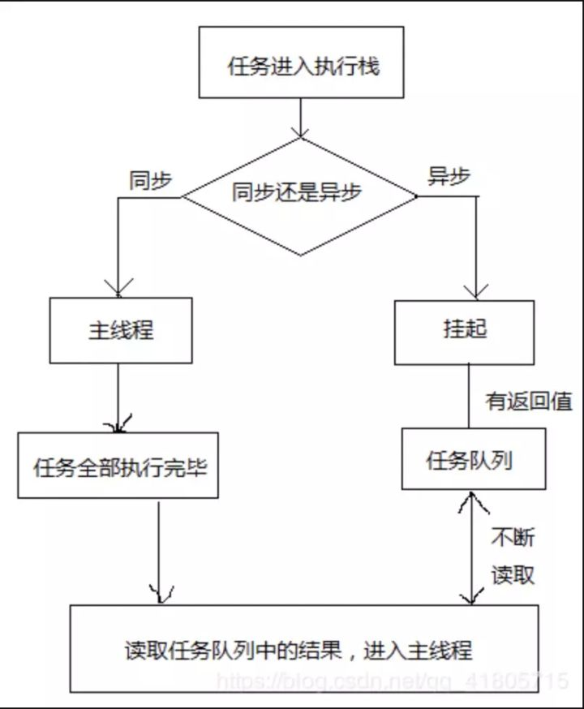

一个完整的 Event Loop 过程，可以概括为以下阶段：

1. 执行并出队一个 macro-task。注意如果是初始状态：调用栈空。micro 队列空，macro 队列里有且只有一个 script 脚本（整体代码）。这时首先执行并出队的就是 script 脚本；
2. 全局上下文（script 标签）被推入调用栈，同步代码执行。在执行的过程中，通过对一些接口的调用，可以产生新的 macro-task 与 micro-task，它们会分别被推入各自的任务队列里。**这个过程本质上是队列的 macro-task 的执行和出队的过程**；
3. 上一步我们出队的是一个 macro-task，这一步我们处理的是 micro-task。但需要注意的是：当 macro-task 出队时，任务是**一个一个**执行的；而 micro-task 出队时，任务是**一队一队**执行的（如下图所示）。因此，我们处理 micro 队列这一步，会逐个执行队列中的任务并把它出队，直到队列被清空；
4. 执行渲染操作，更新界面；
5. 检查是否存在 Web worker 任务，如果有，则对其进行处理。

#### （3）宏任务、微任务

<font style="color:#24292E;">浏览器端事件循环中的异步队列有两种：</font>**宏任务（ Macro Task ）** 和**微任务（Micro Task）**：

* **宏任务主要包括：** script( 整体代码)、setTimeout、setInterval、I/O、UI 交互事件、setImmediate(Node.js 环境)
* **微任务主要包括：** Promise、MutaionObserver、process.nextTick(Node.js 环境)

\*\*注意：\*\*在上面的分类中，有2个标注了 Node.js环境，这2个任务在浏览器环境当中并不是支持，只有在 Node 环境当中才可以直接执行。process.nextTick 可以在执行栈的尾部直接触发其对应的回调函数，因此在微任务当中 process.nextTick 的优先级是最高的。

来看下面一段代码：

```javascript
console.log(1);
setTimeout(function(){
  console.log(2);
}, 0);
Promise.resolve().then(function(){
  console.log(3);
}).then(function(){
  console.log(4);
});
// 输出结果：1 3 4 2
```

**注意：** promise的then和catch才是microtask，本身的内部代码不是。

所谓的Promise，简单说就是一个容器，里面保存着某个未来才会结束的事件（通常是一个异步操作）的结果。从语法上说，Promise 是一个对象，从它可以获取异步操作的消息。Promise 提供统一的 API，各种异步操作都可以用同样的方法进行处理。

Promise的函数代码的异步任务会优先于setTimeout的延时为0的任务先执行，原因是任务队列分为宏任务和微任务, 而promise中的then方法的函数会被推入到**微任务**队列中，而setTimeout函数会被推入到**宏任务。**

***

##### Event Loop过程：

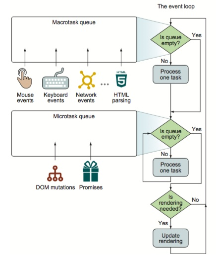

在Event Loop(事件循环)中，每一次循环称为 tick, 每一次tick的任务如下：

1. 检查macrotask队列是否为空，非空则到2，为空则到3
2. 执行macrotask中的一个任务
3. 继续检查microtask队列是否为空，若有则到4，否则到5
4. 取出microtask中的任务执行，执行完成返回到步骤3
5. 执行视图更新

当某个宏任务执行完后,会查看是否有微任务队列。如果有，先执行微任务队列中的所有任务，如果没有，会读取宏任务队列中排在最前的任务，执行宏任务的过程中，遇到微任务，依次加入微任务队列。栈空后，再次读取微任务队列里的任务，依次类推。

**Event Loop优化：**

提到性能优化，这里就要说 Event Loop 与更新渲染时机的关系了。在最开始的时候，Macrotask 当中放置了所有的 script 标签当中的代码，而 Microtask 当中为空。

当开始执行的时候，首先 script 标签当中的代码出 Macrotask，被压入到执行栈执行，这个时候就会有对应的任务被推入 Macrotask 和 Microtask 当中，上面已经说过 Microtask 是所有任务一起执行，而Macrotask 则是任务一个一个执行，那么页面渲染是在 Microtask 之后才进行的，如果在异步操作当中进行 DOM 操作，尽量将这个操作用 Microtask 当中的任务包一下，这样就可以在页面渲染之前就执行这个 DOM 操作了。

#### （4）Node的Event Loop

Node 中的 Event Loop 和浏览器中的是完全不相同的东西。Node.js采用V8作为js的解析引擎，而I/O处理方面使用了自己设计的libuv，libuv是一个基于事件驱动的跨平台抽象层，封装了不同操作系统一些底层特性，对外提供统一的API，事件循环机制也是它里面的实现

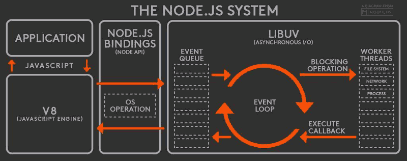

根据上图，node的运行机制如下

1. V8引擎解析JavaScript脚本。
2. 解析后的代码，调用Node API。
3. libuv库负责Node API的执行。它将不同的任务分配给不同的线程，形成一个Event Loop（事件循环），以异步的方式将任务的执行结果返回给V8引擎。
4. V8引擎再将结果返回给用户。

其中libuv引擎中的事件循环分为 6 个阶段，它们会按照顺序反复运行。每当进入某一个阶段的时候，都会从对应的回调队列中取出函数去执行。当队列为空或者执行的回调函数数量到达系统设定的阈值，就会进入下一阶段：

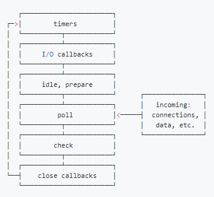

1. `timers` 阶段：这个阶段执行timer（setTimeout、setInterval）的回调，并且是由 poll 阶段控制的。
2. `I/O callbacks` 阶段：主要执行系统级别的回调函数，比如 TCP 连接失败的回调
3. `idle, prepare` 阶段：仅node内部使用
4. `poll` 阶段：获取新的I/O事件, 适当的条件下node将阻塞在这里
5. `check` 阶段：执行 setImmediate() 的回调
6. `close callbacks` 阶段：执行关闭请求的回调函数，比如执行 socket 的 close 事件回调

#####

##### 1）poll阶段

poll 是一个至关重要的阶段，这一阶段中，系统会做两件事情

* 回到 timer 阶段执行回调
* 执行 I/O 回调

并且在进入该阶段时如果没有设定了 timer 的话，会发生以下两件事情

* 如果 poll 队列不为空，会遍历回调队列并同步执行，直到队列为空或者达到系统限制
* 如果 poll 队列为空时，会有两件事发生
  * 如果有 setImmediate 回调需要执行，poll 阶段会停止并且进入到 check 阶段执行回调
  * 如果没有 setImmediate 回调需要执行，会等待回调被加入到队列中并立即执行回调，这里同样会有个超时时间设置防止一直等待下去

当然设定了 timer 的话且 poll 队列为空，则会判断是否有 timer 超时，如果有的话会回到 timer 阶段执行回调。

##### 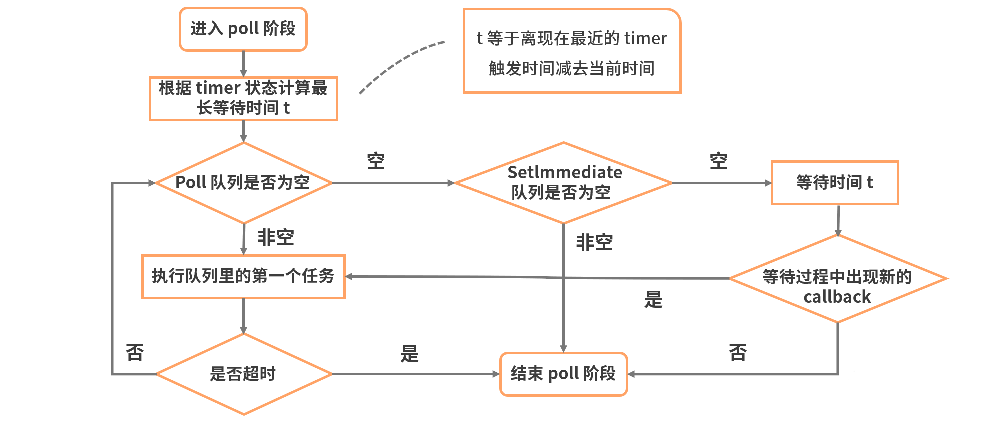

##### 2）Micro-Task 与 Macro-Task

Node端事件循环中的异步队列也是这两种：macro（宏任务）队列和 micro（微任务）队列。

* 常见的 macro-task 比如：`setTimeout`、`setInterval`、 `setImmediate`、`script（整体代码`）、` I/O 操作等`。
* 常见的 micro-task 比如: `process.nextTick`、`new Promise().then(回调)`等。

##### 3）setTimeout 和 setImmediate

二者非常相似，区别主要在于调用时机不同。

* setImmediate 设计在poll阶段完成时执行，即check阶段；
* setTimeout 设计在poll阶段为空闲时，且设定时间到达后执行，但它在timer阶段执行

```javascript
setTimeout(function timeout () {
  console.log('timeout');
},0);
setImmediate(function immediate () {
  console.log('immediate');
});
```

1. 对于以上代码来说，setTimeout 可能执行在前，也可能执行在后。
2. 首先 setTimeout(fn, 0) === setTimeout(fn, 1)，这是由源码决定的 进入事件循环也是需要成本的，如果在准备时候花费了大于 1ms 的时间，那么在 timer 阶段就会直接执行 setTimeout 回调
3. 如果准备时间花费小于 1ms，那么就是 setImmediate 回调先执行了

#####

**process.nextTick函数**其实是独立于 Event Loop 之外的，它有一个自己的队列，当每个阶段完成后，如果存在 nextTick 队列，就会清空队列中的所有回调函数，并且优先于其他 microtask 执行。

**Node与浏览器的 Event Loop 差异如下：**

* Node端，microtask 在事件循环的各个阶段之间执行
* 浏览器端，microtask 在事件循环的 macrotask 执行完之后执行

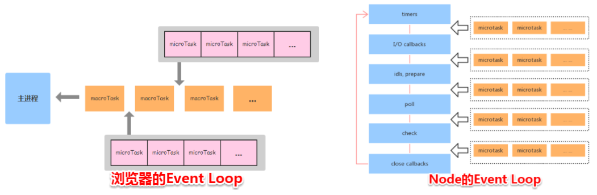

Node中的时间循环流程如下：

1. 执行全局的 Script 代码（与浏览器无差）；
2. 把微任务队列清空：注意，Node 清空微任务队列的手法比较特别。在浏览器中，我们只有一个微任务队列需要接受处理；但在 Node 中，有两类微任务队列：next-tick 队列和其它队列。其中这个 next-tick 队列，专门用来收敛 process.nextTick 派发的异步任务。**在清空队列时，优先清空 next-tick 队列中的任务，随后才会清空其它微任务**；
3. 开始执行 macro-task（宏任务）。注意，Node 执行宏任务的方式与浏览器不同：在浏览器中，我们每次出队并执行一个宏任务；而在 Node 中，我们每次会尝试清空当前阶段对应宏任务队列里的所有任务（除非达到了系统限制）；
4. 步骤3开始，会进入 3 -> 2 -> 3 -> 2…的循环（整体过程如下所示）:

```javascript
micro-task-queue ----> timers-queue 
                            |
                            |
micro-task-queue ----> pending-queue
                            |
                            |
micro-task-queue ---->  polling-queue
                            |
                            |
micro-task-queue ---->  check-queue
                            |
                            |
micro-task-queue ---->  close-queue
                            |
                            |
micro-task-queue ----> timers-queue 
......
```

#### （5）什么是调用栈

上面说了调用栈的概念，这里再补充一下。可以把调用栈认为是一个存储函数调用的**栈结构**，遵循先进后出的原则。

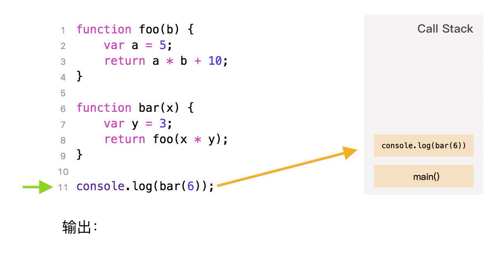

当开始执行 JS 代码时，首先会执行一个 main 函数，然后执行我们的代码。根据先进后出的原则，后执行的函数会先弹出栈，在图中我们也可以发现，foo 函数后执行，当执行完毕后就从栈中弹出了。

平时在开发中，大家也可以在报错中找到执行栈的痕迹

```javascript
function foo() {
  throw new Error('error')
}
function bar() {
  foo()
}
bar()
```

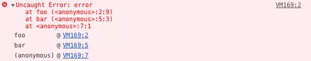

在上图中可以看到报错在 foo 函数，foo 函数又是在 bar 函数中调用的。当使用递归的时候，因为栈可存放的函数是有限制的，一旦存放了过多的函数且没有得到释放的话，就会出现爆栈的问题：

```javascript
function bar() {
  bar()
}
bar()
```

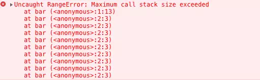

### 3. 事件委托（事件代理）

#### （1）事件委托的原理

事件委托就是利用**事件冒泡**，只指定一个事件处理程序，就可以管理某一类型的所有事件。

一般来讲，会将一个或一组元素的事件委托到它的父层或者更外层的元素上，真正绑定事件是外层的元素，当事件响应到需要绑定的元素上时，会通过事件冒泡机制从而触发它的外层元素的绑定事件上，然后在外层元素上去执行函数。

#### （2）事件委托的优点

**事件委托的优点：**

* 假如有一个列表，列表中有很多列表项，如果我们想要在点击某个列表项时响应一个事件，就可以使用后事件委托的原理，将时间绑定在父级元素上，在执行事件的时候再去匹配判断目标元素。这样，就不需要在每个列表项绑定事件，大大的减少了内存的消耗，提高了效率。
* \*\*动态绑定事件：\*\*有时，我们需要动态的新增或者删除元素，那每一次都要给元素重新绑定事件或者解绑事件，这样就很麻烦。如果我们使用事件委托，就可以避免这种麻烦，因为事件绑定在父层元素，和目标元素的事件增减是真没有关系的，执行到目标元素是在真正响应事件执行函数的过程中去匹配的。

#### （3）事件委托的缺点

当前，事件委托也不是万能的，它也有一定的局限性。比如：

* 像focus、blur等事件是没有事件冒泡机制的，所以无法实现事件委托
* mousemove、mouseout这类事件，虽然是有冒泡的机制，但是只能不断的移动位置去计算定位，对性能消耗很高，因此不适合使用事件委托

#### （4）事件委托的使用场景

比如，购物车中有一堆商品，我们可以给商品列表的父级元素绑定删除商品操作的事件，点击想要删除的商品，就会出发父级的函数，通过父级元素就会删除对应的商品


> 更新: 2021-08-06 00:51:09  
> 原文: <https://www.yuque.com/cuggz/feplus/tofm50>