# 浏览器存储

## 1. 概述

现代浏览器中提供了多种存储机制，打开浏览器的控制台（Mac 可以使用 Command + Option + J 快捷键，Windows  可以使用 Control + Shift + J 快捷键）。选择 Application 选项卡，可以在 Storage中 看到 Local Storage、Session Storage、IndexedDB、Web SQL、Cookies 等：

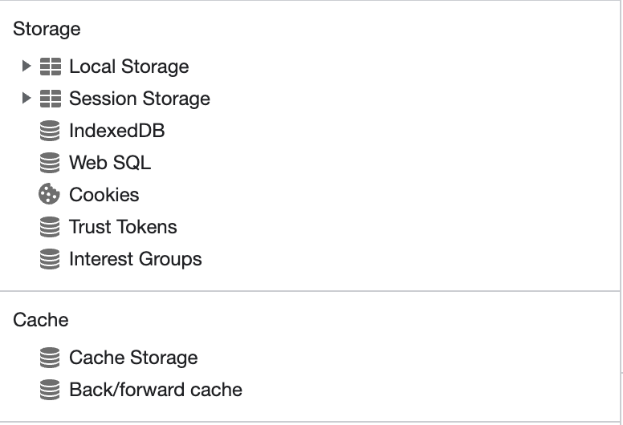

那数据存储在浏览器中有什么使用场景呢？在以下情况下，将数据存储在浏览器中成为更可行的选择：

* 在浏览器存储中保存应用状态，比如保持用户偏好（用户特定的设置，例如亮模式或暗模式、字体大小等）；
* 创建离线工作的渐进式 Web 应用，除了初始下载和更新之外没有服务器端要求；
* 缓存静态应用资源，如 HTML、CSS、JS 和图像等；
* 保存上一个浏览会话中的数据，例如存储上一个会话中的购物车内容，待办事项列表中的项目，记住用户是否以前登录过等。

无论哪种方式，将这些信息保存在客户端可以减少额外且不必要的服务器调用，并帮助提供离线支持。不过，需要注意，由于实现差异，浏览器存储机制在不同浏览器中的行为可能会有所不同。除此之外，许多浏览器已删除对 Web SQL 的支持，建议将现有用法迁移到 IndexedDB。

所以下面我们将介绍 Local Storage、Session Storage、IndexedDB、Cookies 的使用方式、使用场景以及它们之间的区别。

## 2. Web Storage

### （1）概述

HTML5 引入了 Web Storage，这使得在浏览器中存储和检索数据变得更加容易。Web Storage API 为客户端浏览器提供了安全存储和轻松访问键值对的机制。Web Storage 提供了两个 API 来获取和设置纯字符串的键值对：

* `localStorage`：用于存储持久数据，除非用户手动将其从浏览器中删除，否则数据将终身存储。即使用户关闭窗口或选项卡，它也不会过期；
* `sessionStorage`：用于存储临时会话数据，页面重新加载后仍然存在，关闭浏览器选项卡时数据丢失。

### （2）方法和属性

Web Storage API 由 4 个方法 `setItem()`、`getItem()`、`removeItem()` 、`clear()`、`key()`和一个 `length` 属性组成，以 localStorage 为例：

* `setItem()` ：用于存储数据，它有两个参数，即`key`和`value`。使用形式：`localStorage.setItem(key, value)`；
* `getItem()`：用于检索数据，它接受一个参数 key，即需要访问其值的键。使用形式：`localStorage.getItem(key)`;
* `removeItem()`：用于删除数据，它接受一个参数 key，即需要删除其值的键。使用形式：`localStorage.removeItem(key)`;
* `clear()` ：用于清除其中存储的所有数据，使用形式：`localStorage.clear()`;
* `key()`：该方法用于获取 localStorage 中数据的所有key，它接受一个数字作为参数，该数字可以是 localStorage 项的索引位置。

```javascript
console.log(typeof window.localStorage) // Object

// 存储数据
localStorage.setItem("colorMode", "dark")
localStorage.setItem("username", "zhangsan")
localStorage.setItem("favColor", "green")

console.log(localStorage.length) // 3

// 检索数据
console.log(localStorage.getItem("colorMode")) // dark

// 移除数据
localStorage.removeItem("colorMode")
console.log(localStorage.length) // 2
console.log(localStorage.getItem("colorMode")) // null

// 检索键名
window.localStorage.key(0); // favColor

// 清空本地存储
localStorage.clear()
console.log(localStorage.length) // 0
```

localStorage 和 sessionStorage 都非常适合缓存非敏感应用数据。可以在需要存储少量简单值并不经常访问它们是使用它们。它们本质上都是**同步**的，并且会阻塞主 UI 线程，所以应该谨慎使用。

### （3）存储事件

我们可以在浏览器上监听 localStorage 和 sessionStorage 的存储变化。 storage 事件在创建、删除或更新项目时触发。侦听器函数在事件中传递，具有以下属性：

* `newValue`：当在存储中创建或更新项目时传递给 setItem() 的值。 当从存储中删除项目时，此值设置为 null。
* `oldValue`：创建新项目时，如果该键存在于存储中，则该项目的先前的值。
* `key`：正在更改的项目的键，如果调用 .clear()，则值为 null。
* `url`：执行存储操作的 URL。
* `storageArea`：执行操作的存储对象（localStorage 或 sessionStorage）。

通常，我们可以使用 `window.addEventListener("storage", func)` 或使用 `onstorage` 属性（如 `window.onstorage = func`）来监听 `storage` 事件：

```javascript
window.addEventListener('storage', e => {
  console.log(e.key);
  console.log(e.oldValu);
  console.log(e.newValue);
});

window.onstorage = e => {
  console.log(e.key);
  console.log(e.oldValu);
  console.log(e.newValue);
});
```

注意，该功能不会在发生更改的同一浏览器选项卡上触发，而是由同一域的其他打开的选项卡或窗口触发。此功能用于同步同一域的所有浏览器选项卡/窗口上的数据。 因此，要对此进行测试，需要打开同一域的另一个选项卡。

### （4）存储限制

localStorage 和 sessionStorage 只能存储 5 MB 的数据，因此需要确保存储的数据不会超过此限制。

```javascript
localStorage.setItem('a', Array(1024 * 1024 * 5).join('a'))
localStorage.setItem('b', 'a')

// Uncaught DOMException: Failed to execute 'setItem' on 'Storage': Setting the value of `a` exceeded the quota.
```

在上面的例子中，收到了一个错误，首先创建了一个5MB的大字符串，当再添加其他数据时就报错了。

另外，localStorage 和 sessionStorage 只接受字符串。可以通过 `JSON.stringify` 和 `JSON.parse` 来解决这个问题：

```javascript
const user = {
  name : "zhangsan",
  age : 28,
  gender : "male",
  profession : "lawyer" 
};

localStorage.setItem("user", JSON.stringify(user));
localStorage.getItem("user");   // '{"name":"zhangsan","age":28,"gender":"male","profession":"lawyer"}'
JSON.parse(localStorage.getItem("user"))  // {name: 'zhangsan', age: 28, gender: 'male', profession: 'lawyer'}
```

如果我们直接将一个对象存储在 localStorage 中，那将会在存储之前进行隐式类型转换，将对象转换为字符串，再进行存储：

```javascript
const user = {
  name : "zhangsan",
  age : 28,
  gender : "male",
  profession : "lawyer" 
};

localStorage.setItem("user", user);
localStorage.getItem("user");  // '[object Object]'
```

Web Storage 使用了同源策略，也就是说，存储的数据只能在同一来源上可用。如果域和子域相同，则可以从不同的选项卡访问 localStorage 数据，而无法访问 sessionStorage 数据，即使它是完全相同的页面。

**另外：**

* 无法在 web worker 或 service worker 中访问 Web Storage；
* 如果浏览器设置为隐私模式，将无法读取到 Web Storage；
* Web Storage 很容易被 XSS 攻击，敏感信息不应存储在本地存储中；
* 它是同步的，这意味着所有操作都是一次一个。对于复杂应用，它会减慢应用的运行时间。

### （5）示例

下面来看一个使用 localStorage 的简单示例，使用 localStorage 来存储用户偏好：

```html
<input type="checkbox" id="darkTheme" name="darkTheme" onclick='onChange(this);'>
<label for="darkTheme">黑暗模式</label><br>
```

```css
html {
  background: white;
}

.dark {
  background: black;
  color: white;
}
```

```javascript
function toggle(on) {
  if (on) {
    document.documentElement.classList.add('dark'); 
  } else {
    document.documentElement.classList.remove('dark');    
  }
}

function save(on) {
  localStorage.setItem('darkTheme', on.toString());
}

function load() {
  return localStorage.getItem('darkTheme') === 'true';
}

function onChange(checkbox) {
  const value = checkbox.checked;
  toggle(value);
  save(value);
}

const initialValue = load();
toggle(initialValue);
document.querySelector('#darkTheme').checked = initialValue;
```

这里的代码很简单，页面上有一个单选框，选中按钮时将页面切换为黑暗模式，并将这个配置存储在 localStorage 中。当下一次再初始页面时，获取 localStorage 中的主题设置。

## 3. Cookie

### （1）Cookie 概述

Cookie 主要用于身份验证和用户数据持久性。Cookie 与请求一起发送到服务器，并在响应时发送到客户端；因此，cookies 数据在每次请求时都会与服务器交换。服务器可以使用 cookie 数据向用户发送个性化内容。严格来说，cookie 并不是客户端存储方式，因为服务器和浏览器都可以修改数据。它是唯一可以在一段时间后自动使数据过期的方式。

每个 HTTP 请求和响应都会发送 cookie 数据。存储过多的数据会使 HTTP 请求更加冗长，从而使应用比预期更慢：

* 浏览器限制 cookie 的大小最大为4kb，特定域允许的 cookie 数量为 20 个，并且只能包含字符串；
* cookie 的操作是同步的；
* 不能通过 web workers 来访问，但可以通过全局 window 对象访问。

Cookie 通常用于会话管理、个性化以及跨网站跟踪用户行为。我们可以通过服务端和客户端设置和访问 cookie。Cookie 还具有各种属性，这些属性决定了在何处以及如何访问和修改它们，

Cookie 分为两种类型：

* **会话 Cookie**：没有指定 Expires 或 Max-Age 等属性，因此在关闭浏览器时会被删除；
* **持久性 Cookie**：指定 Expires 或 Max-Age 属性。这些 cookie 在关闭浏览器时不会过期，但会在特定日期 (Expires) 或时间长度 (Max-Age) 后过期。

### （2）Cookie 操作

下面先来看看如何访问和操作客户端和服务器上的 cookie。

#### ① 客户端（浏览器）

客户端 JavaScript 可以通过 document.cookie 来读取当前位置可访问的所有 cookie。它提供了一个字符串，其中包含一个以分号分隔的 cookie 列表，使用 key=value 格式。

```javascript
document.cookie;
```

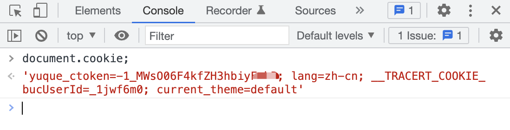

可以看到，在语雀主页中获取 cookie，结果中包含了登录的 cookie、语言、当前主题等。

同样，可以使用 document.cookie 来设置 cookie 的值，设置cookie也是用key=value格式的字符串，属性用分号隔开：

```javascript
document.cookie = "hello=world; domain=example.com; Secure";
```

这里用到了两个属性 SameSite 和 Secure，下面会介绍。如果已经存在同名的 cookie 属性，就会更新已有的属性值，如果不存在，就会创建一个新的 key=value。

如果需要经常在客户端处理 Cookie，建议使用像 js-cookie 这样的库来处理客户端 cookie：

```javascript
Cookies.set('hello', 'world', { domain: 'example.com', secure: true });
Cookies.get('hello'); // -> world
```

这样不仅为 cookie 上的 CRUD 操作提供了一个干净的 API，而且还支持 TypeScript，从而帮助避免属性的拼写错误。

#### ② 服务端（Node.js）

服务端可以通过 HTTP 请求的请求头和响应头来访问和修改 cookie。每当浏览器向服务端发送 HTTP 请求时，它都会使用 cookie 头将所有相关 cookie 都附加到该站点。请求标头是一个分号分隔的字符串。

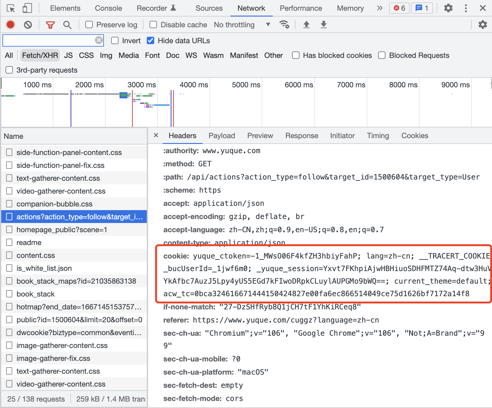

这样就可以从请求头中读取这些 cookie。如果在服务端使用 Node.js，可以像下面这样从请求对象中读取它们，将获得以分号分隔的 key=value 对：

```javascript
http.createServer(function (request, response) {
    const cookies = request.headers.cookie;
    // "cookie1=value1; cookie2=value2"
    ...
}).listen(8124);
```

如果想要设置 cookie，可以在响应头中添加 Set-Cookie 头，其中 cookie 采用 key=value 的格式，属性用分号分隔：

```javascript
response.writeHead(200, {
    'Set-Cookie': 'mycookie=test; domain=example.com; Secure'
});
```

通常我们不会直接编写 Node.js，而是与 ExpressJS 这样的 Node.js 框架一起使用。使用 Express 可以更轻松地访问和修改 cookie。只需添加一个像 cookie-parser 这样的中间件，就可以通过 req.cookies 以 JavaScript 对象的形式获得所有的 cookie。 还可以使用 Express 内置的 res.cookie() 方法来设置 cookie：

```javascript
const express = require('express')
const cookieParser = require('cookie-parser')
    
const app = express()
app.use(cookieParser())
    
app.get('/', function (req, res) {
    console.log('Cookies: ', req.cookies)
    // Cookies: { cookie1: 'value1', cookie2: 'value2' }

    res.cookie('name', 'tobi', { domain: 'example.com', secure: true })
})
    
app.listen(8080)
```

### （3）Cookie 属性

下面来深入了解 cookie 的属性。 除了名称和值之外，cookie 还具有控制很多方面的属性，包括安全方面、生命周期以及它们在浏览器中的访问位置和方式等。

#### ① Domain

Domain 属性告诉浏览器允许哪些主机访问 cookie。如果未指定，则默认为设置 cookie 的同一主机。因此，当使用客户端 JavaScript 访问 cookie 时，只能访问与 URL 域相同的 cookie。 同样，只有与 HTTP 请求的域共享相同域的 cookie 可以与请求头一起发送到服务端。

注意，拥有此属性并不意味着可以为任何域设置 cookie，因为这显然会带来巨大的安全风险。 此属性存在的唯一原因就是**减少域的限制并使 cookie 在子域上可访问**。例如，如果当前的域是 abc.xyz.com，并且在设置 cookie 时如果不指定 Domain 属性，则默认为 abc.xyz.com，并且 cookie 将仅限于该域。 但是，可能希望相同的 cookie 也可用于其他子域，因此可以设置 Domain=xyz.com 以使其可用于其他子域，如 def.xyz.com 和主域 xyz.com。

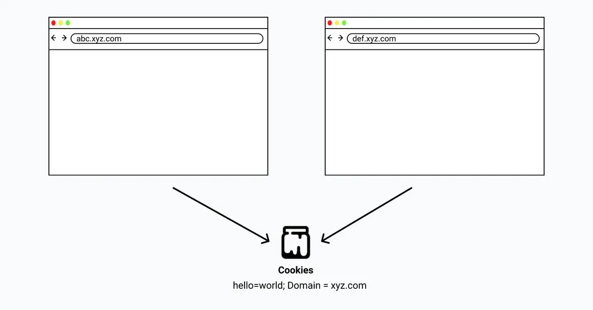

#### ② Path

此属性指定访问 cookie 必须存在的请求 URL 中的路径。除了将 cookie 限制到域之外，还可以通过路径来限制它。 路径属性为 Path=/store 的 cookie 只能在路径 /store 及其子路径 /store/cart、/store/gadgets 等上访问。

#### ③ **Expires/Max-size**

该属性用来设置 cookie 的过期时间。若设置其值为一个时间，那么当到达此时间后，cookie 就会失效。不设置的话默认值是 Session，意思是cookie会和session一起失效。当浏览器关闭(不是浏览器标签页) 后，cookie 就会失效。

除此之外，它还可以通过将过期日期设置为过去来删除 cookie。

#### ④ Secure

具有 Secure 属性的 cookie 仅可以通过安全的 HTTPS 协议发送到服务器，而不会通过 HTTP 协议。这有助于通过使 cookie 无法通过不安全的连接访问来防止中间人攻击。除非网站实用不安全的 HTTP 连接，否则应该始终将此属性与所有 cookie 一起使用。

#### ⑤ HTTPOnly

此属性使 cookie 只能通过服务端访问。 因此，只有服务断可以通过响应头设置它们，然后浏览器会将它们与每个后续请求的头一起发送到服务器，并且它们将无法通过客户端 JavaScript 访问。

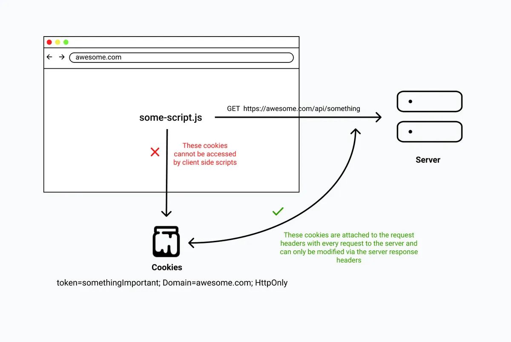

这可以在一定程度上帮助保护带有敏感信息（如身份验证 token）的 cookie 免受 XSS 攻击，因为任何客户端脚本都无法读取 cookie。但这并不意味着可以完全免受 XSS 攻击。因为，如果攻击者可以在网站上执行第三方脚本，那可能无法访问 cookie，相反，他们可以直接向服务端执行相关的 API 请求。因此，想象一下用户访问了一个页面，黑客在网站上注入了恶意脚本。他们可以使用该脚本执行任何 API，并在他们不知道的情况下代表用户执行操作。

### （4）Cookie 工具库

#### ①  Js Cookie（JavaScript）

Js Cookie 是一个简单、轻量级的 JavaScript API，用于处理浏览器 cookie。其支持 AMD、CommonJS 和 ES 模块、没有依赖关系、经过彻底测试、支持自定义编码和解码、通用浏览器支持。

安装：

```javascript
npm i js-cookie
```

使用：

```javascript
// 设置 Cookie
Cookies.set('cookie-name', 'cookie-value', { expires: 14})

// 读取 Cookie
Cookies.get('cookie-name')

// 删除 Cookie
Cookies.remove('cookie-name')
```

#### ② React Cookie（React）

[React Cookie](https://www.npmjs.com/package/react-cookie) 是一个专门用于 React 的 cookie 库，它继承了 Universal Cookie 库的功能。它提供了一组组件和 Hooks，使 React 中的 cookie 处理非常简单。如果使用的是 React 16.8+ 版本，就可以使用 hooks 来处理 cookie。否则，必须使用其提供的组件。

安装：

```javascript
npm i react-cookie
```

React Cookie 提供了 3 个 Hook，分别是 cookie、setCookie 和 removeCookie。 可以使用这些 Hook 来处理 React 应用中的 cookie。

```javascript
const [cookies, setCookie, removeCookie] = useCookies(['cookie-name']);
// 设置 Cookie
setCookie(name, value, [options]);
// 删除 Cookie
removeCookie(name, [options])
```

#### ③ Cookies（Node.js）

Cookies 是用于 HTTP cookie 配置的流行 NodeJS 模块之一。可以轻松地将其与内置的 NodeJS HTTP 库集成或将其用作 Express 中间件。它允许使用 Keygrip 对 cookie 进行签名以防止篡改、支持延迟 cookie 验证、不允许通过不安全的套接字发送安全 cookie、允许其他库在不知道签名机制的情况下访问 cookie。

安装：

```javascript
npm install cookies
```

使用：

```javascript
const cookie = require('cookie');
cookies = new Cookies( request, response, [ options ] )

// 读取 cookies
cookies.get( name, [ options ] )

// 设置 cookies
cookies.set( name, [ value ], [ options ] )
```

## 4. IndexedDB

### （1）概述

IndexedDB 提供了一个类似 NoSQL 的 key/value 数据库，它可以存储大量结构化数据，甚至是文件和 blob。 每个域至少有 1GB 的可用空间，并且最多可以达到剩余磁盘空间的 60%。

IndexedDB 于 2011 年首次实现，并于 2015 年 1 月成为 W3C 标准，它具有良好的浏览器支持：

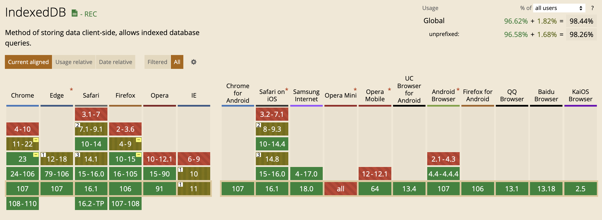

key/value 数据库意味着存储的所有数据都必须分配给一个 key。它将key 与 value 相关联，key 用作该值的唯一标识符，这意味着可以使用该 key 跟踪该值。如果应用需要不断获取数据，key/value 数据库使用非常高效且紧凑的索引结构来快速可靠地通过 key 定位值。使用该 key，不仅可以检索存储的值，还可以删除、更新和替换该值。

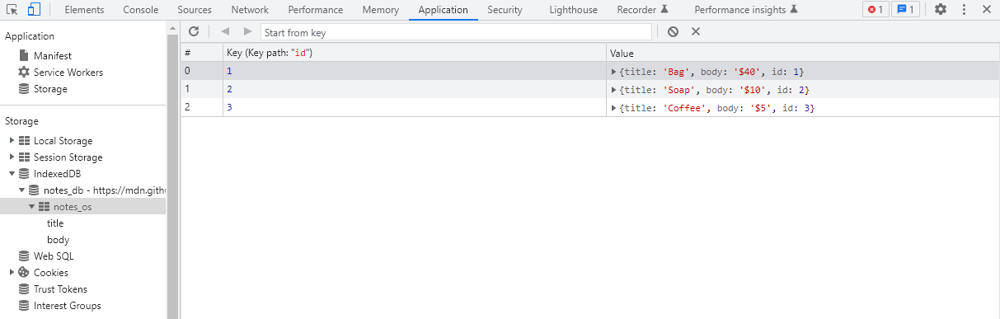

在说 IndexedDB 之前，先来看一些相关术语：

* \*\*数据库：\*\*一个域可以创建任意数量的 IndexedDB 数据库，只有同一域内的页面才能访问数据库。
* **object store**：相关数据项的 key/value 存储。它类似于 MongoDB 中的集合或关系数据库中的表。
* **key**：用于引用 object store\*\* \*\*中每条记录（值）的唯一名称。它可以使用自动增量数字生成，也可以设置为记录中的任何唯一值。
* **index**：在 object store 中组织数据的另一种方式。搜索查询只能检查 key 或 index。
* schema：object store、key 和 index 的定义。
* **version**：分配给 schema 的版本号（整数）。 IndexedDB 提供自动版本控制，因此可以将数据库更新到最新 schema。
* **操作**：数据库活动，例如创建、读取、更新或删除记录。

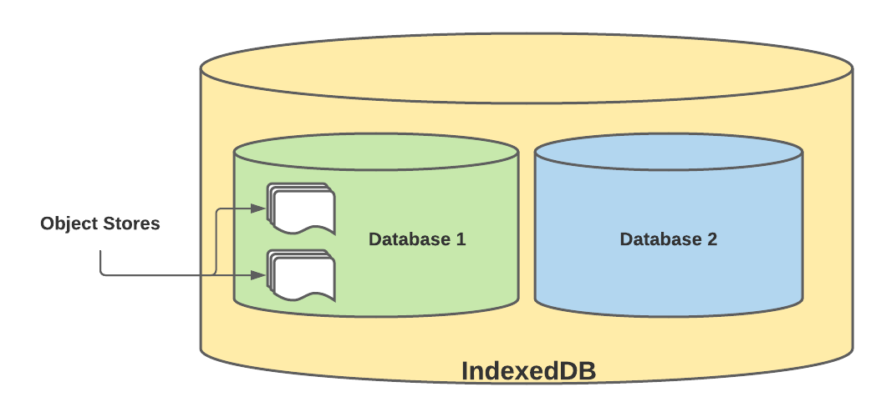

### （2）特点及使用场景

**indexedDB 特点如下：**

* 可以将任何 JavaScript 类型的数据存储为键值对，例如对象（blob、文件）或数组等。
* IndexedDB API 是异步的，不会在数据加载时停止页面的渲染。
* 可以存储结构化数据，例如 Date、视频、图像对象等。
* 支持数据库事务和版本控制。
* 可以存储大量数据。
* 可以在大量数据中快速定位/搜索数据。
* 数据库是域专用的，因此任何其他站点都无法访问其他网站的 IndexedDB 存储，这也称为同源策略。

**In\*\*\*\*dexedDB 使用场景：**

* \*\*存储用户生成的内容：\*\*例如表单，在填写表单的过程中，用户可以离开并稍后再回来完成表单，存储之后就不会丢失初始输入的数据。
* \*\*存储应用状态：\*\*当用户首次加载网站或应用时，可以使用 IndexedDB 存储这些初始状态。可以是登录身份验证、API 请求或呈现 UI 之前所需的任何其他状态。因此，当用户下次访问该站点时，加载速度会增加，因为应用已经存储了状态，这意味着它可以更快地呈现 UI。
* \*\*对于离线工作的应用：\*\*用户可以在应用离线时编辑和添加数据。当应用程序来连接时，IndexedDB 将处理并清空同步队列中的这些操作。

### （3）IndexedDB 操作

不同浏览器的 IndexedDB 可能使用不同的名称。可以使用以下方法检查 IndexedDB 支持：

```javascript
const indexedDB =
  window.indexedDB ||
  window.mozIndexedDB ||
  window.webkitIndexedDB ||
  window.msIndexedDB ||
  window.shimIndexedDB;

if (!indexedDB) {
  console.log("不支持 IndexedDB");
}
```

可以使用 `indexedDB.open()` 来连接数据库：

```javascript
const dbOpen = indexedDB.open('performance', 1);
```

`indexedDB.open` 的第一个参数是数据库名称，第二个参数是可选的版本整数。

可以使用以下三个事件处理函数监听 indexedDB 的连接状态：

#### ① onerror

在无法建立 IndexedDB 连接时，将触发该事件：

```javascript
// 连接失败
dbOpen.onerror = e => {
  reject(`IndexedDB error: ${ e.target.errorCode }`);
};
```

如果在无痕模式、隐私模式下运行浏览器，可能不支持 IndexedDB，需要禁用这些模式。

#### ② onupgradeneeded

一旦数据库连接打开，就会触发 onupgradeneeded 事件，该事件可用于创建 object store。

```javascript
dbOpen.onupgradeneeded = e => {
   const db = dbOpen.result;

   // 创建 object store
   const store = db.createObjectStore("cars", { keyPath: "id" });
   // 使用自动递增的id
   // const store = db.createObjectStore('cars', { autoIncrement: true }); 

   // 创建索引
   
   store.createIndex("cars_colour", ["colour"], { 
       unique: true 
   }); 

   // 创建复合索引
   store.createIndex("colour_and_make", ["colour", "make"], {
    unique: false,
  });
};
```

IndexedDB 使用了 object store 的概念，其本质上是数据集合的名称。可以在单个数据库中创建任意数量的 object store。keyPath是 IndexedDB 将用来识别对象字段名称，通常是一个唯一的编号，也可以通过 `autoIncrement: true` 来自动为 store 设置唯一递增的 ID。除了普通的索引，还可以创建复合索引，使用多个关键词的组合进行查询。

#### ③ onsuccess

在连接建立并且所有升级都完成时，将触发该事件。上面我们已经新建了 schema，接下来就可以在onsuccess 中添加、查询数据。

```javascript
// 连接成功
dbOpen.onsuccess = () => {
  this.db = dbOpen.result;

  //1
  const transaction = db.transaction("cars", "readwrite");
  
  //2
  const store = transaction.objectStore("cars");
  const colourIndex = store.index("cars_colour");
  const makeModelIndex = store.index("colour_and_make");

  //3
  store.put({ id: 1, colour: "Red", make: "Toyota" });
  store.put({ id: 2, colour: "Red", make: "Kia" });
  store.put({ id: 3, colour: "Blue", make: "Honda" });
  store.put({ id: 4, colour: "Silver", make: "Subaru" });

  //4
  const idQuery = store.get(4);
  const colourQuery = colourIndex.getAll(["Red"]);
  const colourMakeQuery = makeModelIndex.get(["Blue", "Honda"]);

  // 5
  idQuery.onsuccess = function () {
    console.log('idQuery', idQuery.result);
  };
  colourQuery.onsuccess = function () {
    console.log('colourQuery', colourQuery.result);
  };
  colourMakeQuery.onsuccess = function () {
    console.log('colourMakeQuery', colourMakeQuery.result);
  };

  // 6
  transaction.oncomplete = function () {
    db.close();
  };
};
```

这里总共有六部分：

1. 为了对数据库执行操作，我们必须创建一个 schema，一个 schema 可以是单个操作，也可以是多个必须全部成功的操作，否则都不会成功；
2. 这里用来获取 cars object store 的引用以及对应的索引；
3. object store 上的 put 方法用于将数据添加到数据库中；
4. 这里就是数据的查询，可以使用 keyPath 的值直接查询项目（第14行）；第15行中的 getAll 方法将返回一个包含它找到的每个结果的数组，我们正在根据  cars\_colour 索引来搜索 Red，应该会查找到两个结果。第16行根据复合索引查找颜色为Blue，并且品牌为 Honda 的结果。
5. 搜索成功的事件处理函数，它们将在查询完成时触发。
6. 最后，在事务完成时关闭与数据库连接。 无需使用 IndexedDB 手动触发事务，它会自行运行。

运行上面的代码，就会得到以下结果：

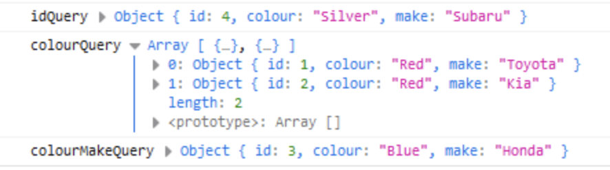

可以在 Chrome Devtools 中查看：

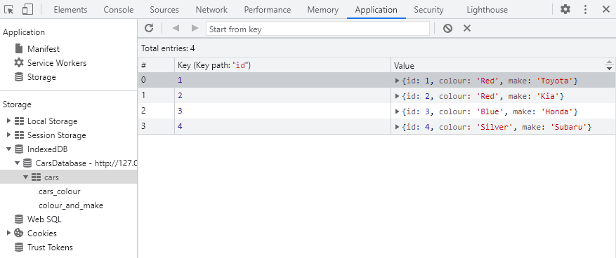

下面来看看如何更新和删除数据。

* \*\*更新：\*\*首先使用个 get 来获取需要更新的数据，然后使用 store 上的 put 方法更新现有数据。 put 是一种“插入或更新”方法，它要么覆盖现有数据，要么在新数据不存在时插入新数据。

```javascript
const subaru = store.get(4);

subaru.onsuccess= function () {
  subaru.result.colour = "Green";
  store.put(subaru.result);
}
```

这会将数据库中 Silver 色的 Subaru 的颜色更新为绿色。

* **删除**：可以使用 delete API 来删除数据，最简单的方法是通过其 key 来删除：

```javascript
const deleteCar = store.delete(1);

deleteCar.onsuccess = function () {
  console.log("Removed");
};
```

如果不知道 key 并且希望根据值来删除，可以这样：

```javascript
const redCarKey = colourIndex.getKey(["Red"]);

redCarKey.onsuccess = function () {
  const deleteCar = store.delete(redCarKey.result);

  deleteCar.onsuccess = function () {
    console.log("Removed");
  };
};
```

结果如下：

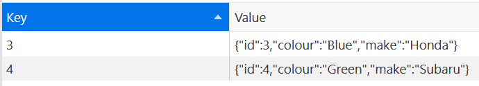

## 5. 存储空间分析

可以使用基于 Promise 的 [Storage API](https://developer.mozilla.org/zh-CN/docs/Web/API/Storage_API) 检查 Web Storage、IndexedDB 和 Cache API 的剩余空间。 异步 `.estimate()` 方法返回：

* `quota` 属性：可用的空间；
* `usage` 属性：已用的空间。

```javascript
(async () => {
  if (!navigator.storage) return;

  const storage = await navigator.storage.estimate();

  console.log(`可用大小: ${ storage.quota / 1024 } Kb`);
  console.log(`已用大小: ${ storage.usage / 1024 } Kb`);
  console.log(`已用占比: ${ Math.round((storage.usage / storage.quota) * 100) }%`);
  console.log(`剩余大小: ${ Math.floor((storage.quota - storage.usage) / 1024) } Kb`);
})();
```

Storage API 的浏览器兼容性如下：

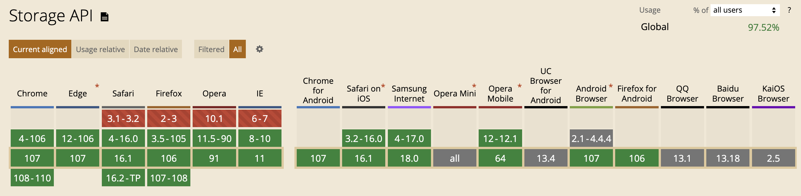


> 更新: 2022-11-06 21:08:10  
> 原文: <https://www.yuque.com/cuggz/feplus/amhc9b>