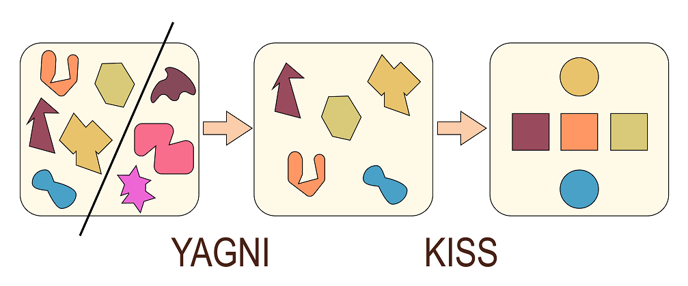
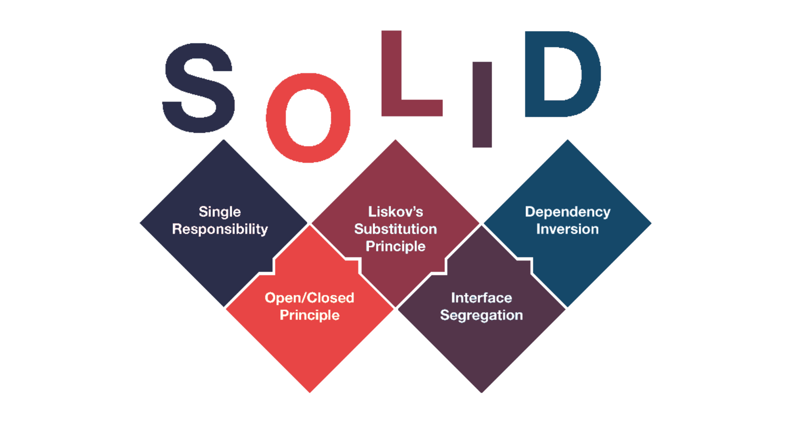
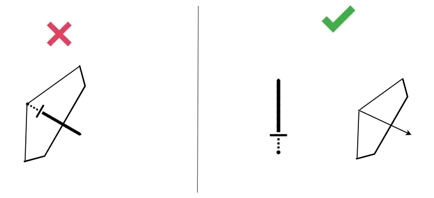
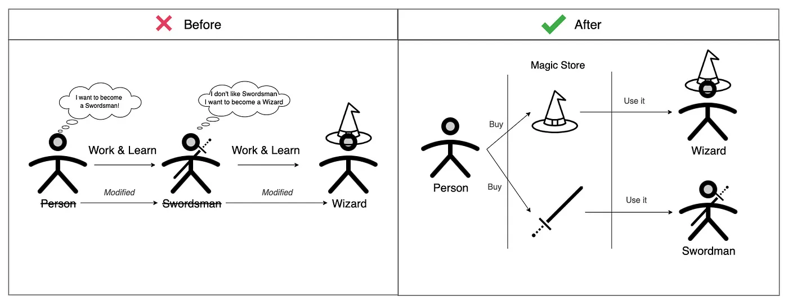
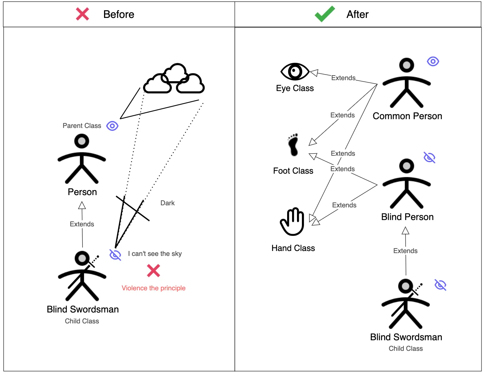
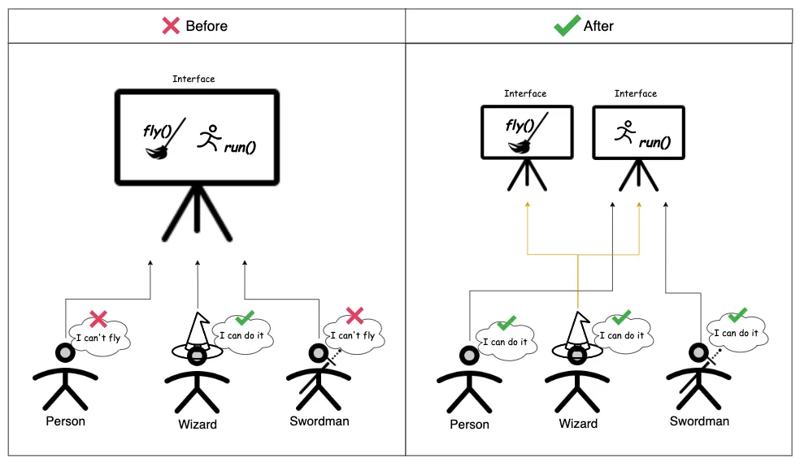
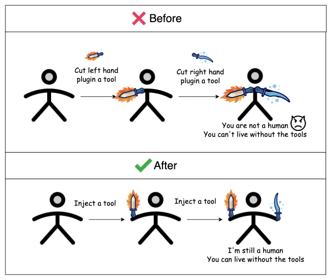

# 前端代码设计原则：SOLID、KISS、YAGNI、DRY

多年来，对提高代码质量并提高其可读性、可维护性和性能的无止境的追求产生了许多架构和设计原则。SOLID、KISS、YAGNI、DRY 就是常见的代码设计原则，下面就来看看如何在 JavaScript 中应用这些原则！

## 基本概念

SOLID、KISS、YAGNI 和 DRY 是开发中常用的原则或准则：

* **SOLID**：这是面向对象设计和编程中的五个基本原则的缩写。它们是单一职责原则 (SRP)、开放封闭原则 (OCP)、里氏替换原则 (LSP)、接口隔离原则 (ISP) 和依赖倒置原则 (DIP)。这些原则旨在帮助开发人员编写可维护、灵活和可扩展的代码。
* **DRY**："Don't Repeat Yourself" 的缩写，意为 "不要重复自己"。这个原则强调避免重复的代码。相同的代码应该抽象为可重用的组件或函数，以减少冗余，并提高代码的可维护性和可扩展性。
* **KISS**："Keep It Simple, Stupid" 的缩写，意为 "保持简单，蠢x"。这个原则强调在设计和编写代码时要保持简单明了，避免过度复杂化。简单的解决方案通常更易于理解、调试和维护。
* **YAGNI**："You Aren't Gonna Need It" 的缩写，意为 "你不会需要它"。这个原则强调只实现当前需求，避免过早地添加不必要的功能或扩展。不要为预期的、但目前并不需要的功能增加额外的复杂性。

实际上，KISS就是强调在开发过程中避免实现不必要的功能或添加不必要的代码（**要怎么做**），而 YAGNI 原则强调在开发过程中避免实现不必要的功能或添加不必要的代码（**不要怎么做**）。



下面来分别看看这些原则。

## SOLID

SOLID 是面向对象设计和编程的五个基本原则的缩写：

* **单一职责原则**（Single Responsibility Principle，SRP）：一个类（函数）应该只有一个引起变化的原因。每个类（函数）应该只负责一项单一的职责。这样可以提高代码的可维护性和可测试性。
* **开放封闭原则**（Open-Closed Principle，OCP）：软件实体（类、模块、函数等）应该对扩展是开放的，对修改是封闭的。这意味着我们应该通过添加新代码来扩展功能，而不是修改现有代码。
* **里氏替换原则**（Liskov Substitution Principle，LSP）：子类对象应该能够替代任何父类对象而不破坏程序的正确性。换句话说，子类应该符合父类所定义的接口，并且不应该改变父类的行为。
* **接口隔离原则**（Interface Segregation Principle，ISP）：客户端不应该被迫依赖它们不使用的接口。应该将大型接口拆分为更小的、特定于客户端需求的接口，以避免不必要的依赖关系。
* **依赖倒置原则**（Dependency Inversion Principle，DIP）：高层模块不应该依赖于低层模块，两者都应该依赖于抽象。这意味着我们应该通过抽象接口或类来解耦高层和低层模块之间的依赖关系。



### **单一职责原则**

> 单一职责原则：一个类（函数）应该只有一个引起变化的原因。每个类（函数）应该只负责一项单一的职责。这样可以提高代码的可维护性和可测试性。



这个原则简单来说就是，任何类或函数都应该只负责一件事，下面来看一个例子。

例如，假设有一些形状，我们想要对这些形状的面积求和。代码如下：

```javascript
const Circle = (radius) => { 
  const proto = { 
    type: 'Circle', 
    // ... 
  } 
  return Object.assign(Object.create(proto), {radius}) 
}

const square = (length) => { 
  const proto = { 
    type: 'Square', 
    // ...
  } 
  return Object.assign(Object.create(proto), {length}) 
}
```

首先，先来创建形状工厂函数。那什么是工厂函数呢？在 JavaScript 中，任何函数都可以返回一个新对象。当它不是构造函数或类时，它被称为工厂函数。

接下来，创建`areaCalculator`工厂函数，然后编写逻辑来总结所有提供的形状的面积。

```javascript
const areaCalculator = (s) => { 
  const proto = { 
    sum() { 
      // 求和逻辑
    }, 
    output () { 
     return ` 
       <h1>
         所提供形状的面积总和: 
         ${this.sum()} 
       < /h1> `
    } 
  } 
  return Object.assign(Object.create(proto), {shapes: s}) 
}
```

要使用`areaCalculator`工厂函数，只需调用该函数并传入形状数组，然后在页面底部显示输出。

```javascript
const shapes = [
  circle(2),
  square(5),
  square(6)
]
const areas = areaCalculator(shapes)
console.log(areas.output())
```

问题出在 `output` 方法上，因为 `areaCalculator` 处理了输出数据的逻辑。那么，如果用户想要将数据输出为 JSON 或其他格式，该怎么办呢？

所有的逻辑都由 `areaCalculator` 工厂函数处理，这与 "单一职责原则" 不符；`areaCalculator` 工厂函数只应该计算所提供形状的面积总和，而不应该关心用户想要的是 JSON 还是 HTML。

为了解决这个问题，可以创建一个` SumCalculatorOutputter` 工厂函数，并使用它来处理对所有提供形状的面积总和显示的逻辑。

`SumCalculatorOutputter` 工厂函数的实现如下：

```javascript
const shapes = [
  circle(2),
  square(5),
  square(6)
]
const areas  = areaCalculator(shapes)
const output = sumCalculatorOputter(areas)
console.log(output.JSON())
console.log(output.HAML())
console.log(output.HTML())
console.log(output.JADE())
```

现在，将数据输出给用户所需的任何逻辑现在都由 `sumCalculatorOutputter` 工厂函数处理。

### 开放封闭原则

> 开放封闭原则：软件实体（类、模块、函数等）应该对扩展是开放的，对修改是封闭的。这意味着我们应该通过添加新代码来扩展功能，而不是修改现有代码。



这简而言之，这意味着在上面的例子中，类或工厂函数应该可以轻松扩展，而无需修改类或函数本身。来看一下`areaCalculator`工厂函数，特别是它的`sum`方法。

```javascript
sum () {
 const area = []
 for (shape of this.shapes) {
  if (shape.type === 'Square') {
     area.push(Math.pow(shape.length, 2)
   } else if (shape.type === 'Circle') {
     area.push(Math.PI * Math.pow(shape.length, 2)
   }
 }
 return area.reduce((v, c) => c += v, 0)
}
```

如果希望 `sum` 方法能够对更多形状的面积求和，就必须添加更多的 `if/else` 块，这违背了开放封闭原则。

可以使这个 `sum` 方法变得更好的一种方法是删除 `sum` 方法中计算每个形状面积的逻辑，并将其附加到形状的工厂函数中。

```javascript
const square = (length) => {
  const proto = {
    type: 'Square',
    area () {
      return Math.pow(this.length, 2)
    }
  }
  return Object.assign(Object.create(proto), {length})
}
```

对于 `circle` 工厂函数，也应该进行同样的操作，即添加一个 `area` 方法。这样，计算提供的任何形状的面积总和就会变得非常简单：

```javascript
sum() {
 const area = []
 for (shape of this.shapes) {
   area.push(shape.area())
 }
 return area.reduce((v, c) => c += v, 0)
}
```

现在可以创建另一个形状类，并在计算总和时将其传递进去，而不会破坏代码。然而，现在又出现了另一个问题，如何知道传递给 `areaCalculator` 的对象实际上是一个形状对象，或者该形状对象是否有一个叫做 `area` 的方法呢？

面向接口编程是 SOLID 的一个重要部分，一个快速的示例是创建一个接口，所有形状都实现该接口。

由于 JavaScript 没有接口，这里以 TypeScript 来演示如何实现这一点，因为 TypeScript 对经典的面向对象编程进行了建模，并且与纯 JavaScript 的原型面向对象编程有所不同。

```typescript
interface ShapeInterface { 
 area(): number 
}  

class Circle implements ShapeInterface {     
 let radius: number = 0     
 constructor (r: number) {        
  this.radius = r     
 }      
 
 public area(): number { 
  return MATH.PI * MATH.pow(this.radius, 2)
 } 
}
```

在上面的示例中，展示了在 TypeScript 中如何实现这一点，但在底层，TypeScript 会将代码编译为纯 JavaScript，并且在编译后的代码中没有接口，因为 JavaScript 并不支持接口。那么，在没有接口的情况下，我们该如何实现呢？可以使用**函数组合**！

首先，创建一个 `shapeInterface` 工厂函数，`shapeInterface` 将是一个抽象的接口，使用函数组合来实现。

```javascript
const shapeInterface = (state) => ({
  type: 'shapeInterface',
  area: () => state.area(state)
})
```

然后将其实现到 `square` 工厂函数中：

```javascript
const square = (length) => {
  const proto = {
    length,
    type : 'Square',
    area : (args) => Math.pow(args.length, 2)
  }
  const basics = shapeInterface(proto)
  const composite = Object.assign({}, basics)
  return Object.assign(Object.create(composite), {length})
}
```

调用 `square` 工厂函数的结果将是：

```javascript
const s = square(5)
console.log('OBJ\n', s)
console.log('PROTO\n', Object.getPrototypeOf(s))
s.area()

// 输出结果
OBJ
 { length: 5 }
PROTO
 { type: 'shapeInterface', area: [Function: area] }
25
```

在 `areaCalculator` 的 `sum` 方法中，可以检查提供的形状是否实际上是 `shape` 接口的类型，否则就抛出异常：

```javascript
sum() {
  const area = []
  for (shape of this.shapes) {
    if (Object.getPrototypeOf(shape).type === 'shapeInterface') {
       area.push(shape.area())
     } else {
       throw new Error('this is not a shapeInterface object')
     }
   }
   return area.reduce((v, c) => c += v, 0)
}
```

### 里氏替换原则

> **里氏替换原则**：子类对象应该能够替代任何父类对象而不破坏程序的正确性。换句话说，子类应该符合父类所定义的接口，并且不应该改变父类的行为。



这里仍然使用 `areaCalculator` 工厂函数来举例说明。假设有一个`volumeCalculator`工厂函数，它扩展了`areaCalculator`工厂函数。在ES6中，可以使用 `Object.assign()` 和 `Object.getPrototypeOf()` 来扩展对象而不破坏其功能。

```typescript
const volumeCalculator = (s) => {
  const proto = {
    type: 'volumeCalculator'
  }
  const areaCalProto = Object.getPrototypeOf(areaCalculator())
  const inherit = Object.assign({}, areaCalProto, proto)
  return Object.assign(Object.create(inherit), {shapes: s})
}
```

`Object.assign(target, ...sources)` 方法用于将一个或多个源对象的属性复制到目标对象中，并返回目标对象。这个方法将源对象的所有可枚举属性复制到目标对象中，并覆盖相同属性名的值。用法如下：

```javascript
const target = { a: 1 };
const source = { b: 2, c: 3 };

const result = Object.assign(target, source);
console.log(result); // 输出：{ a: 1, b: 2, c: 3 }
```

在上面的示例中，`Object.assign(target, source)` 将 `source` 对象的属性复制到 `target` 对象中，并返回结果对象。`target` 对象的原始属性将被修改或覆盖。

另外，如果想要获取一个对象的原型（即父类对象），可以使用 `Object.getPrototypeOf(object)` 方法。用法如下：

```javascript
const shape = {
  area() {
    // 计算并返回形状的面积
  }
};

console.log(Object.getPrototypeOf(shape)); // 输出：{}（默认原型为空对象）
```

在这个示例中，Object.getPrototypeOf(shape) 返回了 shape 对象的原型对象。在这种情况下，原型为空对象。

通过结合使用 `Object.assign()` 和 `Object.getPrototypeOf()`，可以在不破坏对象功能的前提下，为其添加新的属性和方法，从而实现对象的扩展。

### 接口隔离原则

> **接口隔离原则**：客户端不应该被迫依赖它们不使用的接口。应该将大型接口拆分为更小的、特定于客户端需求的接口，以避免不必要的依赖关系。



继续我们的形状示例，我们知道还有一些立体形状，所以希望能够计算形状的体积。因此，可以在 `shapeInterface` 中添加另一个约定来实现这个需求：

```javascript
const shapeInterface = (state) => ({
  type: 'shapeInterface',
  area: () => state.area(state),
  volume: () => state.volume(state)
})
```

按照接口隔离原则，我们应该避免强制实现没有用途的方法。在这种情况下，由于正方形是一个平面形状，它没有体积，所以让正方形工厂函数实现一个没有用处的方法是不合理的。

为了解决这个问题，可以创建另一个接口，称为 `solidShapeInterface`，它包含了体积的约定。然后，实现具有体积的立体形状（如立方体等）可以实现这个接口。

```javascript
const shapeInterface = (state) => ({
  type: 'shapeInterface',
  area: () => state.area(state)
})
const solidShapeInterface = (state) => ({
  type: 'solidShapeInterface',
  volume: () => state.volume(state)
})
const cubo = (length) => {
  const proto = {
    length,
    type   : 'Cubo',
    area   : (args) => Math.pow(args.length, 2),
    volume : (args) => Math.pow(args.length, 3)
  }
  const basics  = shapeInterface(proto)
  const complex = solidShapeInterface(proto)
  const composite = Object.assign({}, basics, complex)
  return Object.assign(Object.create(composite), {length})
}
```

这是一个更好的方法。但需要注意，何时对形状进行求和计算，而不是使用 `shapeInterface` 或 `solidShapeInterface`。

可以创建另一个接口，例如 `manageShapeInterface`，并在平面形状和立体形状上实现它。这样就可以清楚地看到该接口对于管理形状具有单一的 API。例如：

```javascript
const manageShapeInterface = (fn) => ({
  type: 'manageShapeInterface',
  calculate: () => fn()
})
const circle = (radius) => {
  const proto = {
    radius,
    type: 'Circle',
    area: (args) => Math.PI * Math.pow(args.radius, 2)
  }
  const basics = shapeInterface(proto)
  const abstraccion = manageShapeInterface(() => basics.area())
  const composite = Object.assign({}, basics, abstraccion)
  return Object.assign(Object.create(composite), {radius})
}
const cubo = (length) => {
  const proto = {
    length,
    type   : 'Cubo',
    area   : (args) => Math.pow(args.length, 2),
    volume : (args) => Math.pow(args.length, 3)
  }
  const basics  = shapeInterface(proto)
  const complex = solidShapeInterface(proto)
  const abstraccion = manageShapeInterface(
    () => basics.area() + complex.volume()
  )
  const composite = Object.assign({}, basics, abstraccion)
  return Object.assign(Object.create(composite), {length})
}
```

目前为止，可以看作是使用工厂函数进行函数组合的方式来实现接口。在这里，通过 `manageShapeInterface`，再次对计算函数进行了抽象。在这些接口中，使用了"高阶函数"来实现这些抽象。

### 依赖倒置原则

> **依赖倒置原则**：高层模块不应该依赖于低层模块，两者都应该依赖于抽象。这意味着应该通过抽象接口或类来解耦高层和低层模块之间的依赖关系。

作为一种动态语言，JavaScript并不要求使用抽象来实现解耦。因此，抽象不应该依赖于细节的规定对于JavaScript应用来说并不是特别相关。然而，高层模块不应该依赖低层模块的规定是相关的。从函数的角度来看，这些容器和注入概念可以通过简单的高阶函数或者内部空缺类型模式来解决，而这些模式已经内置在语言中。



我们之前已经实现了这个原则，下面来回顾一下使用 `manageShapeInterface` 的代码以及是如何完成 `calculate` 方法的。

```javascript
const manageShapeInterface = (fn) => ({
  type: 'manageShapeInterface',
  calculate: () => fn()
})
```

`manageShapeInterface` 工厂函数接收的参数是一个高阶函数，它为每个形状解耦了实现所需逻辑以完成最终计算的功能。下面看一下这是如何在形状对象中实现的。

在形状对象中，为了完成最终计算，可以使用高阶函数来解决每个形状所需要的具体逻辑。

```javascript
const square = (radius) => {
  // ...
 
  const abstraccion = manageShapeInterface(() => basics.area())
 
 // ...
}
const cubo = (length) => {
  // ...
  const abstraccion = manageShapeInterface(
    () => basics.area() + complex.volume()
  )
  //  ...
}
```

对于正方形（`square`），需要计算的只是获得形状的面积，而对于立方体`cubo`，我需要的是将面积与体积相加，这就是避免耦合和获得抽象所需要的。

## DRY

DRY（Don't Repeat Yourself）原则强调避免重复代码的编写。该原则认为，系统中的每个知识片段都应该在整个系统中具有明确、唯一的表达。

DRY原则的核心思想是，避免在代码中重复相同的逻辑和功能实现。当代码重复时，如果需要修改某个功能或修复bug，就需要在多个地方进行修改，这会增加维护的难度和出错的风险。相反，通过将可复用的逻辑抽象为独立的模块、函数或类，并在需要的地方进行调用，可以避免代码重复，提高代码的可读性、可维护性和可扩展性。

DRY原则的实践需要注意以下几点：

* **抽象和封装**：将可复用的逻辑抽象为独立的函数、组件或类，使其能够在多个地方进行调用。
* **模块化开发**：将系统拆分为各个独立的模块，每个模块负责一个特定的功能，避免功能的重复实现。
* **代码复用**：借助继承、组合或依赖注入等技术，实现代码的复用，避免不必要的重复编写。
* **分离关注点**：将不同的关注点分开处理，避免在同一处代码中既包含业务逻辑又包含其它无关的逻辑。

## **KISS**

这个原则强调在设计和编写代码时要保持简单明了，避免过度复杂化。简单的解决方案通常更易于理解、调试和维护。


使用 KISS 原则解决编码问题时应该遵循以下几点：

* **简洁性**：尽量以最简单的方式实现功能，避免引入不必要的复杂性。去除冗余代码、重复的逻辑和不必要的功能。
* **可读性**：编写易于阅读和理解的代码。使用清晰且有意义的变量名、函数名和注释。保持代码的格式一致性，使用空格和缩进来提高代码的可读性。
* **避免不必要的复杂性**：不要过度设计或引入过多的复杂性。选择简洁和直接的解决方案，避免过度工程化和过度设计。
* **模块化和组件化**：将代码划分为独立的模块或组件，以提高可管理性和可测试性。模块之间应该有清晰的接口和依赖关系。
* **预防性设计**：尽量简化代码，并避免为未来可能出现的需求做过多的预测和准备。根据实际需求进行设计和开发，以避免不必要的复杂性。
* **重构**：定期检查代码，及时进行重构和优化。通过去除重复、简化逻辑和提取公共部分等方式，保持代码的简洁性和清晰性。

下面来看看如何在 JavaScript 中应用 KISS 原则。

1. 简洁性和可读性：

```javascript
/ 不好的示例
const calculateSum = (arr) => {
  let sum = 0;
  for (let i = 0; i < arr.length; i++) {
    sum += arr[i];
  }
  return sum;
};

// 好的示例
const calculateSum = (arr) => arr.reduce((acc, curr) => acc + curr, 0);
```

在第一个示例中，使用了显式的循环来计算数组的总和。而在第二个示例中，使用了高阶函数`reduce`来实现同样的功能，代码更简洁并且更易于理解。

2. 避免不必要的复杂性：

```javascript
// 不好的示例
const isEvenNumber = (num) => {
  if (num % 2 === 0) {
    return true;
  } else {
    return false;
  }
};

// 好的示例
const isEvenNumber = (num) => num % 2 === 0;
```

在第一个示例中，通过使用`if-else`语句来判断一个数是否为偶数，引入了额外的复杂性。而在第二个示例中，直接返回了判断结果，代码更简洁明了。

3. 模块化和组件化：

```javascript
// 不好的示例
function formatFullName(firstName, lastName) {
  return `${firstName} ${lastName}`;
}

function createPerson(firstName, lastName, age) {
  const fullName = formatFullName(firstName, lastName);
  return { firstName, lastName, age, fullName };
}

// 好的示例
const nameUtils = {
  formatFullName: (firstName, lastName) => `${firstName} ${lastName}`,
};

const personUtils = {
  createPerson: (firstName, lastName, age) => {
    const fullName = nameUtils.formatFullName(firstName, lastName);
    return { firstName, lastName, age, fullName };
  },
};
```

在第一个示例中，`formatFullName`函数和`createPerson`函数都被定义在全局作用域中，导致命名空间的混乱和潜在的命名冲突。而在第二个示例中，将这些功能函数封装在独立的模块中。`nameUtils`模块提供了格式化全名的功能，而`personUtils`模块提供了创建人员对象的功能。通过这种模块化的设计，代码更具组织性、可维护性和可重用性。

## YAGNI

YAGNI（You Ain't Gonna Need It）原则是一种软件开发原则，强调在编写代码时避免添加不必要的功能、设计和复杂性。其核心思想是只实现当前需求所需的最小功能，避免过度设计和预先优化。

YAGNI原则的理念是基于以下观点：

1. 只关注当前需求：只编写满足当前需求的代码，不要花费时间和精力去实现未来可能用到但目前并不需要的功能。
2. 避免过度设计：不要为当前需求以外的未来可能出现的需求进行过度设计和架构。避免陷入“金丝雀”的困境，即为未来的功能扩展预留复杂的架构或通用性较高的代码。
3. 简化代码：保持代码简洁、可读和易于维护。删除或避免不必要的复杂性和冗余代码。
4. 聚焦价值：将精力集中在为用户带来价值的功能上，而不是花费时间在可能永远不会被使用的功能上。

在前端开发中，YAGNI原则可以应用于以下几个方面的实践：

* **功能开发**：遵循YAGNI原则，在开发新功能时，只关注当前需求，而不是过度设计和实现未来可能用到但目前并不需要的功能。例如，如果一个页面只需要展示基本信息，不需要编辑或删除功能，那么就不需要为此编写相关的编辑和删除代码。
* **组件化开发**：在组件开发中，避免添加不必要的功能和复杂性。组件应该专注于自身的职责，并提供必要的交互和功能。例如，一个简单的按钮组件不需要包含更复杂的状态管理或动画效果，这样可以保持组件的简洁和轻量。
* **依赖管理**：在前端项目中，使用第三方库和框架时，遵循YAGNI原则选择所需的依赖项。只引入项目所需的功能和模块，避免引入冗余和不必要的库。这有助于减少项目大小和提高加载性能。
* **性能优化**：当进行性能优化时，使用YAGNI原则来确定真正需要优化的地方。不要过度优化不会造成明显性能影响的地方。首先优化关键路径上的性能瓶颈，然后再根据实际需求进行针对性的优化。
* **响应式设计**：在开发响应式网页时，根据当前需求只针对目标设备添加必要的布局和样式。不要为各种不同的设备和屏幕尺寸编写大量的媒体查询和样式规则。相反，根据需求逐步添加和优化响应式布局。
* **数据请求和处理**：只请求和处理所需的数据，而不是一次性获取所有可能用到的数据。将请求和数据处理限定在当前需求范围内，避免不必要的网络开销和数据处理复杂性。
* **测试和调试**：在进行测试和调试时，遵循YAGNI原则，只关注当前的问题和需求。不要过度关注可能引入的未来问题，而是专注于解决当前的bug和功能缺陷。
* **代码重构**：当进行代码重构时，遵循YAGNI原则去除不再使用的代码和功能。删除无用的代码可以减少项目复杂性，提高代码的可读性和维护性。


> 更新: 2024-01-09 17:03:01  
> 原文: <https://www.yuque.com/cuggz/feplus/dxq7gv9gz7fwlt42>