# 前端整洁架构

本文我们来聊一聊前端整洁架构。

首先，总体了解什么是"整洁架构"，并熟悉领域、用例和应用层等概念。然后，讨论它如何应用于前端，以及它是否值得使用。

然后，我们将按照整洁架构的规则设计一个商店应用，并从头开始设计一个用例，看看它是否可用。这个应用使用 React、TypeScript 编写，编写过程中会考虑可测试性，并对其进行改进。

## 架构与设计

> 设计的基本目标是以一种能够重新组合的方式将事物分解开来...将事物分成可以组合的部分，这就是设计。 — Rich Hickey，《[Design Composition and Performance](https://www.infoq.com/presentations/Design-Composition-Performance/)》

正如上述引言中所说，系统设计是将系统分开以便以后重新组装。最重要的是，能够轻松地重新组装，而不需要太多的工作。

我同意这个观点。但我认为架构的另一个目标是**系统的可扩展性**。对程序的需求不断变化。我们希望程序能够轻松更新和修改以满足新的需求，整洁架构可以帮助实现这个目标。

## 整洁架构

整洁架构是一种根据职责和功能部分与应用程序域的接近程度来分离它们的方法。

所谓领域，是指用程序建模的现实世界的一部分。这是反映现实世界变化的数据转换。 例如，如果我们更新了产品的名称，用新名称替换旧名称就是一个领域转换。

整洁架构通常被分为三层，如下图所示：

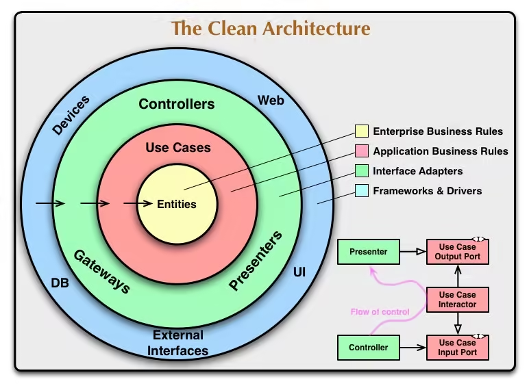

### 领域层

整洁架构的中心是领域层。它是描述应用主题区域的实体和数据，以及转换该数据的代码。 领域是区分不同应用的核心。

我们可以将领域视为当我们从 React 迁移到 Angular，或者更改某些用例，那些不会改变的东西。就商店而言，领域就是产品、订单、用户、购物车和更新数据的方法。

领域实体的数据结构及其转换的本质是独立于外部世界的。外部事件触发领域的转换，但并不决定转换将如何发生。

将商品添加到购物车的功能并不关心商品的添加方式：用户自己通过“购买”按钮添加或使用促销码自动添加。 在这两种情况下，它都会接受该商品并返回包含添加商品的更新后的购物车。

### 应用层

在领域层的周围是应用层。这一层描述了用例，即用户场景。它们负责在某个事件发生后发生的事情。

例如，“添加到购物车”场景就是一个用例。 它描述了单击按钮后应执行的操作。它会告诉应用：

* 发送请求；
* 执行这个领域转换；
* 使用响应数据重新绘制 UI。

此外，在应用层中还有端口——应用程序希望与外界进行通信的规范。通常，端口是一个接口，表示行为契约。

端口充当我们的应用期望和现实之间的“缓冲区”。输入端口告诉应用希望如何与外界通信。输出端口说明应用将如何与外界进行通信以使其做好准备。

### 适配器层

最外层包含外部服务的适配器。需要适配器将外部服务的不兼容 API 转换为与应用的可以兼容的 API。

适配器是降低代码与第三方服务代码耦合度的好方法。低耦合度可以减少在其他模块发生变化时需要修改一个模块的情况。

适配器通常分为两类：

* **驱动型适配器**：向应用发送信号。
* **被驱动型适配器**：接收来自应用的信号。

用户通常与驱动型适配器进行交互。例如，UI框架处理按钮点击的工作就是驱动型适配器的工作。它与浏览器API（基本上是第三方服务）进行交互，并将事件转换为应用能够理解的信号。

被驱动型适配器与基础设施进行交互。在前端，大部分基础设施都是后端服务器，但有时也可能直接与其他服务进行交互，如搜索引擎。

注意，离中心越远，代码功能越“面向服务”，离应用的领域知识越远。当决定每个模块属于哪个层时，这将很重要。

### 依赖规则

三层架构有一个依赖规则：**只有外层可以依赖内层。** 这意味着：

* 领域层必须独立于其他层；
* 应用层可以依赖于领域层；
* 外层可以依赖于任何东西。

按照这个规则，内层的模块或组件不应该直接依赖于外层的模块或组件。只有外层可以通过依赖来访问内层的功能。这种依赖关系的限制可以帮助我们保持代码的可维护性和灵活性。同时，它也确保了系统的高内聚性和低耦合性。

通过遵循依赖规则，我们可以更好地组织和管理代码，使其更易于测试、扩展和重用。此外，它还能够促进团队协作，因为每个层次可以独立开发和演化，而无需过多关注其他层次的具体实现。

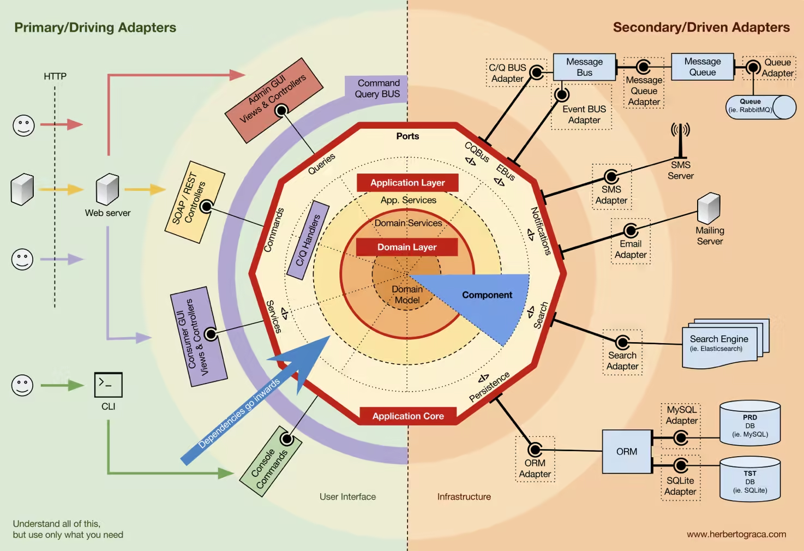

有时这条规则可能会被违反，尽管最好不要滥用它。 例如，有时在域中使用一些“类似库”的代码很方便，即使不应该存在依赖关系。

不受控制的依赖方向可能会导致代码复杂且混乱。 例如，违反依赖性规则可能会导致：

* 循环依赖，其中模块A依赖于B，B依赖于C，C又依赖于A。
* 测试可测试性差，需要模拟整个系统来测试一个小部分。
* 耦合度过高，因此模块之间的交互脆弱。

在设计系统架构时，应该尽量避免违反依赖规则。遵循依赖规则可以让代码更容易理解、测试和扩展，并提高代码的灵活性和可维护性。

## 整洁架构的优点

整洁架构的优点主要体现在以下方面。

### 领域独立性

主要应用功能被隔离并集中在一个地方，即领域层。

领域层的功能相互独立，这意味着更容易进行测试。模块的依赖越少，测试所需的基础设施、模拟和存根就越少。

独立的领域层也更容易根据业务预期进行测试。这有助于新开发人员理解应用程序应该做什么。此外，独立的领域层有助于更快地查找从业务语言到编程语言的"转换"中的错误和不准确之处。

### 独立的用例

应用场景和使用案例分别进行描述，它们决定了我们需要哪些第三方服务。使外部世界适应我们的需要。这让我们可以更自由地选择第三方服务。 例如，如果当前的支付系统开始收费过高，可以快速更改支付系统。

用例的代码也变得扁平化、可测试和可扩展。

### 可替代的第三方服务

由于适配器的存在，外部服务变得可替换。只要不改变接口，那么实现该接口的外部服务可以是任意一个。

这样就为更改传播设置了障碍：其他人代码的更改不会直接影响自己的代码。适配器还限制了应用运行时中错误的传播。

## 整洁架构的成本

整洁架构除了好处之外，也有一些成本需要考虑。

### 时间成本

主要的成本是时间。它不仅需要设计的时间，还需要实现的时间，因为直接调用第三方服务比编写适配器要简单得多。事先完全思考系统所有模块的交互是困难的，因为我们可能无法预先了解所有的需求和限制。在设计过程中，需要考虑系统如何可能会变化，并留出扩展的余地。

### 有时过于冗长

一般来说，整洁架构的规范实现并不总是方便，有时甚至是有害的。如果项目很小，完全实现整洁架构可能会过度复杂，增加新人入门的门槛。

为了在预算或截止日期内完成项目，可能需要进行设计上的妥协。

### 增加代码量

前端特有的一个问题是，整洁架构会增加最终包中的代码量。我们提供给浏览器的代码越多，它需要下载、解析和解释的代码就越多。

我们需要关注代码量，并且需要决策何处进行简化：

* 也许可以简化用例的描述；
* 也许可以直接从适配器中访问领域功能，绕过用例；
* 也许需要调整代码拆分等。

## 如何降低成本？

可以通过简化架构并牺牲“整洁”的程度来减少时间和代码量。我通常不喜欢激进的方法：如果打破某个规则更加实际（例如，收益将超过潜在成本），我会打破它。

因此，可以在一段时间内整洁架构的某些方面持保留态度，这没有任何问题。但是，以下两个方面是绝对值得投入的最低资源。

### 提取领域逻辑

提取领域逻辑有助于理解正在设计的内容以及它应该如何工作。提取领域逻辑使新开发人员更容易理解应用、实体及其之间的关系。

即使跳过其他层次，仍然可以更轻松地处理和重构未分散在代码库中的提取的领域逻辑。其他层次可以根据需要添加。

### 遵循依赖规则

第二个不可丢弃的规则是依赖关系的规则，或者更确切地说，它们的方向。外部服务必须适应我们的需求。

如果你觉得自己在“微调”代码以便其调用搜索 API，那么可能存在问题。最好在问题扩散之前编写适配器。

## 设计商店应用

谈完了理论，接下来就可以开始实践了。下面来设计一个饼干商店的架构。

商店会出手不同类型的饼干，可能包含不同的成分，用户将选择饼干并进行订购，并通过第三方支付服务支付订单费用。

我们将在主页上展示可以购买的饼干。只有通过身份验证，才能购买饼干。点击登录按钮就会进入登录页面。

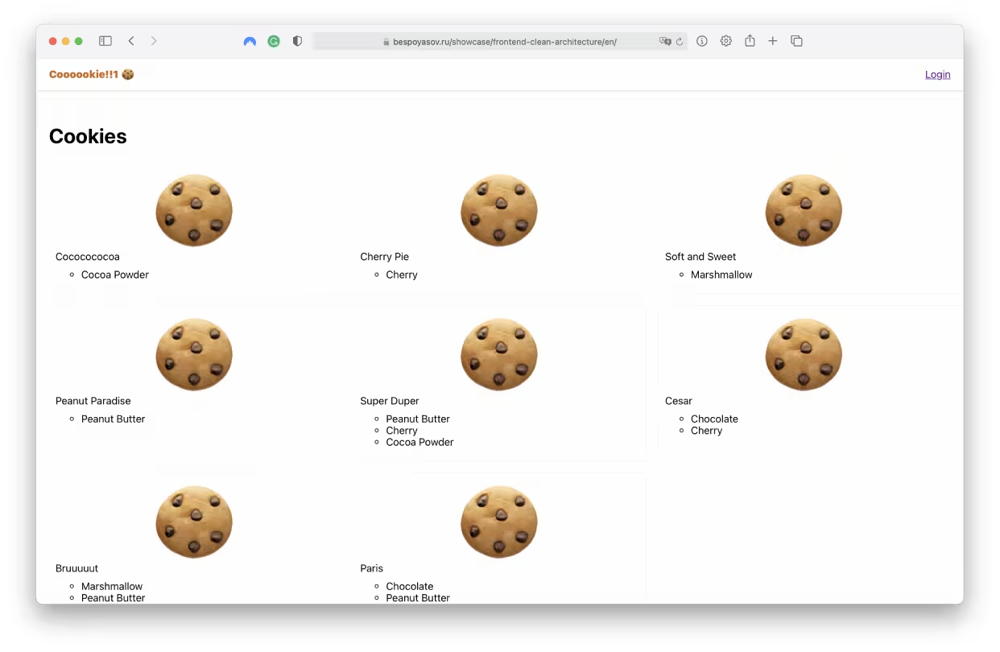

登录成功之后，就可以在购物车中添加一些饼干了。

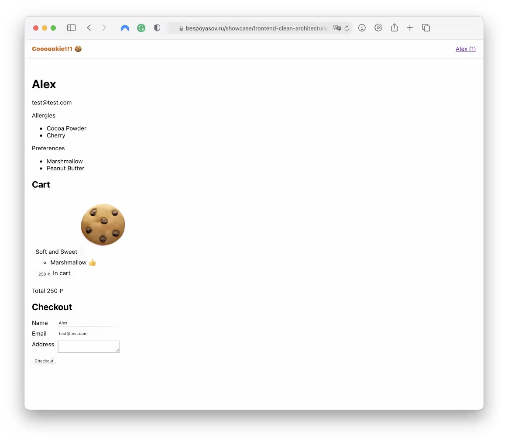

当我们将饼干放入购物车后，就可以下订单了。 付款后，会在列表中看到一个新的订单以及一个已清空的购物车。

这里我们将实现结账用例。

在实现购物车和结算功能之前，我们需要确定在整体上将拥有哪些实体、用例和功能，并决定它们应该属于哪个层次结构。

### 设计领域

在应用中，最重要的是领域。领域是应用的主要实体及其数据转换所在的地方。建议从领域开始，以便在代码中准确表示应用的领域知识。

商店的领域可以包括以下内容：

* 每个实体的数据类型：用户（user）、饼干（cookie）、购物车（cart）和订单（order）；
* 用于创建每个实体的工厂或类（如果使用面向对象编程）；
* 该数据的转换函数。

领域中的转换函数应仅依赖于领域规则，不涉及其他内容。例如，这样的函数可能包括：

* 计算总费用的函数；
* 检测用户口味偏好的函数；
* 确定物品是否在购物车中的函数等。

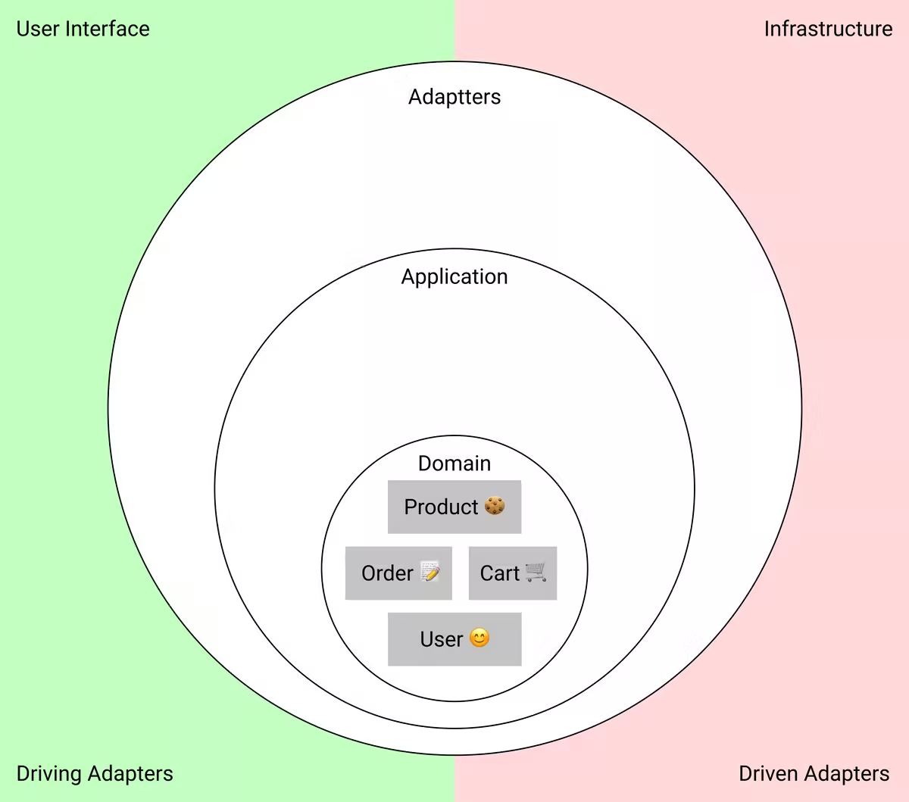

### 设计应用层

应用程序层包含了用例。一个用例通常包括一个参与者、一个动作和一个结果。

在商店中，可以区分以下用例：

* 产品购买场景；
* 支付，包括与第三方支付系统的交互；
* 与产品和订单的交互：更新、浏览等；
* 根据角色访问不同页面。

用例通常根据主题领域进行描述。 例如，“结帐”场景实际上包含几个步骤：

* 从购物车中获取商品并创建新订单；
* 支付订单；
* 如果支付失败，通知用户；
* 清空购物车并显示订单信息。

用例函数将是描述这个场景的代码。此外，在应用层中还存在端口——与外部进行通信的接口。这些端口可以用于与数据库、第三方服务、UI 界面等进行交互。

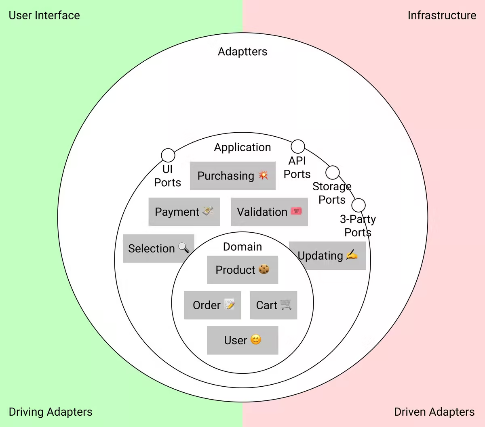

### 设计适配层

在适配器层中声明与外部服务的适配器。适配器用于将第三方服务的不兼容API与我们的系统兼容。

在前端，适配器通常是 UI 框架和 API 服务器请求模块。在这个案例中，将使用以下内容：

* UI框架；
* API请求模块；
* 本地存储适配器；
* 将API响应适配到应用层的适配器和转换器。

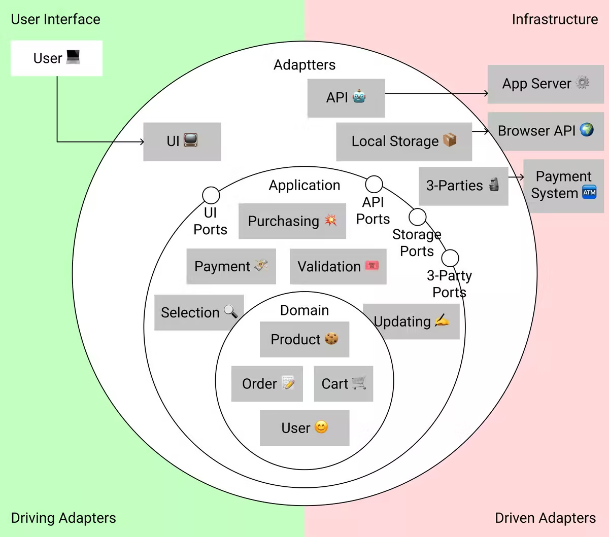

注意，“类似服务”的功能越多，离图表中心越远。

### 使用 MVC 类比

有时候很难确定某些数据属于哪一层。以下是一个简单的MVC类比：

* 模型（Models）通常是领域实体；
* 控制器（Controllers）是领域转换和应用层；
* 视图（View）是驱动适配器。

虽然细节上这些概念是不同的，但它们非常相似，这种类比可以用来定义领域和应用代码。

### 实现细节：领域层

一旦确定了需要的实体，就可以开始定义它们的行为。

接下来将展示项目中的代码结构。为了清晰起见，将代码分成了不同的文件夹-层级进行组织：

```javascript
src/
|_domain/
  |_user.ts
  |_product.ts
  |_order.ts
  |_cart.ts
|_application/
  |_addToCart.ts
  |_authenticate.ts
  |_orderProducts.ts
  |_ports.ts
|_services/
  |_authAdapter.ts
  |_notificationAdapter.ts
  |_paymentAdapter.ts
  |_storageAdapter.ts
  |_api.ts
  |_store.tsx
|_lib/
|_ui/
```

领域层位于`domain/`目录，应用层位于`application/`目录，适配器位于`services/`目录。我们将在最后讨论该代码结构的替代方案。

#### 创建领域实体

在领域中有4个模块：

* 产品
* 用户
* 订单
* 购物车

主要的参与者是用户，想要在会话期间将用户数据存储在`storage`中。为了对这些数据进行类型化，需要创建一个名为"User"的领域实体。

User 实体将包含ID、姓名、邮箱以及喜好和过敏列表。

```typescript
// domain/user.ts

export type UserName = string;
export type User = {
  id: UniqueId;
  name: UserName;
  email: Email;
  preferences: Ingredient[];
  allergies: Ingredient[];
};
```

用户将商品放入购物车中。下面来为购物车和产品添加类型。购物车项将包含ID、名称、以分为单位的价格和成分列表。

```typescript
// domain/product.ts

export type ProductTitle = string;
export type Product = {
  id: UniqueId;
  title: ProductTitle;
  price: PriceCents;
  toppings: Ingredient[];
};
```

在购物车中会保留用户放入其中的产品列表：

```typescript
// domain/cart.ts

import { Product } from "./product";

export type Cart = {
  products: Product[];
};
```

在成功支付后，会创建一个新的订单。可以添加一个名为`Order`的实体类型。`Order`类型将包含用户ID、已订购产品列表、创建日期和时间、订单状态以及整个订单的总价格。

```typescript
// domain/order.ts

export type OrderStatus = "new" | "delivery" | "completed";

export type Order = {
  user: UniqueId;
  cart: Cart;
  created: DateTimeString;
  status: OrderStatus;
  total: PriceCents;
};
```

#### 检查实体之间的关系

以这种方式设计实体类型的好处是可以检查它们的关系图是否符合实际情况：

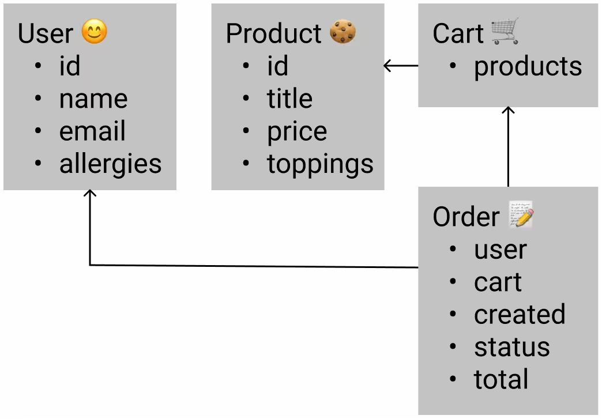

我们可以查看和检查以下内容：

* 主要参与者是否真的是用户；
* 订单中是否包含足够的信息；
* 是否需要扩展某些实体；
* 将来是否会出现可扩展性问题。

此外，在这个阶段类型将有助于突出显示实体之间的兼容性以及实体之间信号方向的错误。如果一切符合期望，就可以开始设计领域变换了。

#### 创建数据转化

上面设计的类型的数据将经历各种各样的处理。我们将向购物车中添加商品、清空购物车、更新商品和用户名称等。我们将为所有这些转换创建单独的函数。

例如，要确定用户是否对某个成分或喜好过敏，可以编写函数`hasAllergy`和`hasPreference`：

```typescript
// domain/user.ts

export function hasAllergy(user: User, ingredient: Ingredient): boolean {
  return user.allergies.includes(ingredient);
}

export function hasPreference(user: User, ingredient: Ingredient): boolean {
  return user.preferences.includes(ingredient);
}
```

函数 `addProduct` 和 `contains` 用于将商品添加到购物车并检查商品是否在购物车中：

```typescript
// domain/cart.ts

export function addProduct(cart: Cart, product: Product): Cart {
  return { ...cart, products: [...cart.products, product] };
}

export function contains(cart: Cart, product: Product): boolean {
  return cart.products.some(({ id }) => id === product.id);
}
```

我们还需要计算产品列表的总价格，为此需要编写函数`totalPrice`。如果需要，可以在这个函数中添加各种条件来考虑促销码或季节性折扣等。

```typescript
// domain/product.ts

export function totalPrice(products: Product[]): PriceCents {
  return products.reduce((total, { price }) => total + price, 0);
}
```

为了让用户能够创建订单，我们需要编写函数`createOrder`。它将返回与指定用户和其购物车关联的新订单。

```typescript
// domain/order.ts

export function createOrder(user: User, cart: Cart): Order {
  return {
    cart,
    user: user.id,
    status: "new",
    created: new Date().toISOString(),
    total: totalPrice(products),
  };
}
```

注意，在每个函数中，我们都构建了 API，以便我们可以轻松地转换数据，函数接受参数并按照希望的方式给出结果。

在设计阶段，还没有外部限制。这使我们能够尽可能地反映主题领域的数据转换。转换越接近现实，检查其工作就会更容易。

### 实现细节：共享内核

你可能已经注意到，在描述领域类型时使用了一些类型，例如`Email`、`UniqueId`或`DateTimeString`。这些都是类型别名：

```typescript
// shared-kernel.d.ts

type Email = string;
type UniqueId = string;
type DateTimeString = string;
type PriceCents = number;
```

我通常使用类型别名来摆脱基本类型过度使用的问题。

这里使用`DateTimeString`而不仅仅是`string`，是为了清楚地表明使用了哪种类型的字符串。类型与主题领域越接近，处理错误时就越容易。

指定的类型位于`shared-kernel.d.ts`文件中。共享内核是代码和数据，其依赖关系不会增加模块之间的耦合。

实际上，共享内核可以这样解释。我们使用TypeScript，使用它的标准类型库，但不认为它们是依赖关系。这是因为使用它们的模块可能不了解彼此，并保持解耦状态。

并非所有的代码都可以归类为共享内核。最主要且最重要的限制是**这类代码必须与系统的任何部分兼容**。如果应用的一部分是用TypeScript编写的，另一部分是用其他语言编写的，共享内核只能包含可用于这两部分的代码。例如，JSON 格式的实体规范是可以的，但TypeScript的帮助类就不行。

在我们的例子中，整个应用程序都是用 TypeScript 编写的，所以对内置类型的类型别名也可以归类为共享内核。这样的全局可用类型不增加模块之间的耦合，可以在应用的任何部分使用。

### 实现细节：应用层

既然已经搞清楚了领域，下面来继续介绍应用层，这一层包含了用例。

在代码中，我们描述了场景的技术细节。用例是对在将商品添加到购物车或进行结账后数据应该发生的情况的描述。

用例涉及与外部的交互，因此需要使用外部服务。与外部的交互是副作用。我们知道，在没有副作用的情况下，更容易处理和调试函数和系统。而且，我们的大部分领域函数被编写为了纯函数。

了将纯净的转换和与非纯的交互结合起来，可以使用应用层作为非纯的上下文。

#### 纯转换的非纯上下文

纯转换的非纯净上下文是一种代码组织方式，其中：

* 首先执行一个副作用来获取数据；
* 然后对该数据进行纯转换；
* 最后再次执行一个副作用来存储或传递结果。

在“将商品放入购物车”用例中，这看起来像是：

* 首先，处理程序将从存储中检索购物车状态；
* 然后，它将调用购物车更新函数，并传递要添加的商品；
* 最后将更新后的购物车保存在存储中。

整个过程是一个“三明治”：副作用，纯函数，副作用。主要逻辑体现在数据转换中，与外部的所有通信都被隔离在一个命令式的外壳中。

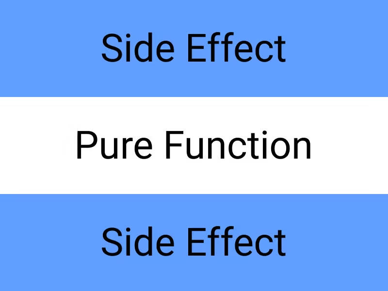

非纯上下文有时被称为命令式外壳中的函数式核心。这就是我们在编写用例函数时将使用的方法。

#### 设计用例

这里我们将选择和设计结账用例。这是最具代表性的一个，因为它是异步的，并与许多第三方服务进行交互。

先来思考一下在这个用例中想要达到什么目标。用户有一个带有商品的购物车，当用户点击结账按钮时：

* 想要创建一个新的订单；
* 在第三方支付系统中支付订单；
* 如果付款失败，向用户通知；
* 如果成功，将订单保存在服务器上；
* 将订单添加到本地数据存储中以显示在屏幕上。

从 API 和函数签名的角度来看，我们希望将用户和购物车作为参数传递，并让函数自行处理其他所有事情。

```typescript
type OrderProducts = (user: User, cart: Cart) => Promise<void>;
```

理想情况下，用例不应该采用两个单独的参数，而是一个命令，它将在自身内部封装所有的输入数据。但我们不希望让代码变得臃肿，所以将使用这种方式。

#### 编写应用层端口

让我们来仔细看看用例的步骤：订单创建本身就是一个领域函数，其他都是想要使用的外部服务。

重要的是要记住，外部服务必须适应我们的需求。因此，在应用层中，我们将描述不仅仅是用例本身，还包括与这些外部服务进行交互的接口：**端口**。

首先，端口应该方便我们的应用。 如果外部服务的API不符合我们的需求，就需要编写一个适配器。

考虑一下将需要的服务：

* 一个支付系统；
* 一个用于通知用户有关事件和错误的服务；
* 一个用于将数据保存到本地存储的服务。

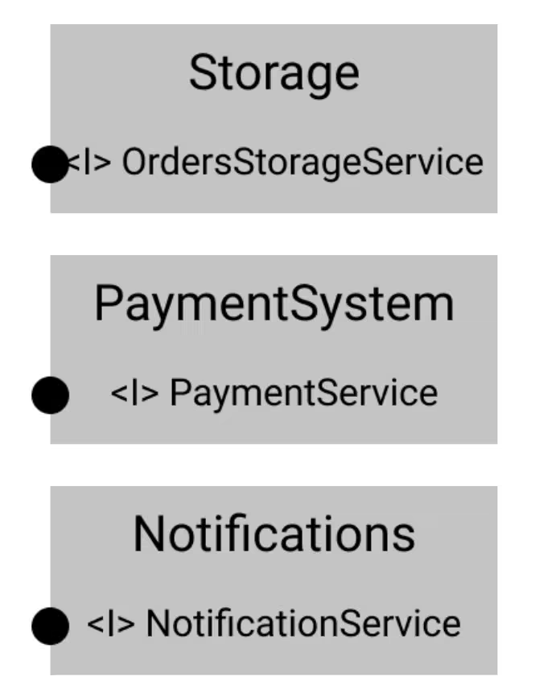

现在讨论的是这些服务的接口，而不是它们的实现。在这个阶段，对于我们来说描述所需行为非常重要，因为这是我们在应用层中描述场景时所依赖的行为。

如何实现这个行为暂时还不重要。这使得我们可以将关于使用哪些外部服务的决策推迟到最后，从而使代码的耦合度最小化。我们稍后会处理实现部分。

还要注意，我们将接口按功能拆分。与支付相关的所有内容都在一个模块中，与存储相关的内容在另一个模块中。这样做将更容易确保不混淆不同第三方服务的功能。

#### 支付系统接口

饼干商店是一个简单的示例，因此支付系统将很简单。它有一个 `tryPay` 方法，该方法将接受需要支付的金额，并作为响应发送确认。

```typescript
// application/ports.ts

export interface PaymentService {
  tryPay(amount: PriceCents): Promise<boolean>;
}
```

这里没有进行错误处理，因为错误处理是一个独立的大型主题，不是本次的讨论范围。

通常支付是在服务器上进行的，但这只是一个示例，所以在客户端上完成所有操作。可以轻松地通过与 API 通信而不是直接与支付系统通信。这种更改只会影响到这个用例，其余的代码将保持不变。

#### 通知服务接口

如果出现问题，我们必须告诉用户。可以通过不同的方式通知用户。可以使用用户界面，可以发送电子邮件，可以用手机短信来提醒用户。

一般来说，通知服务最好也是抽象的，这样就不必考虑具体实现的细节。

让它接收消息并以某种方式通知用户：

```typescript
// application/ports.ts

export interface NotificationService {
  notify(message: string): void;
}
```

#### 本地存储接口

我们将把新订单保存在本地存储库中。

该存储可以是任何东西：Redux、MobX、whatever-floats-your-boat-js。 该存储库可以分为不同实体的微型存储库，也可以成为所有应用数据的一个大存储库。 现在也不重要，因为这些是实现细节。

我喜欢将存储接口划分为每个实体的单独存储接口。用于用户数据存储的单独接口、用于购物车的单独接口、用于订单存储的单独接口：

```typescript
// application/ports.ts

export interface OrdersStorageService {
  orders: Order[];
  updateOrders(orders: Order[]): void;
}
```

#### 用例功能

根据之前描述的接口和现有领域功能，让我们尝试构建该用例的实现。正如之前所描述的，脚本将包含以下步骤：

* 验证数据；
* 创建订单；
* 支付订单；
* 通知问题；
* 保存结果。

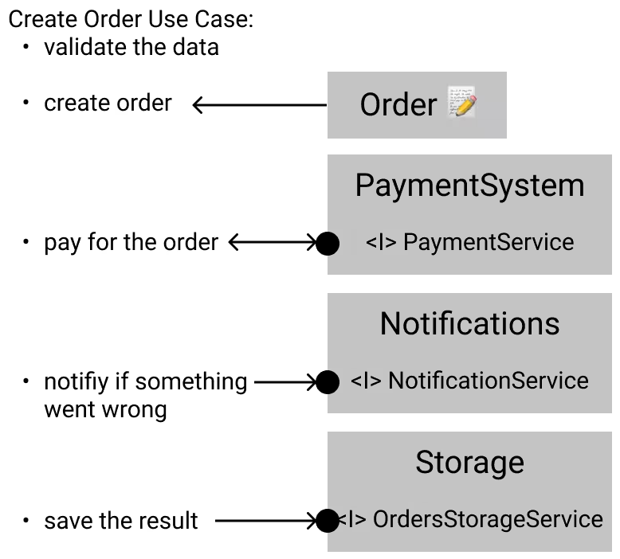

首先，声明要调用的服务模块。 TypeScript 会提示我们没有在适当的变量中实现接口，但现在没关系。

```typescript
// application/orderProducts.ts

const payment: PaymentService = {};
const notifier: NotificationService = {};
const orderStorage: OrdersStorageService = {};
```

现在，我们可以将其视为真实的服务。可以访问它们的字段，调用它们的方法。当将用例转换为代码时，这非常方便。

现在，我们创建一个名为`orderProducts`的函数。在函数内部，首先创建一个新订单：

```typescript
// application/orderProducts.ts
//...

async function orderProducts(user: User, cart: Cart) {
  const order = createOrder(user, cart);
}
```

这里我们把接口作为行为的契约。这意味着模块实际上会执行我们期望的操作：

```typescript
// application/orderProducts.ts
//...

async function orderProducts(user: User, cart: Cart) {
  const order = createOrder(user, cart);

  // 尝试支付订单，如果出现问题，通知用户：
  const paid = await payment.tryPay(order.total);
  if (!paid) return notifier.notify("Оплата не прошла 🤷");

  // 保存结果并清除购物车：
  const { orders } = orderStorage;
  orderStorage.updateOrders([...orders, order]);
  cartStorage.emptyCart();
}
```

注意，该用例不会直接调用第三方服务。 它依赖于接口中描述的行为，因此只要接口保持不变，我们并不关心哪个模块实现它以及如何实现，这使得模块可以更换。

### 实现细节：适配器层

我们已经将用例转换成了TypeScript代码。现在需要检查现实是否符合我们的需求。

通常情况下是不符合的。因此，可以通过适配器来调整外部以满足我们的需求。

#### 绑定UI和用例

第一个适配器是一个UI框架。它连接原生浏览器API与应用。在订单创建的情况下，它是“结算”按钮和点击事件的处理方法，它将调用该用例函数。

```typescript
// ui/components/Buy.tsx

export function Buy() {
  // 访问组件中的用例：
  const { orderProducts } = useOrderProducts();

  async function handleSubmit(e: React.FormEvent) {
    setLoading(true);
    e.preventDefault();

    // 调用用例函数：
    await orderProducts(user!, cart);
    setLoading(false);
  }

  return (
    <section>
      <h2>Checkout</h2>
      <form onSubmit={handleSubmit}>{/* ... */}</form>
    </section>
  );
}
```

我们可以通过一个 Hook 来封装这个用例。我们将在钩子函数内部获取所有的服务，并将用例函数本身作为结果从 Hook 中返回。

```typescript
// application/orderProducts.ts

export function useOrderProducts() {
  const notifier = useNotifier();
  const payment = usePayment();
  const orderStorage = useOrdersStorage();

  async function orderProducts(user: User, cookies: Cookie[]) {
    // …
  }

  return { orderProducts };
}
```

我们使用 Hook 作为依赖注入。首先，我们使用 `useNotifier`、`usePayment` 和 `useOrdersStorage` 这些 Hook 获取服务实例，然后使用 `useOrderProducts` 函数的闭包将它们提供给 `orderProducts` 函数使用。

注意，用例函数仍然与其余代码分离，这对于测试是很重要的。在本文的最后，当我们进行审查和重构时，我们将完全提取它，使其更易于测试。

#### 支付服务的实现

该用例使用 `PaymentService` 接口。下面就来实现它。

对于支付，我们将使用假的 API。同样，我们现在没必要编写整个服务，可以稍后再编写，重要的是实现指定的行为：

```typescript
// services/paymentAdapter.ts

import { fakeApi } from "./api";
import { PaymentService } from "../application/ports";

export function usePayment(): PaymentService {
  return {
    tryPay(amount: PriceCents) {
      return fakeApi(true);
    },
  };
}
```

`fakeApi` 是一个延迟触发的超时函数，延迟时间为450毫秒，模拟服务器的延迟响应。它会返回我们作为参数传递给它的内容。

```typescript
// services/api.ts

export function fakeApi<TResponse>(response: TResponse): Promise<TResponse> {
  return new Promise((res) => setTimeout(() => res(response), 450));
}
```

我们明确给 `usePayment` 函数的返回值进行了类型声明。这样，TypeScript 将检查该函数是否实际上返回一个包含接口中声明的所有方法的对象。

#### 通知服务的实现

通知使用简单的弹窗(alert)来实现。由于代码是解耦的，稍后再来重写这个服务也问题不大。

```typescript
// services/notificationAdapter.ts

import { NotificationService } from "../application/ports";

export function useNotifier(): NotificationService {
  return {
    notify: (message: string) => window.alert(message),
  };
}
```

#### 本地存储的实现

本地存储使用 React 的 Context 和 Hook 来实现。创建一个新的上下文(Context)，将值传递给 `provider`，导出该 `provider`，并通过 Hook 访问存储。

```typescript
// store.tsx

const StoreContext = React.createContext({});
export const useStore = () => useContext(StoreContext);

export const Provider: React.FC = ({ children }) => {
  // ...Other entities...
  const [orders, setOrders] = useState([]);

  const value = {
    // ...
    orders,
    updateOrders: setOrders,
  };

  return <StoreContext.Provider value={value}>{children}</StoreContext.Provider>;
};
```

我们将为每个功能编写一个 Hook，这样一来，我们就不会破坏接口隔离原则（ISP），并且存储在接口层面上也是原子的。

```typescript
// services/storageAdapter.ts

export function useOrdersStorage(): OrdersStorageService {
  return useStore();
}
```

此方法还使我们能够针对每个存储实现自定义的额外优化。可以创建选择器、记忆等。

### 验证数据流程图

接下来验证用户在创建的用例期间如何与应用通信。

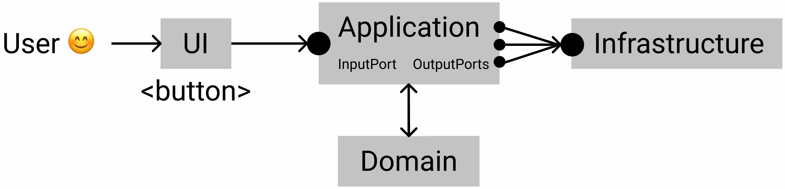

用户通过UI层与应用进行交互，UI层只能通过端口访问应用。也就是说，如果需要，可以更改UI。

用例在应用层中处理，应用层告诉我们需要哪些外部服务。所有的主要逻辑和数据都在领域层中。

所有的外部服务都被隐藏在基础设施中，并且受到规范的限制。如果需要更改发送消息的服务，只需要在代码中修改适配器以适应新服务即可。

这种架构使代码具有可替换性、可测试性，并且能够根据不断变化的需求进行扩展。

### 改进

接下来看看如何改进上面的实现。

#### 使用对象而不是数字来表示价格

使用 `number`来描述价格并不是一个好的做法：

```typescript
// shared-kernel.d.ts

type PriceCents = number;
```

数字只表示数量，不表示币种，没有币种的价格是没有意义的。 理想情况下，价格应作为具有两个字段的对象：**价值**和**货币**。

```typescript
type Currency = "RUB" | "USD" | "EUR" | "SEK";
type AmountCents = number;

type Price = {
  value: AmountCents;
  currency: Currency;
};
```

这将解决存储货币的问题，并在向商店更改或添加货币时节省大量精力。在示例中没有使用这种类型，以免使其复杂化。 然而，在实际代码中，价格会更类似于这种类型。

另外，值得一提的是价格的价值，将金额使用货币流通中最小的分数。例如，对于美元，它是美分。

以这种方式显示价格可以不考虑除法和小数值。对于货币来说，如果想要避免浮点数计算问题，这尤其重要。

#### 按功能而不是按层次拆分代码

代码可以按照"功能"而不是按"层次"的方式进行拆分。一个功能将是下面示意图中的一块。这种结构更可取，因为这样就独立部署特定的功能。


#### 注意跨组件使用

如果将系统拆分为组件，那么要注意代码的跨组件使用。下面来看看订单创建函数：

```typescript
import { Product, totalPrice } from "./product";

export function createOrder(user: User, cart: Cart): Order {
  return {
    cart,
    user: user.id,
    status: "new",
    created: new Date().toISOString(),
    total: totalPrice(products),
  };
}
```

这个函数使用了另一个组件——产品的`totalPrice`。这种用法本身没问题，但如果要将代码划分为独立的功能，则不能直接访问其他模块的代码。

#### 注意领域中可能存在的依赖关系

接下来优化在`createOrder`函数中在领域内创建日期的做法。

```typescript
import { Product, totalPrice } from "./product";

export function createOrder(user: User, cart: Cart): Order {
  return {
    cart,
    user: user.id,

    created: new Date().toISOString(),

    status: "new",
    total: totalPrice(products),
  };
}
```

在项目中`new Date().toISOString()`可能会被频繁重复使用，因此可以将其放在某种辅助函数中：

```typescript
// lib/datetime.ts

export function currentDatetime(): DateTimeString {
  return new Date().toISOString();
}
```

然后在领域中使用它：

```typescript
// domain/order.ts

import { currentDatetime } from "../lib/datetime";
import { Product, totalPrice } from "./product";

export function createOrder(user: User, cart: Cart): Order {
  return {
    cart,
    user: user.id,
    status: "new",
    created: currentDatetime(),
    total: totalPrice(products),
  };
}
```

然而，我们在领域中不能依赖于任何东西，那该怎么办呢？可以让 `createOrder` 以完整的形式接收订单的所有数据。日期可以作为最后一个参数传递进来：

```typescript
// domain/order.ts

export function createOrder(user: User, cart: Cart, created: DateTimeString): Order {
  return {
    user: user.id,
    products,
    created,
    status: "new",
    total: totalPrice(products),
  };
}
```

这样就能够在创建日期依赖于库的情况下不违反依赖规则。如果在领域函数之外创建日期，那么很可能会在用例内部创建日期，并将其作为参数传递：

```typescript
function someUserCase() {
  // 使用“dateTimeSource”适配器，以所需的格式获取当前日期：:
  const createdOn = dateTimeSource.currentDatetime();

  // 将已创建的日期传递给领域函数：
  createOrder(user, cart, createdOn);
}
```

这样做既保持了领域的独立性，也使得测试更加容易。

在上面的示例中，没有专注于此有两个原因：一是会分散主要观点的注意力，二是如果辅助函数仅使用语言特性，依赖自己的辅助函数并没有什么问题。这样的辅助函数甚至可以被视为共享内核，因为它们只是减少了代码重复。

因此，在这种情况下，使用自己的辅助函数来创建日期是可以接受的。它们只是为了简化代码而引入，不引入外部依赖。如果这些辅助函数经过良好的测试并且可靠，它们确实可以被视为共享核心的一部分。然而，在设计和实现共享核心时，我们仍然需要谨慎考虑，并确保它们不引入与领域逻辑相关的外部依赖。

#### 将领域实体和转换保持纯净

在`createOrder`函数内部创建日期的真正问题在于副作用。副作用的问题在于它们使系统的可预测性降低。为了解决这个问题，有助于在领域中使用纯的数据转换，即不产生副作用的转换。

创建日期是一种副作用，因为调用`Date.now()`的结果在不同的时间点是不同的。而纯函数，则是在给定相同参数的情况下始终返回相同的结果。

我们要尽可能保持领域的清晰性更好。这样做更易于测试、移植和更新，并且更易于阅读。副作用在调试时会大大增加认知负荷，而领域不是保留复杂和混乱代码的地方。

#### 注意购物车和订单的关系

在这个例子中，订单包括购物车，因为购物车仅代表一个产品列表：

```typescript
export type Cart = {
  products: Product[];
};

export type Order = {
  user: UniqueId;
  cart: Cart;
  created: DateTimeString;
  status: OrderStatus;
  total: PriceCents;
};
```

如果购物车中存在与订单无关的其他属性，这种做法可能不适用。在这种情况下，最好使用数据投影或中间的数据传输对象（DTO）。

作为一种选择，可以使用"产品列表"实体：

```typescript
type ProductList = Product[];

type Cart = {
  products: ProductList;
};

type Order = {
  user: UniqueId;
  products: ProductList;
  created: DateTimeString;
  status: OrderStatus;
  total: PriceCents;
};
```

#### 使用例更具可测试性

用例也有很多值得讨论的地方。目前，`orderProducts` 函数很难脱离 React 进行测试——这很糟糕。 理想情况下，应该能够轻松地进行测试。

当前实现的问题在于提供用例访问UI的 Hook：

```typescript
// application/orderProducts.ts

export function useOrderProducts() {
  const notifier = useNotifier();
  const payment = usePayment();
  const orderStorage = useOrdersStorage();
  const cartStorage = useCartStorage();

  async function orderProducts(user: User, cart: Cart) {
    const order = createOrder(user, cart);

    const paid = await payment.tryPay(order.total);
    if (!paid) return notifier.notify("Oops! 🤷");

    const { orders } = orderStorage;
    orderStorage.updateOrders([...orders, order]);
    cartStorage.emptyCart();
  }

  return { orderProducts };
}
```

在规范的实现中，用例函数将位于 hook 之外，并且服务将通过最后一个参数或通过依赖注入（DI）传递给用例：

```typescript
type Dependencies = {
  notifier?: NotificationService;
  payment?: PaymentService;
  orderStorage?: OrderStorageService;
};

async function orderProducts(
  user: User,
  cart: Cart,
  dependencies: Dependencies = defaultDependencies,
) {
  const { notifier, payment, orderStorage } = dependencies;

  // ...
}
```

然后 hook 将成为一个适配器：

```typescript
function useOrderProducts() {
  const notifier = useNotifier();
  const payment = usePayment();
  const orderStorage = useOrdersStorage();

  return (user: User, cart: Cart) =>
    orderProducts(user, cart, {
      notifier,
      payment,
      orderStorage,
    });
}
```

然后，Hook 代码可以被视为适配器，只有用例函数会保留在应用层中。通过将所需的服务模拟作为依赖项传递，可以测试`orderProducts`函数。

#### 配置自动依赖注入

在应用层中，我们现在手动注入服务：

```typescript
export function useOrderProducts() {
  // 这里使用hook来获取每个服务的实例，
  // 将在 orderProducts 用例中使用：
  const notifier = useNotifier();
  const payment = usePayment();
  const orderStorage = useOrdersStorage();
  const cartStorage = useCartStorage();

  async function orderProducts(user: User, cart: Cart) {
    // ...在用例中使用这些服务
  }

  return { orderProducts };
}
```

通常情况下，我们可以通过依赖注入来自动化配置并进行注入。我们已经了解了通过最后一个参数实现的最简单的注入方式，但也可以进一步配置自动注入。

在这个特定的应用中，设置依赖注入并不合理。这会分散注意力并使代码过于复杂化。而且在React和hooks的情况下，可以将它们作为一个 "容器"，返回指定接口的实现。这虽然是手动实现的，但它不会增加上手门槛，并且对于新的开发人员来说更容易阅读。

## 实际项目可能更复杂

实际项目中可能会面临更多复杂的问题。这篇文章中的示例经过了精心处理并且故意保持简单。现实应用比这个示例复杂得多。因此，接下来就谈谈在使用清晰架构时可能出现的常见问题。

#### 业务逻辑的分支

最重要的问题是我们缺乏关于主题领域的知识。想象一家商店有商品、折扣商品和核销商品。我们应该如何正确描述这些实体？

是否应该有一个“基础”实体来进行扩展？该实体应如何扩展？是否应该有额外的字段？这些实体是否应该是互斥的？是否应立即减少重复？

可能会有太多的问题和太多的答案，我们很难考虑到所有的情况。具体的解决方案取决于具体的情况，这里只能推荐一些通用的方法。

* 不要使用继承，即使它看起来可以“扩展”。
* 复制粘贴代码中并不是都不好。制作两个几乎相同的实体，看看它们在现实中的行为方式，观察它们。 在某些时候，它们要么变得非常不同，要么实际上仅在一个领域有所不同。 将两个相似的实体合并为一个比为每个可能的条件和变体创建检查更容易。
* 记住协变性、逆变性和不变性，以免意外增加不必要的工作量。
* 在选择不同的实体和扩展之间时，使用 BEM 中的块和修饰符类比。当在 BEM 的上下文中考虑时，它非常有助于确定是否有一个独立的实体或一个“修饰符扩展”。

#### 相互依赖的用例

第二个大问题就是相关的用例，其中一个用例的事件触发另一个用例。唯一的处理方式就是将用例拆分成更小、更原子的用例，然后再组合它们。一般而言，这种问题是编程中另一个大问题的结果，即实体组合，这里不再赘述。

## 总结

本文介绍了前端整洁架构。这不是一个金标准，而是对不同项目、范例和语言的经验总结。它是一个非常方便的方案，可以将代码解耦，并创建独立的层、模块和服务，不仅可以分开部署和发布，还可以在需要时从项目转移到项目。


> 更新: 2024-01-09 16:58:09  
> 原文: <https://www.yuque.com/cuggz/feplus/gqgt90ohtbvrer2l>