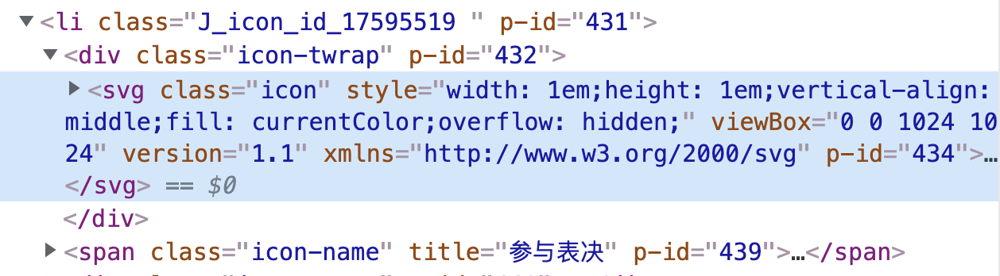
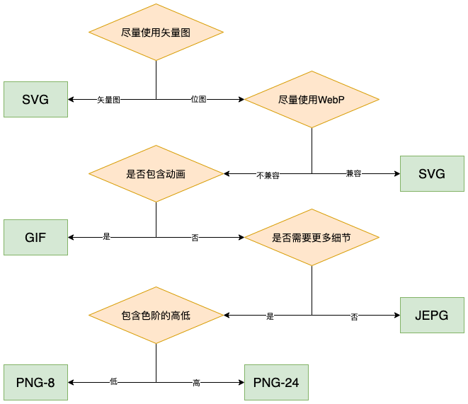
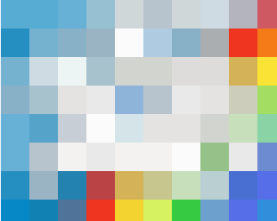

# 前端性能优化 | 图像优化

<font style="color:rgba(0, 0, 0, 0.75);">图片在各大网站随处可见，因为图片的表述比文字更加直观，所以图片是网站最重要的要素之一。</font>图片相对其他文件又很大，页面的加载速度很大程度上取决于图片的加载速度，所以我们要对图片进行优化，以此加快页面加载速度，提升用户体验。

图片的优化可以分为两个方面：图像的**选取和使用，加载和显示**。本文主要讨论从图片的选取和使用来进行性能的优化，下一篇文章来介绍图片的加载优化。

### 1. 图像基础

图像资源优化的根本思想，可以归结为两个字：\*\*压缩。\*\*无论是选取的图片的文件格式，还是针对同意格式压缩至更小的尺寸，其本质都是用更小的资源开销来完成图像的传输和展示。

在网页中，如果确定了图像的展示效果必须存在时，在前端实现上也并非要用图像文件，还存在一些场景可以使用更高效的方式来实现预期效果，比如以下情况：

* 图像在不同状态下会有不用的展示效果（比如边角的裁切、阴影、渐变等），如果能用CSS来处理现实效果，用CSS实现即可，CSS代码相对于图片来讲，是可以忽略不计的；
* 如果图像上有一些文字，允许的情况下，可以使用网页的文字来代替，因为图片中的文字包含了很多信息，会导致图片很大。除此之外，图像中的文本信息可能用户体验比较差（不能选择、搜索、缩放等），并且在高分辨率屏幕上，显示效果会大打折扣。

说完这两个例子，下面就来看一下图像相关的基础。

#### （1）矢量图和位图

图片文件可以分为矢量图和位图，下面我们就来看看这两种图片有什么不同。

**1）矢量图**

<font style="color:#333333;">下面是百度百科中矢量图的定义：</font>

> <font style="color:#333333;">矢量图，</font><font style="color:#333333;">也称为面向对象的图像或绘图图像，在</font>[<font style="color:#333333;">数学</font>](https://baike.baidu.com/item/%E6%95%B0%E5%AD%A6/107037)<font style="color:#333333;">上定义为一系列由点连接的线。矢量文件中的图形元素称为对象。每个对象都是一个自成一体的实体，它具有</font>[<font style="color:#333333;">颜色</font>](https://baike.baidu.com/item/%E9%A2%9C%E8%89%B2/5014)<font style="color:#333333;">、形状、</font>[<font style="color:#333333;">轮廓</font>](https://baike.baidu.com/item/%E8%BD%AE%E5%BB%93/4155218)<font style="color:#333333;">、大小和</font>[<font style="color:#333333;">屏幕</font>](https://baike.baidu.com/item/%E5%B1%8F%E5%B9%95/3750314)<font style="color:#333333;">位置等属性。</font>

矢量图适合如文本、LOGO、控件图标、二维码等构图形状比较简单的几何图形。

矢量图的**优点**如下：

* 文件小，图像中保存的是线条和图块的信息，所以矢量图形文件与分辨率和图像大小无关，只与图像的复杂程度有关，图像文件所占的存储空间较小。
* 图像可以无限级缩放，对图形进行缩放，旋转或变形操作时，图形不会产生锯齿效果。
* 可采取高分辨率印刷，矢量图形文件可以在任何输出设备打印机上以打印或印刷的最高分辨率进行打印输出。

当然矢量图也是有**缺点**的：对细节的展示不够丰富，对很复杂的图像来说，要想达到预期的效果，图片可能会很大。

我们常用的SVG图片其实就属于矢量图，SVG是一种基于XML的图像格式，其全程是\*\*<font style="color:#333333;">可缩放矢量图形</font>\*\*<font style="color:#333333;">(Scalable Vector Graphics，SVG)，它</font><font style="color:#333333;">是</font>W3C<font style="color:#333333;">推出的基于</font>XML<font style="color:#333333;">的二维矢量图形标准。</font><font style="color:#333333;">SVG可以提供高质量的矢量图形渲染，同时由于支持</font>JavaScript<font style="color:#333333;">和文档对象模型，SVG图形通常具有强大的交互能力。另一方面，SVG作为W3C所推荐的基于XML的开放标准，能够与其他网络技术进行无缝集成。</font>

<font style="color:#333333;">目前，几乎所有的浏览器都支持SVG，iconfont上很多图标都是SVG格式：</font>



SVG标签包含的部分就是该矢量图的全部内容，除了必要的绘制信息，可能还包括一些元数据，比如XML命名空间、图层及注释信息等，但是这些信息对浏览器绘制SVG来说并不重要，所以在使用前，可以使用工具将这些元数据来达到压缩的目的。

**2）位图**

<font style="color:#333333;">位图</font>图像<font style="color:#333333;">（bitmap），亦称为</font>点阵图像<font style="color:#333333;">或</font>栅格图像<font style="color:#333333;">，是由称作</font>像素<font style="color:#333333;">（图片元素）的单个点组成的。这些点可以进行不同的排列和染色以构成</font>图样<font style="color:#333333;">。如果组成图像的栅格像素点越多且每个像素点所能表示的颜色范围越广，那么位图图像的显示效果就会越逼真，我们常用的图片多是属于位图。</font>

<font style="color:#333333;">虽然位图没有像矢量图那种不受分辨率影响的优质特性，但是对于复杂的图像却能提供较为真实的细节体验。</font>

<font style="color:#333333;">当我们放大位图时，可以看见赖以构成整个图像的无数单个方块，每个像素块储存的是图像颜色信息，位图颜色的编码主要有以下两种方式：</font>

* **RGB**：用红、绿、蓝三原色的光学强度来表示一种颜色。这是最常见的位图编码方法，可以直接用于屏幕显示。
* **CMYK**：用青、品红、黄、黑四种颜料含量来表示一种颜色。常用的位图编码方法之一，可以直接用于彩色印刷。

<font style="color:#333333;">通常浏览器会为每个颜色通道分配一个字节的储存空间，即2</font><sup><font style="color:#333333;">8</font></sup><font style="color:#333333;">=256个色阶值。一张图片的大小与其包含的像素数成正比，图像包含的像素越多，所能展示的细节就越多，所能展示的细节就越丰富，同时图像就越大。处于对性能的考虑，在使用图像时必须考虑对图像进行压缩。</font>

#### （2）分辨率

我们在书写CSS时，经常会为图像设置需要显示的长度像素值，但是在不同的设备屏幕上，有时相同的图像和位置，显示效果可能有比较大的差异，产生这种区别的主要原因是两种不同的分辨率：**屏幕分辨率**和**图像分辨率**。

* **图像分辨率**\*\*：\*\*表示该图像文件包含的真实像素值信息，比如一张100 \* 100像素分辨率的图像，它就定义了一个长宽各为100个像素点的信息。
* \*\*图像分辨率：\*\*表示显示器设备所能显示的最大像素值，比如一台电脑的分辨率为2560 \* 1600像素；

两种分辨率都用到了像素，那要他们的区别是什么呢？实际上，对于一张100 \* 100像素分辨率的图像，它既可以在200 \* 200像素分辨率的的屏幕上显示，也能在400 \* 400像素分辨率的的屏幕上显示。在更高分辨率的设备上，有助于显示更加绚丽图片的显示，这其实很适合矢量图的显示，因为它不会以为放大而失真。而对于位图来说，只有图片文件包含更多的信息时，才能更充分的利用屏幕分辨率，如果再高分辨率的显示屏幕来显示图片信息不太多的位图图片，就会一定程度上失真。

为了能在不同分辨率情况下显示合适的图片，可以利用`<``img``>`标签以及它的srcset属性来提供图像的变体，该属性可以用来针对不同设备，提供不同分辨率的图像文件：

```vue

```

对于srcset属性，目前多数浏览器是支持的，浏览器在进行请求之前会先对此进行解析，只选择最合适的图像文件进行下载，如果浏览器不支持，需要在src属性中添加默认加载的图片。

#### （3）有损和无损压缩

压缩是降低源资源文件大小的重要方式，对于图像文件而言，由于人眼对于不同颜色的敏感度存在差异，所以可以通过减少某种颜色的编码的方式来减小文件的大小，甚至可以损失部分源文件信息，以达到近似的效果，压缩后的文件尺寸会更小。

那对于图像的压缩，应该采用有损压缩还是无损压缩呢？

1. 首先确定业务素所要展示的图像的颜色阶数、图像显示的分辨率及清晰程度，当锚定了这几个参数的基准之后，如果获取的图像原文件的相应参数指标过高，就可以进行有损压缩，通过降低源文件质量来降低图像文件的大小。当然，如果业务要求的图像质量较高，可以直接进入第二步；
2. 当确定了图片要展示的质量后，便可以使用无损压缩技术来尽可能降低图像的大小。

### 2. 图像格式

实际上，不同图片文件格式之间的区别，主要再约他们进行有损和无损压缩过程中使用的不同的算法，下面我们就来看看不同的图像文件的特点以及其使用场景。

#### （1）JEPG

JEPG是一种出现最早，使用范围最广的图片格式。它是一种**有损压缩**的格式，通过去除相关冗余图像和色彩数据等方式来获得更高的压缩率，同时还能展示出很丰富的图像内容。在不影响人眼可分别图片质量的前提下，尽可能的压缩了图片的大小。

JEPG在开发中经常作为背景图、轮播图等，来呈现色彩比较丰富的图片。但是由于是有损压缩，当处理LOGO或者图标等文件时，可能会出现边界模糊的不好体验，除此之外，JEPG图片是不支持透明度的。

#### （2）GIF

GIF是一种基于LWZ算法的连续色调的无损压缩格式。它的压缩率一般在50%左右。GIF格式可以存储多张彩色图像，多个图片就可以构成一个动画（动图），这种格式的图片可实现透明的效果，但是只支持256色，所以不适用于真彩色图片。

**使用场景：**

* 较短的动画展示
* 网站的Loading加载效果

#### （3）PNG

PNG的全称是便携式网络图形，这是一种无损压缩的高保真的位图图形格式，支持索引、灰度、RGB 三种颜色方案以及 Alpha 通道等特性。它是现在网页中使用最广泛的图片格式之一。

PNG是一种无损压缩的图片格式，因为PNG图片的色彩表现力要比其他格式的图片更好，唯一的不足就是文件体积较大。PNG可以细分为PNG-8、PNG-24、PNG-32。

* PNG-8：只能使用256种颜色，可以设置透明色，支持索引色透明和Alpha透明。
* PNG-24：最多可使用1600万种颜色，色彩度和清晰度相比PNG-8更好，但是不支持透明度。
* PNG-32：综合了PNG-8和PNG-24的优点，既有丰富的色彩和清晰度表现，而且还支持设置透明度。

**应用场景：**

* 网站的Logo；
* 图片简单，但是对质量要求高的图片；
* 雪碧图（又称为精灵图、CSS Sprites）。

#### （4）WebP

WebP是谷歌开发的一种旨在加快图片加载速度的图片格式。WebP为网络图片提供了无损和有损压缩能力，同时在有损条件下支持透明通道。

官方实验显示：

* 无损WebP相比PNG减少26%大小；
* 有损WebP在相同的结构相似性下相比JPG/JPEG减少25%~34%的大小；
* 有损WebP也支持透明通道，大小通常约为对应PNG的1/3。

同时，谷歌于2014年提出了动态WebP，拓展WebP使其支持动图能力。动态WebP相比GIF支持更丰富的色彩，并且也占用更小空间，更适应移动网络的动图播放。

可以看到，这种格式的图片集各种格式的图片的优点于一身。但是，它的兼容性并不好除

了Chrome浏览器支持较好外，别的浏览器支持度都不太行。

#### （5）SVG

SVG是一种基于XML语法的图像格式，全称是可缩放矢量图。严格来说应该是一种开放标准的矢量图形语言，可以进行设计的高分辨率的web图形页面。

SVG本身是可编程性的语言(支持直接插入DOM当中)，可被非常多的工具读取和修改。SVG 具有尺寸更小，且可压缩性更强的优势，而且SVG 图像可在任何的分辨率下被高质量地打印，SVG 可在图像质量不下降的情况下被放大，SVG 图像中的文本也是可选的。我们可以将SVG标签像写代码一样写在HTML中，还可以把对图标图像的描述信息写在以.svg为后缀的文件中进行存储和引用。

**应用场景：**

* 图标、Logo；
* 制作地图；
* 制作股票动态图。

#### （6）Base64

准确来说，Base64并不是一种图片格式，而是一种基于64个可打印字符来表示二进制数据的方法。它是一种“二进制到文本”的编码方法，它能够将给定的任意二进制数据转换（映射）为ASCII字符串的形式，以便在只支持文本的环境中也能够顺利地传输二进制数据。

Base64通过将图像的编码直接写入HTML或CSS中来实现图片的显示。一般展示图片的方法都是通过将图像文件的URL值传给img标签的src属性，当HTML解析到img标签时，便会对该图像的URL发起网络请求。当使用Base64编码图像时，写入src的属性值不是URL，而是下面这种格式的编码：

```html

```

**应用场景：**

* 小的矢量图标，对于小的图标，没必要发起一次请求，可以直接使用Base64格式图标插入到HTML文档中即可。

#### （7）使用选择

这里不多说，直接上流程图：



### 3. 其他优化

#### （1）字体图标

字体图标也就是iconfont ，即通过字体的方式展示图标，多用于渲染图标、简单图形、特殊字体等。

使用 iconfont 时，由于只需要引入对应的字体文件，针对加载图片张数较多的情况，可有效减少 HTTP 请求次数，而且一般字体体积较小，所以请求传输数据量较少。与直接引入图片不同，iconfont 可以像使用字体一样，设置大小和颜色，还可以通过 CSS 设置特殊样式，且因为其是矢量图，不存在失真的情况。

注意：在开发的时候，需要按需引入不同格式的字体文件（eot / ttf / woff / svg）

使用方式如下：

```html
<style>
  @font-face {
    font-family: "iconfont";
    src: url('iconfont.eot'); /* IE9*/
    src: url('iconfont.eot?#iefix') format('embedded-opentype'), /* IE6-IE8 */
         url('iconfont.woff') format('woff'),
         url('iconfont.ttf') format('truetype'), /* chrome, firefox, opera, Safari,  Android, iOS 4.2+*/
         url('iconfont.svg?#iconfont') format('svg'); /* iOS 4.1- */
  }
  .iconfont {
    font-family: "iconfont";
  }
  
</style>
<body>
  <i class="iconfont">&#xe609</i>
</body>
```

常用的图标库：

* [IconFont](https://www.iconfont.cn/) ：阿里巴巴矢量图标库
* [Font Awesome](https://fontawesome.com/?from=io)
* [IcoMoon](https://icomoon.io/)

#### （2）图片渐进显示

所谓的图片渐进显示就是在图片完全加载之前，使用低分辨率的模糊图片做预览图，让用户先看到模糊的轮廓，同时加载真正的高清图，高清图片加载完之后，将模糊图片替换掉。

这样做虽然加载了额外的图片，但是带来的用户体验比较好，国内用该技术比较多的是知乎。下面来看一下该技术的具体实现方案。

上面我们说到了JPEG格式的图片，其实JPEG还可以细分为**Baseline JPEG（标准型）** 和 \*\*JPEG（渐进式）\*\*\*\*。\*\*两种格式有相同尺寸以及图像数据，他们的扩展名也是相同的，唯一的区别是二者显示的方式不同。

* Baseline JPEG格式的显示方式如下所示：


* Progressive JPEG格式的显示方式如下，可以看到它和使用了渐进显示的网页显示效果是类似的，也可以直接使用这种格式的图片来达到渐进式显示效果的目的：



注意：关于Progressive JPEG格式图片的获取，可以直接使用Photoshop，然后在保存为JPEG格式的时候，将连续这个选项勾选即可，这样得到的就是Progressive JPEG格式的图片了。


> 更新: 2023-01-07 23:46:27  
> 原文: <https://www.yuque.com/cuggz/feplus/sa90td>