# 前端性能指标

<font style="color:rgb(5, 7, 59);background-color:rgb(253, 253, 254);">在构建高性能的前端应用时，了解并掌握前端性能指标是至关重要的。这些指标不仅可以帮助我们评估应用的性能，还能指导我们进行针对性的优化，从而提升用户体验。本文将从</font>**<font style="color:rgb(5, 7, 59);background-color:rgb(253, 253, 254);">加载</font>**<font style="color:rgb(5, 7, 59);background-color:rgb(253, 253, 254);">和</font>**<font style="color:rgb(5, 7, 59);background-color:rgb(253, 253, 254);">交互</font>**<font style="color:rgb(5, 7, 59);background-color:rgb(253, 253, 254);">两个维度，全面介绍前端性能指标，帮助你一网打尽前端性能优化的关键要点！</font>

## 加载相关

### FCP：首次内容绘制

FCP 全称为 First Contentful Paint，即首次内容绘制，表示页面绘制其第一个非白色元素（如文本、图像、非空白 canvas 或 SVG）所需的时间。

在下图中，FCP 发生在第二张图时：

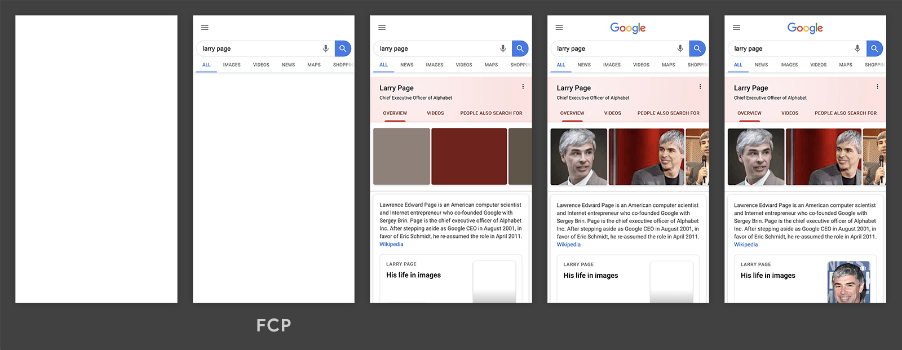

这个指标直接关系到用户的体验。如果 FCP 时间过长，用户将会面对长时间的空白页面，进而可能误以为网站故障，甚至选择离开并寻找其他选项。虽然 FCP 并不涵盖整个页面的加载时间，但它却反映了用户开始与页面进行视觉交互的速度。

在 Chrome DevTools 的 Lighthouse 面板中可以测量 FCP 得分：

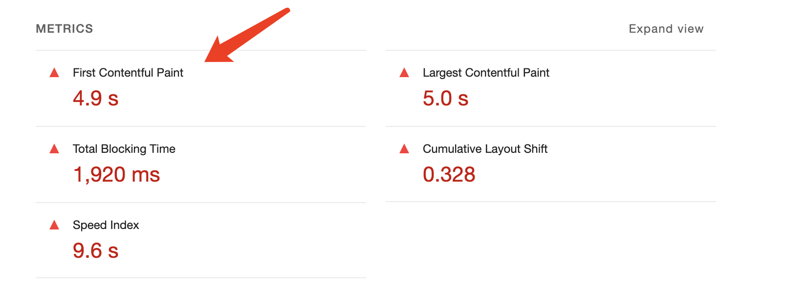

理想的 FCP 时间应控制在 1.8 秒之内：

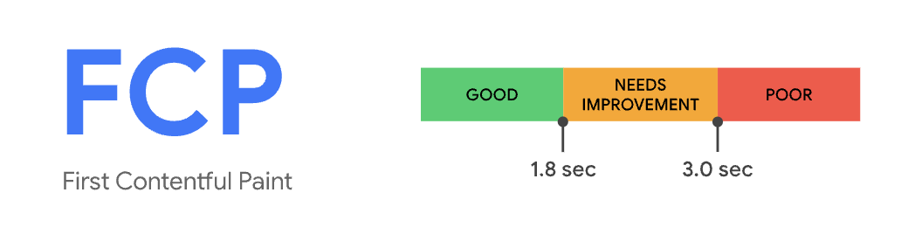

可以考虑通过以下方式来优化 FCP 时间：

* **降低服务器响应时间**：确保服务器能迅速响应请求，这样浏览器就能更快地开始处理并渲染页面内容。可以通过优化服务器端代码、改善静态资源的提供方式（如将图片部署到高性能的CDN）来实现。
* **延迟加载非关键资源**：对于非关键的脚本和 CSS 样式表，使用`defer`属性或`async`属性（对于脚本）来延迟加载，这样它们就不会阻塞页面的初次渲染。
* **移除不必要的资源**：检查页面并移除那些未被使用的样式表和JavaScript脚本，这些不必要的资源会拖慢FCP的时间。
* **内联关键样式**：虽然这种做法会受到质疑，但如内联一些关键的 CSS 样式确实可以显著减少浏览器解析外部资源所需的时间，从而加快渲染速度。

### LCP：**最大内容绘制**

LCP 全称为 Largest Contentful Paint，即最大内容绘制，用于记录视窗内最大的元素绘制的时间，这个时间会随着页面渲染变化而变化，因为页面中的最大元素在渲染过程中可能会发生改变。另外，该指标会在用户第一次交互后停止记录。

在下图中，LCP 发生在第三张图时：

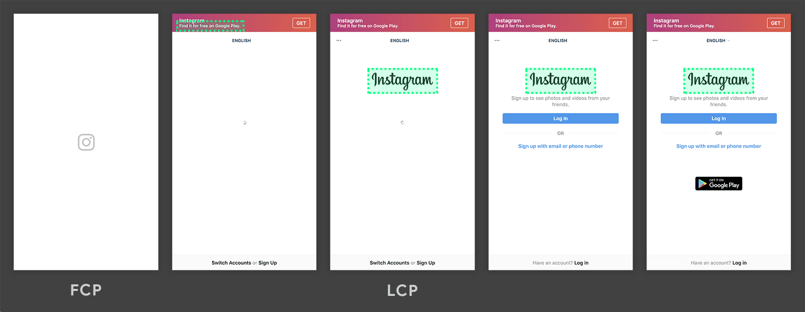

根据规范，LCP 考虑的元素类型包括：

* `` 元素。
* `<svg>` 元素内嵌的 `<image>` 元素。
* `<video>` 元素。
* 使用 `url()` 函数加载背景图片的元素。
* 包含文本节点或其他内嵌文本元素子元素的块级元素。

在 Chrome DevTools 的 Lighthouse 面板中可以测量 LCP 得分：

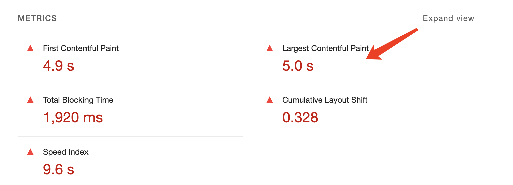

理想的 LCP 时间应控制在 2.5 秒之内：

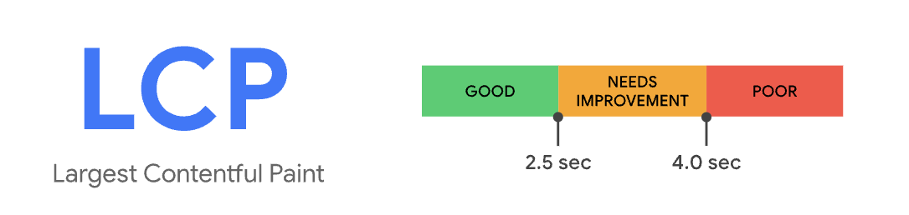

### TTFB：首字节时间

TTFB，全称为 Time to First Byte，即首字节时间，表示从点击网页到接收到第一个字节的时间。

在下图中，TTFB 测量的是 `startTime` 和 `responseStart` 之间的时间总和：

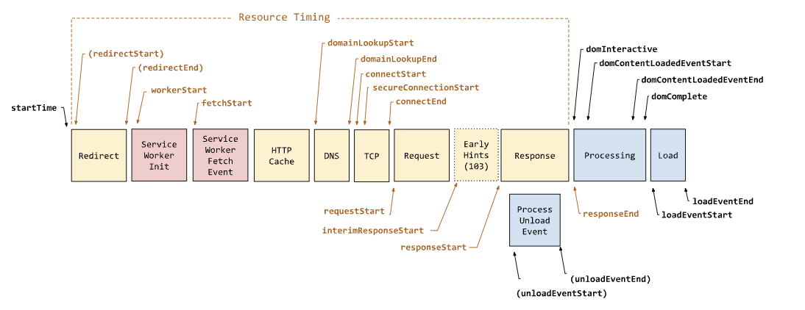

这个时间段包括：

* 重定向时间
* Service Worker 启动时间
* DNS 查找
* 连接和 TLS 协商
* 请求，直到响应的第一个字节到达

理想的 TTFB 时间应控制在 800 毫秒之内：

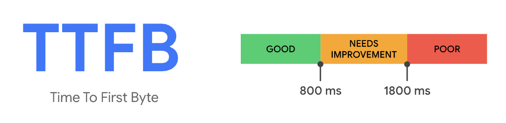

### TBT：总阻塞时间

TBT 全称为 Total Blocking Time，即总阻塞时间，用于衡量的是长任务对主线程的阻塞时间总和。即从首次内容绘制（FCP）到页面达到可交互时间（TTI）期间，主线程因运行长任务而被阻塞的总时间，因此，TBT 会对[首次输入延迟](https://www.debugbear.com/docs/metrics/first-input-delay)有很大影响。长任务是指那些执行时间超过 50 毫秒的 JavaScript 任务，因为它们可能会阻塞页面的渲染和响应，从而影响用户体验。

在 Chrome DevTools 的 Lighthouse 面板中可以测量 TBT 得分：

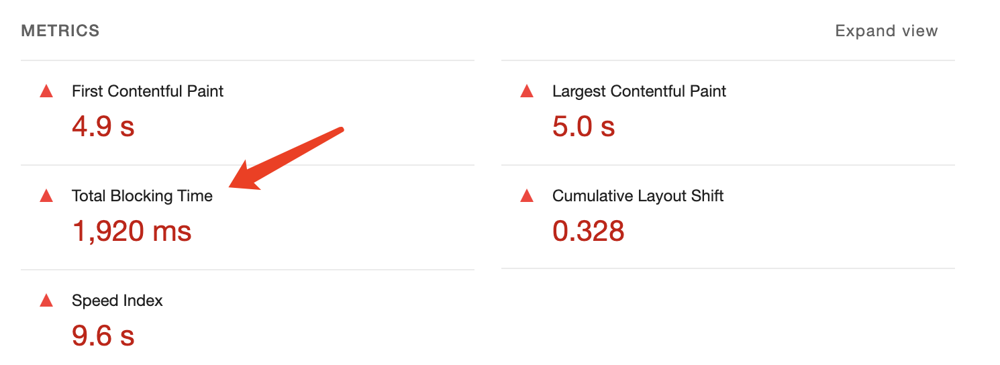

减少 TBT 时间的方式包括：

* 减轻第三方代码的影响
* 缩短JavaScript执行时间
* 减少主线程的工作量
* 控制请求数量和传输大小

理想情况下，TBT 在移动设备上应低于 300 毫秒，在桌面 Web 上应低于 100 毫秒。

### FMP：首次有效渲染

FMP 全称为 First Meaningful Paint，即首次有效渲染。它衡量的是从用户开始加载页面到浏览器首次渲染出对用户来说有意义的内容（如文本、图片、按钮等可交互元素）所花费的时间。

FMP 的计算比较复杂，因为它涉及到“有意义”内容的定义。在实际应用中，通常需要根据具体的应用场景和用户需求来确定哪些内容被认为是“有意义”的。

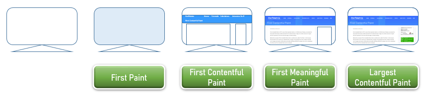

### FP：首次绘制

FP 全称为 First Paint，即首次绘制，表示浏览器首次将像素渲染到屏幕上的时间点。在性能统计指标中，从用户开始访问 Web 页面的时间点到FP的时间点这段时间可以被视为白屏时间，即用户看到的都是没有任何内容的白色屏幕。FP 指标反映了页面的白屏时间，白屏时间的长短直接影响了用户的体验和满意度。

首次绘制与其他性能指标如 First Contentful Paint (FCP) 和 Largest Contentful Paint (LCP) 相关但有所不同：

* **FCP（首次内容绘制）**：指的是页面首次绘制文本或图像的时间点，通常在 FP 之后发生，因为它涉及到更具体的页面内容。
* **LCP（最大内容绘制）**：指的是页面上最大的文本块或图像元素完成绘制的时间点，它关注的是页面主要内容的可见性。

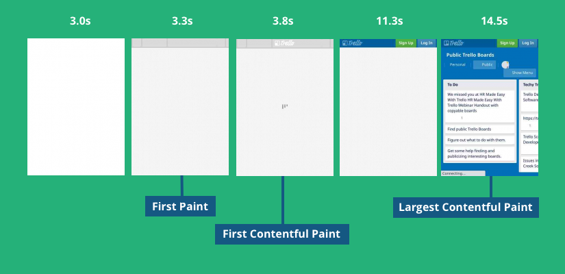

### <font style="color:rgb(28, 30, 33);">SI：速度指数</font>

<font style="color:rgb(28, 30, 33);">SI 全称为 </font><font style="color:rgb(5, 7, 59);background-color:rgb(253, 253, 254);">Speed Index，即速度指数，用于衡量页面渲染用户可见内容迅速程度。Speed Index 并不是一个具体的时间点，而是一个综合性指标。它表示页面从加载开始到页面内容基本可见的过程中，用户感受到的加载速度。该指标是基于视频捕获的可视进度或从绘制事件的可视进展来计算。</font>

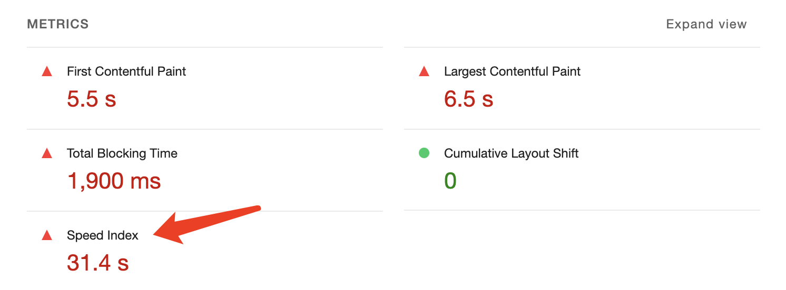

一般来说，在移动设备上，<font style="color:rgb(5, 7, 59);background-color:rgb(253, 253, 254);">Speed Index 低于 3.4s，在桌面上低于 1.3s 时，Lighthouse 才能获得 90 以上的评分。</font>

## **交互相关**

### CLS：累积布局偏移

CLS 全称为 Cumulative Layout Shift，即累积布局偏移，用于衡量一个页面在加载过程中，由于内容的加载和渲染，导致页面布局发生多次变化的情况。具体来说，CLS 指标衡量的是页面中可见元素在加载过程中由于内容加载而发生的位置偏移。这些元素可能因为图片、广告、视频等资源的加载而发生移动。如果一个页面的元素在加载过程中频繁移动，那么这个页面的 CLS 值就会比较高，这通常不是一个好的用户体验。

> 注意：只有意外的布局变化才会计入 CLS 分数。如果内容在用户交互（例如点击）后移动，则不会增加 CLS。

在 Chrome DevTools 的 Lighthouse 面板中可以测量 CLS 得分：

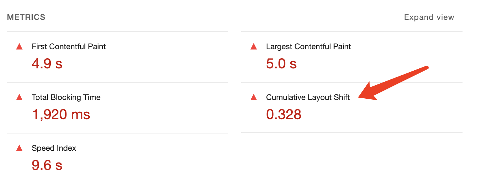

CLS 的值范围通常是从 0 到 1，其中 0 表示没有布局偏移，1 表示布局偏移非常严重。一个较低的 CLS 值意味着页面在加载过程中布局稳定，用户可以更流畅地浏览页面。

理想的 CLS 时间应控制在 0.1 之内：

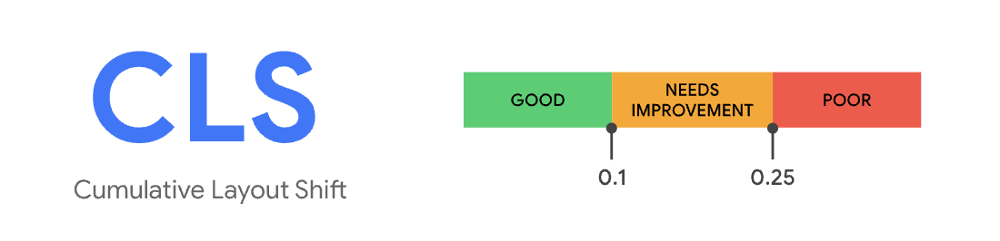

CLS 分数是通过将**影响分数**与**距离分数**相乘来计算的，其中：

* **影响分数**：视口中会移动的不稳定元素的总面积占比。如果页面加载过程中有覆盖视口 60% 面积的元素移动了，那么影响分数就是 0.6。
* **距离分数**：视口中任何单一元素移动的最大距离与视口高度的比值。假设一个元素从位置（0, 100）移动到（0, 500），这导致了 400px 的垂直偏移。如果视口的高度是 1000px，那么距离分数就是 400px / 1000px = 0.4。

则累积布局偏移分数是 0.6 x 0.4 = 0.375。

影响 CLS 分数的常见的原因主要有：

* 图片、视频和iframe没有预先设定尺寸，导致页面加载时元素位置变化。
* 网络字体加载过程中可能产生文本短暂消失或样式未加载的文本闪烁，影响布局稳定性。
* 动态内容（如广告、通知、订阅等）注入DOM后，尤其是网络请求之后，往往会导致页面布局发生突变。

CLS 是由于布局中的意外变化而发生的，因此在编写 HTML 和 CSS 时，可以考虑以下原则：

* **避免布局重叠**：不要将新元素插入到现有元素之上，因为这可能导致页面布局发生意外的变化。尤其是当插入通知或警告框时，应该考虑使用不会干扰其他页面元素的设计方法。
* **预留空间**：为图像和视频元素指定尺寸属性，以便浏览器在内容加载之前就能为它们预留出正确的空间。这有助于防止页面在加载过程中发生不必要的布局调整。
* **谨慎使用动画**：动画和过渡效果可以提升用户体验，但应确保它们不会导致页面布局发生不必要的改变。选择那些不会移动元素或改变布局尺寸的过渡效果，以保持页面的稳定性和一致性。

### INP：交互到下一次绘制

INP 全称为 Interaction to Next Paint，即交互到下一次绘制，用来衡量用户与网页交互后，浏览器完成下一次屏幕绘制所需的时间。这个指标主要关注的是用户交互（如点击、触摸、键盘输入等）之后，页面响应并渲染新内容的速度。

INP 会测量以下延迟：

* **输入延迟**：用户交互和浏览器能够处理事件之间的时间，类似于 FID。
* **处理延迟**：浏览器处理事件处理程序所需的时间
* **显示延迟**：浏览器重新计算布局并将像素绘制到屏幕上所需的时间。

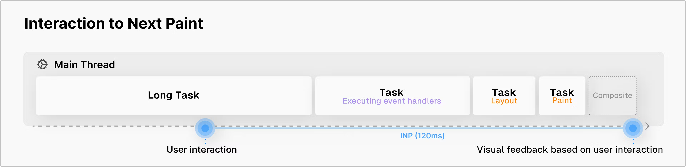

理想的 INP 时间应控制在 200 毫秒之内：

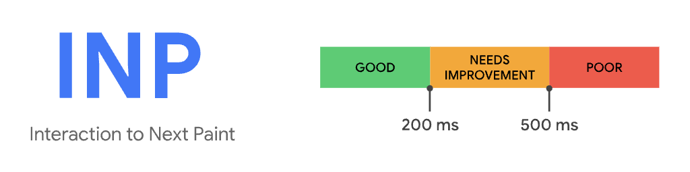

对于 INP，只观测以下互动类型：

* 使用鼠标点击。
* 点按带有触摸屏的设备。
* 实体键盘或屏幕键盘键。

### FID：首次输入延迟

FID 全称为 First Input Delay，即首次输入延迟，是衡量网页性能的一个重要指标，它反映了用户在页面加载过程中首次与页面交互时的体验。FID 特别关注用户首次点击按钮、链接、输入字段等可交互元素时，页面响应这些交互所需的时间。

FID 仅测量输入延迟，即用户输入和浏览器开始执行事件处理程序之间的时间。

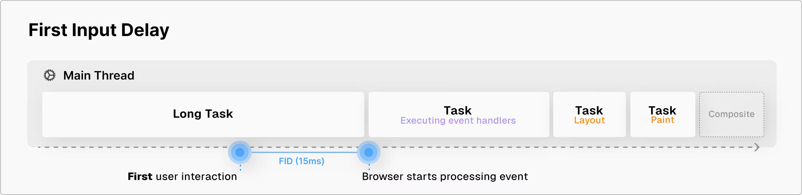

INP 是 FID 的继任指标。虽然两者都是响应能力指标，但 FID 仅测量了页面上首次互动的输入延迟，而 INP 则通过考虑所有页面互动（从输入延迟到运行事件处理程序所需的时间，再到浏览器绘制下一帧）来改进FID。这使得 INP 成为更可靠的整体响应能力指标。

### TTI：可交互时间

TTI 全称为 Time To Interactive，即可交互时间，用于评估页面从开始加载到用户可以顺畅地与之交互的时间点。TTI 特别关注页面的响应性和交互性，它试图捕捉用户能够开始与页面进行流畅交互的瞬间。

TTI 时间主要取决于以下因素：

* 页面布局稳定，所有可见的内容都已经被加载。
* 主线程空闲。如果还在加载脚本或处理其他任务，那么应用将不会处于交互状态。用户的点击和其他操作将被忽略（或排队）直到线程空闲。

可以通过**减少脚本的加载时间**来降低 TTI 时间，因为脚本的加载和处理往往是造成高 TTI 的元凶。以下是一些优化策略：

* **清除冗余脚本**：移除所有未使用的脚本，避免浏览器花费时间去解析不必要的代码，从而提升页面加载速度。
* **分割脚本文件**：将大型脚本拆分成多个较小的文件。这有助于浏览器更有效地加载和解析这些脚本，减少阻塞时间。
* **动态加载脚本**：对于来自外部资源且无法直接分割或修改的脚本，考虑采用动态加载的方式，以减少对页面初始加载时间的影响。

## Core Web Vitals

Core Web Vitals 是一组由Google推出的关键用户体验指标，旨在帮助开发人员评估和优化网站的性能。这些指标主要关注三个方面：加载性能、交互性能和视觉稳定性。

Core Web Vitals 包含了三个指标：

* **INP（Interaction to Next Paint）**：用于评估页面交互的性能，它衡量的是从用户与页面进行交互（如点击、触摸等）到页面下一次绘制（Paint）之间的时间。
* **LCP（Largest Contentful Paint）**：用于评估页面加载的性能，它衡量的是页面加载的最大内容元素（如文本块或图片）出现在屏幕上的时间。
* **CLS（Cumulative Layout Shift）**：用于评估页面视觉稳定性，它衡量的是页面在加载过程中由于内容布局变化而发生的意外移动。

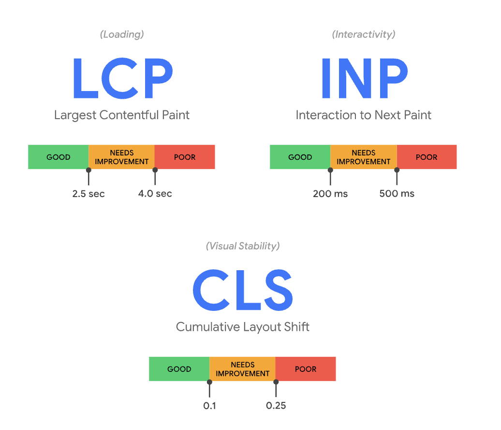

## 性能测量工具

可以借助 Gooogle 开源的 [web-vitals](https://github.com/GoogleChrome/web-vitals) 库来测量一些性能指标：

```javascript
import {onCLS, onINP, onLCP, onFCP, onFID, onTTFB} from 'web-vitals';

onCLS(console.log);
onINP(console.log);
onLCP(console.log);
onFCP(console.log);
onFID(console.log);
onTTFB(console.log);
```

使用 <font style="color:rgb(28, 30, 33);">Google 提供免费的 </font>[PageSpeed Insights](https://pagespeed.web.dev/)<font style="color:rgb(28, 30, 33);"> (PSI) 工具来测试网站的性能：</font>

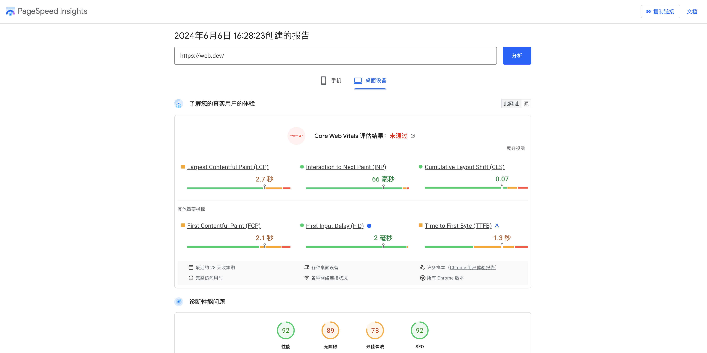

使用 Chrome Devtools 的 Lighthouse 选项卡测试性能指标：

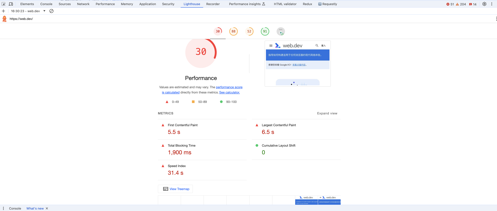

注意，在 Lighthouse 中，不同指标在总分数中的占比是不同的：

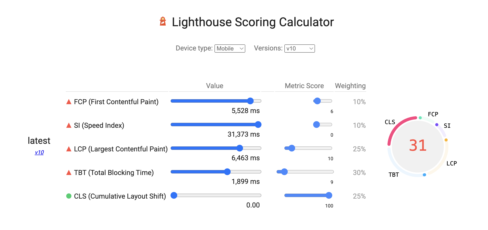


> 更新: 2024-06-07 17:24:34  
> 原文: <https://www.yuque.com/cuggz/feplus/zlgytg2b2b7crkqc>