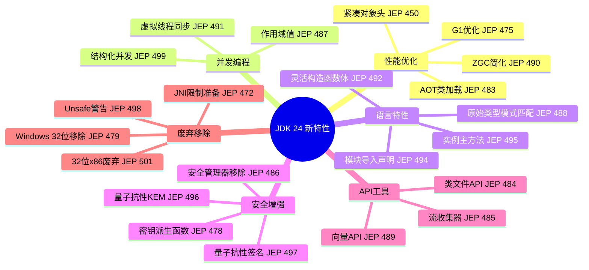

# 1、JDK 24 新特性：JDK 24 新特性实现教程简介
- 来源：https://ddkk.com/zhuanlan/java/java24/1.html
- 分类：JDK 24 新特性
- 分组：教程目录
- 日期：2025-11-27
兄弟们，JDK 24 终于来了，这次更新整得挺猛的，一下子搞了24个JEP（Java Enhancement Proposal），鹏磊我瞅了瞅，这波更新确实有不少好东西值得咱好好唠唠。

先说个背景，JDK 24 是2025年3月18号发布的，距离上次LTS版本（JDK 21）已经过去了一段时间，这次虽然不是LTS，但新特性确实不少，涵盖了性能优化、并发编程、安全增强、语言特性等多个方面。咱这个系列教程就是要带着大家把这些新特性一个个给整明白，从基础概念到实际应用，再到最佳实践，争取让兄弟们都能上手用起来。

## JDK 24 核心特性概览

这次JDK 24的更新，主要聚焦在几个大方向上：性能优化、并发编程增强、安全机制升级、语言特性改进，还有对老旧功能的清理。咱先整体看看都有哪些亮点。

### 性能优化相关

首先说说性能这块，JDK 24 在几个关键领域做了优化：

**紧凑对象头（JEP 450）**：这个特性是实验性的，但潜力很大。以前Java对象头在64位架构上占96-128位，现在压缩到64位，内存占用直接降下来了；对于那种对象特别多的应用，比如微服务场景下大量小对象，这个优化能省不少内存，数据局部性也更好。

**AOT类加载与链接（JEP 483）**：启动性能一直是Java的痛点，特别是云原生场景下，冷启动时间直接影响用户体验。JEP 483 引入了AOT（Ahead-of-Time）类加载和链接机制，可以把类提前加载到缓存里，启动时直接从缓存读取，不用再走一遍类加载流程，启动速度能提升不少。

**G1垃圾收集器优化（JEP 475）**：G1的屏障扩展时机调整了，从JIT编译的早期阶段推迟到后期，编译开销降低了，整体性能更稳定。

**ZGC移除非分代模式（JEP 490）**：ZGC现在只保留分代模式，实现更简洁，维护成本也低了，性能表现更可预测。

### 并发编程增强

虚拟线程（Virtual Threads）从JDK 21引入后，一直是热点话题。JDK 24 在JEP 491中进一步优化了虚拟线程的同步机制，解决了之前虚拟线程在同步块中被"固定"（pinning）的问题；现在虚拟线程在同步时不会占用底层载体线程，可以释放出来处理其他任务，并发能力更强了。

```java
// 虚拟线程同步示例
public class VirtualThreadSync {
    // 创建一个虚拟线程，执行同步操作
    public static void syncOperation() {
        Thread virtualThread = Thread.ofVirtual().start(() -> {
            synchronized (VirtualThreadSync.class) {
                // 在JDK 24中，虚拟线程执行同步操作时
                // 不会固定底层载体线程，可以释放给其他虚拟线程使用
                System.out.println("虚拟线程执行同步操作");
                try {
                    Thread.sleep(1000);  // 模拟耗时操作
                } catch (InterruptedException e) {
                    Thread.currentThread().interrupt();
                }
            }
        });
        // 等待虚拟线程完成
        try {
            virtualThread.join();
        } catch (InterruptedException e) {
            Thread.currentThread().interrupt();
        }
    }
}
```

**结构化并发（JEP 499）**：这是第4次预览，提供了更好的并发任务管理方式，把相关的并发任务当成一个整体来管理，出错处理、取消操作都更简单了。

**作用域值（JEP 487）**：第4次预览，可以在线程内和跨线程共享不可变数据，比ThreadLocal更安全，不会出现内存泄漏的问题。

### 语言特性改进

**原始类型模式匹配（JEP 488）**：这是第2次预览，让instanceof和switch语句支持原始类型，写代码更简洁了。以前判断int、long这些原始类型，得先装箱再判断，现在直接就能用。

```java
// 原始类型模式匹配示例
public class PrimitivePatternMatching {
    public static void processValue(Object value) {
        // JDK 24中可以直接对原始类型进行模式匹配
        if (value instanceof int i) {
            // 直接使用int类型的值，不需要装箱
            System.out.println("这是一个整数: " + i);
        } else if (value instanceof long l) {
            System.out.println("这是一个长整数: " + l);
        } else if (value instanceof double d) {
            System.out.println("这是一个双精度浮点数: " + d);
        }
        // switch表达式也支持原始类型
        int result = switch (value) {
            case int i -> i * 2;  // 直接匹配int类型
            case long l -> (int)(l / 2);
            case double d -> (int)d;
            default -> 0;
        };
    }
}
```

**灵活构造函数体（JEP 492）**：第3次预览，构造函数可以更灵活地组织代码，不用非得把所有初始化逻辑都放在构造函数开头，代码可读性更好。

**模块导入声明（JEP 494）**：第2次预览，简化了模块导入的语法，写module-info.java更省事了。

**简单源文件和实例主方法（JEP 495）**：第4次预览，写简单的Java程序不用非得搞个public static void main了，可以直接在类里写实例方法当入口，对初学者更友好。

### 安全增强

**密钥派生函数API（JEP 478）**：预览版，提供了标准的密钥派生函数API，可以从共享密钥生成加密密钥，这是为量子安全做准备的重要一步。

**量子抗性模块格密钥封装机制（JEP 496）**：引入了基于模块格的密钥封装机制，这是后量子密码学的一部分，为将来量子计算威胁做准备。

**量子抗性模块格数字签名算法（JEP 497）**：同样是后量子密码学的一部分，提供了抗量子攻击的数字签名算法。

**安全管理器永久禁用（JEP 486）**：安全管理器从JDK 17就被废弃了，现在彻底移除。现代应用用容器、操作系统级别的安全机制更靠谱，这个老古董也该退休了。

### API和工具改进

**类文件API（JEP 484）**：提供了标准的类文件解析、生成、转换API，不用再依赖ASM、Javassist这些第三方库了，官方API更稳定可靠。

```java
// 类文件API使用示例
import java.lang.classfile.*;
import java.lang.classfile.attribute.*;
public class ClassFileExample {
    public static void createClass() {
        // 使用JDK 24的类文件API创建类
        ClassFile.of().buildTo(
            ClassFileOutput.of(),
            ClassDesc.of("com.example.MyClass"),
            classBuilder -> {
                // 添加方法
                classBuilder.withMethod(
                    "hello",
                    MethodTypeDesc.of(ClassDesc.of("void")),
                    ClassFile.ACC_PUBLIC,
                    methodBuilder -> {
                        // 方法体：调用System.out.println
                        methodBuilder.withCode(codeBuilder -> {
                            codeBuilder
                                .getstatic(ClassDesc.of("java.lang.System"), "out", 
                                    ClassDesc.of("java.io.PrintStream"))
                                .ldc("Hello from generated class!")
                                .invokevirtual(ClassDesc.of("java.io.PrintStream"), 
                                    "println", MethodTypeDesc.of(ClassDesc.of("void"), 
                                    ClassDesc.of("java.lang.String")))
                                .return_();
                        });
                    }
                );
            }
        );
    }
}
```

**流收集器（JEP 485）**：Stream API的增强，提供了自定义的中间流操作，数据处理更灵活了。

**向量API（JEP 489）**：第9次孵化，提供了表达向量计算的机制，可以编译成最优的硬件指令，适合高性能计算场景。

### 废弃和移除

**移除Windows 32位x86端口（JEP 479）**：32位架构已经过时了，移除这个端口可以简化JDK维护工作，专注于64位架构。

**废弃32位x86端口（JEP 501）**：除了Windows，其他平台的32位x86支持也被标记为废弃，未来版本会移除。

**限制JNI使用准备（JEP 472）**：调用JNI和FFM API时会发出运行时警告，为将来限制原生交互做准备，鼓励开发者迁移到更安全的FFM API。

**警告Unsafe内存访问方法（JEP 498）**：使用sun.misc.Unsafe的内存访问方法时会发出警告，鼓励迁移到更安全的替代方案。

## 教程系列规划

这个系列教程会按照以下顺序，把JDK 24的主要新特性给兄弟们讲清楚：

1. **JDK 24 新特性实现教程简介**（就是这篇）：整体概览，让大家对JDK 24有个全面的认识。
2. **原始类型模式匹配增强（JEP 488）**：instanceof和switch全面支持原始类型，代码更简洁。
3. **灵活构造函数体（JEP 492）**：构造函数可以更灵活地组织代码，提升可读性。
4. **紧凑对象头（JEP 450）**：实验性特性，降低内存占用，提升数据局部性。
5. **AOT类加载与链接（JEP 483）**：提升启动性能，特别适合云原生场景。
6. **虚拟线程无固定同步（JEP 491）**：增强虚拟线程的并发性能，解决同步固定问题。
7. **密钥派生函数API（JEP 478）**：预览版，为量子安全做准备。
8. **量子抗性模块格密钥封装机制（JEP 496）**：后量子密码学的重要组成。
9. **安全管理器永久禁用（JEP 486）**：现代化安全实践，移除过时的安全管理器。
10. **类文件API（JEP 484）**：标准化字节码操作，替代第三方库。
11. **流收集器（JEP 485）**：增强Stream API功能，提供自定义中间操作。

每篇教程都会包含：特性介绍、代码示例（带详细中文注释）、应用场景、最佳实践、常见问题等，争取让大家都能上手用起来。

## 技术栈和前置知识

在看这个系列教程之前，兄弟们最好对以下内容有一定了解：

- **Java基础**：面向对象编程、集合框架、异常处理等基础概念
- **Java并发**：线程、锁、并发集合等，了解虚拟线程更好
- **JVM基础**：类加载机制、内存模型、垃圾收集等基本概念
- **Java模块系统**：了解module-info.java的基本用法
- **Stream API**：熟悉Java 8引入的Stream API基本用法

如果对这些不太熟悉，也没关系，鹏磊会在教程里尽量解释清楚，遇到关键概念也会简单提一下背景。

## 开发环境准备

要体验JDK 24的新特性，首先得安装JDK 24。可以从以下几个渠道获取：

1. **Oracle JDK**：https://www.oracle.com/java/technologies/downloads/#java24
2. **OpenJDK**：https://jdk.java.net/24/
3. **Eclipse Temurin**：https://adoptium.net/

安装完成后，验证一下版本：

```bash
# 检查Java版本
java -version
# 应该看到类似输出：
# openjdk version "24" 2025-03-18
# OpenJDK Runtime Environment (build 24+36-2231)
# OpenJDK 64-Bit Server VM (build 24+36-2231, mixed mode, sharing)
```

对于IDE，推荐使用：

- **IntelliJ IDEA**：2024.1及以上版本支持JDK 24
- **Eclipse**：2024-03及以上版本支持JDK 24
- **VS Code**：配合Java Extension Pack使用

## 特性分类总结

为了让大家更清楚地了解JDK 24的特性分布，咱用个Mermaid图来展示一下：



## 实际应用场景

JDK 24的这些新特性，在实际开发中能解决哪些问题呢？咱简单举几个例子：

**微服务场景**：AOT类加载（JEP 483）可以大幅提升服务启动速度，特别是在Kubernetes这种需要频繁启停容器的环境里，冷启动时间直接影响用户体验。紧凑对象头（JEP 450）能降低内存占用，同样的硬件可以跑更多实例。

**高并发场景**：虚拟线程无固定同步（JEP 491）让虚拟线程的并发能力更强，适合处理大量I/O密集型任务，比如Web服务器、数据库连接池等场景。

**安全敏感应用**：密钥派生函数API（JEP 478）和量子抗性加密（JEP 496、497）为将来量子计算威胁做准备，金融、政府等对安全要求高的场景需要提前布局。

**代码生成工具**：类文件API（JEP 484）提供了标准API，不用再依赖第三方库，代码生成、字节码增强等工具可以更稳定可靠。

**数据处理**：流收集器（JEP 485）增强了Stream API，复杂的数据转换逻辑可以更优雅地实现。

## 迁移建议

如果兄弟们现在用的是JDK 21或更早版本，想升级到JDK 24，需要注意以下几点：

1. **预览特性**：JEP 488、492、494、495、487、499都是预览特性，需要在编译和运行时加上`--enable-preview`参数。
2. **实验性特性**：JEP 450是实验性特性，需要加上`--enable-preview --enable-experimental`参数。
3. **废弃API**：安全管理器（JEP 486）被移除了，如果代码里用了SecurityManager，需要迁移到容器或操作系统级别的安全机制。
4. **32位支持**：Windows 32位x86端口被移除了（JEP 479），如果还有32位应用，需要迁移到64位。
5. **JNI警告**：使用JNI会收到警告（JEP 472），建议迁移到FFM API。
6. **Unsafe警告**：使用sun.misc.Unsafe的内存访问方法会收到警告（JEP 498），建议迁移到更安全的替代方案。

## 学习路径建议

对于不同水平的开发者，鹏磊建议这样学习：

**初学者**：先看语言特性相关的教程（JEP 488、492、495），这些改动对日常开发影响大，容易上手。

**中级开发者**：重点关注并发编程（JEP 491、487、499）和API改进（JEP 484、485），这些能直接提升代码质量和性能。

**高级开发者**：深入研究性能优化（JEP 450、483、475）和安全增强（JEP 478、496、497），这些对系统架构设计有重要影响。

**架构师**：需要全面了解所有特性，特别是废弃和移除的部分（JEP 486、479、501、472、498），这些影响技术选型和迁移策略。

## 总结

JDK 24这次更新确实有不少亮点，从性能优化到并发增强，从语言特性到安全机制，覆盖面挺广的。虽然有些特性还是预览或实验性的，但已经能看到Java生态在朝着更现代、更高效、更安全的方向发展。

这个系列教程会带着大家把这些特性一个个给整明白，每篇都会包含详细的代码示例和实际应用场景，争取让大家都能在实际项目中用起来。兄弟们有啥问题或者想深入了解某个特性，可以在评论区留言，鹏磊会尽量回复。

好了，简介就写到这，下一期咱就开始讲原始类型模式匹配增强（JEP 488），这个特性用起来确实挺爽的，代码能简洁不少。兄弟们准备好，咱们开始整活！
