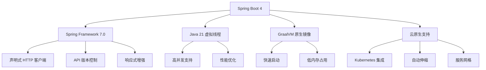

# 01、Spring Boot 4 实战：Spring Boot 4 概述与重大变化
- 来源：https://ddkk.com/springboot/4/1.html
- 分类：Spring Boot 4.0 实战教程
- 分组：教程目录
- 日期：2025-11-25
兄弟们，鹏磊今天来聊聊 Spring Boot 4 这个大版本更新；说实话，这版本更新得有点猛，变化挺大的，咱得好好捋一捋。

## 一、这是个啥玩意儿？

Spring Boot 4.0 是 Spring Boot 的一个重大版本更新，距离 Spring Boot 3.0 发布已经过去一段时间了；这次更新不是小打小闹，而是从底层到上层都动了刀子，搞得跟重新设计似的。你瞅瞅这架势，就知道不是闹着玩的。

先说个最直观的变化：**最低 JDK 版本要求从 Java 17 起步，官方推荐用 Java 21**；这意思就是，你要是还在用 Java 8 或者 Java 11，那对不起，得先升级 JDK 才能玩 Spring Boot 4。这其实也能理解，毕竟 Java 17 是 LTS 版本，而且 Java 21 的虚拟线程（Virtual Threads）确实香；别磨叽了，赶紧升级吧。

```java
// 这是 Spring Boot 4 应用的基本结构，跟之前版本差不多
// 但是底层依赖的 Spring Framework 已经升级到 7.0 了
@SpringBootApplication  // 这个注解还是老样子，但背后干的事儿不一样了
public class SpringBoot4App {
    public static void main(String[] args) {
        // 启动应用，Spring Boot 4 的启动流程优化了不少
        SpringApplication.run(SpringBoot4App.class, args);
    }
}
```

## 二、核心变化盘点

### 1. JDK 版本要求提升

这个前面说了，最低 Java 17，推荐 Java 21；为啥这么搞？因为 Java 21 的虚拟线程特性太强了，Spring Boot 4 深度集成了这玩意儿，能支持百万级并发；你要是还用 Java 8，那性能提升就跟你没啥关系了。咱得跟上时代，别老抱着旧版本不放。

```java
// 在 Spring Boot 4 中启用虚拟线程的配置
// 这个配置在 application.yml 或者 application.properties 里写
// spring.threads.virtual.enabled=true
@Configuration
public class VirtualThreadConfig {
    // 配置虚拟线程执行器，这玩意儿能大幅提升并发性能
    @Bean
    public Executor virtualThreadExecutor() {
        // 创建虚拟线程执行器，底层用的是 Java 21 的虚拟线程
        // 虚拟线程比传统线程轻量多了，一个线程池能支持百万级并发
        // 这玩意儿比传统线程池强太多了，性能提升不是一点半点
        return Executors.newVirtualThreadPerTaskExecutor();
    }
}
```

### 2. Spring Framework 7.0 集成

Spring Boot 4 基于 Spring Framework 7.0，这个版本也是个大更新；新特性包括：

- 声明式 HTTP 客户端（@HttpExchange）
- 更好的云原生支持
- 响应式编程增强
- API 版本控制

这些新特性用起来确实方便，特别是声明式 HTTP 客户端，比之前那套简单多了。

```java
// Spring Framework 7.0 引入的声明式 HTTP 客户端
// 这玩意儿比 RestTemplate 和 WebClient 用起来简单多了，代码量能减少 60%
@HttpExchange(url = "/api/users")  // 定义基础 URL，所有方法都基于这个路径
public interface UserClient {
    // 获取用户信息，方法签名就是接口定义，不用写实现；Spring 会自动生成代理
    @GetExchange("/{id}")  // GET 请求，路径参数是 id
    User getUser(@PathVariable Long id);  // 返回 User 对象，自动反序列化
    // 创建用户，POST 请求，请求体是 User 对象；会自动序列化
    @PostExchange
    User createUser(@RequestBody User user);
}
```

### 3. 虚拟线程支持

这个前面提了一嘴，但得详细说说；虚拟线程是 Java 21 引入的，Spring Boot 4 做了深度集成。传统线程一个线程对应一个操作系统线程，资源消耗大；虚拟线程是轻量级的，一个 JVM 线程可以运行成千上万个虚拟线程。

这玩意儿确实牛逼，以前搞高并发得小心翼翼管理线程池，现在直接甩给虚拟线程就完事了。

```java
// 虚拟线程的实际应用场景
@Service
public class UserService {
    // 这个方法如果用传统线程，1000 个并发请求就得创建 1000 个线程；资源消耗太大了
    // 用虚拟线程的话，可能只需要几个 JVM 线程就能搞定；这就是差距
    public CompletableFuture<User> fetchUserAsync(Long id) {
        // 虚拟线程会自动管理，不需要手动创建线程池；Spring Boot 4 都帮你搞定了
        return CompletableFuture.supplyAsync(() -> {
            // 模拟数据库查询，这里会挂起虚拟线程，不占用操作系统线程
            // 虚拟线程挂起时，JVM 线程可以去执行其他虚拟线程，利用率贼高
            return userRepository.findById(id);
        });
    }
}
```

### 4. 云原生深度融合

Spring Boot 4 在云原生这块下了大功夫，特别是跟 Kubernetes 的集成。支持 Kubernetes 探针、自动伸缩、服务网格适配等功能。

```yaml
# application.yml 中配置 Kubernetes 探针
spring:
  application:
    name: my-app
  kubernetes:
    probes:
      liveness:
        enabled: true  # 启用存活探针
        path: /actuator/health/liveness  # 探针路径
      readiness:
        enabled: true  # 启用就绪探针
        path: /actuator/health/readiness
```

### 5. GraalVM 原生镜像支持

Spring Boot 4 对 GraalVM 原生镜像的支持更完善了；原生镜像能大幅提升启动速度，减少内存占用，特别适合云原生场景。这玩意儿在容器化部署时特别有用，启动快、内存省，简直就是为云原生量身定做的。

```java
// 使用 GraalVM 编译原生镜像的配置
// 在 pom.xml 或者 build.gradle 中配置
// Maven 配置示例：
// <plugin>
//     <groupId>org.springframework.boot</groupId>
//     <artifactId>spring-boot-maven-plugin</artifactId>
//     <configuration>
//         <image>
//             <builder>paketobuildpacks/builder:base</builder>
//         </image>
//     </configuration>
// </plugin>
```

### 6. 自动模块推导

Java 9 引入的模块系统（JPMS）一直是个痛点，很多第三方库没有 module-info.java；Spring Boot 4 引入了自动模块推导功能，能自动为这些库生成模块描述，解决 90% 的模块化兼容问题。这功能确实实用，以前搞模块化得一个个手动配置，现在自动搞定，省事多了。

### 7. 分层编译优化

Spring Boot 4 支持分层 JAR，可以把应用拆解为依赖层、资源层和业务层；这样在容器镜像中，依赖层可以复用，镜像体积能减少 50%。这功能对 Docker 镜像优化特别有用，依赖层基本不变，只有业务层变化时才需要重新构建，构建速度也快了不少。

```java
// 分层 JAR 的结构
// 依赖层：第三方库，变化频率低，可以复用
// 资源层：静态资源，变化频率中等
// 业务层：业务代码，变化频率高
// 这样构建 Docker 镜像时，只有业务层变化才需要重新构建
```

### 8. Jackson 3 支持

Spring Boot 4 全面支持 Jackson 3，序列化性能有提升，还支持了一些新的数据格式，比如 CBOR；这玩意儿在 IoT 场景特别有用，CBOR 格式比 JSON 更紧凑，传输效率更高。

```java
// Jackson 3 的新特性使用示例
@RestController
public class DataController {
    @Autowired
    private ObjectMapper objectMapper;  // Spring Boot 4 自动配置的是 Jackson 3
    @GetMapping("/data")
    public String getData() throws JsonProcessingException {
        // Jackson 3 的序列化性能比 Jackson 2 提升了 20% 左右
        return objectMapper.writeValueAsString(data);
    }
}
```

### 9. 测试框架增强

Spring Boot 4 引入了 RestTestClient，测试 REST API 更方便了；同时升级到 JUnit Jupiter 6.0，测试功能更强大。以前测试 REST API 得用 MockMvc，写起来麻烦，现在用 RestTestClient 简单多了，代码量少一半。

```java
// RestTestClient 的使用示例
@SpringBootTest
class UserControllerTest {
    @Autowired
    private RestTestClient restTestClient;  // 自动注入测试客户端
    @Test
    void testGetUser() {
        // 测试 GET 请求，比 MockMvc 用起来简单
        restTestClient.get()
            .uri("/api/users/1")
            .exchange()
            .expectStatus().isOk()
            .expectBody(User.class)
            .value(user -> assertEquals("张三", user.getName()));
    }
}
```

### 10. Spring AI 模块集成

Spring Boot 4 内置了 Spring AI 模块，可以方便地集成 AI 能力，比如调用大语言模型、向量数据库等；这玩意儿让 AI 集成变得贼简单，以前得自己搞一堆配置，现在 Spring Boot 都帮你搞定了。

```java
// Spring AI 的使用示例
@Service
public class AIService {
    @Autowired
    private ChatClient chatClient;  // AI 聊天客户端
    public String chat(String prompt) {
        // 调用 AI 模型，返回响应
        return chatClient.call(prompt);
    }
}
```

## 三、架构变化

Spring Boot 4 的架构变化可以用下面这个图来理解：



## 四、升级注意事项

如果你要从 Spring Boot 3 升级到 4，有几个点得注意：

1. **JDK 版本必须升级**：最低 Java 17，推荐 Java 21
2. **依赖版本更新**：很多第三方依赖可能需要升级到兼容 Spring Boot 4 的版本；这个比较麻烦，得一个个检查
3. **配置属性变化**：有些配置属性可能被废弃或改名，建议使用 `spring-boot-properties-migrator` 来检查
4. **API 变化**：部分 API 可能有变化，需要检查代码兼容性

升级这事儿得慢慢来，别着急，先把测试环境搞好了再上生产。

```xml
<!-- 添加属性迁移工具，帮助检查废弃的属性 -->
<dependency>
    <groupId>org.springframework.boot</groupId>
    <artifactId>spring-boot-properties-migrator</artifactId>
    <scope>runtime</scope>
</dependency>
```

## 五、性能提升

Spring Boot 4 在性能方面有不少提升：

- **启动速度**：使用 GraalVM 原生镜像，启动速度能提升 10 倍以上；这玩意儿确实快，以前启动要几十秒，现在几秒就完事了
- **内存占用**：原生镜像的内存占用能减少 50% 以上
- **并发性能**：虚拟线程支持百万级并发，比传统线程池强太多；这个是真牛逼，以前想都不敢想
- **序列化性能**：Jackson 3 的序列化性能提升 20% 左右

性能提升这块确实给力，特别是原生镜像和虚拟线程，这两个特性加起来，性能提升不是一点半点。

## 六、总结

Spring Boot 4 这次更新确实挺大的，从 JDK 版本要求到核心功能都有变化；如果你要升级，得做好心理准备，可能得改不少代码。但是升级带来的性能提升和功能增强，还是挺值得的。

特别是虚拟线程和 GraalVM 原生镜像这两个特性，对性能提升帮助很大；如果你在做高并发应用或者云原生应用，Spring Boot 4 绝对值得一试。

好了，今天就聊到这；下一篇咱详细说说怎么从 Spring Boot 3 升级到 4，包括具体的迁移步骤和注意事项。兄弟们有啥问题可以在评论区留言，鹏磊看到会回复的。
