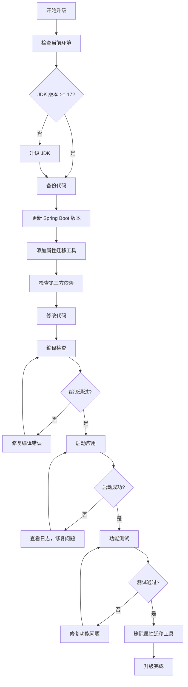

# 02、Spring Boot 4 实战：从 Spring Boot 3 升级到 4：完整迁移指南
- 来源：https://ddkk.com/springboot/4/2.html
- 分类：Spring Boot 4.0 实战教程
- 分组：教程目录
- 日期：2025-11-25
兄弟们，鹏磊今天来聊聊从 Spring Boot 3 升级到 4 这事儿；说实话，这升级过程比想象中要复杂点，但也没那么吓人，只要按步骤来，基本都能搞定。别慌，慢慢来就行。

## 一、升级前准备

升级之前，咱得先搞清楚几个事儿；别一上来就改代码，那样容易出问题。这事儿急不得，得一步步来。

### 1. 检查当前环境

首先，你得知道你现在用的是啥版本；打开 `pom.xml` 或者 `build.gradle`，看看 Spring Boot 版本号。如果是 3.x 系列的，那就可以开始升级了；如果是 2.x 或者更老的版本，建议先升级到 3.x，再考虑升级到 4。

```xml
<!-- 这是升级前的 pom.xml，看看你的版本是不是 3.x -->
<parent>
    <groupId>org.springframework.boot</groupId>
    <artifactId>spring-boot-starter-parent</artifactId>
    <version>3.2.0</version>  <!-- 这是你当前的版本，记下来 -->
</parent>
```

### 2. JDK 版本要求

这个最重要，Spring Boot 4 要求最低 JDK 17，推荐用 JDK 21；你要是还在用 JDK 8 或者 JDK 11，那对不起，得先升级 JDK。这事儿没商量，不升级 JDK 就别想用 Spring Boot 4。

```bash
# 检查一下你的 JDK 版本
java -version
# 如果版本低于 17，得先升级 JDK
# 推荐用 JDK 21，性能好，虚拟线程支持也完整
```

### 3. 备份代码

升级之前，一定要备份代码；别嫌麻烦，万一出问题，还能回滚。用 Git 的话，先提交一下，或者创建一个新分支专门用来升级。

```bash
# 创建升级分支
git checkout -b upgrade-to-spring-boot-4
# 提交当前代码
git add .
git commit -m "准备升级到 Spring Boot 4"
```

## 二、依赖升级

### 1. 更新 Spring Boot 版本

第一步，先把 Spring Boot 版本改成 4.0.0；Maven 和 Gradle 的配置不一样，咱分别说说。

**Maven 配置：**

```xml
<!-- 升级后的 pom.xml，版本改成 4.0.0 -->
<parent>
    <groupId>org.springframework.boot</groupId>
    <artifactId>spring-boot-starter-parent</artifactId>
    <version>4.0.0</version>  <!-- 改成 4.0.0，这是最新版本 -->
</parent>
<properties>
    <java.version>21</java.version>  <!-- JDK 版本改成 21，推荐用这个 -->
    <!-- 或者用 17，最低要求 -->
</properties>
```

**Gradle 配置：**

```groovy
// build.gradle 配置
plugins {
    id 'org.springframework.boot' version '4.0.0'  // 版本改成 4.0.0
    id 'io.spring.dependency-management' version '1.1.4'
}
java {
    sourceCompatibility = '21'  // JDK 版本改成 21
    targetCompatibility = '21'
}
```

### 2. 添加属性迁移工具

升级过程中，有些配置属性可能会被废弃或者改名；Spring Boot 提供了个工具叫 `spring-boot-properties-migrator`，能帮你检查这些废弃的属性。这玩意儿挺有用的，建议先加上。启动的时候会自动提示你哪些属性有问题。

```xml
<!-- Maven 配置，添加属性迁移工具 -->
<dependency>
    <groupId>org.springframework.boot</groupId>
    <artifactId>spring-boot-properties-migrator</artifactId>
    <scope>runtime</scope>  <!-- runtime 作用域，只在运行时用 -->
</dependency>
```

```groovy
// Gradle 配置
dependencies {
    runtimeOnly 'org.springframework.boot:spring-boot-properties-migrator'  // 添加这个依赖
}
```

启动应用的时候，这个工具会自动检查废弃的属性，并在日志里提示你；等升级完了，记得把这个依赖删掉，不需要了。

### 3. 检查第三方依赖兼容性

Spring Boot 4 升级了 Spring Framework 到 7.0，很多第三方依赖可能还没适配；你得一个个检查，看看有没有兼容 Spring Boot 4 的版本。

常见的依赖需要检查的：

```xml
<!-- 数据库相关 -->
<dependency>
    <groupId>com.mysql</groupId>
    <artifactId>mysql-connector-j</artifactId>  <!-- MySQL 驱动，检查版本 -->
</dependency>
<!-- Redis 相关 -->
<dependency>
    <groupId>org.springframework.boot</groupId>
    <artifactId>spring-boot-starter-data-redis</artifactId>  <!-- Redis，一般没问题 -->
</dependency>
<!-- 消息队列 -->
<dependency>
    <groupId>org.springframework.boot</groupId>
    <artifactId>spring-boot-starter-amqp</artifactId>  <!-- RabbitMQ，检查版本 -->
</dependency>
```

建议去各个依赖的官网看看，有没有发布兼容 Spring Boot 4 的版本；没有的话，可能得等一段时间，或者找替代方案。这事儿比较麻烦，但也没办法。

## 三、代码修改

### 1. 废弃的 API 替换

Spring Boot 4 废弃了一些 API，得替换掉；最常见的是 Jackson 2 相关的，Spring Boot 4 全面支持 Jackson 3 了，Jackson 2 的自动配置被标记为废弃。

```java
// 升级前，用的是 Jackson 2
@Configuration
public class JacksonConfig {
    @Bean
    public Jackson2ObjectMapperBuilder jackson2ObjectMapperBuilder() {
        // 这个 API 在 Spring Boot 4 里被废弃了
        return new Jackson2ObjectMapperBuilder();
    }
}
// 升级后，改用 Jackson 3
@Configuration
public class JacksonConfig {
    @Bean
    public JacksonObjectMapperBuilder jacksonObjectMapperBuilder() {
        // 改用 Jackson 3 的 API，名字变了，用法差不多
        return new JacksonObjectMapperBuilder();
    }
}
```

### 2. 配置属性迁移

有些配置属性改名了，或者被废弃了；启动应用的时候，`spring-boot-properties-migrator` 会在日志里提示你。常见的配置变化：

```yaml
# 升级前的配置
spring:
  datasource:
    url: jdbc:mysql://localhost:3306/test
    username: root
    password: 123456
    driver-class-name: com.mysql.cj.jdbc.Driver  # 这个属性可能改名了
# 升级后，检查日志提示，可能需要改成：
spring:
  datasource:
    url: jdbc:mysql://localhost:3306/test
    username: root
    password: 123456
    driver-class-name: com.mysql.cj.jdbc.Driver  # 或者改成新的属性名
```

### 3. 虚拟线程配置

Spring Boot 4 深度集成了虚拟线程，如果你用的是 JDK 21，可以启用虚拟线程；这玩意儿性能好，能支持百万级并发。

```yaml
# application.yml 配置虚拟线程
spring:
  threads:
    virtual:
      enabled: true  # 启用虚拟线程，JDK 21 才支持
```

```java
// 代码里使用虚拟线程执行器
@Configuration
public class VirtualThreadConfig {
    @Bean
    public Executor virtualThreadExecutor() {
        // 创建虚拟线程执行器，底层用的是 Java 21 的虚拟线程
        // 这玩意儿比传统线程池强多了，性能提升不是一点半点
        return Executors.newVirtualThreadPerTaskExecutor();
    }
    // 配置 WebMvc 使用虚拟线程
    @Bean
    public TomcatProtocolHandlerCustomizer<?> protocolHandlerVirtualThreadExecutorCustomizer() {
        // 让 Tomcat 使用虚拟线程处理请求，性能提升明显
        return protocolHandler -> {
            protocolHandler.setExecutor(Executors.newVirtualThreadPerTaskExecutor());
        };
    }
}
```

### 4. 声明式 HTTP 客户端

Spring Framework 7.0 引入了声明式 HTTP 客户端，用起来比 RestTemplate 和 WebClient 简单多了；如果你之前用的是 RestTemplate，可以考虑迁移到声明式客户端。

```java
// 升级前，用的是 RestTemplate
@Service
public class UserService {
    @Autowired
    private RestTemplate restTemplate;  // 这个还能用，但推荐用新的
    public User getUser(Long id) {
        // 调用远程接口，代码比较繁琐
        return restTemplate.getForObject("http://api.example.com/users/" + id, User.class);
    }
}
// 升级后，改用声明式 HTTP 客户端
@HttpExchange(url = "http://api.example.com")  // 定义基础 URL
public interface UserClient {
    @GetExchange("/users/{id}")  // GET 请求，路径参数是 id
    User getUser(@PathVariable Long id);  // 方法签名就是接口定义，不用写实现
}
@Service
public class UserService {
    @Autowired
    private UserClient userClient;  // 注入客户端，Spring 会自动生成代理
    public User getUser(Long id) {
        // 直接调用，代码简洁多了
        return userClient.getUser(id);
    }
}
```

## 四、测试和验证

### 1. 编译检查

升级完依赖和代码，先编译一下，看看有没有编译错误；有错误的话，一个个解决。

```bash
# Maven 编译
mvn clean compile
# Gradle 编译
./gradlew clean build
```

### 2. 启动应用

编译通过后，启动应用，看看能不能正常启动；启动的时候，注意看日志，`spring-boot-properties-migrator` 会提示废弃的属性。

```bash
# 启动应用，观察日志
mvn spring-boot:run
# 或者
java -jar target/your-app.jar
```

### 3. 功能测试

启动成功后，跑一下功能测试，看看有没有问题；特别是那些用了废弃 API 的地方，得重点测试。

```java
// 写个简单的测试，验证基本功能
@SpringBootTest
class ApplicationTest {
    @Test
    void contextLoads() {
        // 测试应用上下文能不能正常加载
        // 如果这个测试都过不了，说明配置有问题
    }
    @Test
    void testUserService() {
        // 测试业务功能，看看有没有问题
        // 重点测试那些改了代码的地方
    }
}
```

## 五、常见问题处理

### 1. 依赖冲突

升级过程中，可能会遇到依赖冲突；Maven 和 Gradle 都有工具可以检查依赖冲突。

```bash
# Maven 检查依赖树
mvn dependency:tree
# Gradle 检查依赖
./gradlew dependencies
```

如果发现冲突，可以用 `exclusions` 排除冲突的依赖，或者升级到兼容的版本。

```xml
<!-- Maven 排除冲突依赖 -->
<dependency>
    <groupId>com.example</groupId>
    <artifactId>some-library</artifactId>
    <exclusions>
        <exclusion>
            <groupId>org.springframework</groupId>
            <artifactId>spring-core</artifactId>  <!-- 排除这个依赖 -->
        </exclusion>
    </exclusions>
</dependency>
```

### 2. 配置属性找不到

有些配置属性可能被废弃了，但你的代码还在用；启动的时候，日志会提示你，按照提示改成新的属性名就行。

```yaml
# 如果日志提示某个属性被废弃了，比如：
# The property 'spring.datasource.driver-class-name' is deprecated
# 改成新的属性名，或者删除，如果不需要的话
spring:
  datasource:
    # driver-class-name: com.mysql.cj.jdbc.Driver  # 这个可能不需要了，自动检测
```

### 3. 类找不到

如果启动的时候报 `ClassNotFoundException`，可能是某个依赖没升级，或者版本不兼容；检查一下依赖版本，升级到兼容 Spring Boot 4 的版本。

```java
// 如果报错说某个类找不到，比如：
// java.lang.ClassNotFoundException: com.fasterxml.jackson.databind.ObjectMapper
// 可能是 Jackson 版本问题，Spring Boot 4 用的是 Jackson 3
// 检查一下依赖，确保用的是 Spring Boot 4 管理的版本
```

## 六、升级流程图

整个升级流程可以用下面这个图来理解：



## 七、升级后的优化

### 1. 启用虚拟线程

如果你用的是 JDK 21，建议启用虚拟线程；这玩意儿性能好，能大幅提升并发性能。

```yaml
# 启用虚拟线程
spring:
  threads:
    virtual:
      enabled: true
```

### 2. 使用 GraalVM 原生镜像

Spring Boot 4 对 GraalVM 原生镜像的支持更完善了；如果条件允许，可以尝试编译成原生镜像，启动速度快，内存占用也少。

```bash
# 使用 GraalVM 编译原生镜像
mvn spring-boot:build-image
# 或者用 Gradle
./gradlew bootBuildImage
```

### 3. 使用分层 JAR

Spring Boot 4 支持分层 JAR，可以把依赖层、资源层和业务层分开；这样构建 Docker 镜像的时候，只有业务层变化才需要重新构建，构建速度快不少。

```xml
<!-- Maven 配置分层 JAR -->
<plugin>
    <groupId>org.springframework.boot</groupId>
    <artifactId>spring-boot-maven-plugin</artifactId>
    <configuration>
        <layers>
            <enabled>true</enabled>  <!-- 启用分层 JAR -->
        </layers>
    </configuration>
</plugin>
```

## 八、总结

从 Spring Boot 3 升级到 4，主要就是这几个步骤：

1. **检查环境**：JDK 版本、当前 Spring Boot 版本
2. **备份代码**：用 Git 创建分支，或者备份文件
3. **升级依赖**：更新 Spring Boot 版本，检查第三方依赖
4. **修改代码**：替换废弃的 API，迁移配置属性
5. **测试验证**：编译、启动、功能测试
6. **优化配置**：启用虚拟线程，使用原生镜像等

升级这事儿得慢慢来，别着急；遇到问题就查文档，或者看看日志提示。升级完了，性能提升还是挺明显的，特别是虚拟线程和原生镜像这两个特性，值得一试。反正鹏磊觉得这升级还是挺值的。

好了，今天就聊到这；下一篇咱详细说说 JDK 17+ 最低要求与 Java 21 推荐配置，包括怎么选择 JDK 版本，以及各个版本的特性。兄弟们有啥问题可以在评论区留言，鹏磊看到会回复的。
