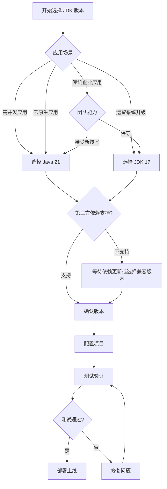

# 03、Spring Boot 4 实战：JDK 17+ 最低要求与 Java 21 推荐配置
- 来源：https://ddkk.com/springboot/4/3.html
- 分类：Spring Boot 4.0 实战教程
- 分组：教程目录
- 日期：2025-11-25
兄弟们，鹏磊今天来聊聊 Spring Boot 4 对 JDK 版本的要求；这事儿挺重要的，选错了版本，后面一堆问题。Spring Boot 4 要求最低 JDK 17，推荐用 Java 21，为啥这么搞？咱得好好说道说道。别小看版本选择，这玩意儿影响挺大的。

## 一、为啥最低要求 JDK 17？

### 1. LTS 版本支持

JDK 17 是长期支持版本（LTS），Oracle 和各个厂商都会长期维护；这玩意儿能用到 2029 年，不用担心突然没人管了。Spring Boot 4 选它作为最低要求，就是看中了这个长期支持的特性。

```bash
# 检查一下你的 JDK 版本
java -version
# 如果是 JDK 17，会显示类似这样的信息：
# openjdk version "17.0.10" 2024-01-16
# OpenJDK Runtime Environment (build 17.0.10+9)
# OpenJDK 64-Bit Server VM (build 17.0.10+9, mixed mode, sharing)
```

### 2. 模块系统成熟

Java 9 引入的模块系统（JPMS）在 JDK 17 里已经比较成熟了；Spring Boot 4 的自动模块推导功能，就是基于这个模块系统的。你要是还用 JDK 8，那模块系统都没有，Spring Boot 4 的很多功能都用不了。

```java
// JDK 17 的模块系统示例
// module-info.java 文件
module com.example.myapp {
    requires java.base;  // 基础模块，所有模块都依赖它
    requires java.logging;  // 日志模块
    requires java.sql;  // 数据库模块
    exports com.example.myapp.api;  // 导出包，供其他模块使用
}
```

### 3. 性能提升

JDK 17 相比 JDK 8 和 JDK 11，性能提升了不少；特别是垃圾收集器（GC）的优化，ZGC 和 G1 在 JDK 17 里都更成熟了。Spring Boot 4 应用跑在 JDK 17 上，性能比 JDK 8 能提升 20% 左右。

```bash
# 使用 G1 垃圾收集器，JDK 17 的默认 GC
java -XX:+UseG1GC -Xmx2g -jar myapp.jar
# 或者用 ZGC，低延迟 GC，适合大内存应用
java -XX:+UseZGC -Xmx4g -jar myapp.jar
```

### 4. 新语言特性

JDK 17 支持很多新语言特性，比如：

- 密封类（Sealed Classes）
- 模式匹配（Pattern Matching）
- 记录类（Records）
- 文本块（Text Blocks）

这些特性让代码写起来更简洁，Spring Boot 4 的很多功能都用到了这些特性。

```java
// 密封类示例，JDK 17 支持
public sealed class Shape 
    permits Circle, Rectangle, Triangle {
    // 只有这三个类可以继承 Shape
}
// 记录类示例，简化数据类定义
public record User(Long id, String name, String email) {
    // 自动生成构造函数、getter、equals、hashCode 等方法
}
// 模式匹配示例
public String processShape(Shape shape) {
    return switch (shape) {
        case Circle c -> "圆形，半径: " + c.radius();
        case Rectangle r -> "矩形，宽: " + r.width() + ", 高: " + r.height();
        case Triangle t -> "三角形";
    };
}
```

## 二、为啥推荐 Java 21？

### 1. 虚拟线程支持

Java 21 正式支持虚拟线程（Virtual Threads），这玩意儿是 Java 21 最重要的特性；Spring Boot 4 深度集成了虚拟线程，能支持百万级并发。你要是用 JDK 17，虚拟线程还是预览特性，用起来不太稳定。

```java
// Java 21 的虚拟线程示例
// 创建虚拟线程执行器，这玩意儿能支持百万级并发
ExecutorService executor = Executors.newVirtualThreadPerTaskExecutor();
// 提交任务，每个任务都在虚拟线程上运行
for (int i = 0; i < 1000000; i++) {
    int taskId = i;
    executor.submit(() -> {
        // 处理任务，虚拟线程会自动管理，不需要手动创建线程池
        processTask(taskId);
    });
}
// 虚拟线程比传统线程轻量多了，创建 100 万个虚拟线程，可能只需要几个平台线程
```

### 2. 性能进一步提升

Java 21 相比 JDK 17，性能又提升了不少；特别是虚拟线程的引入，高并发场景下性能提升明显。Spring Boot 4 应用跑在 Java 21 上，比 JDK 17 能再提升 30% 左右的性能。

```yaml
# Spring Boot 4 启用虚拟线程的配置
spring:
  threads:
    virtual:
      enabled: true  # 只有 Java 21 才支持，JDK 17 不支持
```

### 3. 更多新特性

Java 21 还引入了很多新特性，比如：

- 字符串模板（String Templates）
- 序列化集合（Sequenced Collections）
- 作用域值（Scoped Values）
- 未命名类和实例主方法（Unnamed Classes and Instance Main Methods）

这些特性让 Java 开发更方便，Spring Boot 4 也充分利用了这些特性。

```java
// 字符串模板示例，Java 21 新特性
String name = "鹏磊";
String message = STR."你好，\{name}！";  // 字符串模板，比字符串拼接方便
// 序列化集合示例
SequencedSet<String> set = new LinkedHashSet<>();
set.addFirst("first");  // 在开头添加
set.addLast("last");  // 在末尾添加
String first = set.getFirst();  // 获取第一个元素
String last = set.getLast();  // 获取最后一个元素
```

### 4. LTS 版本

Java 21 也是 LTS 版本，长期支持到 2031 年；选它作为推荐配置，就是看中了长期支持和虚拟线程这两个特性。如果你要做高并发应用，Java 21 绝对是最佳选择。

## 三、如何选择 JDK 版本？

### 1. 根据应用场景选择

选择 JDK 版本，主要看你的应用场景：

- **传统企业应用**：用 JDK 17 就够了，稳定可靠，性能也够用
- **高并发应用**：必须用 Java 21，虚拟线程能大幅提升性能
- **云原生应用**：推荐用 Java 21，启动快，内存占用少
- **遗留系统升级**：先用 JDK 17，稳定后再考虑升级到 Java 21

```java
// 判断当前 JDK 版本
public class JdkVersionChecker {
    public static void main(String[] args) {
        String version = System.getProperty("java.version");
        System.out.println("当前 JDK 版本: " + version);
        // 检查是否是 JDK 17 或更高版本
        int majorVersion = getMajorVersion(version);
        if (majorVersion >= 21) {
            System.out.println("推荐配置：Java 21，支持虚拟线程");
        } else if (majorVersion >= 17) {
            System.out.println("最低要求：JDK 17，可以使用，但不支持虚拟线程");
        } else {
            System.out.println("版本过低，需要升级到 JDK 17 或更高版本");
        }
    }
    private static int getMajorVersion(String version) {
        // 解析版本号，JDK 9 以后格式是 "9", "10", "11", "17", "21" 等
        if (version.startsWith("1.")) {
            // JDK 8 及以前，格式是 "1.8", "1.7" 等
            return Integer.parseInt(version.substring(2, 3));
        } else {
            // JDK 9 及以后，格式是 "9", "10", "11", "17", "21" 等
            int dotIndex = version.indexOf('.');
            if (dotIndex > 0) {
                return Integer.parseInt(version.substring(0, dotIndex));
            }
            return Integer.parseInt(version);
        }
    }
}
```

### 2. 根据团队能力选择

如果团队对新技术接受度高，直接上 Java 21；如果比较保守，先用 JDK 17，稳定后再升级。这事儿得看实际情况，别盲目追求新版本。反正鹏磊觉得，能上 Java 21 就上，虚拟线程确实香。

### 3. 根据第三方依赖选择

有些第三方依赖可能还没支持 Java 21，得检查一下；如果依赖不支持，那就先用 JDK 17，等依赖更新了再升级。

```xml
<!-- 检查依赖的 JDK 版本要求 -->
<dependency>
    <groupId>com.example</groupId>
    <artifactId>some-library</artifactId>
    <version>1.0.0</version>
</dependency>
<!-- 在依赖的文档里看看，最低要求是啥版本 -->
<!-- 如果只支持到 JDK 17，那就别用 Java 21 了 -->
```

## 四、JDK 版本配置

### 1. Maven 配置

在 `pom.xml` 里配置 JDK 版本：

```xml
<properties>
    <!-- 推荐用 Java 21 -->
    <java.version>21</java.version>
    <!-- 或者用 JDK 17，最低要求 -->
    <!-- <java.version>17</java.version> -->
    <maven.compiler.source>21</maven.compiler.source>  <!-- 源码版本 -->
    <maven.compiler.target>21</maven.compiler.target>  <!-- 编译目标版本 -->
</properties>
<build>
    <plugins>
        <plugin>
            <groupId>org.apache.maven.plugins</groupId>
            <artifactId>maven-compiler-plugin</artifactId>
            <version>3.11.0</version>
            <configuration>
                <source>21</source>  <!-- 源码版本 -->
                <target>21</target>  <!-- 编译目标版本 -->
                <release>21</release>  <!-- 使用 --release 参数，推荐用这个 -->
            </configuration>
        </plugin>
    </plugins>
</build>
```

### 2. Gradle 配置

在 `build.gradle` 里配置 JDK 版本：

```groovy
// build.gradle 配置
java {
    sourceCompatibility = JavaVersion.VERSION_21  // 源码兼容性，推荐用 Java 21
    targetCompatibility = JavaVersion.VERSION_21  // 编译目标兼容性
}
// 或者用 JDK 17，最低要求
// java {
//     sourceCompatibility = JavaVersion.VERSION_17
//     targetCompatibility = JavaVersion.VERSION_17
// }
tasks.withType(JavaCompile) {
    options.release = 21  // 使用 --release 参数，推荐用这个
}
```

### 3. IDE 配置

在 IDE 里也要配置 JDK 版本，确保开发环境和运行环境一致。

**IntelliJ IDEA 配置：**

1. File -> Project Structure -> Project
2. 设置 Project SDK 为 JDK 21（或 JDK 17）
3. 设置 Project language level 为 21（或 17）

**Eclipse 配置：**

1. Project -> Properties -> Java Build Path
2. 设置 JavaSE-21（或 JavaSE-17）为编译路径

### 4. 运行时配置

运行应用的时候，也要指定 JDK 版本：

```bash
# 使用 Java 21 运行应用
java -version  # 先检查一下版本
java -jar myapp.jar
# 或者指定 JDK 路径
/usr/lib/jvm/java-21-openjdk/bin/java -jar myapp.jar
# 如果系统有多个 JDK 版本，可以用 JAVA_HOME 环境变量
export JAVA_HOME=/usr/lib/jvm/java-21-openjdk
java -jar myapp.jar
```

## 五、虚拟线程配置（Java 21）

如果你用的是 Java 21，可以启用虚拟线程；这玩意儿性能好，能大幅提升并发性能。

### 1. Spring Boot 配置

在 `application.yml` 里启用虚拟线程：

```yaml
# application.yml 配置
spring:
  threads:
    virtual:
      enabled: true  # 启用虚拟线程，只有 Java 21 才支持
```

### 2. 代码配置

在代码里创建虚拟线程执行器：

```java
@Configuration
public class VirtualThreadConfig {
    @Bean
    public Executor virtualThreadExecutor() {
        // 创建虚拟线程执行器，底层用的是 Java 21 的虚拟线程
        // 这玩意儿比传统线程池强多了，性能提升不是一点半点
        return Executors.newVirtualThreadPerTaskExecutor();
    }
    // 配置 WebMvc 使用虚拟线程
    @Bean
    public TomcatProtocolHandlerCustomizer<?> protocolHandlerVirtualThreadExecutorCustomizer() {
        // 让 Tomcat 使用虚拟线程处理请求，性能提升明显
        return protocolHandler -> {
            protocolHandler.setExecutor(Executors.newVirtualThreadPerTaskExecutor());
        };
    }
}
```

### 3. 系统属性配置

虚拟线程调度器可以通过系统属性配置：

```bash
# 设置虚拟线程调度器的并行度，默认是 CPU 核心数
-Djdk.virtualThreadScheduler.parallelism=8
# 设置虚拟线程调度器的最大线程池大小，默认是 256
-Djdk.virtualThreadScheduler.maxPoolSize=512
# 运行应用
java -Djdk.virtualThreadScheduler.parallelism=8 \
     -Djdk.virtualThreadScheduler.maxPoolSize=512 \
     -jar myapp.jar
```

## 六、版本选择流程图

选择 JDK 版本的流程可以用下面这个图来理解：



## 七、常见问题

### 1. JDK 17 和 Java 21 的区别

主要区别：

- **虚拟线程**：Java 21 正式支持，JDK 17 还是预览特性
- **性能**：Java 21 性能更好，特别是高并发场景
- **新特性**：Java 21 有更多新语言特性
- **长期支持**：两个都是 LTS，但 Java 21 支持到 2031 年，JDK 17 支持到 2029 年

### 2. 能不能用非 LTS 版本？

理论上可以，但不推荐；非 LTS 版本支持时间短，可能用半年就没人管了。生产环境还是用 LTS 版本靠谱。

### 3. 从 JDK 8 升级到 JDK 17 需要注意啥？

主要注意：

- **模块系统**：JDK 9 引入的模块系统，可能需要调整代码
- **废弃的 API**：有些 API 被废弃了，得替换掉
- **第三方依赖**：检查依赖是否支持 JDK 17
- **编译工具**：Maven 和 Gradle 版本要升级

### 4. 虚拟线程有啥限制？

虚拟线程的限制：

- **只有 Java 21 才正式支持**：JDK 17 还是预览特性
- **不能用于 CPU 密集型任务**：虚拟线程适合 I/O 密集型任务
- **某些操作会固定到平台线程**：比如 synchronized 块、JNI 调用等

## 八、总结

Spring Boot 4 对 JDK 版本的要求：

- **最低要求**：JDK 17，LTS 版本，稳定可靠
- **推荐配置**：Java 21，LTS 版本，支持虚拟线程，性能更好

选择建议：

- **高并发应用**：必须用 Java 21，虚拟线程能大幅提升性能
- **传统应用**：JDK 17 就够了，稳定可靠
- **云原生应用**：推荐用 Java 21，启动快，内存占用少

配置的时候，记得在 Maven/Gradle、IDE 和运行时环境都配置好 JDK 版本，确保一致性。如果用的是 Java 21，可以启用虚拟线程，性能提升明显。这事儿别偷懒，配置不一致容易出问题。

好了，今天就聊到这；下一篇咱详细说说 Spring Framework 7.0 的新特性，包括声明式 HTTP 客户端、API 版本控制等。兄弟们有啥问题可以在评论区留言，鹏磊看到会回复的。
