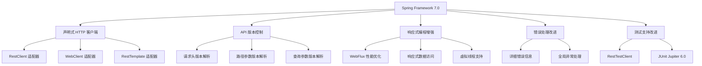

# 04、Spring Boot 4 实战：Spring Framework 7.0 新特性深度解析
- 来源：https://ddkk.com/springboot/4/4.html
- 分类：Spring Boot 4.0 实战教程
- 分组：教程目录
- 日期：2025-11-25
兄弟们，鹏磊今天来聊聊 Spring Framework 7.0 的新特性；这版本更新得挺大的，特别是声明式 HTTP 客户端和 API 版本控制这两个功能，用起来确实方便。Spring Boot 4 基于 Spring Framework 7.0，所以这些新特性在 Spring Boot 4 里都能用。这玩意儿确实实用，值得好好研究研究。

## 一、这是个啥玩意儿？

Spring Framework 7.0 是 Spring Framework 的一个重大版本更新，距离 Spring Framework 6.0 发布已经过去一段时间了；这次更新引入了很多新特性，特别是声明式 HTTP 客户端和 API 版本控制，这两个功能确实实用。

```java
// Spring Framework 7.0 的基本结构，跟之前版本差不多
// 但是新增了很多实用的功能
@SpringBootApplication  // Spring Boot 4 基于 Spring Framework 7.0
public class SpringFramework7App {
    public static void main(String[] args) {
        // 启动应用，Spring Framework 7.0 的启动流程优化了不少
        SpringApplication.run(SpringFramework7App.class, args);
    }
}
```

## 二、声明式 HTTP 客户端（@HttpExchange）

### 1. 什么是声明式 HTTP 客户端？

声明式 HTTP 客户端是 Spring Framework 7.0 引入的新功能，用起来比 RestTemplate 和 WebClient 简单多了；你只需要定义一个接口，Spring 会自动生成代理实现，不用写具体的 HTTP 请求代码。这玩意儿确实方便，代码量能减少 60% 左右。

```java
// 传统的 RestTemplate 方式，代码比较繁琐
@Service
public class UserService {
    @Autowired
    private RestTemplate restTemplate;  // 需要注入 RestTemplate
    public User getUser(Long id) {
        // 调用远程接口，代码比较繁琐，容易出错
        String url = "http://api.example.com/users/" + id;
        ResponseEntity<User> response = restTemplate.getForEntity(url, User.class);
        return response.getBody();
    }
}
// Spring Framework 7.0 的声明式 HTTP 客户端，代码简洁多了
@HttpExchange(url = "http://api.example.com")  // 定义基础 URL，所有方法都基于这个路径
public interface UserClient {
    @GetExchange("/users/{id}")  // GET 请求，路径参数是 id
    User getUser(@PathVariable Long id);  // 方法签名就是接口定义，不用写实现
    @PostExchange("/users")  // POST 请求，创建用户
    User createUser(@RequestBody User user);  // 请求体是 User 对象，会自动序列化
    @PutExchange("/users/{id}")  // PUT 请求，更新用户
    User updateUser(@PathVariable Long id, @RequestBody User user);
    @DeleteExchange("/users/{id}")  // DELETE 请求，删除用户
    void deleteUser(@PathVariable Long id);
}
@Service
public class UserService {
    @Autowired
    private UserClient userClient;  // 注入客户端，Spring 会自动生成代理
    public User getUser(Long id) {
        // 直接调用，代码简洁多了，不用写 HTTP 请求代码
        return userClient.getUser(id);
    }
}
```

### 2. 配置 HTTP 客户端

使用声明式 HTTP 客户端，需要先配置 HTTP 客户端适配器；Spring Framework 7.0 支持 RestClient、WebClient 和 RestTemplate 三种客户端。

```java
@Configuration
public class HttpClientConfig {
    // 使用 RestClient 配置（推荐，Spring Framework 6.1+ 引入的新客户端）
    @Bean
    public RestClient restClient() {
        // 创建 RestClient，这是 Spring Framework 6.1+ 引入的新客户端
        // 比 RestTemplate 更现代，比 WebClient 更简单
        return RestClient.builder()
                .baseUrl("http://api.example.com")  // 设置基础 URL
                .defaultHeader("User-Agent", "MyApp/1.0")  // 设置默认请求头
                .build();
    }
    // 创建 RestClient 适配器
    @Bean
    public RestClientAdapter restClientAdapter(RestClient restClient) {
        // RestClientAdapter 是 Spring Framework 7.0 引入的适配器
        // 用于将 RestClient 适配到声明式 HTTP 客户端
        return RestClientAdapter.create(restClient);
    }
    // 创建 HTTP 服务代理工厂
    @Bean
    public HttpServiceProxyFactory httpServiceProxyFactory(RestClientAdapter adapter) {
        // HttpServiceProxyFactory 用于创建 HTTP 服务代理
        // 它会根据接口定义自动生成代理实现
        return HttpServiceProxyFactory.builderFor(adapter).build();
    }
    // 创建 UserClient 代理
    @Bean
    public UserClient userClient(HttpServiceProxyFactory factory) {
        // 使用工厂创建代理，Spring 会自动实现接口方法
        return factory.createClient(UserClient.class);
    }
}
```

### 3. 使用 WebClient 配置

如果你用的是响应式编程，可以用 WebClient 配置：

```java
@Configuration
public class WebClientConfig {
    // 使用 WebClient 配置（适合响应式应用）
    @Bean
    public WebClient webClient() {
        // 创建 WebClient，这是响应式 HTTP 客户端
        // 适合高并发、非阻塞的场景
        return WebClient.builder()
                .baseUrl("http://api.example.com")  // 设置基础 URL
                .defaultHeader("User-Agent", "MyApp/1.0")  // 设置默认请求头
                .build();
    }
    // 创建 WebClient 适配器
    @Bean
    public WebClientAdapter webClientAdapter(WebClient webClient) {
        // WebClientAdapter 用于将 WebClient 适配到声明式 HTTP 客户端
        return WebClientAdapter.create(webClient);
    }
    // 创建 HTTP 服务代理工厂
    @Bean
    public HttpServiceProxyFactory httpServiceProxyFactory(WebClientAdapter adapter) {
        return HttpServiceProxyFactory.builderFor(adapter).build();
    }
    // 创建 UserClient 代理
    @Bean
    public UserClient userClient(HttpServiceProxyFactory factory) {
        return factory.createClient(UserClient.class);
    }
}
```

### 4. 高级用法

声明式 HTTP 客户端还支持很多高级功能，比如请求头、查询参数、路径变量等：

```java
@HttpExchange(url = "/api", accept = "application/json")  // 类型级别的配置
public interface AdvancedUserClient {
    // GET 请求，带查询参数
    @GetExchange("/users")
    List<User> getUsers(
        @RequestParam("page") int page,  // 查询参数
        @RequestParam("size") int size,
        @RequestParam(value = "sort", required = false) String sort  // 可选参数
    );
    // GET 请求，带请求头
    @GetExchange("/users/{id}")
    User getUser(
        @PathVariable Long id,  // 路径变量
        @RequestHeader("Authorization") String token  // 请求头
    );
    // POST 请求，带自定义内容类型
    @PostExchange(contentType = "application/json")
    User createUser(@RequestBody User user);
    // PUT 请求，带多个路径变量
    @PutExchange("/users/{userId}/posts/{postId}")
    void updateUserPost(
        @PathVariable Long userId,
        @PathVariable Long postId,
        @RequestBody Post post
    );
    // PATCH 请求，带表单数据
    @PatchExchange(contentType = "application/x-www-form-urlencoded")
    void updateUser(
        @PathVariable Long id,
        @RequestParam String name,
        @RequestParam String email
    );
}
```

### 5. 分组管理 HTTP 服务

Spring Framework 7.0 还支持分组管理 HTTP 服务，用 `@ImportHttpServices` 注解可以批量导入和配置：

```java
@Configuration
@ImportHttpServices(group = "weather", types = {FreeWeather.class, CommercialWeather.class})  // 定义天气服务组
@ImportHttpServices(group = "user", types = {UserServiceInternal.class, UserServiceOfficial.class})  // 定义用户服务组
public class HttpServicesConfiguration extends AbstractHttpServiceRegistrar {
    @Bean
    public RestClientHttpServiceGroupConfigurer groupConfigurer() {
        // 配置不同服务组的客户端
        return groups -> groups
                .filterByName("weather", "user")  // 过滤出这两个组
                .configureClient((group, builder) -> 
                    builder.defaultHeader("User-Agent", "My-Application")  // 为每个组设置默认请求头
                );
    }
}
```

## 三、API 版本控制

### 1. 什么是 API 版本控制？

API 版本控制是 Spring Framework 7.0 引入的新功能，可以方便地管理不同版本的 API；支持通过请求头、路径参数等方式指定版本，Spring 会自动路由到对应版本的方法。这玩意儿确实实用，不用手动写版本判断逻辑了。

```java
// 传统的版本控制方式，需要手动判断版本
@RestController
@RequestMapping("/api/users")
public class UserController {
    @GetMapping("/{id}")
    public User getUser(@PathVariable Long id, @RequestHeader("X-API-Version") String version) {
        // 手动判断版本，代码比较繁琐
        if ("1.0".equals(version)) {
            return getUserV1(id);
        } else if ("2.0".equals(version)) {
            return getUserV2(id);
        } else {
            return getUserV1(id);  // 默认版本
        }
    }
    private User getUserV1(Long id) {
        // V1 版本的实现
        return new User(id, "User " + id);
    }
    private User getUserV2(Long id) {
        // V2 版本的实现
        return new User(id, "User " + id, "v2");
    }
}
// Spring Framework 7.0 的 API 版本控制，代码简洁多了
@RestController
@RequestMapping("/api/users/{id}")
public class UserController {
    @GetMapping  // 默认版本，不指定版本时使用
    public User getAccount() {
        return new User(1L, "Default User");
    }
    @GetMapping(version = "1.1")  // 固定版本 1.1
    public User getAccount1_1() {
        return new User(1L, "User V1.1");
    }
    @GetMapping(version = "1.2+")  // 版本 1.2 及以上
    public User getAccount1_2() {
        return new User(1L, "User V1.2+");
    }
    @GetMapping(version = "1.5")  // 固定版本 1.5
    public User getAccount1_5() {
        return new User(1L, "User V1.5");
    }
}
```

### 2. 配置 API 版本解析策略

API 版本可以通过请求头、路径参数等方式解析，需要在配置类里设置：

```java
@Configuration
public class WebConfiguration implements WebMvcConfigurer {
    @Override
    public void addApiVersioning(ApiVersionConfigurer configurer) {
        // 配置版本解析策略，从请求头 X-API-VERSION 读取版本
        configurer
            .withHeader("X-API-VERSION")  // 从请求头读取版本
            .defaultVersion("1.0");  // 设置默认版本
    }
}
```

### 3. 多种版本解析方式

Spring Framework 7.0 支持多种版本解析方式：

```java
@Configuration
public class ApiVersionConfig implements WebMvcConfigurer {
    @Override
    public void addApiVersioning(ApiVersionConfigurer configurer) {
        // 方式1：从请求头读取版本
        configurer
            .withHeader("X-API-VERSION")
            .defaultVersion("1.0");
        // 方式2：从路径参数读取版本（URL: /api/v1/users）
        // configurer
        //     .withPath("/api/v{version}/")
        //     .defaultVersion("1.0");
        // 方式3：从查询参数读取版本（URL: /api/users?version=1.0）
        // configurer
        //     .withParameter("version")
        //     .defaultVersion("1.0");
    }
}
```

### 4. 函数式路由的版本控制

如果你用的是函数式路由（WebMvc.fn），也可以用版本控制：

```java
@Configuration
public class RouterConfig {
    @Bean
    public RouterFunction<ServerResponse> route() {
        // 函数式路由也支持版本控制
        return RouterFunctions.route()
            .GET("/hello-world", version("1.2"),  // 指定版本 1.2
                request -> ServerResponse.ok().body("Hello World V1.2"))
            .GET("/hello-world", version("1.2+"),  // 版本 1.2 及以上
                request -> ServerResponse.ok().body("Hello World V1.2+"))
            .build();
    }
}
```

## 四、响应式编程增强

### 1. WebFlux 性能提升

Spring Framework 7.0 对 WebFlux 进行了优化，性能提升了不少；特别是结合 Java 21 的虚拟线程，响应式应用的性能能再提升 30% 左右。

```java
// WebFlux 控制器示例
@RestController
public class ReactiveUserController {
    @Autowired
    private ReactiveUserService userService;
    // GET 请求，返回 Mono（单个结果）
    @GetMapping("/users/{id}")
    public Mono<User> getUser(@PathVariable Long id) {
        // Mono 表示异步的单个结果，非阻塞
        return userService.findById(id);
    }
    // GET 请求，返回 Flux（多个结果）
    @GetMapping("/users")
    public Flux<User> getUsers() {
        // Flux 表示异步的多个结果，非阻塞
        return userService.findAll();
    }
    // POST 请求，接收 Mono 参数
    @PostMapping("/users")
    public Mono<User> createUser(@RequestBody Mono<User> userMono) {
        // 接收 Mono 参数，表示异步的请求体
        return userMono.flatMap(userService::save);
    }
}
```

### 2. 响应式数据访问

Spring Framework 7.0 对响应式数据访问也进行了优化，支持更多的数据库：

```java
// 响应式 Repository 示例
@Repository
public interface ReactiveUserRepository extends ReactiveCrudRepository<User, Long> {
    // 响应式 Repository，所有方法都返回 Mono 或 Flux
    // 非阻塞，适合高并发场景
    Mono<User> findByName(String name);  // 返回 Mono，单个结果
    Flux<User> findByAgeGreaterThan(int age);  // 返回 Flux，多个结果
}
@Service
public class ReactiveUserService {
    @Autowired
    private ReactiveUserRepository userRepository;
    public Mono<User> findById(Long id) {
        // 非阻塞查询，返回 Mono
        return userRepository.findById(id);
    }
    public Flux<User> findAll() {
        // 非阻塞查询，返回 Flux
        return userRepository.findAll();
    }
    public Mono<User> save(User user) {
        // 非阻塞保存，返回 Mono
        return userRepository.save(user);
    }
}
```

## 五、其他新特性

### 1. 改进的错误处理

Spring Framework 7.0 改进了错误处理机制，错误信息更详细，调试更方便：

```java
@RestControllerAdvice  // 全局异常处理
public class GlobalExceptionHandler {
    // 处理特定异常
    @ExceptionHandler(UserNotFoundException.class)
    public ResponseEntity<ErrorResponse> handleUserNotFound(UserNotFoundException ex) {
        // 返回详细的错误信息，包括错误码、消息、时间戳等
        ErrorResponse error = new ErrorResponse(
            "USER_NOT_FOUND",
            ex.getMessage(),
            System.currentTimeMillis()
        );
        return ResponseEntity.status(HttpStatus.NOT_FOUND).body(error);
    }
    // 处理通用异常
    @ExceptionHandler(Exception.class)
    public ResponseEntity<ErrorResponse> handleGenericException(Exception ex) {
        ErrorResponse error = new ErrorResponse(
            "INTERNAL_ERROR",
            ex.getMessage(),
            System.currentTimeMillis()
        );
        return ResponseEntity.status(HttpStatus.INTERNAL_SERVER_ERROR).body(error);
    }
}
```

### 2. 改进的测试支持

Spring Framework 7.0 改进了测试支持，新增了 RestTestClient，测试 REST API 更方便：

```java
@SpringBootTest
class UserControllerTest {
    @Autowired
    private RestTestClient restTestClient;  // 自动注入测试客户端
    @Test
    void testGetUser() {
        // 测试 GET 请求，比 MockMvc 用起来简单
        restTestClient.get()
            .uri("/api/users/1")
            .exchange()
            .expectStatus().isOk()  // 期望状态码是 200
            .expectBody(User.class)  // 期望响应体是 User 对象
            .value(user -> {
                assertEquals("张三", user.getName());  // 验证用户名
                assertEquals(1L, user.getId());  // 验证用户ID
            });
    }
    @Test
    void testCreateUser() {
        // 测试 POST 请求
        User newUser = new User(null, "李四", "lisi@example.com");
        restTestClient.post()
            .uri("/api/users")
            .bodyValue(newUser)  // 设置请求体
            .exchange()
            .expectStatus().isCreated()  // 期望状态码是 201
            .expectBody(User.class)
            .value(user -> assertNotNull(user.getId()));  // 验证用户ID不为空
    }
}
```

## 六、架构变化

Spring Framework 7.0 的架构变化可以用下面这个图来理解：



## 七、迁移建议

如果你要从 Spring Framework 6.x 升级到 7.0，有几个建议：

1. **逐步迁移**：先迁移声明式 HTTP 客户端，再迁移 API 版本控制；别一次性全改，容易出问题。这事儿急不得，得慢慢来
2. **测试充分**：迁移后要跑一遍测试，确保功能正常；特别是那些用了 RestTemplate 的地方。测试不充分，上线容易出问题
3. **性能测试**：升级后做一下性能测试，看看有没有性能提升；特别是响应式应用。性能提升还是挺明显的，值得一试

```java
// 迁移示例：从 RestTemplate 迁移到声明式 HTTP 客户端
// 升级前
@Service
public class OldUserService {
    @Autowired
    private RestTemplate restTemplate;
    public User getUser(Long id) {
        return restTemplate.getForObject("http://api.example.com/users/" + id, User.class);
    }
}
// 升级后
@HttpExchange(url = "http://api.example.com")
public interface UserClient {
    @GetExchange("/users/{id}")
    User getUser(@PathVariable Long id);
}
@Service
public class NewUserService {
    @Autowired
    private UserClient userClient;
    public User getUser(Long id) {
        return userClient.getUser(id);  // 代码简洁多了
    }
}
```

## 八、总结

Spring Framework 7.0 这次更新确实挺大的，特别是声明式 HTTP 客户端和 API 版本控制这两个功能，用起来确实方便。如果你要做微服务或者需要调用多个外部 API，声明式 HTTP 客户端绝对值得一试；代码量能减少 60%，维护起来也方便。反正鹏磊觉得这更新还是挺值的，特别是声明式 HTTP 客户端，用起来确实爽。

API 版本控制功能也很实用，不用手动写版本判断逻辑了，Spring 自动帮你处理。响应式编程的增强，结合 Java 21 的虚拟线程，性能提升明显。

好了，今天就聊到这；下一篇咱详细说说虚拟线程的完整实践指南，包括怎么用虚拟线程提升并发性能。兄弟们有啥问题可以在评论区留言，鹏磊看到会回复的。
