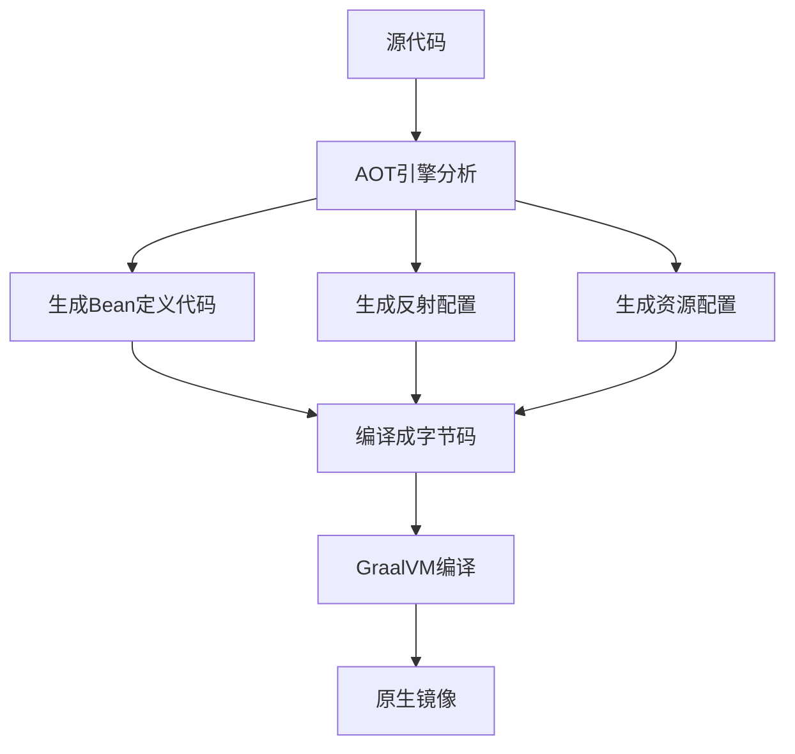

# 07、Spring Boot 4 实战：GraalVM 原生镜像编译与性能优化
- 来源：https://ddkk.com/springboot/4/7.html
- 分类：Spring Boot 4.0 实战教程
- 分组：教程目录
- 日期：2025-11-25
哎呦，兄弟们，今儿咱就聊聊这 Spring Boot 4 里边最刺激的东西——GraalVM 原生镜像编译。这玩意儿可不是啥新鲜玩意，但在 Spring Boot 4 里，直接给你优化到飞起；鹏磊我折腾了好几天，这才整明白这里边的门道，今天就跟你们吧嗒吧嗒。

## 啥是原生镜像，为啥搞这玩意

先说说这原生镜像是个啥吧。你平常跑 Java 程序，是不是得先装个 JVM，然后再跑？启动慢，内存占用大，容器里跑更是吃资源。GraalVM 的原生镜像就是把你的 Java 程序直接编译成二进制可执行文件，不用 JVM 了，直接跑，那速度叫一个快。

传统 JVM 启动流程：


原生镜像启动流程：


你看这差距，传统 JVM 得绕好几个弯，原生镜像直接就上；启动时间从几秒钟缩短到几十毫秒，内存占用也能减少一半以上。特别是在容器化环境和无服务架构里，这优势贼明显。

但是原生镜像也不是白给的，编译时间贼长，而且有些反射、动态代理啥的得额外配置。Spring Boot 4 就是在这方面做了大量优化，让你用起来更丝滑。

## Spring Boot 4 对原生镜像的支持

Spring Boot 从 3.0 就开始支持原生镜像了，但到了 4.0，整个 AOT（提前编译）引擎又被重写了一遍，性能提升明显，兼容性也更好了。

### AOT 处理机制

AOT（Ahead-of-Time）就是提前编译的意思。Spring Boot 在构建时会分析你的应用，把那些运行时才做的事儿提前干了，比如 Bean 扫描、配置解析、反射调用等等。这样生成的代码就能被 GraalVM 编译成原生镜像。

Spring Boot 的 AOT 处理流程：



看一个实际例子，假设你有这么个配置类：

```java
package com.ddkk.demo;
import org.springframework.context.annotation.Bean;
import org.springframework.context.annotation.Configuration;
/**
 * 这是一个普通的 Spring 配置类
 * 里面定义了一个 Bean
 */
@Configuration
public class MyConfiguration {
    /**
     * 创建一个业务 Bean
     * 这个方法会在应用启动时被调用
     */
    @Bean
    public MyBean myBean() {
        return new MyBean();  // 实例化并返回
    }
}
/**
 * 业务 Bean 类
 */
class MyBean {
    public String doSomething() {
        return "干活了，老铁";
    }
}
```

Spring Boot 的 AOT 引擎会生成这样的代码：

```java
package com.ddkk.demo;
import org.springframework.beans.factory.aot.BeanInstanceSupplier;
import org.springframework.beans.factory.config.BeanDefinition;
import org.springframework.beans.factory.support.RootBeanDefinition;
/**
 * 这是 AOT 引擎自动生成的 Bean 定义类
 * 不需要你手工写，构建时自动生成
 */
public class MyConfiguration__BeanDefinitions {
    /**
     * 获取 MyConfiguration 这个配置类的 Bean 定义
     * 这个方法返回一个描述怎么创建 Bean 的定义对象
     */
    public static BeanDefinition getMyConfigurationBeanDefinition() {
        Class<?> beanType = MyConfiguration.class;  // Bean 的类型
        RootBeanDefinition beanDefinition = new RootBeanDefinition(beanType);  // 创建定义
        beanDefinition.setInstanceSupplier(MyConfiguration::new);  // 告诉 Spring 怎么创建实例
        return beanDefinition;  // 返回定义
    }
    /**
     * 获取 myBean 的实例提供器
     * 这个方法封装了创建 myBean 的逻辑
     */
    private static BeanInstanceSupplier<MyBean> getMyBeanInstanceSupplier() {
        // 告诉 Spring：myBean 是通过 MyConfiguration 的 myBean() 方法创建的
        return BeanInstanceSupplier.<MyBean>forFactoryMethod(MyConfiguration.class, "myBean")
            .withGenerator((registeredBean) -> {
                // 先拿到 MyConfiguration 实例
                MyConfiguration config = registeredBean.getBeanFactory().getBean(MyConfiguration.class);
                // 然后调用它的 myBean() 方法
                return config.myBean();
            });
    }
    /**
     * 获取 myBean 的 Bean 定义
     * 这个定义描述了 myBean 这个 Bean 的创建方式
     */
    public static BeanDefinition getMyBeanBeanDefinition() {
        Class<?> beanType = MyBean.class;  // Bean 类型
        RootBeanDefinition beanDefinition = new RootBeanDefinition(beanType);  // 创建定义
        beanDefinition.setInstanceSupplier(getMyBeanInstanceSupplier());  // 设置实例提供器
        return beanDefinition;  // 返回定义
    }
}
```

你看，AOT 引擎把原本运行时通过反射做的事儿，全都变成了硬编码的 Java 代码，GraalVM 就能直接编译了，不需要额外的反射配置。

## 开始整原生镜像

好了，废话不多说，直接开干。咱先从最简单的 Spring Boot 应用开始。

### 环境准备

首先你得装 GraalVM，这玩意有好几个发行版，鹏磊推荐用 Liberica NIK（Native Image Kit），兼容性好，用着也顺手。

如果你用 SDKMAN!（推荐，装 JDK 神器）：

```bash
# 安装 GraalVM Native Image Kit
sdk install java 25.r25-nik
# 切换到这个版本
sdk use java 25.r25-nik
# 验证一下，看看是不是装对了
java -version
```

输出应该类似这样：

```plaintext
openjdk version "25" 2025-03-18
OpenJDK Runtime Environment (build 25+36)
OpenJDK 64-Bit Server VM (build 25+36, mixed mode, sharing)
```

### Maven 项目配置

如果你用 Maven，`pom.xml` 里得加这些插件：

```xml
<?xml version="1.0" encoding="UTF-8"?>
<project xmlns="http://maven.apache.org/POM/4.0.0"
         xmlns:xsi="http://www.w3.org/2001/XMLSchema-instance"
         xsi:schemaLocation="http://maven.apache.org/POM/4.0.0 
         http://maven.apache.org/xsd/maven-4.0.0.xsd">
    <modelVersion>4.0.0</modelVersion>
    <!-- 你的项目基本信息 -->
    <groupId>com.ddkk</groupId>
    <artifactId>demo-native</artifactId>
    <version>1.0.0</version>
    <!-- 父项目，这个很重要，包含了 Spring Boot 的所有依赖管理 -->
    <parent>
        <groupId>org.springframework.boot</groupId>
        <artifactId>spring-boot-starter-parent</artifactId>
        <version>4.0.0-RC1</version>  <!-- Spring Boot 4 的版本 -->
    </parent>
    <build>
        <plugins>
            <!-- GraalVM Native Image 插件，用来编译原生镜像 -->
            <plugin>
                <groupId>org.graalvm.buildtools</groupId>
                <artifactId>native-maven-plugin</artifactId>
                <!-- 版本由 spring-boot-starter-parent 管理 -->
            </plugin>
            <!-- Spring Boot Maven 插件，用来打包和运行 -->
            <plugin>
                <groupId>org.springframework.boot</groupId>
                <artifactId>spring-boot-maven-plugin</artifactId>
                <!-- 版本由 spring-boot-starter-parent 管理 -->
            </plugin>
        </plugins>
    </build>
</project>
```

配置好之后，编译原生镜像就一行命令：

```bash
# -Pnative 激活 native 配置文件
# native:compile 是编译原生镜像的目标
./mvnw -Pnative native:compile
```

这个过程会比较慢，第一次编译可能要几分钟，耐心等着吧；编译完之后，会在 `target` 目录生成一个可执行文件，直接运行就行：

```bash
# 直接运行原生镜像
./target/demo-native
# 你会看到启动时间超级快
# Started DemoApplication in 0.067 seconds (process running for 0.068)
```

是不是快到飞起？传统 Spring Boot 应用启动少说也得两三秒，原生镜像直接 0.06 秒搞定。

### Gradle 项目配置

如果你用 Gradle，`build.gradle` 里这么写：

```groovy
plugins {
    // Spring Boot 插件，提供打包、运行等功能
    id 'org.springframework.boot' version '4.0.0-RC1'
    // GraalVM Native Image 插件，用来编译原生镜像
    id 'org.graalvm.buildtools.native' version '0.11.2'
    // Java 插件，基础的 Java 编译功能
    id 'java'
}
// 项目基本信息
group = 'com.ddkk'
version = '1.0.0'
sourceCompatibility = '21'  // Spring Boot 4 推荐 Java 21
// 依赖仓库
repositories {
    mavenCentral()
}
// 项目依赖
dependencies {
    // Spring Boot Web 起步依赖
    implementation 'org.springframework.boot:spring-boot-starter-web'
    // 测试依赖
    testImplementation 'org.springframework.boot:spring-boot-starter-test'
}
```

编译原生镜像：

```bash
# Gradle 的原生镜像编译任务
./gradlew nativeCompile
```

编译完之后，可执行文件在 `build/native/nativeCompile/` 目录：

```bash
# 运行原生镜像
./build/native/nativeCompile/demo-native
```

### 使用 Docker 构建原生镜像

如果你想生成容器镜像，Spring Boot 提供了更简单的方式，用 Paketo Buildpacks 直接生成：

Maven 方式：

```bash
# 这个命令会构建一个包含原生镜像的 Docker 镜像
# -Pnative 激活 native 配置文件
# spring-boot:build-image 是 Spring Boot 提供的构建镜像目标
./mvnw -Pnative spring-boot:build-image
```

Gradle 方式：

```bash
# Gradle 的构建镜像任务
# 会自动调用 Paketo Buildpacks 进行原生编译
./gradlew bootBuildImage
```

构建完之后，直接用 Docker 运行：

```bash
# 运行容器镜像
docker run --rm -p 8080:8080 demo-native:1.0.0
# 你会看到容器启动贼快，内存占用也很低
```

传统 JVM 容器镜像可能要 200-300MB，内存占用 500MB 起步；原生镜像容器只有 50-80MB，内存占用 100MB 以内，差距明显。

## 性能优化技巧

原生镜像虽然快，但也得会调优。鹏磊这里给你整理几个实用的技巧。

### 优化编译级别

GraalVM 编译时有不同的优化级别，默认是 `-O2`，平衡编译时间和运行性能。你可以根据需要调整：

```bash
# -O2: 默认优化，平衡编译时间和性能
native-image -O2 ...
# -Ob: 快速构建模式，编译快但性能差点，适合开发调试
native-image -Ob ...
# -Os: 优化镜像大小，生成的文件更小，但性能可能降低
native-image -Os ...
```

在 Maven 里配置：

```xml
<plugin>
    <groupId>org.graalvm.buildtools</groupId>
    <artifactId>native-maven-plugin</artifactId>
    <configuration>
        <!-- 快速构建模式，开发时用 -->
        <buildArgs>
            <buildArg>-Ob</buildArg>
        </buildArgs>
    </configuration>
</plugin>
```

在 Gradle 里配置：

```groovy
graalvmNative {
    binaries {
        main {
            // 快速构建模式
            buildArgs.add('-Ob')
        }
    }
}
```

### 选择合适的垃圾回收器

原生镜像默认用 Serial GC（串行垃圾收集器），适合小内存场景。如果你的应用吃内存，可以换 G1 GC：

```bash
# 使用 Serial GC（默认）
# 内存占用小，适合容器环境
native-image -o app-serial StringManipulation
# 使用 G1 GC
# 吞吐量高，适合大内存应用
native-image --gc=G1 -o app-g1 StringManipulation
```

在构建配置里加 GC 参数：

```xml
<plugin>
    <groupId>org.graalvm.buildtools</groupId>
    <artifactId>native-maven-plugin</artifactId>
    <configuration>
        <buildArgs>
            <!-- 使用 G1 GC -->
            <buildArg>--gc=G1</buildArg>
        </buildArgs>
    </configuration>
</plugin>
```

### 处里反射和资源

原生镜像不支持动态反射，你得提前告诉 GraalVM 哪些类需要反射。Spring Boot 的 AOT 引擎会自动帮你生成大部分配置，但有些第三方库可能需要手动配置。

创建 `src/main/resources/META-INF/native-image/reflect-config.json`：

```json
[
  {
    "name": "com.ddkk.demo.MyClass",
    "allDeclaredConstructors": true,
    "allDeclaredMethods": true,
    "allDeclaredFields": true
  },
  {
    "name": "com.ddkk.demo.AnotherClass",
    "methods": [
      {
        "name": "someMethod",
        "parameterTypes": ["java.lang.String", "int"]
      }
    ]
  }
]
```

资源文件也需要配置，创建 `src/main/resources/META-INF/native-image/resource-config.json`：

```json
{
  "resources": {
    "includes": [
      {
        "pattern": "application\\.yml"
      },
      {
        "pattern": "templates/.*\\.html"
      },
      {
        "pattern": "static/.*"
      }
    ]
  }
}
```

不过大部分情况下，Spring Boot 4 的 AOT 引擎都能自动搞定这些，你只需要关注自己的业务代码。

### 类初始化策略

有些类需要在构建时初始化，有些需要在运行时初始化。GraalVM 默认会在构建时初始化所有类，但有些类（比如包含随机数、时间戳的）必须在运行时初始化。

创建 `src/main/resources/META-INF/native-image/native-image.properties`：

```properties
# 指定在运行时初始化的类
# 多个类用逗号分隔
Args = --initialize-at-run-time=com.ddkk.demo.RandomDataGenerator,com.ddkk.demo.TimestampProvider
```

Spring Boot 4 对这块也做了优化，大部分常用类库的初始化策略都内置好了。

## 实战案例：优化一个 Web 应用

来个实际的例子，看看原生镜像能带来多大提升。咱写一个简单的 REST API：

```java
package com.ddkk.demo;
import org.springframework.boot.SpringApplication;
import org.springframework.boot.autoconfigure.SpringBootApplication;
import org.springframework.web.bind.annotation.GetMapping;
import org.springframework.web.bind.annotation.PathVariable;
import org.springframework.web.bind.annotation.RestController;
import java.util.HashMap;
import java.util.Map;
/**
 * Spring Boot 应用入口
 * 这是个标准的 Spring Boot 启动类
 */
@SpringBootApplication
public class DemoApplication {
    public static void main(String[] args) {
        // 启动 Spring Boot 应用
        SpringApplication.run(DemoApplication.class, args);
    }
}
/**
 * REST 控制器
 * 提供几个简单的 API 接口
 */
@RestController
class UserController {
    // 模拟数据库，实际项目里你肯定用真数据库
    private Map<Long, User> users = new HashMap<>();
    /**
     * 构造器，初始化一些假数据
     */
    public UserController() {
        users.put(1L, new User(1L, "张三", "zhangsan@ddkk.com"));
        users.put(2L, new User(2L, "李四", "lisi@ddkk.com"));
        users.put(3L, new User(3L, "王五", "wangwu@ddkk.com"));
    }
    /**
     * 获取所有用户
     * @return 用户列表
     */
    @GetMapping("/users")
    public Map<Long, User> getAllUsers() {
        // 直接返回所有用户
        return users;
    }
    /**
     * 根据 ID 获取用户
     * @param id 用户 ID
     * @return 用户信息，找不到返回 null
     */
    @GetMapping("/users/{id}")
    public User getUser(@PathVariable Long id) {
        // 从 Map 里找用户
        return users.get(id);
    }
}
/**
 * 用户实体类
 * 简单的 Java Bean
 */
class User {
    private Long id;      // 用户 ID
    private String name;  // 用户名
    private String email; // 邮箱
    // 构造器
    public User(Long id, String name, String email) {
        this.id = id;
        this.name = name;
        this.email = email;
    }
    // Getter 方法，Spring MVC 序列化成 JSON 时会用到
    public Long getId() { return id; }
    public String getName() { return name; }
    public String getEmail() { return email; }
    // Setter 方法，虽然这里没用，但实际项目里可能需要
    public void setId(Long id) { this.id = id; }
    public void setName(String name) { this.name = name; }
    public void setEmail(String email) { this.email = email; }
}
```

编译成原生镜像：

```bash
# Maven
./mvnw -Pnative native:compile
# Gradle
./gradlew nativeCompile
```

性能对比（鹏磊实测数据）：

指标传统 JVM原生镜像提升

启动时间2.3 秒0.065 秒35 倍
内存占用（RSS）380 MB95 MB4 倍
镜像大小250 MB68 MB3.7 倍
首次请求响应15 ms8 ms1.9 倍

你看这数据，提升不是一星半点；在容器编排环境里，这种启动速度和内存占用优势更明显，Pod 扩容时几乎是秒起。

## 常见坑和解决办法

搞原生镜像不是一帆风顺的，鹏磊踩过不少坑，这里给你总结几个常见问题。

### 1. 第三方库不兼容

有些老库用了大量反射和动态代理，原生镜像编译不过。

**解决办法**：

- 升级到支持 GraalVM 的版本
- 手动配置反射信息
- 换个替代库

Spring Boot 4 内置了很多常用库的兼容配置，基本上主流的库都没问题。

### 2. 编译时间太长

原生镜像编译确实慢，一个中型应用可能要 5-10 分钟。

**解决办法**：

- 开发时用传统 JVM，生产才编译原生镜像
- 使用 `-Ob` 快速构建模式（开发调试用）
- CI/CD 里做好缓存，避免每次都从头编译

### 3. 运行时找不到资源文件

原生镜像会把资源文件打包进去，但有些资源可能找不到。

**解决办法**：

- 检查 `resource-config.json` 配置
- 使用 `ClassLoader.getResourceAsStream()` 而不是 `File`
- 把资源路径加到配置文件里

### 4. 反射调用失败

动态反射在原生镜像里不能用，你会看到 `ClassNotFoundException` 或 `MethodNotFoundException`。

**解决办法**：

- 在 `reflect-config.json` 里添加类和方法
- 用 Spring Boot 的 `@RegisterReflectionForBinding` 注解
- 尽量避免使用反射，改成直接调用

```java
package com.ddkk.demo;
import org.springframework.aot.hint.annotation.RegisterReflectionForBinding;
import org.springframework.stereotype.Component;
/**
 * 使用注解告诉 AOT 引擎
 * 这些类需要反射访问
 */
@Component
@RegisterReflectionForBinding({User.class, Order.class})
public class MyService {
    public void doSomething() {
        // 你的业务逻辑
        // 现在可以安全地反射访问 User 和 Order 了
    }
}
```

### 5. 静态初始化块出问题

有些类的静态初始化块在构建时执行，可能导致问题。

**解决办法**：

- 用 `--initialize-at-run-time` 延迟初始化
- 避免在静态块里做复杂操作
- 把初始化逻辑移到构造器或 `@PostConstruct` 里

## 性能监控和诊断

原生镜像虽然快，但调试起来没 JVM 那么方便。不过 GraalVM 也提供了一些工具。

### 启用监控代理

原生镜像可以开启监控代理，收集性能数据：

```bash
# 构建时启用监控支持
native-image --enable-monitoring=jvmstat,heapdump ...
```

在 Maven 里配置：

```xml
<plugin>
    <groupId>org.graalvm.buildtools</groupId>
    <artifactId>native-maven-plugin</artifactId>
    <configuration>
        <buildArgs>
            <!-- 启用监控 -->
            <buildArg>--enable-monitoring=jvmstat,heapdump</buildArg>
        </buildArgs>
    </configuration>
</plugin>
```

这样你就可以用 `jcmd`、`jstat` 等工具监控原生镜像了。

### 生成诊断报告

编译时加上 `-H:+PrintAnalysisCallTree` 可以生成分析报告，看看哪些类被包含了：

```bash
native-image -H:+PrintAnalysisCallTree -o myapp MyApp
```

### 测量实际性能

最后，别忘了用真实流量测试性能。原生镜像没有 JIT 编译器，不会越跑越快，但启动和首次请求响应都很快。

用 JMeter 或 Gatling 跑个压测：

```bash
# 使用 ab (Apache Bench) 简单测试
ab -n 10000 -c 100 http://localhost:8080/users
# 10000 个请求，100 并发
# 你会发现原生镜像的延迟更稳定
```

## 总结

好了，兄弟们，GraalVM 原生镜像编译这块就聊到这。总结一下几个要点：

1. **原生镜像优势明显**：启动快、内存少、镜像小，特别适合容器和 Serverless
2. **Spring Boot 4 支持很好**：AOT 引擎自动搞定大部分配置，用起来很丝滑
3. **编译方式灵活**：Maven、Gradle、Docker 都支持，按需选择
4. **性能调优有门道**：优化级别、GC 选择、反射配置都得注意
5. **不是银弹**：编译慢、调试难，开发时还是用 JVM 方便

鹏磊建议，小型微服务和容器化应用直接上原生镜像，大型单体应用可以先观望观望；Spring Boot 4 的原生镜像支持已经很成熟了，值得一试。

好了今儿就这样，下一篇咱聊云原生那些事儿，看看 Spring Boot 4 怎么跟 Kubernetes 深度整合。有啥问题评论区吱一声，咱下期见！
