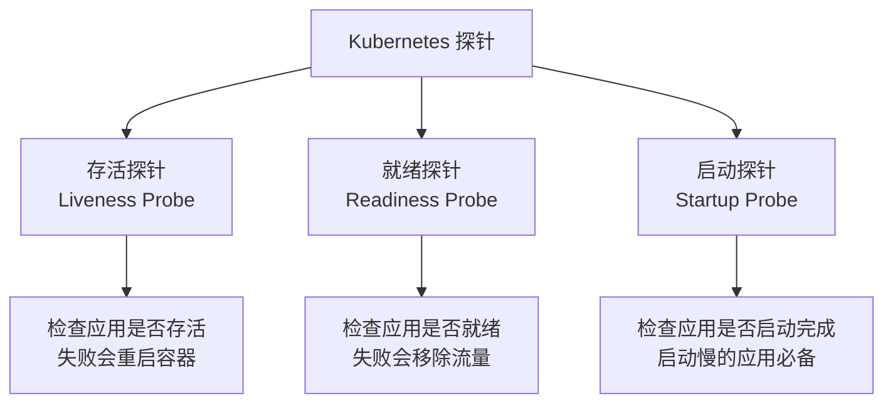

# 08、Spring Boot 4 实战：云原生深度融合：Kubernetes 探针配置实战
- 来源：https://ddkk.com/springboot/4/8.html
- 分类：Spring Boot 4.0 实战教程
- 分组：教程目录
- 日期：2025-11-25
兄弟们，今儿咱聊聊 Spring Boot 4 在 Kubernetes 里咋配置健康探针。鹏磊我最近在搞微服务改造，一堆服务扔到 K8s 里，结果探针配置不当，Pod 老是被杀掉重启，搞得我焦头烂额；经过这几天折腾，总算是把这块整明白了，今儿给你们好好唠唠。

## Kubernetes 探针是个啥

先说说这探针（Probe）是个啥玩意。在 Kubernetes 里，探针就是 K8s 用来检查你 Pod 健康状况的一种机制，类似医生给你做体检。K8s 通过探针知道你的应用是不是还活着、能不能接收流量、启动好了没有。

Kubernetes 有三种探针：



### 1. 存活探针（Liveness Probe）

这玩意用来检查应用是不是还活着。如果探针失败了，K8s 就认为你的 Pod 挂了，会直接把容器杀掉重启。

**适用场景**：

- 应用陷入死锁，虽然进程还在但已经不能正常工作了
- 数据库连接池耗尽，应用彻底不响应了
- 缓存完全崩了，应用无法恢复

**注意**：别乱用，配置不当会导致 Pod 频繁重启，那就是在搞自己。

### 2. 就绪探针（Readiness Probe）

这个是检查应用能不能接收流量。探针失败了，K8s 不会杀容器，只是把这个 Pod 从 Service 的负载均衡里摘掉，不给它分配新请求。

**适用场景**：

- 应用正在预热缓存，还不能处理请求
- 应用正在等待依赖服务启动
- 应用临时过载，需要暂停接收新流量

### 3. 启动探针（Startup Probe）

这个是专门给启动慢的应用用的。在应用启动期间，只检查启动探针，存活探针暂时不工作。启动完成后，启动探针就不管了，存活探针接管。

**适用场景**：

- 老旧的单体应用，启动要好几分钟
- Spring Boot 应用加载大量数据，启动慢
- 需要预热的应用（比如 JIT 编译）

## Spring Boot 4 的探针支持

Spring Boot 从 2.3 就开始支持 Kubernetes 探针了，到了 4.0 更是做了不少优化，用起来更顺手了。

### Actuator 健康端点

Spring Boot Actuator 提供了健康端点（Health Endpoint），K8s 探针就是通过这些端点检查应用状态的。

默认的健康端点：

```mermaid
graph LR
    A[Actuator 健康端点] --> B[/actuator/health]
    B --> C[/actuator/health/liveness]
    B --> D[/actuator/health/readiness]
    C --> C1[存活状态<br/>CORRECT/BROKEN]
    D --> D1[就绪状态<br/>ACCEPTING_TRAFFIC<br/>REFUSING_TRAFFIC]
```

**端点说明**：

- `/actuator/health`：总的健康状态，包含所有健康检查
- `/actuator/health/liveness`：存活状态，给 Liveness Probe 用
- `/actuator/health/readiness`：就绪状态，给 Readiness Probe 用

### 依赖配置

首先得引入 Actuator 依赖，Maven 配置：

```xml
<?xml version="1.0" encoding="UTF-8"?>
<project xmlns="http://maven.apache.org/POM/4.0.0"
         xmlns:xsi="http://www.w3.org/2001/XMLSchema-instance"
         xsi:schemaLocation="http://maven.apache.org/POM/4.0.0 
         http://maven.apache.org/xsd/maven-4.0.0.xsd">
    <modelVersion>4.0.0</modelVersion>
    <!-- 父项目，包含 Spring Boot 的依赖管理 -->
    <parent>
        <groupId>org.springframework.boot</groupId>
        <artifactId>spring-boot-starter-parent</artifactId>
        <version>4.0.0-RC1</version>  <!-- Spring Boot 4 版本 -->
    </parent>
    <groupId>com.ddkk</groupId>
    <artifactId>k8s-probe-demo</artifactId>
    <version>1.0.0</version>
    <dependencies>
        <!-- Spring Boot Web 起步依赖，提供 Web 功能 -->
        <dependency>
            <groupId>org.springframework.boot</groupId>
            <artifactId>spring-boot-starter-web</artifactId>
        </dependency>
        <!-- Spring Boot Actuator，提供健康检查端点 -->
        <dependency>
            <groupId>org.springframework.boot</groupId>
            <artifactId>spring-boot-starter-actuator</artifactId>
        </dependency>
    </dependencies>
</project>
```

Gradle 配置：

```groovy
plugins {
    id 'org.springframework.boot' version '4.0.0-RC1'
    id 'io.spring.dependency-management' version '1.1.4'
    id 'java'
}
group = 'com.ddkk'
version = '1.0.0'
sourceCompatibility = '21'  // Spring Boot 4 推荐 Java 21
dependencies {
    // Spring Boot Web 起步依赖
    implementation 'org.springframework.boot:spring-boot-starter-web'
    // Spring Boot Actuator，提供健康检查端点
    implementation 'org.springframework.boot:spring-boot-starter-actuator'
}
```

### 基本配置

在 `application.yml` 里开启探针支持：

```yaml
# Spring Boot 应用配置
spring:
  application:
    name: k8s-probe-demo  # 应用名称
# Actuator 配置
management:
  # 端点配置
  endpoints:
    web:
      exposure:
        # 暴露健康端点，生产环境要慎重，别把敏感信息暴露了
        include: health,info
  # 健康端点配置
  endpoint:
    health:
      # 显示详细的健康信息，方便调试
      # 生产环境建议设为 when-authorized，需要认证才能看详情
      show-details: always
      # 开启探针支持，这个必须设置
      probes:
        enabled: true
        # 在主端口上也暴露探针路径
        # 这样 K8s 探针可以直接访问应用端口，不用单独配置 management 端口
        add-additional-paths: true
```

properties 格式（如果你习惯用 properties）：

```properties
# 应用名称
spring.application.name=k8s-probe-demo
# 暴露健康端点
management.endpoints.web.exposure.include=health,info
# 显示健康详情
management.endpoint.health.show-details=always
# 开启探针支持
management.endpoint.health.probes.enabled=true
# 在主端口暴露探针路径
management.endpoint.health.probes.add-additional-paths=true
```

配置完之后，启动应用，访问这些端点试试：

```bash
# 访问总的健康端点
curl http://localhost:8080/actuator/health
# 返回结果
{
  "status": "UP",
  "components": {
    "diskSpace": {
      "status": "UP",
      "details": {
        "total": 500000000000,
        "free": 250000000000,
        "threshold": 10485760
      }
    },
    "ping": {
      "status": "UP"
    }
  },
  "groups": [
    "liveness",
    "readiness"
  ]
}
# 访问存活探针
curl http://localhost:8080/actuator/health/liveness
# 返回结果
{
  "status": "UP"
}
# 访问就绪探针
curl http://localhost:8080/actuator/health/readiness
# 返回结果
{
  "status": "UP"
}
```

## Kubernetes 部署配置

好了，Spring Boot 这边配置好了，现在看看 K8s 那边咋配。

### 基础 Deployment 配置

创建一个 `deployment.yaml`：

```yaml
apiVersion: apps/v1
kind: Deployment
metadata:
  name: spring-boot-app  # Deployment 名称
  labels:
    app: spring-boot-app  # 标签，用于选择器
spec:
  replicas: 3  # 副本数，3个 Pod
  selector:
    matchLabels:
      app: spring-boot-app  # 选择器，匹配 Pod 标签
  template:
    metadata:
      labels:
        app: spring-boot-app  # Pod 标签
    spec:
      containers:
      - name: app  # 容器名称
        image: your-registry/spring-boot-app:1.0.0  # 镜像地址
        ports:
        - containerPort: 8080  # 应用端口
          name: http
          protocol: TCP
        # 环境变量配置
        env:
        - name: SPRING_PROFILES_ACTIVE
          value: "prod"  # 激活生产环境配置
        # 资源限制，别让应用吃光资源
        resources:
          requests:
            memory: "512Mi"  # 请求 512MB 内存
            cpu: "500m"      # 请求 0.5 核 CPU
          limits:
            memory: "1Gi"    # 最多用 1GB 内存
            cpu: "1000m"     # 最多用 1 核 CPU
        # 存活探针配置
        livenessProbe:
          httpGet:
            path: /actuator/health/liveness  # 探针路径
            port: 8080                        # 探针端口
            scheme: HTTP                      # 协议
          initialDelaySeconds: 60  # 容器启动后等 60 秒再开始检查
          periodSeconds: 10        # 每 10 秒检查一次
          timeoutSeconds: 5        # 超时时间 5 秒
          successThreshold: 1      # 成功 1 次就认为健康
          failureThreshold: 3      # 失败 3 次才认为不健康，会重启容器
        # 就绪探针配置
        readinessProbe:
          httpGet:
            path: /actuator/health/readiness  # 探针路径
            port: 8080                         # 探针端口
            scheme: HTTP                       # 协议
          initialDelaySeconds: 30  # 容器启动后等 30 秒再开始检查
          periodSeconds: 5         # 每 5 秒检查一次，比存活探针频繁
          timeoutSeconds: 3        # 超时时间 3 秒
          successThreshold: 1      # 成功 1 次就认为就绪
          failureThreshold: 3      # 失败 3 次才认为未就绪，会从负载均衡摘掉
        # 启动探针配置（可选，启动慢的应用必须配）
        startupProbe:
          httpGet:
            path: /actuator/health/liveness  # 用存活探针的路径
            port: 8080
            scheme: HTTP
          initialDelaySeconds: 0   # 立即开始检查
          periodSeconds: 5         # 每 5 秒检查一次
          timeoutSeconds: 3        # 超时时间 3 秒
          successThreshold: 1      # 成功 1 次就认为启动完成
          failureThreshold: 30     # 失败 30 次（150 秒）才认为启动失败
        # 生命周期钩子，优雅关闭
        lifecycle:
          preStop:
            exec:
              # 容器停止前先等 10 秒，让流量切走
              command: ["sh", "-c", "sleep 10"]
```

**配置说明**：

1. **initialDelaySeconds**：容器启动后等多久开始检查，给应用预留启动时间
2. **periodSeconds**：检查频率，存活探针可以低一点，就绪探针要频繁一点
3. **timeoutSeconds**：单次检查的超时时间，别设太短
4. **failureThreshold**：连续失败多少次才认为不健康，防止偶尔的网络抖动导致重启
5. **preStop**：优雅关闭钩子，给应用时间处理完现有请求

### Kubernetes 1.32+ 的新写法

如果你用的是 Kubernetes 1.32 及以上版本，preStop 可以这么写，更简洁：

```yaml
lifecycle:
  preStop:
    sleep:
      seconds: 10  # 直接写秒数，不用 exec 命令了
```

### 探针参数调优

探针参数别乱配，得根据应用特点来；鹏磊给你总结几个常见场景的配置。

**场景 1：快速启动的轻量级应用**

```yaml
livenessProbe:
  httpGet:
    path: /actuator/health/liveness
    port: 8080
  initialDelaySeconds: 20  # 启动快，20 秒够了
  periodSeconds: 10
  timeoutSeconds: 3
  failureThreshold: 3
readinessProbe:
  httpGet:
    path: /actuator/health/readiness
    port: 8080
  initialDelaySeconds: 10  # 10 秒就能接收流量
  periodSeconds: 5
  timeoutSeconds: 2
  failureThreshold: 2
```

**场景 2：启动慢的单体应用**

```yaml
startupProbe:
  httpGet:
    path: /actuator/health/liveness
    port: 8080
  initialDelaySeconds: 0
  periodSeconds: 10
  timeoutSeconds: 5
  failureThreshold: 60  # 600 秒（10 分钟）的启动时间
livenessProbe:
  httpGet:
    path: /actuator/health/liveness
    port: 8080
  initialDelaySeconds: 0  # 有 startupProbe，这里不用延迟
  periodSeconds: 15
  timeoutSeconds: 5
  failureThreshold: 3
readinessProbe:
  httpGet:
    path: /actuator/health/readiness
    port: 8080
  initialDelaySeconds: 0
  periodSeconds: 5
  timeoutSeconds: 3
  failureThreshold: 3
```

**场景 3：高并发应用**

```yaml
readinessProbe:
  httpGet:
    path: /actuator/health/readiness
    port: 8080
  initialDelaySeconds: 30
  periodSeconds: 3  # 检查频繁，快速发现过载
  timeoutSeconds: 2
  failureThreshold: 2  # 失败阈值低，快速摘流量
livenessProbe:
  httpGet:
    path: /actuator/health/liveness
    port: 8080
  initialDelaySeconds: 60
  periodSeconds: 10
  timeoutSeconds: 5
  failureThreshold: 5  # 失败阈值高，避免频繁重启
```

## 自定义健康检查

默认的健康检查可能不够用，你得根据业务需求自定义。

### 自定义健康指示器

创建一个自定义的健康检查组件：

```java
package com.ddkk.demo.health;
import org.springframework.boot.actuate.health.Health;
import org.springframework.boot.actuate.health.HealthIndicator;
import org.springframework.stereotype.Component;
/**
 * 自定义健康检查：检查数据库连接
 * 这个会被自动注册到 Actuator 里
 */
@Component("database")  // 指定名称，会在健康端点里显示
public class DatabaseHealthIndicator implements HealthIndicator {
    /**
     * 执行健康检查
     * @return 健康状态
     */
    @Override
    public Health health() {
        try {
            // 这里写你的检查逻辑，比如查询数据库
            boolean dbConnected = checkDatabaseConnection();
            if (dbConnected) {
                // 数据库连接正常，返回 UP 状态
                return Health.up()
                    .withDetail("database", "MySQL")  // 添加详细信息
                    .withDetail("connection", "active")
                    .build();
            } else {
                // 数据库连接失败，返回 DOWN 状态
                return Health.down()
                    .withDetail("error", "无法连接到数据库")
                    .build();
            }
        } catch (Exception ex) {
            // 检查过程中出错，返回 DOWN 状态
            return Health.down()
                .withDetail("error", ex.getMessage())
                .withException(ex)  // 附带异常信息
                .build();
        }
    }
    /**
     * 实际的数据库连接检查逻辑
     * 这里是伪代码，你得根据实际情况实现
     */
    private boolean checkDatabaseConnection() {
        // 实际项目里，你可能会：
        // 1. 从连接池获取连接
        // 2. 执行一个简单的查询（比如 SELECT 1）
        // 3. 检查查询结果
        return true;  // 示例：假设连接正常
    }
}
```

### 自定义缓存健康检查

再来一个检查缓存的例子：

```java
package com.ddkk.demo.health;
import org.springframework.boot.actuate.health.Health;
import org.springframework.boot.actuate.health.HealthIndicator;
import org.springframework.stereotype.Component;
/**
 * 自定义健康检查：检查 Redis 缓存
 */
@Component("redisCache")
public class RedisCacheHealthIndicator implements HealthIndicator {
    // 假设你注入了 Redis 客户端
    // private final RedisTemplate<String, String> redisTemplate;
    @Override
    public Health health() {
        try {
            // 尝试 ping 一下 Redis
            // String pong = redisTemplate.getConnectionFactory()
            //     .getConnection().ping();
            String pong = "PONG";  // 示例返回
            if ("PONG".equals(pong)) {
                // Redis 正常
                return Health.up()
                    .withDetail("cache", "Redis")
                    .withDetail("response", "PONG")
                    .build();
            } else {
                // Redis 响应异常
                return Health.down()
                    .withDetail("error", "Redis 响应异常")
                    .build();
            }
        } catch (Exception ex) {
            // Redis 连接失败
            return Health.down()
                .withDetail("error", "无法连接到 Redis")
                .withDetail("message", ex.getMessage())
                .build();
        }
    }
}
```

### 配置健康检查分组

有些健康检查只在就绪探针里需要，有些只在存活探针里需要，你可以配置分组：

```yaml
management:
  endpoint:
    health:
      # 健康检查分组配置
      group:
        # 就绪探针组，包含更多检查项
        readiness:
          # 包含这些健康检查
          include: readinessState,database,redisCache
          # 显示详细信息
          show-details: always
        # 存活探针组，只检查基本存活状态
        liveness:
          # 只包含基本的存活状态检查
          include: livenessState
          show-details: always
```

properties 格式：

```properties
# 就绪探针组配置
management.endpoint.health.group.readiness.include=readinessState,database,redisCache
management.endpoint.health.group.readiness.show-details=always
# 存活探针组配置
management.endpoint.health.group.liveness.include=livenessState
management.endpoint.health.group.liveness.show-details=always
```

**为啥要分组**？

- **就绪探针**：检查依赖服务（数据库、缓存、消息队列），这些挂了应用也不能正常工作，得摘流量
- **存活探针**：只检查应用自身是否死锁、挂死，不检查外部依赖，避免因为外部服务故障导致 Pod 被重启

## 程序化控制应用状态

有时候你需要在代码里主动改变应用的健康状态，比如检测到无法恢复的错误时，主动标记为不健康。

### 标记应用为不可用

```java
package com.ddkk.demo.service;
import org.springframework.boot.availability.AvailabilityChangeEvent;
import org.springframework.boot.availability.LivenessState;
import org.springframework.context.ApplicationEventPublisher;
import org.springframework.stereotype.Component;
/**
 * 本地缓存验证器
 * 检查本地缓存是否完全损坏
 */
@Component
public class LocalCacheVerifier {
    // 事件发布器，用来发布状态变更事件
    private final ApplicationEventPublisher eventPublisher;
    public LocalCacheVerifier(ApplicationEventPublisher eventPublisher) {
        this.eventPublisher = eventPublisher;
    }
    /**
     * 检查本地缓存
     * 如果缓存完全损坏，标记应用为不可用
     */
    public void checkLocalCache() {
        try {
            // 这里是你的缓存检查逻辑
            // 比如检查缓存文件是否损坏、缓存服务是否响应等
            // 假设检查失败，抛出异常
            // throw new CacheCompletelyBrokenException("缓存彻底挂了");
        } catch (Exception ex) {
            // 缓存完全损坏，无法恢复
            // 发布事件，标记应用为 BROKEN（不可用）
            // K8s 的 Liveness Probe 会检测到，然后重启容器
            AvailabilityChangeEvent.publish(
                this.eventPublisher,  // 事件发布器
                ex,                    // 导致问题的异常
                LivenessState.BROKEN   // 新的状态：损坏
            );
            // 记录日志
            System.err.println("本地缓存完全损坏，应用已标记为不可用: " + ex.getMessage());
        }
    }
}
```

### 控制就绪状态

有时候你需要暂停接收流量，比如应用正在进行数据同步，这时候可以主动设置就绪状态：

```java
package com.ddkk.demo.service;
import org.springframework.boot.availability.AvailabilityChangeEvent;
import org.springframework.boot.availability.ReadinessState;
import org.springframework.context.ApplicationEventPublisher;
import org.springframework.stereotype.Service;
/**
 * 数据同步服务
 * 在数据同步期间拒绝接收新流量
 */
@Service
public class DataSyncService {
    private final ApplicationEventPublisher eventPublisher;
    public DataSyncService(ApplicationEventPublisher eventPublisher) {
        this.eventPublisher = eventPublisher;
    }
    /**
     * 同步数据
     * 同步期间应用不接受流量
     */
    public void syncData() {
        try {
            // 标记为拒绝流量
            // K8s 的 Readiness Probe 会检测到，把这个 Pod 从负载均衡摘掉
            AvailabilityChangeEvent.publish(
                this.eventPublisher,
                this,
                ReadinessState.REFUSING_TRAFFIC  // 拒绝流量
            );
            System.out.println("开始同步数据，暂停接收流量...");
            // 执行数据同步
            performDataSync();
            System.out.println("数据同步完成，恢复接收流量");
        } finally {
            // 同步完成，恢复为接受流量
            // K8s 会重新把这个 Pod 加入负载均衡
            AvailabilityChangeEvent.publish(
                this.eventPublisher,
                this,
                ReadinessState.ACCEPTING_TRAFFIC  // 接受流量
            );
        }
    }
    /**
     * 实际的数据同步逻辑
     */
    private void performDataSync() {
        // 你的同步逻辑
        // 比如从远程拉取数据、更新本地缓存等
        try {
            Thread.sleep(5000);  // 模拟同步耗时
        } catch (InterruptedException e) {
            Thread.currentThread().interrupt();
        }
    }
}
```

### 监听状态变化

你还可以监听状态变化事件，做一些额外操作，比如写文件给 K8s 的 exec 探针用：

```java
package com.ddkk.demo.listener;
import org.springframework.boot.availability.AvailabilityChangeEvent;
import org.springframework.boot.availability.ReadinessState;
import org.springframework.context.event.EventListener;
import org.springframework.stereotype.Component;
import java.io.File;
import java.io.IOException;
/**
 * 就绪状态导出器
 * 监听就绪状态变化，写文件给 K8s exec 探针用
 */
@Component
public class ReadinessStateExporter {
    /**
     * 监听就绪状态变化事件
     * @param event 状态变化事件
     */
    @EventListener
    public void onStateChange(AvailabilityChangeEvent<ReadinessState> event) {
        // 根据新状态执行操作
        switch (event.getState()) {
            case ACCEPTING_TRAFFIC -> {
                // 应用就绪，创建 /tmp/healthy 文件
                // K8s 的 exec 探针可以检查这个文件是否存在
                createHealthyFile();
                System.out.println("应用就绪，创建健康文件");
            }
            case REFUSING_TRAFFIC -> {
                // 应用未就绪，删除 /tmp/healthy 文件
                removeHealthyFile();
                System.out.println("应用未就绪，删除健康文件");
            }
        }
    }
    /**
     * 创建健康文件
     */
    private void createHealthyFile() {
        File healthyFile = new File("/tmp/healthy");
        try {
            // 创建文件，如果已存在就不管
            healthyFile.createNewFile();
        } catch (IOException e) {
            System.err.println("无法创建健康文件: " + e.getMessage());
        }
    }
    /**
     * 删除健康文件
     */
    private void removeHealthyFile() {
        File healthyFile = new File("/tmp/healthy");
        // 删除文件，如果不存在就不管
        healthyFile.delete();
    }
}
```

对应的 K8s 配置（使用 exec 探针）：

```yaml
readinessProbe:
  exec:
    command:
    - cat
    - /tmp/healthy  # 检查文件是否存在
  initialDelaySeconds: 30
  periodSeconds: 5
```

## 实战案例：带数据库的微服务

来个完整的例子，一个连接数据库和 Redis 的微服务，看看咋配置探针。

### 应用代码

```java
package com.ddkk.demo;
import org.springframework.boot.SpringApplication;
import org.springframework.boot.autoconfigure.SpringBootApplication;
import org.springframework.web.bind.annotation.GetMapping;
import org.springframework.web.bind.annotation.RestController;
import java.util.HashMap;
import java.util.Map;
/**
 * Spring Boot 应用入口
 */
@SpringBootApplication
public class MicroserviceApplication {
    public static void main(String[] args) {
        SpringApplication.run(MicroserviceApplication.class, args);
    }
}
/**
 * 简单的 REST 控制器
 */
@RestController
class ApiController {
    /**
     * 健康检查端点（业务用）
     * K8s 探针用 Actuator 的端点，这个是给前端或监控系统用的
     */
    @GetMapping("/api/health")
    public Map<String, String> health() {
        Map<String, String> response = new HashMap<>();
        response.put("status", "OK");
        response.put("message", "服务运行正常");
        return response;
    }
    /**
     * 业务接口
     */
    @GetMapping("/api/data")
    public Map<String, Object> getData() {
        // 这里是你的业务逻辑
        // 查数据库、查缓存等
        Map<String, Object> data = new HashMap<>();
        data.put("timestamp", System.currentTimeMillis());
        data.put("message", "这是业务数据");
        return data;
    }
}
```

### 应用配置

`application.yml`：

```yaml
spring:
  application:
    name: microservice-demo
  # 数据源配置（示例）
  datasource:
    url: jdbc:mysql://mysql-service:3306/demo
    username: root
    password: ${DB_PASSWORD}  # 从环境变量读取密码
    driver-class-name: com.mysql.cj.jdbc.Driver
  # Redis 配置（示例）
  data:
    redis:
      host: redis-service
      port: 6379
# Actuator 配置
management:
  endpoints:
    web:
      exposure:
        # 只暴露健康和信息端点，别把所有端点都暴露了
        include: health,info
  endpoint:
    health:
      # 生产环境建议 when-authorized，需要认证才显示详情
      show-details: always
      probes:
        enabled: true
        add-additional-paths: true
      # 健康检查分组
      group:
        # 就绪探针：检查数据库和 Redis
        readiness:
          include: readinessState,db,redis
          show-details: always
        # 存活探针：只检查应用自身
        liveness:
          include: livenessState
          show-details: always
# 服务器配置
server:
  port: 8080
  # 优雅关闭，给应用时间处理完现有请求
  shutdown: graceful
# 优雅关闭超时时间
spring:
  lifecycle:
    timeout-per-shutdown-phase: 30s  # 最多等 30 秒
```

### Kubernetes 完整配置

`k8s-deployment.yaml`：

```yaml
apiVersion: v1
kind: Service
metadata:
  name: microservice-demo  # Service 名称
spec:
  selector:
    app: microservice-demo  # 选择带这个标签的 Pod
  ports:
  - name: http
    port: 80        # Service 端口
    targetPort: 8080  # 转发到 Pod 的端口
    protocol: TCP
  type: ClusterIP  # 集群内部访问
---
apiVersion: apps/v1
kind: Deployment
metadata:
  name: microservice-demo
spec:
  replicas: 3  # 3 个副本
  # 滚动更新策略
  strategy:
    type: RollingUpdate
    rollingUpdate:
      maxSurge: 1        # 更新时最多多出 1 个 Pod
      maxUnavailable: 0  # 更新时不允许有 Pod 不可用
  selector:
    matchLabels:
      app: microservice-demo
  template:
    metadata:
      labels:
        app: microservice-demo
    spec:
      containers:
      - name: app
        image: your-registry/microservice-demo:1.0.0
        ports:
        - containerPort: 8080
          name: http
        # 环境变量
        env:
        - name: SPRING_PROFILES_ACTIVE
          value: "prod"
        - name: DB_PASSWORD
          valueFrom:
            secretKeyRef:
              name: db-secret  # 从 Secret 读取数据库密码
              key: password
        # 资源配置
        resources:
          requests:
            memory: "768Mi"
            cpu: "500m"
          limits:
            memory: "1536Mi"
            cpu: "1000m"
        # 启动探针：给应用充足的启动时间
        startupProbe:
          httpGet:
            path: /actuator/health/liveness
            port: 8080
          initialDelaySeconds: 0
          periodSeconds: 5
          timeoutSeconds: 3
          failureThreshold: 30  # 150 秒启动时间
        # 存活探针：只检查应用自身
        livenessProbe:
          httpGet:
            path: /actuator/health/liveness
            port: 8080
          initialDelaySeconds: 0
          periodSeconds: 10
          timeoutSeconds: 5
          failureThreshold: 3
        # 就绪探针：检查所有依赖
        readinessProbe:
          httpGet:
            path: /actuator/health/readiness
            port: 8080
          initialDelaySeconds: 0
          periodSeconds: 5
          timeoutSeconds: 3
          failureThreshold: 2
        # 生命周期钩子
        lifecycle:
          preStop:
            exec:
              command: ["sh", "-c", "sleep 15"]  # 等 15 秒让流量切走
```

### 部署到 K8s

```bash
# 创建数据库密码 Secret
kubectl create secret generic db-secret \
  --from-literal=password='your-db-password'
# 部署应用
kubectl apply -f k8s-deployment.yaml
# 查看 Pod 状态
kubectl get pods -l app=microservice-demo
# 查看 Pod 详情，看探针状态
kubectl describe pod <pod-name>
# 查看日志
kubectl logs -f <pod-name>
```

## 常见问题和坑

鹏磊踩过的坑给你总结一下，省得你再跳。

### 1. Pod 频繁重启

**现象**：Pod 老是被 K8s 杀掉重启。

**原因**：

- Liveness Probe 的 `failureThreshold` 设置太低
- `initialDelaySeconds` 太短，应用还没启动好就开始检查
- 探针路径配错了，返回 404

**解决**：

- 增大 `failureThreshold`，给应用一些容错空间
- 增加 `initialDelaySeconds`，或者用 Startup Probe
- 检查探针路径，确保能访问

### 2. 服务流量分配不均

**现象**：有些 Pod 流量很大，有些 Pod 没流量。

**原因**：Readiness Probe 失败，Pod 被摘掉了。

**解决**：

- 查看 Pod 事件：`kubectl describe pod `
- 检查就绪探针日志，看看为啥失败
- 优化就绪探针的检查逻辑

### 3. 滚动更新慢或失败

**现象**：滚动更新很慢，或者一直失败。

**原因**：

- 新 Pod 一直不就绪
- `maxUnavailable` 设置不合理

**解决**：

- 确保新版本能通过就绪探针
- 调整滚动更新策略，增加 `maxSurge`

### 4. 优雅关闭不生效

**现象**：Pod 停止时，还在处理的请求被中断。

**原因**：

- 没配置 `preStop` 钩子
- `terminationGracePeriodSeconds` 太短

**解决**：

- 加上 `preStop` 钩子，延迟 10-15 秒
- 增加 `terminationGracePeriodSeconds`（默认 30 秒）
- 应用配置 `server.shutdown=graceful`

### 5. 依赖服务导致 Pod 重启

**现象**：数据库或 Redis 短暂不可用，Pod 被重启了。

**原因**：Liveness Probe 里包含了依赖服务检查。

**解决**：

- Liveness Probe 只检查应用自身，不检查依赖
- 依赖服务的检查放到 Readiness Probe 里

## 总结

好了兄弟们，Kubernetes 探针配置就聊到这。总结几个要点：

1. **三种探针各有用途**：Liveness 检查存活，Readiness 检查就绪，Startup 给启动慢的应用用
2. **Spring Boot 4 支持完善**：Actuator 自动提供探针端点，开箱即用
3. **探针参数要调优**：根据应用特点配置，别用默认值
4. **健康检查要分组**：Liveness 只检查自身，Readiness 检查依赖
5. **优雅关闭很重要**：配置 preStop 钩子和 graceful shutdown

鹏磊建议，先在测试环境把探针配置调好，跑压测验证一下，再上生产；探针配置不当会导致各种诡异问题，千万别大意。

好了今天就这样，下一篇咱聊 Kubernetes 自动伸缩和服务网格，看看咋根据流量自动扩缩容。有啥问题评论区吱声，咱下期见！
